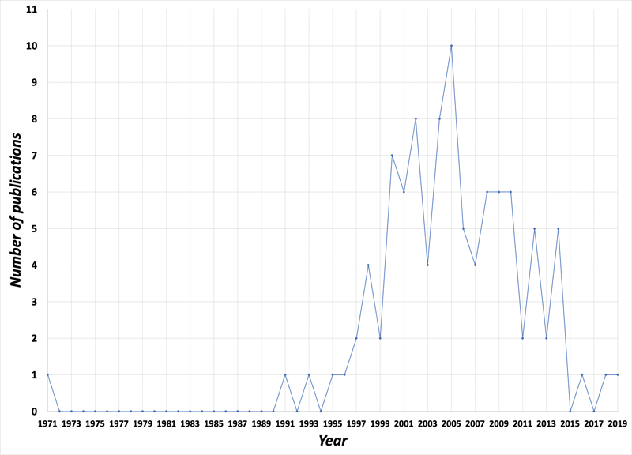
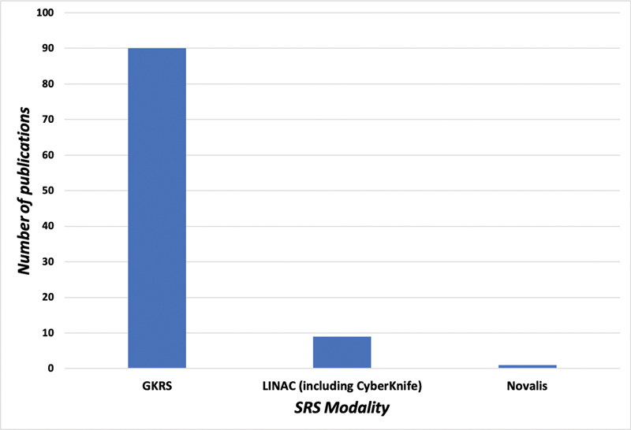
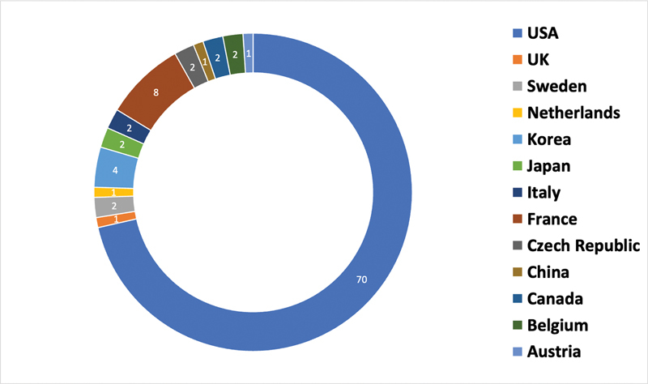
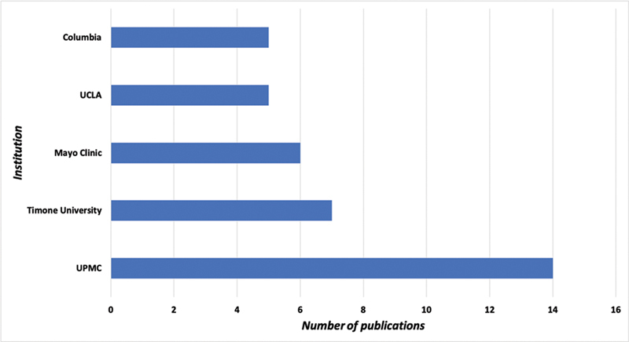
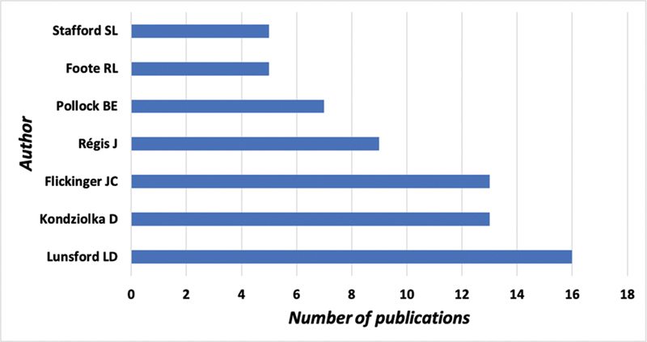
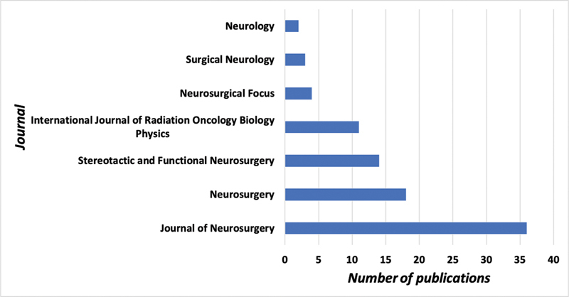
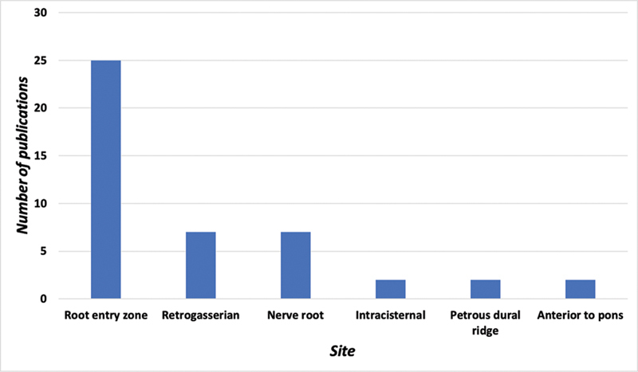
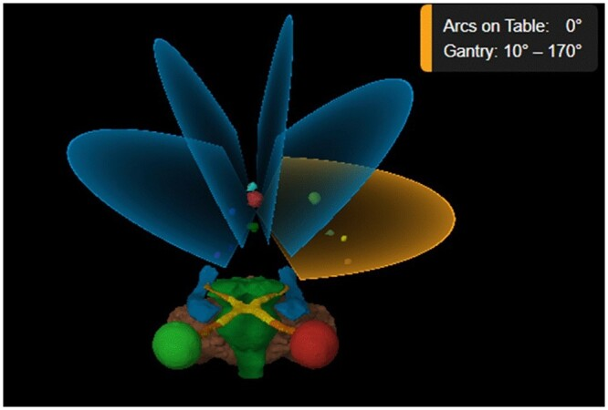
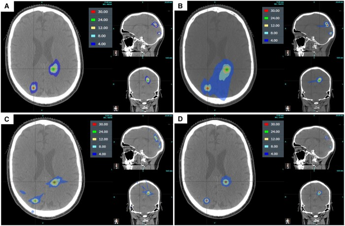
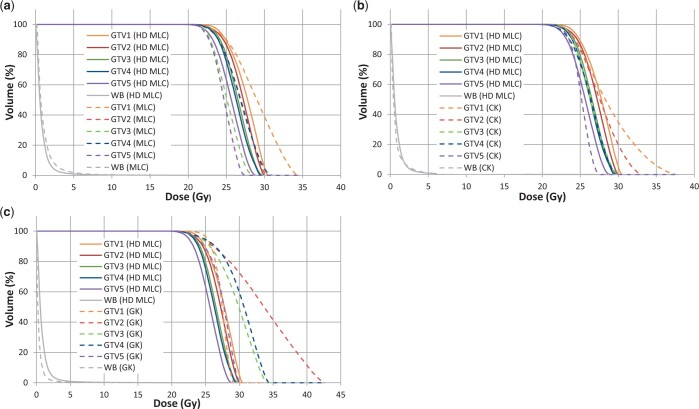

# Case Prep: Stereotactic Radiosurgery (SRS) — Gamma Knife / LINAC / CyberKnife

<!-- BEGIN CASE SNAPSHOT -->

## Case / Approach Snapshot

- **Anatomy at risk:** target volume, organs at risk, cranial nerves, optic apparatus/brainstem/cord tolerance, vascular structures, and prior-treatment fields.
- **Operative steps:** define indication, fuse imaging, contour target and organs at risk, choose dose/fractionation, check constraints and conformity, deliver treatment, and plan imaging follow-up; use the detailed operative sequence and approach notes below as the step-by-step source.
- **Rescue plans:** edema, radionecrosis, cranial neuropathy, optic/brainstem tolerance issue, hemorrhage, progression versus treatment effect, steroids/bevacizumab, surgery, or repeat radiation strategy.
- **Figures:** review [Figures, Imaging & Video](#figures-imaging--video) and the [Curated Image Set](#curated-image-set); embedded local figures should remain open-access, public-domain, or otherwise reusable with attribution.
- **Papers:** review [High-Yield Literature](#high-yield-literature) for seminal sources, modern reviews, and outcome data specific to this page.

<!-- END CASE SNAPSHOT -->

## One-Liner
[Age]yo [M/F] with [brain metastasis(es) / vestibular schwannoma / meningioma / AVM / trigeminal neuralgia / functional target] planned for stereotactic radiosurgery ([Gamma Knife / LINAC / CyberKnife]).

---

## Figures, Imaging & Video

**🎥 Operative video** — [search operative video on YouTube ▸](https://www.youtube.com/results?search_query=stereotactic+radiosurgery+surgery) · [The Neurosurgical Atlas ▸](https://www.neurosurgicalatlas.com)

[Neurosurgical Atlas](https://www.neurosurgicalatlas.com) · [Radiopaedia](https://radiopaedia.org/search?q=stereotactic%20radiosurgery&scope=all) · [PubMed Central](https://www.ncbi.nlm.nih.gov/pmc/?term=stereotactic+radiosurgery+gamma+knife) — figures © linked; see [media-sources.md](../../resources/media-sources.md)

---

<!-- BEGIN CURATED LITERATURE -->

## High-Yield Literature

- **Single- and Multifraction Stereotactic Radiosurgery Dose/Volume Tolerances of the Brain** — Milano MT. International journal of radiation oncology, biology, physics 2021. [PubMed](https://pubmed.ncbi.nlm.nih.gov/32921513/)
- **The current role of Gamma Knife radiosurgery in the management of intracranial haemangiopericytoma** — Spina A. Acta neurochirurgica 2016. [PubMed](https://pubmed.ncbi.nlm.nih.gov/26887864/)
- **Stereotactic Therapies for Meningiomas** — Tuleasca C. Advances in experimental medicine and biology 2023. [PubMed](https://pubmed.ncbi.nlm.nih.gov/37432623/)
- **A multi-centre stereotactic radiosurgery planning study of multiple brain metastases using isocentric linear accelerators with 5 and 2.5 mm width multi-leaf collimators, CyberKnife and Gamma Knife** — Hanvey S. BJR open 2024. [PubMed](https://pubmed.ncbi.nlm.nih.gov/38371494/)
- **Gamma Knife, CyberKnife or micro-multileaf collimator LINAC for intracranial radiosurgery?** — Mindermann T. Acta neurochirurgica 2015. [PubMed](https://pubmed.ncbi.nlm.nih.gov/25413164/)
- **LINAC stereotactic radiosurgery for vestibular schwannomas** — Ahmad M. Handbook of clinical neurology 2025. [PubMed](https://pubmed.ncbi.nlm.nih.gov/41052849/)
- **Cyberknife stereotactic radiosurgery and radiation therapy treatment planning system** — Ding C. Medical dosimetry : official journal of the American Association of Medical Dosimetrists 2018. [PubMed](https://pubmed.ncbi.nlm.nih.gov/29605528/)
- **Dosimetric comparison of fractionated radiosurgery plans using frameless Gamma Knife ICON and CyberKnife systems with linear accelerator-based radiosurgery plans for multiple large brain metastases** — Han EY. Journal of neurosurgery 2020. [PubMed](https://pubmed.ncbi.nlm.nih.gov/30952125/)
- **Image-guided LINAC radiosurgery in hypothalamic hamartomas** — Romanelli P. Frontiers in neurology 2022. [PubMed](https://pubmed.ncbi.nlm.nih.gov/36119668/)
- **Evaluation of CyberKnife Radiosurgery for Recurrent Trigeminal Neuralgia** — Berti A. Cureus 2018. [PubMed](https://pubmed.ncbi.nlm.nih.gov/30013862/)

<!-- END CURATED LITERATURE -->

<!-- BEGIN CURATED IMAGE SET -->

## Curated Image Set

Open-access figures are embedded from PubMed Central articles and kept unique to this guide.

*Fig. 1. Publication trends for the top 100 most cited articles on the stereotactic radiosurgical management of trigeminal neuralgia (1971–2019). Source: [Bibliometric Analysis of the Top 100 Cited Articles on Stereotactic Radiosurgery for Trigeminal Neuralgia](https://pmc.ncbi.nlm.nih.gov/articles/PMC10089752/) — Asian Journal of Neurosurgery 2023; CC BY-NC-ND.*

*Fig. 2. Categorical distribution of different stereotactic radiosurgical modalities in the top 100 cited articles. SRS, stereotactic radiosurgery. Source: [Bibliometric Analysis of the Top 100 Cited Articles on Stereotactic Radiosurgery for Trigeminal Neuralgia](https://pmc.ncbi.nlm.nih.gov/articles/PMC10089752/) — Asian Journal of Neurosurgery 2023; CC BY-NC-ND.*

*Fig. 3. Top countries generating articles in the top 100 cited articles on stereotactic radiosurgical management of trigeminal neuralgia based on the first author. Source: [Bibliometric Analysis of the Top 100 Cited Articles on Stereotactic Radiosurgery for Trigeminal Neuralgia](https://pmc.ncbi.nlm.nih.gov/articles/PMC10089752/) — Asian Journal of Neurosurgery 2023; CC BY-NC-ND.*

*Fig. 4. Top contributing academic institutions in the top 100 cited articles. UCLA, University of California, Los Angeles; UPMC, University of Pittsburgh Medical Center. Source: [Bibliometric Analysis of the Top 100 Cited Articles on Stereotactic Radiosurgery for Trigeminal Neuralgia](https://pmc.ncbi.nlm.nih.gov/articles/PMC10089752/) — Asian Journal of Neurosurgery 2023; CC BY-NC-ND.*

*Fig. 5. Top contributing authors in the list of the top 100 cited articles. Source: [Bibliometric Analysis of the Top 100 Cited Articles on Stereotactic Radiosurgery for Trigeminal Neuralgia](https://pmc.ncbi.nlm.nih.gov/articles/PMC10089752/) — Asian Journal of Neurosurgery 2023; CC BY-NC-ND.*

*Fig. 6. Top contributing journals in the list of the top 100 cited articles. Source: [Bibliometric Analysis of the Top 100 Cited Articles on Stereotactic Radiosurgery for Trigeminal Neuralgia](https://pmc.ncbi.nlm.nih.gov/articles/PMC10089752/) — Asian Journal of Neurosurgery 2023; CC BY-NC-ND.*

*Fig. 7. Categorical distribution of 100 most cited articles per targeted anatomical site. Source: [Bibliometric Analysis of the Top 100 Cited Articles on Stereotactic Radiosurgery for Trigeminal Neuralgia](https://pmc.ncbi.nlm.nih.gov/articles/PMC10089752/) — Asian Journal of Neurosurgery 2023; CC BY-NC-ND.*

*Figure 1.. Five arc beam arrangement used in Elements Multiple Brain Mets SRS planning. OARs shown are left eye (red), right eye (green), optic nerve and optic tracts (orange), optic chiasm... Source: [A multi-centre stereotactic radiosurgery planning study of multiple brain metastases using isocentric linear accelerators with 5 and 2.5 mm width multi-leaf collimators, CyberKnife and Gamma Knife](https://pmc.ncbi.nlm.nih.gov/articles/PMC10873585/) — BJR Open 2024; CC BY.*

*Figure 2.. Dose distribution for (A) linac with HD MLCs and (B) standard MLCs; (C) CK and (D) GK for a patient with 5 targets all treated to 24 Gy. Source: [A multi-centre stereotactic radiosurgery planning study of multiple brain metastases using isocentric linear accelerators with 5 and 2.5 mm width multi-leaf collimators, CyberKnife and Gamma Knife](https://pmc.ncbi.nlm.nih.gov/articles/PMC10873585/) — BJR Open 2024; CC BY.*

*Figure 3.. Cumulative DVHs of the five PTVs all prescribed to 24 Gy and the normal whole brain for a selected patient comparing the linac using HD MLCs with (A) standard MLCs, (B) CK, and (C) GK.... Source: [A multi-centre stereotactic radiosurgery planning study of multiple brain metastases using isocentric linear accelerators with 5 and 2.5 mm width multi-leaf collimators, CyberKnife and Gamma Knife](https://pmc.ncbi.nlm.nih.gov/articles/PMC10873585/) — BJR Open 2024; CC BY.*

<!-- END CURATED IMAGE SET -->

---

## History of Present Illness
- Chief complaint / indication-dependent:
  - **Brain metastases** (1 to ~10+; SRS increasingly replaces WBRT for limited mets)
  - **Vestibular schwannoma** (small-moderate, growth, hearing preservation goal)
  - **Meningioma** (residual/recurrent, surgically inaccessible, elderly)
  - **AVM** (small, deep/eloquent — obliteration over 2-3 years)
  - **Trigeminal neuralgia** (non-invasive option), other functional targets
  - Pituitary adenoma (residual/cavernous sinus), glomus, hemangioblastoma
- Prior surgery/radiation, systemic disease status (mets), functional status

---

## Past Medical History
- Prior cranial radiation (cumulative dose, radionecrosis risk), pacemaker/implants (MRI), claustrophobia, ability to tolerate frame
- Anticoagulation (frame pin placement)
- Standard PMH; oncologic status (mets)

---

## Imaging Review
### High-resolution MRI (thin-cut, contrast) + planning imaging
- **Target volume(s)**, location relative to **organs at risk (OARs):** optic apparatus, brainstem, cochlea, hippocampus, cranial nerves
- Number/size of mets (volume guides dose/fractionation), edema
- AVM: angioarchitecture (DSA for planning), nidus volume
- Stereotactic CT (frame) and MRI fusion for planning

---

## Labs
- Per sedation/frame needs; generally minimal

---

## Neurological Examination
- Baseline focal exam, cranial nerves (especially for skull base/VS/cavernous targets), document

---

## Surgical Planning (Procedure Workflow)

### Case Logistics, OR Needs & Orders
- **OR setup:** frame or mask workflow, stereotactic MRI/CT fusion, physics plan verification, radiosurgery timeout for target/dose/isocenters, and emergency access plan for frame discomfort or airway issues.
- **Special needs:** steroid plan for edema-prone lesions, antiepileptic plan for cortical lesions/seizure history, anticoagulation safety review, and pregnancy/device/MRI screening.
- **Immediate postop orders:** frame-pin care if used, headache/nausea regimen, steroid taper if prescribed, seizure precautions when relevant, discharge instructions, and interval MRI/clinic follow-up.

### Platform & Immobilization
- **Gamma Knife:** rigid **stereotactic frame** (pin-fixed) or frameless mask; cobalt-60 sources, ~201 beams converge on isocenter — highest precision for small intracranial targets
- **LINAC-based (BrainLab, Varian) / CyberKnife:** frameless **thermoplastic mask** + image guidance; CyberKnife robotic, allows hypofractionation
- **Single fraction (SRS)** vs **hypofractionated (2-5 fx, "SRT")** for larger lesions or near critical OARs

### Dose/Fractionation Decision Points
- Larger targets, prior radiation, edema, eloquent location, brainstem/optic/cochlear adjacency, and large cumulative treated volume push toward hypofractionation.
- Small metastases away from critical structures often fit single-fraction SRS; postoperative cavities and larger lesions often need fractionated SRT.
- Vestibular schwannoma and skull-base meningioma planning prioritizes cranial nerve, cochlear, brainstem, and optic tolerance over maximal marginal dose.
- AVM SRS is a latency treatment: dose must balance obliteration probability against hemorrhage risk during latency and radiation injury to adjacent eloquent tissue.
- Functional SRS (e.g., trigeminal neuralgia) is target-and-dose specific; document exact target segment and expected numbness/pain tradeoff.

### Workflow
1. **Frame application** (Gamma Knife frame-based) under local ± sedation, OR custom mask fabrication (frameless)
2. **Stereotactic imaging** (CT + MRI; DSA for AVM) with localizer
3. **Treatment planning** (radiation oncology + neurosurgery + physics): delineate target and OARs, **dose selection and conformality/gradient optimization**
   - Typical dose examples: brain met 18-24 Gy single fraction (size-dependent, RTOG 90-05); VS/meningioma ~12-13 Gy (function preservation); AVM ~16-25 Gy to margin; TN ~80 Gy to the trigeminal REZ
4. **Dose constraints to OARs:** optic apparatus < ~8-10 Gy single fraction, brainstem < ~12-15 Gy, cochlea < ~4 Gy (hearing)
5. **Delivery** (outpatient, no incision); frame removed after (frame-based)

### Critical Structures (Organs at Risk)
1. **Optic nerves/chiasm** (vision), **brainstem** (necrosis/deficit), **cochlea** (hearing), **cranial nerves** (cavernous sinus)
2. **Hippocampi** (memory — sparing in WBRT contexts), normal brain (radionecrosis)

### Equipment / Team
- SRS platform (Gamma Knife / LINAC / CyberKnife), planning system, stereotactic frame or mask
- **Multidisciplinary: neurosurgery + radiation oncology + medical physics**

### Anesthesia
- Usually awake/local (frame pins) ± mild sedation; general only for children/uncooperative

### Potential Complications
1. **Radionecrosis** (delayed, dose/volume-dependent — headache, edema, deficit; may mimic progression), **cerebral edema**
2. **Cranial neuropathy** (optic — vision loss; trigeminal numbness post-TN SRS; facial/hearing for VS), **brainstem injury**
3. AVM: latency-period hemorrhage risk until obliteration (~2-3 years), incomplete obliteration
4. Frame pin site issues, transient symptom flare (edema), secondary malignancy (rare, long-term)

### Follow-Up Problem Solving
- **Progression vs radionecrosis:** compare timing, perfusion, spectroscopy, diffusion, steroid response, PET when available, and serial growth pattern; biopsy/resection if diagnosis changes treatment.
- **Symptomatic edema:** steroids first, then taper carefully; bevacizumab, LITT, or surgery for refractory radiation necrosis/mass effect.
- **Postoperative cavity recurrence:** distinguish nodular cavity-wall recurrence from smooth treatment change; salvage surgery, repeat SRS/SRT, WBRT, or systemic therapy depends on burden and histology.
- **AVM residual at 3 years:** confirm with DSA, reassess hemorrhage risk, and consider repeat SRS, embolization, or surgery.
- **Cranial neuropathy:** correlate dose to nerve/OAR, treat edema when present, and avoid reflexively retreating until treatment effect is sorted from progression.

---

## Procedure Note / Plan Template
**Preoperative Diagnosis:** [Brain metastasis(es) / vestibular schwannoma / meningioma / AVM / trigeminal neuralgia]

**Postoperative Diagnosis:** Same

**Procedure:** Stereotactic radiosurgery ([Gamma Knife / LINAC / CyberKnife]) to [target], [dose] Gy to the [margin/isodose], [single fraction / N fractions]

**Team:** Neurosurgery + radiation oncology + medical physics
**Anesthesia:** [Local for frame pins ± mild sedation / GA for children]
**Immobilization:** [Stereotactic frame / thermoplastic mask]
**Complications:** None

**Indications:** [Age]yo [M/F] with [target/diagnosis]; SRS chosen for [unresectable/deep location / function preservation / residual-recurrent disease / limited metastases]. Risks (radionecrosis, edema, cranial neuropathy, AVM latency hemorrhage) discussed.

**Description of Procedure:** After consent and time-out, [the stereotactic frame was applied under local anesthesia / the thermoplastic mask was fitted]. Stereotactic imaging (CT [+ DSA for AVM]) was obtained and fused with the high-resolution planning MRI. The **target volume and organs at risk** (optic apparatus, brainstem, cochlea, cranial nerves, hippocampi) were delineated, and a conformal plan optimized.

The plan — **[dose] Gy prescribed to the [isodose]** with steep gradient and **OAR doses within constraints** (optic < ~8–10 Gy, brainstem < ~12–15 Gy, cochlea < ~4 Gy) — was **approved by neurosurgery, radiation oncology, and physics**. Treatment was delivered on the [platform]; [the frame was removed].

The patient was discharged the same day with [a short steroid course] and a surveillance imaging schedule.

---

## Post-Treatment Plan
- Outpatient discharge (no incision); short steroid course for edema-prone/symptomatic targets
- **Surveillance MRI** (e.g., brain mets q2-3 months; VS/meningioma at 6-12 months then yearly; AVM yearly + DSA at ~3 years to confirm obliteration)
- Monitor for **radionecrosis vs progression** (perfusion/spectroscopy/MET-PET; may need steroids, bevacizumab, or surgery)
- Audiometry (VS), visual fields (sellar/optic-adjacent), endocrine (sellar)
- Oncology coordination (mets — systemic therapy, new-lesion surveillance); counsel AVM patients re: hemorrhage risk during latency

<!-- BEGIN COMMON PIMP QUESTIONS -->

## Common Pimp Questions

Use these to pressure-test preparation for **Stereotactic Radiosurgery (SRS) — Gamma Knife / LINAC / CyberKnife**:

1. What target coordinate, trajectory, and no-fly-zone were chosen?
2. What imaging confirms target accuracy and avoids vessel/ventricle/sulcus violation?
3. What specimen, pathology, culture, or molecular study must be obtained?
4. What hemorrhage, edema, seizure, or thermal-injury sign must be watched for tonight?
5. What postop scan timing and steroid/antiepileptic plan is appropriate?

<!-- END COMMON PIMP QUESTIONS -->

<!-- BEGIN ATTENDING PREFERENCE VARIABLES -->

## Attending Preference Variables

Items that commonly vary by surgeon or institution:

- **Frame versus frameless/robot platform and planning software:** [attending-specific]
- **Trajectory constraints, number of cores/targets, and frozen/permanent pathology plan:** [attending-specific]
- **Steroid/antiepileptic prophylaxis and postop scan timing:** [attending-specific]
- **Admit versus discharge threshold and neuro-check frequency:** [attending-specific]

<!-- END ATTENDING PREFERENCE VARIABLES -->
