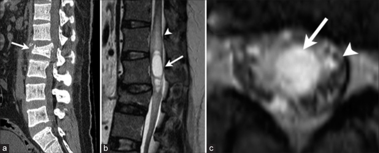
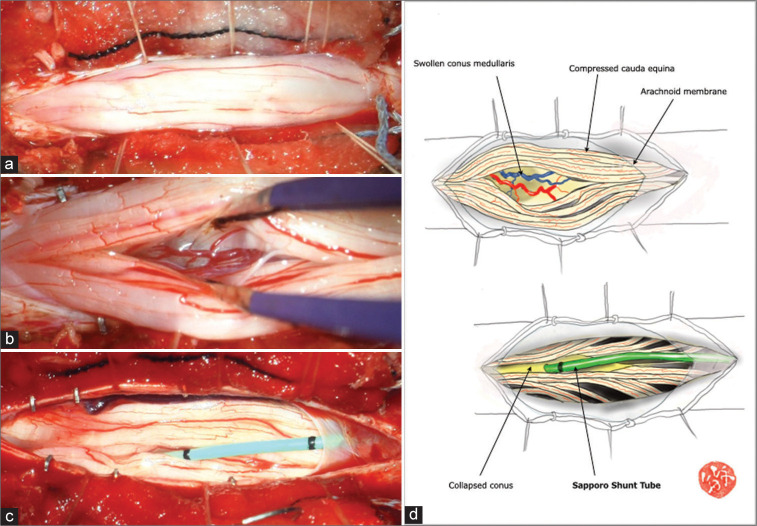
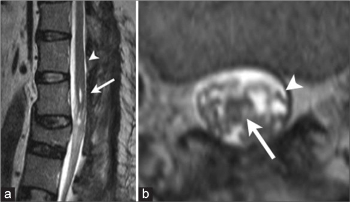
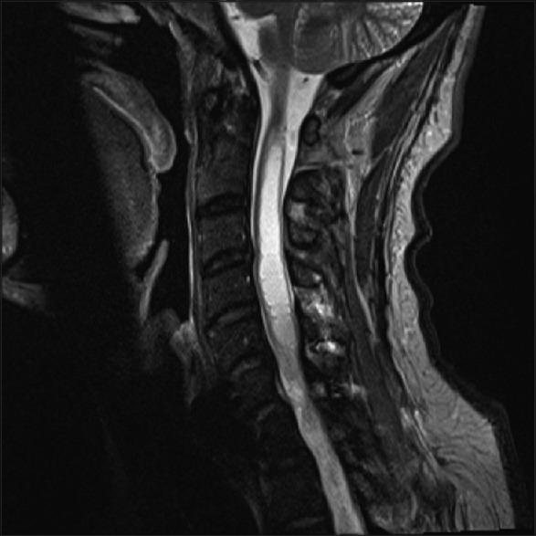
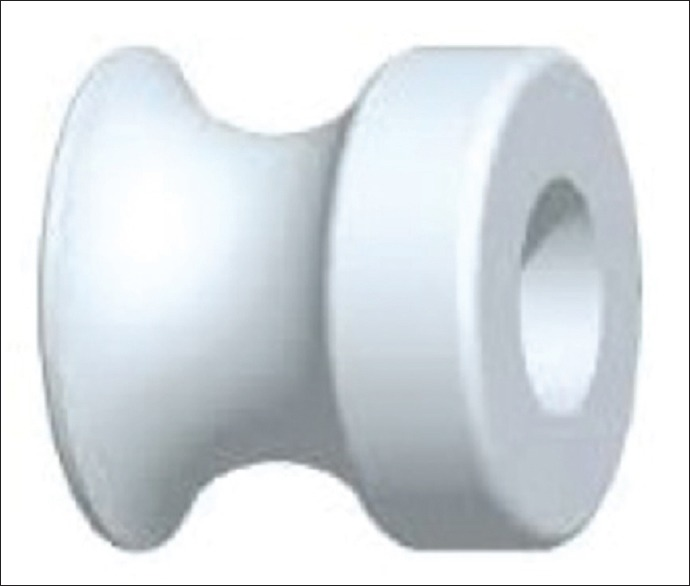
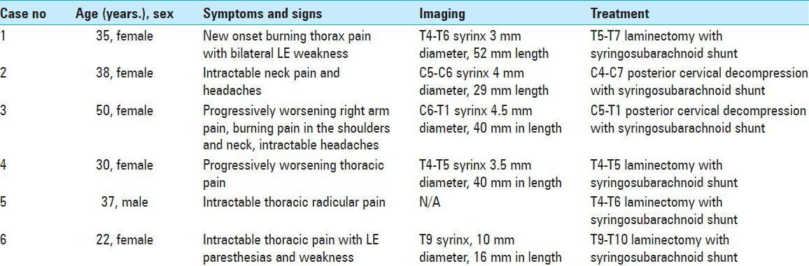
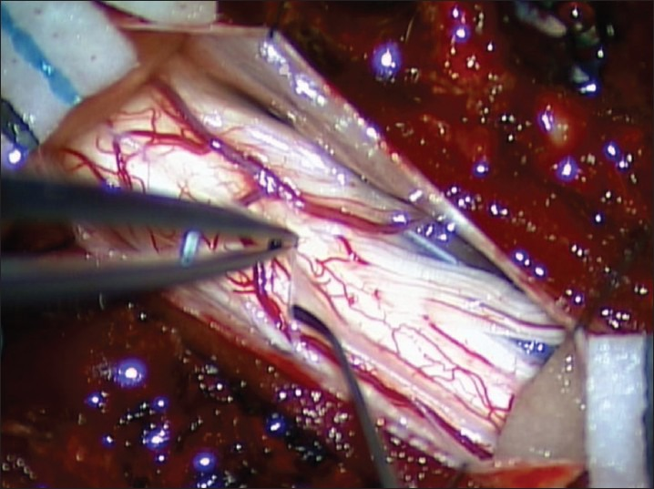
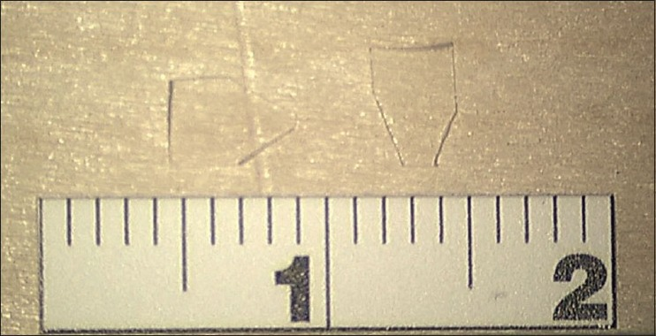
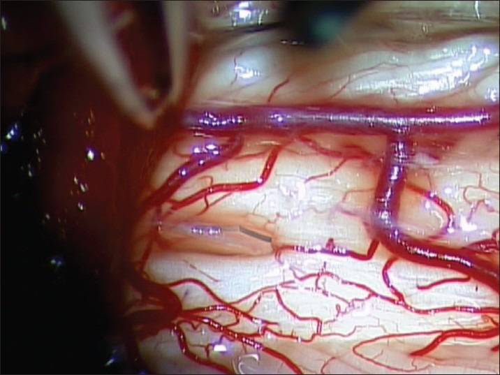

# Case Prep: Syringomyelia — Management / Syringosubarachnoid Shunt

---

<!-- BEGIN CASE SNAPSHOT -->

## Case / Approach Snapshot

- **Anatomy at risk:** the named neural, vascular, bony, CSF, and soft-tissue structures that determine the safe corridor and likely morbidity.
- **Operative steps:** confirm indication and imaging, position and expose deliberately, complete the core surgical maneuver, verify the result, and close with a complication-prevention plan; use the detailed operative sequence and approach notes below as the step-by-step source.
- **Rescue plans:** bleeding, neurologic change, wrong target or level, CSF leak, infection, hardware or reconstruction failure, and a staged or alternate-treatment plan.
- **Figures:** review [Figures, Imaging & Video](#figures-imaging--video) and the [Curated Image Set](#curated-image-set); embedded local figures should remain open-access, public-domain, or otherwise reusable with attribution.
- **Papers:** review [High-Yield Literature](#high-yield-literature) for seminal sources, modern reviews, and outcome data specific to this page.
- **Textbook cross-checks:** use [Textbook Cross-Checks](#textbook-cross-checks) and the [Source Crosswalk](../../resources/source-crosswalk.md) to cite copyrighted textbooks/atlases while summarizing in original words.

<!-- END CASE SNAPSHOT -->

## One-Liner
[Age]yo [M/F] with [Chiari-associated / post-traumatic / idiopathic] syringomyelia at [levels] presenting with [dissociated sensory loss / hand weakness / pain / progressive myelopathy] planned for [treatment of underlying cause / syringosubarachnoid shunt].

---

## Figures, Imaging & Video

**🎥 Operative video** — [search operative video on YouTube ▸](https://www.youtube.com/results?search_query=syringomyelia+surgery) · [The Neurosurgical Atlas ▸](https://www.neurosurgicalatlas.com)

[Neurosurgical Atlas](https://www.neurosurgicalatlas.com) · [Radiopaedia](https://radiopaedia.org/search?q=syringomyelia&scope=all) · [PubMed Central](https://www.ncbi.nlm.nih.gov/pmc/?term=syringomyelia+treatment) — operative figures © linked; see [media-sources.md](../../resources/media-sources.md)

---

<!-- BEGIN TEXTBOOK CROSS-CHECKS -->

## Textbook Cross-Checks

- **Spine anatomy and biomechanics:** Benzel Spine; Textbook of Spinal Surgery; Surgical Anatomy and Techniques to the Spine — confirm levels, approach-side anatomy, neural/vascular structures at risk, alignment, stability, and fixation rationale.
- **Technique sequence:** Youmans and Winn; Benzel Spine; Greenberg — review positioning, localization, exposure, decompression, instrumentation, fusion/reconstruction, and closure in original language.
- **Complication rescue:** Benzel Spine; Greenberg; Youmans and Winn — cross-check durotomy, neurologic change, vascular injury, wrong-level prevention, infection, implant failure, and postoperative restrictions.
- **Copyright-safe use:** cite these sources as private cross-checks, then write the guide content in original words; do not re-host textbook pages, figures, tables, or board-review card material. See [Source Crosswalk & Copyright-Safe Use](../../resources/source-crosswalk.md).

<!-- END TEXTBOOK CROSS-CHECKS -->

<!-- BEGIN CURATED LITERATURE -->

## High-Yield Literature

- **Syringosubarachnoid shunt: insertion technique** — Amarouche M. British journal of neurosurgery 2023. [PubMed](https://pubmed.ncbi.nlm.nih.gov/31852253/)
- **Ultrasound-guided Syringosubarachnoid Shunt Insertion for Cervicothoracic Syringomyelia** — Hussain I. Clinical spine surgery 2020. [PubMed](https://pubmed.ncbi.nlm.nih.gov/31220040/)
- **Syringosubarachnoid shunt for treatment of syringomyelia** — Vaquero J. Acta neurochirurgica 1987. [PubMed](https://pubmed.ncbi.nlm.nih.gov/3577853/)
- **Treatment of syringomyelia with a syringosubarachnoid shunt** — Tator CH. The Canadian journal of neurological sciences. Le journal canadien des sciences neurologiques 1988. [PubMed](https://pubmed.ncbi.nlm.nih.gov/3345462/)
- **Reevaluation of syringosubarachnoid shunt for syringomyelia with Chiari malformation** — Iwasaki Y. Neurosurgery 2000. [PubMed](https://pubmed.ncbi.nlm.nih.gov/10690730/)
- **Syrinx shunts for syringomyelia: a systematic review and meta-analysis of syringosubarachnoid, syringoperitoneal, and syringopleural shunting** — Rothrock RJ. Journal of neurosurgery. Spine 2021. [PubMed](https://pubmed.ncbi.nlm.nih.gov/34330095/)
- **[Syringosubarachnoid shunt for noncommunicating syringomyelia associated with spinal lipoma: a case report]** — Yamamuro S. No shinkei geka. Neurological surgery 2012. [PubMed](https://pubmed.ncbi.nlm.nih.gov/22647512/)
- **Syringosubarachnoid shunt for syringomyelia associated with Chiari I malformation** — Hida K. Neurosurgical focus 2001. [PubMed](https://pubmed.ncbi.nlm.nih.gov/16724817/)
- **Polytetrafluoroethylene sponge syringosubarachnoid shunt** — Chagla AS. Turkish neurosurgery 2011. [PubMed](https://pubmed.ncbi.nlm.nih.gov/21845589/)
- **Minimally invasive insertion of syringosubarachnoid shunt for posttraumatic syringomyelia: technical case report** — O'Toole JE. Neurosurgery 2007. [PubMed](https://pubmed.ncbi.nlm.nih.gov/18091225/)

<!-- END CURATED LITERATURE -->

---

<!-- BEGIN CURATED IMAGE SET -->

## Curated Image Set

Open-access figures are embedded from PubMed Central articles and kept unique to this guide.

*Figure 1:. Preoperative radiological findings. (a) A sagittal view of a plain computed tomography scan demonstrates a burst fracture of the L2 vertebra (arrow). Note that the L2 vertebra is... Source: [Cauda equina syndrome due to posttraumatic syringomyelia in conus medullaris – A case report](https://pmc.ncbi.nlm.nih.gov/articles/PMC11301795/) — Surgical Neurology International 2024; CC BY-NC-SA.*

*Figure 2:. Intraoperative findings. (a) Following the dural opening, the conus medullaris and cauda equina protruded from the dural sac. Note no adhesive arachnoiditis. (b) The conus medullaris was... Source: [Cauda equina syndrome due to posttraumatic syringomyelia in conus medullaris – A case report](https://pmc.ncbi.nlm.nih.gov/articles/PMC11301795/) — Surgical Neurology International 2024; CC BY-NC-SA.*

*Figure 3:. Postoperative radiological findings. (a) Sagittal view of T2-weighted magnetic resonance imaging (MRI) shows almost complete disappearance of syrinx in the conus medullaris (arrow). Note... Source: [Cauda equina syndrome due to posttraumatic syringomyelia in conus medullaris – A case report](https://pmc.ncbi.nlm.nih.gov/articles/PMC11301795/) — Surgical Neurology International 2024; CC BY-NC-SA.*

*Figure 4. Source: [Cauda equina syndrome due to posttraumatic syringomyelia in conus medullaris – A case report](https://pmc.ncbi.nlm.nih.gov/articles/PMC11301795/) — Surg Neurol Int. 2024 Jul 12;15:243. doi: 10.25259/SNI_386_2024; CC BY-NC-SA.*

*Figure 1. T2-weighted magnetic resonance imaging cervical spine Source: [Syringosubarachnoid shunting using a myringotomy tube](https://pmc.ncbi.nlm.nih.gov/articles/PMC4722522/) — Surgical Neurology International 2016; CC BY-NC-SA.*

*Figure 2. Myringotomy tube Source: [Syringosubarachnoid shunting using a myringotomy tube](https://pmc.ncbi.nlm.nih.gov/articles/PMC4722522/) — Surgical Neurology International 2016; CC BY-NC-SA.*

*Figure 7. Source: [Surgical treatment of idiopathic syringomyelia: Silastic wedge syringosubarachnoid shunting technique](https://pmc.ncbi.nlm.nih.gov/articles/PMC4123260/) — Surg Neurol Int. 2014 Jul 24;5:114. doi: 10.4103/2152-7806.137536; CC BY-NC-SA.*

*Figure 1. Opening the arachnoid membrane Source: [Surgical treatment of idiopathic syringomyelia: Silastic wedge syringosubarachnoid shunting technique](https://pmc.ncbi.nlm.nih.gov/articles/PMC4123260/) — Surgical Neurology International 2014; CC BY-NC-SA.*

*Figure 2. Contoured silastic wedges Source: [Surgical treatment of idiopathic syringomyelia: Silastic wedge syringosubarachnoid shunting technique](https://pmc.ncbi.nlm.nih.gov/articles/PMC4123260/) — Surgical Neurology International 2014; CC BY-NC-SA.*

*Figure 3. Initial placement of contoured silastic wedge Source: [Surgical treatment of idiopathic syringomyelia: Silastic wedge syringosubarachnoid shunting technique](https://pmc.ncbi.nlm.nih.gov/articles/PMC4123260/) — Surgical Neurology International 2014; CC BY-NC-SA.*

<!-- END CURATED IMAGE SET -->

---

## History of Present Illness
- Chief complaint: **Dissociated (cape-like) sensory loss** (loss of pain/temperature, preserved light touch), hand/upper extremity weakness and atrophy, neuropathic pain, scoliosis (children), progressive myelopathy
- **Etiology is key (treat the cause, not just the syrinx):**
  - **Chiari I/II** (most common — treat with posterior fossa decompression; syrinx usually improves)
  - **Post-traumatic** (tethering/arachnoiditis at injury level — untether/expand)
  - **Post-infectious/arachnoiditis**, tumor-associated, idiopathic
- Progression rate, prior decompression/shunt

---

## Past Medical History
- Prior spinal trauma/SCI, meningitis/arachnoiditis, Chiari, prior posterior fossa or spinal surgery
- Standard PMH

---

## Imaging Review
### MRI Brain + Entire Spine (T1, T2, cine CSF flow)
- **Syrinx** extent/size, location, septations
- **Underlying cause:** Chiari (tonsillar descent, CSF flow at foramen magnum), tethering/arachnoid scar (post-traumatic — cord tethered, CSF flow block at injury level), tumor (enhancing nodule), basilar invagination
- Cine flow (CSF dynamics at foramen magnum / block level)

---

## Labs
- CBC, BMP, Coags, type and screen

---

## Neurological Examination
- Detailed motor (intrinsic hand), **dissociated sensory** mapping, reflexes, gait, scoliosis, document baseline

---

## Surgical Planning

### Treat the Cause First (Principle)
- **Chiari-associated:** **posterior fossa decompression** (± duraplasty) → restores CSF flow, syrinx usually shrinks (see [chiari-decompression](../cranial-functional/chiari-decompression.md))
- **Post-traumatic/arachnoiditis:** **untethering + expansile duraplasty** at the block level (restore subarachnoid CSF flow) — preferred over shunt
- **Tumor-associated:** resect tumor (syrinx resolves)
- **Syringo-subarachnoid/peritoneal/pleural shunt:** reserved for **refractory/progressive syrinx** when the cause cannot be addressed or untethering fails (shunts have high failure/complication rates — last resort)

### Position
- Prone, Mayfield/foam, IONM baseline; per target (foramen magnum for Chiari, syrinx level for shunt/untethering)

### Key Surgical Steps (Syringosubarachnoid Shunt — refractory cases)
1. Laminectomy at the level of maximal syrinx (thinnest cord/dorsal)
2. Midline durotomy, identify the dorsally expanded cord
3. **Myelotomy** at the dorsal midline (or dorsal root entry zone) into the syrinx cavity (thinnest point — ultrasound-guided)
4. Drain syrinx; place a **small shunt catheter from the syrinx cavity into the subarachnoid space** (syringo-subarachnoid), secure to pia
5. (Alternative distal: peritoneal/pleural if subarachnoid inadequate)
6. Watertight dural closure (expansile duraplasty to maintain subarachnoid space)
- **Untethering (post-traumatic):** lyse arachnoid adhesions at the block, expansile duraplasty to re-establish CSF flow (often preferred to shunting)

### Critical Anatomy & Structures at Risk
1. **Spinal cord tracts** — myelotomy (dorsal columns), already compromised cord
2. **Anterior spinal artery** (ventral)
3. Dura/subarachnoid space (shunt patency, CSF flow), arachnoid (adhesions)

### Equipment
- Microscope, ultrasound (syrinx localization), syrinx shunt catheter, micro-instruments, fine bipolar
- Dural substitute (duraplasty), sealant

### Monitoring
- SSEPs, MEPs, EMG

### Anesthesia
- MAP support, no paralytic (IONM), prone precautions

### Potential Complications
1. **Shunt failure/obstruction** (syrinx shunts commonly fail — recurrence)
2. Neurological worsening (myelotomy), CSF leak
3. Recurrence/progression if underlying cause not addressed
4. Tethering/arachnoiditis (re-block)

---

## Operative Note Template
**Preoperative Diagnosis:** [Chiari-associated / post-traumatic / idiopathic] syringomyelia at [levels]

**Postoperative Diagnosis:** Same

**Procedure:** [Posterior fossa decompression / Untethering with expansile duraplasty / Syringosubarachnoid shunt placement] for syringomyelia at [levels]

**Surgeon / Assistant:**
**Anesthesia:** General endotracheal
**EBL / Fluids:**
**Adjuncts:** Microscope, ultrasound (syrinx localization); SSEP/MEP/EMG
**Implants:** Dural substitute (duraplasty) [/ syrinx shunt catheter], sealant
**Complications:** None

**Indications:** [Age]yo [M/F] with [progressive] syringomyelia from [etiology] causing [dissociated sensory loss/weakness/pain]. The strategy was cause-directed [posterior fossa decompression for Chiari / untethering for post-traumatic block / shunt for refractory progressive syrinx]. Risks discussed.

**Description of Procedure:** After consent and time-out, general anesthesia was induced and neuromonitoring established. The patient was positioned prone. [Chiari: a foramen magnum decompression with duraplasty was performed to restore CSF flow.] [Post-traumatic: a laminectomy at the block level with arachnoid lysis and expansile duraplasty re-established subarachnoid CSF flow.] [Refractory syrinx: a laminectomy was performed at the maximal/thinnest point of the syrinx, a midline (or DREZ) myelotomy made under ultrasound guidance, the syrinx drained, and a small shunt catheter placed from the syrinx into the subarachnoid space.] A watertight dural closure [/ expansile duraplasty] was performed with sealant.

Closure was completed in layers. The patient was transferred with CSF-leak precautions; gradual (months) syrinx collapse was anticipated.

---

## Postoperative Plan
- Step-down/ICU, neuro checks, CSF leak precautions, MAP support
- **MRI at 3-6 months** (syrinx should shrink over months — not immediately), cine flow
- Pain management (neuropathic — gabapentinoids), rehab
- DVT prophylaxis (mechanical)
- Counsel: syrinx collapse is gradual; goal is to halt progression; monitor for recurrence/shunt failure; address scoliosis (peds, ortho)
