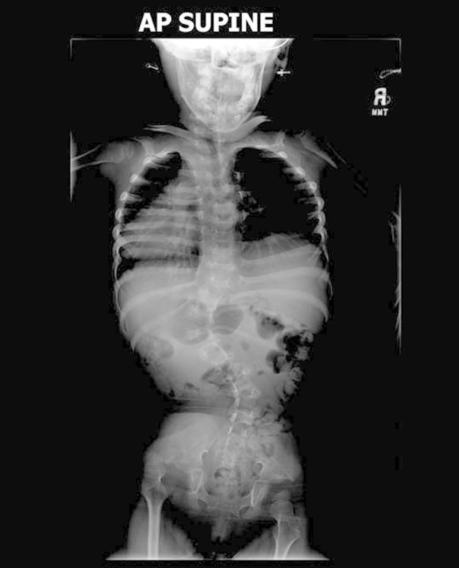
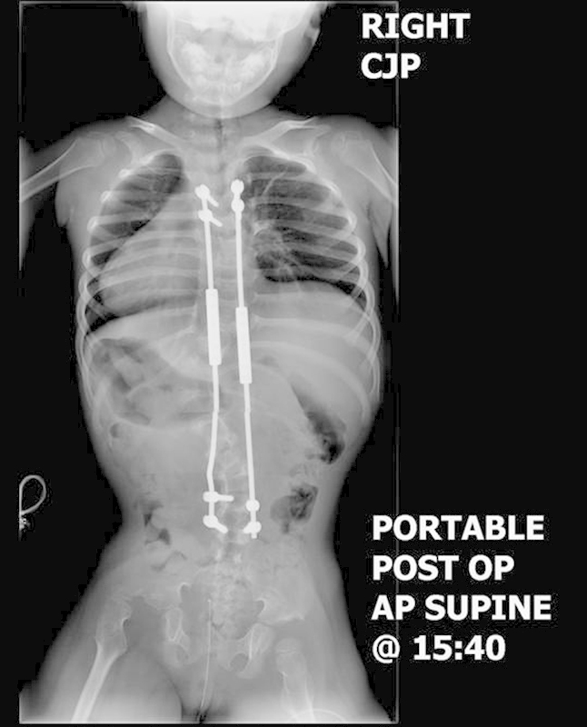
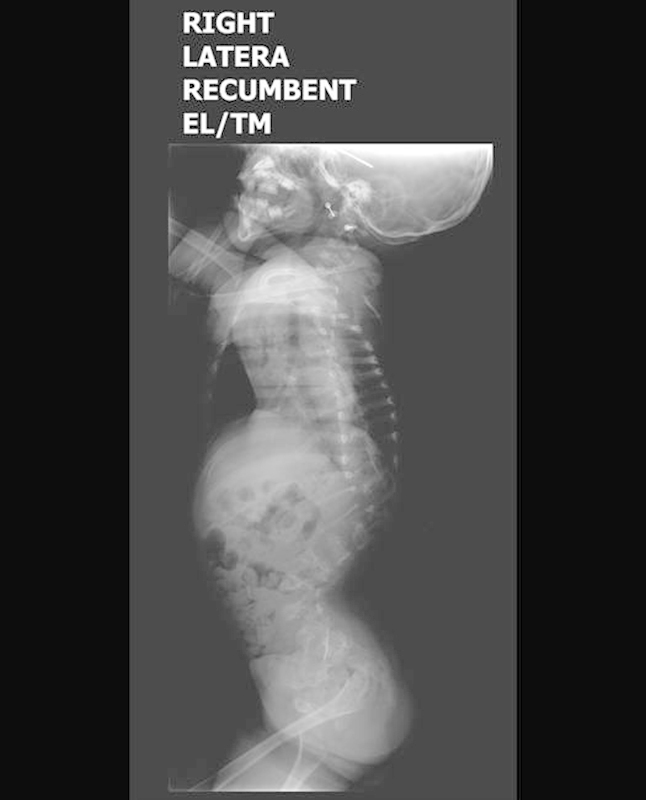
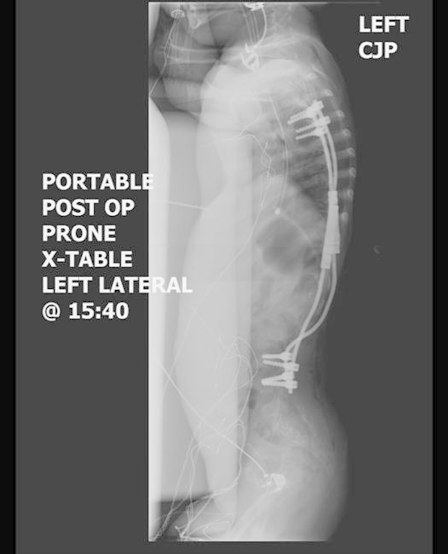
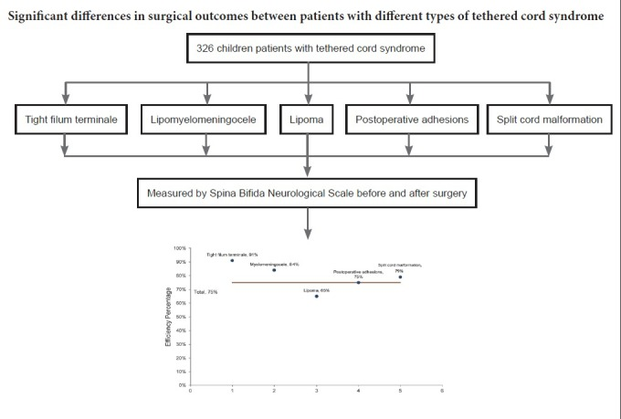
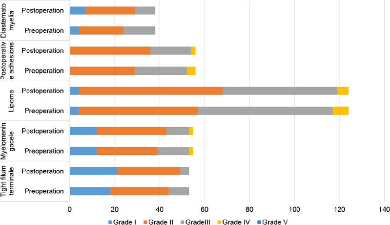
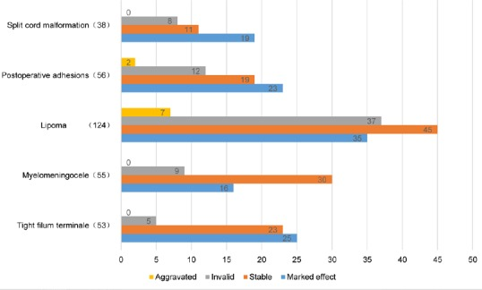
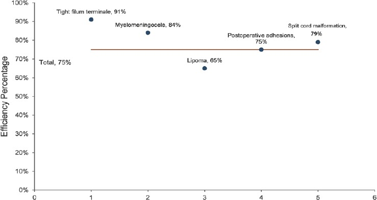
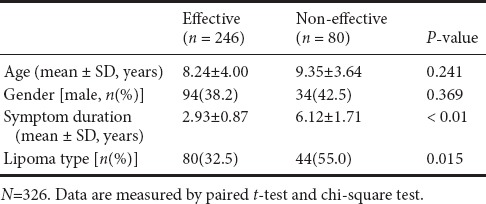

# Case Prep: Tethered Cord Release

<!-- BEGIN CASE SNAPSHOT -->

## Case / Approach Snapshot

- **Anatomy at risk:** the named neural, vascular, bony, CSF, and soft-tissue structures that determine the safe corridor and likely morbidity.
- **Operative steps:** confirm indication and imaging, position and expose deliberately, complete the core surgical maneuver, verify the result, and close with a complication-prevention plan; use the detailed operative sequence and approach notes below as the step-by-step source.
- **Rescue plans:** bleeding, neurologic change, wrong target or level, CSF leak, infection, hardware or reconstruction failure, and a staged or alternate-treatment plan.
- **Figures:** review [Figures, Imaging & Video](#figures-imaging--video) and the [Curated Image Set](#curated-image-set); embedded local figures should remain open-access, public-domain, or otherwise reusable with attribution.
- **Papers:** review [High-Yield Literature](#high-yield-literature) for seminal sources, modern reviews, and outcome data specific to this page.

<!-- END CASE SNAPSHOT -->

## One-Liner
[Age]yo [M/F] [child/adult] with tethered cord syndrome ([tight filum / lipomyelomeningocele / post-repair retethering / split cord]) presenting with [back/leg pain, motor or sensory decline, bladder dysfunction, scoliosis, foot deformity] planned for [level] laminectomy for microsurgical untethering.

---

## Figures, Imaging & Video

**🎥 Operative video** — [search operative video on YouTube ▸](https://www.youtube.com/results?search_query=tethered+spinal+cord+surgery) · [The Neurosurgical Atlas ▸](https://www.neurosurgicalatlas.com)

> 🧭 **Operative approach:** [Posterior thoracolumbar approach](../approaches/posterior-thoracolumbar-approach.md) — midline lumbosacral exposure, laminoplasty/laminectomy, dural opening, and closure principles.

[Neurosurgical Atlas](https://www.neurosurgicalatlas.com) · [Radiopaedia](https://radiopaedia.org/search?q=tethered%20spinal%20cord&scope=all) · [PubMed Central](https://www.ncbi.nlm.nih.gov/pmc/?term=tethered+cord+release+filum) — operative figures © linked; see [media-sources.md](../../resources/media-sources.md)

---

<!-- BEGIN CURATED LITERATURE -->

## High-Yield Literature

- **Tethered cord syndrome** — Agarwalla PK. Neurosurgery clinics of North America 2007. [PubMed](https://pubmed.ncbi.nlm.nih.gov/17678753/)
- **Tethered Cord Syndrome After Myelomeningocele Repair: A Literature Update** — Ferreira Furtado LM. Cureus 2020. [PubMed](https://pubmed.ncbi.nlm.nih.gov/33072445/)
- **Clinical criteria for filum terminale resection in occult tethered cord syndrome** — Klinge PM. Journal of neurosurgery. Spine 2024. [PubMed](https://pubmed.ncbi.nlm.nih.gov/38489815/)
- **Tethered cord syndrome from pediatric and adult perspectives: a comprehensive systematic review of 6135 cases** — He K. Neurosurgical focus 2024. [PubMed](https://pubmed.ncbi.nlm.nih.gov/38823051/)
- **Mapping and monitoring of tethered cord and cauda equina surgeries** — Galloway G. Handbook of clinical neurology 2022. [PubMed](https://pubmed.ncbi.nlm.nih.gov/35772890/)
- **[Tethered cord syndrome in children: about a case]** — Hode L. The Pan African medical journal 2019. [PubMed](https://pubmed.ncbi.nlm.nih.gov/32110267/)
- **Tethered cord syndrome in KBG syndrome** — Hills S. American journal of medical genetics. Part A 2023. [PubMed](https://pubmed.ncbi.nlm.nih.gov/36722669/)
- **Tethered Cord Syndrome (TCS)** — Weisbrod LJ. 2026. [PubMed](https://pubmed.ncbi.nlm.nih.gov/36256768/)
- **Diagnosis and Management of Tethered Cord Syndrome** — Hara T. Advances and technical standards in neurosurgery 2024. [PubMed](https://pubmed.ncbi.nlm.nih.gov/38700679/)
- **Split cord malformation and tethered cord syndrome: case series with long-term follow-up and literature review** — Kobets AJ. Child's nervous system : ChNS : official journal of the International Society for Pediatric Neurosurgery 2021. [PubMed](https://pubmed.ncbi.nlm.nih.gov/33242106/)

<!-- END CURATED LITERATURE -->

<!-- BEGIN CURATED IMAGE SET -->

## Curated Image Set

Open-access figures are embedded from PubMed Central articles and kept unique to this guide.

*Fig. 1. Patient 2 preoperative supine anteroposterior view (90 degrees T11–L3). Abbreviation: AP, anteroposterior. Source: [Concurrent Tethered Cord Release and Growing-Rod Implantation—Is It Safe?](https://pmc.ncbi.nlm.nih.gov/articles/PMC3864420/) — Global Spine Journal 2012; open access.*

*Fig. 2. Patient 2 postoperative supine anteroposterior view (53 degrees T11–L3). Abbreviations: AP, anteroposterior; post op, postoperative. Source: [Concurrent Tethered Cord Release and Growing-Rod Implantation—Is It Safe?](https://pmc.ncbi.nlm.nih.gov/articles/PMC3864420/) — Global Spine Journal 2012; open access.*

*Fig. 3. Patient 2 preoperative recumbent lateral view. Note thoracolumbar kyphosis. Source: [Concurrent Tethered Cord Release and Growing-Rod Implantation—Is It Safe?](https://pmc.ncbi.nlm.nih.gov/articles/PMC3864420/) — Global Spine Journal 2012; open access.*

*Fig. 4. Patient 2 postoperative lateral view. Abbreviations: post op, postoperative. Source: [Concurrent Tethered Cord Release and Growing-Rod Implantation—Is It Safe?](https://pmc.ncbi.nlm.nih.gov/articles/PMC3864420/) — Global Spine Journal 2012; open access.*

*Figure 6. Source: [Microsurgical efficacy in 326 children with tethered cord syndrome: a retrospective analysis](https://pmc.ncbi.nlm.nih.gov/articles/PMC6262992/) — Neural Regen Res. 2019 Jan;14(1):149–55. doi: 10.4103/1673-5374.243720; CC BY-NC-SA.*

*Figure 2. Spina Bifida Neurological Scale (SBNS) functional classification of children with different types of tethered cord syndrome before surgery and 3 months after surgery (n = 326).Horizontal... Source: [Microsurgical efficacy in 326 children with tethered cord syndrome: a retrospective analysis](https://pmc.ncbi.nlm.nih.gov/articles/PMC6262992/) — Neural Regeneration Research 2019; CC BY-NC-SA.*

*Figure 3. Efficacy analysis of different types of tethered cord syndrome postoperatively.Horizontal axis shows the number of patients (n = 326). Source: [Microsurgical efficacy in 326 children with tethered cord syndrome: a retrospective analysis](https://pmc.ncbi.nlm.nih.gov/articles/PMC6262992/) — Neural Regeneration Research 2019; CC BY-NC-SA.*

*Figure 4. Efficacy percentage of different types of tethered cord syndrome postoperatively.Efficiency = (marked effect + stable)/total number of cases followed up (n = 326). Source: [Microsurgical efficacy in 326 children with tethered cord syndrome: a retrospective analysis](https://pmc.ncbi.nlm.nih.gov/articles/PMC6262992/) — Neural Regeneration Research 2019; CC BY-NC-SA.*

*Figure 10. Source: [Microsurgical efficacy in 326 children with tethered cord syndrome: a retrospective analysis](https://pmc.ncbi.nlm.nih.gov/articles/PMC6262992/) — Neural Regen Res. 2019 Jan;14(1):149–55. doi: 10.4103/1673-5374.243720; CC BY-NC-SA.*

<!-- END CURATED IMAGE SET -->

---

## History of Present Illness
- Chief complaint: Progressive neurological/urological decline, back/leg pain (worse with flexion/activity), bladder dysfunction, lower extremity weakness/sensory change, foot deformity, scoliosis (children)
- **Pediatric:** cutaneous stigmata (hairy patch, dimple/sinus, lipoma, hemangioma), delayed milestones, gait/urinary change
- **Adult:** pain-predominant, often after activity/trauma; or retethering after prior myelomeningocele repair
- Prior spinal dysraphism surgery (retethering)

---

## Past Medical History
- Prior dysraphism repair (myelomeningocele, lipoma), prior untethering (retethering)
- Associated anomalies (Chiari II, syrinx, anorectal/GU anomalies — VACTERL), latex allergy
- Standard PMH

---

## Imaging Review
### MRI Lumbosacral Spine (T1, T2)
- **Low-lying conus** (below L2), **thickened/fatty filum terminale** (> 2 mm), filar lipoma
- Lipomyelomeningocele, intradural lipoma, dermal sinus tract, **split cord malformation (diastematomyelia — bony/fibrous septum)**, syrinx
- Level of tethering, neural placode (post-repair), arachnoid adhesions
### MRI Brain (if symptoms)
- Chiari II, hydrocephalus (dysraphism)
### Urodynamics
- Baseline bladder function (pre- and post-op comparison)

---

## Labs
- CBC, BMP, Coags, type and screen; **latex precautions** (dysraphism)

---

## Neurological Examination
- Lower extremity motor/sensory/reflexes, **sphincter tone, perianal sensation**, gait, foot deformity, back/spine (stigmata, scoliosis), urological baseline

---

## Surgical Planning

### Case Logistics, OR Needs & Orders
- **OR table/bed:** radiolucent spine-capable table selected for approach, imaging, instrumentation, patient size, and alignment goals; keep abdomen free for prone cases.
- **OR setup:** microscope, neuromonitoring, prone positioning pads, ultrasound/navigation if needed, dural repair materials, and CSF-leak management supplies.
- **Special needs:** Foley for detethering/bladder baseline, urology plan when neurogenic bladder is relevant, MAP/normothermia for cord perfusion, no long paralytic with MEPs, and meticulous skin-pressure protection.
- **Immediate postop orders:** motor/sensory/bladder checks, flat or activity restrictions per dural closure, wound/CSF-leak watch, pain/spasm regimen, MRI follow-up when indicated, and PT/urology follow-up.

### Diagnosis & Indication
- Indication: Symptomatic tethered cord (progressive neuro/urologic decline, pain), or prophylactic in selected lipomas/asymptomatic (controversial — individualized)
- Goals: **Release the tethering element**, preserve neural function; for complex lipomas, debulk and reconstruct to reduce retethering

### Position
- **OR table/bed:** radiolucent spine-capable table selected for approach, imaging, instrumentation, patient size, and alignment goals; keep abdomen free for prone cases.
- Prone, chest rolls, abdomen free, foam/horseshoe (peds — avoid pins in young), **latex-free**, IONM baseline (incl. EMG, BCR/sphincter); per level

### Key Surgical Steps
1. Level localization, midline incision (over prior scar if retethering), laminectomy/laminoplasty over the tethering level
2. Midline durotomy under microscope, tack-up; **careful — adhesions/placode immediately deep (retethering)**
3. **Tight filum:** identify the filum terminale (distinct from nerve roots — midline, often fatty, may have a vessel; confirm with **stimulation — filum does not produce EMG/movement**, nerve roots do); coagulate and **divide the filum**, confirm cut ends retract
4. **Lipoma/lipomyelomeningocele:** debulk lipoma (CUSA/laser), dissect the lipoma-cord interface, untether the placode, **reconstruct (pial closure) to reduce retethering**; intraoperative neuromonitoring/mapping to distinguish functional neural tissue
5. **Split cord (diastematomyelia):** resect the bony/fibrous **median septum**, untether
6. **Dermal sinus:** excise the entire tract to its termination (intradural inclusion — dermoid risk)
7. Continuous EMG/stimulation to protect functional roots; confirm release
8. Watertight dural closure, sealant; multilayer closure

### Critical Anatomy & Structures at Risk
1. **Functional nerve roots / conus / placode** — distinguish from filum (stimulation mapping); injury → motor/sensory/sphincter deficit
2. **Sphincter/bladder innervation (S2-4)** — urodynamic decline
3. **Dura** — watertight closure (CSF leak/pseudomeningocele common)
4. Retethering (reconstruction technique), inclusion dermoid (incomplete sinus excision)

### Equipment
- Microscope, **nerve stimulator / EMG mapping**, CUSA (lipoma), micro-instruments, fine bipolar
- Ultrasound (localization), dural substitute, sealant, **latex-free supplies**
- Laser (selected, lipoma)

### Monitoring
- **EMG (lower extremity + anal sphincter), SSEPs, MEPs, bulbocavernosus reflex** — essential to protect sacral function

### Anesthesia
- No paralytic (IONM), prone precautions, **latex-free**, pediatric thermoregulation/fluids

### Potential Complications
1. **Neurological/urological decline** (root/conus/sphincter injury)
2. **CSF leak / pseudomeningocele** (closure)
3. **Retethering** (esp. lipomas — lifelong risk), inclusion dermoid
4. Wound issues, infection, hydrocephalus (dysraphism)

---

## Operative Note Template
**Preoperative Diagnosis:** Tethered cord syndrome ([tight filum / lipomyelomeningocele / retethering / split cord]) at [level]

**Postoperative Diagnosis:** Same

**Procedure:** [Level] laminectomy/laminoplasty for microsurgical tethered cord release [filum sectioning / lipoma debulking and untethering / septum resection]

**Surgeon / Assistant:**
**Anesthesia:** General endotracheal, no paralytic, latex-free
**EBL / Fluids:**
**Adjuncts:** Microscope, ultrasound, **nerve stimulator/EMG (lower extremity + anal sphincter), bulbocavernosus reflex**, CUSA (lipoma)
**Implants:** Dural substitute, sealant
**Complications:** None

**Indications:** [Age]yo [M/F] [child/adult] with symptomatic tethered cord (progressive [neuro/urologic] decline, [back/leg pain]) from [etiology]. Risks (neuro/sphincter decline, CSF leak, retethering) discussed; latex precautions observed.

**Description of Procedure:** After consent and time-out, general anesthesia was induced (no paralytic, latex-free) and neuromonitoring with sphincter EMG/BCR established. The patient was positioned prone; the level was localized and a laminectomy/laminoplasty performed [over prior scar if retethering]. A midline durotomy was made under the microscope, with care given to adhesions immediately deep to the dura.

[Tight filum: the filum was identified (midline, fatty), confirmed non-functional by stimulation (no EMG), and coagulated and divided, with the cut ends retracting.] [Lipoma: the lipoma was debulked (CUSA), the lipoma-cord interface dissected, the placode untethered, and a pial reconstruction performed to reduce retethering.] [Split cord: the median septum was resected.] Continuous EMG/stimulation protected functional roots and sacral function. A **watertight dural closure** was performed with sealant.

Multilayer closure was completed. The patient was kept flat per protocol and transferred with neuro/sphincter monitoring.

---

## Postoperative Plan
- **Flat bed rest 24-72h** (CSF leak prevention, esp. complex closures), prone/side positioning
- Neuro checks (motor/sensory/**sphincter**), wound/CSF leak monitoring
- MRI postop (release, residual lipoma), **postop urodynamics** (compare baseline)
- Latex-free, bowel/bladder management, urology follow-up
- DVT prophylaxis (mechanical; adults), rehab
- Counsel: goal is to halt progression (may not reverse established deficits); lifelong retethering surveillance

<!-- BEGIN CHIEF LEVEL TAKEAWAYS -->

## Chief-Level Case Review

Use these as the senior-level mental model for **Tethered Cord Release**:

- **Decision point:** Trajectory and hardware choice should follow the failure mode: obstruction, infection, overdrainage, loculation, slit ventricle, distal failure, or wrong pressure setting.
- **Technical lever:** Document the system: entry point, catheter target/depth, valve type and setting, distal site, antibiotic-impregnated hardware, and what imaging confirms placement.
- **Bailout:** Rescue plan is practical: poor CSF return, bloody CSF, malposition, distal access failure, abdominal/pleural complication, or inability to safely pass the catheter.
- **Postop watch:** Postop orders must be unambiguous: drain height/rate/max output, valve setting, clamp parameters, imaging, antibiotics, ICP/neuro checks, and overdrainage precautions.

<!-- END CHIEF LEVEL TAKEAWAYS -->

<!-- BEGIN COMMON PIMP QUESTIONS -->

## Common Pimp Questions

Use these to pressure-test preparation for **Tethered Cord Release**:

1. What neurologic level and root are responsible for the presenting deficit?
2. What is the decompression target and how will you know it is adequately decompressed?
3. What instability, deformity, bone-quality, or fusion variable changes the construct?
4. What vascular, visceral, dural, or neural structure is the main structure at risk?
5. What postop brace, drain, mobilization, MAP, antibiotic, and DVT plan should be ordered?

<!-- END COMMON PIMP QUESTIONS -->

<!-- BEGIN ATTENDING PREFERENCE VARIABLES -->

## Attending Preference Variables

Items that commonly vary by surgeon or institution:

- **Positioning frame, arms, traction, and localization workflow:** [attending-specific]
- **Navigation/robot/fluoro use, screw system, graft/biologic choice, and drain threshold:** [attending-specific]
- **Neuromonitoring modality and MAP goal for myelopathy, deformity, or cord-risk cases:** [attending-specific]
- **Brace, Foley, antibiotics, mobilization, and DVT prophylaxis timing:** [attending-specific]

<!-- END ATTENDING PREFERENCE VARIABLES -->
