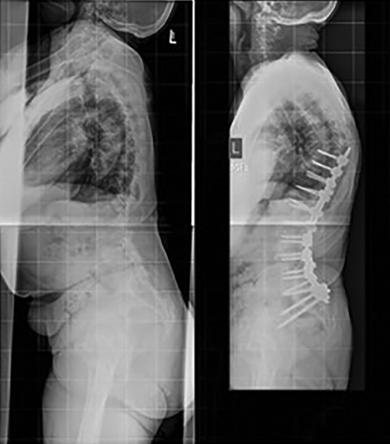
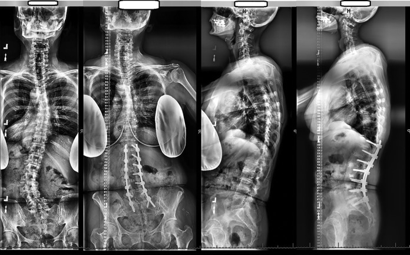
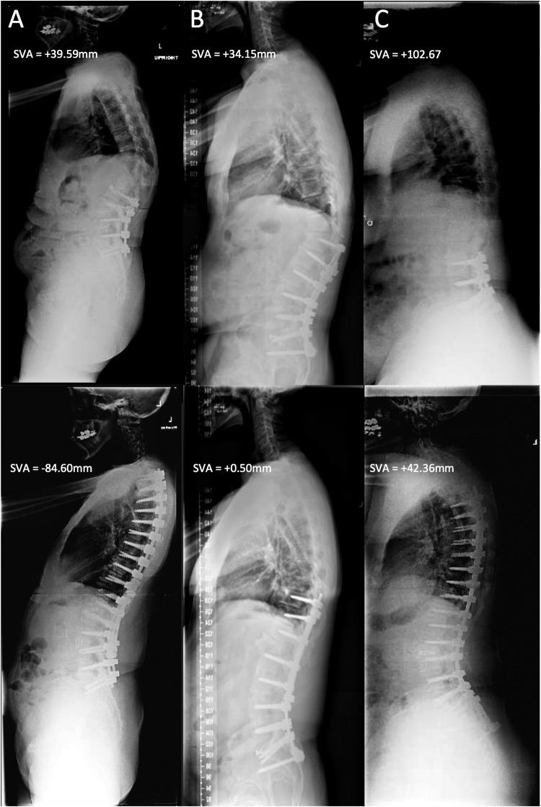
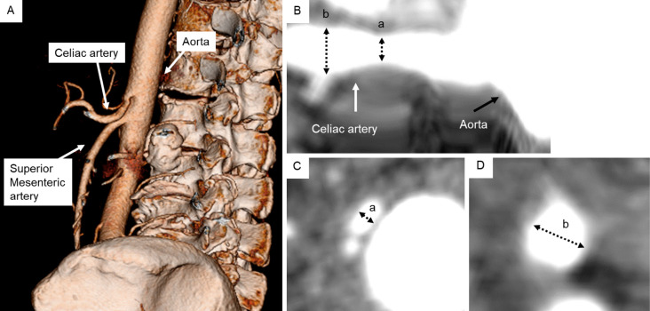
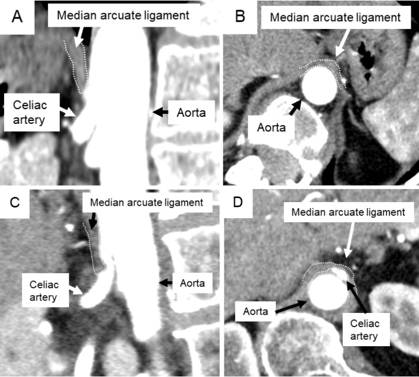
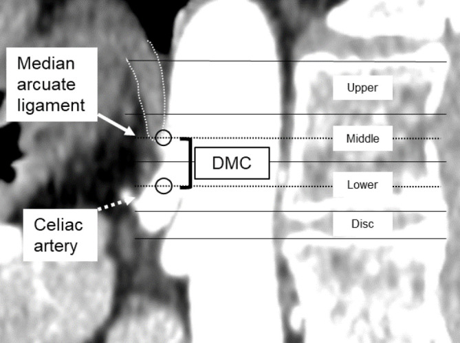
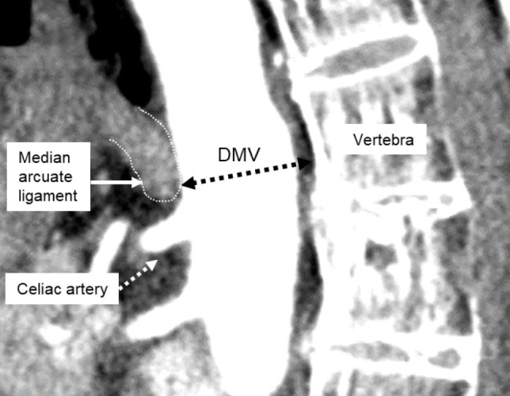
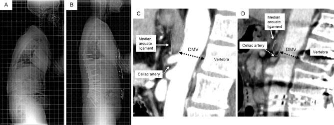
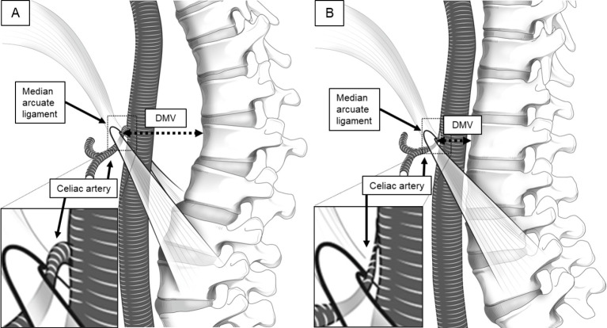
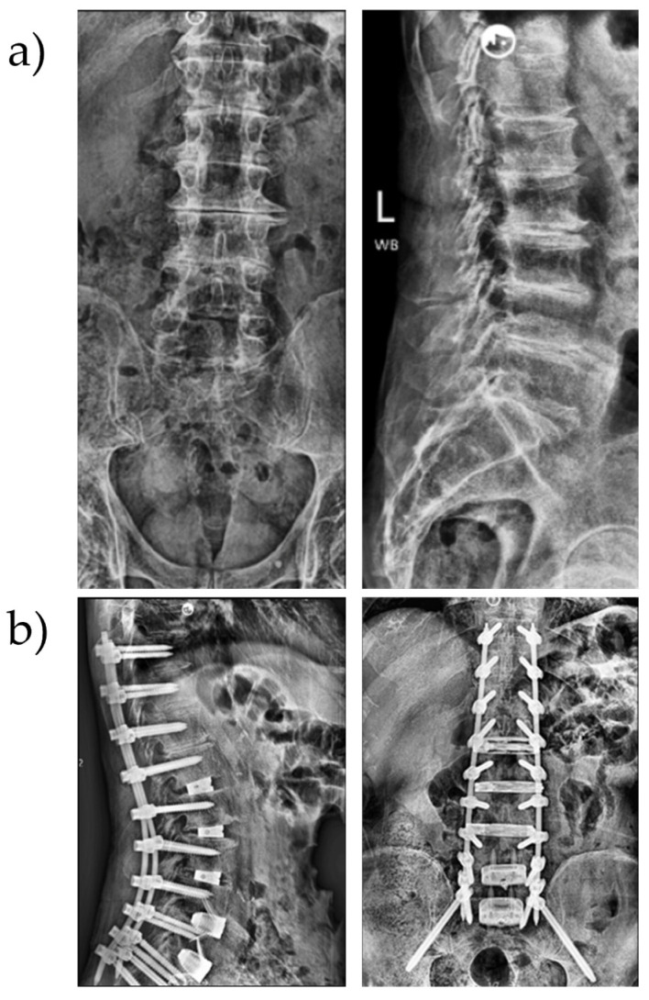

# Case Prep: Adult Spinal Deformity Correction (with Osteotomy — SPO / PSO / VCR)

---

<!-- BEGIN CASE SNAPSHOT -->

## Case / Approach Snapshot

- **Anatomy at risk:** cord/roots, pedicles, pelvic fixation corridors, osteotomy levels, segmental vessels, thoracic/abdominal structures, and sagittal/coronal balance landmarks.
- **Operative steps:** confirm alignment goals, position and monitor, expose planned levels, place fixation, perform releases/osteotomies/decompression as needed, correct deformity gradually, verify hardware/alignment, and close dead space; use the detailed operative sequence and approach notes below as the step-by-step source.
- **Rescue plans:** neuromonitoring change, excessive correction or imbalance, blood loss/coagulopathy, durotomy, screw breach, junctional/fixation failure, and staged correction or hardware revision.
- **Figures:** review [Figures, Imaging & Video](#figures-imaging--video) and the [Curated Image Set](#curated-image-set); embedded local figures should remain open-access, public-domain, or otherwise reusable with attribution.
- **Papers:** review [High-Yield Literature](#high-yield-literature) for seminal sources, modern reviews, and outcome data specific to this page.
- **Textbook cross-checks:** use [Textbook Cross-Checks](#textbook-cross-checks) and the [Source Crosswalk](../../resources/source-crosswalk.md) to cite copyrighted textbooks/atlases while summarizing in original words.

<!-- END CASE SNAPSHOT -->

## One-Liner
[Age]yo [M/F] with [adult degenerative scoliosis / sagittal imbalance / fixed kyphotic deformity / flatback] planned for [long-segment fusion with Smith-Petersen osteotomy / pedicle subtraction osteotomy / vertebral column resection] for deformity correction.

---

## Figures, Imaging & Video

**🎥 Operative video** — [search operative video on YouTube ▸](https://www.youtube.com/results?search_query=adult+spinal+deformity+surgery) · [The Neurosurgical Atlas ▸](https://www.neurosurgicalatlas.com)

[Neurosurgical Atlas](https://www.neurosurgicalatlas.com) · [AO Surgery Reference](https://surgeryreference.aofoundation.org) · [Radiopaedia](https://radiopaedia.org/search?q=adult%20spinal%20deformity&scope=all) · [PubMed Central](https://www.ncbi.nlm.nih.gov/pmc/?term=pedicle+subtraction+osteotomy+deformity) — operative figures © linked; see [media-sources.md](../../resources/media-sources.md)

---

<!-- BEGIN TEXTBOOK CROSS-CHECKS -->

## Textbook Cross-Checks

- **Spine anatomy and biomechanics:** Benzel Spine; Textbook of Spinal Surgery; Surgical Anatomy and Techniques to the Spine — confirm levels, approach-side anatomy, neural/vascular structures at risk, alignment, stability, and fixation rationale.
- **Technique sequence:** Youmans and Winn; Benzel Spine; Greenberg — review positioning, localization, exposure, decompression, instrumentation, fusion/reconstruction, and closure in original language.
- **Complication rescue:** Benzel Spine; Greenberg; Youmans and Winn — cross-check durotomy, neurologic change, vascular injury, wrong-level prevention, infection, implant failure, and postoperative restrictions.
- **Copyright-safe use:** cite these sources as private cross-checks, then write the guide content in original words; do not re-host textbook pages, figures, tables, or board-review card material. See [Source Crosswalk & Copyright-Safe Use](../../resources/source-crosswalk.md).

<!-- END TEXTBOOK CROSS-CHECKS -->

<!-- BEGIN CURATED LITERATURE -->

## High-Yield Literature

- **Adult spinal deformity correction surgery using age-adjusted alignment thresholds: clinical outcomes and mechanical complication rates. A systematic review of the literature** — Quarto E. European spine journal : official publication of the European Spine Society, the European Spinal Deformity Society, and the European Section of the Cervical Spine Research Society 2024. [PubMed](https://pubmed.ncbi.nlm.nih.gov/37740115/)
- **A systematic review of pseudarthrosis and reoperation rates in minimally invasive adult spinal deformity correction** — Kalavacherla S. World neurosurgery: X 2024. [PubMed](https://pubmed.ncbi.nlm.nih.gov/38444873/)
- **A guide to selecting upper thoracic versus lower thoracic uppermost instrumented vertebra in adult spinal deformity correction** — Kumar RP. European spine journal : official publication of the European Spine Society, the European Spinal Deformity Society, and the European Section of the Cervical Spine Research Society 2024. [PubMed](https://pubmed.ncbi.nlm.nih.gov/38522054/)
- **Editorial. Toward sustainable adult spinal deformity correction surgery** — Rabah NM. Journal of neurosurgery. Spine 2026. [PubMed](https://pubmed.ncbi.nlm.nih.gov/41719542/)
- **Patient Expectations of Adult Spinal Deformity Correction Surgery** — Ryu WHA. World neurosurgery 2021. [PubMed](https://pubmed.ncbi.nlm.nih.gov/33212277/)
- **Adult Spinal Deformity Correction in Patients with Parkinson Disease: Assessment of Surgical Complications, Reoperation, and Cost** — Berreta RS. World neurosurgery 2023. [PubMed](https://pubmed.ncbi.nlm.nih.gov/37480985/)
- **Instrumentation techniques to prevent proximal junctional kyphosis and proximal junctional failure in adult spinal deformity correction-a systematic review of biomechanical studies** — Doodkorte RJP. The spine journal : official journal of the North American Spine Society 2021. [PubMed](https://pubmed.ncbi.nlm.nih.gov/33482379/)
- **Adult Spinal Deformity Correction with Multi-level Anterior Column Releases: Description of a New Surgical Technique and Literature Review** — Demirkiran G. Clinical spine surgery 2016. [PubMed](https://pubmed.ncbi.nlm.nih.gov/27044020/)
- **Medical complications following adult spinal deformity correction in patients with autoimmune disease** — Madelar RTR. Journal of neurosurgery. Spine 2023. [PubMed](https://pubmed.ncbi.nlm.nih.gov/37029670/)
- **Minimally invasive surgical techniques in adult degenerative spinal deformity: a systematic review** — Bach K. Clinical orthopaedics and related research 2014. [PubMed](https://pubmed.ncbi.nlm.nih.gov/24488750/)

<!-- END CURATED LITERATURE -->

---

<!-- BEGIN CURATED IMAGE SET -->

## Curated Image Set

Open-access figures are embedded from PubMed Central articles and kept unique to this guide.

*Figure 1.. Preoperative and postoperative lateral radiographs of a patient from the HYB group who underwent T9-S1/pelvis reconstruction and incurred PJK. Source: [Early and Late Reoperation Rates With Various MIS Techniques for Adult Spinal Deformity Correction](https://pmc.ncbi.nlm.nih.gov/articles/PMC6362559/) — Global Spine Journal 2018; CC BY-NC-ND.*

*Figure 2.. Preoperative and postoperative PA and lateral radiographs of a patient corrected with cMIS and demonstrating lucency of the S1 screws and possible pseudarthrosis at L5-S1. Source: [Early and Late Reoperation Rates With Various MIS Techniques for Adult Spinal Deformity Correction](https://pmc.ncbi.nlm.nih.gov/articles/PMC6362559/) — Global Spine Journal 2018; CC BY-NC-ND.*

*Figure 1.. Representative standing, lateral radiographs taken preoperatively (top row) and postoperatively (bottom row). (A) Patient in group 1 (negative), with a postoperative sagittal vertical... Source: [Negative Sagittal Balance Following Adult Spinal Deformity Surgery](https://pmc.ncbi.nlm.nih.gov/articles/PMC5898670/) — Global Spine Journal 2017; CC BY-NC-ND.*

*Figure 1.. Three-dimensional images of enhanced computed tomography of the celiac artery (CA), superior mesenteric artery, and aorta (A). Reconstructed long-axis view of enhanced computed... Source: [Quantitative Assessment of Celiac and Superior Mesenteric Artery Diameters in Adult Spinal Deformity Surgery Using Three-dimensional Computed Tomography](https://pmc.ncbi.nlm.nih.gov/articles/PMC12330376/) — Spine Surgery and Related Research 2024; CC BY-NC-ND.*

*Figure 2.. Reconstructed sagittal (A, C) and axial (B, D) enhanced computed tomography images showing the median arcuate ligament (MAL) and the celiac artery. The MAL exists superior to the celiac... Source: [Quantitative Assessment of Celiac and Superior Mesenteric Artery Diameters in Adult Spinal Deformity Surgery Using Three-dimensional Computed Tomography](https://pmc.ncbi.nlm.nih.gov/articles/PMC12330376/) — Spine Surgery and Related Research 2024; CC BY-NC-ND.*

*Figure 3.. Sagittal reconstructed enhanced computed tomography images showing the MAL and CA levels (line circles). The distance between the MAL and CA (DMC) was defined as the differences in... Source: [Quantitative Assessment of Celiac and Superior Mesenteric Artery Diameters in Adult Spinal Deformity Surgery Using Three-dimensional Computed Tomography](https://pmc.ncbi.nlm.nih.gov/articles/PMC12330376/) — Spine Surgery and Related Research 2024; CC BY-NC-ND.*

*Figure 4.. Sagittal reconstructed enhanced computed tomography images of the MAL and vertebra. The distance between the MAL and a vertebra (DMV) was defined as the shortest distance between the MAL... Source: [Quantitative Assessment of Celiac and Superior Mesenteric Artery Diameters in Adult Spinal Deformity Surgery Using Three-dimensional Computed Tomography](https://pmc.ncbi.nlm.nih.gov/articles/PMC12330376/) — Spine Surgery and Related Research 2024; CC BY-NC-ND.*

*Figure 5.. Preoperative (A) and postoperative (B) radiographs. Preoperative (C) and postoperative (D) sagittal reconstructed enhanced computed tomography images. The distance between the MAL and... Source: [Quantitative Assessment of Celiac and Superior Mesenteric Artery Diameters in Adult Spinal Deformity Surgery Using Three-dimensional Computed Tomography](https://pmc.ncbi.nlm.nih.gov/articles/PMC12330376/) — Spine Surgery and Related Research 2024; CC BY-NC-ND.*

*Figure 6.. Preoperative (A) and postoperative (B) illustrations of the distance between the MAL and vertebra (DMV, black dotted arrow). Reduced DMV due to thoracolumbar kyphosis correction causes... Source: [Quantitative Assessment of Celiac and Superior Mesenteric Artery Diameters in Adult Spinal Deformity Surgery Using Three-dimensional Computed Tomography](https://pmc.ncbi.nlm.nih.gov/articles/PMC12330376/) — Spine Surgery and Related Research 2024; CC BY-NC-ND.*

*Figure 1. (a) Preoperative images of a patient with sagittal malalignment; (b) postoperative images showing expandable LLIF cages at L1–4, 3D-printed ALIF spacers at L4–S1 and robot-assisted... Source: [Minimally Invasive Robotic-Assisted Complex Adult Spinal Deformity Correction in a Surgical Specialty Hospital: Bringing Adult Spinal Deformity Care Closer to Home](https://pmc.ncbi.nlm.nih.gov/articles/PMC13116422/) — Journal of Clinical Medicine 2026; CC BY.*

<!-- END CURATED IMAGE SET -->

---

## History of Present Illness
- Chief complaint: **Disabling back pain, inability to stand upright (sagittal imbalance), leaning forward, fatigue**, radiculopathy/claudication, functional decline
- Progressive deformity, prior fusions (flatback, junctional failure), neurological symptoms
- Functional/disability status, prior conservative care

---

## Past Medical History
- **Bone quality/osteoporosis (DEXA)**, prior spine fusions, smoking, nutrition, BMI
- **Cardiopulmonary status (major surgery, blood loss)**, comorbidities (these are high-risk operations)
- Standard PMH; optimize before elective deformity surgery

---

## Imaging Review
### Standing Full-Length (36") Scoliosis X-rays (AP + lateral)
- **Spinopelvic parameters:** Pelvic Incidence (PI), Pelvic Tilt (PT), Sacral Slope (SS), Lumbar Lordosis (LL), Thoracic Kyphosis (TK)
- **Key targets:** **PI-LL mismatch < 10°**, **PT < 20°**, **SVA (sagittal vertical axis) < 5 cm**
- Cobb angles (coronal/sagittal), flexibility (bending/traction films), global alignment
### MRI / CT
- Stenosis/neural compression, bony anatomy/screw planning, fusion status, pseudarthrosis
### DEXA
- Bone density (screw fixation, fracture risk)

---

## Labs
- CBC, BMP, Coags, **type and crossmatch (multiple units — high blood loss)**, albumin/nutrition, HbA1c
- Cardiac/pulmonary clearance

---

## Neurological Examination
- Full motor/sensory/reflex, gait, balance, document baseline meticulously

---

## Surgical Planning

### Osteotomy Selection
- **Smith-Petersen osteotomy (SPO / Ponte):** posterior column osteotomy through facets, ~10° correction per level over a mobile disc; for gradual multilevel correction
- **Pedicle subtraction osteotomy (PSO):** 3-column wedge through pedicles + body, ~30° correction at one level; for **fixed sagittal imbalance/flatback**; high blood loss/risk
- **Vertebral column resection (VCR):** remove an entire vertebra (3-column); severe rigid/angular deformity; highest risk
- Goals: **restore sagittal/coronal alignment** (PI-LL match, SVA, PT), decompress, solid long fusion

### Position
- Prone on Jackson table (allows correction), Mayfield/foam, careful padding (long case, pressure/eyes/ION), IONM baseline

### Key Surgical Steps (PSO example)
1. Long posterior exposure, **segmental pedicle screw instrumentation** above and below
2. Decompression (laminectomy) at relevant levels
3. **PSO:** remove posterior elements at the osteotomy level, **resect both pedicles**, then a **wedge of the vertebral body** (decancellate, remove lateral walls), protecting the thecal sac/exiting roots
4. **Controlled closure of the osteotomy** (hinge on anterior cortex) to create lordosis — coordinate with anesthesia (hemodynamics, cord)
5. Place/contour rods (often **multiple/satellite rods** across PSO to prevent rod fracture), achieve correction, lock
6. Verify alignment (fluoroscopy/long films), decorticate and graft (long fusion), ± interbody support
7. Meticulous hemostasis (major blood loss), drains, closure

### Critical Anatomy & Structures at Risk
1. **Spinal cord / cauda equina** — during 3-column osteotomy and closure (subluxation/buckling, dural infolding) — **IONM critical**
2. **Nerve roots** at the osteotomy (foraminal compression on closure)
3. **Segmental/great vessels** (anterior to body — PSO/VCR), major blood loss
4. **Dura** (CSF leak), screw tracts, **proximal/distal junctional kyphosis/failure**

### Equipment
- Long pedicle screw-rod system (**multi-rod**), osteotomy instruments, high-speed drill, navigation/fluoroscopy
- **Cell saver, TXA**, crossmatched blood, interbody cages, biologics/graft, drains

### Monitoring
- **SSEPs, MEPs, EMG** (essential; wake-up test backup) — especially during osteotomy closure

### Anesthesia
- Arterial line, central access, **massive transfusion readiness, cell saver, TXA**, MAP support during correction, prone precautions (eyes — ION risk), long-case management, normothermia

### Potential Complications
1. **Neurological injury** (cord/root — osteotomy closure), **major blood loss**
2. **Proximal/distal junctional kyphosis/failure (PJK/PJF)**, pseudarthrosis, **rod fracture** (PSO)
3. Implant failure, infection, CSF leak, medical complications (high in elderly), vision loss (ION)
4. Loss of correction, revision

---

## Operative Note Template
**Preoperative Diagnosis:** Adult spinal deformity / sagittal imbalance [PI-LL mismatch __, SVA __, PT __]

**Postoperative Diagnosis:** Same

**Procedure:** Posterior instrumented fusion [levels] with [Smith-Petersen osteotomies / pedicle subtraction osteotomy at L_ / vertebral column resection] for deformity correction

**Surgeon / Assistant:**
**Anesthesia:** General endotracheal
**EBL / Fluids / Blood products:** [massive transfusion readiness; cell saver; TXA]
**Adjuncts:** Navigation/fluoroscopy, high-speed drill; **SSEP/MEP/EMG** (+ wake-up backup); MAP support
**Implants:** Long pedicle screw-rod construct (**multi-rod across the osteotomy**), interbody cages, bone graft/biologics
**Complications:** None

**Indications:** [Age]yo [M/F] with disabling [fixed sagittal imbalance/flatback/degenerative scoliosis] (PI-LL [__], SVA [__], PT [__]). A [PSO/SPO/VCR] with long fusion was planned to restore alignment. High-risk consent obtained (neuro injury, major blood loss, junctional failure).

**Description of Procedure:** After consent and time-out, general anesthesia was induced (arterial/central access, cell saver, TXA, massive-transfusion readiness) and neuromonitoring established. The patient was positioned prone on a Jackson table with meticulous padding (long case). A long posterior exposure was performed and **segmental pedicle screws** placed at the planned levels.

[PSO: posterior elements and both pedicles were removed at L[_] and a wedge of vertebral body resected (decancellation, lateral wall removal), protecting the thecal sac/exiting roots. The osteotomy was **controlled-closed** to create lordosis, coordinated with anesthesia/IONM.] [SPO/Ponte osteotomies were performed at multiple levels.] **Multiple/satellite rods** were placed across the osteotomy to prevent rod fracture, correction achieved, and **alignment targets (PI-LL, SVA, PT) confirmed** on long-cassette films. Decortication and grafting were performed; meticulous hemostasis obtained. Neuromonitoring [remained stable / changes addressed].

Drains were placed and closure performed in layers. The patient was transferred to the ICU with MAP support and serial neuro/hemoglobin monitoring.

---

## Postoperative Plan
- ICU, neuro checks q1h, MAP support, **Hgb/transfusion management**
- Standing long-cassette X-rays (alignment), CT (hardware)
- DVT prophylaxis (balance bleeding), drains, pain (multimodal), nutrition
- Mobilize with PT (± brace), bone health optimization (anabolic agents if osteoporotic)
- Monitor for PJK/PJF, pseudarthrosis, infection; long-term follow-up imaging
