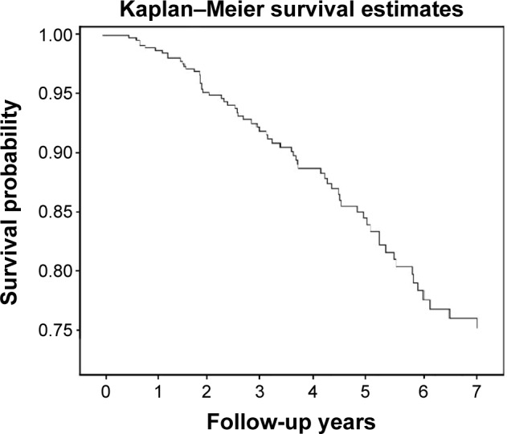
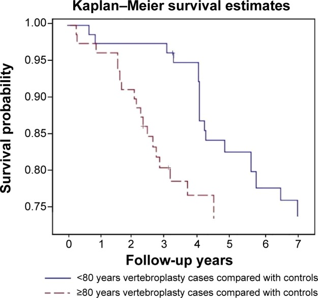
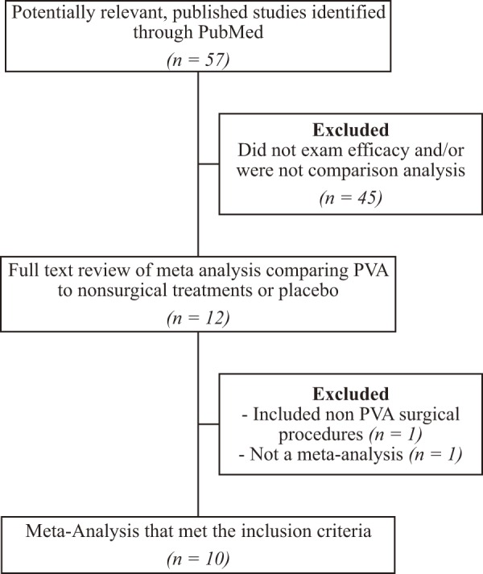
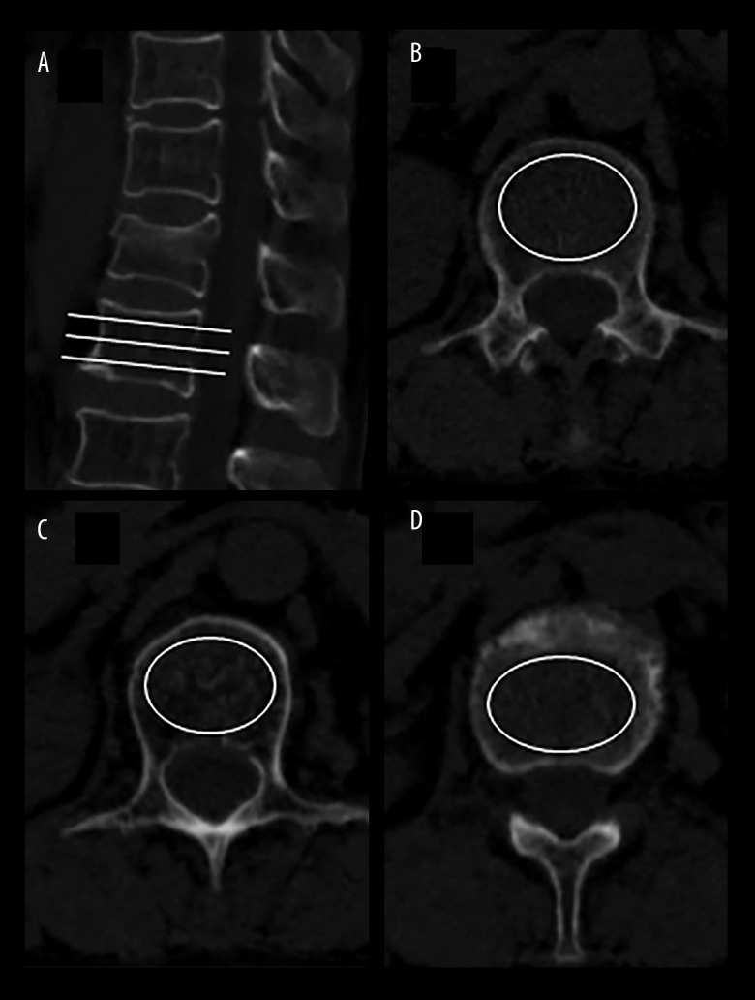
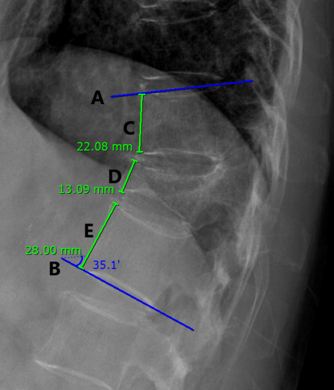
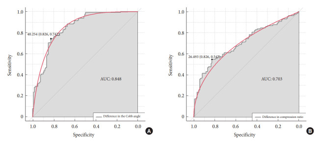
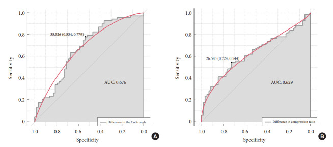
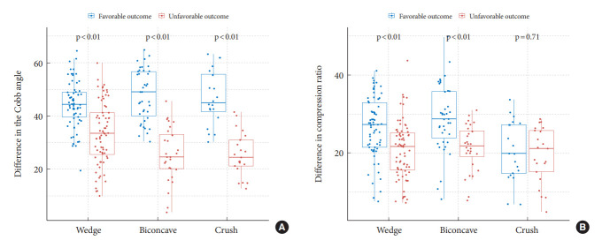
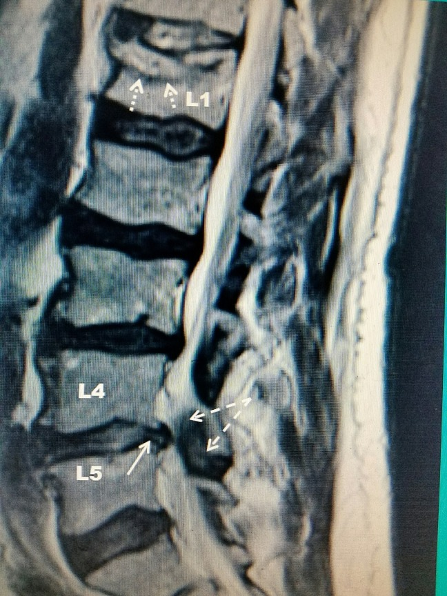
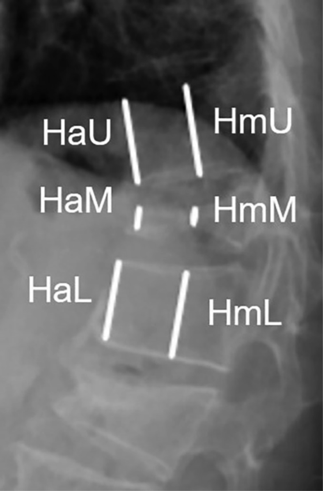

# Case Prep: Vertebral Augmentation (Kyphoplasty / Vertebroplasty)

---

<!-- BEGIN CASE SNAPSHOT -->

## Case / Approach Snapshot

- **Anatomy at risk:** cord/roots, pedicles, pelvic fixation corridors, osteotomy levels, segmental vessels, thoracic/abdominal structures, and sagittal/coronal balance landmarks.
- **Operative steps:** confirm alignment goals, position and monitor, expose planned levels, place fixation, perform releases/osteotomies/decompression as needed, correct deformity gradually, verify hardware/alignment, and close dead space; use the detailed operative sequence and approach notes below as the step-by-step source.
- **Rescue plans:** neuromonitoring change, excessive correction or imbalance, blood loss/coagulopathy, durotomy, screw breach, junctional/fixation failure, and staged correction or hardware revision.
- **Figures:** review [Figures, Imaging & Video](#figures-imaging--video) and the [Curated Image Set](#curated-image-set); embedded local figures should remain open-access, public-domain, or otherwise reusable with attribution.
- **Papers:** review [High-Yield Literature](#high-yield-literature) for seminal sources, modern reviews, and outcome data specific to this page.

<!-- END CASE SNAPSHOT -->

## One-Liner
[Age]yo [M/F] with a painful [osteoporotic / pathologic] [T_/L_] vertebral compression fracture refractory to conservative care planned for [balloon kyphoplasty / vertebroplasty].

---

## Figures, Imaging & Video

**🎥 Operative video** — [search operative video on YouTube ▸](https://www.youtube.com/results?search_query=vertebroplasty+surgery) · [The Neurosurgical Atlas ▸](https://www.neurosurgicalatlas.com)

[Neurosurgical Atlas](https://www.neurosurgicalatlas.com) · [AO Surgery Reference](https://surgeryreference.aofoundation.org) · [Radiopaedia](https://radiopaedia.org/search?q=vertebroplasty&scope=all) · [PubMed Central](https://www.ncbi.nlm.nih.gov/pmc/?term=kyphoplasty+vertebral+augmentation) — operative figures © linked; see [media-sources.md](../../resources/media-sources.md)

---

<!-- BEGIN COMMON PIMP QUESTIONS -->

## Common Pimp Questions

Use these to pressure-test preparation for **Vertebral Augmentation (Kyphoplasty / Vertebroplasty)**:

1. What neurologic level and root are responsible for the presenting deficit?
2. What is the decompression target and how will you know it is adequately decompressed?
3. What instability, deformity, bone-quality, or fusion variable changes the construct?
4. What vascular, visceral, dural, or neural structure is the main structure at risk?
5. What postop brace, drain, mobilization, MAP, antibiotic, and DVT plan should be ordered?

<!-- END COMMON PIMP QUESTIONS -->

<!-- BEGIN ATTENDING PREFERENCE VARIABLES -->

## Attending Preference Variables

Items that commonly vary by surgeon or institution:

- **Positioning frame, arms, traction, and localization workflow:** [attending-specific]
- **Navigation/robot/fluoro use, screw system, graft/biologic choice, and drain threshold:** [attending-specific]
- **Neuromonitoring modality and MAP goal for myelopathy, deformity, or cord-risk cases:** [attending-specific]
- **Brace, Foley, antibiotics, mobilization, and DVT prophylaxis timing:** [attending-specific]

<!-- END ATTENDING PREFERENCE VARIABLES -->

<!-- BEGIN CURATED LITERATURE -->

## High-Yield Literature

- **Vertebral augmentation** — Amans MR. Handbook of clinical neurology 2021. [PubMed](https://pubmed.ncbi.nlm.nih.gov/33272406/)
- **Vertebral augmentation: an overview** — Beall DP. Skeletal radiology 2023. [PubMed](https://pubmed.ncbi.nlm.nih.gov/35761093/)
- **Vertebral augmentation: How we do it** — Raja J. Techniques in vascular and interventional radiology 2024. [PubMed](https://pubmed.ncbi.nlm.nih.gov/39490369/)
- **Vertebral Augmentation in Spine Surgery** — Hoffmann J. The Journal of the American Academy of Orthopaedic Surgeons 2023. [PubMed](https://pubmed.ncbi.nlm.nih.gov/36952673/)
- **Vertebral augmentation for cancer patients** — Marcia S. The British journal of radiology 2025. [PubMed](https://pubmed.ncbi.nlm.nih.gov/40056395/)
- **Vertebral augmentation with spinal implants: third-generation vertebroplasty** — Manz D. Neuroradiology 2020. [PubMed](https://pubmed.ncbi.nlm.nih.gov/32803337/)
- **Percutaneous vertebral augmentation-pearls and pitfalls** — Espahbodinea S. Journal of spine surgery (Hong Kong) 2023. [PubMed](https://pubmed.ncbi.nlm.nih.gov/37038417/)
- **Vertebral Augmentation** — Munakomi S. 2026. [PubMed](https://pubmed.ncbi.nlm.nih.gov/31613506/)
- **Vertebral Augmentation of Cancer-Related Spinal Compression Fractures: A Systematic Review and Meta-Analysis** — Mattie R. Spine 2021. [PubMed](https://pubmed.ncbi.nlm.nih.gov/33958537/)
- **Percutaneous Vertebral Augmentation and Thermal Ablation in Patients with Spinal Metastases** — Tomasian A. Seminars in interventional radiology 2024. [PubMed](https://pubmed.ncbi.nlm.nih.gov/38993602/)

<!-- END CURATED LITERATURE -->

---

<!-- BEGIN CURATED IMAGE SET -->

## Curated Image Set

Open-access figures are embedded from PubMed Central articles and kept unique to this guide.

*Figure 1. Kaplan–Meier survival curve of overall repeat vertebral augmentations. Source: [Repeated vertebral augmentation for new vertebral compression fractures of postvertebral augmentation patients: a nationwide cohort study](https://pmc.ncbi.nlm.nih.gov/articles/PMC4381902/) — Clinical Interventions in Aging 2015; CC BY-NC.*

*Figure 2. The frequency with which patients underwent a second procedure was particularly high in patients ≥80 years of age. Source: [Repeated vertebral augmentation for new vertebral compression fractures of postvertebral augmentation patients: a nationwide cohort study](https://pmc.ncbi.nlm.nih.gov/articles/PMC4381902/) — Clinical Interventions in Aging 2015; CC BY-NC.*

*Figure 1.. This figure displays the methodology used in the literature search conducted for this review. Source: [Efficacy of Vertebral Augmentation for Vertebral Compression Fractures: A Review of Meta-Analyses](https://pmc.ncbi.nlm.nih.gov/articles/PMC6698519/) — Spine Surgery and Related Research 2018; CC BY-NC-ND.*

*Figure 1. HU value was measured on CT scans by the largest elliptical region of interest. (A) CT sagittal image shown the positions of the 3 slices. (B) Inferior to the upper endplate. (C) Middle... Source: [Risk Factors for New Vertebral Compression Fracture After Percutaneous Vertebral Augmentation: A Retrospective Study](https://pmc.ncbi.nlm.nih.gov/articles/PMC10362804/) — Medical Science Monitor : International Medical Journal of Experimental and Clinical Research 2023; CC BY-NC-ND.*

*Fig. 1.. Five lines (A–E) of the thoracolumbar vertebrae in xray radiographs were determined. The Cobb angle was measured using the angle between the superior endplate of the vertebral body above... Source: [Difference in the Cobb Angle Between Standing and Supine Position as a Prognostic Factor After Vertebral Augmentation in Osteoporotic Vertebral Compression Fractures](https://pmc.ncbi.nlm.nih.gov/articles/PMC9260559/) — Neurospine 2022; CC BY-NC.*

*Fig. 3.. Receiver operating characteristic (ROC) curve to identify the optimal cutoff values of the differences in the Cobb angle (A) and compression ratio (B) for the prediction of the... Source: [Difference in the Cobb Angle Between Standing and Supine Position as a Prognostic Factor After Vertebral Augmentation in Osteoporotic Vertebral Compression Fractures](https://pmc.ncbi.nlm.nih.gov/articles/PMC9260559/) — Neurospine 2022; CC BY-NC.*

*Fig. 4.. Receiver operating characteristic (ROC) curve to identify the optimal cutoff values of the differences in the Cobb angle (A) and compression ratio (B) for the prediction of the midterm... Source: [Difference in the Cobb Angle Between Standing and Supine Position as a Prognostic Factor After Vertebral Augmentation in Osteoporotic Vertebral Compression Fractures](https://pmc.ncbi.nlm.nih.gov/articles/PMC9260559/) — Neurospine 2022; CC BY-NC.*

*Fig. 5.. Boxplots with dot plots of the differences in the Cobb angle (A) and compression ratio (B) classified according to the shape of the fracture. Source: [Difference in the Cobb Angle Between Standing and Supine Position as a Prognostic Factor After Vertebral Augmentation in Osteoporotic Vertebral Compression Fractures](https://pmc.ncbi.nlm.nih.gov/articles/PMC9260559/) — Neurospine 2022; CC BY-NC.*

*Figure 1. T2 weighted sagittal MRI demonstrating a L1 vertebral compression fracture in addition to L4/L5 central spinal stenosis Source: [Evaluation and Interventional Management of Pain After Vertebral Augmentation Procedures](https://pmc.ncbi.nlm.nih.gov/articles/PMC5370199/) — Cureus 2017; CC BY.*

*Figure 1. The measurement of body height. H = vertebral body height; M = the fracture vertebra; U = upper segment; L = lower segment; a = anterior part of the vertebra; m = middle part of the... Source: [Percutaneous vertebral augmentation in special Genant IV osteoporotic vertebral compression fractures](https://pmc.ncbi.nlm.nih.gov/articles/PMC6938938/) — Journal of Orthopaedic Translation 2020; CC BY-NC-ND.*

<!-- END CURATED IMAGE SET -->

---

## History of Present Illness
- Chief complaint: **Focal axial back pain** at the fracture level, worse with movement/loading, point tenderness, limited mobility
- Acute/subacute fracture, **failed conservative management** (~2-6 weeks of analgesia, bracing) OR debilitating pain/immobility
- Etiology: **osteoporotic** (most), **pathologic** (metastasis, myeloma — augmentation for pain/stability), traumatic
- No neurological deficit (deficit/retropulsion with cord compression → consider open surgery instead)

---

## Past Medical History
- Osteoporosis (DEXA), malignancy (pathologic fracture), steroid use, prior fractures
- Anticoagulation/antiplatelet (correct), coagulopathy
- Standard PMH

---

## Imaging Review
### MRI (STIR/T2)
- **Marrow edema at the fracture level = acute/non-healed = likely to respond** (old healed fractures don't benefit); identify the symptomatic level among multiple fractures
- Posterior wall integrity/retropulsion, canal compromise (relative contraindication if significant), cord/cauda
- Pathologic features (mass, multilevel — myeloma/mets)
### CT
- Fracture morphology, **posterior wall/pedicle integrity** (cement leak risk), bony anatomy for needle trajectory
### X-ray (alignment, kyphosis)

---

## Labs
- CBC, **Coags (correct — needle, cement)**, BMP
- Malignancy workup if pathologic

---

## Neurological Examination
- Focused: confirm **no myelopathy/radiculopathy from retropulsion** (would change plan), document baseline

---

## Surgical Planning

### Case Logistics, OR Needs & Orders
- **Typical bed:** ICU or step-down after osteotomy/long fusion; floor or PACU pathway for kyphoplasty/vertebroplasty when medically stable.
- **OR setup:** Jackson table, neuromonitoring, navigation/O-arm/fluoro, deformity implant trays, osteotomy tools, cell saver, blood products, warming, and positioning plan for long prone time.
- **Special needs:** arterial line, Foley, type/cross, tranexamic acid/blood-loss plan per protocol, MAP targets for cord perfusion, no long paralytic with MEPs, and postoperative brace/rehab plan.
- **Immediate postop orders:** ICU/step-down neuro checks, hemoglobin/coags, drain output, CT/X-rays alignment/hardware, MAP goal if high-risk correction, brace/activity, DVT prophylaxis timing, bowel regimen, and PT/OT.

### Diagnosis & Indication
- Indication: Painful acute/subacute VCF (edema on MRI) refractory to/intolerant of conservative care; pathologic fracture pain/stabilization
- **Contraindications/caution:** asymptomatic/healed fracture, significant retropulsion with cord compression + deficit, uncorrectable coagulopathy, osteomyelitis at level, burst fracture with canal compromise
- **Kyphoplasty** (balloon creates cavity, may restore some height, lower-pressure cement fill) vs **vertebroplasty** (direct cement injection)

### Fracture Selection Checklist
- Confirm the painful level: focal percussion pain, acute/subacute marrow edema/STIR signal, concordant uptake when nuclear imaging is used, and no better explanation for pain.
- Do not treat an old collapsed level just because it looks dramatic; chronic fractures without edema are common false targets.
- Review posterior wall integrity, pedicle anatomy, canal compromise, epidural tumor, infection, and coagulopathy before deciding augmentation is enough.
- In malignancy, obtain biopsy when diagnosis is unknown or progression pattern is unexpected; coordinate radiation/oncology timing.
- In osteoporosis, the procedure is only one part of treatment: bone-health therapy is what prevents the next fracture.

### Kyphoplasty Versus Vertebroplasty
- Kyphoplasty may help when partial height restoration, cavity creation, or lower-pressure cement fill is desirable.
- Vertebroplasty is efficient for painful stable fractures where height restoration is not the goal and cement can be injected safely.
- Severe vertebra plana, burst morphology, major retropulsion, or posterior wall violation can make either procedure unsafe or less useful.

### Position & Anesthesia
- **Prone**, fluoroscopy (biplanar), **local + sedation (MAC)** or general; padded

### Key Surgical Steps
1. Biplanar fluoroscopic localization of the level and pedicles
2. **Transpedicular (or extrapedicular) needle/trocar** placement into the vertebral body under fluoroscopy (uni- or bipedicular) — stay within the pedicle (medial wall = canal; inferior = root)
3. **Kyphoplasty:** inflate balloon tamp to create a cavity (± height restoration), deflate, then inject **PMMA cement** under low pressure into the cavity
   **Vertebroplasty:** inject PMMA directly into the cancellous bone
4. **Inject cement under continuous live fluoroscopy** — stop immediately if any leak toward the canal/foramen/veins
5. Allow cement to cure, remove instruments
6. (Pathologic: may biopsy the lesion through the same access first)

### Critical Anatomy & Structures at Risk
1. **Pedicle walls** — medial breach → canal/cord; inferior → exiting root
2. **Posterior vertebral wall** — **cement leak into the canal** (cord/root compression) — the principal serious risk
3. **Basivertebral/epidural/segmental veins** — **cement venous embolism (pulmonary)**
4. Adjacent disc/foramen (leak)

### Equipment
- Kyphoplasty/vertebroplasty kit (trocars, balloon tamps, cement delivery), **PMMA cement (high-viscosity)**
- **Biplanar fluoroscopy** (essential), biopsy needle (pathologic)

### Anesthesia
- Local + MAC (common) or general; prone; monitor for cement embolism (hypoxia, hemodynamic change)

### Potential Complications
1. **Cement leak** — epidural/foraminal (neural compression, radiculopathy/myelopathy), discal, venous
2. **Pulmonary cement embolism**, rarely cardiac
3. **Adjacent-level fracture** (altered biomechanics — common in osteoporosis)
4. Pedicle breach/neural injury, infection, hematoma, no pain relief (wrong level/old fracture)

### Cement Leak and Failure Rescue
- **Leak toward canal/foramen:** stop injection immediately, wait for viscosity/cure, redirect only if a safe path remains, and obtain urgent imaging for any new radiculopathy/myelopathy.
- **Venous leak:** stop injection, allow cement to harden, monitor oxygenation/hemodynamics, and evaluate for pulmonary cement embolism if respiratory symptoms occur.
- **Pedicle breach:** withdraw/reposition before cement, confirm AP/lateral trajectory, and do not inject if the cannula cannot be kept safely intraosseous.
- **No pain relief:** reassess level concordance, chronicity, adjacent fracture, malignancy, infection, stenosis/radiculopathy, and non-spinal pain sources.
- **Adjacent fracture:** treat bone health aggressively and image new pain early; repeat augmentation only when the new level is acute and concordant.

---

## Operative Note Template
**Preoperative Diagnosis:** Painful [osteoporotic/pathologic] [T_/L_] vertebral compression fracture (acute, edema on MRI)

**Postoperative Diagnosis:** Same

**Procedure:** [Balloon kyphoplasty / Vertebroplasty] at [T_/L_] [with biopsy]

**Surgeon / Assistant:**
**Anesthesia:** [Local + MAC / general]
**EBL / Fluids:** Minimal
**Adjuncts:** **Biplanar fluoroscopy**
**Implants:** PMMA cement [± biopsy needle]
**Complications:** None

**Indications:** [Age]yo [M/F] with a painful [osteoporotic/pathologic] VCF at [T_/L_] (marrow edema on MRI) refractory to conservative care, without retropulsion/cord compression. Risks (cement leak, embolism, adjacent fracture) discussed.

**Description of Procedure:** After consent and time-out, [local anesthesia with sedation] was given and the patient positioned prone with biplanar fluoroscopy. The level and pedicles were localized. A **transpedicular trocar** was advanced into the vertebral body under fluoroscopy, staying within the pedicle (protecting the medial wall/canal and the exiting root). [Kyphoplasty: a balloon tamp was inflated to create a cavity (± height restoration) and deflated.] **PMMA cement was injected under continuous live fluoroscopy at low pressure**, with vigilant surveillance for any leak toward the canal/foramen/veins; injection was stopped appropriately and the cement allowed to cure. [A biopsy was obtained through the access for the pathologic fracture.]

Instruments were removed and the patient recovered supine for cement curing, then assessed neurologically and for pain relief.

---

## Postoperative Plan
- Recovery/observation (often same-day discharge); lie supine ~1-2h (cement cure)
- Neuro checks (new deficit → imaging for cement leak), pain assessment (often rapid relief)
- **Osteoporosis management** (calcium, vitamin D, anabolic/antiresorptive agents — prevent adjacent fractures), DEXA, endocrine/bone clinic
- Pathologic: oncology, address primary, consider RT
- Mobilize, follow-up; counsel re: adjacent-level fracture risk
