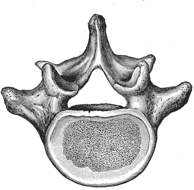

# Case Prep: Anterior Lumbar Interbody Fusion (ALIF)

---

## One-Liner
[Age]yo [M/F] with [degenerative disc disease / spondylolisthesis / flat back / pseudarthrosis] at [L4-5 / L5-S1] planned for anterior lumbar interbody fusion [± posterior instrumentation].

---

## Figures, Imaging & Video

**🎥 Operative video** — [search operative video on YouTube ▸](https://www.youtube.com/results?search_query=lumbar+degenerative+disc+disease+surgery) · [The Neurosurgical Atlas ▸](https://www.neurosurgicalatlas.com)

**📑 Key evidence — landmark trials & guidelines**

- **SLIP** — Ghogawala Z et al. *NEJM* 2016 — laminectomy ± fusion for degenerative spondylolisthesis. [🔗 PubMed](https://pubmed.ncbi.nlm.nih.gov/?term=Ghogawala+SLIP+laminectomy+fusion+spondylolisthesis+2016+NEJM)
- **Swedish fusion study** — Försth P et al. *NEJM* 2016 — fusion surgery for lumbar stenosis. [🔗 PubMed](https://pubmed.ncbi.nlm.nih.gov/?term=Forsth+fusion+surgery+lumbar+spinal+stenosis+2016+NEJM)
- **Guidelines:** [NASS Clinical Guidelines](https://www.spine.org/Research-Clinical-Care/Quality-Improvement/Clinical-Guidelines) · [AOSpine](https://www.aofoundation.org)
[Neurosurgical Atlas](https://www.neurosurgicalatlas.com) · [AO Surgery Reference](https://surgeryreference.aofoundation.org) · [Radiopaedia](https://radiopaedia.org/search?q=lumbar%20degenerative%20disc%20disease&scope=all) · [PubMed Central](https://www.ncbi.nlm.nih.gov/pmc/?term=anterior+lumbar+interbody+fusion) — operative figures © linked; see [media-sources.md](../../resources/media-sources.md)

*Gray's Anatomy (1918), public domain — via Wikimedia Commons.*

*Gray's Anatomy (1918), public domain — via Wikimedia Commons.*

*Gray's Anatomy (1918), public domain — via Wikimedia Commons.*

---

## History of Present Illness
- Chief complaint: Axial low back pain (discogenic), deformity, or need for large interbody/lordosis restoration
- Failed conservative management
- **ALIF advantages:** large interbody footprint, excellent disc height/lordosis restoration, direct anterior column support, no posterior muscle dissection; **ideal at L5-S1 and L4-5** (below bifurcation challenges)

---

## Past Medical History
- **Prior abdominal/retroperitoneal surgery** (adhesions — access surgeon consideration)
- Vascular disease, prior DVT, males: **retrograde ejaculation risk** (superior hypogastric plexus — counsel)
- Single kidney, large vessel anatomy
- Standard PMH

---

## Imaging Review
### MRI/X-ray/CT
- Disc degeneration (Modic), alignment, lordosis, spondylolisthesis
- **Vascular anatomy (MRI/CTA):** great vessel bifurcation level, iliac vessels, left iliac vein course (L5-S1 in the bifurcation window; L4-5 requires mobilizing vessels)
- Sacral slope, pelvic parameters (deformity planning)
- Bone quality (osteoporosis → subsidence)

---

## Labs
- CBC, BMP, Coags, **Type and crossmatch** (vascular injury risk), HbA1c

---

## Neurological Examination
- Lower extremity exam, baseline; document for comparison

---

## Surgical Planning

### Approach Team
- **Access (vascular/general) surgeon** typically performs the anterior retroperitoneal exposure; spine surgeon does discectomy/implant

### Position
- Supine on radiolucent table, slight Trendelenburg, arms out; fluoroscopy AP/lateral

### Key Surgical Steps
1. **Anterior retroperitoneal approach** (access surgeon): transverse or paramedian incision, develop retroperitoneal plane (left-sided), mobilize peritoneal contents medially
2. **Vessel mobilization:** identify and protect great vessels; at L5-S1 work in the bifurcation window between iliac vessels; at L4-5 mobilize the left iliac vessels (ligate iliolumbar vein if needed); **protect superior hypogastric plexus** (presacral — use blunt dissection, avoid monopolar at L5-S1 → retrograde ejaculation)
3. Confirm level (fluoroscopy), expose anterior annulus
4. **Complete discectomy:** wide annulotomy, thorough disc removal, endplate preparation (preserve bony endplate)
5. Release posterior annulus/PLL as needed for distraction/lordosis
6. **Trial and place large ALIF interbody** (PEEK/titanium) packed with graft (allograft/autograft/BMP — BMP commonly used in ALIF but counsel re: risks); **integrated screws or anterior buttress plate** for fixation
7. Restore disc height/segmental lordosis; confirm position on fluoroscopy
8. Hemostasis, vessel re-inspection, closure (access surgeon)
9. **± Staged/same-day posterior instrumentation** (pedicle screws) for stability (esp. spondylolisthesis, multilevel, standalone insufficient)

### Critical Anatomy & Structures at Risk
1. **Great vessels** — aorta/IVC bifurcation, **left common iliac vein** (most commonly injured — torrential bleeding)
2. **Superior hypogastric plexus** (presacral) — **retrograde ejaculation** in males (avoid monopolar at L5-S1)
3. **Ureter** (left, retroperitoneal), sympathetic chain
4. **L5 nerve root** (anteriorly at L5-S1), bowel/peritoneum

### Equipment
- ALIF interbody implants + trials, anterior fixation (integrated screws/plate)
- Vascular instruments/retractors (access), fluoroscopy
- Bone graft/BMP, hemostatic agents, **vascular repair capability/vascular surgery available**

### Monitoring
- SSEPs/EMG optional; vascular monitoring

### Anesthesia
- Arterial line, large-bore IV/central access, **crossmatched blood (vessel injury)**, vascular surgery backup, Foley

### Potential Complications
1. **Vascular injury** (iliac vein) — major hemorrhage; vascular repair
2. **Retrograde ejaculation** (hypogastric plexus), sympathetic dysfunction (leg warmth/color change)
3. Ileus, bowel/ureter injury, incisional hernia, DVT
4. Subsidence, pseudarthrosis, implant migration, BMP-related complications (ectopic bone, swelling)

---

## Operative Note Template
**Preoperative Diagnosis:** [Degenerative disc disease / spondylolisthesis / flatback] at [L4-5 / L5-S1]

**Postoperative Diagnosis:** Same

**Procedure:** Anterior lumbar interbody fusion at [L_-S_] [with integrated screws/anterior plate] [± posterior pedicle screw fixation]

**Surgeon / Assistant:** Spine + access (vascular/general) surgeon
**Anesthesia:** General endotracheal
**EBL / Fluids / Blood products:** [crossmatched; vascular repair available]
**Adjuncts:** Fluoroscopy
**Implants:** ALIF interbody (PEEK/Ti) + integrated screws/plate, bone graft [± BMP]
**Complications:** None

**Indications:** [Age]yo [M/F] with [discogenic pain/spondylolisthesis] at [L_-S_] needing large interbody support and lordosis restoration. The anterior approach was chosen for direct anterior column access. Risks (vascular injury, retrograde ejaculation, ileus) discussed; males counseled re: retrograde ejaculation.

**Description of Procedure:** After consent and time-out, general anesthesia was induced with the patient supine. **The access surgeon performed a retroperitoneal (left-sided) approach**, mobilizing the peritoneal contents medially and **protecting the great vessels** [working in the bifurcation window at L5-S1 / mobilizing the left iliac vessels at L4-5], with **blunt dissection over the L5-S1 disc to protect the superior hypogastric plexus** (no monopolar). The level was confirmed.

A complete discectomy was performed with endplate preparation (preserving bony endplates). A large ALIF interbody packed with graft was sized, placed, and secured with integrated screws/plate, **restoring disc height and segmental lordosis**, confirmed on fluoroscopy. Vessels were re-inspected and hemostasis confirmed; the access surgeon closed the approach. [Posterior pedicle screw fixation was performed in the same/staged setting for added stability.]

The patient was transferred with distal pulse/vascular and neuro monitoring.

---

## Postoperative Plan
- Floor/step-down, neuro and **vascular checks (distal pulses, leg perfusion)**
- Monitor for ileus (advance diet slowly), abdominal exam
- X-rays POD1, DVT prophylaxis (higher DVT risk — vessel manipulation)
- Activity, brace per surgeon, smoking cessation
- Counsel males re: retrograde ejaculation; follow-up for fusion (CT 6-12 months)
