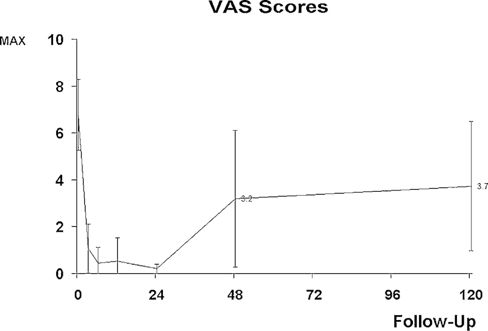
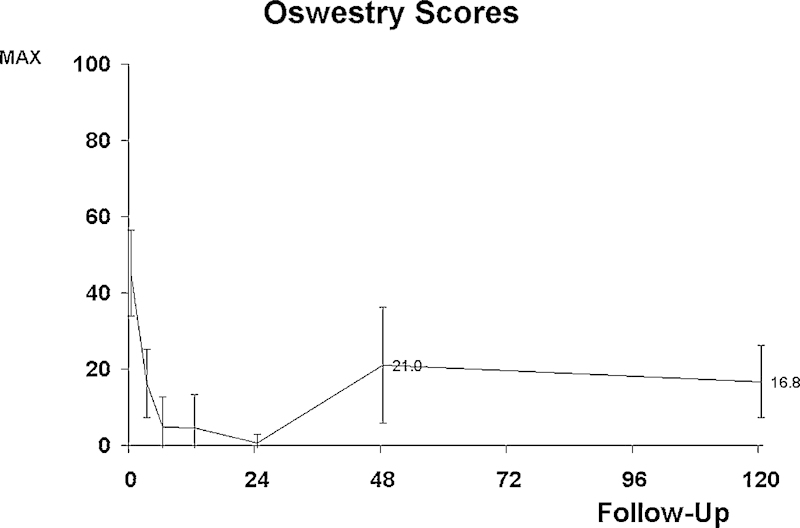
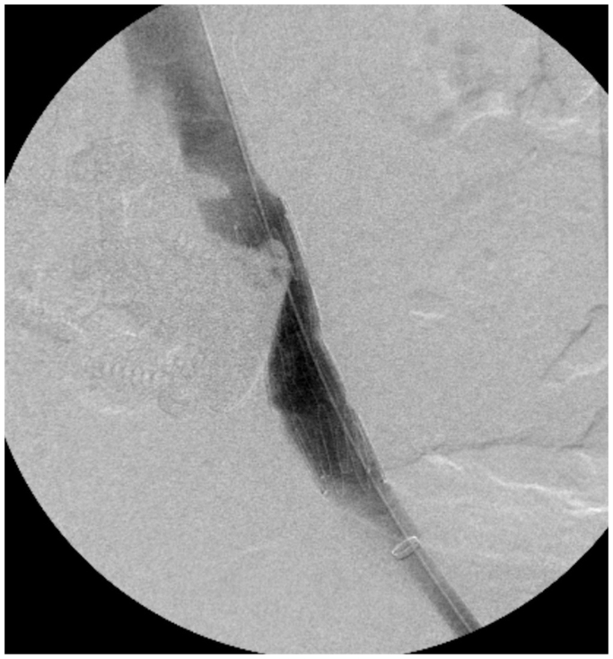
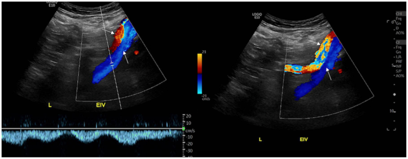
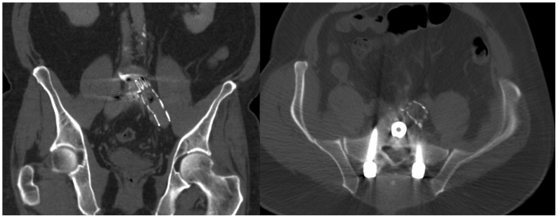
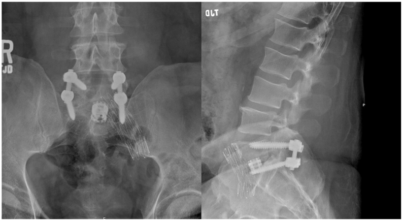
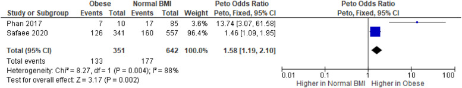
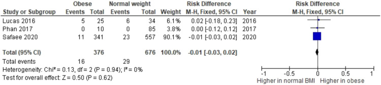

# Case Prep: Anterior Lumbar Interbody Fusion (ALIF)

<!-- BEGIN CASE SNAPSHOT -->

## Case / Approach Snapshot

- **Anatomy at risk:** level localization, cord/cauda equina, exiting and traversing roots, dura, vertebral artery or segmental vessels, esophagus/trachea/pleura/viscera by approach, and fusion/instrumentation landmarks.
- **Operative steps:** position and pad carefully, confirm level, expose the planned corridor, decompress neural elements, reconstruct or instrument when indicated, verify alignment/hardware, and close with attention to hematoma and wound risk; use the detailed operative sequence and approach notes below as the step-by-step source.
- **Rescue plans:** wrong level, durotomy, neurologic change, vertebral artery/visceral/pleural injury, graft or hardware problem, epidural hematoma, dysphagia/airway issue, and infection prevention/escalation.
- **Figures:** review [Figures, Imaging & Video](#figures-imaging--video) and the [Curated Image Set](#curated-image-set); embedded local figures should remain open-access, public-domain, or otherwise reusable with attribution.
- **Papers:** review [High-Yield Literature](#high-yield-literature) for seminal sources, modern reviews, and outcome data specific to this page.

<!-- END CASE SNAPSHOT -->

## One-Liner
[Age]yo [M/F] with [degenerative disc disease / spondylolisthesis / flat back / pseudarthrosis] at [L4-5 / L5-S1] planned for anterior lumbar interbody fusion [± posterior instrumentation].

---

## Figures, Imaging & Video

**🎥 Operative video** — [search operative video on YouTube ▸](https://www.youtube.com/results?search_query=lumbar+degenerative+disc+disease+surgery) · [The Neurosurgical Atlas ▸](https://www.neurosurgicalatlas.com)

[Neurosurgical Atlas](https://www.neurosurgicalatlas.com) · [AO Spine / Surgery Reference](https://www.aofoundation.org/spine) · [Radiopaedia](https://radiopaedia.org/search?q=lumbar%20degenerative%20disc%20disease&scope=all) · [PubMed Central](https://www.ncbi.nlm.nih.gov/pmc/?term=anterior+lumbar+interbody+fusion) — operative figures © linked; see [media-sources.md](../../resources/media-sources.md)

---

<!-- BEGIN CURATED LITERATURE -->

## High-Yield Literature

- **Anterior lumbar interbody fusion: patient selection and workup** — Barber SM. Journal of spine surgery (Hong Kong) 2024. [PubMed](https://pubmed.ncbi.nlm.nih.gov/39816775/)
- **Lumbar interbody fusion: techniques, indications and comparison of interbody fusion options including PLIF, TLIF, MI-TLIF, OLIF/ATP, LLIF and ALIF** — Mobbs RJ. Journal of spine surgery (Hong Kong) 2015. [PubMed](https://pubmed.ncbi.nlm.nih.gov/27683674/)
- **Anterior lumbar interbody fusion** — Burke PJ. Radiologic technology 2001. [PubMed](https://pubmed.ncbi.nlm.nih.gov/11392300/)
- **Animal Model for Anterior Lumbar Interbody Fusion: A Literature Review** — Yoshizato H. Spine surgery and related research 2024. [PubMed](https://pubmed.ncbi.nlm.nih.gov/39131411/)
- **Expandable Cage Technology-Transforaminal, Anterior, and Lateral Lumbar Interbody Fusion** — Macki M. Operative neurosurgery (Hagerstown, Md.) 2021. [PubMed](https://pubmed.ncbi.nlm.nih.gov/34128070/)
- **Lymphocele after anterior lumbar interbody fusion: a review of 1322 patients** — Scheer JK. Journal of neurosurgery. Spine 2021. [PubMed](https://pubmed.ncbi.nlm.nih.gov/34416719/)
- **Minimally invasive anterior, lateral, and oblique lumbar interbody fusion: a literature review** — Xu DS. Annals of translational medicine 2018. [PubMed](https://pubmed.ncbi.nlm.nih.gov/29707553/)
- **Transforaminal Versus Anterior Lumbar Interbody Fusion at L5-S1 for Degenerative Spine Disease : A Meta-Analysis** — Daniels AH. Spine 2025. [PubMed](https://pubmed.ncbi.nlm.nih.gov/40066769/)
- **Anterior lumbar interbody fusion implants: a narrative review of current trends and future directions** — Bayaton AJ. Journal of spine surgery (Hong Kong) 2025. [PubMed](https://pubmed.ncbi.nlm.nih.gov/40621388/)
- **Endoscopic Anterior Lumbar Interbody Fusion: Systematic Review and Meta-Analysis** — Brown NJ. Asian spine journal 2023. [PubMed](https://pubmed.ncbi.nlm.nih.gov/38105638/)

<!-- END CURATED LITERATURE -->

<!-- BEGIN CURATED IMAGE SET -->

## Curated Image Set

Open-access figures are embedded from PubMed Central articles and kept unique to this guide.

*Figure 1. Visual analogue scale (VAS) scores of the study population during the 10-year follow-up. Source: [Good Functional Outcome and Adjacent Segment Disc Quality 10 Years after Single-Level Anterior Lumbar Interbody Fusion with Posterior Fixation](https://pmc.ncbi.nlm.nih.gov/articles/PMC3864470/) — Global Spine Journal 2012; open access.*

*Figure 2. Oswestry Disability Index scores of the study population during the 10-year follow-up. Source: [Good Functional Outcome and Adjacent Segment Disc Quality 10 Years after Single-Level Anterior Lumbar Interbody Fusion with Posterior Fixation](https://pmc.ncbi.nlm.nih.gov/articles/PMC3864470/) — Global Spine Journal 2012; open access.*

*Fig 1. Intraoperative post deployment venogram demonstrates patent left common iliac vein (CIV). Source: [Adjunctive endovascular stent graft reinforcement of the common iliac vein for safer anterior lumbar interbody fusion](https://pmc.ncbi.nlm.nih.gov/articles/PMC11930080/) — Journal of Vascular Surgery Cases, Innovations and Techniques 2025; CC BY-NC-ND.*

*Fig 2. Postoperative lower extremity venous duplex ultrasound demonstrates good flow through the left common and external iliac vein. Normal venous Doppler waveform is shown on the left. Bottom... Source: [Adjunctive endovascular stent graft reinforcement of the common iliac vein for safer anterior lumbar interbody fusion](https://pmc.ncbi.nlm.nih.gov/articles/PMC11930080/) — Journal of Vascular Surgery Cases, Innovations and Techniques 2025; CC BY-NC-ND.*

*Fig 3. Coronal (left) and transverse (right) non-contrast computed tomography scans demonstrate left common iliac vein (CIV) stent with no hematoma in the retroperitoneum. Source: [Adjunctive endovascular stent graft reinforcement of the common iliac vein for safer anterior lumbar interbody fusion](https://pmc.ncbi.nlm.nih.gov/articles/PMC11930080/) — Journal of Vascular Surgery Cases, Innovations and Techniques 2025; CC BY-NC-ND.*

*Fig 4. Coronal (left) and sagittal (right) x-rays of lumbar spine demonstrate stable L5-S1 anterior lumbar interbody fusion (ALIF) and left common iliac vein (CIV) stent at 4-month follow-up. Source: [Adjunctive endovascular stent graft reinforcement of the common iliac vein for safer anterior lumbar interbody fusion](https://pmc.ncbi.nlm.nih.gov/articles/PMC11930080/) — Journal of Vascular Surgery Cases, Innovations and Techniques 2025; CC BY-NC-ND.*

*Figure 3.. Risk of total complications across comparative study in obese and normal BMI patients. Source: [Obesity: An Independent Risk Factor for Complications in Anterior Lumbar Interbody Fusion? A Systematic Review](https://pmc.ncbi.nlm.nih.gov/articles/PMC9609508/) — Global Spine Journal 2022; CC BY-NC-ND.*

*Figure 4.. Risk of vascular complications arising from each study group. Source: [Obesity: An Independent Risk Factor for Complications in Anterior Lumbar Interbody Fusion? A Systematic Review](https://pmc.ncbi.nlm.nih.gov/articles/PMC9609508/) — Global Spine Journal 2022; CC BY-NC-ND.*

*Figure 9. Source: [Obesity: An Independent Risk Factor for Complications in Anterior Lumbar Interbody Fusion? A Systematic Review](https://pmc.ncbi.nlm.nih.gov/articles/PMC9609508/) — Global Spine J. 2022 Feb 22;12(8):1894–903. doi: 10.1177/21925682211072849; CC BY-NC-ND.*

*Figure 10. Source: [Obesity: An Independent Risk Factor for Complications in Anterior Lumbar Interbody Fusion? A Systematic Review](https://pmc.ncbi.nlm.nih.gov/articles/PMC9609508/) — Global Spine J. 2022 Feb 22;12(8):1894–903. doi: 10.1177/21925682211072849; CC BY-NC-ND.*

<!-- END CURATED IMAGE SET -->

---

## History of Present Illness
- Chief complaint: Axial low back pain (discogenic), deformity, or need for large interbody/lordosis restoration
- Failed conservative management
- **ALIF advantages:** large interbody footprint, excellent disc height/lordosis restoration, direct anterior column support, no posterior muscle dissection; **ideal at L5-S1 and L4-5** (below bifurcation challenges)

---

## Past Medical History
- **Prior abdominal/retroperitoneal surgery** (adhesions — access surgeon consideration)
- Vascular disease, prior DVT, males: **retrograde ejaculation risk** (superior hypogastric plexus — counsel)
- Single kidney, large vessel anatomy
- Standard PMH

---

## Imaging Review
### MRI/X-ray/CT
- Disc degeneration (Modic), alignment, lordosis, spondylolisthesis
- **Vascular anatomy (MRI/CTA):** great vessel bifurcation level, iliac vessels, left iliac vein course (L5-S1 in the bifurcation window; L4-5 requires mobilizing vessels)
- Sacral slope, pelvic parameters (deformity planning)
- Bone quality (osteoporosis → subsidence)

---

## Labs
- CBC, BMP, Coags, **Type and crossmatch** (vascular injury risk), HbA1c

---

## Neurological Examination
- Lower extremity exam, baseline; document for comparison

---

## Surgical Planning

### Case Logistics, OR Needs & Orders
- **OR table/bed:** supine radiolucent table with C-arm access and vascular/retroperitoneal exposure setup.
- **OR setup:** radiolucent/Jackson table, fluoroscopy or O-arm/navigation, microscope/loupes for decompression, implant trays/graft ready for fusion, neuromonitoring for myelopathy/cord-risk cases, and postop brace plan confirmed.
- **Special needs:** arterial line/Foley/type-screen for long fusion/corpectomy, no long paralytic when MEPs are used, MAP/normotension for myelopathy or cord-risk cases, antibiotic redosing, and anticoagulation/DVT plan.
- **Immediate postop orders:** neuro checks by myotome/sensory level, airway/dysphagia watch for anterior cervical cases, CT/X-rays per construct, drain care, brace/activity orders, DVT prophylaxis timing, bowel regimen, and PT/OT mobilization.

### Approach Team
- **Access (vascular/general) surgeon** typically performs the anterior retroperitoneal exposure; spine surgeon does discectomy/implant

### Position
- **OR table/bed:** supine radiolucent table with C-arm access and vascular/retroperitoneal exposure setup.
- Supine on radiolucent table, slight Trendelenburg, arms out; fluoroscopy AP/lateral

### Key Surgical Steps
1. **Anterior retroperitoneal approach** (access surgeon): transverse or paramedian incision, develop retroperitoneal plane (left-sided), mobilize peritoneal contents medially
2. **Vessel mobilization:** identify and protect great vessels; at L5-S1 work in the bifurcation window between iliac vessels; at L4-5 mobilize the left iliac vessels (ligate iliolumbar vein if needed); **protect superior hypogastric plexus** (presacral — use blunt dissection, avoid monopolar at L5-S1 → retrograde ejaculation)
3. Confirm level (fluoroscopy), expose anterior annulus
4. **Complete discectomy:** wide annulotomy, thorough disc removal, endplate preparation (preserve bony endplate)
5. Release posterior annulus/PLL as needed for distraction/lordosis
6. **Trial and place large ALIF interbody** (PEEK/titanium) packed with graft (allograft/autograft/BMP — BMP commonly used in ALIF but counsel re: risks); **integrated screws or anterior buttress plate** for fixation
7. Restore disc height/segmental lordosis; confirm position on fluoroscopy
8. Hemostasis, vessel re-inspection, closure (access surgeon)
9. **± Staged/same-day posterior instrumentation** (pedicle screws) for stability (esp. spondylolisthesis, multilevel, standalone insufficient)

### Critical Anatomy & Structures at Risk
1. **Great vessels** — aorta/IVC bifurcation, **left common iliac vein** (most commonly injured — torrential bleeding)
2. **Superior hypogastric plexus** (presacral) — **retrograde ejaculation** in males (avoid monopolar at L5-S1)
3. **Ureter** (left, retroperitoneal), sympathetic chain
4. **L5 nerve root** (anteriorly at L5-S1), bowel/peritoneum

### Equipment
- ALIF interbody implants + trials, anterior fixation (integrated screws/plate)
- Vascular instruments/retractors (access), fluoroscopy
- Bone graft/BMP, hemostatic agents, **vascular repair capability/vascular surgery available**

### Monitoring
- SSEPs/EMG optional; vascular monitoring

### Anesthesia
- Arterial line, large-bore IV/central access, **crossmatched blood (vessel injury)**, vascular surgery backup, Foley

### Potential Complications
1. **Vascular injury** (iliac vein) — major hemorrhage; vascular repair
2. **Retrograde ejaculation** (hypogastric plexus), sympathetic dysfunction (leg warmth/color change)
3. Ileus, bowel/ureter injury, incisional hernia, DVT
4. Subsidence, pseudarthrosis, implant migration, BMP-related complications (ectopic bone, swelling)

---

## Operative Note Template
**Preoperative Diagnosis:** [Degenerative disc disease / spondylolisthesis / flatback] at [L4-5 / L5-S1]

**Postoperative Diagnosis:** Same

**Procedure:** Anterior lumbar interbody fusion at [L_-S_] [with integrated screws/anterior plate] [± posterior pedicle screw fixation]

**Surgeon / Assistant:** Spine + access (vascular/general) surgeon
**Anesthesia:** General endotracheal
**EBL / Fluids / Blood products:** [crossmatched; vascular repair available]
**Adjuncts:** Fluoroscopy
**Implants:** ALIF interbody (PEEK/Ti) + integrated screws/plate, bone graft [± BMP]
**Complications:** None

**Indications:** [Age]yo [M/F] with [discogenic pain/spondylolisthesis] at [L_-S_] needing large interbody support and lordosis restoration. The anterior approach was chosen for direct anterior column access. Risks (vascular injury, retrograde ejaculation, ileus) discussed; males counseled re: retrograde ejaculation.

**Description of Procedure:** After consent and time-out, general anesthesia was induced with the patient supine. **The access surgeon performed a retroperitoneal (left-sided) approach**, mobilizing the peritoneal contents medially and **protecting the great vessels** [working in the bifurcation window at L5-S1 / mobilizing the left iliac vessels at L4-5], with **blunt dissection over the L5-S1 disc to protect the superior hypogastric plexus** (no monopolar). The level was confirmed.

A complete discectomy was performed with endplate preparation (preserving bony endplates). A large ALIF interbody packed with graft was sized, placed, and secured with integrated screws/plate, **restoring disc height and segmental lordosis**, confirmed on fluoroscopy. Vessels were re-inspected and hemostasis confirmed; the access surgeon closed the approach. [Posterior pedicle screw fixation was performed in the same/staged setting for added stability.]

The patient was transferred with distal pulse/vascular and neuro monitoring.

---

## Postoperative Plan
- Floor/step-down, neuro and **vascular checks (distal pulses, leg perfusion)**
- Monitor for ileus (advance diet slowly), abdominal exam
- X-rays POD1, DVT prophylaxis (higher DVT risk — vessel manipulation)
- Activity, brace per surgeon, smoking cessation
- Counsel males re: retrograde ejaculation; follow-up for fusion (CT 6-12 months)

<!-- BEGIN CHIEF LEVEL TAKEAWAYS -->

## Chief-Level Case Review

Use these as the senior-level mental model for **Anterior Lumbar Interbody Fusion (ALIF)**:

- **Decision point:** Localize twice and instrument once: numbering, transitional anatomy, prior hardware, rib count, navigation dataset, and fluoroscopic level confirmation are mandatory.
- **Technical lever:** Positioning is treatment: table choice, abdomen-free prone setup, alignment goals, shoulders/hips, eyes/plexus pressure, neuromonitoring baselines, and fluoroscopic access all change the case.
- **Bailout:** Protect neural elements by sequence: decompression before correction when needed, MAP support for cord risk, no long paralytic with MEPs, and immediate response to signal change.
- **Postop watch:** Finish with construct logic: decompression adequacy, screw purchase, alignment, fusion bed/graft, drain plan, brace/activity orders, postop CT/X-rays, and DVT timing.

<!-- END CHIEF LEVEL TAKEAWAYS -->

<!-- BEGIN COMMON PIMP QUESTIONS -->

## Common Pimp Questions

Use these to pressure-test preparation for **Anterior Lumbar Interbody Fusion (ALIF)**:

1. What neurologic level and root are responsible for the presenting deficit?
2. What is the decompression target and how will you know it is adequately decompressed?
3. What instability, deformity, bone-quality, or fusion variable changes the construct?
4. What vascular, visceral, dural, or neural structure is the main structure at risk?
5. What postop brace, drain, mobilization, MAP, antibiotic, and DVT plan should be ordered?

<!-- END COMMON PIMP QUESTIONS -->

<!-- BEGIN ATTENDING PREFERENCE VARIABLES -->

## Attending Preference Variables

Items that commonly vary by surgeon or institution:

- **Positioning frame, arms, traction, and localization workflow:** [attending-specific]
- **Navigation/robot/fluoro use, screw system, graft/biologic choice, and drain threshold:** [attending-specific]
- **Neuromonitoring modality and MAP goal for myelopathy, deformity, or cord-risk cases:** [attending-specific]
- **Brace, Foley, antibiotics, mobilization, and DVT prophylaxis timing:** [attending-specific]

<!-- END ATTENDING PREFERENCE VARIABLES -->
