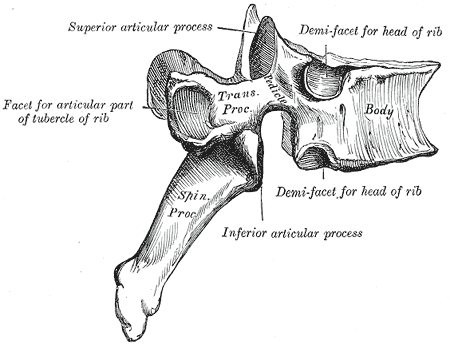
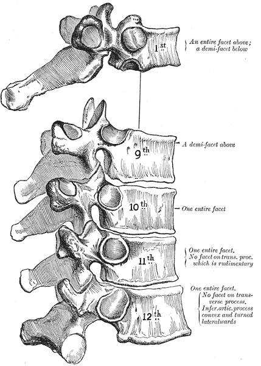

# Case Prep: Anterior Thoracic Corpectomy and Reconstruction (Transthoracic / Thoracoscopic)

---

## One-Liner
[Age]yo [M/F] with [T_] [burst fracture / tumor / infection / calcified central disc with myelopathy] requiring anterior column reconstruction planned for [transthoracic open / thoracoscopic / lateral] thoracic corpectomy and reconstruction.

---

## Figures, Imaging & Video

> 🧭 **Operative approach:** [Transthoracic approach](../approaches/transthoracic-approach.md) — detailed corridor setup, step-by-step technique & figures

[Neurosurgical Atlas](https://www.neurosurgicalatlas.com) · [AO Surgery Reference](https://surgeryreference.aofoundation.org) · [Radiopaedia](https://radiopaedia.org/search?q=thoracic%20vertebral%20body%20tumour&scope=all) · [PubMed Central](https://www.ncbi.nlm.nih.gov/pmc/?term=thoracic+corpectomy+reconstruction) — operative figures © linked; see [media-sources.md](../../resources/media-sources.md)

*Gray's Anatomy (1918), public domain — via Wikimedia Commons.*

*Gray's Anatomy (1918), public domain — via Wikimedia Commons.*

*Gray's Anatomy (1918), public domain — via Wikimedia Commons.*

---

## History of Present Illness
- Chief complaint: Myelopathy from anterior cord compression, deformity, mechanical pain
- Indication for anterior corpectomy: significant **ventral cord compression** (retropulsed fragment, tumor, calcified disc, infection/abscess), anterior column deficiency needing reconstruction
- Etiology (trauma/tumor/infection) drives workup

---

## Past Medical History
- **Pulmonary function** (thoracotomy/lung deflation), cardiac, prior thoracic surgery
- Etiology-specific (oncologic staging, infection source)
- Standard PMH

---

## Imaging Review
### MRI / CT Thoracic
- Ventral compression, vertebral body destruction, canal compromise, cord signal
- Level, adjacent levels, **segmental vessels / artery of Adamkiewicz** (CTA — thoracolumbar, usually left → influences approach side)
- Pleural/mediastinal anatomy, lung
### Etiology workup
- Tumor (staging, embolization if vascular), infection (cultures, ESR/CRP), trauma (TLICS, alignment)

---

## Labs
- CBC, BMP, Coags, **type and crossmatch (2-4 units)**, etiology-specific (cultures, markers)

---

## Neurological Examination
- Lower extremity motor/sensory (sensory level), reflexes, gait, sphincter, document baseline

---

## Surgical Planning

### Approach & Side
- **Open transthoracic (thoracotomy)** vs **thoracoscopic (VATS)** vs **mini-open lateral**
- **Side:** generally **left** for mid-thoracic (avoid liver/IVC; aorta more forgiving/repairable), but **right** for upper thoracic (avoid heart/aortic arch) and per Adamkiewicz/lesion side
- Access/thoracic surgeon often assists

### Position
- **Lateral decubitus**, **double-lumen ETT with lung deflation** on the operative side, axillary roll, table flexed; fluoroscopy/IONM baseline

### Key Surgical Steps
1. Thoracotomy (rib resection over the level, often the rib 1-2 above) or thoracoscopic portals; deflate lung
2. Reflect pleura, **ligate segmental vessels** at the involved level(s) (preserve Adamkiewicz per CTA), expose the vertebral body
3. Confirm level (fluoroscopy)
4. **Discectomies above and below**, then **corpectomy** (remove vertebral body, decompress the canal ventrally) — work toward but protect the PLL/dura/cord
5. Complete ventral cord decompression (remove retropulsed fragment/tumor/abscess)
6. **Anterior reconstruction:** expandable cage / mesh + graft (or PMMA) in the corpectomy defect
7. **Anterior instrumentation** (lateral plate/rod-screw) for stability; ± posterior fixation (staged) for unstable/3-column injuries
8. Hemostasis, **chest tube**, lung re-inflation, closure

### Critical Anatomy & Structures at Risk
1. **Aorta, azygos, segmental vessels, great vessels** — major hemorrhage
2. **Artery of Adamkiewicz / cord blood supply** — cord infarction (CTA planning, ligate selectively)
3. **Spinal cord** (ventral decompression), dura
4. **Lung/pleura** (pneumothorax, effusion), **thoracic duct** (chylothorax — left upper), sympathetic chain/esophagus

### Equipment
- Thoracotomy / thoracoscopic (VATS) set, **double-lumen tube**, chest tube
- High-speed drill, corpectomy instruments, **expandable cage/mesh + anterior plate/rod**, graft
- Fluoroscopy/navigation, cell saver, crossmatched blood, vascular repair backup

### Monitoring
- **SSEPs, MEPs**, EMG

### Anesthesia
- **Lung isolation (double-lumen)**, arterial line, central access, **crossmatched blood**, MAP support (cord), no paralytic (IONM), thoracic/access surgeon

### Potential Complications
1. **Vascular injury / major hemorrhage**, cord infarction (segmental artery), cord injury
2. **Pulmonary** (pneumothorax, effusion, atelectasis, prolonged air leak), **chylothorax** (thoracic duct)
3. Hardware failure/subsidence, CSF leak, approach morbidity (intercostal neuralgia)

---

## Operative Note Template
**Preoperative Diagnosis:** [T_] [burst fracture / tumor / infection / calcified disc] with ventral cord compression / anterior column deficiency

**Postoperative Diagnosis:** Same

**Procedure:** [Transthoracic (open) / thoracoscopic] [T_] corpectomy with anterior reconstruction (expandable cage) and instrumentation [± posterior fixation]

**Surgeon / Assistant:** Spine + [thoracic/access] surgeon
**Anesthesia:** General endotracheal with double-lumen tube (lung isolation)
**EBL / Fluids / Blood products:** [crossmatched; cell saver]
**Adjuncts:** Fluoroscopy/navigation, high-speed drill; SSEP/MEP; MAP support; chest tube
**Implants:** Expandable cage/mesh + anterior plate/rod-screw, graft
**Complications:** None

**Indications:** [Age]yo [M/F] with [pathology] at [T_] causing ventral cord compression requiring direct decompression and anterior reconstruction. Approach side [left for mid-thoracic / right for upper-thoracic] per anatomy/Adamkiewicz. Risks (vascular/cord/pulmonary) discussed.

**Description of Procedure:** After consent and time-out, general anesthesia was induced with a double-lumen tube and neuromonitoring established. The patient was positioned in lateral decubitus and the operative-side lung deflated. [A thoracotomy over the appropriate rib / thoracoscopic portals] provided access; the pleura was reflected and the level confirmed. **Segmental vessels at the involved level were ligated** (preserving the artery of Adamkiewicz per CTA).

Discectomies above and below were followed by a **corpectomy with ventral decompression of the canal**. An expandable cage [/PMMA-mesh] reconstructed the anterior column, secured with anterior instrumentation [± staged posterior fixation], and alignment confirmed. Hemostasis was obtained. **A chest tube was placed** and the lung re-inflated.

Closure was performed in layers. The patient was transferred to the ICU with chest-tube/pulmonary care, MAP support, and serial neuro exams.

---

## Postoperative Plan
- ICU, neuro checks (lower extremity/sensory level/sphincter), MAP support
- **Chest tube management, CXR** (pneumothorax, effusion, chyle — monitor output character)
- CT/X-ray postop (hardware, decompression), pulmonary toilet/incentive spirometry
- DVT prophylaxis, pain control (intercostal/epidural analgesia)
- Etiology-specific (oncology adjuvant/RT, IV antibiotics for infection), follow-up for fusion
