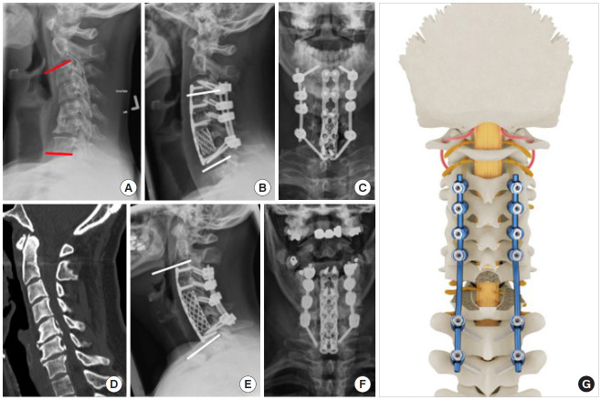
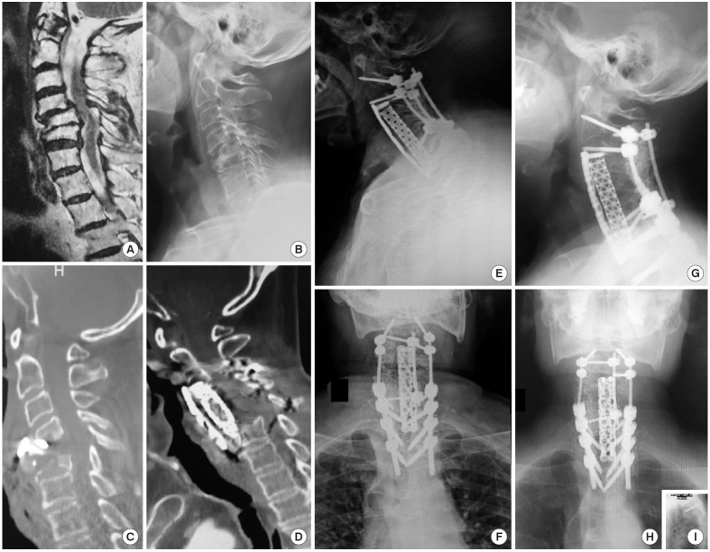
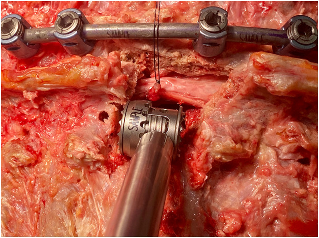
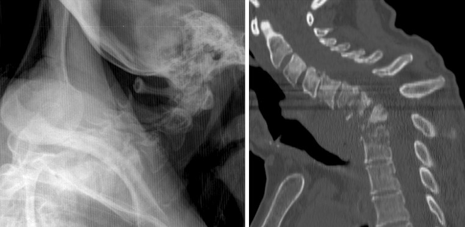
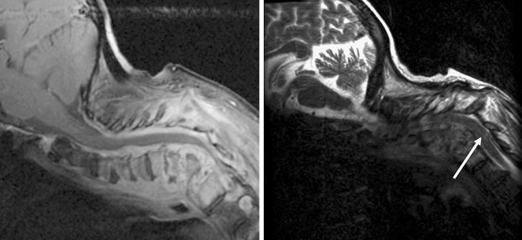
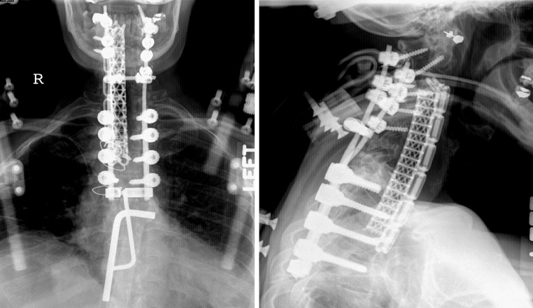
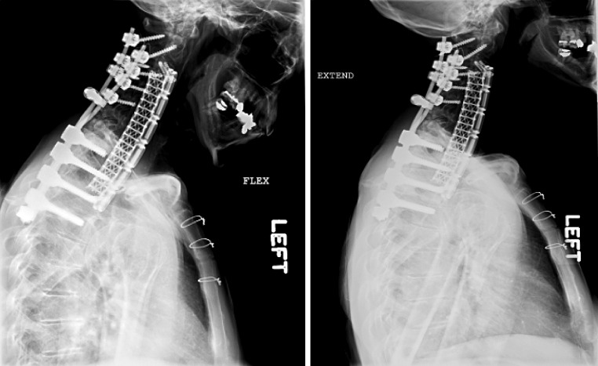
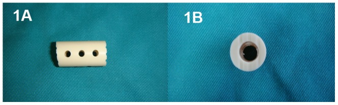
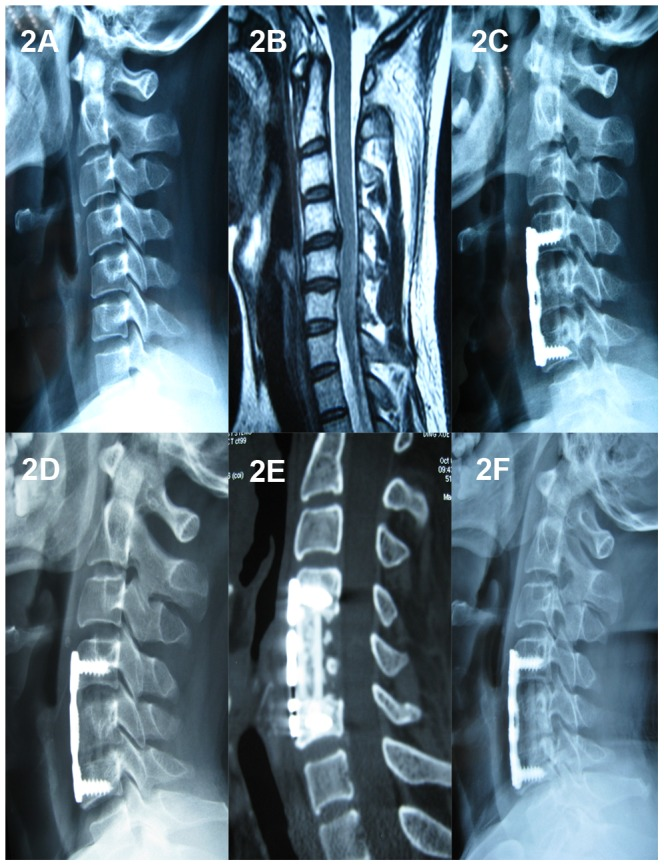
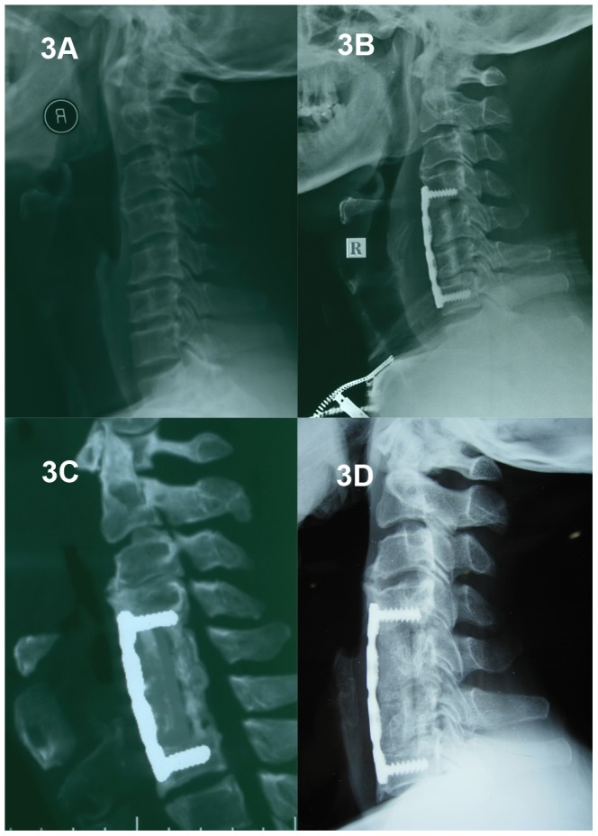

# Case Prep: Anterior Thoracic Corpectomy and Reconstruction (Transthoracic / Thoracoscopic)

---

<!-- BEGIN CASE SNAPSHOT -->

## Case / Approach Snapshot

- **Anatomy at risk:** level localization, cord/cauda equina, exiting and traversing roots, dura, vertebral artery or segmental vessels, esophagus/trachea/pleura/viscera by approach, and fusion/instrumentation landmarks.
- **Operative steps:** position and pad carefully, confirm level, expose the planned corridor, decompress neural elements, reconstruct or instrument when indicated, verify alignment/hardware, and close with attention to hematoma and wound risk; use the detailed operative sequence and approach notes below as the step-by-step source.
- **Rescue plans:** wrong level, durotomy, neurologic change, vertebral artery/visceral/pleural injury, graft or hardware problem, epidural hematoma, dysphagia/airway issue, and infection prevention/escalation.
- **Figures:** review [Figures, Imaging & Video](#figures-imaging--video) and the [Curated Image Set](#curated-image-set); embedded local figures should remain open-access, public-domain, or otherwise reusable with attribution.
- **Papers:** review [High-Yield Literature](#high-yield-literature) for seminal sources, modern reviews, and outcome data specific to this page.

<!-- END CASE SNAPSHOT -->

## One-Liner
[Age]yo [M/F] with [T_] [burst fracture / tumor / infection / calcified central disc with myelopathy] requiring anterior column reconstruction planned for [transthoracic open / thoracoscopic / lateral] thoracic corpectomy and reconstruction.

---

## Figures, Imaging & Video

**🎥 Operative video** — [search operative video on YouTube ▸](https://www.youtube.com/results?search_query=thoracic+vertebral+body+tumour+surgery) · [The Neurosurgical Atlas ▸](https://www.neurosurgicalatlas.com)

> 🧭 **Operative approach:** [Transthoracic approach](../approaches/transthoracic-approach.md) — detailed corridor setup, step-by-step technique & figures

[Neurosurgical Atlas](https://www.neurosurgicalatlas.com) · [AO Surgery Reference](https://surgeryreference.aofoundation.org) · [Radiopaedia](https://radiopaedia.org/search?q=thoracic%20vertebral%20body%20tumour&scope=all) · [PubMed Central](https://www.ncbi.nlm.nih.gov/pmc/?term=thoracic+corpectomy+reconstruction) — operative figures © linked; see [media-sources.md](../../resources/media-sources.md)

---

<!-- BEGIN COMMON PIMP QUESTIONS -->

## Common Pimp Questions

Use these to pressure-test preparation for **Anterior Thoracic Corpectomy and Reconstruction (Transthoracic / Thoracoscopic)**:

1. What neurologic level and root are responsible for the presenting deficit?
2. What is the decompression target and how will you know it is adequately decompressed?
3. What instability, deformity, bone-quality, or fusion variable changes the construct?
4. What vascular, visceral, dural, or neural structure is the main structure at risk?
5. What postop brace, drain, mobilization, MAP, antibiotic, and DVT plan should be ordered?

<!-- END COMMON PIMP QUESTIONS -->

<!-- BEGIN ATTENDING PREFERENCE VARIABLES -->

## Attending Preference Variables

Items that commonly vary by surgeon or institution:

- **Positioning frame, arms, traction, and localization workflow:** [attending-specific]
- **Navigation/robot/fluoro use, screw system, graft/biologic choice, and drain threshold:** [attending-specific]
- **Neuromonitoring modality and MAP goal for myelopathy, deformity, or cord-risk cases:** [attending-specific]
- **Brace, Foley, antibiotics, mobilization, and DVT prophylaxis timing:** [attending-specific]

<!-- END ATTENDING PREFERENCE VARIABLES -->

<!-- BEGIN CURATED LITERATURE -->

## High-Yield Literature

- **Transpedicular partial corpectomy without anterior vertebral reconstruction in thoracic spinal metastases** — Chen YJ. Spine 2007. [PubMed](https://pubmed.ncbi.nlm.nih.gov/18090069/)
- **Long-term outcomes of the nano-hydroxyapatite/polyamide-66 cage versus the titanium mesh cage for anterior reconstruction of thoracic and lumbar corpectomy: a retrospective study with at least 7 years of follow-up** — Hu B. Journal of orthopaedic surgery and research 2023. [PubMed](https://pubmed.ncbi.nlm.nih.gov/37408000/)
- **Palliative transpedicular partial corpectomy without anterior vertebral reconstruction in lower thoracic and thoracolumbar junction spinal metastases** — Chang CC. Journal of orthopaedic surgery and research 2015. [PubMed](https://pubmed.ncbi.nlm.nih.gov/26183322/)
- **Thoracic lateral extracavitary corpectomy for anterior column reconstruction with expandable and static titanium cages: clinical outcomes and surgical considerations in a consecutive case series** — Holland CM. Clinical neurology and neurosurgery 2015. [PubMed](https://pubmed.ncbi.nlm.nih.gov/25528373/)
- **Anterior reconstruction with nano-hydroxyapatite/polyamide-66 cage after thoracic and lumbar corpectomy** — Yang X. Orthopedics 2012. [PubMed](https://pubmed.ncbi.nlm.nih.gov/22229617/)
- **Low Anterior Cervical Approach Without Sternotomy or Clavicle Resection for Upper Thoracic Vertebra Corpectomy** — Babici D. Cureus 2021. [PubMed](https://pubmed.ncbi.nlm.nih.gov/34909292/)
- **Anterior thoracic spine reconstruction using a titanium mesh cage and pedicled rib flap** — O'Shaughnessy BA. Spine 2006. [PubMed](https://pubmed.ncbi.nlm.nih.gov/16845358/)
- **Coaxial double-lumen methylmethacrylate reconstruction in the anterior cervical and upper thoracic spine after tumor resection** — Miller DJ. Journal of neurosurgery 2000. [PubMed](https://pubmed.ncbi.nlm.nih.gov/10763689/)
- **Vascularized Bone Flap Options for Complex Thoracic Spinal Reconstruction** — Asaad M. Plastic and reconstructive surgery 2022. [PubMed](https://pubmed.ncbi.nlm.nih.gov/35196694/)
- **Posterior thoracic corpectomy with cage reconstruction for metastatic spinal tumors: comparing the mini-open approach to the open approach** — Lau D. Journal of neurosurgery. Spine 2015. [PubMed](https://pubmed.ncbi.nlm.nih.gov/25932599/)

<!-- END CURATED LITERATURE -->

---

<!-- BEGIN CURATED IMAGE SET -->

## Curated Image Set

Open-access figures are embedded from PubMed Central articles and kept unique to this guide.

*Fig. 7.. Standard posterior instrumentation. Clinical example of a patient with moderate cervical kyphosis and residual stenosis following anterior cervical discectomy and fusion (A) receiving a... Source: [The Effect of Rod Pattern, Outrigger, and Multiple Screw-Rod Constructs for Surgical Stabilization of the 3-Column Destabilized Cervical Spine - A Biomechanical Analysis and Introduction of a Novel Technique](https://pmc.ncbi.nlm.nih.gov/articles/PMC7538352/) — Neurospine 2020; CC BY-NC.*

*Fig. 9.. Clinical example of a 6S3R-construct. (A–C) A 65-year-old patient presenting with a history of failed anterior cervical discectomy and fusion for degenerative instability, multilevel... Source: [The Effect of Rod Pattern, Outrigger, and Multiple Screw-Rod Constructs for Surgical Stabilization of the 3-Column Destabilized Cervical Spine - A Biomechanical Analysis and Introduction of a Novel Technique](https://pmc.ncbi.nlm.nih.gov/articles/PMC7538352/) — Neurospine 2020; CC BY-NC.*

*Fig. 2. A titanium expandable corpectomy cage fits into the bespoke bony window using only the tagged nerve for gentle gravity retraction as demonstrated in this cadaveric specimen Source: [A rib-sparing unilateral transpedicular thoracic corpectomy using the ultrasonic bone scalpel: a novel technique and pictorial guide](https://pmc.ncbi.nlm.nih.gov/articles/PMC11466036/) — BMC Surgery 2024; CC BY-NC-ND.*

*Fig. 1. (Left) Swimmer’s view radiograph demonstrating kyphosis related to C4–T2 osteomyelitis. (Right) Sagittal reformatted CT scan demonstrating extensive osseous erosion with kyphotic... Source: [Successful outcome of six-level cervicothoracic corpectomy and circumferential reconstruction: case report and review of literature on multilevel cervicothoracic corpectomy](https://pmc.ncbi.nlm.nih.gov/articles/PMC1602202/) — European Spine Journal 2006; open access.*

*Fig. 2. (Left) Sagittal T1 post-gadolinium MR sequence revealing extensive prevertebral and circumferential enhancing epidural abscess and enhancing vertebrae, compatible with osteomyelitis.... Source: [Successful outcome of six-level cervicothoracic corpectomy and circumferential reconstruction: case report and review of literature on multilevel cervicothoracic corpectomy](https://pmc.ncbi.nlm.nih.gov/articles/PMC1602202/) — European Spine Journal 2006; open access.*

*Fig. 3. Postoperative AP and lateral radiographs after six-level corpectomy from C4–T2, anterior interbody contoured cage and anterior plating from C3–T3. Posterior screw-rod fusion is evident... Source: [Successful outcome of six-level cervicothoracic corpectomy and circumferential reconstruction: case report and review of literature on multilevel cervicothoracic corpectomy](https://pmc.ncbi.nlm.nih.gov/articles/PMC1602202/) — European Spine Journal 2006; open access.*

*Fig. 4. Flexion (left) and extension (right) plain radiographs obtained at 4-month follow-up demonstrate good hardware positioning without graft dislodgment. Note that the significant correction... Source: [Successful outcome of six-level cervicothoracic corpectomy and circumferential reconstruction: case report and review of literature on multilevel cervicothoracic corpectomy](https://pmc.ncbi.nlm.nih.gov/articles/PMC1602202/) — European Spine Journal 2006; open access.*

*Figure 1. Photographs of lateral (1A) and superior (1B) views of the nano-hydroxyapatite/polyamide66 cage. Source: [Evaluation of Anterior Cervical Reconstruction with Titanium Mesh Cages versus Nano-Hydroxyapatite/Polyamide66 Cages after 1- or 2-Level Corpectomy for Multilevel Cervical Spondylotic Myelopathy: A Retrospective Study of 117 Patients](https://pmc.ncbi.nlm.nih.gov/articles/PMC4008500/) — PLoS ONE 2014; CC BY.*

*Figure 2. A 36-year-old male who underwent 1-level corpectomy with a nano-hydroxyapatite/polyamide66 cage used for cervical reconstruction.The preoperative cervical X-ray film (2A) and MRI scan... Source: [Evaluation of Anterior Cervical Reconstruction with Titanium Mesh Cages versus Nano-Hydroxyapatite/Polyamide66 Cages after 1- or 2-Level Corpectomy for Multilevel Cervical Spondylotic Myelopathy: A Retrospective Study of 117 Patients](https://pmc.ncbi.nlm.nih.gov/articles/PMC4008500/) — PLoS ONE 2014; CC BY.*

*Figure 3. A 61-year-old male who underwent 2-level corpectomy with a nano-hydroxyapatite/polyamide66 cage used for cervical reconstruction.A preoperative cervical X-ray film (3A) shows a loss of... Source: [Evaluation of Anterior Cervical Reconstruction with Titanium Mesh Cages versus Nano-Hydroxyapatite/Polyamide66 Cages after 1- or 2-Level Corpectomy for Multilevel Cervical Spondylotic Myelopathy: A Retrospective Study of 117 Patients](https://pmc.ncbi.nlm.nih.gov/articles/PMC4008500/) — PLoS ONE 2014; CC BY.*

<!-- END CURATED IMAGE SET -->

---

## History of Present Illness
- Chief complaint: Myelopathy from anterior cord compression, deformity, mechanical pain
- Indication for anterior corpectomy: significant **ventral cord compression** (retropulsed fragment, tumor, calcified disc, infection/abscess), anterior column deficiency needing reconstruction
- Etiology (trauma/tumor/infection) drives workup

---

## Past Medical History
- **Pulmonary function** (thoracotomy/lung deflation), cardiac, prior thoracic surgery
- Etiology-specific (oncologic staging, infection source)
- Standard PMH

---

## Imaging Review
### MRI / CT Thoracic
- Ventral compression, vertebral body destruction, canal compromise, cord signal
- Level, adjacent levels, **segmental vessels / artery of Adamkiewicz** (CTA — thoracolumbar, usually left → influences approach side)
- Pleural/mediastinal anatomy, lung
### Etiology workup
- Tumor (staging, embolization if vascular), infection (cultures, ESR/CRP), trauma (TLICS, alignment)

---

## Labs
- CBC, BMP, Coags, **type and crossmatch (2-4 units)**, etiology-specific (cultures, markers)

---

## Neurological Examination
- Lower extremity motor/sensory (sensory level), reflexes, gait, sphincter, document baseline

---

## Surgical Planning

### Case Logistics, OR Needs & Orders
- **Typical bed:** outpatient/PACU for selected decompressions; floor or step-down for fusion, cervical myelopathy, thoracic disease, medical frailty, high EBL, or airway risk.
- **OR setup:** radiolucent/Jackson table, fluoroscopy or O-arm/navigation, microscope/loupes for decompression, implant trays/graft ready for fusion, neuromonitoring for myelopathy/cord-risk cases, and postop brace plan confirmed.
- **Special needs:** arterial line/Foley/type-screen for long fusion/corpectomy, no long paralytic when MEPs are used, MAP/normotension for myelopathy or cord-risk cases, antibiotic redosing, and anticoagulation/DVT plan.
- **Immediate postop orders:** neuro checks by myotome/sensory level, airway/dysphagia watch for anterior cervical cases, CT/X-rays per construct, drain care, brace/activity orders, DVT prophylaxis timing, bowel regimen, and PT/OT mobilization.

### Approach & Side
- **Open transthoracic (thoracotomy)** vs **thoracoscopic (VATS)** vs **mini-open lateral**
- **Side:** generally **left** for mid-thoracic (avoid liver/IVC; aorta more forgiving/repairable), but **right** for upper thoracic (avoid heart/aortic arch) and per Adamkiewicz/lesion side
- Access/thoracic surgeon often assists

### Position
- **Lateral decubitus**, **double-lumen ETT with lung deflation** on the operative side, axillary roll, table flexed; fluoroscopy/IONM baseline

### Key Surgical Steps
1. Thoracotomy (rib resection over the level, often the rib 1-2 above) or thoracoscopic portals; deflate lung
2. Reflect pleura, **ligate segmental vessels** at the involved level(s) (preserve Adamkiewicz per CTA), expose the vertebral body
3. Confirm level (fluoroscopy)
4. **Discectomies above and below**, then **corpectomy** (remove vertebral body, decompress the canal ventrally) — work toward but protect the PLL/dura/cord
5. Complete ventral cord decompression (remove retropulsed fragment/tumor/abscess)
6. **Anterior reconstruction:** expandable cage / mesh + graft (or PMMA) in the corpectomy defect
7. **Anterior instrumentation** (lateral plate/rod-screw) for stability; ± posterior fixation (staged) for unstable/3-column injuries
8. Hemostasis, **chest tube**, lung re-inflation, closure

### Critical Anatomy & Structures at Risk
1. **Aorta, azygos, segmental vessels, great vessels** — major hemorrhage
2. **Artery of Adamkiewicz / cord blood supply** — cord infarction (CTA planning, ligate selectively)
3. **Spinal cord** (ventral decompression), dura
4. **Lung/pleura** (pneumothorax, effusion), **thoracic duct** (chylothorax — left upper), sympathetic chain/esophagus

### Equipment
- Thoracotomy / thoracoscopic (VATS) set, **double-lumen tube**, chest tube
- High-speed drill, corpectomy instruments, **expandable cage/mesh + anterior plate/rod**, graft
- Fluoroscopy/navigation, cell saver, crossmatched blood, vascular repair backup

### Monitoring
- **SSEPs, MEPs**, EMG

### Anesthesia
- **Lung isolation (double-lumen)**, arterial line, central access, **crossmatched blood**, MAP support (cord), no paralytic (IONM), thoracic/access surgeon

### Potential Complications
1. **Vascular injury / major hemorrhage**, cord infarction (segmental artery), cord injury
2. **Pulmonary** (pneumothorax, effusion, atelectasis, prolonged air leak), **chylothorax** (thoracic duct)
3. Hardware failure/subsidence, CSF leak, approach morbidity (intercostal neuralgia)

---

## Operative Note Template
**Preoperative Diagnosis:** [T_] [burst fracture / tumor / infection / calcified disc] with ventral cord compression / anterior column deficiency

**Postoperative Diagnosis:** Same

**Procedure:** [Transthoracic (open) / thoracoscopic] [T_] corpectomy with anterior reconstruction (expandable cage) and instrumentation [± posterior fixation]

**Surgeon / Assistant:** Spine + [thoracic/access] surgeon
**Anesthesia:** General endotracheal with double-lumen tube (lung isolation)
**EBL / Fluids / Blood products:** [crossmatched; cell saver]
**Adjuncts:** Fluoroscopy/navigation, high-speed drill; SSEP/MEP; MAP support; chest tube
**Implants:** Expandable cage/mesh + anterior plate/rod-screw, graft
**Complications:** None

**Indications:** [Age]yo [M/F] with [pathology] at [T_] causing ventral cord compression requiring direct decompression and anterior reconstruction. Approach side [left for mid-thoracic / right for upper-thoracic] per anatomy/Adamkiewicz. Risks (vascular/cord/pulmonary) discussed.

**Description of Procedure:** After consent and time-out, general anesthesia was induced with a double-lumen tube and neuromonitoring established. The patient was positioned in lateral decubitus and the operative-side lung deflated. [A thoracotomy over the appropriate rib / thoracoscopic portals] provided access; the pleura was reflected and the level confirmed. **Segmental vessels at the involved level were ligated** (preserving the artery of Adamkiewicz per CTA).

Discectomies above and below were followed by a **corpectomy with ventral decompression of the canal**. An expandable cage [/PMMA-mesh] reconstructed the anterior column, secured with anterior instrumentation [± staged posterior fixation], and alignment confirmed. Hemostasis was obtained. **A chest tube was placed** and the lung re-inflated.

Closure was performed in layers. The patient was transferred to the ICU with chest-tube/pulmonary care, MAP support, and serial neuro exams.

---

## Postoperative Plan
- ICU, neuro checks (lower extremity/sensory level/sphincter), MAP support
- **Chest tube management, CXR** (pneumothorax, effusion, chyle — monitor output character)
- CT/X-ray postop (hardware, decompression), pulmonary toilet/incentive spirometry
- DVT prophylaxis, pain control (intercostal/epidural analgesia)
- Etiology-specific (oncology adjuvant/RT, IV antibiotics for infection), follow-up for fusion
