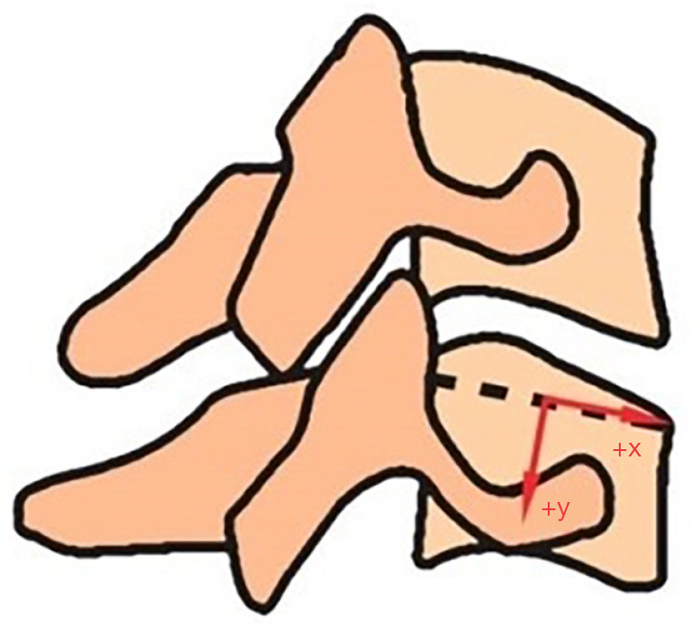
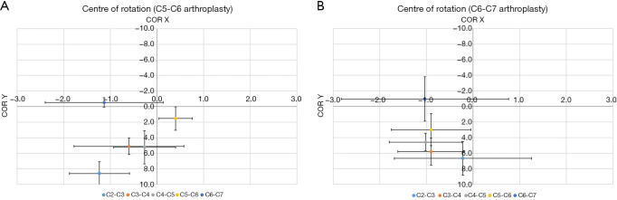
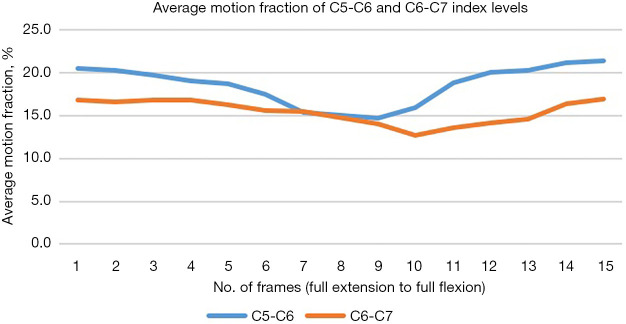
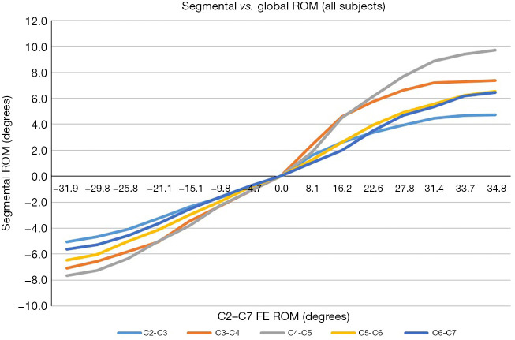
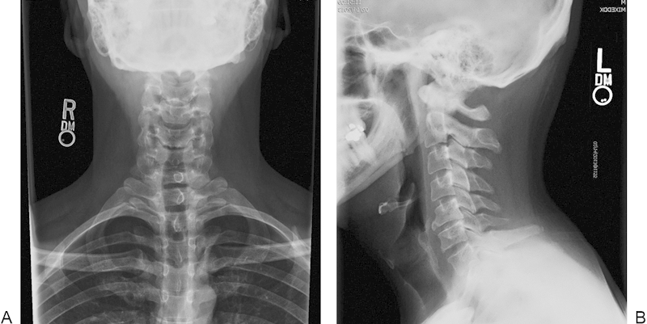
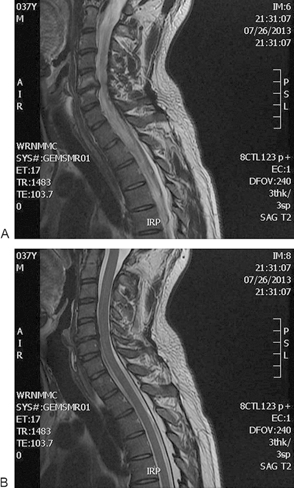
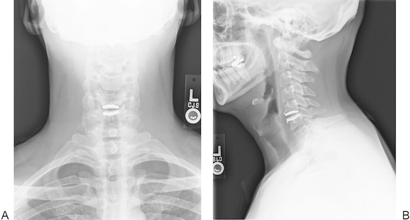
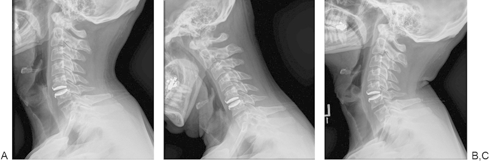
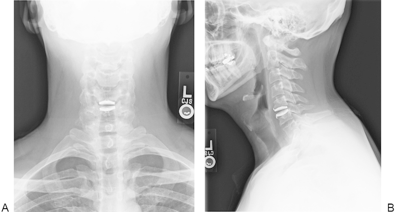
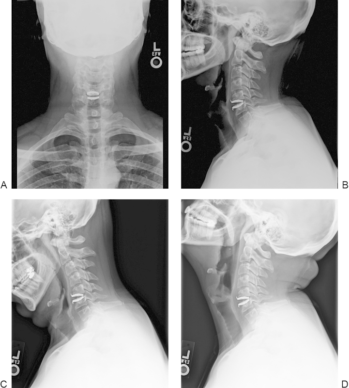

# Case Prep: Cervical Disc Arthroplasty (Cervical Disc Replacement)

---

<!-- BEGIN CASE SNAPSHOT -->

## Case / Approach Snapshot

- **Anatomy at risk:** level localization, cord/cauda equina, exiting and traversing roots, dura, vertebral artery or segmental vessels, esophagus/trachea/pleura/viscera by approach, and fusion/instrumentation landmarks.
- **Operative steps:** position and pad carefully, confirm level, expose the planned corridor, decompress neural elements, reconstruct or instrument when indicated, verify alignment/hardware, and close with attention to hematoma and wound risk; use the detailed operative sequence and approach notes below as the step-by-step source.
- **Rescue plans:** wrong level, durotomy, neurologic change, vertebral artery/visceral/pleural injury, graft or hardware problem, epidural hematoma, dysphagia/airway issue, and infection prevention/escalation.
- **Figures:** review [Figures, Imaging & Video](#figures-imaging--video) and the [Curated Image Set](#curated-image-set); embedded local figures should remain open-access, public-domain, or otherwise reusable with attribution.
- **Papers:** review [High-Yield Literature](#high-yield-literature) for seminal sources, modern reviews, and outcome data specific to this page.
- **Textbook cross-checks:** use [Textbook Cross-Checks](#textbook-cross-checks) and the [Source Crosswalk](../../resources/source-crosswalk.md) to cite copyrighted textbooks/atlases while summarizing in original words.

<!-- END CASE SNAPSHOT -->

## One-Liner
[Age]yo [M/F] with [single/two]-level cervical [radiculopathy/myelopathy] at [C_-C_] due to soft disc herniation planned for cervical total disc arthroplasty (motion-preserving).

---

## Figures, Imaging & Video

**🎥 Operative video** — [search operative video on YouTube ▸](https://www.youtube.com/results?search_query=cervical+disc+arthroplasty+surgery) · [The Neurosurgical Atlas ▸](https://www.neurosurgicalatlas.com)

> 🧭 **Operative approach:** [Anterior cervical (Smith-Robinson) approach](../approaches/anterior-cervical-approach.md) — detailed corridor setup, step-by-step technique & figures

[Neurosurgical Atlas](https://www.neurosurgicalatlas.com) · [AO Surgery Reference](https://surgeryreference.aofoundation.org) · [Radiopaedia](https://radiopaedia.org/search?q=cervical%20disc%20arthroplasty&scope=all) · [PubMed Central](https://www.ncbi.nlm.nih.gov/pmc/?term=cervical+disc+arthroplasty) — operative figures © linked; see [media-sources.md](../../resources/media-sources.md)

---

<!-- BEGIN TEXTBOOK CROSS-CHECKS -->

## Textbook Cross-Checks

- **Spine anatomy and biomechanics:** Benzel Spine; Textbook of Spinal Surgery; Surgical Anatomy and Techniques to the Spine — confirm levels, approach-side anatomy, neural/vascular structures at risk, alignment, stability, and fixation rationale.
- **Technique sequence:** Youmans and Winn; Benzel Spine; Greenberg — review positioning, localization, exposure, decompression, instrumentation, fusion/reconstruction, and closure in original language.
- **Complication rescue:** Benzel Spine; Greenberg; Youmans and Winn — cross-check durotomy, neurologic change, vascular injury, wrong-level prevention, infection, implant failure, and postoperative restrictions.
- **Copyright-safe use:** cite these sources as private cross-checks, then write the guide content in original words; do not re-host textbook pages, figures, tables, or board-review card material. See [Source Crosswalk & Copyright-Safe Use](../../resources/source-crosswalk.md).

<!-- END TEXTBOOK CROSS-CHECKS -->

<!-- BEGIN CURATED LITERATURE -->

## High-Yield Literature

- **Cervical disc arthroplasty: tips and tricks** — Makhni MC. International orthopaedics 2019. [PubMed](https://pubmed.ncbi.nlm.nih.gov/30519869/)
- **Cervical disc arthroplasty** — Zindrick M. The Journal of the American Academy of Orthopaedic Surgeons 2010. [PubMed](https://pubmed.ncbi.nlm.nih.gov/20889952/)
- **Osteolysis after cervical disc arthroplasty** — Joaquim AF. European spine journal : official publication of the European Spine Society, the European Spinal Deformity Society, and the European Section of the Cervical Spine Research Society 2020. [PubMed](https://pubmed.ncbi.nlm.nih.gov/32865650/)
- **Revision Strategies for Cervical Disc Arthroplasty** — Roth SG. Clinical spine surgery 2023. [PubMed](https://pubmed.ncbi.nlm.nih.gov/37752631/)
- **The Role of Cervical Disc Arthroplasty in Elite Athletes** — Brecount H. Current reviews in musculoskeletal medicine 2023. [PubMed](https://pubmed.ncbi.nlm.nih.gov/37436652/)
- **Cervical disc arthroplasty: What we know in 2020 and a literature review** — Shin JJ. Journal of orthopaedic surgery (Hong Kong) 2021. [PubMed](https://pubmed.ncbi.nlm.nih.gov/34581615/)
- **Biomechanics of Cervical Disc Arthroplasty Devices** — Patwardhan AG. Neurosurgery clinics of North America 2021. [PubMed](https://pubmed.ncbi.nlm.nih.gov/34538475/)
- **Multilevel cervical disc arthroplasty: a review of optimal surgical management and future directions** — Tu TH. Journal of neurosurgery. Spine 2023. [PubMed](https://pubmed.ncbi.nlm.nih.gov/36681966/)
- **Four-Level Cervical Disc Arthroplasty** — Chang HK. International journal of spine surgery 2024. [PubMed](https://pubmed.ncbi.nlm.nih.gov/38782588/)
- **Cervical disc arthroplasty: general introduction** — Acosta FL Jr. Neurosurgery clinics of North America 2005. [PubMed](https://pubmed.ncbi.nlm.nih.gov/16326283/)

<!-- END CURATED LITERATURE -->

---

<!-- BEGIN CURATED IMAGE SET -->

## Curated Image Set

Open-access figures are embedded from PubMed Central articles and kept unique to this guide.

*Figure 1. Centre of rotation. Source: [Assessing in vivo flexion-extension quality of motion after cervical disc arthroplasty: a pilot study](https://pmc.ncbi.nlm.nih.gov/articles/PMC10082433/) — Journal of Spine Surgery 2023; CC BY-NC-ND.*

*Figure 2. Centre of rotation in (A) C5-C6 and (B) C6-C7 arthroplasty group. (0,0) denotes the centre of superior endplate of caudal vertebra. COR, centre of rotation. Source: [Assessing in vivo flexion-extension quality of motion after cervical disc arthroplasty: a pilot study](https://pmc.ncbi.nlm.nih.gov/articles/PMC10082433/) — Journal of Spine Surgery 2023; CC BY-NC-ND.*

*Figure 3. Average motion fraction throughout the arc of flexion-extension. Source: [Assessing in vivo flexion-extension quality of motion after cervical disc arthroplasty: a pilot study](https://pmc.ncbi.nlm.nih.gov/articles/PMC10082433/) — Journal of Spine Surgery 2023; CC BY-NC-ND.*

*Figure 4. Segmental motion versus global range of motion. FE, flexion-extension; ROM, range of motion. Source: [Assessing in vivo flexion-extension quality of motion after cervical disc arthroplasty: a pilot study](https://pmc.ncbi.nlm.nih.gov/articles/PMC10082433/) — Journal of Spine Surgery 2023; CC BY-NC-ND.*

*Fig. 1. Anteroposterior (A) and lateral (B) preoperative radiographs demonstrating spondylosis and anterior osteophyte formation at C5–C6. Source: [Traumatic Migration of the Bryan Cervical Disc Arthroplasty](https://pmc.ncbi.nlm.nih.gov/articles/PMC4733374/) — Global Spine Journal 2015; open access.*

*Fig. 2. Sequential sagittal magnetic resonance image slices (A, B) demonstrating disk–osteophyte complex resulting in moderate central canal narrowing with moderate left and mild right neural... Source: [Traumatic Migration of the Bryan Cervical Disc Arthroplasty](https://pmc.ncbi.nlm.nih.gov/articles/PMC4733374/) — Global Spine Journal 2015; open access.*

*Fig. 3. Anteroposterior (A) and lateral (B) immediate postoperative radiographs demonstrating well-positioned and appropriately sized single-level Bryan Cervical Disc arthroplasty device at C5-C6. Source: [Traumatic Migration of the Bryan Cervical Disc Arthroplasty](https://pmc.ncbi.nlm.nih.gov/articles/PMC4733374/) — Global Spine Journal 2015; open access.*

*Fig. 4. Lateral (A), flexion (B), and extension (C) radiographs at 6 weeks postoperatively demonstrating no change in the location or placement of the device, without evidence of migration or... Source: [Traumatic Migration of the Bryan Cervical Disc Arthroplasty](https://pmc.ncbi.nlm.nih.gov/articles/PMC4733374/) — Global Spine Journal 2015; open access.*

*Fig. 5. Anteroposterior (A) and lateral (B) radiographs at 3 months postoperation demonstrating no change in position of the implant. Source: [Traumatic Migration of the Bryan Cervical Disc Arthroplasty](https://pmc.ncbi.nlm.nih.gov/articles/PMC4733374/) — Global Spine Journal 2015; open access.*

*Fig. 6. Anteroposterior (A), lateral (B), flexion (C), and extension (D) radiographs at 6 months postoperatively showing migration of the Bryan Cervical Disc device ∼2 mm anteriorly, without... Source: [Traumatic Migration of the Bryan Cervical Disc Arthroplasty](https://pmc.ncbi.nlm.nih.gov/articles/PMC4733374/) — Global Spine Journal 2015; open access.*

<!-- END CURATED IMAGE SET -->

---

## History of Present Illness
- Chief complaint: Radiculopathy / myelopathy from soft disc herniation/spondylosis
- Failed conservative management
- **Ideal candidate:** younger patient, single/two-level soft disc disease, preserved motion, minimal facet arthropathy, no significant instability or kyphosis — motion preservation aims to reduce adjacent segment degeneration vs fusion

---

## Past Medical History
- Contraindications: significant facet arthrosis, ankylosis, instability, severe osteoporosis, infection, significant kyphotic deformity, OPLL, prior fusion adjacent
- Metal allergy (implant materials)
- Standard PMH, smoking, etc.

---

## Imaging Review
### X-ray (AP, lateral, flexion/extension)
- **Preserved motion** at target level (arthroplasty requires mobile segment), alignment/lordosis, facet integrity, no instability
### MRI
- Soft disc vs hard spondylosis, cord/root compression, facet arthropathy (excludes arthroplasty if severe)
### CT
- Bony anatomy, ossification, endplate morphology, exclude OPLL

---

## Labs
- CBC, BMP, Coags, Type and screen

---

## Neurological Examination
- Full cervical myotomal/dermatomal exam, myelopathy signs, baseline swallowing/voice

---

## Surgical Planning

### Position & Approach
- Same as ACDF: supine, neutral neck (avoid excessive extension — preserves natural alignment for the prosthesis), horseshoe/Mayfield, shoulders taped down
- **Anterior Smith-Robinson approach** (typically left-sided)

### Key Surgical Steps
1. Fluoroscopic level confirmation, transverse incision, platysma, develop interval (carotid sheath lateral, trachea/esophagus medial)
2. Longus colli elevation, **midline marking is critical** (prosthesis must be centered for proper articulation)
3. Complete discectomy and decompression (PLL removal, foraminotomy) — same thoroughness as ACDF
4. **Preserve endplates** (do not over-resect — prosthesis relies on endplate integrity; keep parallel, preserve bone)
5. Maintain uncovertebral joints/lateral anatomy for device centering
6. Trial and size prosthesis (height, footprint) under fluoroscopy
7. **Center the device precisely** in coronal and sagittal planes (off-center → heterotopic ossification, wear, malfunction)
8. Implant the arthroplasty device, confirm position/motion with fluoroscopy
9. Closure (no plate; no bone graft needed)

### Critical Anatomy & Structures at Risk
1. Recurrent laryngeal nerve, esophagus, carotid sheath (same as ACDF)
2. **Endplates** — preserve for device function
3. Spinal cord/roots (decompression)
4. Vertebral arteries (lateral limit)

### Equipment
- Cervical arthroplasty device + trials (level-specific instrumentation)
- Fluoroscopy, microscope/loupes, Caspar pins (careful — avoid endplate damage), Kerrison/curettes, drill

### Monitoring
- SSEPs, MEPs (myelopathy), EMG

### Anesthesia
- Same as ACDF

### Potential Complications
1. **Heterotopic ossification** (can negate motion preservation)
2. Device migration/subsidence/malposition
3. Dysphagia, RLN palsy, esophageal injury (approach)
4. Persistent/recurrent neural compression, facet pain
5. Adjacent segment disease (theoretically reduced vs fusion)

---

## Operative Note Template
**Preoperative Diagnosis:** Cervical [radiculopathy/myelopathy] at [C_-C_] from soft disc herniation

**Postoperative Diagnosis:** Same

**Procedure:** Cervical total disc arthroplasty at [C_-C_]

**Surgeon / Assistant:**
**Anesthesia:** General endotracheal
**EBL / Fluids:**
**Adjuncts:** Fluoroscopy, microscope/loupes
**Implants:** Cervical disc arthroplasty device [type/size]
**Monitoring:** [SSEP/MEP if myelopathic] — stable
**Complications:** None

**Indications:** [Age]yo [M/F] with single-level [C_-C_] [radiculopathy/myelopathy] from a soft disc with preserved motion and minimal facet arthrosis — an ideal arthroplasty candidate. Risks/benefits/alternatives (incl. ACDF) discussed.

**Description of Procedure:** After consent and time-out, general anesthesia was induced and the patient positioned supine with the neck neutral (avoiding excess extension). A left anterior Smith-Robinson approach exposed the [C_-C_] disc; the level was confirmed fluoroscopically and the longus colli elevated symmetrically with **careful midline marking**. A complete discectomy and decompression (including PLL/foraminotomy) was performed while **preserving the bony endplates** parallel and intact.

The disc space was trialed and the arthroplasty device sized and **centered precisely in the coronal and sagittal planes** under fluoroscopy, then implanted; position and segmental motion were confirmed. No plate or graft was required.

Hemostasis was obtained and the wound closed in layers. The patient was awakened neurologically [at baseline] and transferred to recovery.

---

## Postoperative Plan
- Floor, neuro checks, airway/neck swelling monitoring (as ACDF)
- **NO rigid collar** (motion preservation; soft collar only briefly for comfort)
- **NSAIDs often given** to reduce heterotopic ossification (opposite of fusion philosophy)
- Early ROM, X-rays POD1
- Activity, follow-up; flexion/extension films to confirm motion at follow-up
