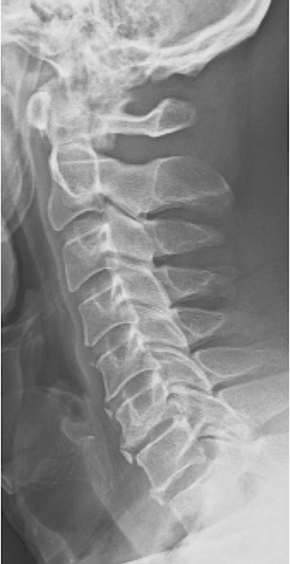
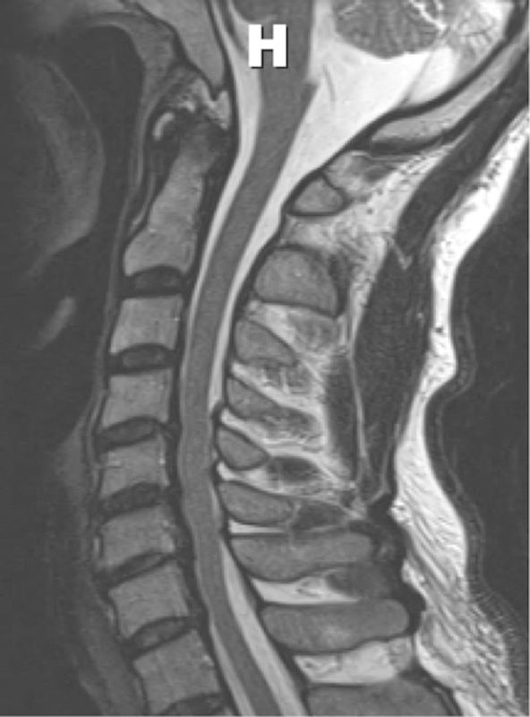
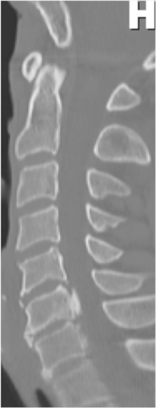
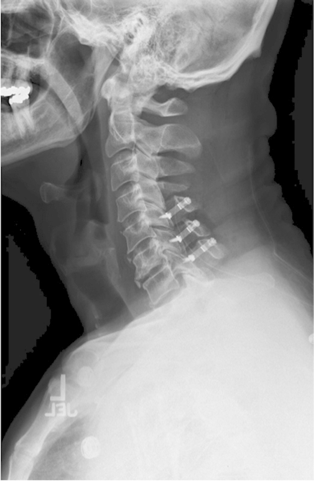
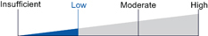
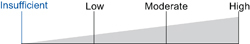
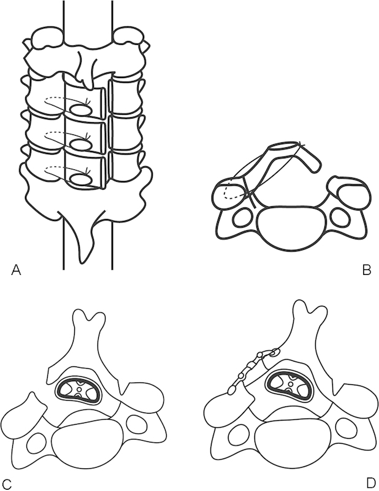
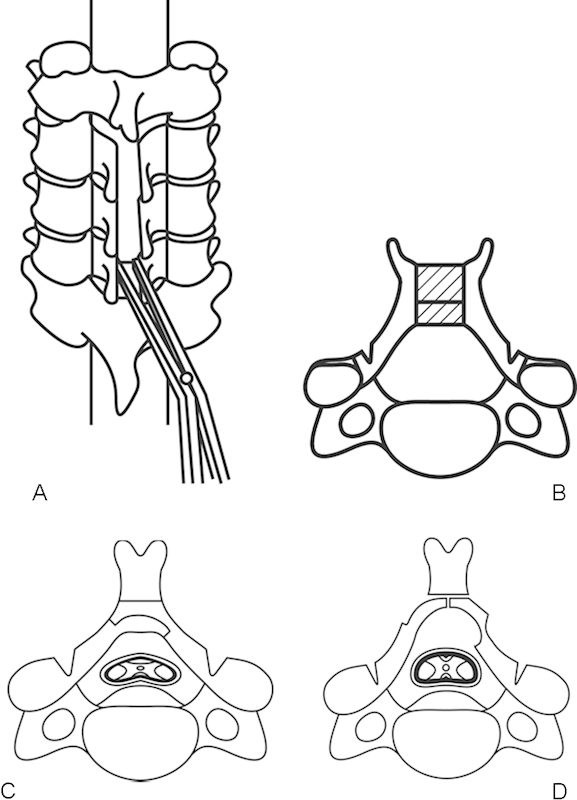
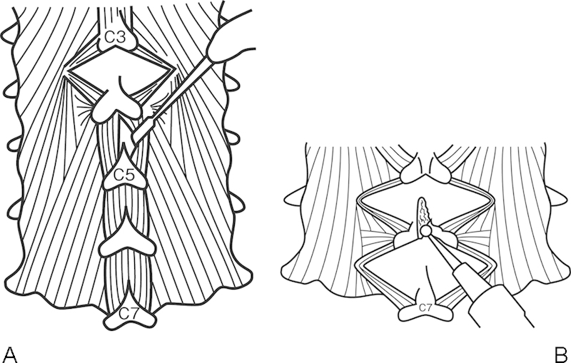
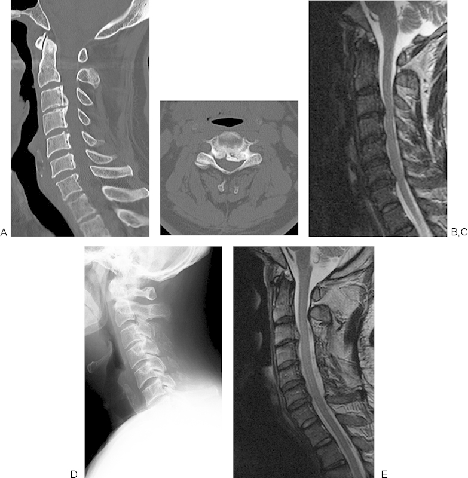

# Case Prep: Cervical Laminoplasty

---

<!-- BEGIN CASE SNAPSHOT -->

## Case / Approach Snapshot

- **Anatomy at risk:** level localization, cord/cauda equina, exiting and traversing roots, dura, vertebral artery or segmental vessels, esophagus/trachea/pleura/viscera by approach, and fusion/instrumentation landmarks.
- **Operative steps:** position and pad carefully, confirm level, expose the planned corridor, decompress neural elements, reconstruct or instrument when indicated, verify alignment/hardware, and close with attention to hematoma and wound risk; use the detailed operative sequence and approach notes below as the step-by-step source.
- **Rescue plans:** wrong level, durotomy, neurologic change, vertebral artery/visceral/pleural injury, graft or hardware problem, epidural hematoma, dysphagia/airway issue, and infection prevention/escalation.
- **Figures:** review [Figures, Imaging & Video](#figures-imaging--video) and the [Curated Image Set](#curated-image-set); embedded local figures should remain open-access, public-domain, or otherwise reusable with attribution.
- **Papers:** review [High-Yield Literature](#high-yield-literature) for seminal sources, modern reviews, and outcome data specific to this page.

<!-- END CASE SNAPSHOT -->

## One-Liner
[Age]yo [M/F] with multilevel cervical spondylotic myelopathy / OPLL ([C_-C_]) with **preserved lordosis** planned for [open-door / French-door] cervical laminoplasty (motion-preserving posterior decompression).

---

## Figures, Imaging & Video

**🎥 Operative video** — [search operative video on YouTube ▸](https://www.youtube.com/results?search_query=cervical+laminoplasty+surgery) · [The Neurosurgical Atlas ▸](https://www.neurosurgicalatlas.com)

> 🧭 **Operative approach:** [Posterior cervical approach](../approaches/posterior-cervical-approach.md) — detailed corridor setup, step-by-step technique & figures

[Neurosurgical Atlas](https://www.neurosurgicalatlas.com) · [AO Surgery Reference](https://surgeryreference.aofoundation.org) · [Radiopaedia](https://radiopaedia.org/search?q=cervical%20laminoplasty&scope=all) · [PubMed Central](https://www.ncbi.nlm.nih.gov/pmc/?term=cervical+laminoplasty+open+door) — operative figures © linked; see [media-sources.md](../../resources/media-sources.md)

---

<!-- BEGIN CURATED LITERATURE -->

## High-Yield Literature

- **Cervical laminoplasty: indication, technique, complications** — Weinberg DS. Journal of spine surgery (Hong Kong) 2020. [PubMed](https://pubmed.ncbi.nlm.nih.gov/32309667/)
- **Cervical laminoplasty** — Steinmetz MP. The spine journal : official journal of the North American Spine Society 2006. [PubMed](https://pubmed.ncbi.nlm.nih.gov/17097547/)
- **Laminoplasty for cervical myelopathy** — Ito M. Global spine journal 2012. [PubMed](https://pubmed.ncbi.nlm.nih.gov/24353967/)
- **Cervical Laminoplasty: Indications, Surgical Considerations, and Clinical Outcomes** — Cho SK. The Journal of the American Academy of Orthopaedic Surgeons 2018. [PubMed](https://pubmed.ncbi.nlm.nih.gov/29521698/)
- **Cervical Laminoplasty: The History and the Future** — Kurokawa R. Neurologia medico-chirurgica 2015. [PubMed](https://pubmed.ncbi.nlm.nih.gov/26119898/)
- **Cervical laminoplasty versus laminectomy and fusion: An umbrella review of postoperative outcomes** — Jagtiani P. Neurosurgical review 2023. [PubMed](https://pubmed.ncbi.nlm.nih.gov/38062318/)
- **Deformity Considerations in Cervical Laminoplasty: A Narrative Review** — Drain JP. Clinical spine surgery 2025. [PubMed](https://pubmed.ncbi.nlm.nih.gov/39056550/)
- **Cervical laminoplasty: a critical review** — Ratliff JK. Journal of neurosurgery 2003. [PubMed](https://pubmed.ncbi.nlm.nih.gov/12691377/)
- **Cervical laminoplasty** — Mehdain H. European spine journal : official publication of the European Spine Society, the European Spinal Deformity Society, and the European Section of the Cervical Spine Research Society 2014. [PubMed](https://pubmed.ncbi.nlm.nih.gov/25371088/)
- **Factors predicting loss of cervical lordosis following cervical laminoplasty: A critical review** — Alam I. Journal of craniovertebral junction & spine 2020. [PubMed](https://pubmed.ncbi.nlm.nih.gov/33100764/)

<!-- END CURATED LITERATURE -->

---

<!-- BEGIN CURATED IMAGE SET -->

## Curated Image Set

Open-access figures are embedded from PubMed Central articles and kept unique to this guide.

*Fig. 2. Pre-op lateral radiograph. Source: [Comparative Effectiveness of Different Types of Cervical Laminoplasty](https://pmc.ncbi.nlm.nih.gov/articles/PMC3836957/) — Evidence-Based Spine-Care Journal 2013; open access.*

*Fig. 3. Pre-op magnetic resonance image sagittal view. Source: [Comparative Effectiveness of Different Types of Cervical Laminoplasty](https://pmc.ncbi.nlm.nih.gov/articles/PMC3836957/) — Evidence-Based Spine-Care Journal 2013; open access.*

*Fig. 4. Pre-op computed tomography sagittal view. Source: [Comparative Effectiveness of Different Types of Cervical Laminoplasty](https://pmc.ncbi.nlm.nih.gov/articles/PMC3836957/) — Evidence-Based Spine-Care Journal 2013; open access.*

*Fig. 5. Post-op lateral radiograph. Source: [Comparative Effectiveness of Different Types of Cervical Laminoplasty](https://pmc.ncbi.nlm.nih.gov/articles/PMC3836957/) — Evidence-Based Spine-Care Journal 2013; open access.*

*Figure 5. Source: [Comparative Effectiveness of Different Types of Cervical Laminoplasty](https://pmc.ncbi.nlm.nih.gov/articles/PMC3836957/) — Evid Based Spine Care J. 2013 Oct;4(2):105–15. doi: 10.1055/s-0033-1357361; open access.*

*Figure 6. Source: [Comparative Effectiveness of Different Types of Cervical Laminoplasty](https://pmc.ncbi.nlm.nih.gov/articles/PMC3836957/) — Evid Based Spine Care J. 2013 Oct;4(2):105–15. doi: 10.1055/s-0033-1357361; open access.*

*Figure 1. (A) The top view of unilateral open-door laminoplasty (Hirabayashi's method). Three laminae are lifted bilaterally. (B) The axial view of unilateral open-door laminoplasty. The lamina is... Source: [Laminoplasty for Cervical Myelopathy](https://pmc.ncbi.nlm.nih.gov/articles/PMC3864408/) — Global Spine Journal 2012; open access.*

*Figure 2. (A) Bilateral open-door laminoplasty. The top view of Kurokawa's method. The spinous processes and laminae are split at the midline and opened. (B) A block of bone graft is placed... Source: [Laminoplasty for Cervical Myelopathy](https://pmc.ncbi.nlm.nih.gov/articles/PMC3864408/) — Global Spine Journal 2012; open access.*

*Figure 3. (A) Muscle-preservation approach for cervical laminoplasty (Shiraishi's method). Divide the interspinalis muscles by a pair of nerve retractors. (B) Split the spinous processes with a... Source: [Laminoplasty for Cervical Myelopathy](https://pmc.ncbi.nlm.nih.gov/articles/PMC3864408/) — Global Spine Journal 2012; open access.*

*Figure 4. (A) A preoperative sagittal computed tomography (CT) image of the cervical spine of a 62-year-old man shows cervical ossification of the posterior longitudinal ligament (OPLL) from C3 to... Source: [Laminoplasty for Cervical Myelopathy](https://pmc.ncbi.nlm.nih.gov/articles/PMC3864408/) — Global Spine Journal 2012; open access.*

<!-- END CURATED IMAGE SET -->

---

## History of Present Illness
- Chief complaint: Cervical myelopathy from multilevel dorsal compression
- **Laminoplasty advantages:** decompresses multiple levels while preserving motion and avoiding fusion morbidity; lower kyphosis/instability risk than laminectomy alone
- **Requires preserved lordosis** (cord drifts back); avoid in kyphosis, significant neck pain (fusion may be better), or instability

---

## Past Medical History
- Cervical alignment (lordosis required), axial neck pain severity (laminoplasty doesn't address mechanical pain well)
- RA, instability (relative contraindications), smoking
- Standard PMH

---

## Imaging Review
### X-ray (lateral, flexion/extension)
- **Lordosis preserved** (key), no instability, K-line (OPLL)
### MRI
- Multilevel dorsal cord compression, T2 signal, levels
### CT
- OPLL, laminar/lateral mass anatomy, canal dimensions

---

## Labs
- CBC, BMP, Coags, Type and screen, HbA1c

---

## Neurological Examination
- Full myelopathy exam (mJOA/Nurick), myotomal/dermatomal, gait

---

## Surgical Planning

### Position
- Prone, Mayfield, neutral/slight flexion preserving lordosis, reverse Trendelenburg, shoulders taped, eyes protected
- IONM check after positioning

### Technique Variants
- **Open-door (Hirabayashi):** hinge on one side (greenstick trough), open the other side, prop open with plates/spacers
- **French-door (double-door):** midline split, hinge bilaterally, open like double doors with central spacer

### Key Surgical Steps (Open-door)
1. Midline incision, subperiosteal exposure of laminae (preserve facet capsules/muscle attachments where possible)
2. Fluoroscopic level confirmation
3. **Hinge side:** create a partial-thickness trough at lamina-lateral mass junction (outer cortex through, inner cortex intact = greenstick hinge) with high-speed drill
4. **Open side:** complete trough through both cortices (contralateral lamina-lateral mass junction)
5. Carefully **lift/open the laminar door** (hinge bends), gently elevating lamina away from cord — release ligamentum/adhesions, avoid cord pressure
6. **Maintain the open position** with mini-plates/spacers (or sutures/bone struts) at each opened level
7. Confirm decompression; foraminotomy if needed
8. Hemostasis, drain, layered closure

### Critical Anatomy & Structures at Risk
1. **Spinal cord** — during opening (avoid downward pressure), epidural bleeding
2. **C5 nerve root** — C5 palsy (as with laminectomy)
3. Hinge fracture (complete fracture → instability of that door)
4. Facets (preserve — avoid fusion/instability)

### Equipment
- High-speed drill (key for troughs/hinge), Kerrison
- Laminoplasty plates/spacers (open-door) or bone strut/spacer (French-door), fluoroscopy
- Hemostatic agents, drain

### Monitoring
- SSEPs, MEPs, EMG; check after positioning and during door opening

### Anesthesia
- MAP > 85, no paralytic (IONM), prone precautions (eyes), TXA

### Potential Complications
1. **C5 palsy** (deltoid/biceps weakness, usually recovers)
2. Hinge fracture / door closure (reclosure → recurrent stenosis)
3. Axial neck pain, reduced ROM/stiffness, kyphosis
4. Epidural hematoma, CSF leak, infection, inadequate decompression

---

## Operative Note Template
**Preoperative Diagnosis:** Multilevel cervical spondylotic myelopathy [/ OPLL] [C_-C_] with preserved lordosis

**Postoperative Diagnosis:** Same

**Procedure:** [Open-door (Hirabayashi) / French-door] cervical laminoplasty [C_-C_]

**Surgeon / Assistant:**
**Anesthesia:** General endotracheal
**EBL / Fluids:**
**Adjuncts:** High-speed drill, fluoroscopy; SSEP/MEP/EMG
**Implants:** Laminoplasty mini-plates/spacers
**Monitoring:** SSEP/MEP — stable
**Complications:** None

**Indications:** [Age]yo [M/F] with multilevel cervical myelopathy and preserved lordosis, suitable for motion-preserving posterior decompression. Risks (C5 palsy, axial pain, hinge fracture) discussed.

**Description of Procedure:** After consent and time-out, general anesthesia was induced and neuromonitoring established with stable baselines after prone positioning in Mayfield (neutral lordosis preserved). A midline exposure of the laminae [C_-C_] was performed and levels confirmed.

A **hinge** trough (partial-thickness greenstick) was created at one lamina–lateral mass junction and an **open-side** trough (full-thickness) at the contralateral junction with the high-speed drill. The laminar "door" was gently opened, elevating the laminae off the cord and releasing adhesions, and **maintained open with mini-plates/spacers** at each level. Decompression was confirmed and foraminotomies performed as needed. The facets were preserved to avoid instability/fusion.

Hemostasis was obtained, a drain placed, and closure performed in layers. The patient was awakened [at baseline] and transferred with C5-palsy precautions.

---

## Postoperative Plan
- Step-down/floor, neuro checks q2h (**C5 palsy watch**)
- Early mobilization, soft collar briefly, **early ROM exercises** (reduce stiffness)
- X-rays POD1, drain management, DVT prophylaxis
- Pain control, follow-up imaging; counsel re: axial pain/stiffness and C5 palsy
