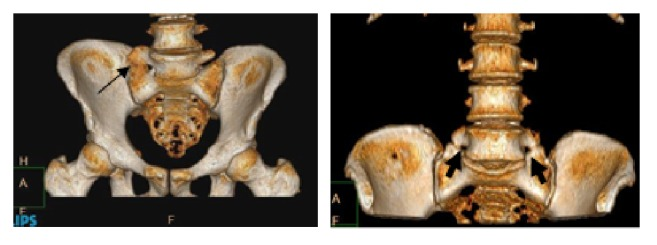
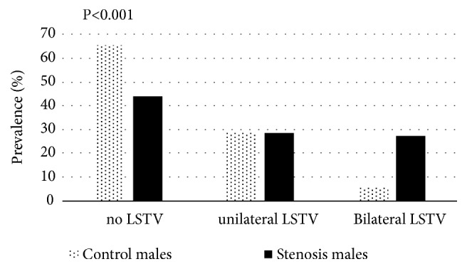
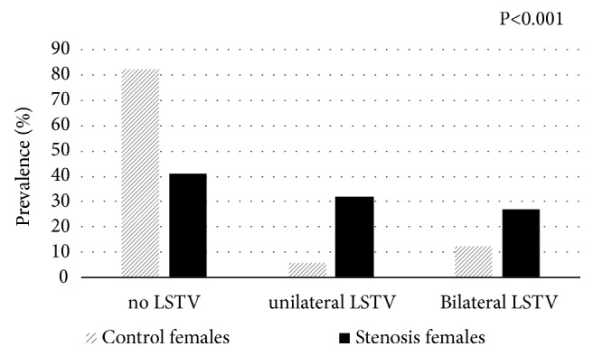
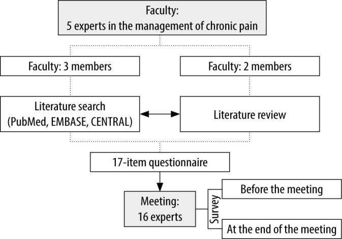
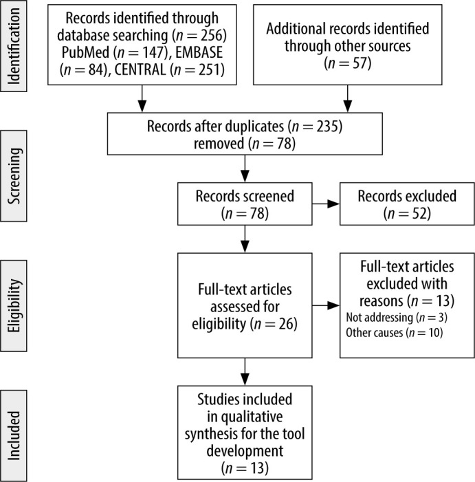
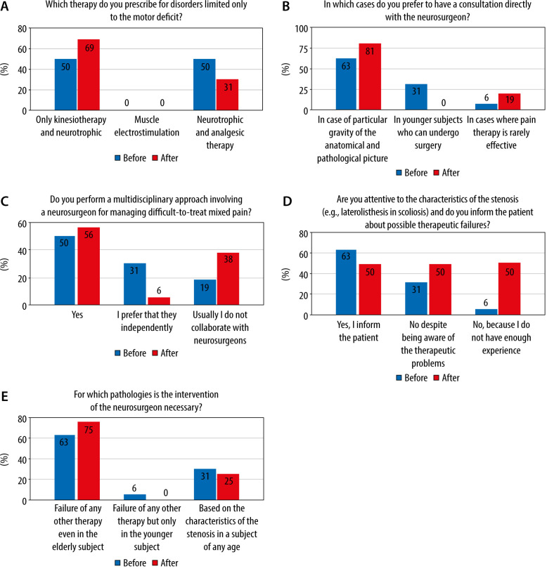
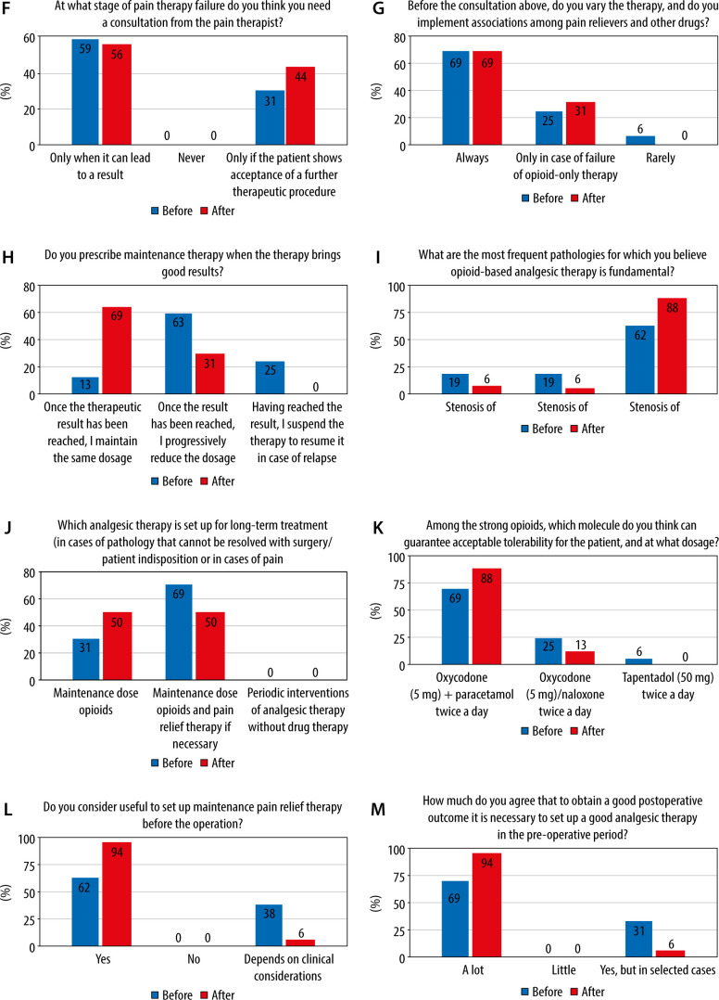
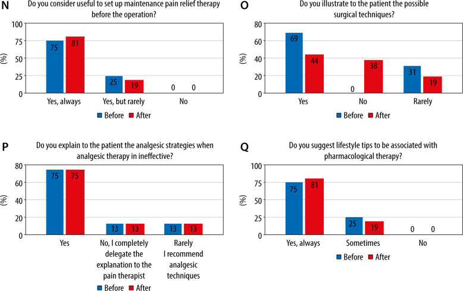
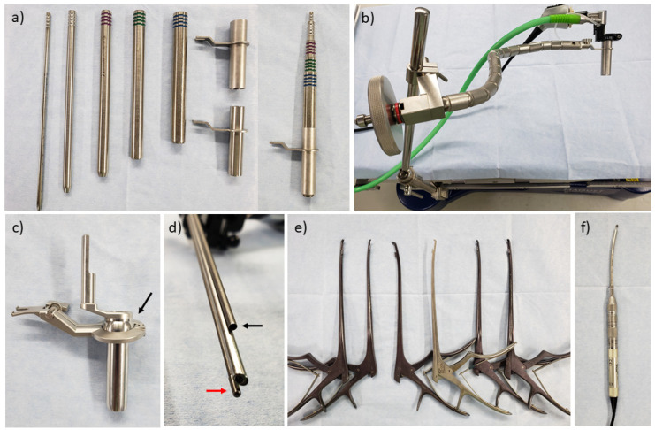
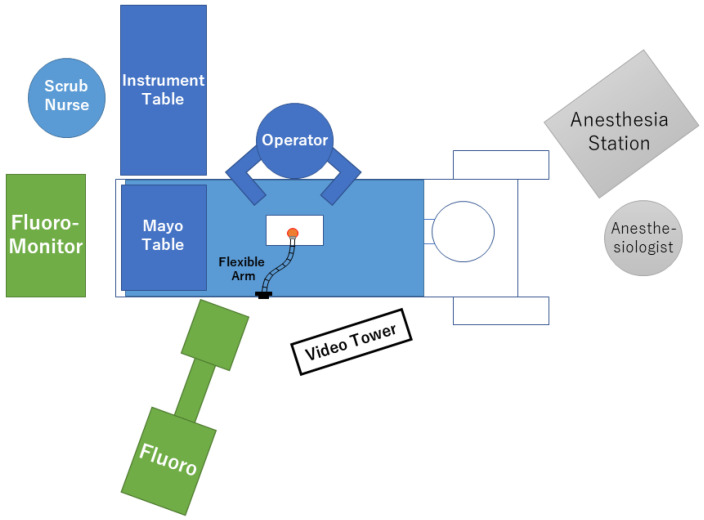

# Case Prep: Lumbar Laminectomy for Spinal Stenosis

---

<!-- BEGIN CASE SNAPSHOT -->

## Case / Approach Snapshot

- **Anatomy at risk:** level localization, cord/cauda equina, exiting and traversing roots, dura, vertebral artery or segmental vessels, esophagus/trachea/pleura/viscera by approach, and fusion/instrumentation landmarks.
- **Operative steps:** position and pad carefully, confirm level, expose the planned corridor, decompress neural elements, reconstruct or instrument when indicated, verify alignment/hardware, and close with attention to hematoma and wound risk; use the detailed operative sequence and approach notes below as the step-by-step source.
- **Rescue plans:** wrong level, durotomy, neurologic change, vertebral artery/visceral/pleural injury, graft or hardware problem, epidural hematoma, dysphagia/airway issue, and infection prevention/escalation.
- **Figures:** review [Figures, Imaging & Video](#figures-imaging--video) and the [Curated Image Set](#curated-image-set); embedded local figures should remain open-access, public-domain, or otherwise reusable with attribution.
- **Papers:** review [High-Yield Literature](#high-yield-literature) for seminal sources, modern reviews, and outcome data specific to this page.

<!-- END CASE SNAPSHOT -->

## One-Liner
[Age]yo [M/F] with [single/multilevel] lumbar spinal stenosis at [L_-L_] presenting with **neurogenic claudication** [± radiculopathy] planned for lumbar laminectomy/decompression [without fusion].

---

## Figures, Imaging & Video

**🎥 Operative video** — [search operative video on YouTube ▸](https://www.youtube.com/results?search_query=lumbar+spinal+stenosis+surgery) · [The Neurosurgical Atlas ▸](https://www.neurosurgicalatlas.com)

**CNS Video Library**

<iframe src="https://www.youtube-nocookie.com/embed/hcuH5n21cTs" title="CNS Neurosurgery 100: Techniques and Value of Minimally Invasive Spine Surgery for Decompression" loading="lazy" allow="accelerometer; clipboard-write; encrypted-media; picture-in-picture; web-share" allowfullscreen></iframe>

> 🧭 **Operative approach:** [Posterior thoracolumbar approach](../approaches/posterior-thoracolumbar-approach.md) — detailed corridor setup, step-by-step technique & figures

[Neurosurgical Atlas](https://www.neurosurgicalatlas.com) · [AO Surgery Reference](https://surgeryreference.aofoundation.org) · [Radiopaedia](https://radiopaedia.org/search?q=lumbar%20spinal%20stenosis&scope=all) · [PubMed Central](https://www.ncbi.nlm.nih.gov/pmc/?term=lumbar+laminectomy+decompression+stenosis) — operative figures © linked; see [media-sources.md](../../resources/media-sources.md)

---

<!-- BEGIN COMMON PIMP QUESTIONS -->

## Common Pimp Questions

Use these to pressure-test preparation for **Lumbar Laminectomy for Spinal Stenosis**:

1. What neurologic level and root are responsible for the presenting deficit?
2. What is the decompression target and how will you know it is adequately decompressed?
3. What instability, deformity, bone-quality, or fusion variable changes the construct?
4. What vascular, visceral, dural, or neural structure is the main structure at risk?
5. What postop brace, drain, mobilization, MAP, antibiotic, and DVT plan should be ordered?

<!-- END COMMON PIMP QUESTIONS -->

<!-- BEGIN ATTENDING PREFERENCE VARIABLES -->

## Attending Preference Variables

Items that commonly vary by surgeon or institution:

- **Positioning frame, arms, traction, and localization workflow:** [attending-specific]
- **Navigation/robot/fluoro use, screw system, graft/biologic choice, and drain threshold:** [attending-specific]
- **Neuromonitoring modality and MAP goal for myelopathy, deformity, or cord-risk cases:** [attending-specific]
- **Brace, Foley, antibiotics, mobilization, and DVT prophylaxis timing:** [attending-specific]

<!-- END ATTENDING PREFERENCE VARIABLES -->

<!-- BEGIN CURATED LITERATURE -->

## High-Yield Literature

- **Lumbar spinal stenosis** — Genevay S. Best practice & research. Clinical rheumatology 2010. [PubMed](https://pubmed.ncbi.nlm.nih.gov/20227646/)
- **Surgical versus non-surgical treatment for lumbar spinal stenosis** — Zaina F. The Cochrane database of systematic reviews 2016. [PubMed](https://pubmed.ncbi.nlm.nih.gov/26824399/)
- **Lumbar spinal stenosis** — Lee JY. Instructional course lectures 2013. [PubMed](https://pubmed.ncbi.nlm.nih.gov/23395043/)
- **Lumbar spinal stenosis** — Nowakowski P. Physical therapy 1996. [PubMed](https://pubmed.ncbi.nlm.nih.gov/8592723/)
- **Full-endoscopic (bi-portal or uni-portal) versus microscopic lumbar decompression laminectomy in patients with spinal stenosis: systematic review and meta-analysis** — Pairuchvej S. European journal of orthopaedic surgery & traumatology : orthopedie traumatologie 2020. [PubMed](https://pubmed.ncbi.nlm.nih.gov/31863273/)
- **Letter to the editor regarding "Full‑endoscopic (bi‑portal or uni‑portal) versus microscopic lumbar decompression laminectomy in patients with spinal stenosis: systematic review and meta‑analysis"** — Lin GX. European journal of orthopaedic surgery & traumatology : orthopedie traumatologie 2023. [PubMed](https://pubmed.ncbi.nlm.nih.gov/35031849/)
- **Spinous Process Splitting Laminectomy for Lumbar Spinal Stenosis: 2D Operative Video** — Gagliardi M. World neurosurgery 2022. [PubMed](https://pubmed.ncbi.nlm.nih.gov/34971829/)
- **Effect of lumbar laminectomy on spinal sagittal alignment: a systematic review** — Hatakka J. European spine journal : official publication of the European Spine Society, the European Spinal Deformity Society, and the European Section of the Cervical Spine Research Society 2021. [PubMed](https://pubmed.ncbi.nlm.nih.gov/33844059/)
- **Stand-alone interspinous spacer versus decompressive laminectomy for treatment of lumbar spinal stenosis** — Lauryssen C. Expert review of medical devices 2015. [PubMed](https://pubmed.ncbi.nlm.nih.gov/26487285/)
- **Microendoscopic Lumbar Posterior Decompression Surgery for Lumbar Spinal Stenosis: Literature Review** — Suzuki A. Medicina (Kaunas, Lithuania) 2022. [PubMed](https://pubmed.ncbi.nlm.nih.gov/35334560/)

<!-- END CURATED LITERATURE -->

---

<!-- BEGIN CURATED IMAGE SET -->

## Curated Image Set

Open-access figures are embedded from PubMed Central articles and kept unique to this guide.

*Figure 1. Lumbosacral transitional vertebra as evident in 3-dimensional images: unilateral (left) and bilateral (right) anomalies. Source: [Is Lumbosacral Transitional Vertebra Associated with Degenerative Lumbar Spinal Stenosis?](https://pmc.ncbi.nlm.nih.gov/articles/PMC6590608/) — BioMed Research International 2019; CC BY.*

*Figure 2. Prevalence (%) of lumbosacral transitional vertebra (LSTV) in the male groups (control vs. stenosis). Source: [Is Lumbosacral Transitional Vertebra Associated with Degenerative Lumbar Spinal Stenosis?](https://pmc.ncbi.nlm.nih.gov/articles/PMC6590608/) — BioMed Research International 2019; CC BY.*

*Figure 3. Prevalence (%) of lumbosacral transitional vertebra (LSTV) type in the female groups (control vs. stenosis). Source: [Is Lumbosacral Transitional Vertebra Associated with Degenerative Lumbar Spinal Stenosis?](https://pmc.ncbi.nlm.nih.gov/articles/PMC6590608/) — BioMed Research International 2019; CC BY.*

*FIGURE 1. Flow chart of the study Source: [Lumbar spinal stenosis as a model for the multimodal and multiprofessional treatment of mixed non-cancer pain. Survey response from a panel of experts of the Italian National Association of Osteoarticular Specialists (ASON)](https://pmc.ncbi.nlm.nih.gov/articles/PMC10165336/) — Anaesthesiology Intensive Therapy 2021; CC BY-NC-SA.*

*FIGURE 2. PRIMA flow Source: [Lumbar spinal stenosis as a model for the multimodal and multiprofessional treatment of mixed non-cancer pain. Survey response from a panel of experts of the Italian National Association of Osteoarticular Specialists (ASON)](https://pmc.ncbi.nlm.nih.gov/articles/PMC10165336/) — Anaesthesiology Intensive Therapy 2021; CC BY-NC-SA.*

*FIGURE 3. Diagnostic approach, counselling, and multidisciplinary approach. Questions A–E. Note. Neurotropic agents include neuroprotective substances such as palmitoylethanolamide, and a-lipoic acid Source: [Lumbar spinal stenosis as a model for the multimodal and multiprofessional treatment of mixed non-cancer pain. Survey response from a panel of experts of the Italian National Association of Osteoarticular Specialists (ASON)](https://pmc.ncbi.nlm.nih.gov/articles/PMC10165336/) — Anaesthesiology Intensive Therapy 2021; CC BY-NC-SA.*

*FIGURE 4. Therapeutic approach. Questions F–M Source: [Lumbar spinal stenosis as a model for the multimodal and multiprofessional treatment of mixed non-cancer pain. Survey response from a panel of experts of the Italian National Association of Osteoarticular Specialists (ASON)](https://pmc.ncbi.nlm.nih.gov/articles/PMC10165336/) — Anaesthesiology Intensive Therapy 2021; CC BY-NC-SA.*

*FIGURE 5. Patient communication strategies. Questions N-Q Source: [Lumbar spinal stenosis as a model for the multimodal and multiprofessional treatment of mixed non-cancer pain. Survey response from a panel of experts of the Italian National Association of Osteoarticular Specialists (ASON)](https://pmc.ncbi.nlm.nih.gov/articles/PMC10165336/) — Anaesthesiology Intensive Therapy 2021; CC BY-NC-SA.*

*Figure 1. Surgical equipment for tubular microendoscopic decompression surgery. (a) Serial tubular dilator and retractor (METRx®). (b) Flexible arm assembly (METRx®). (c) Tubular retractor of the... Source: [Microendoscopic Lumbar Posterior Decompression Surgery for Lumbar Spinal Stenosis: Literature Review](https://pmc.ncbi.nlm.nih.gov/articles/PMC8954505/) — Medicina 2022; CC BY.*

*Figure 2. Schematic presentation of the room setup. Source: [Microendoscopic Lumbar Posterior Decompression Surgery for Lumbar Spinal Stenosis: Literature Review](https://pmc.ncbi.nlm.nih.gov/articles/PMC8954505/) — Medicina 2022; CC BY.*

<!-- END CURATED IMAGE SET -->

---

## History of Present Illness
- Chief complaint: **Neurogenic claudication** — bilateral buttock/leg pain, heaviness, paresthesias with standing/walking, **relieved by sitting/flexion** ("shopping cart sign"), worse with extension
- Walking tolerance, radicular symptoms, failed conservative management (PT, injections)
- **Decompression alone** (no fusion) if no instability/deformity/spondylolisthesis with motion

---

## Past Medical History
- Spondylolisthesis (if present with instability → add fusion), prior lumbar surgery
- Vascular claudication (differentiate — pulses, ABI), diabetes, cardiac (pre-op clearance for elderly)
- Standard PMH

---

## Imaging Review
### MRI Lumbar
- **Central/lateral recess/foraminal stenosis** levels, ligamentum flavum hypertrophy, facet hypertrophy, disc bulging
- Cauda equina crowding, redundant nerve roots
### X-ray (flexion/extension)
- **Instability/spondylolisthesis** (determines if fusion needed), alignment
### CT
- Bony anatomy, facet morphology, ossification

---

## Labs
- CBC, BMP, Coags, Type and screen

---

## Neurological Examination
- Lower extremity motor/sensory/reflex, gait, often near-normal at rest (dynamic symptoms)

---

## Surgical Planning

### Case Logistics, OR Needs & Orders
- **Typical bed:** outpatient/PACU for selected decompressions; floor or step-down for fusion, cervical myelopathy, thoracic disease, medical frailty, high EBL, or airway risk.
- **OR setup:** radiolucent/Jackson table, fluoroscopy or O-arm/navigation, microscope/loupes for decompression, implant trays/graft ready for fusion, neuromonitoring for myelopathy/cord-risk cases, and postop brace plan confirmed.
- **Special needs:** arterial line/Foley/type-screen for long fusion/corpectomy, no long paralytic when MEPs are used, MAP/normotension for myelopathy or cord-risk cases, antibiotic redosing, and anticoagulation/DVT plan.
- **Immediate postop orders:** neuro checks by myotome/sensory level, airway/dysphagia watch for anterior cervical cases, CT/X-rays per construct, drain care, brace/activity orders, DVT prophylaxis timing, bowel regimen, and PT/OT mobilization.

### Decompression without Fusion vs With Fusion
- **Laminectomy alone:** stenosis without instability/deformity
- **Add fusion:** spondylolisthesis with instability, scoliosis, if facetectomy needed for decompression destabilizes, recurrent stenosis

### Position
- Prone on Jackson/Wilson frame, **abdomen free**, hips flexed, pressure points padded, eyes free

### Key Surgical Steps — Detailed
1. **Fluoroscopic level confirmation** — localize with a spinal needle/marker, counting from the sacrum (and account for transitional anatomy/lumbosacral variants on the preop films); confirm the correct level before bony work
2. **Midline incision** over the target levels; subperiosteal dissection of the paraspinal muscles off the spinous processes and laminae **bilaterally** (for central decompression), exposing out to the medial facets; place self-retaining retractors; re-confirm level
3. **Laminectomy:** remove the spinous process and laminae at the stenotic level(s) — thin the lamina with a high-speed drill and/or use Kerrison rongeurs; begin in the midline where the canal is roomiest and work laterally; identify the **ligamentum flavum** as the deep layer protecting the dura
4. **Remove the hypertrophied ligamentum flavum** (a major compressive element) — develop the plane off the underlying dura with a blunt dissector, then resect with Kerrisons, protecting the thecal sac
5. **Decompress the lateral recesses** — undercut the hypertrophied superior articular facets (medial facetectomy), freeing the **traversing nerve roots**; **preserve > 50% of each facet and the pars interarticularis** to avoid iatrogenic instability
6. **Foraminal decompression** — follow and decompress the exiting roots into the foramina; confirm each root is free with a probe/Woodson (ball-tip passes freely)
7. **Confirm adequate decompression** — the dura re-expands and pulsates, traversing and exiting roots are free in the recesses/foramina
8. **(MIS alternative)** — unilateral tubular approach with **"over-the-top" contralateral decompression**: undercut the base of the spinous process and contralateral lamina/ligamentum, decompressing both sides through a unilateral corridor while preserving the midline tension band (less destabilizing)
9. **Inspect for durotomy** (common in tight stenosis with redundant roots/adhesions) — repair primarily (suture ± sealant/patch) if encountered
10. **Hemostasis** of the epidural venous plexus (bipolar, hemostatic matrix, gentle), confirm no compressive hematoma, **± subfascial drain**, layered closure

### Critical Anatomy & Structures at Risk
1. **Dura / thecal sac / cauda equina** — durotomy risk (esp. adherent in stenosis, redundant roots)
2. **Nerve roots** (traversing and exiting) in lateral recess/foramen
3. **Pars interarticularis & facets** — preserve to avoid iatrogenic instability/spondylolisthesis
4. Epidural venous plexus

### Equipment
- High-speed drill, Kerrison rongeurs, curettes, rongeurs
- Fluoroscopy, microscope/loupes, bipolar, hemostatic agents
- Tubular retractors (if MIS), drain

### Monitoring
- Optional EMG/SSEP (typically not required for routine laminectomy)

### Anesthesia
- General, prone precautions, SBP control (bleeding), TXA optional

### Potential Complications
1. **Dural tear/CSF leak** (common in stenosis — repair, flat bed rest)
2. **Iatrogenic instability** (excess facet/pars removal → may need fusion)
3. Nerve root injury, epidural hematoma (new deficit → emergent MRI/return to OR)
4. Recurrent stenosis, incomplete decompression, infection

---

## Operative Note Template

**Preoperative Diagnosis:** Lumbar spinal stenosis at [L_-L_] with neurogenic claudication [± radiculopathy]

**Postoperative Diagnosis:** Same

**Procedure:** Lumbar laminectomy and decompression of the central canal, lateral recesses, and foramina at [L_-L_]

**Surgeon / Assistant:**
**Anesthesia:** General endotracheal
**EBL / Fluids:**
**Specimens:** [Ligamentum flavum / bone — or none]
**Drains:** [± subfascial drain]
**Implants:** None
**Complications:** None [/ incidental durotomy, repaired]

**Indications:** [Age]yo [M/F] with neurogenic claudication [and ___ radiculopathy] from multilevel lumbar stenosis at [L_-L_], refractory to conservative management (PT, injections), without instability on flexion-extension films. Risks/benefits/alternatives discussed; the patient elected decompression.

**Description of Procedure:** After consent and time-out, general anesthesia was induced. The patient was positioned prone on a [Jackson/Wilson] frame with the abdomen free and all pressure points and eyes padded. The back was prepped and draped and antibiotics given. The level was confirmed fluoroscopically.

A midline incision was made over [L_-L_] and subperiosteal dissection exposed the laminae bilaterally; the level was re-confirmed. A laminectomy was performed at [levels], thinning the laminae with a high-speed drill and completing with Kerrison rongeurs. The hypertrophied ligamentum flavum was removed off the dura, decompressing the central canal. The lateral recesses were decompressed by undercutting the medial facets (preserving >50% of the facets and the pars), freeing the traversing nerve roots, and the foramina were opened and confirmed patent with a probe. The thecal sac re-expanded and pulsated, and all roots were free. [The dura was inspected and intact / a small durotomy was repaired primarily with sealant.]

Meticulous epidural hemostasis was obtained, [a subfascial drain placed,] and the wound closed in anatomic layers. The patient was awakened neurologically at baseline and transferred to recovery in stable condition.

---

## Postoperative Plan
- Floor, neuro checks, mobilize POD0/1
- If durotomy: flat bed rest 24-48h
- Pain control, DVT prophylaxis (SCDs, early ambulation)
- Activity progression, PT
- Follow-up 2-4 weeks; counsel re: claudication relief, possible need for future fusion if instability develops
