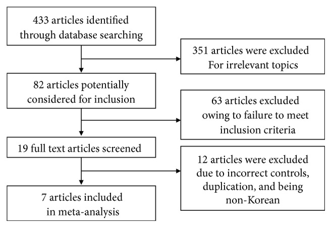
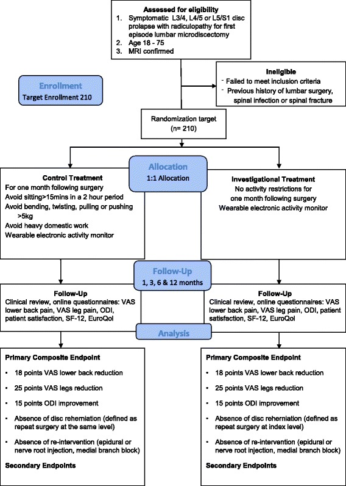
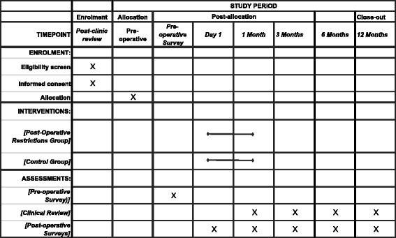
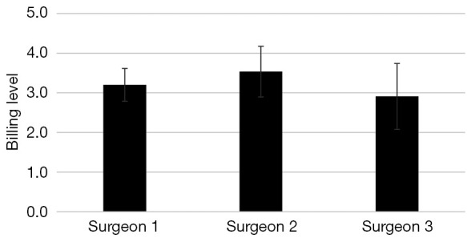
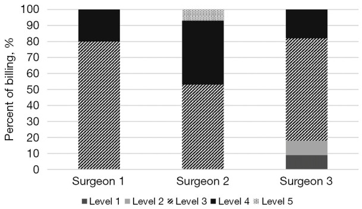
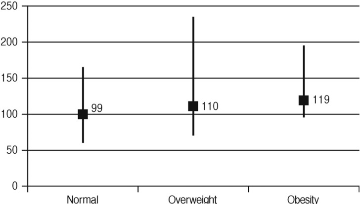
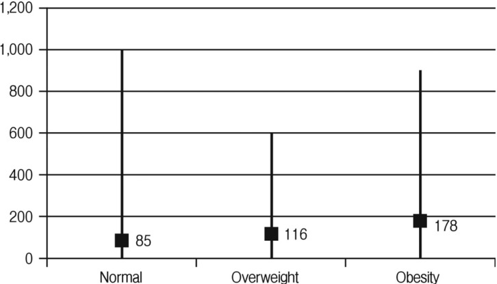
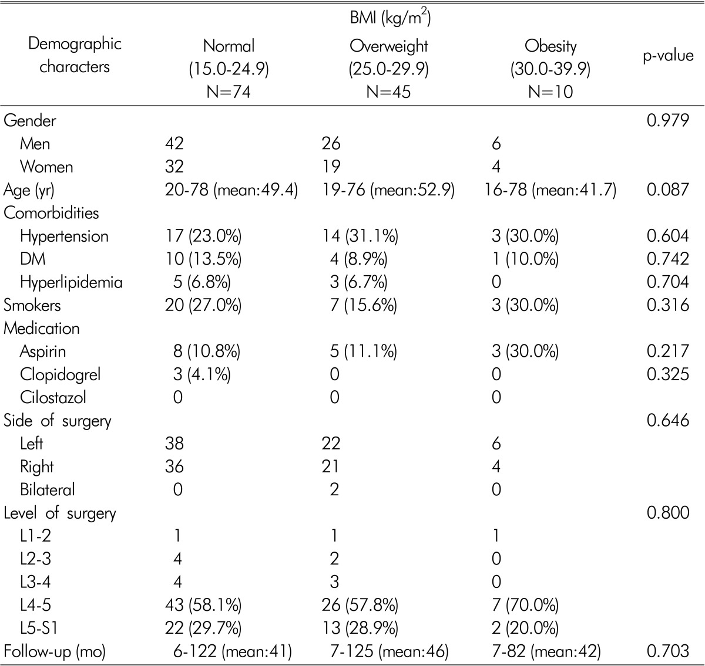
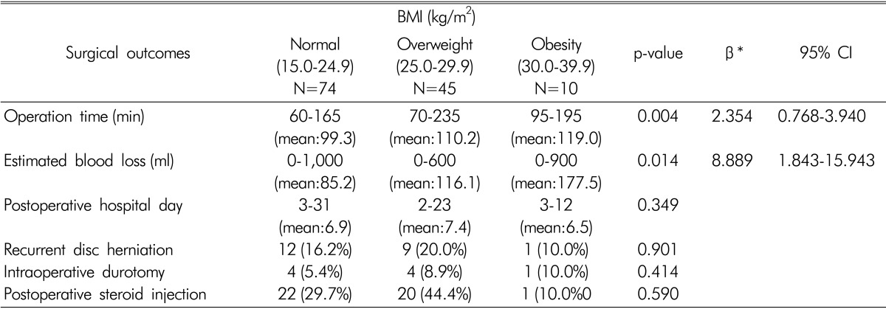

# Case Prep: Lumbar Microdiscectomy

---

<!-- BEGIN CASE SNAPSHOT -->

## Case / Approach Snapshot

- **Anatomy at risk:** level localization, cord/cauda equina, exiting and traversing roots, dura, vertebral artery or segmental vessels, esophagus/trachea/pleura/viscera by approach, and fusion/instrumentation landmarks.
- **Operative steps:** position and pad carefully, confirm level, expose the planned corridor, decompress neural elements, reconstruct or instrument when indicated, verify alignment/hardware, and close with attention to hematoma and wound risk; use the detailed operative sequence and approach notes below as the step-by-step source.
- **Rescue plans:** wrong level, durotomy, neurologic change, vertebral artery/visceral/pleural injury, graft or hardware problem, epidural hematoma, dysphagia/airway issue, and infection prevention/escalation.
- **Figures:** review [Figures, Imaging & Video](#figures-imaging--video) and the [Curated Image Set](#curated-image-set); embedded local figures should remain open-access, public-domain, or otherwise reusable with attribution.
- **Papers:** review [High-Yield Literature](#high-yield-literature) for seminal sources, modern reviews, and outcome data specific to this page.

<!-- END CASE SNAPSHOT -->

## One-Liner
[Age]yo [M/F] with [left/right] [L_-S_] disc herniation causing [L_/S_] radiculopathy presenting with [leg pain/weakness/numbness] [and/or cauda equina syndrome] planned for [left/right] L_-S_ microdiscectomy.

---

## Figures, Imaging & Video

**🎥 Operative video** — [search operative video on YouTube ▸](https://www.youtube.com/results?search_query=lumbar+disc+herniation+surgery) · [The Neurosurgical Atlas ▸](https://www.neurosurgicalatlas.com)

**CNS Video Library**

<iframe src="https://www.youtube-nocookie.com/embed/hcuH5n21cTs" title="CNS Neurosurgery 100: Techniques and Value of Minimally Invasive Spine Surgery for Decompression" loading="lazy" allow="accelerometer; clipboard-write; encrypted-media; picture-in-picture; web-share" allowfullscreen></iframe>

> 🧭 **Operative approach:** [Posterior thoracolumbar approach](../approaches/posterior-thoracolumbar-approach.md) — detailed corridor setup, step-by-step technique & figures

[Neurosurgical Atlas](https://www.neurosurgicalatlas.com) · [AO Surgery Reference](https://surgeryreference.aofoundation.org) · [Radiopaedia](https://radiopaedia.org/search?q=lumbar%20disc%20herniation&scope=all) · [PubMed Central](https://www.ncbi.nlm.nih.gov/pmc/?term=lumbar+microdiscectomy) — operative figures © linked; see [media-sources.md](../../resources/media-sources.md)

---

<!-- BEGIN CURATED LITERATURE -->

## High-Yield Literature

- **Lumbar Microdiscectomy** — Truumees E. JBJS essential surgical techniques 2016. [PubMed](https://pubmed.ncbi.nlm.nih.gov/30237913/)
- **Lumbar microdiscectomy and microendoscopic discectomy** — Riesenburger RI. Minimally invasive therapy & allied technologies : MITAT : official journal of the Society for Minimally Invasive Therapy 2006. [PubMed](https://pubmed.ncbi.nlm.nih.gov/17062400/)
- **Lumbar microdiscectomy complication rates: a systematic review and meta-analysis** — Shriver MF. Neurosurgical focus 2015. [PubMed](https://pubmed.ncbi.nlm.nih.gov/26424346/)
- **Importance of Physiotherapy after Lumbar Microdiscectomy** — Cerezci O. Turkish neurosurgery 2023. [PubMed](https://pubmed.ncbi.nlm.nih.gov/36300580/)
- **Lumbar microdiscectomy: a historical perspective and current technical considerations** — Koebbe CJ. Neurosurgical focus 2002. [PubMed](https://pubmed.ncbi.nlm.nih.gov/15916400/)
- **[Lumbar microdiscectomy using intraoperative ultrasound]** — Aslanukov MN. Khirurgiia 2020. [PubMed](https://pubmed.ncbi.nlm.nih.gov/32105252/)
- **Predictors of Recovery Following Lumbar Microdiscectomy for Sciatica: A Systematic Review and Meta-Analysis of Observational Studies** — Rehman Y. Cureus 2023. [PubMed](https://pubmed.ncbi.nlm.nih.gov/37388594/)
- **[Single-segment lumbar microdiscectomy:drainage or not]** — Zhang ZC. Zhongguo gu shang = China journal of orthopaedics and traumatology 2021. [PubMed](https://pubmed.ncbi.nlm.nih.gov/34812027/)
- **Stereotactic lumbar microdiscectomy** — Koutrouvelis PG. Neurosurgery clinics of North America 1996. [PubMed](https://pubmed.ncbi.nlm.nih.gov/8835145/)
- **Complications of Full-Endoscopic Lumbar Discectomy versus Open Lumbar Microdiscectomy: A Systematic Review and Meta-Analysis** — Yang CC. World neurosurgery 2022. [PubMed](https://pubmed.ncbi.nlm.nih.gov/36527213/)

<!-- END CURATED LITERATURE -->

---

<!-- BEGIN CURATED IMAGE SET -->

## Curated Image Set

Open-access figures are embedded from PubMed Central articles and kept unique to this guide.

*Figure 1. Flow diagram detailing study inclusion. Source: [A Comparison of Percutaneous Endoscopic Lumbar Discectomy and Open Lumbar Microdiscectomy for Lumbar Disc Herniation in the Korean: A Meta-Analysis](https://pmc.ncbi.nlm.nih.gov/articles/PMC6106715/) — BioMed Research International 2018; CC BY.*

*Fig. 1. Lumbar microdiscectomy and post-operative activity restrictions trial flow diagram Source: [Lumbar microdiscectomy and post-operative activity restrictions: a protocol for a single blinded randomised controlled trial](https://pmc.ncbi.nlm.nih.gov/articles/PMC5520336/) — BMC Musculoskeletal Disorders 2017; CC BY.*

*Figure 3. Source: [Lumbar microdiscectomy and post-operative activity restrictions: a protocol for a single blinded randomised controlled trial](https://pmc.ncbi.nlm.nih.gov/articles/PMC5520336/) — BMC Musculoskelet Disord. 2017 Jul 20;18:312. doi: 10.1186/s12891-017-1681-3; CC BY.*

*Figure 4. Source: [Variability in Opioid Prescription Following Primary Single-Level Lumbar Microdiscectomy](https://pmc.ncbi.nlm.nih.gov/articles/PMC8907642/) — Global Spine J. 2020 Aug 28;12(2):263–6. doi: 10.1177/2192568220950678; CC BY-NC-ND.*

*Figure 1. Average billing level and standard deviation for each surgeon for lumbar microdiscectomy from 2018–2019. Source: [Differences in evaluation and management coding of outpatient clinic visits for patients undergoing elective spine surgery with use of a standardized template](https://pmc.ncbi.nlm.nih.gov/articles/PMC10331495/) — Journal of Spine Surgery 2023; CC BY-NC-ND.*

*Figure 2. Distribution of billing by each surgeon per level for lumbar microdiscectomy from 2018–2019. Source: [Differences in evaluation and management coding of outpatient clinic visits for patients undergoing elective spine surgery with use of a standardized template](https://pmc.ncbi.nlm.nih.gov/articles/PMC10331495/) — Journal of Spine Surgery 2023; CC BY-NC-ND.*

*Fig. 1. Average operation time stratified by body mass index. Source: [Does Obesity Make an Influence on Surgical Outcomes Following Lumbar Microdiscectomy?](https://pmc.ncbi.nlm.nih.gov/articles/PMC4124921/) — Korean Journal of Spine 2014; CC BY-NC.*

*Fig. 2. Averatge estimated blood loss stratified by body mass index. Source: [Does Obesity Make an Influence on Surgical Outcomes Following Lumbar Microdiscectomy?](https://pmc.ncbi.nlm.nih.gov/articles/PMC4124921/) — Korean Journal of Spine 2014; CC BY-NC.*

*Figure 9. Source: [Does Obesity Make an Influence on Surgical Outcomes Following Lumbar Microdiscectomy?](https://pmc.ncbi.nlm.nih.gov/articles/PMC4124921/) — Korean J Spine. 2014 Jun 30;11(2):68–73. doi: 10.14245/kjs.2014.11.2.68; CC BY-NC.*

*Figure 10. Source: [Does Obesity Make an Influence on Surgical Outcomes Following Lumbar Microdiscectomy?](https://pmc.ncbi.nlm.nih.gov/articles/PMC4124921/) — Korean J Spine. 2014 Jun 30;11(2):68–73. doi: 10.14245/kjs.2014.11.2.68; CC BY-NC.*

<!-- END CURATED IMAGE SET -->

---

## History of Present Illness
- Chief complaint: Radicular leg pain (sciatica) / weakness / numbness
- Duration:
- Distribution: Dermatomal pattern
  - L4: Anterior thigh, medial leg
  - L5: Lateral leg, dorsum of foot, great toe
  - S1: Posterior leg, lateral foot, sole
- Severity (VAS pain score):
- Worse with: Sitting, bending, Valsalva
- Better with: Standing, lying down
- Motor deficit: Foot drop (L5), plantarflexion weakness (S1)
- Failed conservative management: Duration ___, modalities tried (PT, NSAIDs, oral steroids, epidural injections)
- **Red flags (cauda equina syndrome):**
  - Saddle anesthesia
  - Bowel/bladder dysfunction (retention > incontinence)
  - Bilateral leg symptoms
  - Progressive motor deficit
  - **If CES → EMERGENT SURGERY**

---

## Past Medical History
- Prior lumbar surgery (same or adjacent level)
- Diabetes (neuropathy may confound exam)
- Peripheral vascular disease
- Obesity (BMI)
- Smoking
- Workers' compensation / litigation (may affect outcomes)
- Allergies:
- Medications:

---

## Imaging Review
### MRI Lumbar Spine
- **Herniation level:** L_-S_ (most common: L4-5 and L5-S1)
- **Herniation type:** Protrusion / extrusion / sequestration
- **Herniation location:** Central / paracentral / foraminal / far lateral (extra-foraminal)
  - **Paracentral (most common):** Compresses traversing nerve root (e.g., L4-5 paracentral → L5 root)
  - **Foraminal/far lateral:** Compresses exiting nerve root (e.g., L4-5 far lateral → L4 root)
- **Fragment migration:** Superior / inferior / lateral
- **Canal stenosis:** Central canal size
- **Nerve root compression:** Degree of root impingement
- **Cord signal (if conus level):**
- **Other levels:** Assess for additional pathology
- **Modic changes:** Endplate changes at involved level

### CT Lumbar Spine (if MRI contraindicated)
- Bony anatomy
- Disc calcification
- Facet arthropathy

### X-rays Lumbar Spine (AP, Lateral, Flexion/Extension)
- Alignment
- Spondylolisthesis (if listhesis present, may need fusion instead)
- Disc height
- Dynamic instability

---

## Labs
- CBC
- BMP
- Coagulation
- Type and screen (rarely needed)
- HbA1c (if diabetic)
- UA (if CES symptoms)
- Post-void residual (if bladder symptoms)

---

## Neurological Examination
### Motor (Myotomal)
- L2: Hip flexion (iliopsoas) ___/5
- L3: Knee extension (quadriceps) ___/5
- L4: Ankle dorsiflexion (tibialis anterior) ___/5
- L5: Great toe extension (EHL) ___/5, hip abduction ___/5
- S1: Ankle plantarflexion (gastroc/soleus) ___/5, toe walking

### Sensory (Dermatomal)
- L4: Medial leg
- L5: Lateral leg, dorsum of foot, first webspace
- S1: Lateral foot, sole, posterior calf
- Perianal sensation (CES screening):

### Reflexes
- Patellar (L3-4):
- Achilles (S1):
- Babinski:

### Provocative Tests
- Straight leg raise (SLR): Positive at ___ degrees (ipsilateral)
- Contralateral SLR: Positive (highly specific for disc herniation)
- Femoral nerve stretch test (L2-4 levels):

### CES Screening
- Perianal sensation:
- Rectal tone:
- Post-void residual:
- Bladder/bowel function:

---

## Surgical Planning

### Diagnosis & Indication
- Working diagnosis: [L_-S_] disc herniation with [L_/S_] radiculopathy
- Surgical indication: Failed conservative management (> 6 weeks) with concordant imaging and symptoms; OR progressive motor deficit; OR cauda equina syndrome (emergent)
- Goals: Decompress nerve root by removing herniated disc fragment
- NOT a fusion procedure — motion preserved

### Position
- **Patient position:** Prone on a Wilson frame (or Jackson table, or Andrews frame)
- **Abdomen:** Must be FREE/hanging — reduces epidural venous engorgement and bleeding
  - Wilson frame: curved to open lumbar interspaces
  - Jackson table: padded frame, abdomen free
- **Head:** On horseshoe headrest or foam, eyes free, ETT secured
- **Arms:** On armboards, elbows padded, < 90 degrees abduction
- **Legs:** Slightly flexed at hips and knees
- **Chest bolsters/pads:** Support chest, keep abdomen free
- **Key:** Check that abdomen is truly free — palpate or slide hand under

### Incision
- **Type:** Small (2-3 cm) midline posterior incision centered over the interspace
- **Level confirmed with:** Fluoroscopy (AP view, spinal needle placed on spinous process or interspinous ligament)
- **Skin marking:** Navigation or fluoroscopy mark the disc level

### Approach: Posterior Midline Microsurgical

### Key Surgical Steps
1. **Fluoroscopic level confirmation** — CRITICAL; wrong-level surgery is a never event
   - Place needle on spinous process, obtain AP fluoroscopy
   - Count from sacrum (most reliable landmark)
   - For L5-S1: palpate sacral promontory/lumbosacral junction
2. **Midline incision** — 2-3 cm centered over interlaminar window
3. **Subperiosteal dissection** — detach paraspinal muscles from spinous process and lamina on the AFFECTED SIDE ONLY
4. **Self-retaining retractor** (McCulloch, tubular retractor for MIS)
5. **Identify interlaminar window:**
   - Superior lamina (partial inferior edge)
   - Inferior lamina (partial superior edge)
   - Ligamentum flavum between
6. **Laminotomy:** Remove inferior edge of superior lamina with Kerrison rongeur or drill to expose the ligamentum flavum adequately
   - Preserve as much facet joint as possible (> 50% lateral facet must remain to prevent instability)
7. **Ligamentum flavum removal:** Detach from deep surface of superior lamina, elevate, and excise with Kerrison rongeur, exposing the epidural space
8. **Identify the traversing nerve root** — should be visible crossing the disc space
9. **Retract nerve root medially** (gently, with nerve root retractor)
10. **Identify disc herniation:**
    - Epidural: Fragment may be visible under the root
    - Subligamentous: Open the posterior longitudinal ligament over the bulge
    - Sequestered: Fragment may have migrated superiorly or inferiorly
11. **Remove disc fragment:**
    - Incise annulus (if subligamentous)
    - Remove herniated fragment with pituitary rongeur
    - Enter the disc space and remove loose fragments
    - **Explore for free fragments** — check cephalad and caudad to the nerve root, and laterally in the axilla of the root
    - Do NOT aggressively curette the disc space (not a fusion — preserve disc height)
12. **Confirm root decompression:**
    - Nerve root should be freely mobile
    - Pass nerve hook around the root (360-degree check)
    - Root should be pulsatile (thecal sac pulsation transmitted)
13. **Hemostasis:** Bipolar, Gelfoam, thrombin-soaked Gelfoam for epidural bleeding
14. **Closure:**
    - Irrigate
    - Fascia: 0 or 2-0 Vicryl
    - Subcutaneous: 3-0 Vicryl
    - Skin: 4-0 Monocryl subcuticular + Dermabond OR staples

### Critical Anatomy & Structures at Risk
1. **Traversing nerve root** — the root being decompressed; retract gently (medially)
2. **Exiting nerve root** — exits under the pedicle ABOVE (e.g., L4 root exits at L4-5 above the disc); at risk if dissection is too lateral/cephalad
3. **Thecal sac / cauda equina** — medial to the working corridor
4. **Epidural veins** — can cause significant bleeding; bipolar, Gelfoam
5. **Facet joint** — preserve > 50% to prevent iatrogenic instability
6. **Great vessels (aorta/IVC/iliac)** — anterior to disc space; rare but CATASTROPHIC vascular injury if pituitary rongeur passes through anterior annulus. Do NOT plunge instruments anteriorly

### Equipment
- Operating microscope OR loupes + headlight
- C-arm fluoroscopy (for level confirmation)
- McCulloch retractor set (or tubular retractor for MIS)
- Kerrison rongeurs (2mm, 3mm, 4mm)
- Pituitary rongeurs (various angles)
- Curettes (angled, straight)
- Nerve root retractors (small, medium)
- Nerve hook
- Penfield dissectors
- High-speed drill (if bony decompression needed)
- Bipolar forceps
- Hemostatic agents (Gelfoam, thrombin, Surgicel)

### Monitoring
- Standard ASA monitors
- EMG monitoring (triggered — optional but recommended)
- No SSEPs/MEPs typically needed for standard microdiscectomy

### Anesthesia Considerations
- General endotracheal anesthesia
- Foley catheter (if CES or expected long case)
- Cefazolin 2g IV
- Dexamethasone 10 mg IV (optional — reduces root edema)
- No paralytic after intubation (if EMG monitoring)
- SBP control (reduce epidural bleeding)
- Verify abdomen is free after positioning

### Potential Complications & Contingencies
1. **Dural tear / CSF leak** — primary repair if possible (5-0 or 6-0 Prolene); if not, Duragen + fibrin glue + muscle patch. Flat bed rest x 48-72h post-op
2. **Nerve root injury** — gentle retraction only; if motor worse post-op, MRI to rule out hematoma
3. **Wrong-level surgery** — prevent with meticulous fluoroscopic confirmation; count from sacrum
4. **Recurrent herniation** — 5-15% risk; counsel pre-op. If recurrent: repeat discectomy or consider fusion
5. **Epidural hematoma** — meticulous hemostasis; if new deficit post-op → emergent MRI → return to OR
6. **Vascular injury (anterior disc penetration)** — EXTREMELY rare but fatal; if sudden hypotension after disc space entry → emergent vascular surgery consultation, laparotomy
7. **Discitis/infection** — fever, worsening back pain at 2-4 weeks; MRI with gadolinium, ESR/CRP

---

## Operative Note Template

**Preoperative Diagnosis:** [Left/Right] L_-S_ disc herniation with [L_/S_] radiculopathy

**Postoperative Diagnosis:** Same

**Procedure:** [Left/Right] L_-S_ microsurgical lumbar discectomy

**Surgeon:**
**Assistant:**
**Anesthesia:** General endotracheal anesthesia

**EBL:** Minimal (___ mL)
**Fluids:**
**Specimens:** Disc material (send to pathology if concern for infection/tumor)
**Drains:** None
**Complications:** None
**Implants:** None

**Indications:**
The patient is a [age]yo [M/F] with [left/right] [L_/S_] radiculopathy due to a [left/right] L_-S_ [paracentral/foraminal] disc herniation. The patient failed [duration] of conservative management including [PT, NSAIDs, epidural injections]. [The patient presented with progressive L5 foot drop / cauda equina syndrome requiring urgent surgery.] After discussion of risks, benefits, and alternatives, the patient elected to proceed with microsurgical discectomy.

**Description of Procedure:**
After informed consent was verified and the surgical site was marked, the patient was brought to the operating room. General endotracheal anesthesia was induced. The patient was carefully log-rolled to the prone position on a [Wilson frame / Jackson table]. The abdomen was confirmed to be free and hanging. All pressure points were padded, the eyes were free of pressure, and the endotracheal tube was secured. A time-out was performed.

The lower back was prepped and draped in standard sterile fashion. Cefazolin [2g] was administered. The appropriate surgical level was confirmed with AP fluoroscopy using a spinal needle placed at the [L_-S_] interspinous space [counting from the sacrum].

**Incision:** A [2.5 cm] midline incision was made centered over the [L_-S_] interspace. Dissection was carried through the thoracolumbar fascia. The paraspinal muscles were elevated subperiosteally from the spinous process and lamina on the [left/right] side. A self-retaining retractor was placed.

**Laminotomy and decompression:** The interlaminar window at [L_-S_] was identified. Using a [Kerrison rongeur / high-speed drill], the inferior edge of the [L_] lamina was removed to expose the ligamentum flavum. The ligamentum flavum was detached from the undersurface of the lamina and excised, exposing the epidural space. [The facet joint was preserved.]

**Discectomy:** Under the operating microscope, the traversing [L_/S_] nerve root was identified. The root was gently retracted medially. A [large/moderate] [paracentral/foraminal] disc fragment was identified [compressing the nerve root / extruded into the epidural space / migrated cephalad-caudad]. The fragment was removed with a pituitary rongeur. The posterior longitudinal ligament was incised and the annular defect was explored. Additional loose disc material was removed from the disc space. A nerve hook was passed around the nerve root [superiorly, inferiorly, and laterally], confirming complete decompression. The nerve root was freely mobile and pulsatile.

**Hemostasis:** Hemostasis was achieved with bipolar cautery and [Gelfoam / thrombin-soaked Gelfoam]. The wound was irrigated with antibiotic-containing saline.

**Closure:** The thoracolumbar fascia was closed with [0 Vicryl] interrupted sutures. The subcutaneous tissue was closed with [3-0 Vicryl]. The skin was closed with [4-0 Monocryl subcuticular suture and Dermabond / staples]. A sterile dressing was applied.

**Postoperative:** The patient was carefully log-rolled to the supine position, awakened from anesthesia, extubated, and found to have [improved leg pain / intact motor function / baseline neurological status]. The patient was transferred to the PACU in stable condition.

---

## Postoperative Plan
- Same-day discharge (ambulatory surgery) OR overnight observation
- Neuro checks in PACU: Motor and sensory in lower extremities
- Activity: Ambulate same day; no heavy lifting > 10-15 lbs x 6 weeks
- Wound care: Keep dry x 48h; Dermabond will peel off naturally
- Pain: Acetaminophen, NSAIDs, limited narcotics, ice
- DVT prophylaxis: Early ambulation; SCDs if admitted
- Diet: Regular
- If CES presentation: Foley, check post-void residual; may need short-term bladder management
- If dural tear: Flat bed rest x 48-72h, monitor for headache
- Return precautions: Fever, new weakness, bowel/bladder dysfunction, wound drainage, severe worsening pain
- Follow-up: Clinic 2-4 weeks
- Physical therapy: Start at 4-6 weeks post-op
- Expected outcomes: 85-95% good/excellent pain relief for radiculopathy; motor recovery varies (the longer the deficit persisted pre-op, the less likely full recovery)
