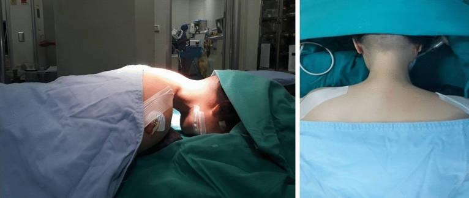
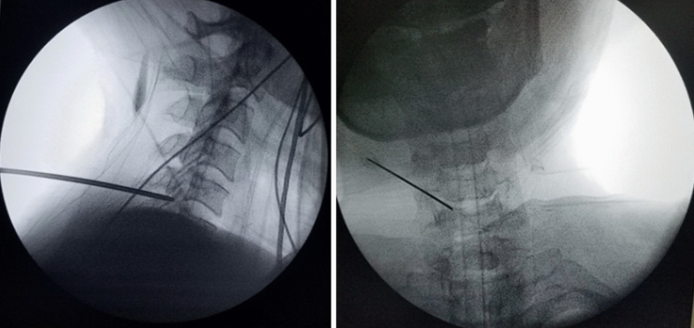
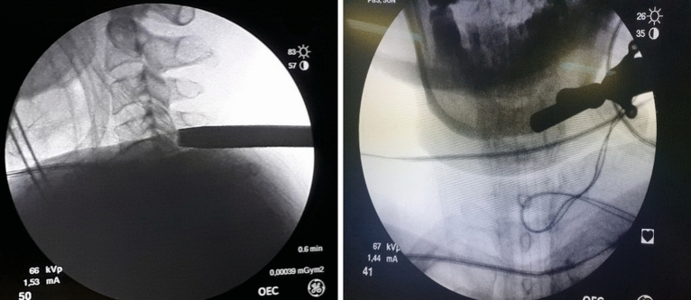
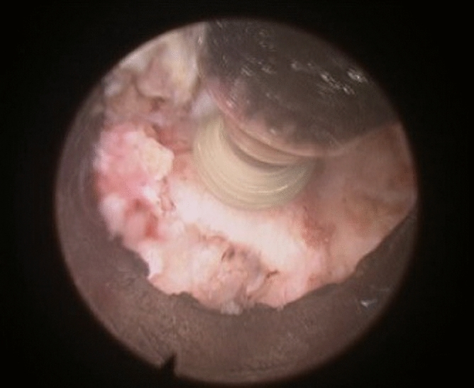
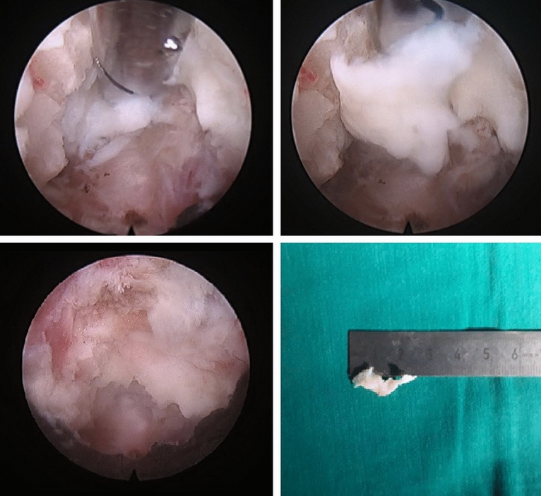
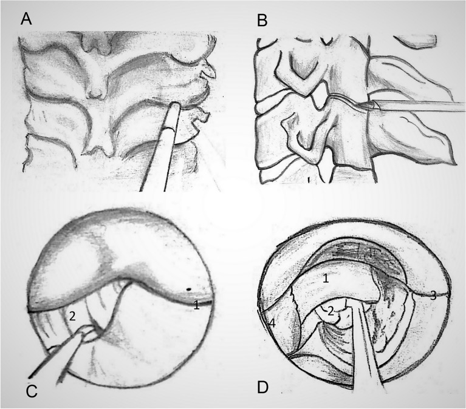
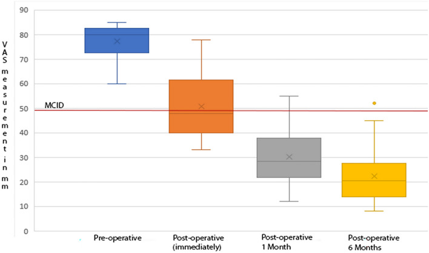
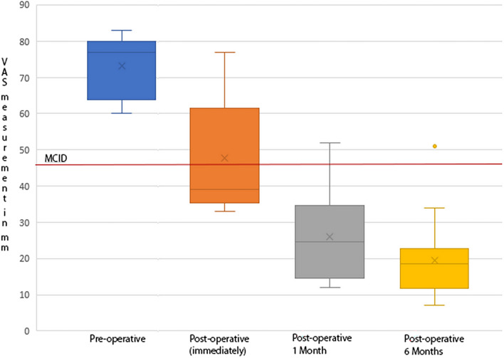
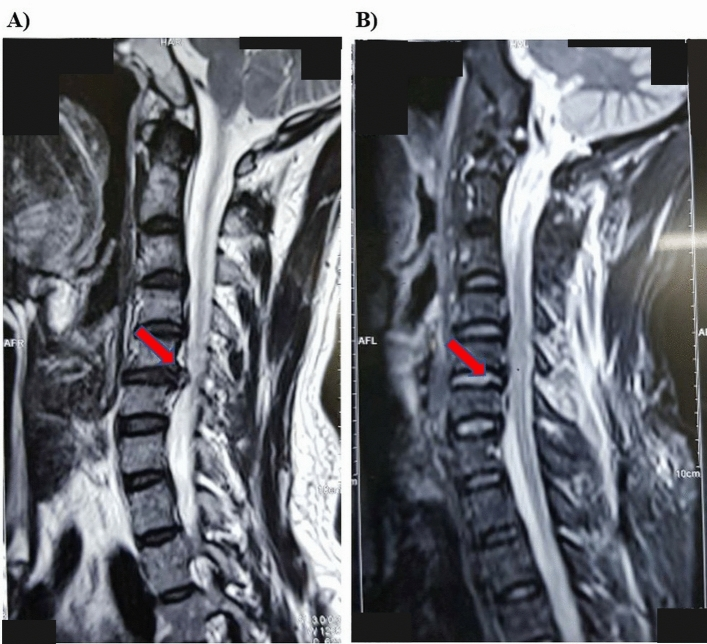
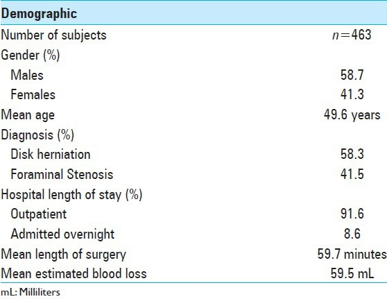

# Case Prep: Posterior Cervical Foraminotomy (Laminoforaminotomy)

---

<!-- BEGIN CASE SNAPSHOT -->

## Case / Approach Snapshot

- **Anatomy at risk:** level localization, cord/cauda equina, exiting and traversing roots, dura, vertebral artery or segmental vessels, esophagus/trachea/pleura/viscera by approach, and fusion/instrumentation landmarks.
- **Operative steps:** position and pad carefully, confirm level, expose the planned corridor, decompress neural elements, reconstruct or instrument when indicated, verify alignment/hardware, and close with attention to hematoma and wound risk; use the detailed operative sequence and approach notes below as the step-by-step source.
- **Rescue plans:** wrong level, durotomy, neurologic change, vertebral artery/visceral/pleural injury, graft or hardware problem, epidural hematoma, dysphagia/airway issue, and infection prevention/escalation.
- **Figures:** review [Figures, Imaging & Video](#figures-imaging--video) and the [Curated Image Set](#curated-image-set); embedded local figures should remain open-access, public-domain, or otherwise reusable with attribution.
- **Papers:** review [High-Yield Literature](#high-yield-literature) for seminal sources, modern reviews, and outcome data specific to this page.

<!-- END CASE SNAPSHOT -->

## One-Liner
[Age]yo [M/F] with [left/right] [C_] cervical radiculopathy due to [foraminal soft disc / foraminal spondylosis] at [C_-C_] planned for [open/minimally invasive] posterior cervical laminoforaminotomy (motion-preserving, no fusion).

---

## Figures, Imaging & Video

**🎥 Operative video** — [search operative video on YouTube ▸](https://www.youtube.com/results?search_query=cervical+foraminal+stenosis+surgery) · [The Neurosurgical Atlas ▸](https://www.neurosurgicalatlas.com)

> 🧭 **Operative approach:** [Posterior cervical approach](../approaches/posterior-cervical-approach.md) — detailed corridor setup, step-by-step technique & figures

[Neurosurgical Atlas](https://www.neurosurgicalatlas.com) · [AO Surgery Reference](https://surgeryreference.aofoundation.org) · [Radiopaedia](https://radiopaedia.org/search?q=cervical%20foraminal%20stenosis&scope=all) · [PubMed Central](https://www.ncbi.nlm.nih.gov/pmc/?term=posterior+cervical+foraminotomy) — operative figures © linked; see [media-sources.md](../../resources/media-sources.md)

---

<!-- BEGIN CURATED LITERATURE -->

## High-Yield Literature

- **Posterior Endoscopic Cervical Foraminotomy** — Bhatia S. Neurosurgery clinics of North America 2020. [PubMed](https://pubmed.ncbi.nlm.nih.gov/31739934/)
- **Posterior Cervical Foraminotomy Via Full-Endoscopic Versus Microendoscopic Approach for Radiculopathy: A Systematic Review and Meta-analysis** — Wu PF. Pain physician 2019. [PubMed](https://pubmed.ncbi.nlm.nih.gov/30700067/)
- **Minimally invasive posterior cervical foraminotomy versus the anterior transcorporeal approach for cervical radiculopathy: a systematic review and meta-analysis** — Rajjoub R. Journal of neurosurgery. Spine 2024. [PubMed](https://pubmed.ncbi.nlm.nih.gov/39126721/)
- **Cervical radiculopathy** — Iyer S. Current reviews in musculoskeletal medicine 2016. [PubMed](https://pubmed.ncbi.nlm.nih.gov/27250042/)
- **Impact of Posterior Cervical Foraminotomy Before or After Cervical Disk Replacement: Current Evidence** — Young MW. Clinical spine surgery 2023. [PubMed](https://pubmed.ncbi.nlm.nih.gov/37798824/)
- **Endoscopic Posterior Cervical Foraminotomy and Discectomy** — Raad M. JBJS essential surgical techniques 2025. [PubMed](https://pubmed.ncbi.nlm.nih.gov/40567511/)
- **Cervical posterior foraminotomy: how i do it** — Cossu G. Acta neurochirurgica 2020. [PubMed](https://pubmed.ncbi.nlm.nih.gov/31938822/)
- **Posterior foraminotomy for lateral cervical disc herniation** — Mehren C. European spine journal : official publication of the European Spine Society, the European Spinal Deformity Society, and the European Section of the Cervical Spine Research Society 2019. [PubMed](https://pubmed.ncbi.nlm.nih.gov/30758722/)
- **Minimally invasive posterior cervical foraminotomy versus anterior cervical fusion and arthroplasty: Systematic review and updated meta-analysis** — Fang H. Brain & spine 2024. [PubMed](https://pubmed.ncbi.nlm.nih.gov/39036750/)
- **Posterior Cervical Foraminotomy Compared with Anterior Cervical Discectomy with Fusion for Cervical Radiculopathy: Two-Year Results of the FACET Randomized Noninferiority Study** — Simões de Souza NF. The Journal of bone and joint surgery. American volume 2024. [PubMed](https://pubmed.ncbi.nlm.nih.gov/39047120/)

<!-- END CURATED LITERATURE -->

---

<!-- BEGIN CURATED IMAGE SET -->

## Curated Image Set

Open-access figures are embedded from PubMed Central articles and kept unique to this guide.

*Figure 1. The position of a patient during surgery. Source: [The first experience with fully endoscopic posterior cervical foraminotomy and discectomy for radiculopathy performed in Viet Duc University Hospital](https://pmc.ncbi.nlm.nih.gov/articles/PMC9117311/) — Scientific Reports 2022; CC BY.*

*Figure 2. Under fluoroscopic control, the guide wires are inserted through the posterior cervical musculature with the tip directed to the operative disc space. Source: [The first experience with fully endoscopic posterior cervical foraminotomy and discectomy for radiculopathy performed in Viet Duc University Hospital](https://pmc.ncbi.nlm.nih.gov/articles/PMC9117311/) — Scientific Reports 2022; CC BY.*

*Figure 3. Working channel Insertion. On a string conductor, tubular reamers of increasing diameter were introduced, on which a working cannula with a beveled cut with an external diameter of 7.5... Source: [The first experience with fully endoscopic posterior cervical foraminotomy and discectomy for radiculopathy performed in Viet Duc University Hospital](https://pmc.ncbi.nlm.nih.gov/articles/PMC9117311/) — Scientific Reports 2022; CC BY.*

*Figure 4. Bone Resection. Laminotomy and facetectomy are performed with 3.0 mm diamond boron, from “V-point” to the periphery. Source: [The first experience with fully endoscopic posterior cervical foraminotomy and discectomy for radiculopathy performed in Viet Duc University Hospital](https://pmc.ncbi.nlm.nih.gov/articles/PMC9117311/) — Scientific Reports 2022; CC BY.*

*Figure 5. Preparation and removal of the herniated material. Source: [The first experience with fully endoscopic posterior cervical foraminotomy and discectomy for radiculopathy performed in Viet Duc University Hospital](https://pmc.ncbi.nlm.nih.gov/articles/PMC9117311/) — Scientific Reports 2022; CC BY.*

*Figure 6. Surgical diagrams for Endoscopic Posterior Cervical Foraminotomy and Discectomy techniques: A and B localize of working cannula. C The facet joint is identified by removing the overlying... Source: [The first experience with fully endoscopic posterior cervical foraminotomy and discectomy for radiculopathy performed in Viet Duc University Hospital](https://pmc.ncbi.nlm.nih.gov/articles/PMC9117311/) — Scientific Reports 2022; CC BY.*

*Figure7. Neck pain intensity on visual analogue scale (VAS- Neck) before and after surgery. Minimal clinically important differences (MCID) = 28 mm. Source: [The first experience with fully endoscopic posterior cervical foraminotomy and discectomy for radiculopathy performed in Viet Duc University Hospital](https://pmc.ncbi.nlm.nih.gov/articles/PMC9117311/) — Scientific Reports 2022; CC BY.*

*Figure 8. Arm pain intensity on visual analogue scale (VAS- Arm) before and after surgery. Minimal clinically important differences (MCID) = 26 mm. Source: [The first experience with fully endoscopic posterior cervical foraminotomy and discectomy for radiculopathy performed in Viet Duc University Hospital](https://pmc.ncbi.nlm.nih.gov/articles/PMC9117311/) — Scientific Reports 2022; CC BY.*

*Figure 9. Herniation of C5-6 right. Before (A) and after (B) operation (male, 32 years old). Source: [The first experience with fully endoscopic posterior cervical foraminotomy and discectomy for radiculopathy performed in Viet Duc University Hospital](https://pmc.ncbi.nlm.nih.gov/articles/PMC9117311/) — Scientific Reports 2022; CC BY.*

*Figure 10. Source: [Minimally invasive tubular access for posterior cervical foraminotomy](https://pmc.ncbi.nlm.nih.gov/articles/PMC4439784/) — Surg Neurol Int. 2015 May 19;6:81. doi: 10.4103/2152-7806.157308; CC BY-NC-SA.*

<!-- END CURATED IMAGE SET -->

---

## History of Present Illness
- Chief complaint: Unilateral radicular arm pain in [C_] distribution, dermatomal
- Failed conservative management
- **Ideal:** posterolateral/foraminal soft disc or foraminal stenosis causing single-level unilateral radiculopathy — posterior decompression preserves motion, avoids fusion and anterior approach risks
- **Not ideal:** central disc, myelopathy, kyphosis, axial-dominant pain, instability

---

## Past Medical History
- Standard PMH, prior cervical surgery, smoking

---

## Imaging Review
### MRI
- **Foraminal/posterolateral compression** at [C_-C_], lateralized to symptomatic side, exclude central compression/myelopathy
### CT
- Foraminal bony stenosis, uncovertebral/facet osteophytes
### X-ray (flexion/extension)
- Alignment, no instability

---

## Labs
- CBC, BMP, Coags, Type and screen

---

## Neurological Examination
- Focused [C_] myotome/dermatome/reflex, Spurling test, rule out myelopathy

---

## Surgical Planning

### Case Logistics, OR Needs & Orders
- **Typical bed:** outpatient/PACU for selected decompressions; floor or step-down for fusion, cervical myelopathy, thoracic disease, medical frailty, high EBL, or airway risk.
- **OR setup:** radiolucent/Jackson table, fluoroscopy or O-arm/navigation, microscope/loupes for decompression, implant trays/graft ready for fusion, neuromonitoring for myelopathy/cord-risk cases, and postop brace plan confirmed.
- **Special needs:** arterial line/Foley/type-screen for long fusion/corpectomy, no long paralytic when MEPs are used, MAP/normotension for myelopathy or cord-risk cases, antibiotic redosing, and anticoagulation/DVT plan.
- **Immediate postop orders:** neuro checks by myotome/sensory level, airway/dysphagia watch for anterior cervical cases, CT/X-rays per construct, drain care, brace/activity orders, DVT prophylaxis timing, bowel regimen, and PT/OT mobilization.

### Position
- **Prone** (Mayfield) or **sitting** (some surgeons — less bleeding, but VAE risk); neck flexed; reverse Trendelenburg
- IONM optional

### Approach: Posterior, Tubular (MIS) or Open Midline/Paramedian
### Key Surgical Steps
1. Fluoroscopic level localization
2. **MIS:** paramedian stab, sequential tubular dilators docked on the lamina-facet junction of the symptomatic side; **Open:** small midline/paramedian incision, unilateral subperiosteal dissection
3. Identify the **"V-point"** — junction of superior and inferior laminae at the medial facet
4. **Laminoforaminotomy:** high-speed drill + Kerrison to remove medial edge of the lamina and **medial ~1/3 of the facet** (preserve > 50% of facet to avoid instability) over the exiting nerve root
5. Identify and decompress the **exiting nerve root**; follow it into the foramen, remove osteophyte/foraminal stenosis
6. **Soft disc:** gently retract the root superiorly, remove the disc fragment from the axilla/under the root (minimal root retraction — root is taut)
7. Confirm root is decompressed and mobile
8. Hemostasis (epidural veins — bipolar/Gelfoam), closure (tube removed; minimal closure for MIS)

### Critical Anatomy & Structures at Risk
1. **Exiting nerve root** — gentle handling, taut root
2. **Vertebral artery** (anterior to foramen — do not drill too far ventral/lateral)
3. **Spinal cord/dura** (medial — avoid)
4. **Facet joint** — preserve > 50% (instability if over-resected)
5. Epidural venous plexus (bleeding)

### Equipment
- Tubular retractor system (MIS) or standard retractors
- High-speed drill, fine Kerrison rongeurs, nerve hooks, micro-instruments
- Fluoroscopy, bipolar, hemostatic agents, microscope/loupes/endoscope

### Monitoring
- Optional EMG/SSEP; precordial Doppler if sitting

### Anesthesia
- General; if sitting → VAE precautions; standard

### Potential Complications
1. Nerve root injury (retraction)
2. **Vertebral artery injury** (over-ventral drilling)
3. CSF leak (dural injury), epidural hematoma
4. Instability (excess facet removal), inadequate decompression/recurrence
5. VAE (sitting)

---

## Operative Note Template
**Preoperative Diagnosis:** [Left/Right] [C_] cervical radiculopathy from foraminal [soft disc/spondylosis] at [C_-C_]

**Postoperative Diagnosis:** Same

**Procedure:** [Left/Right] [minimally invasive] posterior cervical laminoforaminotomy at [C_-C_] [with discectomy]

**Surgeon / Assistant:**
**Anesthesia:** General endotracheal
**EBL / Fluids:**
**Adjuncts:** Tubular retractor (if MIS), high-speed drill, fluoroscopy, microscope; [EMG]
**Implants:** None
**Complications:** None

**Indications:** [Age]yo [M/F] with unilateral [C_] radiculopathy from foraminal/posterolateral compression at [C_-C_], refractory to conservative care — ideal for motion-preserving posterior foraminotomy. Risks (root/VA injury, instability if over-resection) discussed.

**Description of Procedure:** After consent and time-out, general anesthesia was induced and the patient positioned prone in Mayfield. The level was localized fluoroscopically. [MIS: sequential tubular dilators were docked on the lamina-facet junction; / Open: a small paramedian exposure was performed.] The **V-point** (junction of superior/inferior laminae at the medial facet) was identified, and a **facet-preserving laminoforaminotomy** (removing the medial ~1/3 of the facet, preserving >50%) was performed over the exiting [C_] root with the drill and fine Kerrisons.

The exiting nerve root was decompressed into the foramen and any foraminal osteophyte addressed; [a disc fragment was removed from the axilla with minimal root retraction]. The root was confirmed free and mobile. Hemostasis of the epidural plexus was obtained.

The tube was removed [/ minimal closure performed]. The patient was awakened with [improved] arm symptoms and discharged [same day/overnight].

---

## Postoperative Plan
- Same-day or overnight; neuro checks (arm function)
- No collar/fusion; early mobilization
- Pain control, activity as tolerated
- Follow-up 2-4 weeks; expect good radicular pain relief, motion preserved
