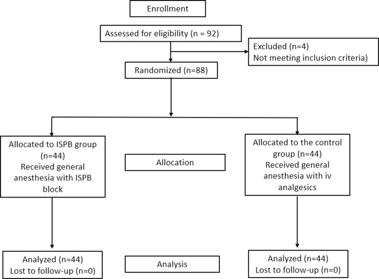
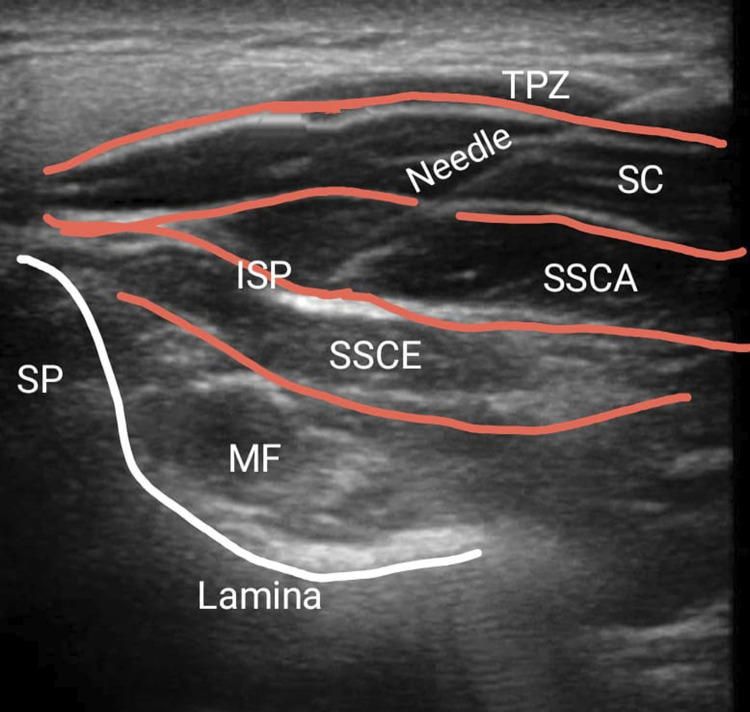
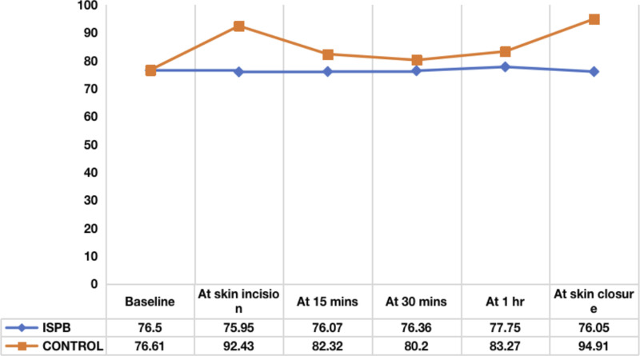
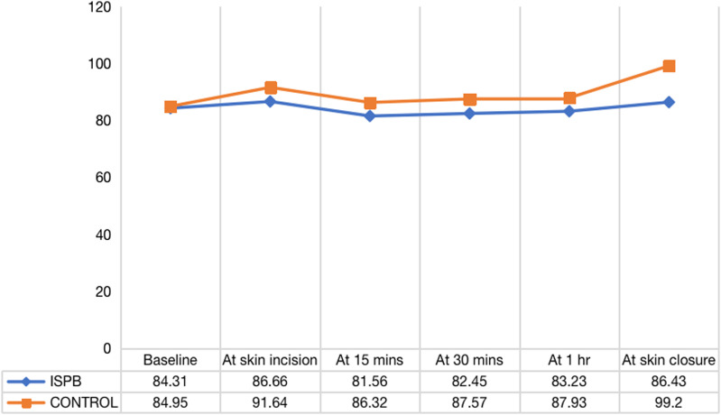
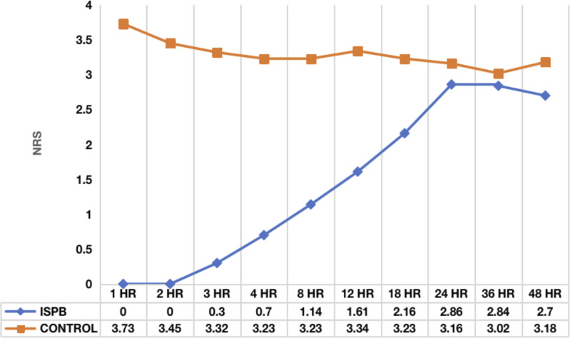
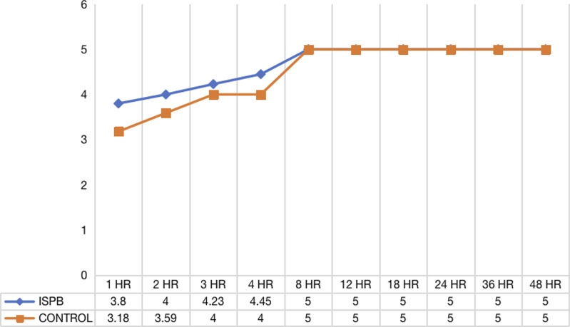
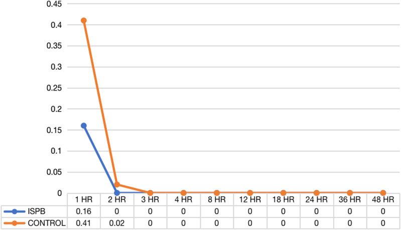
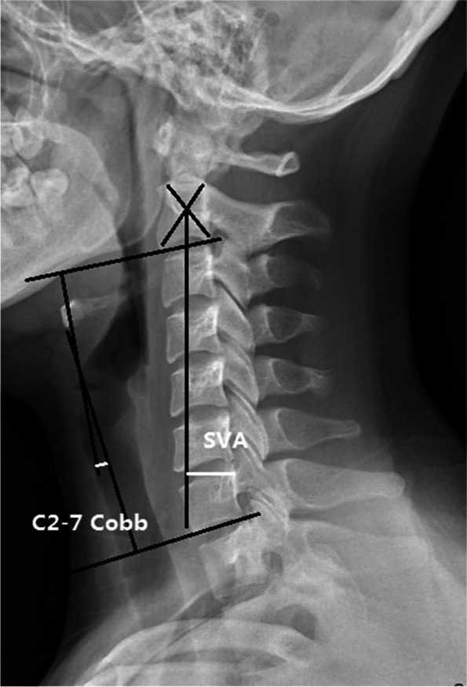
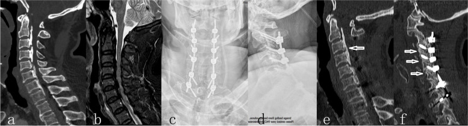
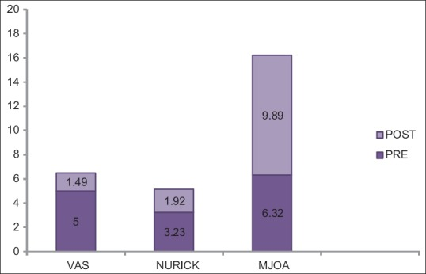

# Case Prep: Posterior Cervical Laminectomy and Fusion

---

<!-- BEGIN CASE SNAPSHOT -->

## Case / Approach Snapshot

- **Anatomy at risk:** level localization, cord/cauda equina, exiting and traversing roots, dura, vertebral artery or segmental vessels, esophagus/trachea/pleura/viscera by approach, and fusion/instrumentation landmarks.
- **Operative steps:** position and pad carefully, confirm level, expose the planned corridor, decompress neural elements, reconstruct or instrument when indicated, verify alignment/hardware, and close with attention to hematoma and wound risk; use the detailed operative sequence and approach notes below as the step-by-step source.
- **Rescue plans:** wrong level, durotomy, neurologic change, vertebral artery/visceral/pleural injury, graft or hardware problem, epidural hematoma, dysphagia/airway issue, and infection prevention/escalation.
- **Figures:** review [Figures, Imaging & Video](#figures-imaging--video) and the [Curated Image Set](#curated-image-set); embedded local figures should remain open-access, public-domain, or otherwise reusable with attribution.
- **Papers:** review [High-Yield Literature](#high-yield-literature) for seminal sources, modern reviews, and outcome data specific to this page.

<!-- END CASE SNAPSHOT -->

## One-Liner
[Age]yo [M/F] with [multilevel cervical spondylotic myelopathy / OPLL] from [C_-C_] [with maintained lordosis] planned for posterior cervical laminectomy and instrumented fusion (lateral mass ± pedicle screws).

---

## Figures, Imaging & Video

**🎥 Operative video** — [search operative video on YouTube ▸](https://www.youtube.com/results?search_query=cervical+spondylotic+myelopathy+surgery) · [The Neurosurgical Atlas ▸](https://www.neurosurgicalatlas.com)

> 🧭 **Operative approach:** [Posterior cervical approach](../approaches/posterior-cervical-approach.md) — detailed corridor setup, step-by-step technique & figures

[Neurosurgical Atlas](https://www.neurosurgicalatlas.com) · [AO Surgery Reference](https://surgeryreference.aofoundation.org) · [Radiopaedia](https://radiopaedia.org/search?q=cervical%20spondylotic%20myelopathy&scope=all) · [PubMed Central](https://www.ncbi.nlm.nih.gov/pmc/?term=posterior+cervical+laminectomy+fusion) — operative figures © linked; see [media-sources.md](../../resources/media-sources.md)

---

<!-- BEGIN CURATED LITERATURE -->

## High-Yield Literature

- **Cervical kyphosis after posterior cervical laminectomy with and without fusion** — Jentzsch T. European spine journal : official publication of the European Spine Society, the European Spinal Deformity Society, and the European Section of the Cervical Spine Research Society 2024. [PubMed](https://pubmed.ncbi.nlm.nih.gov/38825607/)
- **Minimally Invasive Posterior Cervical Laminectomy: 2-Dimensional Operative Video** — Lewis CS. Operative neurosurgery (Hagerstown, Md.) 2023. [PubMed](https://pubmed.ncbi.nlm.nih.gov/36701552/)
- **Multilevel cervical laminectomy and fusion with posterior cervical cages** — Bou Monsef JN. Journal of craniovertebral junction & spine 2017. [PubMed](https://pubmed.ncbi.nlm.nih.gov/29403242/)
- **Cervical laminoplasty versus laminectomy and posterior cervical fusion for cervical myelopathy: propensity-matched analysis of 24-month outcomes from the Quality Outcomes Database** — Yang E. Journal of neurosurgery. Spine 2023. [PubMed](https://pubmed.ncbi.nlm.nih.gov/37728378/)
- **Intraoperative Ultrasound-Guided Posterior Cervical Laminectomy for Degenerative Cervical Myelopathy** — Schär RT. World neurosurgery 2019. [PubMed](https://pubmed.ncbi.nlm.nih.gov/30312813/)
- **Ischemia-Reperfusion Injury After Posterior Cervical Laminectomy** — Malinovic M. Cureus 2021. [PubMed](https://pubmed.ncbi.nlm.nih.gov/34722073/)
- **The Efficacy of Posterior Cervical Laminectomy for Multilevel Degenerative Cervical Spondylotic Myelopathy in Long Term Period** — Kire N. Asian journal of neurosurgery 2019. [PubMed](https://pubmed.ncbi.nlm.nih.gov/31497113/)
- **Posterior Cervical Laminectomy Results in Better Radiographic Decompression of Spinal Cord Compared with Anterior Cervical Discectomy and Fusion** — Piazza M. World neurosurgery 2018. [PubMed](https://pubmed.ncbi.nlm.nih.gov/29138070/)
- **Post-operative quadriparesis following posterior cervical laminectomy and fusion: A case-series of incidence, risk factors, and management** — Hernandez NS. Clinical neurology and neurosurgery 2022. [PubMed](https://pubmed.ncbi.nlm.nih.gov/35033792/)
- **Bridging the cervicothoracic junction during posterior cervical laminectomy and fusion for the treatment of multilevel cervical ossification of the posterior longitudinal ligament: a retrospective case series** — Wu DZ. BMC musculoskeletal disorders 2022. [PubMed](https://pubmed.ncbi.nlm.nih.gov/35550067/)

<!-- END CURATED LITERATURE -->

---

<!-- BEGIN CURATED IMAGE SET -->

## Curated Image Set

Open-access figures are embedded from PubMed Central articles and kept unique to this guide.

*Figure 1.. CONSORT flow diagram. Source: [Efficacy and Safety of Ultrasound Guided Inter-semispinal Plane Block for Postoperative Analgesia in Posterior Cervical Laminectomy - A Prospective Randomised Controlled Study](https://pmc.ncbi.nlm.nih.gov/articles/PMC11571355/) — Global Spine Journal 2024; CC BY-NC-ND.*

*Figure 2.. Demonstration of US-guided ISP block. Source: [Efficacy and Safety of Ultrasound Guided Inter-semispinal Plane Block for Postoperative Analgesia in Posterior Cervical Laminectomy - A Prospective Randomised Controlled Study](https://pmc.ncbi.nlm.nih.gov/articles/PMC11571355/) — Global Spine Journal 2024; CC BY-NC-ND.*

*Figure 3.. Mean heart rate distribution between two groups at various time intervals. Source: [Efficacy and Safety of Ultrasound Guided Inter-semispinal Plane Block for Postoperative Analgesia in Posterior Cervical Laminectomy - A Prospective Randomised Controlled Study](https://pmc.ncbi.nlm.nih.gov/articles/PMC11571355/) — Global Spine Journal 2024; CC BY-NC-ND.*

*Figure 4.. Mean arterial pressure distribution between two groups at various time intervals. Source: [Efficacy and Safety of Ultrasound Guided Inter-semispinal Plane Block for Postoperative Analgesia in Posterior Cervical Laminectomy - A Prospective Randomised Controlled Study](https://pmc.ncbi.nlm.nih.gov/articles/PMC11571355/) — Global Spine Journal 2024; CC BY-NC-ND.*

*Figure 5.. Average NRS between two groups at various time intervals. Source: [Efficacy and Safety of Ultrasound Guided Inter-semispinal Plane Block for Postoperative Analgesia in Posterior Cervical Laminectomy - A Prospective Randomised Controlled Study](https://pmc.ncbi.nlm.nih.gov/articles/PMC11571355/) — Global Spine Journal 2024; CC BY-NC-ND.*

*Figure 6.. Average MOASS score between two groups at various time intervals. Source: [Efficacy and Safety of Ultrasound Guided Inter-semispinal Plane Block for Postoperative Analgesia in Posterior Cervical Laminectomy - A Prospective Randomised Controlled Study](https://pmc.ncbi.nlm.nih.gov/articles/PMC11571355/) — Global Spine Journal 2024; CC BY-NC-ND.*

*Figure 7.. Average PONV score between two groups at various time intervals. Source: [Efficacy and Safety of Ultrasound Guided Inter-semispinal Plane Block for Postoperative Analgesia in Posterior Cervical Laminectomy - A Prospective Randomised Controlled Study](https://pmc.ncbi.nlm.nih.gov/articles/PMC11571355/) — Global Spine Journal 2024; CC BY-NC-ND.*

*Fig. 1. The evaluation of the C2–C7 Cobb angle and the SVA Source: [Bridging the cervicothoracic junction during posterior cervical laminectomy and fusion for the treatment of multilevel cervical ossification of the posterior longitudinal ligament: a retrospective case series](https://pmc.ncbi.nlm.nih.gov/articles/PMC9097402/) — BMC Musculoskeletal Disorders 2022; CC BY.*

*Fig. 2. A 63-year-old male patient with multilevel, mixed-type ossification of the posterior longitudinal ligament. Preoperative computed tomography scan showed ossification of the posterior... Source: [Bridging the cervicothoracic junction during posterior cervical laminectomy and fusion for the treatment of multilevel cervical ossification of the posterior longitudinal ligament: a retrospective case series](https://pmc.ncbi.nlm.nih.gov/articles/PMC9097402/) — BMC Musculoskeletal Disorders 2022; CC BY.*

*Figure 1. Graphical diagram neurology (pre and postoperative) Source: [The Efficacy of Posterior Cervical Laminectomy for Multilevel Degenerative Cervical Spondylotic Myelopathy in Long Term Period](https://pmc.ncbi.nlm.nih.gov/articles/PMC6703065/) — Asian Journal of Neurosurgery 2019; CC BY-NC-SA.*

<!-- END CURATED IMAGE SET -->

---

## History of Present Illness
- Chief complaint: Cervical myelopathy (gait, hand dexterity, balance) ± radiculopathy ± axial neck pain
- mJOA/Nurick grade, duration, progression
- **Posterior approach indications:** multilevel (≥ 3) stenosis, congenitally narrow canal, dorsal compression, OPLL (anterior risky), maintained cervical lordosis (posterior decompression relies on cord drifting back)

---

## Past Medical History
- Cervical alignment (kyphosis is relative contraindication — cord won't drift back)
- Prior anterior surgery, RA, osteoporosis, smoking
- Standard PMH

---

## Imaging Review
### X-ray (AP, lateral, flexion/extension)
- **Alignment/lordosis** (key — kyphosis limits posterior decompression benefit), instability, K-line (OPLL: line from C2-C7 canal midpoints; OPLL crossing K-line → posterior alone insufficient)
### MRI
- Multilevel cord compression, T2 signal change, levels involved
### CT
- OPLL (type, extent), facet/lateral mass anatomy for screws, pedicle dimensions

---

## Labs
- CBC, BMP, Coags, **Type and crossmatch** (posterior cervical can bleed), HbA1c

---

## Neurological Examination
- Full myelopathy exam, myotomal/dermatomal, gait, Hoffmann/Babinski/clonus

---

## Surgical Planning

### Case Logistics, OR Needs & Orders
- **Typical bed:** outpatient/PACU for selected decompressions; floor or step-down for fusion, cervical myelopathy, thoracic disease, medical frailty, high EBL, or airway risk.
- **OR setup:** radiolucent/Jackson table, fluoroscopy or O-arm/navigation, microscope/loupes for decompression, implant trays/graft ready for fusion, neuromonitoring for myelopathy/cord-risk cases, and postop brace plan confirmed.
- **Special needs:** arterial line/Foley/type-screen for long fusion/corpectomy, no long paralytic when MEPs are used, MAP/normotension for myelopathy or cord-risk cases, antibiotic redosing, and anticoagulation/DVT plan.
- **Immediate postop orders:** neuro checks by myotome/sensory level, airway/dysphagia watch for anterior cervical cases, CT/X-rays per construct, drain care, brace/activity orders, DVT prophylaxis timing, bowel regimen, and PT/OT mobilization.

### Position
- **Prone**, head in **Mayfield** (3-pin) for rigid fixation; neck neutral/slightly flexed to open interlaminar spaces but **preserve lordosis** for fusion alignment
- **Reverse Trendelenburg**, tape shoulders down, chest rolls, abdomen free, eyes protected (prone — ischemic optic neuropathy risk; check eyes)
- Confirm SSEP/MEP after positioning

### Approach: Posterior Midline
### Key Surgical Steps — Detailed
1. **Time-out and IONM baseline** — confirm stable SSEP/MEP after pinning and prone positioning (myelopathic cord is vulnerable to positioning); document any signal change before incision
2. **Position confirmation** — neck neutral-to-slightly-flexed to open the interlaminar spaces while **preserving cervical lordosis** for the fusion construct; ensure no chin-on-chest, eyes free, reverse Trendelenburg
3. **Midline incision and subperiosteal dissection** — stay in the avascular midline raphe (ligamentum nuchae) to limit bleeding; expose laminae and **lateral masses to their lateral edges** bilaterally; preserve the C2-C3 and C7-T1 facet capsules at the construct ends if not fusing them
4. **Fluoroscopic level confirmation**
5. **Lateral mass screws (Magerl or Anderson/An technique):** entry ~1 mm medial to the center of the lateral mass; trajectory ~20-30° lateral and ~15-30° cephalad (parallel to the facet joint) to **avoid the vertebral artery (too medial/ventral) and the exiting nerve root (too caudal)**; drill, probe all walls, tap, and place screws (typically 14 mm)
   - **C7:** lateral mass is thin → often a **pedicle screw**
   - **C2:** **pars/pedicle screw** (review VA anatomy on CT — high-riding VA contraindicates a C2 pedicle screw → use pars or translaminar)
   - Subaxial cervical pedicle screws give superior fixation but carry higher VA risk → navigation/robotics recommended
6. **Laminectomy:** create bilateral troughs at the lamina–lateral mass junction with a high-speed drill (thin the inner cortex) then complete with fine Kerrisons; **lift the lamina en bloc** off the dura (free epidural adhesions first), decompressing the cord across all stenotic levels; meticulous epidural venous hemostasis (bipolar, hemostatic matrix)
7. **Foraminotomy** — undercut the medial facet/foramen at symptomatic levels for radicular decompression; **prophylactic C4-5 foraminotomy** is sometimes done to reduce C5 palsy risk (surgeon preference)
8. **Rod placement** — contour rods to maintain/restore **lordosis**, seat into the screw heads, and lock set screws; avoid distraction that flattens the cervical curve
9. **Arthrodesis** — decorticate the lateral masses and facet joints (decorticate/curette the facet cartilage) and apply bone graft (local autograft from the laminectomy bone + allograft) for posterolateral fusion
10. **Hemostasis, subfascial drain, layered watertight closure** (re-approximate the deep extensor musculature and fascia carefully — posterior cervical wounds are prone to dehiscence/infection)

### Critical Anatomy & Structures at Risk
1. **Vertebral artery** (lateral mass/pedicle screw trajectory) — catastrophic
2. **Spinal cord** (decompression, screw breach) — myelopathic cord is vulnerable
3. **Nerve roots** (foramina, screw trajectory), C5 root (**C5 palsy** — deltoid/biceps weakness after posterior decompression, often delayed)
4. Facet joints (preserve unfused adjacent levels)

### Equipment
- Lateral mass/pedicle screw system, rods
- High-speed drill, Kerrison rongeurs, fluoroscopy/navigation
- Bone graft, hemostatic agents, drain

### Monitoring
- **SSEPs, MEPs (essential for myelopathy), EMG**; check after positioning

### Anesthesia
- Arterial line, **MAP > 85** (cord perfusion), no paralytic (IONM), crossmatched blood, prone precautions (eyes, face), TXA

### Potential Complications
1. **C5 palsy** (delayed deltoid weakness, often recovers)
2. Vertebral artery injury, cord injury, CSF leak
3. Wound infection (higher posterior cervical), instrumentation failure, pseudarthrosis
4. Loss of lordosis/kyphotic deformity, adjacent segment disease, ischemic optic neuropathy (prone)

---

## Operative Note Template

**Preoperative Diagnosis:** Cervical spondylotic myelopathy [/ OPLL] with multilevel stenosis [C_-C_]

**Postoperative Diagnosis:** Same

**Procedure:** Posterior cervical laminectomy [C_-C_] and posterior instrumented fusion [C_-C_] with lateral mass [and pedicle] screws and posterolateral arthrodesis

**Surgeon / Assistant:**
**Anesthesia:** General endotracheal
**EBL / Fluids / Blood products:**
**Specimens:** None
**Drains:** Subfascial drain
**Implants:** Lateral mass / pedicle screws and rods [system/sizes], bone graft (local autograft + allograft)
**Monitoring:** SSEP / MEP / EMG — stable throughout [or note changes]
**Complications:** None

**Indications:** [Age]yo [M/F] with progressive cervical myelopathy (mJOA [__], [gait/hand dysfunction]) due to multilevel stenosis [/ OPLL] from [C_-C_] with preserved lordosis. After discussion of risks/benefits/alternatives (including anterior approaches), the patient elected posterior decompression and fusion.

**Description of Procedure:** Following consent and a time-out, general anesthesia was induced and neuromonitoring established with stable baselines. The head was secured in [Mayfield 3-pin] fixation and the patient carefully positioned prone with the neck neutral-to-slightly-flexed preserving lordosis, eyes free, in reverse Trendelenburg; signals were re-confirmed stable. The posterior neck was prepped and draped and antibiotics given.

A midline incision was made and subperiosteal dissection carried out through the midline raphe, exposing the laminae and lateral masses from [level] to [level]; levels were confirmed fluoroscopically. Lateral mass screws were placed at [levels] (Magerl technique, directed laterally and cephalad to protect the vertebral artery and nerve root) and [pedicle screws at C7/C2 as noted]; all walls were probed intact. Bilateral troughs were drilled at the laminolateral mass junctions and the laminae of [C_-C_] were removed en bloc, widely decompressing the thecal sac; [foraminotomies were performed at ___]. Hemostasis of the epidural venous plexus was obtained.

Contoured rods were placed to maintain cervical lordosis and the set screws were locked. The lateral masses and facet joints were decorticated and bone graft applied for posterolateral arthrodesis. Final fluoroscopy confirmed satisfactory hardware position and alignment. Neuromonitoring remained stable. The wound was irrigated, a subfascial drain placed, and closure performed in anatomic layers. The patient was awakened, moving all extremities [at baseline], and transferred to the [ICU/step-down] in stable condition.

---

## Postoperative Plan
- ICU/step-down, neuro checks q1-2h (**watch for C5 palsy**), MAP support if cord at risk
- X-rays POD1, CT for screw assessment
- Cervical collar per surgeon, drain management
- DVT prophylaxis, pain control, smoking cessation
- Wound monitoring (infection), follow-up X-ray/CT for fusion; counsel re: C5 palsy possibility
