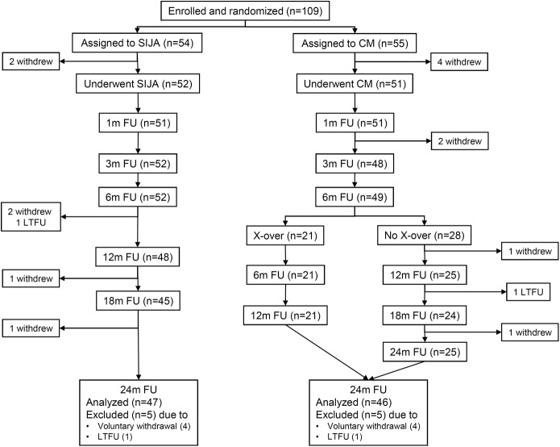
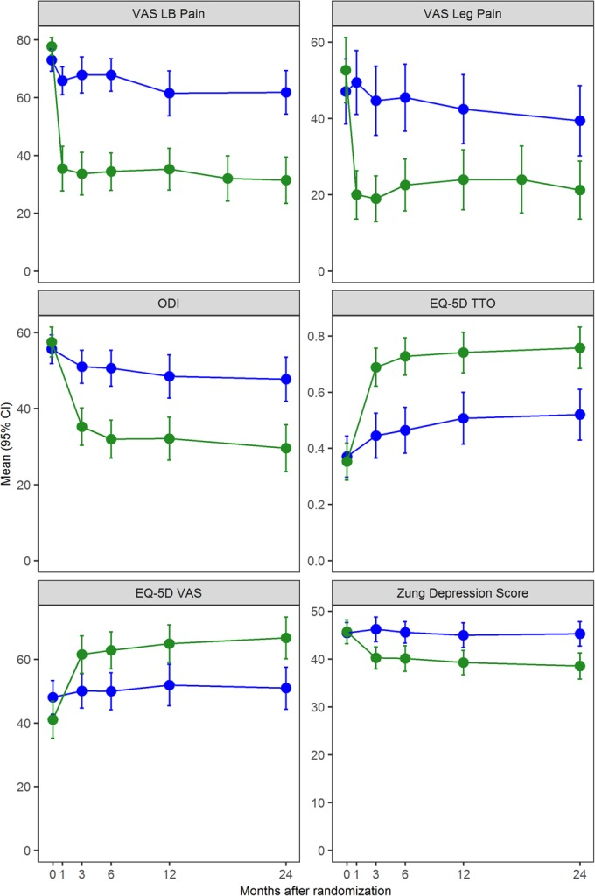
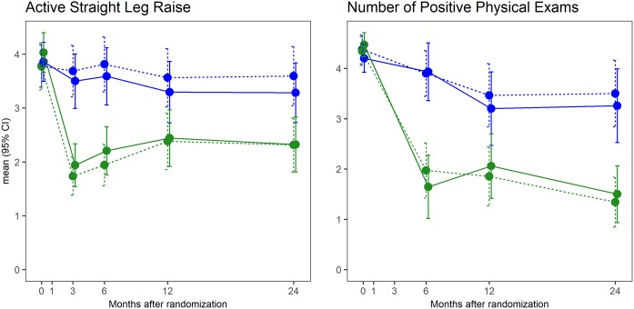
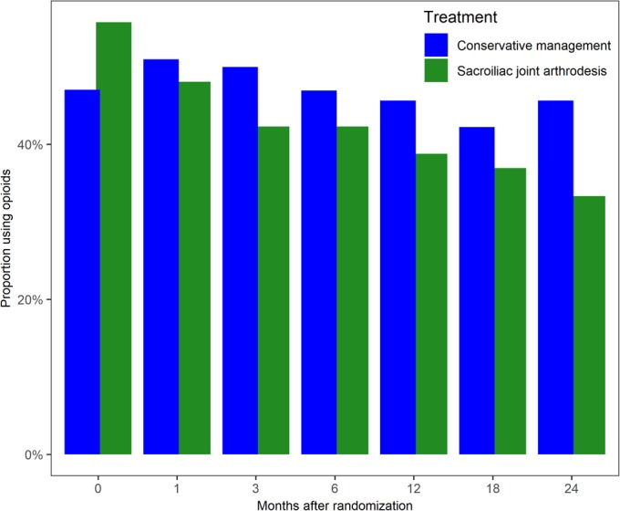
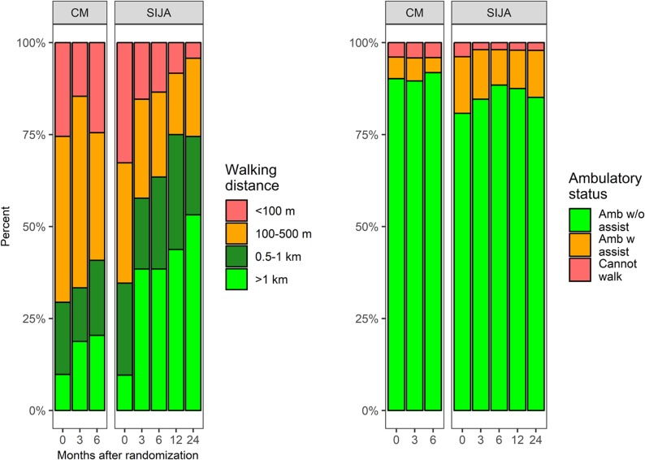
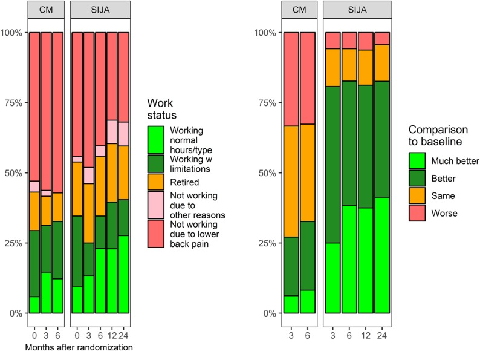
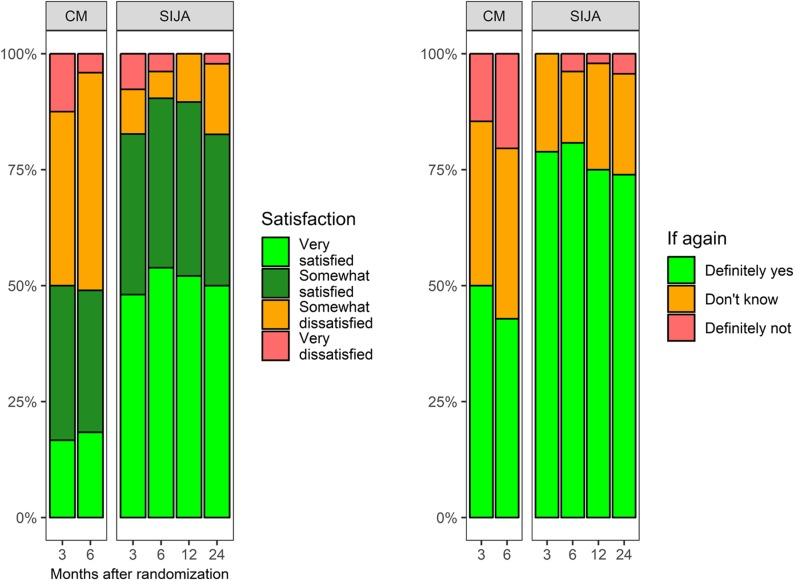
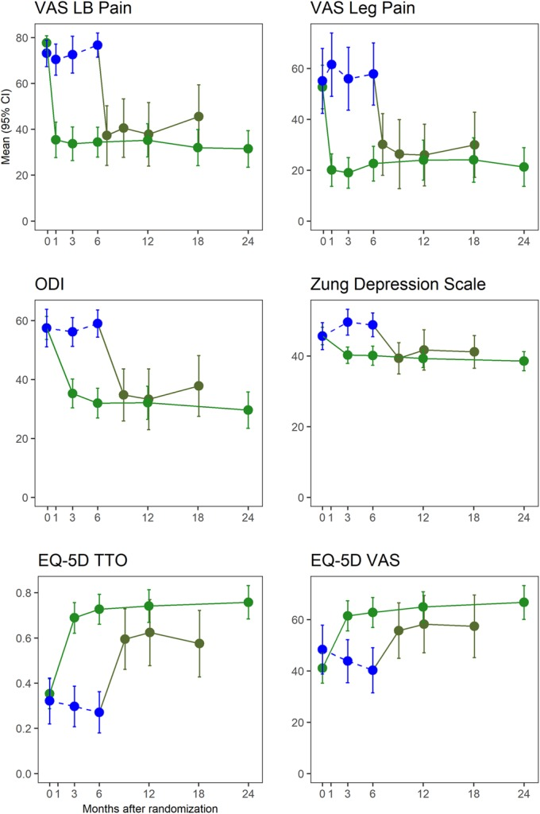
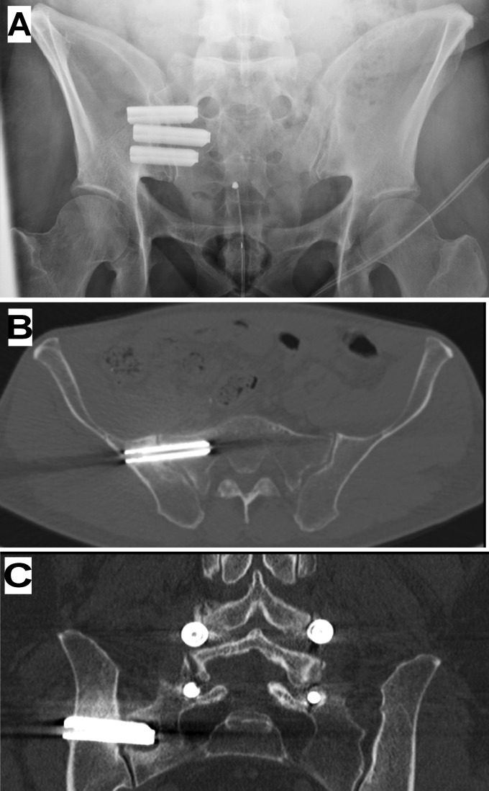
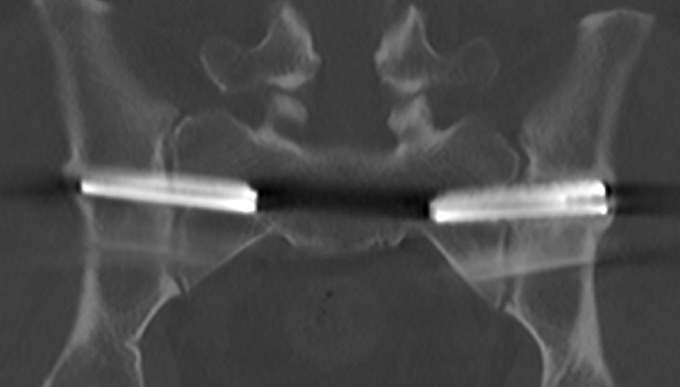

# Case Prep: Sacroiliac (SI) Joint Fusion

---

<!-- BEGIN CASE SNAPSHOT -->

## Case / Approach Snapshot

- **Anatomy at risk:** level localization, cord/cauda equina, exiting and traversing roots, dura, vertebral artery or segmental vessels, esophagus/trachea/pleura/viscera by approach, and fusion/instrumentation landmarks.
- **Operative steps:** position and pad carefully, confirm level, expose the planned corridor, decompress neural elements, reconstruct or instrument when indicated, verify alignment/hardware, and close with attention to hematoma and wound risk; use the detailed operative sequence and approach notes below as the step-by-step source.
- **Rescue plans:** wrong level, durotomy, neurologic change, vertebral artery/visceral/pleural injury, graft or hardware problem, epidural hematoma, dysphagia/airway issue, and infection prevention/escalation.
- **Figures:** review [Figures, Imaging & Video](#figures-imaging--video) and the [Curated Image Set](#curated-image-set); embedded local figures should remain open-access, public-domain, or otherwise reusable with attribution.
- **Papers:** review [High-Yield Literature](#high-yield-literature) for seminal sources, modern reviews, and outcome data specific to this page.
- **Textbook cross-checks:** use [Textbook Cross-Checks](#textbook-cross-checks) and the [Source Crosswalk](../../resources/source-crosswalk.md) to cite copyrighted textbooks/atlases while summarizing in original words.

<!-- END CASE SNAPSHOT -->

## One-Liner
[Age]yo [M/F] with sacroiliac joint dysfunction (SI joint pain) refractory to conservative management planned for minimally invasive [lateral transiliac] SI joint fusion.

---

## Figures, Imaging & Video

**🎥 Operative video** — [search operative video on YouTube ▸](https://www.youtube.com/results?search_query=sacroiliac+joint+surgery) · [The Neurosurgical Atlas ▸](https://www.neurosurgicalatlas.com)

[Neurosurgical Atlas](https://www.neurosurgicalatlas.com) · [AO Surgery Reference](https://surgeryreference.aofoundation.org) · [Radiopaedia](https://radiopaedia.org/search?q=sacroiliac%20joint&scope=all) · [PubMed Central](https://www.ncbi.nlm.nih.gov/pmc/?term=sacroiliac+joint+fusion) — operative figures © linked; see [media-sources.md](../../resources/media-sources.md)

---

<!-- BEGIN TEXTBOOK CROSS-CHECKS -->

## Textbook Cross-Checks

- **Spine anatomy and biomechanics:** Benzel Spine; Textbook of Spinal Surgery; Surgical Anatomy and Techniques to the Spine — confirm levels, approach-side anatomy, neural/vascular structures at risk, alignment, stability, and fixation rationale.
- **Technique sequence:** Youmans and Winn; Benzel Spine; Greenberg — review positioning, localization, exposure, decompression, instrumentation, fusion/reconstruction, and closure in original language.
- **Complication rescue:** Benzel Spine; Greenberg; Youmans and Winn — cross-check durotomy, neurologic change, vascular injury, wrong-level prevention, infection, implant failure, and postoperative restrictions.
- **Copyright-safe use:** cite these sources as private cross-checks, then write the guide content in original words; do not re-host textbook pages, figures, tables, or board-review card material. See [Source Crosswalk & Copyright-Safe Use](../../resources/source-crosswalk.md).

<!-- END TEXTBOOK CROSS-CHECKS -->

<!-- BEGIN CURATED LITERATURE -->

## High-Yield Literature

- **Sacroiliac Joint Interventions** — Yang AJ. Physical medicine and rehabilitation clinics of North America 2022. [PubMed](https://pubmed.ncbi.nlm.nih.gov/35526971/)
- **Sacroiliac Joint Anatomy** — Roberts SL. Physical medicine and rehabilitation clinics of North America 2021. [PubMed](https://pubmed.ncbi.nlm.nih.gov/34593138/)
- **Sacroiliac joint dysfunction: anatomy, pathophysiology, differential diagnosis, and treatment approaches** — Waldman LE. Skeletal radiology 2025. [PubMed](https://pubmed.ncbi.nlm.nih.gov/39556269/)
- **Sacroiliac Joint Interventions** — Soto Quijano DA. Physical medicine and rehabilitation clinics of North America 2018. [PubMed](https://pubmed.ncbi.nlm.nih.gov/29173661/)
- **The sacroiliac joint: an overview of its anatomy, function and potential clinical implications** — Vleeming A. Journal of anatomy 2012. [PubMed](https://pubmed.ncbi.nlm.nih.gov/22994881/)
- **Sacroiliac Joint: Mimics and Pitfalls** — Lowry MKJ. Seminars in musculoskeletal radiology 2025. [PubMed](https://pubmed.ncbi.nlm.nih.gov/40164078/)
- **Sacroiliac joint pain** — Dreyfuss P. The Journal of the American Academy of Orthopaedic Surgeons 2004. [PubMed](https://pubmed.ncbi.nlm.nih.gov/15473677/)
- **The Sacroiliac Joint** — Polly DW Jr. Neurosurgery clinics of North America 2017. [PubMed](https://pubmed.ncbi.nlm.nih.gov/28600004/)
- **Sacroiliac Joint Diagnostic Block and Radiofrequency Ablation Techniques** — Loh E. Physical medicine and rehabilitation clinics of North America 2021. [PubMed](https://pubmed.ncbi.nlm.nih.gov/34593139/)
- **The Sacroiliac Joint: A Current State-of-the-Art Review** — Polly DW Jr. JBJS reviews 2024. [PubMed](https://pubmed.ncbi.nlm.nih.gov/38315777/)

<!-- END CURATED LITERATURE -->

---

<!-- BEGIN CURATED IMAGE SET -->

## Curated Image Set

Open-access figures are embedded from PubMed Central articles and kept unique to this guide.

*Fig. 1. Patient flow. SIJA = sacroiliac joint arthrodesis, CM = conservative management, FU = follow-up, m = month, X-over = crossover, and LTFU = lost to FU. Source: [Randomized Trial of Sacroiliac Joint Arthrodesis Compared with Conservative Management for Chronic Low Back Pain Attributed to the Sacroiliac Joint](https://pmc.ncbi.nlm.nih.gov/articles/PMC6467578/) — The Journal of Bone and Joint Surgery. American Volume 2019; CC BY-NC-ND.*

*Fig. 2. Change in VAS low back (LB) pain, VAS leg pain, ODI, EQ-5D time trade-off (TTO), EQ-5D VAS, and Zung Depression Scale scores. Blue indicates the conservative management group, and green... Source: [Randomized Trial of Sacroiliac Joint Arthrodesis Compared with Conservative Management for Chronic Low Back Pain Attributed to the Sacroiliac Joint](https://pmc.ncbi.nlm.nih.gov/articles/PMC6467578/) — The Journal of Bone and Joint Surgery. American Volume 2019; CC BY-NC-ND.*

*Fig. 3. Change in functional test (active straight leg raise test) by treatment and time (left) and the number of positive physical examination signs (right). Blue indicates the conservative... Source: [Randomized Trial of Sacroiliac Joint Arthrodesis Compared with Conservative Management for Chronic Low Back Pain Attributed to the Sacroiliac Joint](https://pmc.ncbi.nlm.nih.gov/articles/PMC6467578/) — The Journal of Bone and Joint Surgery. American Volume 2019; CC BY-NC-ND.*

*Fig. 4. Proportion of subjects reporting opioid use in the past 2 weeks by treatment and study visit. Blue indicates the conservative management (CM) group, and green indicates the sacroiliac... Source: [Randomized Trial of Sacroiliac Joint Arthrodesis Compared with Conservative Management for Chronic Low Back Pain Attributed to the Sacroiliac Joint](https://pmc.ncbi.nlm.nih.gov/articles/PMC6467578/) — The Journal of Bone and Joint Surgery. American Volume 2019; CC BY-NC-ND.*

*Fig. 5-A. Change in walking distance and ambulatory status. Source: [Randomized Trial of Sacroiliac Joint Arthrodesis Compared with Conservative Management for Chronic Low Back Pain Attributed to the Sacroiliac Joint](https://pmc.ncbi.nlm.nih.gov/articles/PMC6467578/) — The Journal of Bone and Joint Surgery. American Volume 2019; CC BY-NC-ND.*

*Fig. 5-B. Change in work status and comparison with baseline. Source: [Randomized Trial of Sacroiliac Joint Arthrodesis Compared with Conservative Management for Chronic Low Back Pain Attributed to the Sacroiliac Joint](https://pmc.ncbi.nlm.nih.gov/articles/PMC6467578/) — The Journal of Bone and Joint Surgery. American Volume 2019; CC BY-NC-ND.*

*Fig. 5-C. Change in satisfaction and desirability of having a surgical procedure again by treatment and follow-up visit. Source: [Randomized Trial of Sacroiliac Joint Arthrodesis Compared with Conservative Management for Chronic Low Back Pain Attributed to the Sacroiliac Joint](https://pmc.ncbi.nlm.nih.gov/articles/PMC6467578/) — The Journal of Bone and Joint Surgery. American Volume 2019; CC BY-NC-ND.*

*Fig. 6. Change in VAS low back (LB) pain, VAS leg pain, ODI, Zung Depression Scale, EQ-5D time trade-off (TTO), and EQ-5D VAS scores including subjects who crossed over from conservative... Source: [Randomized Trial of Sacroiliac Joint Arthrodesis Compared with Conservative Management for Chronic Low Back Pain Attributed to the Sacroiliac Joint](https://pmc.ncbi.nlm.nih.gov/articles/PMC6467578/) — The Journal of Bone and Joint Surgery. American Volume 2019; CC BY-NC-ND.*

*Fig. 7. Imaging of typical configuration of implants. Fig. 7-A Inlet-view pelvic radiograph. Fig. 7-B A 12-month CT image from a different subject showing no radiolucencies around the first... Source: [Randomized Trial of Sacroiliac Joint Arthrodesis Compared with Conservative Management for Chronic Low Back Pain Attributed to the Sacroiliac Joint](https://pmc.ncbi.nlm.nih.gov/articles/PMC6467578/) — The Journal of Bone and Joint Surgery. American Volume 2019; CC BY-NC-ND.*

*Fig. 8. A 12-month CT image depicting bilateral implants with bone apposition along the entire length of the superior and inferior sides of both implants. Also, there is bone overgrowth at the... Source: [Randomized Trial of Sacroiliac Joint Arthrodesis Compared with Conservative Management for Chronic Low Back Pain Attributed to the Sacroiliac Joint](https://pmc.ncbi.nlm.nih.gov/articles/PMC6467578/) — The Journal of Bone and Joint Surgery. American Volume 2019; CC BY-NC-ND.*

<!-- END CURATED IMAGE SET -->

---

## History of Present Illness
- Chief complaint: **Unilateral low back/buttock pain below L5**, often radiating to posterior thigh/groin, worse with sitting-to-standing, stairs, single-leg loading
- **Fortin finger sign** (points to PSIS), pain over the SI joint
- Failed conservative management (PT, NSAIDs, SI joint injections)
- Etiology: degenerative, post-lumbar fusion (adjacent SI stress), post-partum, trauma

---

## Past Medical History
- Prior lumbar fusion (accelerates SI degeneration), inflammatory arthropathy (sacroiliitis — different management), prior pelvic trauma
- Standard PMH

---

## Imaging Review
### Diagnostic Workup (key — confirm the SI joint is the pain source)
- **Image-guided SI joint anesthetic injection(s)** providing significant temporary relief (>50-75%) — strongly supports diagnosis and surgical candidacy
- Physical exam provocative tests (≥3 positive: thigh thrust, FABER, distraction, compression, Gaenslen)
### CT / X-ray
- SI joint degeneration, anatomy for implant trajectory, exclude other pathology, sacral dysmorphism
### MRI lumbar
- Exclude lumbar source (rule out concurrent stenosis/radiculopathy mimicking)

---

## Labs
- CBC, BMP, Coags, type and screen

---

## Neurological Examination
- Lower extremity exam (typically normal — distinguishes from radiculopathy), SI provocative tests, gait

---

## Surgical Planning

### Diagnosis & Indication
- Indication: SI joint pain confirmed by exam + **diagnostic injection relief**, refractory to ≥6 months conservative care
- Goals: fuse/stabilize the SI joint with implants placed across the joint

### Position
- Lateral or prone (per system), fluoroscopy (inlet/outlet/lateral pelvis), padded

### Key Surgical Steps (MIS Lateral Transiliac)
1. Fluoroscopic localization (true lateral, inlet, outlet pelvic views)
2. Small lateral buttock incision over the ilium
3. **Guide pin across the ilium, through the SI joint, into the sacrum** under fluoroscopy — **stay within bone, avoid the sacral foramina/canal and the sciatic notch**; confirm trajectory on all views
4. Sequential drilling/broaching across the joint
5. **Place implants (triangular titanium rods / screws / threaded implants)** across the SI joint (typically 2-3) for stabilization/fusion
6. Confirm implant position on inlet/outlet/lateral fluoroscopy (within sacral bone, not in foramina/canal)
7. Closure

### Critical Anatomy & Structures at Risk
1. **Sacral nerve roots (S1, S2)** in the foramina — implant too anterior/medial breaches foramen
2. **L5 nerve root** (anterior to sacral ala)
3. **Sacral canal / cauda** (too medial), **sciatic notch / superior gluteal vessels** (too inferior/posterior)
4. SI joint, iliac vessels (anterior breach)

### Equipment
- SI fusion implant system (triangular implants/screws + instruments), **fluoroscopy (essential)** ± navigation/robotics
- Neuromonitoring (selected)

### Monitoring
- Triggered EMG (selected — confirm implants not breaching foramina)

### Anesthesia
- General; fluoroscopy; standard

### Potential Complications
1. **Sacral nerve root injury** (foraminal breach), L5 injury
2. Implant malposition, vascular injury (notch/anterior breach)
3. Nonunion/persistent pain (patient selection critical), implant loosening
4. Wound issues, nerve irritation

---

## Operative Note Template
**Preoperative Diagnosis:** [Right/Left] sacroiliac joint dysfunction (confirmed by diagnostic injection), refractory to conservative care

**Postoperative Diagnosis:** Same

**Procedure:** Minimally invasive [right/left] sacroiliac joint fusion with [N] [triangular titanium] implants

**Surgeon / Assistant:**
**Anesthesia:** General endotracheal
**EBL / Fluids:**
**Adjuncts:** Fluoroscopy (inlet/outlet/lateral) [± navigation]; [triggered EMG]
**Implants:** [N] SI fusion implants [triangular titanium]
**Complications:** None

**Indications:** [Age]yo [M/F] with SI joint pain confirmed by exam and >[50–75]% relief from image-guided SI injection, refractory to ≥6 months of conservative care. Risks (sacral nerve injury, malposition) discussed.

**Description of Procedure:** After consent and time-out, general anesthesia was induced and the patient positioned [lateral/prone] with fluoroscopy. True lateral, inlet, and outlet pelvic views were obtained. A small lateral buttock incision was made over the ilium, and a guide pin advanced **across the ilium, through the SI joint, into the sacrum — staying within bone and avoiding the sacral foramina, canal, and sciatic notch**, confirmed on all views.

The trajectory was drilled/broached and [N] implants placed across the joint for stabilization/fusion. Final inlet/outlet/lateral fluoroscopy confirmed the implants were within sacral bone and clear of the foramina/canal. [Triggered EMG confirmed no foraminal breach.]

Closure was performed. The patient was discharged [same day] with protected weight-bearing on the operative side.

---

## Postoperative Plan
- Outpatient/short stay, neuro checks (sacral roots)
- **Protected weight-bearing** per surgeon (often partial on operative side x weeks)
- X-ray/CT postop (implant position), pain assessment
- Activity progression, PT; follow-up for fusion
- Counsel: outcomes depend on correct patient selection (confirmed SI source)
