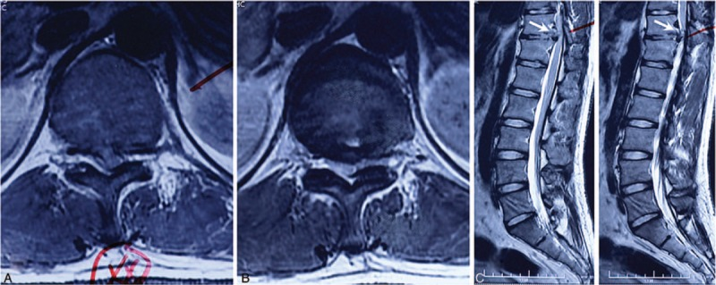
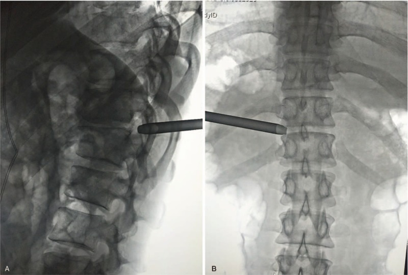
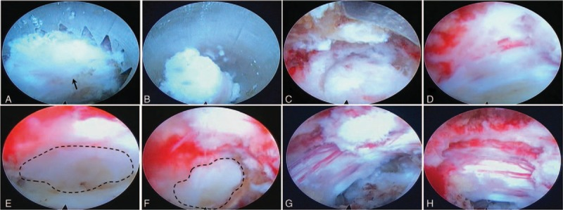
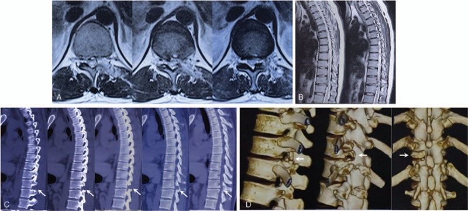
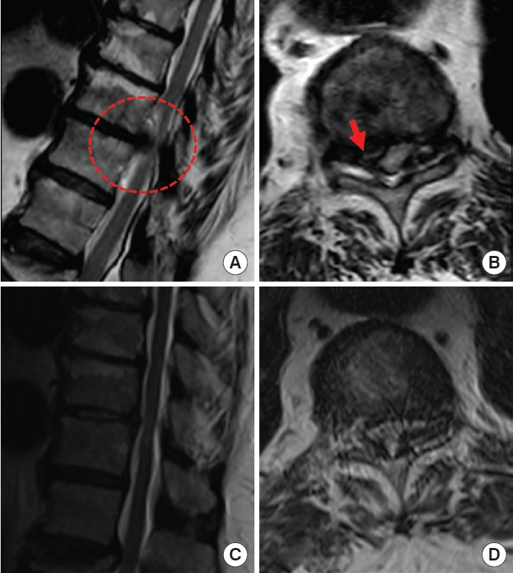
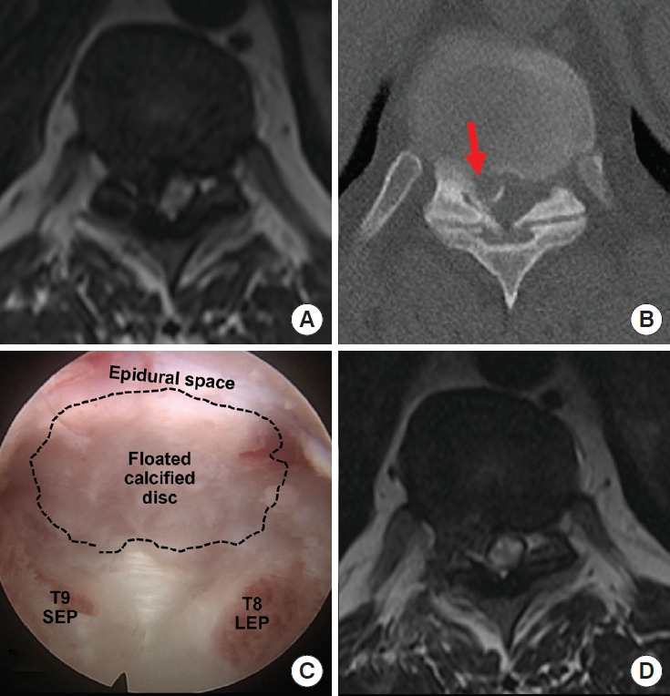
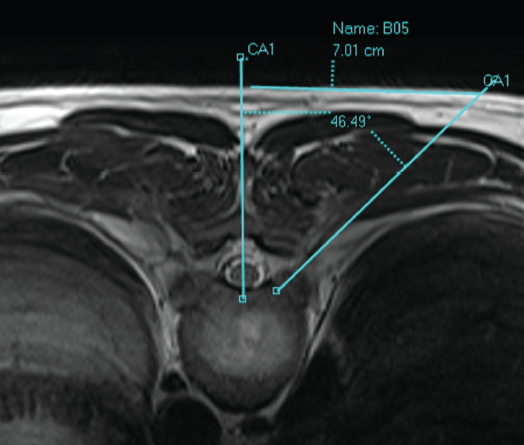
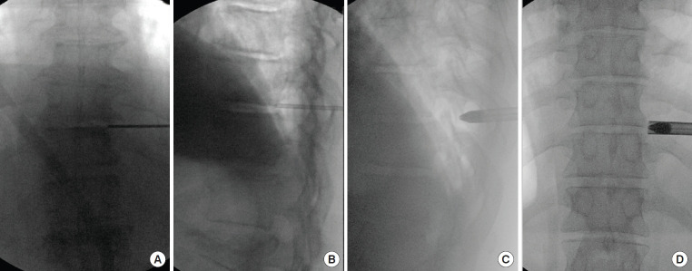
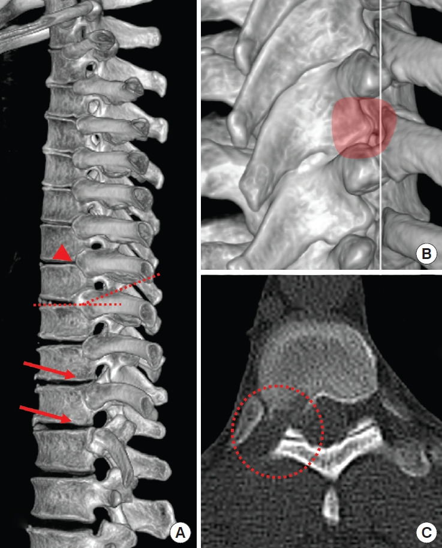
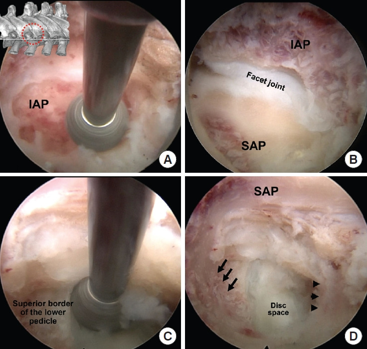

# Case Prep: Thoracic Discectomy (Transpedicular / Costotransversectomy / Lateral Extracavitary / Thoracoscopic)

<!-- BEGIN CASE SNAPSHOT -->

## Case / Approach Snapshot

- **Anatomy at risk:** level localization, cord/cauda equina, exiting and traversing roots, dura, vertebral artery or segmental vessels, esophagus/trachea/pleura/viscera by approach, and fusion/instrumentation landmarks.
- **Operative steps:** position and pad carefully, confirm level, expose the planned corridor, decompress neural elements, reconstruct or instrument when indicated, verify alignment/hardware, and close with attention to hematoma and wound risk; use the detailed operative sequence and approach notes below as the step-by-step source.
- **Rescue plans:** wrong level, durotomy, neurologic change, vertebral artery/visceral/pleural injury, graft or hardware problem, epidural hematoma, dysphagia/airway issue, and infection prevention/escalation.
- **Figures:** review [Figures, Imaging & Video](#figures-imaging--video) and the [Curated Image Set](#curated-image-set); embedded local figures should remain open-access, public-domain, or otherwise reusable with attribution.
- **Papers:** review [High-Yield Literature](#high-yield-literature) for seminal sources, modern reviews, and outcome data specific to this page.

<!-- END CASE SNAPSHOT -->

## One-Liner
[Age]yo [M/F] with a [central/paracentral, soft/calcified] [T_-T_] thoracic disc herniation causing [myelopathy / thoracic radiculopathy / band-like pain] planned for [transpedicular / costotransversectomy / lateral extracavitary / mini-open lateral / thoracoscopic] discectomy.

---

## Figures, Imaging & Video

**🎥 Operative video** — [search operative video on YouTube ▸](https://www.youtube.com/results?search_query=thoracic+disc+herniation+surgery) · [The Neurosurgical Atlas ▸](https://www.neurosurgicalatlas.com)

> 🧭 **Operative approach:** [Transthoracic approach](../approaches/transthoracic-approach.md) — detailed corridor setup, step-by-step technique & figures

[Neurosurgical Atlas](https://www.neurosurgicalatlas.com) · [AO Spine / Surgery Reference](https://www.aofoundation.org/spine) · [Radiopaedia](https://radiopaedia.org/search?q=thoracic%20disc%20herniation&scope=all) · [PubMed Central](https://www.ncbi.nlm.nih.gov/pmc/?term=thoracic+discectomy+transpedicular) — operative figures © linked; see [media-sources.md](../../resources/media-sources.md)

---

<!-- BEGIN CURATED LITERATURE -->

## High-Yield Literature

- **Full Endoscopic Transforaminal Thoracic Discectomy Operative Technique** — Barber SM. Journal of visualized experiments : JoVE 2024. [PubMed](https://pubmed.ncbi.nlm.nih.gov/38284530/)
- **Transforaminal endoscopic thoracic discectomy: surgical technique** — Telfeian AE. Journal of spine surgery (Hong Kong) 2023. [PubMed](https://pubmed.ncbi.nlm.nih.gov/37435321/)
- **Mini-open lateral retropleural thoracic discectomy approach** — Uribe JS. Neurosurgical focus: Video 2022. [PubMed](https://pubmed.ncbi.nlm.nih.gov/36284725/)
- **Anterior Versus Posterior Thoracic Discectomy: A Systematic Review** — Hurley ET. Spine 2017. [PubMed](https://pubmed.ncbi.nlm.nih.gov/28422798/)
- **Uniportal, Transforaminal Endoscopic Thoracic Discectomy: Review and Technical Note** — Lee SH. Neurospine 2023. [PubMed](https://pubmed.ncbi.nlm.nih.gov/37016850/)
- **Percutaneous endoscopic thoracic discectomy** — Regan JJ. Neurosurgery clinics of North America 1996. [PubMed](https://pubmed.ncbi.nlm.nih.gov/8835149/)
- **Surgical efficacy of minimally invasive thoracic discectomy** — Elhadi AM. Journal of clinical neuroscience : official journal of the Neurosurgical Society of Australasia 2015. [PubMed](https://pubmed.ncbi.nlm.nih.gov/26206758/)
- **Retropleural Thoracic Approach** — Wewel JT. Neurosurgery clinics of North America 2020. [PubMed](https://pubmed.ncbi.nlm.nih.gov/31739928/)
- **Thoracic discectomy and plating** — Hsieh PC. Neurosurgical focus 2011. [PubMed](https://pubmed.ncbi.nlm.nih.gov/21456927/)
- **Endoscopic Versus Traditional Thoracic Discectomy: A Multicenter Retrospective Case Series and Meta-Analysis** — Sofoluke N. Neurosurgery 2025. [PubMed](https://pubmed.ncbi.nlm.nih.gov/38899868/)

<!-- END CURATED LITERATURE -->

<!-- BEGIN CURATED IMAGE SET -->

## Curated Image Set

Open-access figures are embedded from PubMed Central articles and kept unique to this guide.

*Figure 1. Preoperation magnetic resonance imaging revealed disc herniation on T11-12. Horizontal view (A and B) displayed secondary thoracic stenosis induced by herniated disc fragment; sagittal... Source: [Percutaneous endoscopic thoracic discectomy via posterolateral approach](https://pmc.ncbi.nlm.nih.gov/articles/PMC6799733/) — Medicine 2019; CC BY.*

*Figure 2. Intraoperation C-arm fluoroscopy displayed the location of the reamer cannula. The LT view showed that the distal end of the reamer cannula was anchored upon the cortex of superior... Source: [Percutaneous endoscopic thoracic discectomy via posterolateral approach](https://pmc.ncbi.nlm.nih.gov/articles/PMC6799733/) — Medicine 2019; CC BY.*

*Figure 3. Intraoperation endoscopic views. After identifying the facet joint (A, arrow), the reamer was operated manually to remove the corresponding part of superior articular process (B). When... Source: [Percutaneous endoscopic thoracic discectomy via posterolateral approach](https://pmc.ncbi.nlm.nih.gov/articles/PMC6799733/) — Medicine 2019; CC BY.*

*Figure 4. Post-operation imaging revealed satisfying decompression on T11–12. Magnetic resonance imaging demonstrated restored spinal canal and postoperative change of the disc and laminar (A and... Source: [Percutaneous endoscopic thoracic discectomy via posterolateral approach](https://pmc.ncbi.nlm.nih.gov/articles/PMC6799733/) — Medicine 2019; CC BY.*

*Fig. 1.. A 72-year-old female with thoracic myelopathy. (A, B) Preoperative magnetic resonance imaging show right paracentral disc extrusion with spinal cord compression (the circle and arrow)... Source: [Uniportal, Transforaminal Endoscopic Thoracic Discectomy: Review and Technical Note](https://pmc.ncbi.nlm.nih.gov/articles/PMC10080421/) — Neurospine 2023; CC BY-NC.*

*Fig. 2.. A 36-year-old female with thoracic myelopathy. The preoperative magnetic resonance imaging (MRI) (A) and computed tomography (B) show severe spinal cord compression and intramedullary... Source: [Uniportal, Transforaminal Endoscopic Thoracic Discectomy: Review and Technical Note](https://pmc.ncbi.nlm.nih.gov/articles/PMC10080421/) — Neurospine 2023; CC BY-NC.*

*Fig. 3.. Axial magnetic resonance image demonstrates the location of portal (the entry of a discography needle) and access angle. The entry is located at around 5–8 cm from the midline, and the... Source: [Uniportal, Transforaminal Endoscopic Thoracic Discectomy: Review and Technical Note](https://pmc.ncbi.nlm.nih.gov/articles/PMC10080421/) — Neurospine 2023; CC BY-NC.*

*Fig. 4.. The initial discography needle and guide wide should touch the posterolateral corner of the intervertebral disc (A, B) on fluoroscopic images. (C, D) The obturator and working cannula is... Source: [Uniportal, Transforaminal Endoscopic Thoracic Discectomy: Review and Technical Note](https://pmc.ncbi.nlm.nih.gov/articles/PMC10080421/) — Neurospine 2023; CC BY-NC.*

*Fig. 5.. Computed tomography (CT) images demonstrate anatomical characteristics of the thoracic spine. (A) T10/11, T11/12 disc space is not covered by the corresponding rib heads (red arrows),... Source: [Uniportal, Transforaminal Endoscopic Thoracic Discectomy: Review and Technical Note](https://pmc.ncbi.nlm.nih.gov/articles/PMC10080421/) — Neurospine 2023; CC BY-NC.*

*Fig. 6.. Intraoperative pictures of sequential steps showing exposure of a right side T9/10 intervertebral foramen and intervertebral disc space. (A) After soft tissue removal, lateral aspect of... Source: [Uniportal, Transforaminal Endoscopic Thoracic Discectomy: Review and Technical Note](https://pmc.ncbi.nlm.nih.gov/articles/PMC10080421/) — Neurospine 2023; CC BY-NC.*

<!-- END CURATED IMAGE SET -->

---

## History of Present Illness
- Chief complaint: Myelopathy (gait, lower extremity weakness/numbness, bowel/bladder), band-like thoracic/radicular pain, sensory level
- **Thoracic disc herniations are uncommon; calcified/central ones are dangerous** (cord compression, narrow canal, tenuous blood supply)
- Failed conservative management; progressive myelopathy = surgical
- Calcified vs soft, central vs lateral (determines approach)

---

## Past Medical History
- Pulmonary status (anterior/thoracoscopic approaches), prior thoracic surgery
- Standard PMH

---

## Imaging Review
### MRI Thoracic
- Disc level, **central vs paracentral vs lateral**, cord compression/signal change, canal compromise
### CT / CT myelogram
- **Calcification** (calcified discs are adherent to dura — higher risk, may have intradural extension/dural defect), bony anatomy, rib/pedicle landmarks
- **Level localization is notoriously difficult in the thoracic spine** — count from C2 and sacrum, mark with reference (rib, fiducial), confirm intraop
### X-ray (localization)

---

## Labs
- CBC, BMP, Coags, type and crossmatch

---

## Neurological Examination
- Lower extremity motor/sensory (sensory level), reflexes (hyperreflexia/Babinski — myelopathy), gait, sphincter, abdominal reflexes

---

## Surgical Planning

### Case Logistics, OR Needs & Orders
- **OR table/bed:** radiolucent table configured for lateral or anterior thoracic exposure, with C-arm access and chest/vascular exposure needs coordinated before positioning.
- **OR setup:** radiolucent/Jackson table, fluoroscopy or O-arm/navigation, microscope/loupes for decompression, implant trays/graft ready for fusion, neuromonitoring for myelopathy/cord-risk cases, and postop brace plan confirmed.
- **Special needs:** arterial line/Foley/type-screen for long fusion/corpectomy, no long paralytic when MEPs are used, MAP/normotension for myelopathy or cord-risk cases, antibiotic redosing, and anticoagulation/DVT plan.
- **Immediate postop orders:** neuro checks by myotome/sensory level, airway/dysphagia watch for anterior cervical cases, CT/X-rays per construct, drain care, brace/activity orders, DVT prophylaxis timing, bowel regimen, and PT/OT mobilization.

### Approach Selection (NEVER a standard posterior laminectomy for central disc — cord retraction is catastrophic)
- **Transpedicular:** posterolateral, for lateral/paracentral soft discs; remove pedicle for access
- **Costotransversectomy:** posterolateral, more ventral access (remove transverse process + rib head)
- **Lateral extracavitary:** wide posterolateral, good ventral access without thoracotomy
- **Anterior transthoracic / thoracoscopic:** best for central calcified discs (direct ventral access, no cord manipulation) — needs thoracic access/lung deflation
- **Principle: access the disc from the side/front, decompress the cord WITHOUT retracting it**

### Position
- **OR table/bed:** radiolucent table configured for lateral or anterior thoracic exposure, with C-arm access and chest/vascular exposure needs coordinated before positioning.
- Posterolateral approaches: prone; Anterior/thoracoscopic: lateral decubitus (lung deflation, double-lumen tube)
- Mayfield/foam, IONM baseline

### Key Surgical Steps (Transpedicular/Costotransversectomy example)
1. **Meticulous level localization** (fluoroscopy, count from both ends, confirm rib/pedicle); wrong-level thoracic surgery is a notorious error
2. Posterolateral exposure; remove facet/pedicle (± transverse process and rib head for costotransversectomy)
3. Reach the disc space ventrolateral to the thecal sac
4. **Create a cavity in the vertebral body/disc space, then push the disc fragment AWAY from the cord into the cavity** (down-and-away — never toward the cord)
5. For **calcified/transdural** disc: work carefully; if dura is breached/adherent, may leave a calcified shell adherent to dura or repair the dural defect (CSF leak risk)
6. Confirm cord decompression (thecal sac re-expands)
7. ± **Instrumented fusion** (if significant bone/facet/pedicle removed or instability)
8. Closure (chest tube if transthoracic/thoracoscopic)

### Critical Anatomy & Structures at Risk
1. **Spinal cord** — **do NOT retract** (thoracic cord watershed blood supply, low tolerance); work ventral, push fragment away
2. **Artery of Adamkiewicz / segmental arteries** (T8-L1, usually left) — cord infarction
3. **Dura** (calcified disc adherence — CSF leak, intradural fragment)
4. **Pleura/lung** (anterior/lateral), thoracic duct, great vessels (anterior)
5. Nerve roots (sacrificable in thoracic for access if needed)

### Equipment
- Microscope, high-speed drill, navigation/fluoroscopy
- Down-pushing curettes/instruments, Kerrison, fusion instrumentation
- Thoracoscopic set / thoracic access (anterior), chest tube, dural repair materials

### Monitoring
- **SSEPs, MEPs** (essential — cord at high risk), EMG

### Anesthesia
- **Double-lumen tube/lung isolation** (anterior/thoracoscopic), MAP support, arterial line, no paralytic (IONM), crossmatched blood

### Potential Complications
1. **Spinal cord injury/infarction** (retraction, vascular) — paraplegia
2. **Wrong-level surgery** (localization)
3. **CSF leak** (calcified transdural disc), pleural injury/effusion/pneumothorax
4. Instability (if extensive bone removal), pulmonary complications, incomplete decompression

---

## Operative Note Template
**Preoperative Diagnosis:** [T_-T_] thoracic disc herniation ([central/calcified]) with [myelopathy/radiculopathy]

**Postoperative Diagnosis:** Same

**Procedure:** [Transpedicular / costotransversectomy / lateral extracavitary / transthoracic / thoracoscopic] thoracic discectomy at [T_-T_] [with instrumented fusion]

**Surgeon / Assistant:**
**Anesthesia:** General endotracheal [double-lumen tube for anterior/thoracoscopic]
**EBL / Fluids / Blood products:** [crossmatched]
**Adjuncts:** Fluoroscopy/navigation, microscope, high-speed drill; SSEP/MEP; MAP support
**Implants:** [Fusion hardware if used]; [chest tube if transthoracic]
**Complications:** None

**Indications:** [Age]yo [M/F] with a [central/calcified] thoracic disc at [T_-T_] causing [myelopathy/band pain], where ventral decompression without cord retraction is required. Risks (cord injury, wrong-level, CSF leak, pleural injury) discussed.

**Description of Procedure:** After consent and time-out, general anesthesia was induced and neuromonitoring established. **Meticulous fluoroscopic level localization** was performed (counting from both ends). The patient was positioned [prone for posterolateral / lateral decubitus with lung deflation for anterior]. A [transpedicular/costotransversectomy/transthoracic] corridor was developed to reach the disc ventrolateral to the cord.

A cavity was created in the disc/body and **the disc fragment was pushed away from the cord into the cavity (down-and-away — no cord retraction)**; [the calcified/transdural component was carefully addressed, with dural repair as needed]. Cord decompression was confirmed (thecal sac re-expanded). [Instrumented fusion was performed for the bone removed.] Neuromonitoring remained stable.

[A chest tube was placed for the transthoracic approach.] Closure was performed in layers. The patient was transferred with serial neuro exams [and CXR/chest-tube management].

---

## Postoperative Plan
- ICU/step-down, neuro checks q1h (lower extremity, sensory level, sphincter), MAP support
- **Chest X-ray / chest tube management** (anterior/thoracoscopic — pneumothorax/effusion)
- CSF leak precautions (if dural breach), MRI/CT postop
- DVT prophylaxis (mechanical), pulmonary toilet, pain control
- Follow-up imaging; rehab

<!-- BEGIN CHIEF LEVEL TAKEAWAYS -->

## Chief-Level Case Review

Use these as the senior-level mental model for **Thoracic Discectomy (Transpedicular / Costotransversectomy / Lateral Extracavitary / Thoracoscopic)**:

- **Decision point:** Localize twice and instrument once: numbering, transitional anatomy, prior hardware, rib count, navigation dataset, and fluoroscopic level confirmation are mandatory.
- **Technical lever:** Positioning is treatment: table choice, abdomen-free prone setup, alignment goals, shoulders/hips, eyes/plexus pressure, neuromonitoring baselines, and fluoroscopic access all change the case.
- **Bailout:** Protect neural elements by sequence: decompression before correction when needed, MAP support for cord risk, no long paralytic with MEPs, and immediate response to signal change.
- **Postop watch:** Finish with construct logic: decompression adequacy, screw purchase, alignment, fusion bed/graft, drain plan, brace/activity orders, postop CT/X-rays, and DVT timing.

<!-- END CHIEF LEVEL TAKEAWAYS -->

<!-- BEGIN COMMON PIMP QUESTIONS -->

## Common Pimp Questions

Use these to pressure-test preparation for **Thoracic Discectomy (Transpedicular / Costotransversectomy / Lateral Extracavitary / Thoracoscopic)**:

1. What neurologic level and root are responsible for the presenting deficit?
2. What is the decompression target and how will you know it is adequately decompressed?
3. What instability, deformity, bone-quality, or fusion variable changes the construct?
4. What vascular, visceral, dural, or neural structure is the main structure at risk?
5. What postop brace, drain, mobilization, MAP, antibiotic, and DVT plan should be ordered?

<!-- END COMMON PIMP QUESTIONS -->

<!-- BEGIN ATTENDING PREFERENCE VARIABLES -->

## Attending Preference Variables

Items that commonly vary by surgeon or institution:

- **Positioning frame, arms, traction, and localization workflow:** [attending-specific]
- **Navigation/robot/fluoro use, screw system, graft/biologic choice, and drain threshold:** [attending-specific]
- **Neuromonitoring modality and MAP goal for myelopathy, deformity, or cord-risk cases:** [attending-specific]
- **Brace, Foley, antibiotics, mobilization, and DVT prophylaxis timing:** [attending-specific]

<!-- END ATTENDING PREFERENCE VARIABLES -->
