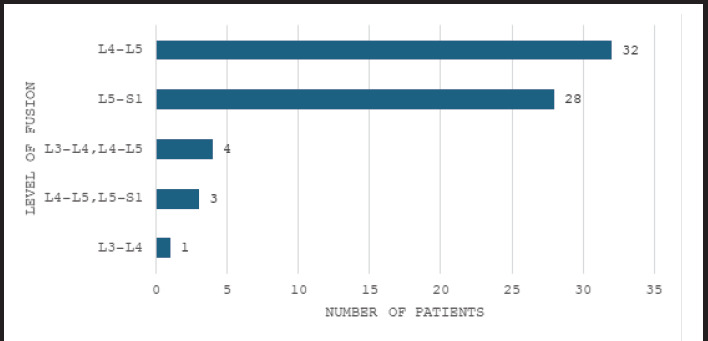
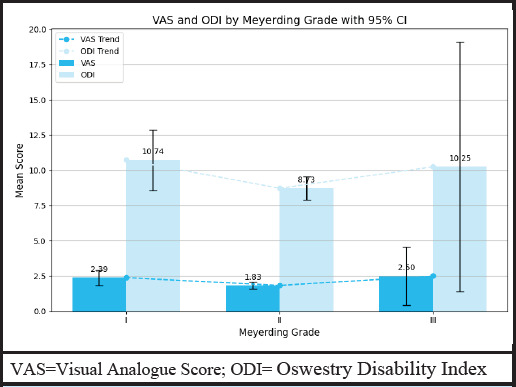
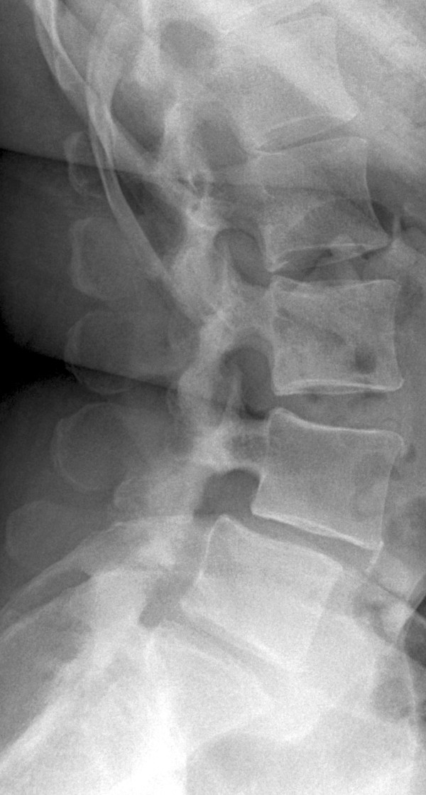
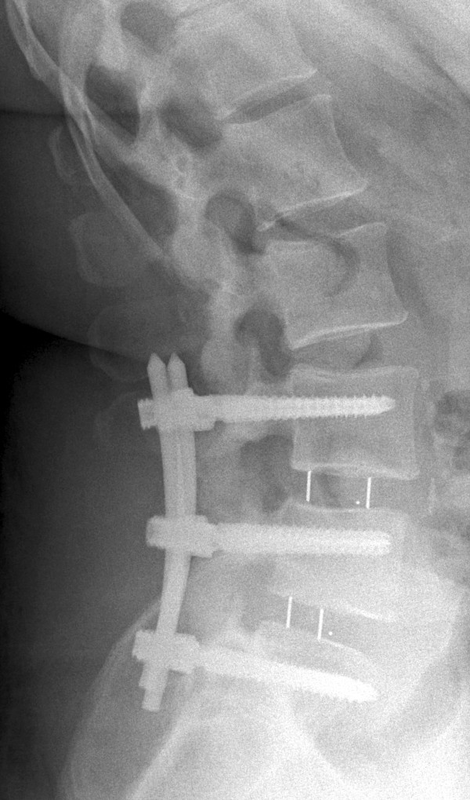
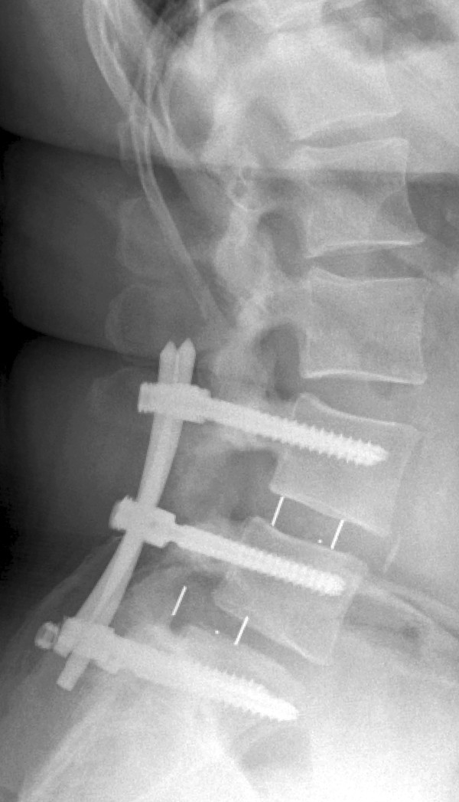
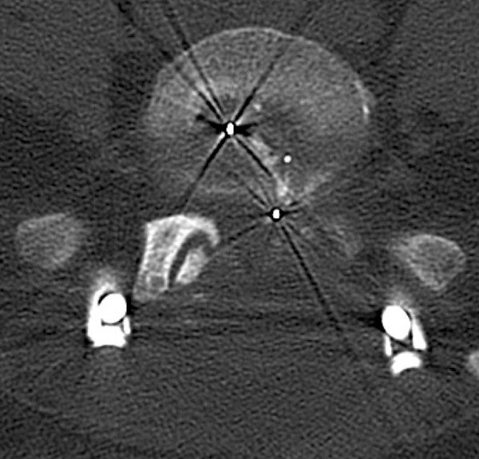
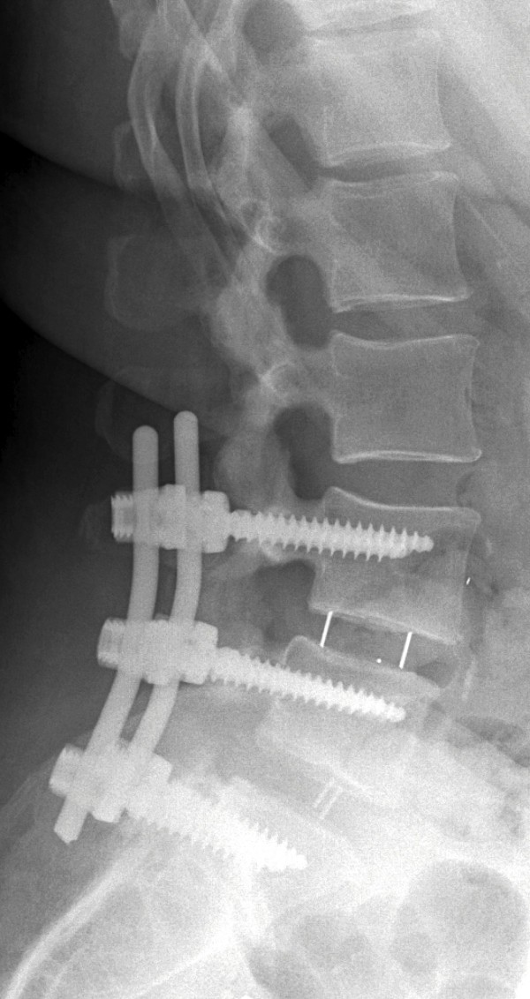
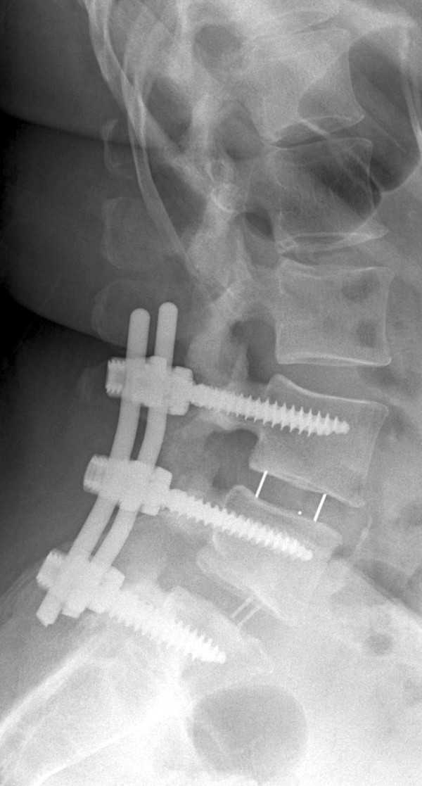
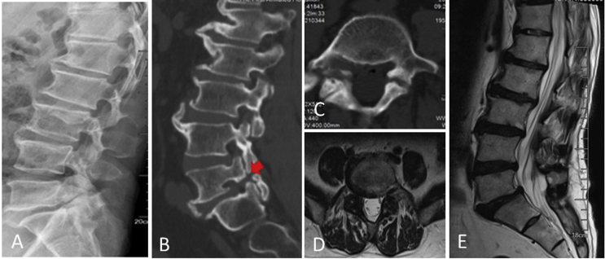
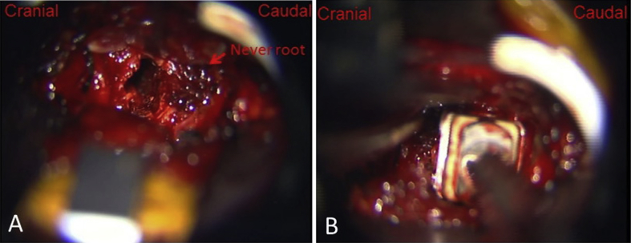

# Case Prep: Transforaminal Lumbar Interbody Fusion (TLIF)

---

<!-- BEGIN CASE SNAPSHOT -->

## Case / Approach Snapshot

- **Anatomy at risk:** level localization, cord/cauda equina, exiting and traversing roots, dura, vertebral artery or segmental vessels, esophagus/trachea/pleura/viscera by approach, and fusion/instrumentation landmarks.
- **Operative steps:** position and pad carefully, confirm level, expose the planned corridor, decompress neural elements, reconstruct or instrument when indicated, verify alignment/hardware, and close with attention to hematoma and wound risk; use the detailed operative sequence and approach notes below as the step-by-step source.
- **Rescue plans:** wrong level, durotomy, neurologic change, vertebral artery/visceral/pleural injury, graft or hardware problem, epidural hematoma, dysphagia/airway issue, and infection prevention/escalation.
- **Figures:** review [Figures, Imaging & Video](#figures-imaging--video) and the [Curated Image Set](#curated-image-set); embedded local figures should remain open-access, public-domain, or otherwise reusable with attribution.
- **Papers:** review [High-Yield Literature](#high-yield-literature) for seminal sources, modern reviews, and outcome data specific to this page.

<!-- END CASE SNAPSHOT -->

## One-Liner
[Age]yo [M/F] with [lumbar spondylolisthesis / recurrent disc herniation / degenerative disc disease / spinal stenosis] at [L_-S_] presenting with [back pain/radiculopathy/neurogenic claudication] planned for [minimally invasive / open] L_-S_ TLIF with pedicle screw fixation.

---

## Figures, Imaging & Video

**🎥 Operative video** — [search operative video on YouTube ▸](https://www.youtube.com/results?search_query=lumbar+spondylolisthesis+surgery) · [The Neurosurgical Atlas ▸](https://www.neurosurgicalatlas.com)

> 🧭 **Operative approach:** [Posterior thoracolumbar approach](../approaches/posterior-thoracolumbar-approach.md) — detailed corridor setup, step-by-step technique & figures

[Neurosurgical Atlas](https://www.neurosurgicalatlas.com) · [AO Surgery Reference](https://surgeryreference.aofoundation.org) · [Radiopaedia](https://radiopaedia.org/search?q=lumbar%20spondylolisthesis&scope=all) · [PubMed Central](https://www.ncbi.nlm.nih.gov/pmc/?term=transforaminal+lumbar+interbody+fusion) — operative figures © linked; see [media-sources.md](../../resources/media-sources.md)

---

<!-- BEGIN COMMON PIMP QUESTIONS -->

## Common Pimp Questions

Use these to pressure-test preparation for **Transforaminal Lumbar Interbody Fusion (TLIF)**:

1. What neurologic level and root are responsible for the presenting deficit?
2. What is the decompression target and how will you know it is adequately decompressed?
3. What instability, deformity, bone-quality, or fusion variable changes the construct?
4. What vascular, visceral, dural, or neural structure is the main structure at risk?
5. What postop brace, drain, mobilization, MAP, antibiotic, and DVT plan should be ordered?

<!-- END COMMON PIMP QUESTIONS -->

<!-- BEGIN ATTENDING PREFERENCE VARIABLES -->

## Attending Preference Variables

Items that commonly vary by surgeon or institution:

- **Positioning frame, arms, traction, and localization workflow:** [attending-specific]
- **Navigation/robot/fluoro use, screw system, graft/biologic choice, and drain threshold:** [attending-specific]
- **Neuromonitoring modality and MAP goal for myelopathy, deformity, or cord-risk cases:** [attending-specific]
- **Brace, Foley, antibiotics, mobilization, and DVT prophylaxis timing:** [attending-specific]

<!-- END ATTENDING PREFERENCE VARIABLES -->

<!-- BEGIN CURATED LITERATURE -->

## High-Yield Literature

- **Lumbar interbody fusion: techniques, indications and comparison of interbody fusion options including PLIF, TLIF, MI-TLIF, OLIF/ATP, LLIF and ALIF** — Mobbs RJ. Journal of spine surgery (Hong Kong) 2015. [PubMed](https://pubmed.ncbi.nlm.nih.gov/27683674/)
- **Endoscopic transforaminal lumbar interbody fusion: a comprehensive review** — Ahn Y. Expert review of medical devices 2019. [PubMed](https://pubmed.ncbi.nlm.nih.gov/31044627/)
- **Minimally Invasive Transforaminal Lumbar Interbody Fusion (TLIF)** — Badlani N. Clinical spine surgery 2020. [PubMed](https://pubmed.ncbi.nlm.nih.gov/31625956/)
- **Transforaminal lumbar interbody fusion using banana-shaped and straight cages: meta-analysis of clinical and radiological outcomes** — Sebaaly A. European spine journal : official publication of the European Spine Society, the European Spinal Deformity Society, and the European Section of the Cervical Spine Research Society 2023. [PubMed](https://pubmed.ncbi.nlm.nih.gov/37326836/)
- **Transforaminal Lumbar Interbody Fusion For Lumbar Degenerative Disease: Patient Selection And Perspectives** — Uçar BY. Orthopedic research and reviews 2019. [PubMed](https://pubmed.ncbi.nlm.nih.gov/31807090/)
- **Endoscopic transforaminal lumbar interbody fusion without general anesthesia: technical innovations and outcomes** — Kolcun JPG. Annals of translational medicine 2019. [PubMed](https://pubmed.ncbi.nlm.nih.gov/31624733/)
- **Expandable Cage Technology-Transforaminal, Anterior, and Lateral Lumbar Interbody Fusion** — Macki M. Operative neurosurgery (Hagerstown, Md.) 2021. [PubMed](https://pubmed.ncbi.nlm.nih.gov/34128070/)
- **Minimally Invasive Transforaminal Lumbar Interbody Fusion: Strategies for Creating Lordosis with a Posterior Approach** — Tanasansomboon T. Neurosurgery clinics of North America 2023. [PubMed](https://pubmed.ncbi.nlm.nih.gov/37718110/)
- **Bibliometric analysis of transforaminal lumbar interbody fusion: research status, trends, and future directions** — Wang X. EFORT open reviews 2023. [PubMed](https://pubmed.ncbi.nlm.nih.gov/38038386/)
- **Comparison of efficacy and safety between unilateral biportal endoscopic transforaminal lumbar interbody fusion versus uniportal endoscopic transforaminal lumbar interbody fusion for the treatment of lumbar degenerative diseases: a systematic review and meta-analysis** — Ding Y. BMC musculoskeletal disorders 2024. [PubMed](https://pubmed.ncbi.nlm.nih.gov/39702176/)

<!-- END CURATED LITERATURE -->

---

<!-- BEGIN CURATED IMAGE SET -->

## Curated Image Set

Open-access figures are embedded from PubMed Central articles and kept unique to this guide.

*Figure 1. Levels of fusion in patients with spondylolisthesis following transforaminal lumbar interbody fusion surgery (n= 68). Source: [Functional Outcome of Transforaminal Lumbar Interbody Fusion Surgery in Spondylolisthesis: An Observational Study](https://pmc.ncbi.nlm.nih.gov/articles/PMC12827865/) — JNMA: Journal of the Nepal Medical Association 2025; CC BY.*

*Figure 2. VAS and ODI by Meyerding grade with 95% CI in spondylolisthesis following transforaminal lumbar interbody fusion surgery (n= 68). Source: [Functional Outcome of Transforaminal Lumbar Interbody Fusion Surgery in Spondylolisthesis: An Observational Study](https://pmc.ncbi.nlm.nih.gov/articles/PMC12827865/) — JNMA: Journal of the Nepal Medical Association 2025; CC BY.*

*Figure 1. X-ray taken before the patient’s first surgery. Source: [Set screw fracture with cage dislocation after two-level transforaminal lumbar interbody fusion (TLIF): a case report](https://pmc.ncbi.nlm.nih.gov/articles/PMC4333885/) — Journal of Medical Case Reports 2015; CC BY.*

*Figure 2. X-ray obtained after the patient’s first surgery. Source: [Set screw fracture with cage dislocation after two-level transforaminal lumbar interbody fusion (TLIF): a case report](https://pmc.ncbi.nlm.nih.gov/articles/PMC4333885/) — Journal of Medical Case Reports 2015; CC BY.*

*Figure 3. X-ray taken at first follow-up examination. Source: [Set screw fracture with cage dislocation after two-level transforaminal lumbar interbody fusion (TLIF): a case report](https://pmc.ncbi.nlm.nih.gov/articles/PMC4333885/) — Journal of Medical Case Reports 2015; CC BY.*

*Figure 4. Computed tomographic scan taken at first follow-up examination. Source: [Set screw fracture with cage dislocation after two-level transforaminal lumbar interbody fusion (TLIF): a case report](https://pmc.ncbi.nlm.nih.gov/articles/PMC4333885/) — Journal of Medical Case Reports 2015; CC BY.*

*Figure 5. X-ray taken after the patient’s second surgery. Source: [Set screw fracture with cage dislocation after two-level transforaminal lumbar interbody fusion (TLIF): a case report](https://pmc.ncbi.nlm.nih.gov/articles/PMC4333885/) — Journal of Medical Case Reports 2015; CC BY.*

*Figure 6. X-ray taken at the patient’s second follow-up examination. Source: [Set screw fracture with cage dislocation after two-level transforaminal lumbar interbody fusion (TLIF): a case report](https://pmc.ncbi.nlm.nih.gov/articles/PMC4333885/) — Journal of Medical Case Reports 2015; CC BY.*

*Figure 1. Lateral (A) radiograph of a 59-year-old male with L5 isthmic spondylolisthesis. The sagittal view (B) and transverse views(C) of preoperative CT and MRI (D, E) showed isthmic... Source: [Comparison of O-arm navigation and microscope-assisted minimally invasive transforaminal lumbar interbody fusion and conventional transforaminal lumbar interbody fusion for the treatment of lumbar isthmic spondylolisthesis](https://pmc.ncbi.nlm.nih.gov/articles/PMC6939115/) — Journal of Orthopaedic Translation 2020; CC BY-NC-ND.*

*Figure 2. With the help of microscope, (A) the dural sac and nerve roots were exposed clearly; (B) the cage filled with bone fragments was inserted into the disc space. Source: [Comparison of O-arm navigation and microscope-assisted minimally invasive transforaminal lumbar interbody fusion and conventional transforaminal lumbar interbody fusion for the treatment of lumbar isthmic spondylolisthesis](https://pmc.ncbi.nlm.nih.gov/articles/PMC6939115/) — Journal of Orthopaedic Translation 2020; CC BY-NC-ND.*

<!-- END CURATED IMAGE SET -->

---

## History of Present Illness
- Chief complaint: Low back pain / radicular leg pain / neurogenic claudication
- Duration:
- Failed conservative management: PT, medications, injections — duration ___
- Functional impact: Walking tolerance, work ability, ADLs
- **Indications for fusion (vs decompression alone):**
  - Spondylolisthesis (Grade I-II) with instability or back pain
  - Recurrent disc herniation (same level, prior discectomy)
  - Degenerative disc disease with mechanical back pain (concordant on discography or isolated level)
  - Stenosis with instability or deformity
  - Revision surgery where facetectomy destabilizes the segment

---

## Past Medical History
- Prior lumbar surgery (same level = revision; adjacent = ASD)
- Smoking (MUST quit — fusion rates significantly reduced)
- Diabetes (HbA1c — poor control impairs fusion and increases infection)
- Osteoporosis (DEXA T-score; affects screw purchase)
- Obesity (BMI — affects approach, healing, instrumentation)
- Depression/anxiety (predicts pain outcomes)
- Allergies:
- Medications:

---

## Imaging Review
### X-rays Lumbar (AP, Lateral, Flexion/Extension)
- Disc height loss
- Spondylolisthesis: Grade (Meyerding I-IV), degree of slip
- **Dynamic instability** on flexion/extension: > 4 mm translation or > 10 degrees angulation
- Lordosis: Segmental and overall lumbar lordosis
- Pelvic parameters: PI (pelvic incidence), PT (pelvic tilt), SS (sacral slope)
  - PI = PT + SS
  - Goal: LL (lumbar lordosis) ≈ PI ± 10
- Coronal alignment

### MRI Lumbar Spine
- Disc degeneration at target level (Pfirrmann grade)
- Canal stenosis, foraminal stenosis
- Nerve root compression
- Adjacent level disease
- Paraspinal muscle quality (fatty infiltration)
- Modic changes (endplate inflammation)

### CT Lumbar Spine
- Bony anatomy for screw planning
- Pedicle size and trajectory
- Facet arthropathy
- Existing fusion (if revision)

---

## Labs
- CBC, BMP, Coags
- Type and screen
- HbA1c (< 8% preferred for elective fusion)
- Vitamin D, calcium
- Albumin/prealbumin (nutrition)
- DEXA scan results (if osteoporosis concern)
- Urinalysis (rule out UTI pre-op)
- Nicotine/cotinine level (smoking cessation documented)

---

## Neurological Examination
- Complete lower extremity motor exam (myotomal)
- Sensory exam (dermatomal)
- Reflexes: Patellar, Achilles
- Straight leg raise
- Gait
- Bladder/bowel function

---

## Surgical Planning

### Case Logistics, OR Needs & Orders
- **Typical bed:** outpatient/PACU for selected decompressions; floor or step-down for fusion, cervical myelopathy, thoracic disease, medical frailty, high EBL, or airway risk.
- **OR setup:** radiolucent/Jackson table, fluoroscopy or O-arm/navigation, microscope/loupes for decompression, implant trays/graft ready for fusion, neuromonitoring for myelopathy/cord-risk cases, and postop brace plan confirmed.
- **Special needs:** arterial line/Foley/type-screen for long fusion/corpectomy, no long paralytic when MEPs are used, MAP/normotension for myelopathy or cord-risk cases, antibiotic redosing, and anticoagulation/DVT plan.
- **Immediate postop orders:** neuro checks by myotome/sensory level, airway/dysphagia watch for anterior cervical cases, CT/X-rays per construct, drain care, brace/activity orders, DVT prophylaxis timing, bowel regimen, and PT/OT mobilization.

### Position
- **Prone** on Jackson table (or Wilson frame)
- **Abdomen free** — reduces epidural bleeding
- **Arms:** On armboards, < 90 degrees abduction
- **Hips slightly flexed** — reduces lumbar lordosis (easier to access disc space)
- **Padding:** All pressure points, eyes free

### Approach: Posterior (Open or MIS)

### Key Surgical Steps

**Exposure and Pedicle Screws:**
1. **Fluoroscopic level confirmation** — count from sacrum
2. **Midline incision** centered over target level (open) OR bilateral paramedian stab incisions (MIS)
3. **Subperiosteal dissection** to expose spinous processes, laminae, facet joints bilaterally
4. **Pedicle screw placement:**
   - Identify entry point: Junction of transverse process, pars, and superior articular process
   - **L1-L4:** Entry at junction of transverse process and SAP
   - **L5:** Typically just lateral and caudal to the SAP
   - **S1:** At junction of SAP and lateral sacral crest
   - Use AP and lateral fluoroscopy (or navigation) to confirm trajectory
   - Tap and feel for breach (anterior, medial, lateral, inferior)
   - Place pedicle screws bilaterally at levels to be fused
   - Confirm position with AP and lateral fluoroscopy
5. **Laminectomy/decompression:**
   - Remove lamina and ligamentum flavum at the target level
   - Bilateral or unilateral decompression as needed
   - Decompress the central canal and bilateral foramina

**TLIF Interbody:**
6. **Facetectomy:** Complete unilateral facetectomy on the APPROACH SIDE (typically the more symptomatic side)
   - This creates the transforaminal corridor to the disc space
   - Preserve the contralateral facet to maintain some stability
7. **Identify the exiting and traversing nerve roots:**
   - **Exiting root:** Exits under the pedicle ABOVE (protect superiorly)
   - **Traversing root:** Crosses the disc space medially (retract medially)
8. **Annulotomy:** Incise the annulus at the posterior-lateral disc space
9. **Discectomy:** Remove disc material with pituitary rongeurs, curettes, shavers
   - Complete disc removal from one side across to the contralateral side
   - Remove cartilaginous endplates (preserve bony endplates)
   - Create flat, parallel surfaces
10. **Size the interbody cage:**
    - Trial cages for appropriate height and lordosis
    - Assess distraction and restoration of disc height/foraminal height
11. **Graft the cage:**
    - Pack cage with local bone (from laminectomy/facetectomy) + allograft + bone substitute
    - Pack additional graft anteriorly in the disc space before cage insertion
12. **Insert cage:**
    - Insert obliquely through the transforaminal corridor
    - Impact into position — aim for ANTERIOR placement in the disc space (best load-bearing)
    - Confirm position with fluoroscopy (lateral and AP)
    - Cage should be within the anterior 2/3 of the disc space
13. **Rod placement and compression:**
    - Place rods bilaterally into pedicle screw tulips
    - Compress across the construct to lock the cage and restore lordosis
    - Final tighten all set screws
14. **Decorticate transverse processes** and lay posterolateral bone graft (belt-and-suspenders fusion)
15. **Final fluoroscopy:** AP and lateral — confirm screw position, rod alignment, cage position
16. **Closure:**
    - Irrigate copiously
    - Hemostasis
    - Drain (Hemovac/JP — optional)
    - Fascial closure: 0 Vicryl interrupted
    - Subcutaneous: 2-0 Vicryl
    - Skin: Staples or subcuticular

### Critical Anatomy
1. **Exiting nerve root** — under the superior pedicle; at risk during facetectomy and disc space access
2. **Traversing nerve root** — crosses the disc space medially; retract gently during discectomy
3. **Thecal sac / cauda equina** — medially
4. **Great vessels** — anterior to disc space (aorta, IVC, iliacs); do NOT plunge instruments anteriorly
5. **Pedicle medial wall** — breached screw can enter canal and compress neural elements
6. **Segmental vessels** — at each level on the vertebral body

### Equipment
- C-arm fluoroscopy (or O-arm/navigation)
- Pedicle screw system (screws, rods, set screws, connectors)
- Interbody cage(s) and trials (TLIF cage — banana-shaped or bullet-shaped)
- Kerrison rongeurs, pituitary rongeurs, curettes
- High-speed drill
- Pedicle probe, tap, ball-tip probe (for checking screw trajectory)
- Bone graft: Local bone, allograft, bone substitute (DBM)
- Hemostatic agents
- Drain (optional)
- [BMP: controversial — typically NOT used in TLIF due to cage proximity to neural elements]

### Monitoring
- SSEPs
- MEPs
- Triggered EMG (pedicle screw stimulation — threshold > 10-12 mA suggests intact medial wall)

### Anesthesia
- General endotracheal anesthesia
- Arterial line (multi-level or complex revision)
- Foley
- Cefazolin 2g IV (redose every 4 hours)
- Tranexamic acid 1g IV (reduces blood loss)
- No paralytic (IONM)
- Keep MAP > 80
- Cell saver (revision cases)
- Keep well-hydrated (spine surgery bleeding)

### Potential Complications
1. **Nerve root injury** — radiculopathy from retraction, screw, or cage malposition; check monitoring
2. **Pedicle screw misplacement** — medial breach (neural), lateral breach (usually well-tolerated), anterior breach (vascular at L5-S1)
3. **Cage malposition / migration** — confirm with fluoroscopy; if retropulsed → emergent revision
4. **Dural tear / CSF leak** — primary repair if possible; muscle patch + sealant; drain
5. **Pseudarthrosis (non-union)** — 5-15%; smoking and diabetes are major risk factors
6. **Adjacent segment disease** — long-term; instrumented fusion increases stress on adjacent levels
7. **Surgical site infection** — 2-5%; risk increased with diabetes, obesity, smoking
8. **Epidural hematoma** — if post-op neurological decline → emergent MRI → return to OR

---

## Postoperative Plan
- Floor admission
- Neuro checks on arrival (compare to baseline)
- Ambulate POD0 or POD1 with PT
- Lumbar X-rays POD1 (AP and lateral — hardware position, alignment)
- CT scan for screw assessment (per surgeon preference — some do intraoperative)
- DVT prophylaxis: SCDs immediately; heparin SQ when hemostasis confirmed
- Pain management: Multimodal (acetaminophen, gabapentin/pregabalin, NSAIDs [some avoid for fusion concern], limited opioids, ice)
- Drain removal: When output < 50-100 mL/24h
- Diet: Regular
- Activity: Walk 4x daily; no BLT (bending, lifting, twisting) > 10 lbs x 6 weeks
- Lumbar brace: Per surgeon preference (evidence mixed; typically 6-12 weeks)
- Smoking cessation: CRITICAL for fusion
- Bone health: If osteoporotic — calcium, vitamin D, consider anabolic agent
- Follow-up: 2 weeks (wound); 6 weeks (X-ray); 3-6 months (CT for fusion); 1 year
- Fusion assessment: CT at 6-12 months showing bridging bone through cage and posterolateral
- Discharge: POD 1-3 typically
