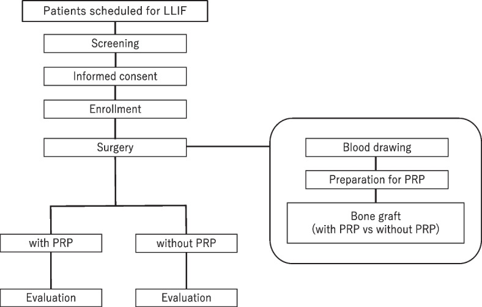
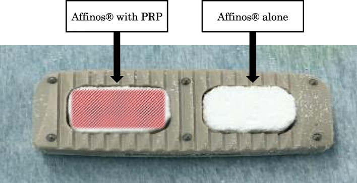
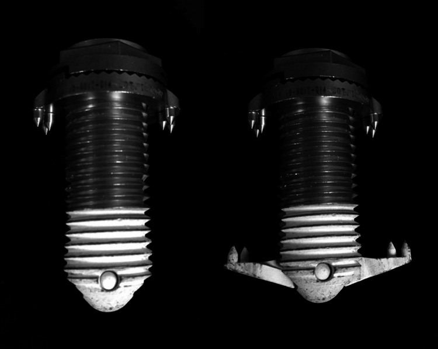
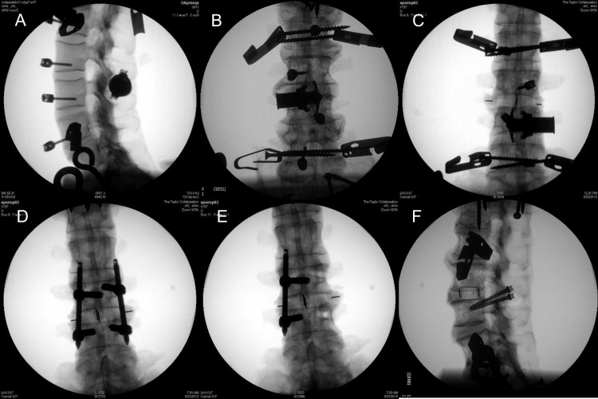
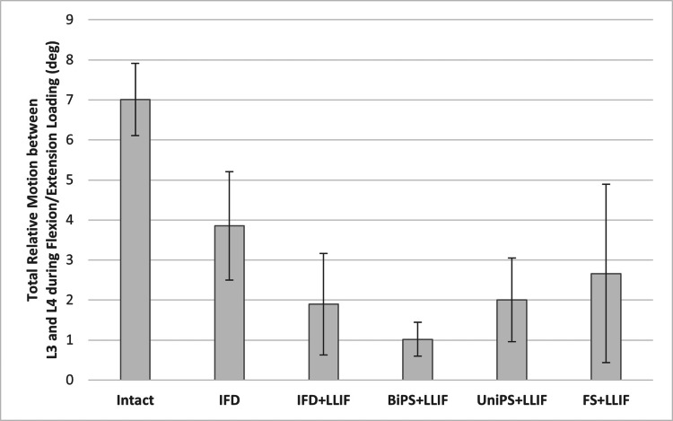
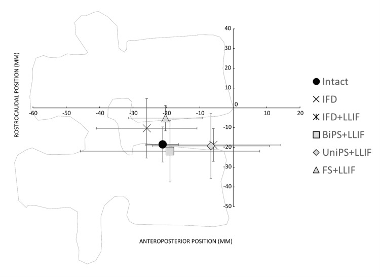
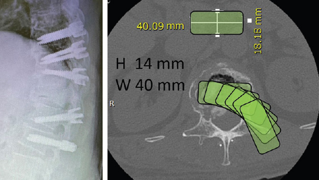
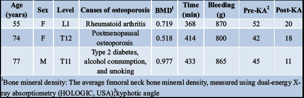
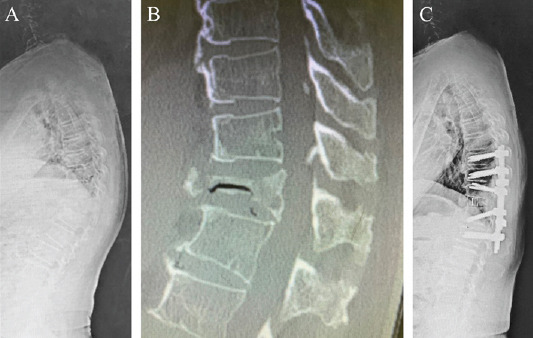
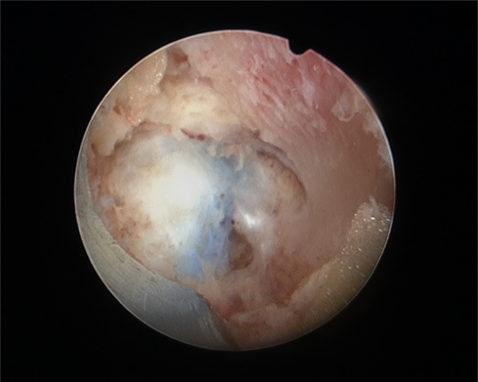

# Case Prep: Lateral Lumbar Interbody Fusion (XLIF / OLIF)

---

<!-- BEGIN CASE SNAPSHOT -->

## Case / Approach Snapshot

- **Anatomy at risk:** level localization, cord/cauda equina, exiting and traversing roots, dura, vertebral artery or segmental vessels, esophagus/trachea/pleura/viscera by approach, and fusion/instrumentation landmarks.
- **Operative steps:** position and pad carefully, confirm level, expose the planned corridor, decompress neural elements, reconstruct or instrument when indicated, verify alignment/hardware, and close with attention to hematoma and wound risk; use the detailed operative sequence and approach notes below as the step-by-step source.
- **Rescue plans:** wrong level, durotomy, neurologic change, vertebral artery/visceral/pleural injury, graft or hardware problem, epidural hematoma, dysphagia/airway issue, and infection prevention/escalation.
- **Figures:** review [Figures, Imaging & Video](#figures-imaging--video) and the [Curated Image Set](#curated-image-set); embedded local figures should remain open-access, public-domain, or otherwise reusable with attribution.
- **Papers:** review [High-Yield Literature](#high-yield-literature) for seminal sources, modern reviews, and outcome data specific to this page.
- **Textbook cross-checks:** use [Textbook Cross-Checks](#textbook-cross-checks) and the [Source Crosswalk](../../resources/source-crosswalk.md) to cite copyrighted textbooks/atlases while summarizing in original words.

<!-- END CASE SNAPSHOT -->

## One-Liner
[Age]yo [M/F] with [degenerative disc disease / scoliosis / spondylolisthesis / adjacent segment disease] at [L_-L_] planned for lateral (transpsoas XLIF / anterior-to-psoas OLIF) lumbar interbody fusion [± posterior fixation].

---

## Figures, Imaging & Video

**🎥 Operative video** — [search operative video on YouTube ▸](https://www.youtube.com/results?search_query=lateral+lumbar+interbody+fusion+surgery) · [The Neurosurgical Atlas ▸](https://www.neurosurgicalatlas.com)

> 🧭 **Operative approach:** [Transpsoas lateral (LLIF/XLIF/OLIF) approach](../approaches/transpsoas-approach.md) — detailed corridor setup, step-by-step technique & figures

[Neurosurgical Atlas](https://www.neurosurgicalatlas.com) · [AO Surgery Reference](https://surgeryreference.aofoundation.org) · [Radiopaedia](https://radiopaedia.org/search?q=lateral%20lumbar%20interbody%20fusion&scope=all) · [PubMed Central](https://www.ncbi.nlm.nih.gov/pmc/?term=lateral+transpsoas+lumbar+interbody+fusion) — operative figures © linked; see [media-sources.md](../../resources/media-sources.md)

---

<!-- BEGIN TEXTBOOK CROSS-CHECKS -->

## Textbook Cross-Checks

- **Spine anatomy and biomechanics:** Benzel Spine; Textbook of Spinal Surgery; Surgical Anatomy and Techniques to the Spine — confirm levels, approach-side anatomy, neural/vascular structures at risk, alignment, stability, and fixation rationale.
- **Technique sequence:** Youmans and Winn; Benzel Spine; Greenberg — review positioning, localization, exposure, decompression, instrumentation, fusion/reconstruction, and closure in original language.
- **Complication rescue:** Benzel Spine; Greenberg; Youmans and Winn — cross-check durotomy, neurologic change, vascular injury, wrong-level prevention, infection, implant failure, and postoperative restrictions.
- **Copyright-safe use:** cite these sources as private cross-checks, then write the guide content in original words; do not re-host textbook pages, figures, tables, or board-review card material. See [Source Crosswalk & Copyright-Safe Use](../../resources/source-crosswalk.md).

<!-- END TEXTBOOK CROSS-CHECKS -->

<!-- BEGIN CURATED LITERATURE -->

## High-Yield Literature

- **Lateral Lumbar Interbody Fusion** — Taba HA. Neurosurgery clinics of North America 2020. [PubMed](https://pubmed.ncbi.nlm.nih.gov/31739927/)
- **Lumbar interbody fusion: techniques, indications and comparison of interbody fusion options including PLIF, TLIF, MI-TLIF, OLIF/ATP, LLIF and ALIF** — Mobbs RJ. Journal of spine surgery (Hong Kong) 2015. [PubMed](https://pubmed.ncbi.nlm.nih.gov/27683674/)
- **Lateral lumbar interbody fusion in adult spine deformity - A review of literature** — Batheja D. Journal of clinical orthopaedics and trauma 2021. [PubMed](https://pubmed.ncbi.nlm.nih.gov/34722145/)
- **Lateral Lumbar Interbody Fusion-Outcomes and Complications** — Salzmann SN. Current reviews in musculoskeletal medicine 2017. [PubMed](https://pubmed.ncbi.nlm.nih.gov/29038952/)
- **The Evolution of Lateral Lumbar Interbody Fusion: A Journey from Past to Present** — Wong AXJ. Medicina (Kaunas, Lithuania) 2024. [PubMed](https://pubmed.ncbi.nlm.nih.gov/38541104/)
- **Lateral Lumbar Interbody Fusion: Review of Surgical Technique and Postoperative Multimodality Imaging Findings** — Wangaryattawanich P. AJR. American journal of roentgenology 2021. [PubMed](https://pubmed.ncbi.nlm.nih.gov/32903050/)
- **Lateral Lumbar Interbody Fusion** — Pawar A. Asian spine journal 2015. [PubMed](https://pubmed.ncbi.nlm.nih.gov/26713134/)
- **Single Position Prone Lateral Lumbar Interbody Fusion: A Review of the Current Literature** — Jacome FP. Current reviews in musculoskeletal medicine 2024. [PubMed](https://pubmed.ncbi.nlm.nih.gov/39090374/)
- **Lateral Lumbar Interbody Fusion: Indications, Outcomes, and Complications** — Kwon B. The Journal of the American Academy of Orthopaedic Surgeons 2016. [PubMed](https://pubmed.ncbi.nlm.nih.gov/26803545/)
- **Subsidence Rates After Lateral Lumbar Interbody Fusion: A Systematic Review** — Macki M. World neurosurgery 2019. [PubMed](https://pubmed.ncbi.nlm.nih.gov/30476670/)

<!-- END CURATED LITERATURE -->

---

<!-- BEGIN CURATED IMAGE SET -->

## Curated Image Set

Open-access figures are embedded from PubMed Central articles and kept unique to this guide.

*Fig. 1. Schematic diagram showing the trial timeline. Consecutive patients scheduled for lateral lumbar interbody fusion will be recruited for this study. Whole blood will be drawn from each... Source: [Efficacy of platelet-rich plasma impregnation for unidirectional porous β-tricalcium phosphate in lateral lumbar interbody fusion: study protocol for a prospective controlled trial](https://pmc.ncbi.nlm.nih.gov/articles/PMC9615172/) — Trials 2022; CC BY.*

*Fig. 2. Bone grafts in the intervertebral cage. For each cage, one space will be filled with a bone graft with PRP, and the other will be filled with a bone graft without PRP Source: [Efficacy of platelet-rich plasma impregnation for unidirectional porous β-tricalcium phosphate in lateral lumbar interbody fusion: study protocol for a prospective controlled trial](https://pmc.ncbi.nlm.nih.gov/articles/PMC9615172/) — Trials 2022; CC BY.*

*Figure 1. The interspinous fixation device used in the study was designed to be placed from a lateral approach. The extensions, deployed after the device is passed through the interspinous... Source: [Interspinous-Interbody Fusion via a Strictly Lateral Surgical Approach: A Biomechanical Stabilization Comparison to Constructs Requiring Both Lateral and Posterior Approaches](https://pmc.ncbi.nlm.nih.gov/articles/PMC10424609/) — Cureus 2023; CC BY.*

*Figure 2. Fluoroscopic images of the instrumented constructs.(A) Interspinous fixation device – lateral view; (B) interspinous fixation device – anterior-posterior view; (C) interspinous fixation... Source: [Interspinous-Interbody Fusion via a Strictly Lateral Surgical Approach: A Biomechanical Stabilization Comparison to Constructs Requiring Both Lateral and Posterior Approaches](https://pmc.ncbi.nlm.nih.gov/articles/PMC10424609/) — Cureus 2023; CC BY.*

*Figure 3. The mean flexion-extension range of motion (degrees) at L3-4 for each test construct compared to INTACT (lines represent standard deviation). The motion was significantly less in all... Source: [Interspinous-Interbody Fusion via a Strictly Lateral Surgical Approach: A Biomechanical Stabilization Comparison to Constructs Requiring Both Lateral and Posterior Approaches](https://pmc.ncbi.nlm.nih.gov/articles/PMC10424609/) — Cureus 2023; CC BY.*

*Figure 4. Location of mean instantaneous axis of rotation for INTACT and each treatment condition (lines represent standard deviations along the two axes) during flexion-extension loading.IFD:... Source: [Interspinous-Interbody Fusion via a Strictly Lateral Surgical Approach: A Biomechanical Stabilization Comparison to Constructs Requiring Both Lateral and Posterior Approaches](https://pmc.ncbi.nlm.nih.gov/articles/PMC10424609/) — Cureus 2023; CC BY.*

*Figure 1. Pre-operative simulation in the PowerPoint® software and the first stage of the operation. The first stage involved pedicle screw insertion only without rod fixation. The pedicle screw... Source: [Posterior Insertion of a Lateral Lumbar Interbody Fusion Cage for the Treatment of Osteoporotic Vertebral Fracture with Kyphotic Deformity: A Case Report](https://pmc.ncbi.nlm.nih.gov/articles/PMC9634382/) — Journal of Orthopaedic Case Reports 2022; CC BY-NC-SA.*

*Figure 8. Source: [Posterior Insertion of a Lateral Lumbar Interbody Fusion Cage for the Treatment of Osteoporotic Vertebral Fracture with Kyphotic Deformity: A Case Report](https://pmc.ncbi.nlm.nih.gov/articles/PMC9634382/) — J Orthop Case Rep. 2022 Apr;12(4):75–8. doi: 10.13107/jocr.2022.v12.i04.2774; CC BY-NC-SA.*

*Figure 2. (a) Whole spine radiograph. (b) Computed tomography showing the unstable T11 fracture. (c) Whole spine standing radiograph 2 weeks postoperatively. The local kyphosis angle decreased... Source: [Posterior Insertion of a Lateral Lumbar Interbody Fusion Cage for the Treatment of Osteoporotic Vertebral Fracture with Kyphotic Deformity: A Case Report](https://pmc.ncbi.nlm.nih.gov/articles/PMC9634382/) — Journal of Orthopaedic Case Reports 2022; CC BY-NC-SA.*

*Fig. 1. Exposed disc for OLLIF insertion Source: [Endoscopic Foraminal Decompression Preceding Oblique Lateral Lumbar Interbody Fusion To Decrease The Incidence Of Post Operative Dysaesthesia](https://pmc.ncbi.nlm.nih.gov/articles/PMC4325491/) — International Journal of Spine Surgery 2014; CC BY-NC-ND.*

<!-- END CURATED IMAGE SET -->

---

## History of Present Illness
- Chief complaint: Back/leg pain, deformity, need for indirect decompression and large interbody
- Failed conservative management
- **Lateral approach advantages:** large interbody (indirect decompression by restoring height/foraminal volume), minimal posterior disruption, good for deformity/coronal correction
- **Levels:** L1-2 through L4-5 (XLIF); **L5-S1 not accessible** via transpsoas (iliac crest/vessels) — OLIF L5-S1 possible via different corridor

---

## Past Medical History
- Prior retroperitoneal/abdominal surgery, vascular disease
- **Hip/iliac crest anatomy** (limits access to L4-5), psoas anatomy
- Standard PMH

---

## Imaging Review
### MRI/X-ray/CT
- Disc/stenosis levels, alignment, coronal/sagittal deformity
- **Vascular and psoas anatomy** (axial MRI): great vessel position, lumbar plexus position within psoas (more posterior = safer corridor), "at-risk" levels (L4-5 plexus more anterior)
- Iliac crest height (L4-5 access), retroperitoneal anatomy
- Bone quality (subsidence risk)

---

## Labs
- CBC, BMP, Coags, Type and screen, HbA1c

---

## Neurological Examination
- Lower extremity exam, **baseline hip flexion (psoas) and thigh sensation** (genitofemoral/femoral) — approach can affect these

---

## Surgical Planning

### Position
- **True lateral decubitus** (typically right-side-up/left-side-down for left retroperitoneal approach), break the table to open the disc space/iliac-rib window, secure with tape, axillary roll, pad pressure points
- Fluoroscopy must give true AP and lateral (square the patient to the table)

### Key Surgical Steps (XLIF — Transpsoas)
1. Lateral fluoroscopic localization, mark disc trajectory
2. Small lateral flank incision, **blunt finger dissection through retroperitoneal space** to the psoas (sweep peritoneum anteriorly)
3. **Transpsoas dilation with EMG-guided dilators** — directional EMG to locate/avoid the **lumbar plexus** (advance through posterior-to-mid psoas at safe zone); place expandable retractor
4. Confirm position on fluoroscopy (mid-disc, avoiding posterior plexus and anterior vessels)
5. **Discectomy** with contralateral annular release, endplate prep (preserve endplate)
6. Trial and place **wide lateral interbody cage** (spanning both lateral cortical apophyseal rings for support) packed with graft
7. Restore disc/foraminal height (indirect decompression), correct coronal alignment
8. **OLIF variant:** anterior-to-psoas corridor (between psoas and great vessels) — avoids traversing psoas/plexus but requires vessel retraction
9. ± Lateral plate/screw or staged **posterior pedicle screw fixation** (often needed for stability)
10. Closure

### Critical Anatomy & Structures at Risk
1. **Lumbar plexus** (within/posterior psoas) — **femoral nerve, genitofemoral nerve** → thigh weakness (hip flexion/knee extension), anterior thigh numbness/pain (especially **L4-5**); EMG monitoring essential
2. **Great vessels** (aorta/IVC, segmental vessels) — anterior; OLIF retracts vessels
3. **Psoas muscle** — transient hip flexor weakness/thigh pain (common, usually transient)
4. **Ureter, bowel, sympathetic chain** (retroperitoneal)
5. **Subsidence** (lateral cage on apophyseal ring — good support, but osteoporosis risk)

### Equipment
- Lateral access/retractor system with **EMG-directional dilators**, neuromonitoring
- Lateral interbody cages + trials, graft, ± lateral plate
- Fluoroscopy, posterior pedicle screw set (if combined)

### Monitoring
- **EMG (free-run + triggered/directional — essential for psoas transit)**, MEP/SSEP for deformity

### Anesthesia
- No paralytic (EMG), lateral positioning precautions, arterial line for deformity, type and screen

### Potential Complications
1. **Lumbar plexus injury** — thigh weakness (hip flexion, quads), numbness, pain (esp. L4-5); often transient psoas-related, but femoral nerve injury can be lasting
2. Vascular injury, bowel/ureter injury
3. Subsidence, cage migration, pseudarthrosis
4. Ileus, incisional flank bulge/hernia, sympathetic changes

---

## Operative Note Template
**Preoperative Diagnosis:** [Degenerative disc disease / scoliosis / adjacent segment disease] at [L_-L_]

**Postoperative Diagnosis:** Same

**Procedure:** Lateral lumbar interbody fusion ([XLIF transpsoas / OLIF anterior-to-psoas] at [L_-L_]) [± posterior pedicle screw fixation]

**Surgeon / Assistant:**
**Anesthesia:** General endotracheal, no paralytic (EMG)
**EBL / Fluids:**
**Adjuncts:** Lateral access retractor with **directional EMG dilators**, fluoroscopy; neuromonitoring
**Implants:** Lateral interbody cage, graft [± lateral plate; posterior screws]
**Complications:** None

**Indications:** [Age]yo [M/F] with [pathology] at [L_-L_] amenable to indirect decompression via a large lateral interbody. Risks (lumbar plexus/thigh symptoms, vascular/visceral injury) discussed.

**Description of Procedure:** After consent and time-out, general anesthesia was induced (no paralytic for EMG) and the patient placed in true lateral decubitus with the table broken to open the disc space; true AP/lateral fluoroscopy was squared. A lateral flank incision was made and **blunt retroperitoneal finger dissection** carried to the psoas, sweeping the peritoneum anteriorly.

[XLIF: the psoas was traversed with **EMG-directional dilators** to locate and avoid the lumbar plexus, and the retractor docked mid-disc.] [OLIF: an anterior-to-psoas corridor between the psoas and great vessels was developed.] A discectomy with contralateral annular release and endplate preparation was performed, and a **wide interbody cage spanning the apophyseal ring** was placed with graft, restoring disc/foraminal height and coronal alignment. [Posterior pedicle screw fixation was added for stability.]

Closure was performed. The patient was transferred with documentation of hip-flexion/quad strength and thigh sensation (plexus).

---

## Postoperative Plan
- Floor, neuro checks — **document hip flexion strength, quad strength, thigh sensation** (plexus)
- Counsel: transient thigh pain/numbness/hip flexor weakness common (usually resolves weeks-months)
- Mobilize POD0/1, X-rays, DVT prophylaxis
- Diet advance (ileus watch), activity/brace per surgeon
- Follow-up for fusion and plexopathy resolution
