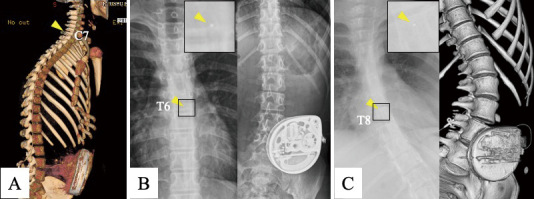
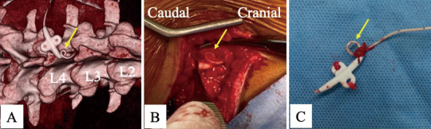
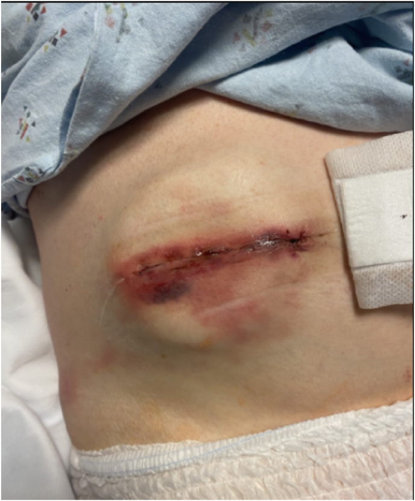
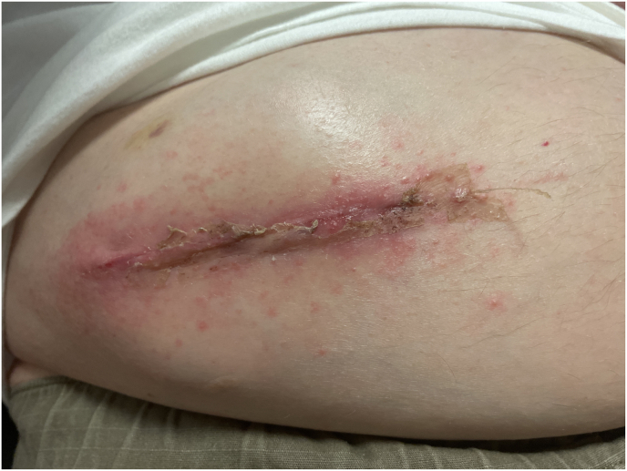
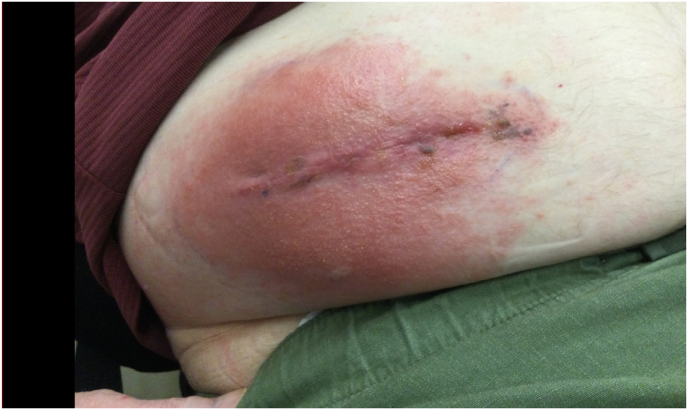
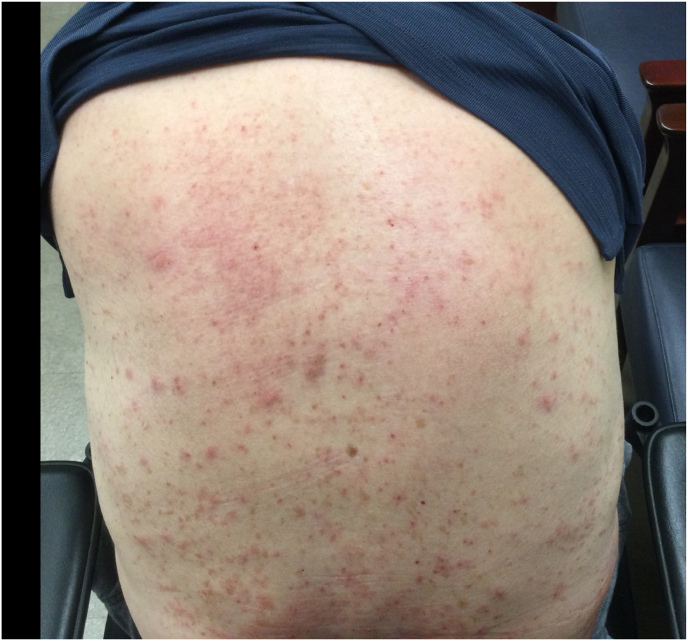
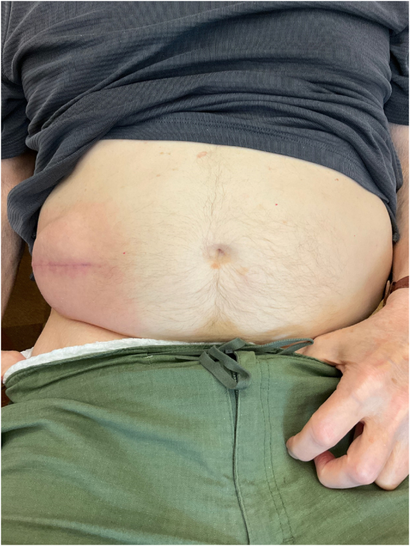
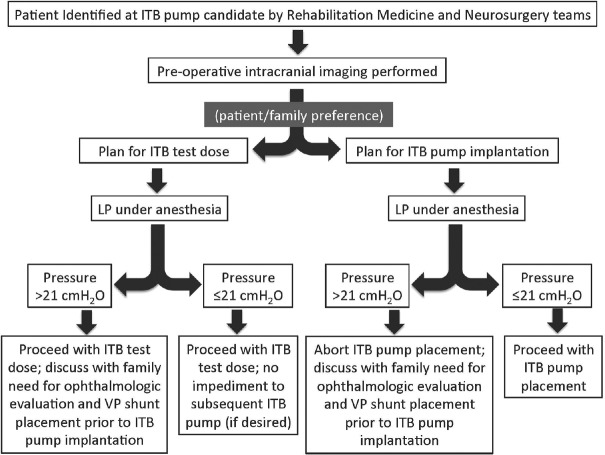
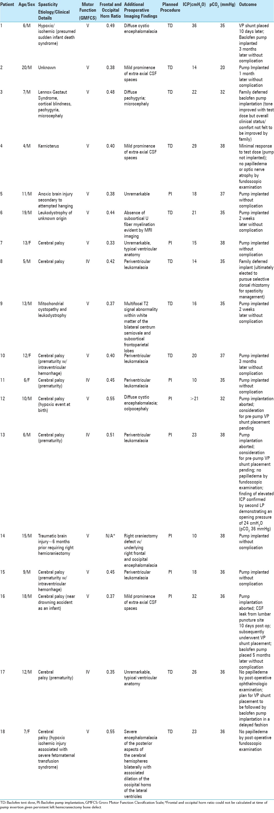
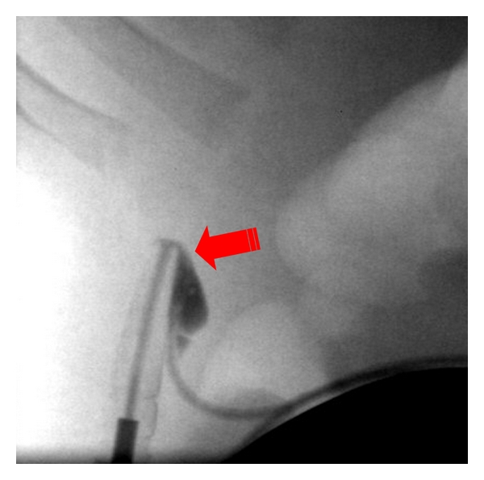

# Case Prep: Intrathecal Baclofen (ITB) Pump Implantation

<!-- BEGIN CASE SNAPSHOT -->

## Case / Approach Snapshot

- **Anatomy at risk:** lumbar thecal sac, conus/roots, intrathecal catheter path and tip level, fascial anchor, flank-abdominal tunneling route, pump pocket skin envelope, prior fusion/scoliosis anatomy, CSF space, and refill port orientation.
- **Operative steps:** confirm severe spasticity indication and trial response, choose catheter entry/tip level, create durable lumbar catheter access, anchor without kinking, tunnel to a body-habitus-appropriate pump pocket, connect/program pump safely, verify CSF/drug pathway, and establish refill/overdose/withdrawal safeguards.
- **Rescue plans:** failed intrathecal access, catheter kink/disconnection/migration, CSF leak, pocket dehiscence/seroma/infection, baclofen overdose, life-threatening withdrawal from pump/catheter failure or empty reservoir, dosing/refill error, hydrocephalus interaction, and MRI/device-management issues.
- **Figures:** review [Figures, Imaging & Video](#figures-imaging--video) and the [Curated Image Set](#curated-image-set); embedded local figures should remain open-access, public-domain, or otherwise reusable with attribution.
- **Papers:** review [High-Yield Literature](#high-yield-literature) for seminal sources, modern reviews, and outcome data specific to this page.

<!-- END CASE SNAPSHOT -->

## One-Liner
[Age]yo [M/F] with severe [spasticity (cerebral palsy / MS / SCI / TBI / stroke) / refractory chronic pain] planned for intrathecal drug delivery (baclofen) pump implantation [after successful trial].

---

## Figures, Imaging & Video

**🎥 Operative video** — [search operative video on YouTube ▸](https://www.youtube.com/results?search_query=intrathecal+baclofen+pump+surgery) · [The Neurosurgical Atlas ▸](https://www.neurosurgicalatlas.com)

> 🧭 **Operative approach:** [Posterior thoracolumbar approach](../approaches/posterior-thoracolumbar-approach.md) — lumbar intrathecal access, fascial closure, and catheter-tunneling context.

[Neurosurgical Atlas](https://www.neurosurgicalatlas.com) · [Radiopaedia](https://radiopaedia.org/search?q=intrathecal%20baclofen%20pump&scope=all) · [PubMed Central](https://www.ncbi.nlm.nih.gov/pmc/?term=intrathecal+baclofen+pump) — operative figures © linked; see [media-sources.md](../../resources/media-sources.md)

---

<!-- BEGIN CURATED LITERATURE -->

## High-Yield Literature

- **Scoliosis, spinal fusion, and intrathecal baclofen pump implantation** — Scannell B. Physical medicine and rehabilitation clinics of North America 2015. [PubMed](https://pubmed.ncbi.nlm.nih.gov/25479781/)
- **Clinical practices in intrathecal baclofen pump implantation in children with cerebral palsy in France** — Mietton C. Annals of physical and rehabilitation medicine 2016. [PubMed](https://pubmed.ncbi.nlm.nih.gov/27158102/)
- **Surgical treatment of spasticity: intrathecal baclofen pump implantation under subarachnoid block** — Scerrati A. Neurosurgical focus: Video 2020. [PubMed](https://pubmed.ncbi.nlm.nih.gov/36285267/)
- **Complications of intrathecal baclofen pump: prevention and cure** — Awaad Y. ISRN neurology 2012. [PubMed](https://pubmed.ncbi.nlm.nih.gov/22548189/)
- **Intrathecal baclofen pump implantation** — Clinical privilege white paper 2015. [PubMed](https://pubmed.ncbi.nlm.nih.gov/26790167/)
- **Intrathecal Baclofen Pump Implantation for Type 2 Gaucher Disease** — Hori YS. Pediatric neurosurgery 2017. [PubMed](https://pubmed.ncbi.nlm.nih.gov/28848108/)
- **Intrathecal baclofen pump implantation** — Clinical privilege white paper 2000. [PubMed](https://pubmed.ncbi.nlm.nih.gov/11010677/)
- **[Radiculopathy following intrathecal baclofen pump implantation]** — Roche N. Annales de readaptation et de medecine physique : revue scientifique de la Societe francaise de reeducation fonctionnelle de readaptation et de medecine physique 2006. [PubMed](https://pubmed.ncbi.nlm.nih.gov/16675056/)
- **An algorithmic approach to the management of unrecognized hydrocephalus in pediatric candidates for intrathecal baclofen pump implantation** — Hanak BW. Surgical neurology international 2016. [PubMed](https://pubmed.ncbi.nlm.nih.gov/28168091/)
- **Intrathecal baclofen pump implantation in prone position for a cerebral palsy patient with severe scoliosis: a case report** — Arishima H. Neuromodulation : journal of the International Neuromodulation Society 2015. [PubMed](https://pubmed.ncbi.nlm.nih.gov/24945783/)

<!-- END CURATED LITERATURE -->

<!-- BEGIN CURATED IMAGE SET -->

## Curated Image Set

Open-access figures are embedded from PubMed Central articles and kept unique to this guide.

*Fig. 1. A) ITB pump implantation was performed 5 years of age. Three-dimensional CT imaging demonstrates an Ascenda catheter with its tip positioned at the C7 vertebral level (yellow arrow... Source: [Late-onset Kinking of the Ascenda Catheter following Intrathecal Baclofen Pump Implantation: A Case Report](https://pmc.ncbi.nlm.nih.gov/articles/PMC12623138/) — NMC Case Report Journal 2025; CC BY-NC-ND.*

*Fig. 2. A) Kinking of the catheter was observed just proximal to the anchor on three dimensional CT (yellow arrow). B) Intraoperatively, a looped and kinked segment of the previously implanted... Source: [Late-onset Kinking of the Ascenda Catheter following Intrathecal Baclofen Pump Implantation: A Case Report](https://pmc.ncbi.nlm.nih.gov/articles/PMC12623138/) — NMC Case Report Journal 2025; CC BY-NC-ND.*

*Fig. 1. Pump reservoir incisional site on POD 1∗∗Note: photo was taken with patient in the supine position in his hospital bed. Source: [Navigating the red: Diagnostic dilemma of erythema and diffuse body rash post- intrathecal baclofen pump implantation](https://pmc.ncbi.nlm.nih.gov/articles/PMC12032324/) — Interventional Pain Medicine 2025; CC BY.*

*Fig. 2. Pump reservoir incision site on POD 37∗∗Note: photo taken while patient seated in his electric wheelchair. Source: [Navigating the red: Diagnostic dilemma of erythema and diffuse body rash post- intrathecal baclofen pump implantation](https://pmc.ncbi.nlm.nih.gov/articles/PMC12032324/) — Interventional Pain Medicine 2025; CC BY.*

*Fig. 3. Pump reservoir incision site on POD 47. Source: [Navigating the red: Diagnostic dilemma of erythema and diffuse body rash post- intrathecal baclofen pump implantation](https://pmc.ncbi.nlm.nih.gov/articles/PMC12032324/) — Interventional Pain Medicine 2025; CC BY.*

*Fig. 4. Posterior trunk cutaneous rash on POD 54. Source: [Navigating the red: Diagnostic dilemma of erythema and diffuse body rash post- intrathecal baclofen pump implantation](https://pmc.ncbi.nlm.nih.gov/articles/PMC12032324/) — Interventional Pain Medicine 2025; CC BY.*

*Fig. 5. Pump reservoir site incision at POD 64 showing resolution of erythema and skin lesions. Source: [Navigating the red: Diagnostic dilemma of erythema and diffuse body rash post- intrathecal baclofen pump implantation](https://pmc.ncbi.nlm.nih.gov/articles/PMC12032324/) — Interventional Pain Medicine 2025; CC BY.*

*Figure 1. Flow chart demonstrating the clinical protocol employed for patients identified as candidates for intrathecal baclofen pump implantation Source: [An algorithmic approach to the management of unrecognized hydrocephalus in pediatric candidates for intrathecal baclofen pump implantation](https://pmc.ncbi.nlm.nih.gov/articles/PMC5223398/) — Surgical Neurology International 2016; CC BY-NC-SA.*

*Figure 9. Source: [An algorithmic approach to the management of unrecognized hydrocephalus in pediatric candidates for intrathecal baclofen pump implantation](https://pmc.ncbi.nlm.nih.gov/articles/PMC5223398/) — Surg Neurol Int. 2016 Dec 20;7:105. doi: 10.4103/2152-7806.196236; CC BY-NC-SA.*

*Figure 1. Tear at metal connector to pump within protective silicone covering. Source: [Complications of Intrathecal Baclofen Pump: Prevention and Cure](https://pmc.ncbi.nlm.nih.gov/articles/PMC3323842/) — ISRN Neurology 2012; CC BY.*

<!-- END CURATED IMAGE SET -->

---

## History of Present Illness
- Chief complaint: **Severe, disabling spasticity** (impairing function, care, comfort, causing pain/contractures) refractory to oral antispasmodics, OR refractory chronic pain (intrathecal opioid/ziconotide)
- Etiology of spasticity (CP, MS, SCI, TBI, stroke, hereditary spastic paraplegia)
- **Successful ITB trial** (test dose via LP showing meaningful spasticity reduction — Ashworth improvement) required before pump
- Goals (function vs comfort/care/positioning), caregiver involvement

---

## Past Medical History
- Body habitus (pump pocket — thin/pediatric patients), prior spine surgery/fusion (catheter placement), infection risk, bleeding/anticoagulation
- **MRI needs, future spine surgery**, baseline respiratory/bulbar status (overdose risk)
- Standard PMH

---

## Imaging Review
### Spine imaging (if prior surgery/scoliosis)
- Catheter placement feasibility, level, fusion/hardware, scoliosis
### Trial documentation
- **ITB trial response** (test dose LP — Ashworth/spasm reduction)

### Candidate and Systems Checklist
- Define the goal: comfort/care, sleep, hygiene, contracture prevention, transfers, gait, pain, or caregiver burden. Too much tone reduction can worsen transfers or standing in selected patients.
- Confirm trial response with objective tone/spasm scores and functional/caregiver observations, not only "felt looser."
- Screen hydrocephalus in pediatric/CP candidates when head growth, ventriculomegaly, shunt history, or symptoms suggest CSF-dynamics issues.
- Check abdominal wall thickness, wheelchair beltline, scoliosis, prior abdominal surgery, G-tube/ostomy, and skin pressure points before selecting the pump pocket.
- Confirm caregiver reliability, refill logistics, emergency access, and who will manage dose titration/refill alarms.

---

## Labs
- CBC, **Coags (intrathecal catheter)**, BMP

---

## Neurological Examination
- **Spasticity scales (Modified Ashworth, spasm frequency)**, motor/function, contractures, document baseline

---

## Surgical Planning

### Case Logistics, OR Needs & Orders
- **OR table/bed:** standard OR table or radiolucent spine table depending on percutaneous versus paddle/intrathecal access; confirm fluoroscopy and tunneling access before prep.
- **OR setup:** fluoroscopy, implant/pump/stimulator inventory verified, programmer/vendor available, sterile tunneling tools, trial leads/catheters as applicable, and pocket-site laterality confirmed.
- **Special needs:** antibiotic/implant protocol, anticoagulation plan for neuraxial access, baclofen-withdrawal/overdose rescue plan for pumps, device programming orders, and infection-prevention bundle.
- **Immediate postop orders:** wound/pocket checks, neuro checks for neuraxial hematoma, device programming/initial dose orders, activity restrictions, antibiotics per protocol, pain control, and follow-up for interrogation/refill/programming.

### Position
- **OR table/bed:** standard OR table or radiolucent spine table depending on percutaneous versus paddle/intrathecal access; confirm fluoroscopy and tunneling access before prep.
- **Lateral decubitus** (catheter via LP-type access + abdominal pump pocket), fluoroscopy; padded

### Key Surgical Steps
1. **Intrathecal catheter:** Tuohy needle into the lumbar subarachnoid space (paramedian, L3-4/L4-5), confirm CSF flow
2. Thread the **intrathecal catheter cephalad** to the target level (e.g., T6-T8 for lower extremity spasticity; higher/cervical for upper extremity/generalized) under fluoroscopy
3. Anchor the catheter at the lumbar fascia (anti-kink/anti-migration), small paramedian fascial incision
4. **Abdominal pump pocket:** subcutaneous (or subfascial in thin/pediatric) pocket in the lower abdomen
5. **Tunnel the catheter** from the back to the abdominal pocket, connect to the **programmable pump** (pre-filled with baclofen)
6. Confirm CSF flow/connections, program the pump (starting dose), secure pump in pocket
7. Closure
- (Some confirm catheter tip with fluoroscopy/contrast myelogram via catheter)

### Technical Nuances
- Lumbar entry should be below the conus and away from fused/stenotic levels; use fluoroscopy or ultrasound when anatomy is distorted.
- Tunnel a smooth catheter arc with strain relief at both lumbar anchor and pump pocket; sharp turns become delayed kinks.
- In thin children/adults, consider subfascial pump placement to reduce erosion, but balance pain and surgical morbidity.
- Orient the refill port clearly and document pump location/depth; poor orientation creates future refill risk.
- Prime and program according to device protocol, with independent medication concentration/dose checks before leaving the OR.
- Obtain baseline postoperative radiographs/fluoro images of catheter course and tip level for future malfunction workups.

### Critical Anatomy & Structures at Risk
1. **Spinal cord / nerve roots / conus** (catheter — stay subarachnoid, avoid cord; lumbar entry below conus)
2. **Dura** (CSF leak — post-dural-puncture headache, hygroma), catheter tip level (dosing effect)
3. Pump pocket (seroma, infection, dehiscence — esp. thin patients)

### Equipment
- ITB pump (programmable) + intrathecal catheter + anchor/connectors, Tuohy needle, tunneler
- Fluoroscopy, **baclofen (pump fill)**, programmer

### Anesthesia
- General (or spinal/local per patient); antibiotics (implant); positioning

### Potential Complications
1. **Baclofen overdose** (drowsiness, respiratory depression, hypotonia, coma — programming/refill errors, dosing) and **withdrawal** (life-threatening: high fever, rigidity, rhabdomyolysis, rebound spasticity — abrupt interruption from pump failure/empty/catheter problem) — **emergencies**
2. **CSF leak / hygroma / PDPH**, catheter migration/kink/disconnection/occlusion (under-dosing/withdrawal)
3. **Infection** (pocket/CSF — meningitis; may need explant), seroma, pocket dehiscence
4. Pump malfunction, MRI considerations

### Equipment/Safety Note
- Establish **refill schedule** (avoid empty-reservoir withdrawal), program alarms, educate patient/caregiver on withdrawal/overdose signs

### Overdose vs Withdrawal

| Syndrome | Typical clues | Immediate priorities |
|----------|---------------|----------------------|
| Baclofen overdose | somnolence, hypotonia, respiratory depression, bradycardia/hypotension, coma | airway/ventilation, pump interrogation, stop/reduce infusion, ICU support, consider CSF aspiration per specialist protocol |
| Baclofen withdrawal | rebound spasticity, pruritus, fever, agitation, autonomic instability, rhabdomyolysis, seizures, organ failure | restore intrathecal baclofen if possible, benzodiazepines/supportive ICU care, troubleshoot pump/catheter/refill, treat hyperthermia/rhabdo |
| Catheter malfunction | loss of effect, withdrawal symptoms, abnormal residual volume, kink/disconnection on imaging | interrogate pump, radiographs/contrast study per protocol, urgent revision if withdrawal risk |
| Pocket infection | erythema, drainage, tenderness, fever, positive cultures | cultures/antibiotics, assess depth; deep hardware infection often requires explant/temporary baclofen bridge |

### Troubleshooting Pathway
- Interrogate pump first: reservoir volume, alarm history, dose/concentration, battery, motor stall, and last refill.
- Compare aspirated reservoir volume with expected volume; mismatch suggests refill/programming or delivery problem.
- Image the entire catheter from pump to intrathecal tip; kinks and disconnections hide at anchors/connectors.
- If contrast study is needed, aspirate catheter access port first when protocol requires it to avoid bolus overdose.
- Treat suspected withdrawal while diagnosing; waiting for perfect proof can be dangerous.

---

## Operative Note Template
**Preoperative Diagnosis:** Severe [spasticity (CP/MS/SCI/TBI) / refractory pain] with successful ITB trial

**Postoperative Diagnosis:** Same

**Procedure:** Intrathecal baclofen pump implantation with intrathecal catheter (tip at [level]) and [abdominal] pump pocket

**Surgeon / Assistant:**
**Anesthesia:** General endotracheal
**EBL / Fluids:**
**Adjuncts:** Fluoroscopy, Tuohy needle, tunneler, programmer
**Implants:** Programmable ITB pump + intrathecal catheter, baclofen (pump fill)
**Complications:** None

**Indications:** [Age]yo [M/F] with severe disabling spasticity refractory to oral agents, with a positive ITB test dose (Ashworth/spasm reduction). Risks (overdose/withdrawal, CSF leak, infection, catheter problems) discussed; refill schedule planned.

**Description of Procedure:** After consent and time-out, general anesthesia was induced and the patient positioned in lateral decubitus with fluoroscopy. A Tuohy needle accessed the lumbar subarachnoid space (paramedian, [L3-4/L4-5]) with **CSF return confirmed**, and the **intrathecal catheter threaded cephalad to [T6-T8]** under fluoroscopy and anchored to the lumbar fascia. A subcutaneous **abdominal pump pocket** was created, the catheter tunneled and connected to the **programmable pump** (pre-filled with baclofen), CSF flow/connections confirmed, and the pump programmed at the starting dose.

Closure was performed. The patient was monitored for overdose (respiratory depression) and CSF leak, with a refill schedule established and caregiver education on overdose/withdrawal recognition.

---

## Postoperative Plan
- Floor/monitored (overdose risk early), neuro/**respiratory checks**
- **Watch for overdose** (somnolence, respiratory depression — have flumazenil? no; supportive, consider CSF aspiration, physostigmine historically) **and withdrawal** (rigidity, fever)
- CSF leak precautions (flat if PDPH/leak), wound/pocket monitoring (seroma/infection)
- **Refill schedule established**, dose titration in clinic, caregiver education (withdrawal/overdose emergency recognition)
- Spasticity reassessment, follow-up; document pump/MRI parameters

<!-- BEGIN COMMON PIMP QUESTIONS -->

## Common Pimp Questions

Use these to pressure-test preparation for **Intrathecal Baclofen (ITB) Pump Implantation**:

1. What neurologic level and root are responsible for the presenting deficit?
2. What is the decompression target and how will you know it is adequately decompressed?
3. What instability, deformity, bone-quality, or fusion variable changes the construct?
4. What vascular, visceral, dural, or neural structure is the main structure at risk?
5. What postop brace, drain, mobilization, MAP, antibiotic, and DVT plan should be ordered?

<!-- END COMMON PIMP QUESTIONS -->

<!-- BEGIN ATTENDING PREFERENCE VARIABLES -->

## Attending Preference Variables

Items that commonly vary by surgeon or institution:

- **Positioning frame, arms, traction, and localization workflow:** [attending-specific]
- **Navigation/robot/fluoro use, screw system, graft/biologic choice, and drain threshold:** [attending-specific]
- **Neuromonitoring modality and MAP goal for myelopathy, deformity, or cord-risk cases:** [attending-specific]
- **Brace, Foley, antibiotics, mobilization, and DVT prophylaxis timing:** [attending-specific]

<!-- END ATTENDING PREFERENCE VARIABLES -->
