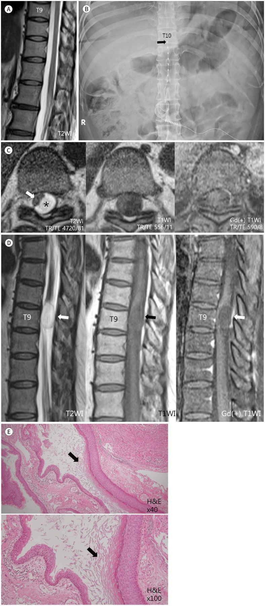
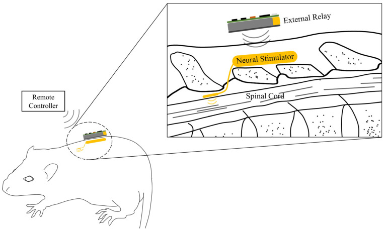
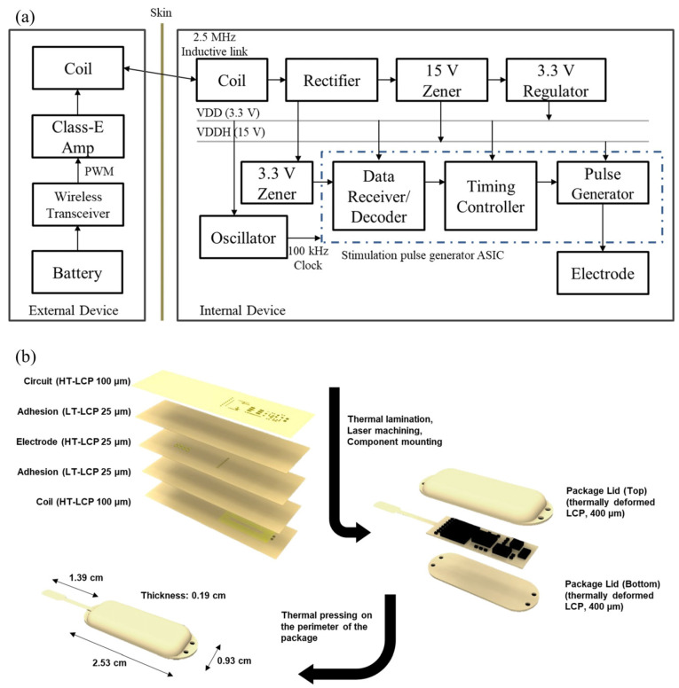
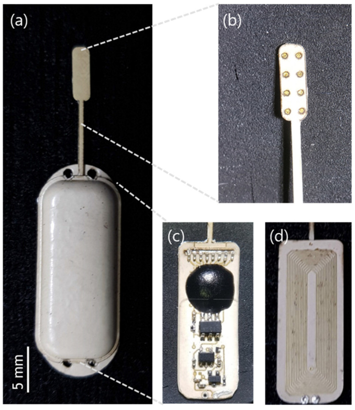
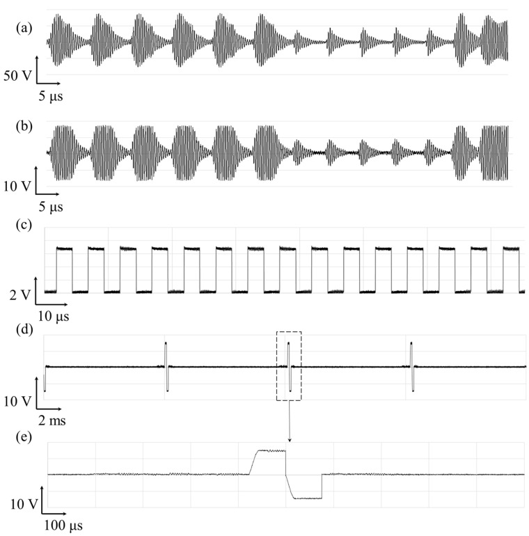
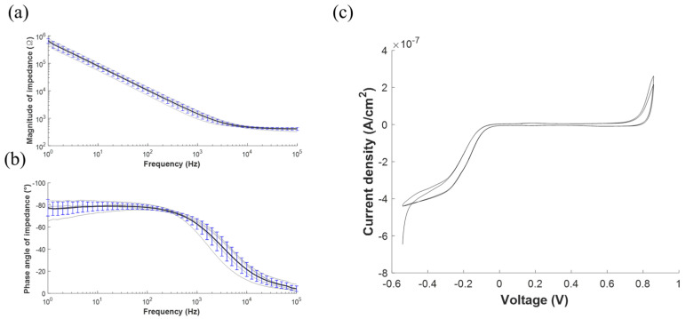
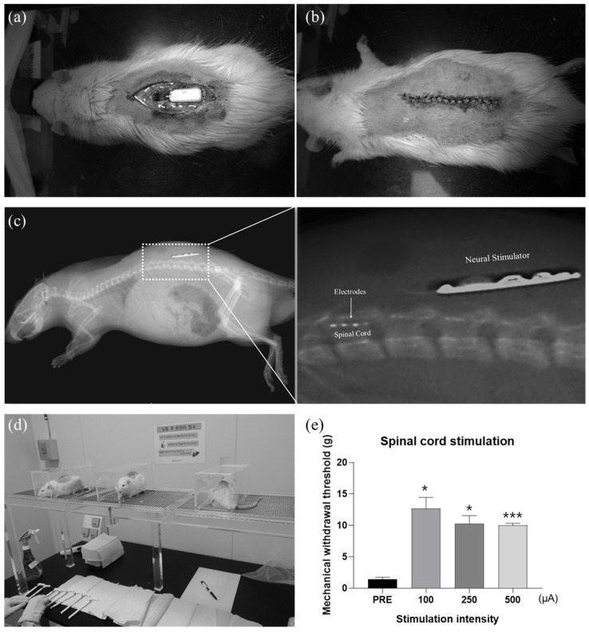
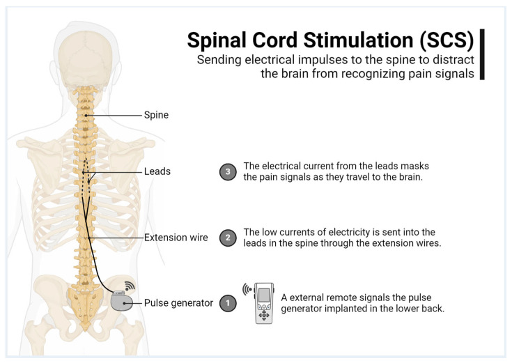
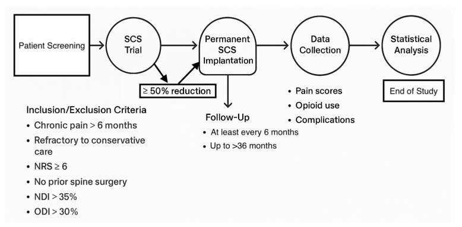
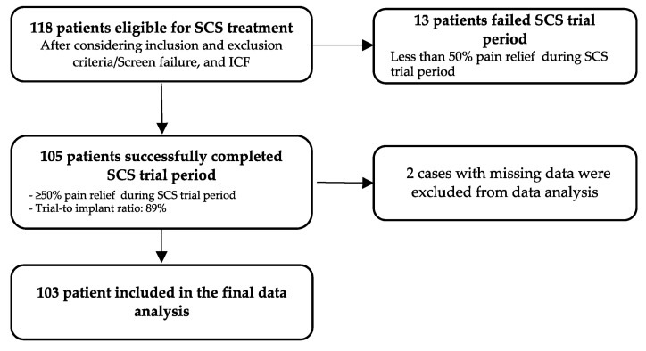

# Case Prep: Spinal Cord Stimulator (SCS) Placement

---

<!-- BEGIN CASE SNAPSHOT -->

## Case / Approach Snapshot

- **Anatomy at risk:** dorsal epidural space, dura, spinal cord/conus/cauda equina, segmental vessels and epidural venous plexus, prior laminectomy scar, lead entry level, fascial anchor site, tunneling tract, IPG pocket, and skin envelope.
- **Operative steps:** confirm neuropathic pain indication and successful trial, map painful territory to target level, choose percutaneous versus paddle lead, access epidural space safely, confirm coverage/impedances, anchor/tunnel without tension, create an IPG pocket, and program with migration/infection prevention.
- **Rescue plans:** epidural hematoma, dural puncture/CSF leak, lead migration or poor coverage, cord/root injury, infection requiring explant, IPG pocket pain/seroma, MRI incompatibility, anticoagulation conflict, and failed trial or loss of benefit.
- **Figures:** review [Figures, Imaging & Video](#figures-imaging--video) and the [Curated Image Set](#curated-image-set); embedded local figures should remain open-access, public-domain, or otherwise reusable with attribution.
- **Papers:** review [High-Yield Literature](#high-yield-literature) for seminal sources, modern reviews, and outcome data specific to this page.
- **Textbook cross-checks:** use [Textbook Cross-Checks](#textbook-cross-checks) and the [Source Crosswalk](../../resources/source-crosswalk.md) to cite copyrighted textbooks/atlases while summarizing in original words.

<!-- END CASE SNAPSHOT -->

## One-Liner
[Age]yo [M/F] with [failed back surgery syndrome / CRPS / painful diabetic neuropathy / refractory neuropathic limb pain] planned for spinal cord stimulator [trial / permanent percutaneous lead / paddle lead via laminotomy] implantation.

---

## Figures, Imaging & Video

**🎥 Operative video** — [search operative video on YouTube ▸](https://www.youtube.com/results?search_query=spinal+cord+stimulator+surgery) · [The Neurosurgical Atlas ▸](https://www.neurosurgicalatlas.com)

[Neurosurgical Atlas](https://www.neurosurgicalatlas.com) · [Radiopaedia](https://radiopaedia.org/search?q=spinal%20cord%20stimulator&scope=all) · [PubMed Central](https://www.ncbi.nlm.nih.gov/pmc/?term=spinal+cord+stimulator+implantation) — operative figures © linked; see [media-sources.md](../../resources/media-sources.md)

---

<!-- BEGIN TEXTBOOK CROSS-CHECKS -->

## Textbook Cross-Checks

- **Spine anatomy and biomechanics:** Benzel Spine; Textbook of Spinal Surgery; Surgical Anatomy and Techniques to the Spine — confirm levels, approach-side anatomy, neural/vascular structures at risk, alignment, stability, and fixation rationale.
- **Technique sequence:** Youmans and Winn; Benzel Spine; Greenberg — review positioning, localization, exposure, decompression, instrumentation, fusion/reconstruction, and closure in original language.
- **Complication rescue:** Benzel Spine; Greenberg; Youmans and Winn — cross-check durotomy, neurologic change, vascular injury, wrong-level prevention, infection, implant failure, and postoperative restrictions.
- **Copyright-safe use:** cite these sources as private cross-checks, then write the guide content in original words; do not re-host textbook pages, figures, tables, or board-review card material. See [Source Crosswalk & Copyright-Safe Use](../../resources/source-crosswalk.md).

<!-- END TEXTBOOK CROSS-CHECKS -->

<!-- BEGIN CURATED LITERATURE -->

## High-Yield Literature

- **Complications of Spinal Cord Stimulator Trials and Implants: A Review** — Garg I. Current pain and headache reports 2023. [PubMed](https://pubmed.ncbi.nlm.nih.gov/38010489/)
- **A Comprehensive Review of Spinal Cord Stimulator Infections** — Cherkalin D. Current pain and headache reports 2022. [PubMed](https://pubmed.ncbi.nlm.nih.gov/36454429/)
- **Anticipating and preventing complications in spinal cord stimulator implantation** — Falowski SM. Expert review of medical devices 2023. [PubMed](https://pubmed.ncbi.nlm.nih.gov/36974624/)
- **Differential target multiplexed spinal cord stimulator: a review of preclinical/clinical data and hardware advancement** — Murphy MZ. Pain management 2023. [PubMed](https://pubmed.ncbi.nlm.nih.gov/37249006/)
- **Spinal cord stimulator therapy** — Forrest DM. Journal of perianesthesia nursing : official journal of the American Society of PeriAnesthesia Nurses 1996. [PubMed](https://pubmed.ncbi.nlm.nih.gov/8970301/)
- **Spinal Cord Stimulator Implant(Archived)** — Dydyk AM. 2026. [PubMed](https://pubmed.ncbi.nlm.nih.gov/32310454/)
- **Spinal cord stimulator implantation with immediate post-operative paraplegia: Case report** — Mamun N. Interventional pain medicine 2023. [PubMed](https://pubmed.ncbi.nlm.nih.gov/39238658/)
- **Meralgia Paresthetica** — Solomons JNT. Current pain and headache reports 2022. [PubMed](https://pubmed.ncbi.nlm.nih.gov/35622311/)
- **Spinal Cord Stimulator Infection: Approach to Diagnosis, Management, and Prevention** — Esquer Garrigos Z. Clinical infectious diseases : an official publication of the Infectious Diseases Society of America 2020. [PubMed](https://pubmed.ncbi.nlm.nih.gov/31598641/)
- **Factors Associated With Same Day Discharge Post-Spinal Cord Stimulator Placement** — Beletsky A. Pain physician 2024. [PubMed](https://pubmed.ncbi.nlm.nih.gov/38324795/)

<!-- END CURATED LITERATURE -->

---

<!-- BEGIN CURATED IMAGE SET -->

## Curated Image Set

Open-access figures are embedded from PubMed Central articles and kept unique to this guide.

*Fig. 1. An intradural extramedullary epidermoid cyst formed at the T9 after spinal cord stimulator insertion in a 50-year-old female.A. The T2-weighted (TR/TE 3100/105) sagittal MRI image... Source: [척수 자극기 삽입술을 받았던 환자에게 드물게 생긴 흉추부 경막내 표피양 낭종: 증례 보고](https://pmc.ncbi.nlm.nih.gov/articles/PMC9514589/) — Journal of the Korean Society of Radiology 2022; CC BY-NC.*

*Figure 1. A fully implantable neural stimulation system. The neural stimulator consisting of an implantable pulse generator and stimulation electrodes are located outside of the vertebra and at... Source: [A Fully Implantable Miniaturized Liquid Crystal Polymer (LCP)-Based Spinal Cord Stimulator for Pain Control](https://pmc.ncbi.nlm.nih.gov/articles/PMC8778878/) — Sensors (Basel, Switzerland) 2022; CC BY.*

*Figure 2. (a) A block diagram of the neural stimulator and the external relay. The internal device receives power and data from the external relay through 2.5 MHz inductive link to generate a... Source: [A Fully Implantable Miniaturized Liquid Crystal Polymer (LCP)-Based Spinal Cord Stimulator for Pain Control](https://pmc.ncbi.nlm.nih.gov/articles/PMC8778878/) — Sensors (Basel, Switzerland) 2022; CC BY.*

*Figure 3. (a) Fabricated implantable neural stimulator; (b) Electrode part; (c) Circuit layer; and (d) coil layer in the package. Source: [A Fully Implantable Miniaturized Liquid Crystal Polymer (LCP)-Based Spinal Cord Stimulator for Pain Control](https://pmc.ncbi.nlm.nih.gov/articles/PMC8778878/) — Sensors (Basel, Switzerland) 2022; CC BY.*

*Figure 4. Exemplar waveform of the wireless operation of spinal cord stimulator and its stimulation current pulse generation. The voltage measured across the (a) the transmitter coil and (b) the... Source: [A Fully Implantable Miniaturized Liquid Crystal Polymer (LCP)-Based Spinal Cord Stimulator for Pain Control](https://pmc.ncbi.nlm.nih.gov/articles/PMC8778878/) — Sensors (Basel, Switzerland) 2022; CC BY.*

*Figure 5. Electrochemical characterization of the stimulation electrodes array. (a) Electrochemical impedance spectroscopy (EIS) measurements as represented by the mean (black line) and the... Source: [A Fully Implantable Miniaturized Liquid Crystal Polymer (LCP)-Based Spinal Cord Stimulator for Pain Control](https://pmc.ncbi.nlm.nih.gov/articles/PMC8778878/) — Sensors (Basel, Switzerland) 2022; CC BY.*

*Figure 6. (a) Surgical implantation of a neural stimulator in the rat model of neuropathic pain. (b) Photograph of the rat after surgery, and (c) confirmation of implantation using X-ray images.... Source: [A Fully Implantable Miniaturized Liquid Crystal Polymer (LCP)-Based Spinal Cord Stimulator for Pain Control](https://pmc.ncbi.nlm.nih.gov/articles/PMC8778878/) — Sensors (Basel, Switzerland) 2022; CC BY.*

*Figure 1. Spinal cord stimulation explained. Source: [Uncomfortable Paresthesia and Dysesthesia Following Tonic Spinal Cord Stimulator Implantation](https://pmc.ncbi.nlm.nih.gov/articles/PMC12190327/) — Brain Sciences 2025; CC BY.*

*Figure 2. Study timeline. Source: [Uncomfortable Paresthesia and Dysesthesia Following Tonic Spinal Cord Stimulator Implantation](https://pmc.ncbi.nlm.nih.gov/articles/PMC12190327/) — Brain Sciences 2025; CC BY.*

*Figure 3. Selection of the sample. Source: [Uncomfortable Paresthesia and Dysesthesia Following Tonic Spinal Cord Stimulator Implantation](https://pmc.ncbi.nlm.nih.gov/articles/PMC12190327/) — Brain Sciences 2025; CC BY.*

<!-- END CURATED IMAGE SET -->

---

## History of Present Illness
- Chief complaint: Chronic refractory **neuropathic pain** (limb-predominant), failed conservative/surgical management
- **Indications:** failed back surgery syndrome (radicular > axial), CRPS, painful diabetic peripheral neuropathy, ischemic/anginal pain (selected)
- **Successful trial required before permanent** (≥50% pain relief over a percutaneous trial period)
- **Psychological evaluation** (candidacy — screen for untreated psychiatric illness, secondary gain, unrealistic expectations)

---

## Past Medical History
- Prior spine surgery (epidural scar — may favor paddle/laminotomy), bleeding disorder/anticoagulation, infection risk, **MRI needs in future** (device MRI-conditionality), pacemaker/ICD
- **Psychological clearance**, opioid use
- Standard PMH

---

## Imaging Review
### MRI / CT spine
- Epidural space patency (scar/stenosis affecting lead passage), target level for lead (dorsal columns covering painful dermatomes — e.g., T8-T10 epidural for leg pain)
### Fluoroscopy (intraop)
- Lead positioning

---

## Labs
- CBC, **Coags (epidural — bleeding/hematoma risk)**, BMP

---

## Neurological Examination
- Pain mapping (dermatomal), motor/sensory baseline, document

---

## Surgical Planning

### Two-Stage Process
1. **Trial:** percutaneous epidural lead(s), externalized, trial stimulation for ~5-7 days; proceed to permanent only if ≥50% relief
2. **Permanent implant:** percutaneous leads or **surgical paddle lead** (laminotomy — better for scarred epidural space, more stable, broader coverage) + **IPG (pulse generator)** in a subcutaneous pocket

### Candidate Selection
- Pain should be predominantly neuropathic and anatomically plausible; diffuse nociplastic pain, untreated mechanical compression, and uncontrolled psychiatric/substance-use issues predict poor results.
- Confirm conservative therapy failure, medication optimization, imaging correlation, psychological clearance, and realistic goals: function, sleep, opioid reduction, and pain reduction rather than cure.
- Screen for infection risk, anticoagulation needs, diabetes control, smoking, skin quality, and ability to manage/recharge the device.
- Document baseline pain map, neurologic exam, Oswestry/functional measures, opioid dose, and trial-response criteria before permanent implantation.
- For diabetic neuropathy or CRPS, include limb exam, ulcer/infection status, autonomic changes, and whether pain distribution matches a feasible stimulation field.

### Percutaneous vs Paddle Lead

| Factor | Percutaneous lead | Paddle lead |
|--------|-------------------|-------------|
| Implant burden | Less invasive, needle-based | Laminotomy/laminectomy exposure |
| Migration risk | Higher | Lower with broad paddle/anchoring |
| Epidural scar/stenosis | May be hard to pass | Direct exposure can bypass scar |
| Coverage | Flexible multiple cylindrical leads | Broad directional coverage |
| Removal/revision | Usually easier | Surgical revision |
| Anesthesia | Often local/sedation for mapping | Often general |

Choose the lead style based on pain distribution, prior surgery/scar, stenosis, trial result, expected migration risk, and whether paresthesia mapping is needed.

### Position
- Prone, fluoroscopy; **local + sedation (awake for percutaneous trial mapping — patient reports paresthesia coverage)** or general (paddle, modern paresthesia-free waveforms)

### Key Surgical Steps (Percutaneous)
1. Fluoroscopic localization; **Tuohy needle into the epidural space** (paramedian, loss of resistance) at a level below the target
2. Thread the **percutaneous lead** cephalad in the **dorsal epidural space (midline over dorsal columns)** to the target level (e.g., T8-T10 for legs)
3. **Intraoperative stimulation testing** (awake) — confirm paresthesia/coverage over the painful area; reposition for optimal coverage (or use anatomic placement with paresthesia-free waveforms)
4. Anchor lead to fascia (permanent), tunnel to **IPG pocket** (flank/buttock), connect
5. **Paddle lead (laminotomy):** small laminotomy at the target level, slide paddle into dorsal epidural space under direct vision, test, anchor, tunnel to IPG
6. Confirm impedances/stimulation, closure

### Level and Coverage Planning
- Lower-extremity/radicular pain commonly targets midline dorsal column coverage around T8-T10, but final level depends on trial mapping and waveform platform.
- Back-dominant pain may require different programming strategies and is less reliably treated than limb-predominant neuropathic pain.
- Cervical SCS for upper-extremity pain requires extra care with cervical stenosis, cord proximity, neck motion, and lead anchoring.
- Paresthesia-free waveforms reduce the need for awake mapping but do not remove the need for correct anatomic placement, impedance testing, and trial-response documentation.
- IPG pocket should match body habitus, beltline, sleep position, charging ergonomics, and future surgical access; avoid pressure points and thin infected/irradiated skin.

### Critical Anatomy & Structures at Risk
1. **Spinal cord / dura** — epidural lead (avoid dural puncture/cord injury; never force)
2. **Epidural space** — **epidural hematoma** (bleeding/anticoagulation) → cord compression emergency
3. Nerve roots, scar tissue (paddle for scarred space)

### Equipment
- SCS system (leads — percutaneous/paddle, IPG, anchors, tunneler), Tuohy needle, fluoroscopy
- Programmer/testing equipment, laminotomy set (paddle)

### Anesthesia
- **Local + sedation** (awake testing for percutaneous) or general (paddle); prone; antibiotics (implant — infection prevention bundle)

### Potential Complications
1. **Epidural hematoma** (cord compression — emergency), dural puncture/CSF leak/headache, cord/nerve injury
2. **Lead migration** (loss of coverage — more with percutaneous), lead fracture, IPG site pain/seroma
3. **Infection** (implant — may require explant), inadequate pain relief (trial mitigates), hardware malfunction
4. MRI incompatibility considerations

### Intraoperative Rescue
- **Dural puncture:** do not pass the lead intrathecally; choose another level if needed, manage headache risk, and document CSF return.
- **Lead will not pass:** stop forcing; reassess epidural scarring/stenosis, redirect under fluoro, use a different entry, or convert to paddle lead if appropriate.
- **New neurologic symptoms:** stop advancement, remove/reposition lead, obtain urgent imaging if persistent, and treat epidural hematoma as a decompression emergency.
- **Poor coverage:** re-map lead laterality/level, add a second lead, change waveform strategy, or abort permanent implantation if trial goals cannot be reproduced.
- **High impedance or hardware fault:** inspect connections, set screws, lead damage, and pocket strain before closure.

---

## Operative Note Template
**Preoperative Diagnosis:** Chronic refractory neuropathic pain ([failed back surgery syndrome / CRPS / diabetic neuropathy]) [with successful SCS trial]

**Postoperative Diagnosis:** Same

**Procedure:** Spinal cord stimulator [trial lead placement / permanent percutaneous lead(s) and IPG / paddle lead via laminotomy and IPG]

**Surgeon / Assistant:**
**Anesthesia:** [Local + sedation (awake for percutaneous mapping) / general]
**EBL / Fluids:** Minimal
**Adjuncts:** Fluoroscopy, Tuohy needle, intraoperative stimulation/programmer
**Implants:** SCS lead(s) [percutaneous/paddle], IPG, anchors
**Complications:** None

**Indications:** [Age]yo [M/F] with chronic neuropathic [limb] pain refractory to conservative/surgical care, with psychological clearance and [≥50% relief on trial]. Risks (epidural hematoma, lead migration, infection) discussed.

**Description of Procedure:** After consent and time-out, [local with sedation] was given and the patient positioned prone with fluoroscopy. [Percutaneous: a Tuohy needle accessed the epidural space (paramedian, loss of resistance) and the lead(s) were threaded cephalad in the dorsal midline epidural space to [T8-T10]; **intraoperative stimulation confirmed paresthesia coverage over the painful region** with repositioning as needed.] [Paddle: a small laminotomy at the target level allowed the paddle lead to be placed in the dorsal epidural space under direct vision and tested.] Leads were anchored to fascia, tunneled to a subcutaneous **IPG pocket** [flank/buttock], and connected; impedances/stimulation were confirmed.

Closure was performed. The patient was monitored for epidural hematoma (new deficit) and instructed on activity restriction to limit lead migration.

---

## Postoperative Plan
- Outpatient/short stay; **neuro checks (epidural hematoma — new deficit → emergent MRI/decompression)**
- Trial: external programming, pain diary; assess ≥50% relief at end of trial → decide on permanent
- Permanent: incision care, **activity restriction (limit bending/reaching/lifting to reduce lead migration x weeks)**, device programming (pain/rep)
- Antibiotics per protocol, infection monitoring
- Pain management/device clinic follow-up; document MRI-conditionality for the patient

### Follow-Up Pearls
- Separate surgical pain from stimulation efficacy during the first programming visits; early disappointment can be pocket/incisional pain, not true therapy failure.
- Loss of benefit after initial success is lead migration until proven otherwise; compare AP/lateral radiographs with immediate postoperative baseline.
- Fever, drainage, pocket erythema, or deep tenderness around implanted hardware should trigger a low threshold for infectious workup; deep SCS infection often requires explant.
- Before any future MRI or surgery, verify exact device model, lead configuration, MRI-conditional rules, and whether the system must be placed in MRI mode.
- Document driving/work restrictions when paresthesia changes, sedation/opioids, or new programming adjustments could distract the patient.
