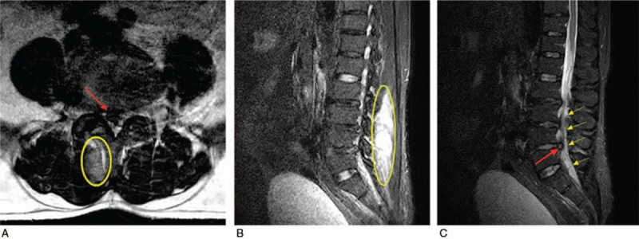
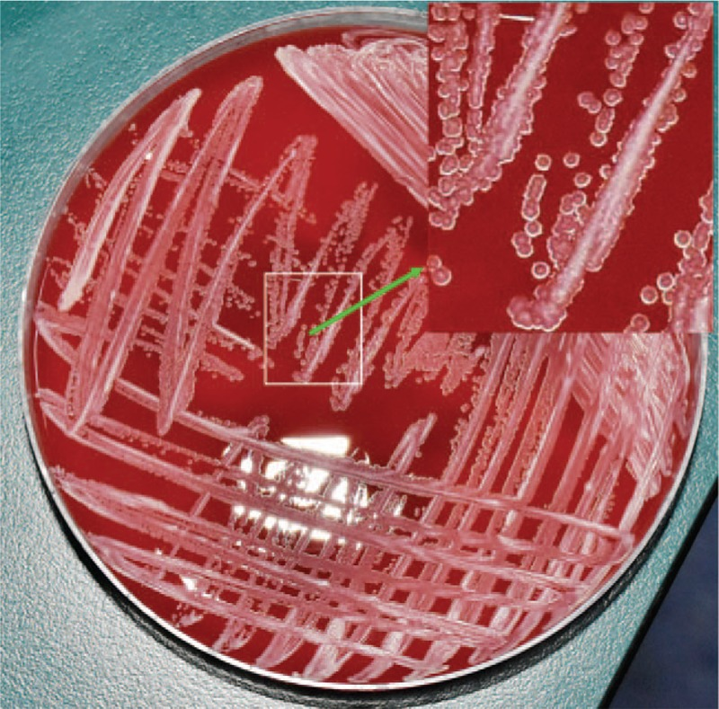
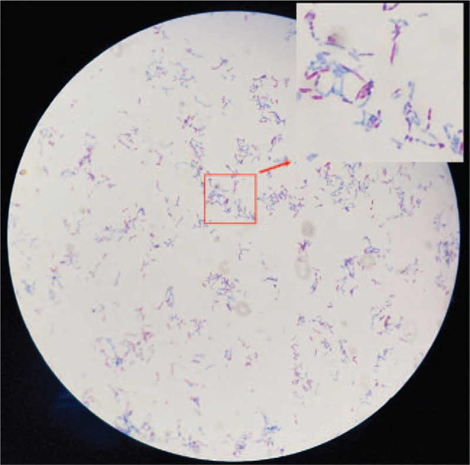
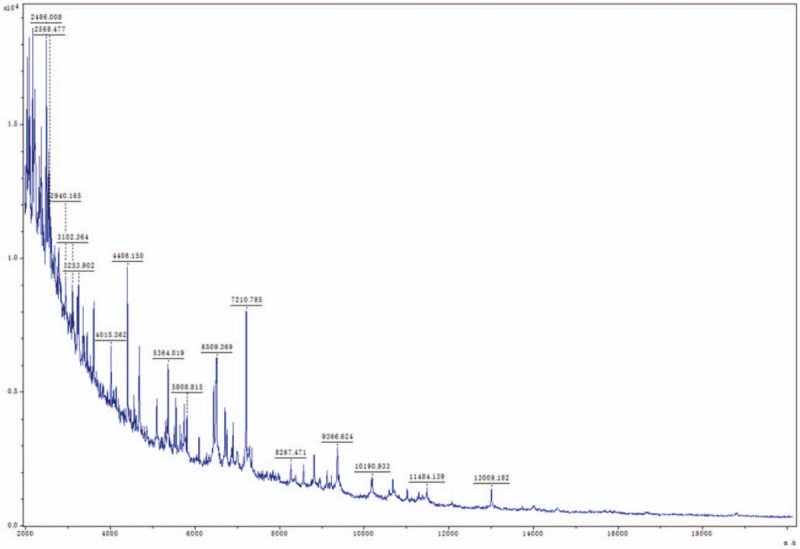
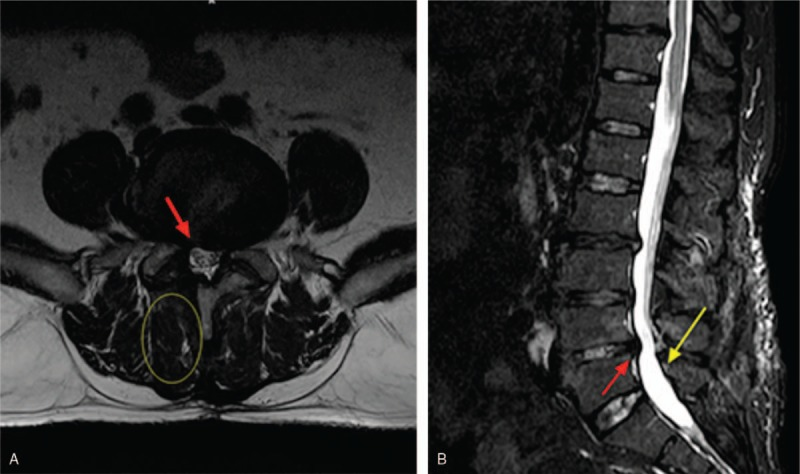
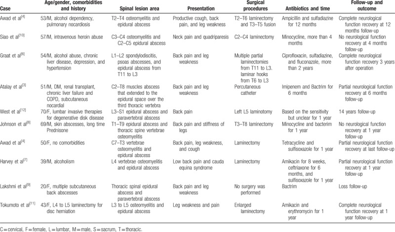
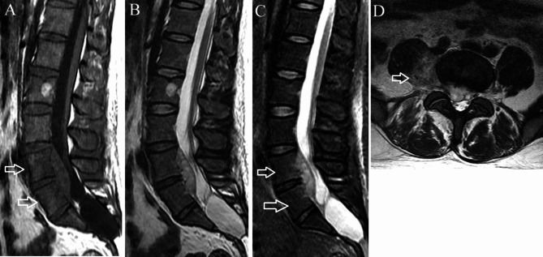
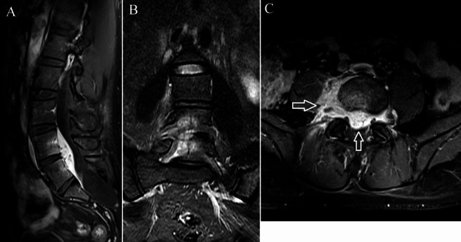
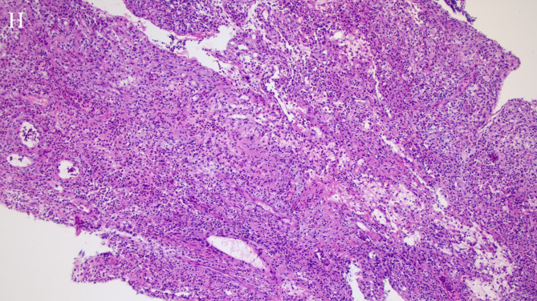
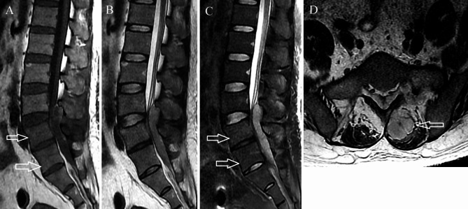

# Case Prep: Spinal Epidural Abscess — Decompression & Drainage

---

<!-- BEGIN CASE SNAPSHOT -->

## Case / Approach Snapshot

- **Anatomy at risk:** the named neural, vascular, bony, CSF, and soft-tissue structures that determine the safe corridor and likely morbidity.
- **Operative steps:** confirm indication and imaging, position and expose deliberately, complete the core surgical maneuver, verify the result, and close with a complication-prevention plan; use the detailed operative sequence and approach notes below as the step-by-step source.
- **Rescue plans:** bleeding, neurologic change, wrong target or level, CSF leak, infection, hardware or reconstruction failure, and a staged or alternate-treatment plan.
- **Figures:** review [Figures, Imaging & Video](#figures-imaging--video) and the [Curated Image Set](#curated-image-set); embedded local figures should remain open-access, public-domain, or otherwise reusable with attribution.
- **Papers:** review [High-Yield Literature](#high-yield-literature) for seminal sources, modern reviews, and outcome data specific to this page.
- **Textbook cross-checks:** use [Textbook Cross-Checks](#textbook-cross-checks) and the [Source Crosswalk](../../resources/source-crosswalk.md) to cite copyrighted textbooks/atlases while summarizing in original words.

<!-- END CASE SNAPSHOT -->

## One-Liner
[Age]yo [M/F] with a [cervical/thoracic/lumbar] spinal epidural abscess at [levels] presenting with [back pain, fever, neurological deficit] planned for [level] laminectomy for decompression and drainage [± instrumented fusion].

---

## Figures, Imaging & Video

**🎥 Operative video** — [search operative video on YouTube ▸](https://www.youtube.com/results?search_query=spinal+epidural+abscess+surgery) · [The Neurosurgical Atlas ▸](https://www.neurosurgicalatlas.com)

[Neurosurgical Atlas](https://www.neurosurgicalatlas.com) · [AO Surgery Reference](https://surgeryreference.aofoundation.org) · [Radiopaedia](https://radiopaedia.org/search?q=spinal%20epidural%20abscess&scope=all) · [PubMed Central](https://www.ncbi.nlm.nih.gov/pmc/?term=spinal+epidural+abscess+management) — operative figures © linked; see [media-sources.md](../../resources/media-sources.md)

---

<!-- BEGIN TEXTBOOK CROSS-CHECKS -->

## Textbook Cross-Checks

- **Spine anatomy and biomechanics:** Benzel Spine; Textbook of Spinal Surgery; Surgical Anatomy and Techniques to the Spine — confirm levels, approach-side anatomy, neural/vascular structures at risk, alignment, stability, and fixation rationale.
- **Technique sequence:** Youmans and Winn; Benzel Spine; Greenberg — review positioning, localization, exposure, decompression, instrumentation, fusion/reconstruction, and closure in original language.
- **Complication rescue:** Benzel Spine; Greenberg; Youmans and Winn — cross-check durotomy, neurologic change, vascular injury, wrong-level prevention, infection, implant failure, and postoperative restrictions.
- **Copyright-safe use:** cite these sources as private cross-checks, then write the guide content in original words; do not re-host textbook pages, figures, tables, or board-review card material. See [Source Crosswalk & Copyright-Safe Use](../../resources/source-crosswalk.md).

<!-- END TEXTBOOK CROSS-CHECKS -->

<!-- BEGIN CURATED LITERATURE -->

## High-Yield Literature

- **Management of Staphylococcus aureus Bacteremia: A Review** — Tong SYC. JAMA 2025. [PubMed](https://pubmed.ncbi.nlm.nih.gov/40193249/)
- **Spinal epidural abscess** — Johnson KG. Critical care nursing clinics of North America 2013. [PubMed](https://pubmed.ncbi.nlm.nih.gov/23981455/)
- **Spinal epidural abscess** — Rigamonti D. The New England journal of medicine 2007. [PubMed](https://pubmed.ncbi.nlm.nih.gov/17290514/)
- **Epidural Abscess** — Akhondi H. 2026. [PubMed](https://pubmed.ncbi.nlm.nih.gov/30571071/)
- **Spinal epidural abscess in adults** — Bluman EM. The Journal of the American Academy of Orthopaedic Surgeons 2004. [PubMed](https://pubmed.ncbi.nlm.nih.gov/15161168/)
- **Spinal epidural abscess** — Verner EF. The Medical clinics of North America 1985. [PubMed](https://pubmed.ncbi.nlm.nih.gov/3990440/)
- **Spinal epidural abscess due to acute pyelonephritis** — Scalia G. Surgical neurology international 2022. [PubMed](https://pubmed.ncbi.nlm.nih.gov/35509571/)
- **Successful Treatment of Pediatric Holo-Spinal Epidural Abscess With Percutaneous Drainage** — Ammar AA. Cureus 2022. [PubMed](https://pubmed.ncbi.nlm.nih.gov/35673318/)
- **Aggregatibacter aphrophilus spinal epidural abscess** — Altdorfer A. BMJ case reports 2020. [PubMed](https://pubmed.ncbi.nlm.nih.gov/32675123/)
- **Spinal epidural abscess: a report of 40 cases and review** — Nussbaum ES. Surgical neurology 1992. [PubMed](https://pubmed.ncbi.nlm.nih.gov/1359657/)

<!-- END CURATED LITERATURE -->

---

<!-- BEGIN CURATED IMAGE SET -->

## Curated Image Set

Open-access figures are embedded from PubMed Central articles and kept unique to this guide.

*Figure 1. The urgent imaging examination. Axial (A) MRI shows L4 to L5 lumbar disc herniation, and sagittal (B and C) MRIs show epidural and paravertebral abscesses at the L3 to S1 vertebral... Source: [Nocardial spinal epidural abscess with lumbar disc herniation](https://pmc.ncbi.nlm.nih.gov/articles/PMC6310552/) — Medicine 2018; CC BY-NC-ND.*

*Figure 2. Yellowish colonies were found on the blood plate medium. Source: [Nocardial spinal epidural abscess with lumbar disc herniation](https://pmc.ncbi.nlm.nih.gov/articles/PMC6310552/) — Medicine 2018; CC BY-NC-ND.*

*Figure 3. The acid-fast stain showed partially acid-fast bacilli. Source: [Nocardial spinal epidural abscess with lumbar disc herniation](https://pmc.ncbi.nlm.nih.gov/articles/PMC6310552/) — Medicine 2018; CC BY-NC-ND.*

*Figure 4. The bacterial protein spectra obtained were analyzed by MALDI-TOF-MS. MALDI-TOF-MS = matrix-assisted laser desorption/ionization time of flight mass spectrometry. Source: [Nocardial spinal epidural abscess with lumbar disc herniation](https://pmc.ncbi.nlm.nih.gov/articles/PMC6310552/) — Medicine 2018; CC BY-NC-ND.*

*Figure 5. At 6-month follow-up, axial (A) and sagittal (B) MRIs show herniated lumbar disc has been removed and no residual abscess. (Red arrow indicates herniated disc has been removed. Yellow... Source: [Nocardial spinal epidural abscess with lumbar disc herniation](https://pmc.ncbi.nlm.nih.gov/articles/PMC6310552/) — Medicine 2018; CC BY-NC-ND.*

*Figure 6. Source: [Nocardial spinal epidural abscess with lumbar disc herniation: A case report and review of literature](https://pmc.ncbi.nlm.nih.gov/articles/PMC6310552/) — Medicine (Baltimore). 2018 Dec 10;97(49):e13541. doi: 10.1097/MD.0000000000013541; CC BY-NC-ND.*

*Fig. 1. Phlegmonous stage primary L4-5 spinal epidural abscess in a 37-year-old man. (A) Sagittal T1-weighted imaging shows a fusiform homogeneously isointense lesion ventral to the thecal sac... Source: [Primary spinal epidural abscess: magnetic resonance imaging characteristics and diagnosis](https://pmc.ncbi.nlm.nih.gov/articles/PMC11487751/) — BMC Medical Imaging 2024; CC BY-NC-ND.*

*Fig. 2. Contrast-enhanced T1-weighted imaging of the same patient as in Fig. 1. (A) The abscess and the L4 and L5 vertebral bodies exhibit enhancement on the sagittal imaging. (B) Coronal... Source: [Primary spinal epidural abscess: magnetic resonance imaging characteristics and diagnosis](https://pmc.ncbi.nlm.nih.gov/articles/PMC11487751/) — BMC Medical Imaging 2024; CC BY-NC-ND.*

*Fig. 5. Hematoxylin-eosin staining of a histopathologic specimen shows chronic granulomatous inflammation and fibrinoid exudation. A large number of neutrophils, plasma cells, lymphocyte... Source: [Primary spinal epidural abscess: magnetic resonance imaging characteristics and diagnosis](https://pmc.ncbi.nlm.nih.gov/articles/PMC11487751/) — BMC Medical Imaging 2024; CC BY-NC-ND.*

*Fig. 3. Abscess stage primary L3-5 spinal epidural abscess in a 41-year-old man. (A) On axial T1-weighted imaging, the abscess is hypointense and dorsal to thecal sac. Mild vertebral body edema... Source: [Primary spinal epidural abscess: magnetic resonance imaging characteristics and diagnosis](https://pmc.ncbi.nlm.nih.gov/articles/PMC11487751/) — BMC Medical Imaging 2024; CC BY-NC-ND.*

<!-- END CURATED IMAGE SET -->

---

## History of Present Illness
- Chief complaint: **Classic triad** (present in minority): back pain + fever + neurological deficit
- Severe focal spinal pain, fever/sepsis, progressive weakness/sensory change, bowel/bladder
- **Neurological deterioration can be rapid and irreversible → emergency**
- Risk factors: IV drug use, diabetes, immunocompromise, bacteremia/endocarditis, recent spinal procedure/injection, indwelling catheters
- Source of infection (skin, endocarditis, GU, dental)

---

## Past Medical History
- **IV drug use, diabetes, immunocompromise, endocarditis, recent procedure/injection**, indwelling lines, dialysis
- Anticoagulation
- Standard PMH

---

## Imaging Review
### MRI WITH CONTRAST (whole spine — skip lesions in ~10-15%)
- **Epidural collection** (rim-enhancing, T2 hyperintense), extent (levels), **cord/thecal compression**
- Phlegmon (enhancing, no drainable pus) vs frank abscess (drainable)
- **Associated discitis/osteomyelitis, paraspinal abscess**, vertebral destruction/instability
- Cord signal change (myelomalacia)

---

## Labs
- **Blood cultures (before antibiotics if possible)**, CBC (WBC), **ESR, CRP** (trend), BMP
- Coags, type and screen
- HIV, glucose/HbA1c, echocardiogram (endocarditis), urinalysis
- **Hold empiric antibiotics until cultures/biopsy if stable** — but do NOT delay if septic/deteriorating

---

## Neurological Examination
- Motor/sensory (level), reflexes, **sphincter**, gait, spinal tenderness; **serial exams** (rapid change)

---

## Surgical Planning

### Diagnosis & Indication
- **Surgical indications:** neurological deficit, progressive deficit, instability/bony destruction, failure of medical therapy, significant compression, frank pus
- **Medical management alone** (CT-guided aspiration + 6+ weeks IV antibiotics) selected only for: no/minimal deficit, no instability, identifiable organism, close monitoring (risk of rapid deterioration)
- Goals: decompress neural elements, **obtain cultures**, drain pus, stabilize if needed

### Position
- Prone, Mayfield/foam, per level; IONM (deficit cases)

### Key Surgical Steps
1. Level localization, posterior midline incision over the abscess
2. **Laminectomy** over the involved levels (decompress); for ventral abscess with osteomyelitis may need anterior/combined (debride infected body)
3. **Evacuate epidural pus**, irrigate copiously, **send cultures** (aerobic/anaerobic, fungal, AFB, Gram stain) and tissue for path
4. Decompress the thecal sac/cord across the abscess extent
5. **Debride** infected/necrotic tissue (epidural, disc, bone if osteomyelitis)
6. **Instrumentation/fusion:** if instability from bony destruction/debridement — instrument (titanium; placing hardware in infection is acceptable when needed for stability, with appropriate antibiotics)
7. Copious irrigation (± antibiotic irrigation), consider drain
8. Closure (watertight if durotomy)

### Critical Anatomy & Structures at Risk
1. **Spinal cord / thecal sac** — compressed, ischemic; gentle decompression
2. **Dura** (may be inflamed/adherent — CSF leak), nerve roots
3. Spinal stability (after debridement)

### Equipment
- Standard decompression set, **culture media (aerobic/anaerobic/fungal/AFB)**, copious irrigation
- Instrumentation (if fusion), drain, dural repair materials
- Microscope/loupes

### Monitoring
- SSEPs/MEPs (deficit cases)

### Anesthesia
- Sepsis management, MAP support (cord/septic), arterial line if unstable, type and screen, **coordinate antibiotic timing with cultures**

### Potential Complications
1. **Persistent/recurrent infection**, sepsis, neurological non-recovery (deficit duration-dependent)
2. CSF leak, hardware infection, instability/deformity
3. Recurrence (inadequate debridement/source control)

---

## Operative Note Template
**Preoperative Diagnosis:** [Cervical/thoracic/lumbar] spinal epidural abscess at [levels] [with neurological deficit]

**Postoperative Diagnosis:** Same

**Procedure:** [Level] laminectomy for decompression and drainage of spinal epidural abscess [with debridement and instrumented fusion]

**Surgeon / Assistant:**
**Anesthesia:** General endotracheal
**EBL / Fluids / Blood products:**
**Adjuncts:** Microscope/loupes, fluoroscopy; SSEP/MEP (deficit); **culture media (aerobic/anaerobic/fungal/AFB)**; MAP support
**Implants:** [Instrumentation if fusion]; drain
**Complications:** None

**Indications:** [Age]yo [M/F] with a spinal epidural abscess at [levels] causing [neurological deficit/instability], an emergent indication for decompression. Risk factors [IVDU/diabetes]. Risks discussed; cultures coordinated with antibiotic timing.

**Description of Procedure:** After consent and time-out, general anesthesia was induced (MAP support) and neuromonitoring established for the deficit. The patient was positioned prone; the level was localized. A laminectomy over the involved levels decompressed the thecal sac, and the **epidural pus was evacuated and sent for cultures (aerobic, anaerobic, fungal, AFB) and pathology**. Necrotic/infected tissue was debrided. [For instability from bony destruction/debridement, titanium instrumentation was placed.] The field was copiously irrigated and a drain placed.

Closure was performed. The patient was transferred with serial neuro exams, sepsis management, and ID-directed IV antibiotics planned per cultures.

---

## Postoperative Plan
- ICU/floor per status, **serial neuro checks** (recovery/deterioration), sepsis management
- **ID consult: organism-directed IV antibiotics (typically 6+ weeks)**, trend ESR/CRP
- Echocardiogram (endocarditis), source control, line management
- MRI for resolution if not improving; DVT prophylaxis
- Address risk factors (addiction medicine for IVDU, glucose control), rehab
- Follow-up imaging/labs; monitor for recurrence and spinal stability
