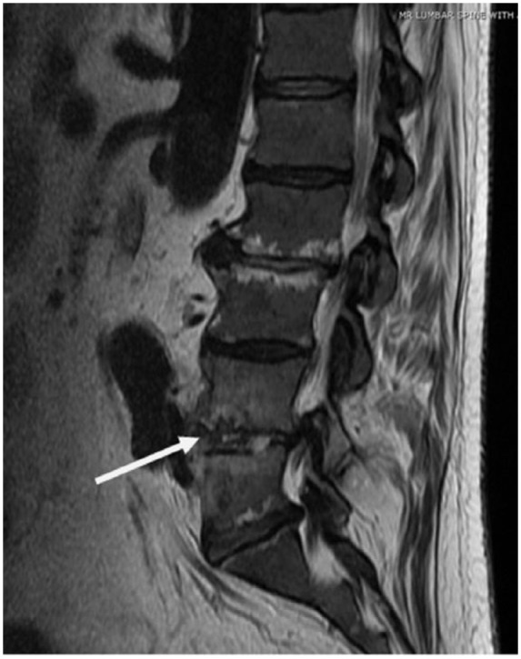
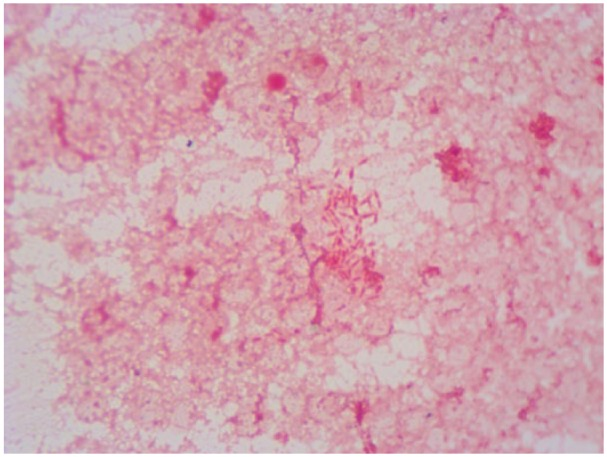
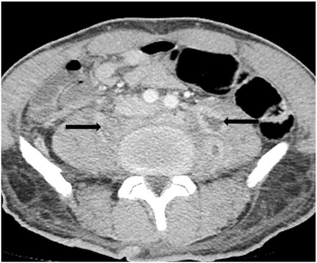
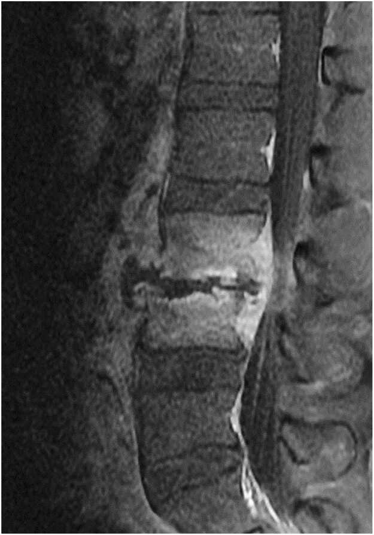
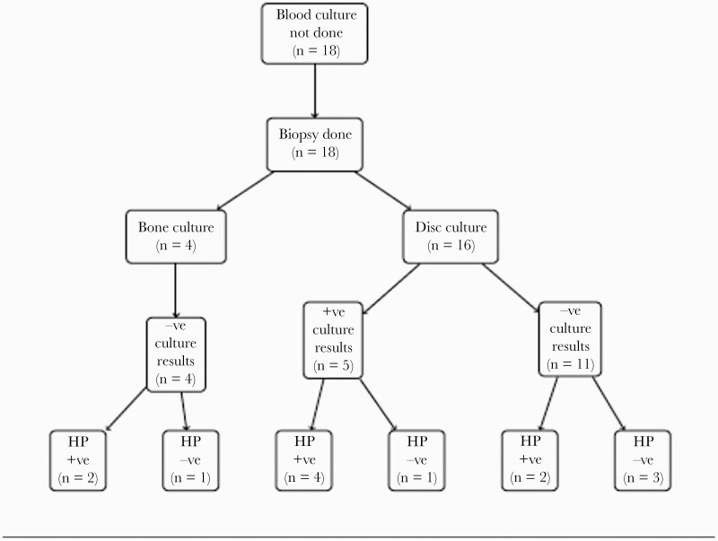
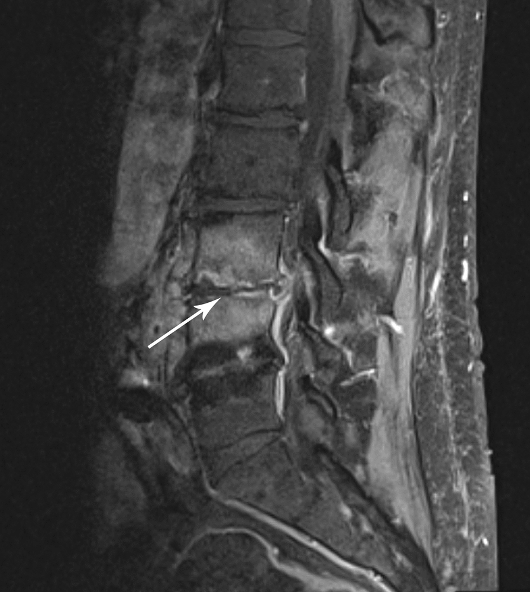
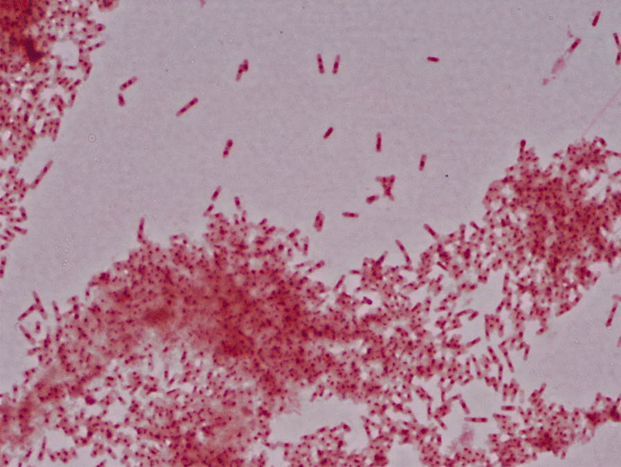
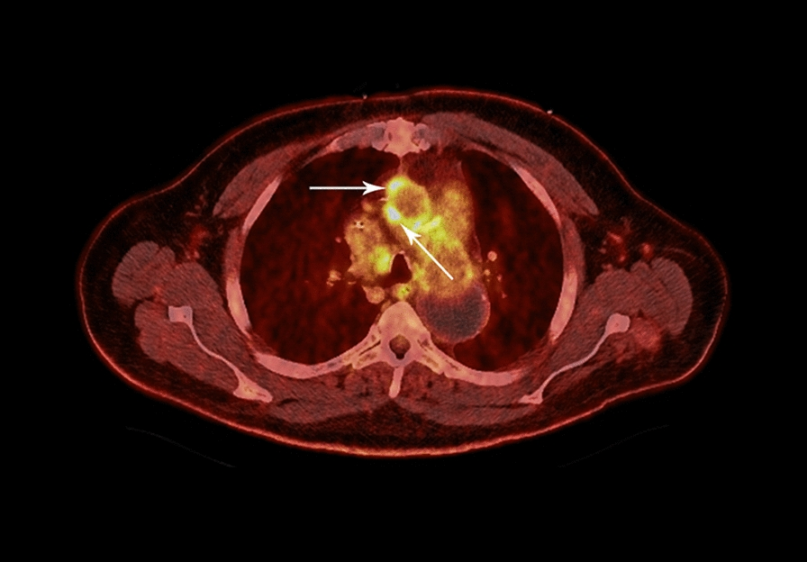
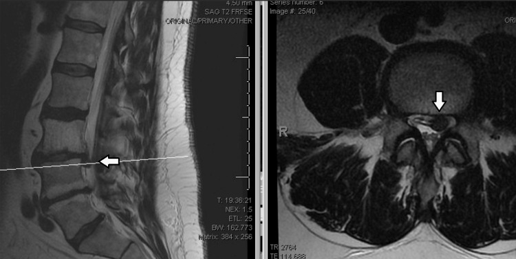

# Case Prep: Vertebral Osteomyelitis / Discitis — Surgical Management

---

<!-- BEGIN CASE SNAPSHOT -->

## Case / Approach Snapshot

- **Anatomy at risk:** the named neural, vascular, bony, CSF, and soft-tissue structures that determine the safe corridor and likely morbidity.
- **Operative steps:** confirm indication and imaging, position and expose deliberately, complete the core surgical maneuver, verify the result, and close with a complication-prevention plan; use the detailed operative sequence and approach notes below as the step-by-step source.
- **Rescue plans:** bleeding, neurologic change, wrong target or level, CSF leak, infection, hardware or reconstruction failure, and a staged or alternate-treatment plan.
- **Figures:** review [Figures, Imaging & Video](#figures-imaging--video) and the [Curated Image Set](#curated-image-set); embedded local figures should remain open-access, public-domain, or otherwise reusable with attribution.
- **Papers:** review [High-Yield Literature](#high-yield-literature) for seminal sources, modern reviews, and outcome data specific to this page.

<!-- END CASE SNAPSHOT -->

## One-Liner
[Age]yo [M/F] with [pyogenic/tuberculous] vertebral osteomyelitis-discitis at [T_/L_] [with epidural abscess / deformity / instability / deficit] planned for [biopsy / debridement, decompression, and reconstruction].

---

## Figures, Imaging & Video

**🎥 Operative video** — [search operative video on YouTube ▸](https://www.youtube.com/results?search_query=spondylodiscitis+surgery) · [The Neurosurgical Atlas ▸](https://www.neurosurgicalatlas.com)

> 🧭 **Operative approach:** [Posterior thoracolumbar approach](../approaches/posterior-thoracolumbar-approach.md) and [transthoracic approach](../approaches/transthoracic-approach.md) — posterior stabilization versus anterior debridement/reconstruction depends on level and column failure.

[Neurosurgical Atlas](https://www.neurosurgicalatlas.com) · [AO Surgery Reference](https://surgeryreference.aofoundation.org) · [Radiopaedia](https://radiopaedia.org/search?q=spondylodiscitis&scope=all) · [PubMed Central](https://www.ncbi.nlm.nih.gov/pmc/?term=vertebral+osteomyelitis+discitis) — operative figures © linked; see [media-sources.md](../../resources/media-sources.md)

---

<!-- BEGIN CURATED LITERATURE -->

## High-Yield Literature

- **Microbial etiology of vertebral osteomyelitis/discitis amid the opioid epidemic** — Ammerman SA. Journal of neurosurgery. Spine 2024. [PubMed](https://pubmed.ncbi.nlm.nih.gov/38996396/)
- **Posterior Fixation Without Debridement for Vertebral Body Osteomyelitis and Discitis: A 10-Year Retrospective Review** — Lindsay SE. International journal of spine surgery 2023. [PubMed](https://pubmed.ncbi.nlm.nih.gov/37586747/)
- **Clinical prediction for surgical versus nonsurgical interventions in patients with vertebral osteomyelitis and discitis** — Lee J. Journal of spine surgery (Hong Kong) 2024. [PubMed](https://pubmed.ncbi.nlm.nih.gov/38974494/)
- **Vertebral Osteomyelitis, Discitis, and Epidural Abscess: A Rare Complication of Cardiobacterium Endocarditis** — Yadava SK. Journal of investigative medicine high impact case reports 2018. [PubMed](https://pubmed.ncbi.nlm.nih.gov/30397618/)
- **Management Outcomes after Image-Guided Percutaneous Biopsy for Suspected Vertebral Osteomyelitis-Discitis** — Malik DG. AJNR. American journal of neuroradiology 2025. [PubMed](https://pubmed.ncbi.nlm.nih.gov/39715673/)
- **Preclinical models of vertebral osteomyelitis and associated infections: Current models and recommendations for study design** — Joyce K. JOR spine 2021. [PubMed](https://pubmed.ncbi.nlm.nih.gov/34337331/)
- **Enterobacter cloacae as sole organism responsible for vertebral osteomyelitis/discitis and vertebral collapse in a patient with intravenous drug abuse** — Khine S. BMJ case reports 2023. [PubMed](https://pubmed.ncbi.nlm.nih.gov/37553172/)
- **Management of Refractory Post-operative Osteomyelitis and Discitis: A Case Report** — DeLong CA. Cureus 2024. [PubMed](https://pubmed.ncbi.nlm.nih.gov/38374846/)
- **Case report: vertebral osteomyelitis/discitis as a complication of Capnocytophaga canimorsus bacteremia** — Nelson MJ. The Journal of emergency medicine 2008. [PubMed](https://pubmed.ncbi.nlm.nih.gov/17976760/)
- **Group B Streptococcus vertebral osteomyelitis-discitis in an immunocompetent adolescent** — Trehan I. The Pediatric infectious disease journal 2009. [PubMed](https://pubmed.ncbi.nlm.nih.gov/19483527/)

<!-- END CURATED LITERATURE -->

---

<!-- BEGIN CURATED IMAGE SET -->

## Curated Image Set

Open-access figures are embedded from PubMed Central articles and kept unique to this guide.

*Figure 1.. Magnetic resonance imaging: Discitis/osteomyelitis at L4-L5 with preservation of vertebral body height but an extension of infection into the epidural space, as well as anteriorly and... Source: [Vertebral Osteomyelitis, Discitis, and Epidural Abscess: A Rare Complication of Cardiobacterium Endocarditis](https://pmc.ncbi.nlm.nih.gov/articles/PMC6207954/) — Journal of Investigative Medicine High Impact Case Reports 2018; CC BY.*

*Figure 2.. Gram staining of vertebral biopsy, gram-negative rods. Source: [Vertebral Osteomyelitis, Discitis, and Epidural Abscess: A Rare Complication of Cardiobacterium Endocarditis](https://pmc.ncbi.nlm.nih.gov/articles/PMC6207954/) — Journal of Investigative Medicine High Impact Case Reports 2018; CC BY.*

*Figure 3. Source: [Vertebral Osteomyelitis, Discitis, and Epidural Abscess: A Rare Complication of Cardiobacterium Endocarditis](https://pmc.ncbi.nlm.nih.gov/articles/PMC6207954/) — J Investig Med High Impact Case Rep. 2018 Oct 28;6:2324709618807504. doi: 10.1177/2324709618807504; CC BY.*

*Fig. 1. At time of admission- Contrast Enhanced Computed Tomography (CECT) pelvis-axial section showing hypo dense collection concerning for bilateral psoas abscess (as black arrow). Source: [A rare case of Streptococcus pyogenes vertebral osteomyelitis in a young, immunocompetent male](https://pmc.ncbi.nlm.nih.gov/articles/PMC12666441/) — IDCases 2025; CC BY-NC-ND.*

*Fig. 2. Magnetic Resonance Imaging (MRI) lumbar spine with contrast –sagittal section revealing cortical erosions L3-L4 vertebral bodies with anterior epidural collection. Source: [A rare case of Streptococcus pyogenes vertebral osteomyelitis in a young, immunocompetent male](https://pmc.ncbi.nlm.nih.gov/articles/PMC12666441/) — IDCases 2025; CC BY-NC-ND.*

*Figure 2.. Patient biopsy findings in a subset of patients without blood cultures obtained. Abbreviations: -ve, negative; +ve, positive; HP, histopathology. Source: [Culture Yield in the Diagnosis of Native Vertebral Osteomyelitis: A Single Tertiary Center Retrospective Case Series With Literature Review](https://pmc.ncbi.nlm.nih.gov/articles/PMC8860156/) — Open Forum Infectious Diseases 2022; CC BY-NC-ND.*

*Fig. 1. Magnetic resonance imaging (MRI) of the lumbar spine demonstrating discitis and vertebral osteomyelitis. T1 post-contrast sagittal MRI demonstrating enhancement at the L3–4... Source: [An unusual case of Cardiobacterium valvarum causing aortic endograft infection and osteomyelitis](https://pmc.ncbi.nlm.nih.gov/articles/PMC7916262/) — Annals of Clinical Microbiology and Antimicrobials 2021; CC BY.*

*Fig. 2. Gram staining. Microscopic morphology in gram staining of blood culture after 96 h of aerobic incubation at 37 °C demonstrating bipolar-staining gram-negative bacilli. 16S ribosomal RNA... Source: [An unusual case of Cardiobacterium valvarum causing aortic endograft infection and osteomyelitis](https://pmc.ncbi.nlm.nih.gov/articles/PMC7916262/) — Annals of Clinical Microbiology and Antimicrobials 2021; CC BY.*

*Fig. 3. Positron emission tomography–computed tomography (PET/CT) of the chest. Hypermetabolic soft tissue (arrows) along the right lateral and anterior aspect of the ascending aortic endograft... Source: [An unusual case of Cardiobacterium valvarum causing aortic endograft infection and osteomyelitis](https://pmc.ncbi.nlm.nih.gov/articles/PMC7916262/) — Annals of Clinical Microbiology and Antimicrobials 2021; CC BY.*

*Figure 1. Pre-operative MRI Scan of Lumbar Spine, with Arrows Denoting L3/4 Disc HerniationPre-operative MRI demonstrating multilevel spondylosis and a focal disc herniation at L3-4. Source: [Management of Refractory Post-operative Osteomyelitis and Discitis: A Case Report](https://pmc.ncbi.nlm.nih.gov/articles/PMC10875402/) — Cureus 2024; CC BY.*

<!-- END CURATED IMAGE SET -->

---

## History of Present Illness
- Chief complaint: Insidious severe focal back pain (often nocturnal, unrelenting), fever, malaise; ± neurological deficit, deformity
- Risk factors: IVDU, diabetes, immunocompromise, bacteremia, recent procedure, **TB exposure (Pott disease)**
- Duration (often delayed diagnosis), source of infection

---

## Past Medical History
- IVDU, diabetes, immunocompromise, endocarditis, **TB risk**, brucella exposure, recent instrumentation
- Standard PMH

---

## Imaging Review
### MRI with contrast
- **Disc + adjacent endplate/vertebral body involvement** (T2 hyperintense disc/marrow, endplate destruction, enhancement) — distinguishes infection (crosses disc) from tumor (spares disc)
- **Epidural/paraspinal/psoas abscess**, cord/thecal compression, vertebral collapse, deformity (kyphosis)
- **TB:** large paraspinal/psoas abscess, multilevel, relative disc sparing, subligamentous spread, gibbus
### CT
- Bony destruction, instability, deformity, fusion planning, **CT-guided biopsy** target
### X-ray (alignment, deformity)

---

## Labs
- **Blood cultures**, CBC, **ESR/CRP** (trend), BMP, Coags, type and screen
- **CT-guided biopsy** (organism — before antibiotics if stable), AFB/fungal/brucella, HIV, glucose/HbA1c
- Quantiferon/PPD (TB)

---

## Neurological Examination
- Motor/sensory (level), reflexes, sphincter, gait, spinal deformity/tenderness

---

## Surgical Planning

### Diagnosis & Indication
- **Most pyogenic osteomyelitis/discitis is treated medically** (CT-guided biopsy for organism + 6+ weeks IV antibiotics + bracing)
- **Surgical indications:** neurological deficit/cord compression (epidural abscess), **instability/deformity/progressive collapse**, failure of medical therapy, need for open biopsy (non-diagnostic aspirate), intractable pain from instability, significant bony destruction
- Goals: debride infection, decompress, **restore stability/alignment**, obtain definitive cultures

### Medical Versus Operative Decision
- Before incision, define the driver: neurologic compression, sepsis/source control, mechanical instability, progressive kyphosis, uncontrolled pain, organism diagnosis, or failure of antibiotics.
- Stable neurologically intact patients often need biopsy, cultures, bracing, and ID-directed antibiotics rather than urgent instrumentation.
- Hold antibiotics until cultures when the patient is stable; do not delay antibiotics for culture purity in sepsis, neurologic decline, or epidural abscess with systemic illness.
- Screen for organism clues: IV drug use, dialysis, immunosuppression, TB/endemic exposure, brucella exposure, recent bacteremia/endocarditis, urinary source, and prior spine surgery/hardware.

### Reconstruction Strategy
- Instrumentation can be appropriate in an infected field when instability/deformity demands it; eradication depends more on debridement, stability, and organism-directed therapy than on avoiding metal.
- Anterior debridement/reconstruction best addresses disc/body destruction and kyphosis; posterior fixation best provides stability and deformity control; combined/staged approaches are common when both are needed.
- Plan biopsy and culture labels before antibiotics in the room: multiple deep tissue samples, not swabs, with aerobic/anaerobic/fungal/AFB/pathology as indicated.

### Position & Approach
- **Anterior** (debride infected disc/body, reconstruct anterior column) ± **posterior instrumentation** (stabilize, correct deformity); or posterolateral/combined
- Lateral (thoracic, lung deflation) or prone (posterior); IONM baseline

### Key Surgical Steps
1. **Obtain cultures/biopsy** first (multiple samples: aerobic, anaerobic, fungal, AFB, path)
2. **Debride** infected disc, necrotic bone, abscess (anterior column); decompress neural elements
3. **Anterior reconstruction:** structural graft (autograft/allograft) or cage (titanium acceptable in infection) to restore the anterior column and correct kyphosis
4. **Posterior instrumented fusion** (often staged/combined) for stability and deformity correction
5. Copious irrigation; consider local antibiotics; drain
6. Closure

### Critical Anatomy & Structures at Risk
1. **Spinal cord/thecal sac** (compression, deformity)
2. Great vessels/segmental arteries (anterior), Adamkiewicz (thoracolumbar)
3. Dura (CSF leak), spinal stability/alignment

### Equipment
- **Culture media (incl. AFB/fungal/brucella)**, debridement instruments, copious irrigation
- Anterior reconstruction (cage/graft) + instrumentation, fluoroscopy/navigation
- Microscope, drain, vascular backup (anterior)

### Monitoring
- SSEPs, MEPs (deficit/deformity)

### Anesthesia
- Sepsis/MAP management, lung isolation (anterior thoracic), arterial line, crossmatch, antibiotic timing vs cultures

### Potential Complications
1. **Persistent/recurrent infection** (inadequate debridement), sepsis
2. Hardware infection/failure, pseudarthrosis, progressive deformity
3. Neurological injury, CSF leak, vascular/pulmonary (anterior)

### Rescue and Follow-Up Logic
- **Culture-negative infection:** confirm antibiotics were held if safe, review pathology, consider repeat biopsy/open biopsy, and broaden workup for TB/fungal/brucella/malignancy before committing to empiric long courses.
- **Neurologic decline on antibiotics:** urgent MRI for epidural abscess, deformity, or collapse; medical therapy does not protect the cord from mechanical compression.
- **Persistent bacteremia:** search for endocarditis, line infection, psoas/paraspinal abscess, infected hardware, and inadequate source control.
- **Progressive kyphosis/collapse:** reassess stability and alignment even if inflammatory markers improve; pain and deformity can be mechanical treatment failures.
- **Hardware concern in infection:** distinguish expected postoperative enhancement from loosening, abscess, or nonunion using symptoms, ESR/CRP trend, CT, MRI with metal reduction, and organism status.

---

## Operative Note Template
**Preoperative Diagnosis:** [Pyogenic/tuberculous] vertebral osteomyelitis-discitis at [T_/L_] [with epidural abscess/deformity/instability/deficit]

**Postoperative Diagnosis:** Same

**Procedure:** [Anterior debridement, decompression and reconstruction / Posterior instrumented fusion / Combined] for vertebral osteomyelitis-discitis at [level]

**Surgeon / Assistant:**
**Anesthesia:** General endotracheal [lung isolation if anterior thoracic]
**EBL / Fluids / Blood products:** [crossmatched]
**Adjuncts:** Fluoroscopy/navigation; SSEP/MEP; **culture media (incl. AFB/fungal/brucella)**; MAP support
**Implants:** Anterior cage/graft + instrumentation [titanium acceptable in infection], drain
**Complications:** None

**Indications:** [Age]yo [M/F] with vertebral osteomyelitis-discitis at [level] with [neurological deficit/instability/deformity/failed medical therapy], indicating surgery. Risks discussed.

**Description of Procedure:** After consent and time-out, general anesthesia was induced [with lung isolation for the anterior thoracic approach] and neuromonitoring established. **Multiple cultures/biopsies (aerobic, anaerobic, fungal, AFB) were obtained.** The infected disc and necrotic bone were debrided and the neural elements decompressed. [Anterior reconstruction was performed with a structural graft/cage to restore the anterior column and correct kyphosis.] [Posterior instrumented fusion provided stability and deformity correction.] The field was copiously irrigated and a drain placed.

Closure was performed. The patient was transferred with ID-directed IV antibiotics (prolonged; multidrug for TB), serial neuro exams, and inflammatory-marker trending.

---

## Postoperative Plan
- ICU/floor, neuro checks, **ID consult — organism-directed IV antibiotics 6+ weeks** (longer for TB — multidrug), trend ESR/CRP
- CT/X-ray (hardware, alignment, fusion), brace per surgeon
- DVT prophylaxis, address risk factors (glucose, addiction medicine), nutrition
- Monitor for recurrence/instability; follow-up imaging and labs; rehab
