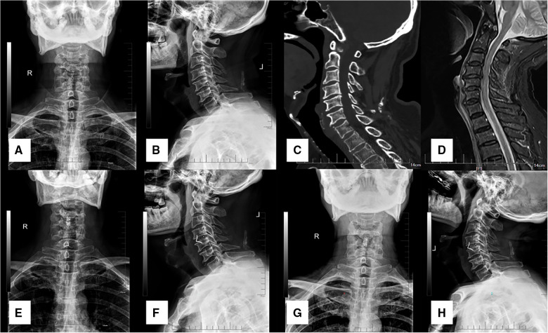
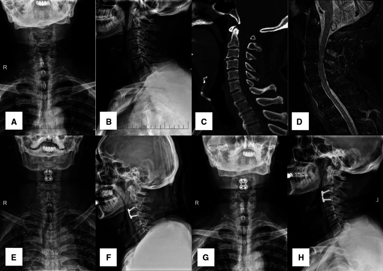
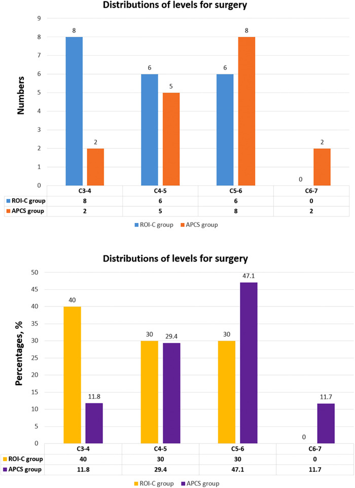
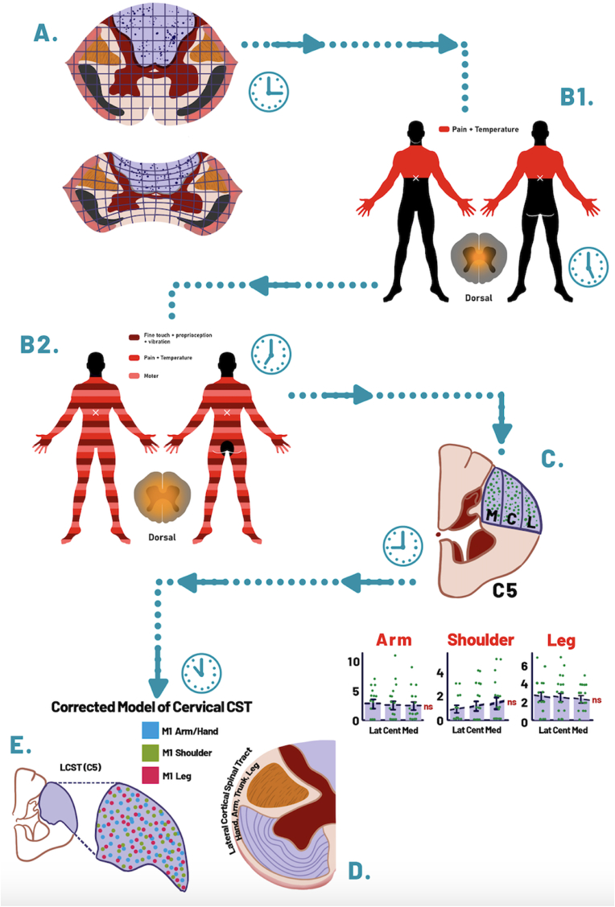
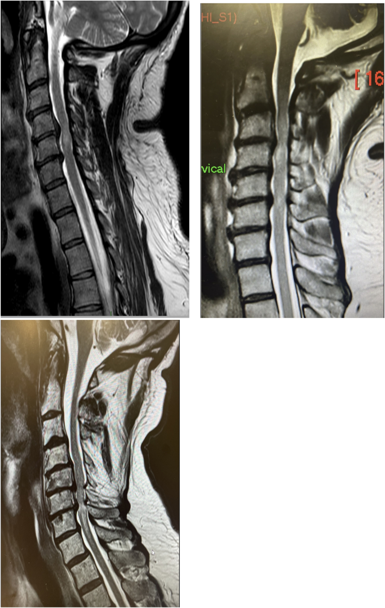
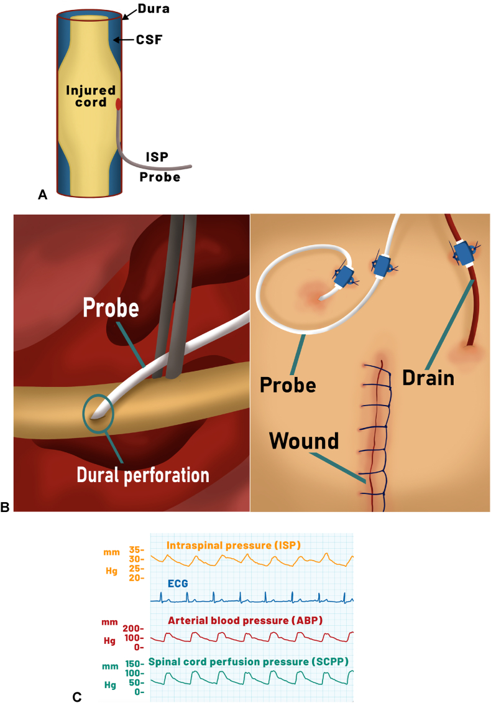
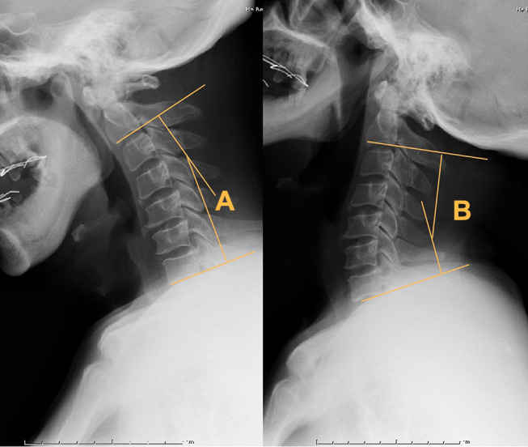
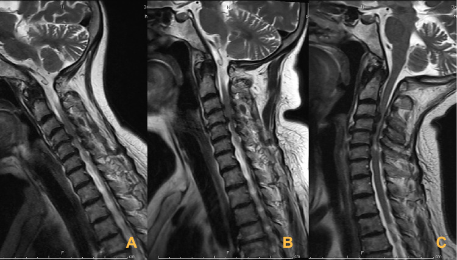
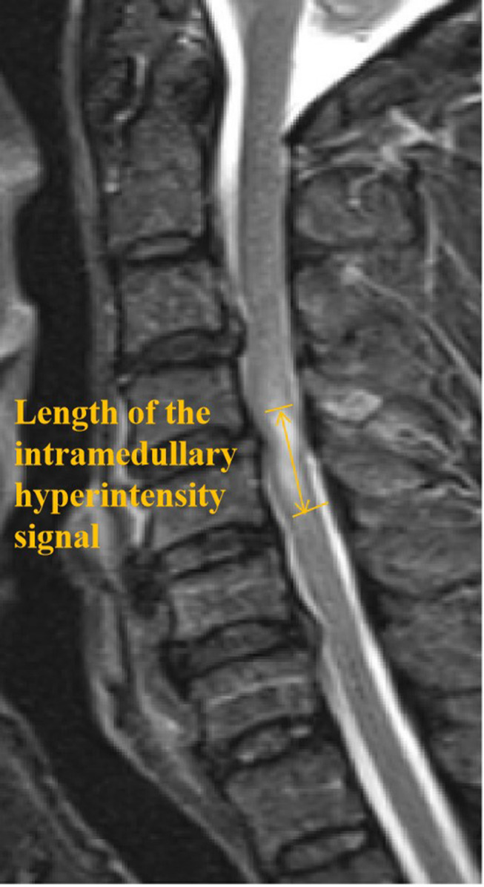

# Case Prep: Traumatic Central Cord Syndrome

<!-- BEGIN CASE SNAPSHOT -->

## Case / Approach Snapshot

- **Anatomy at risk:** unstable columns, cord/roots, dura, vertebral artery or great-vessel/visceral structures by level, fracture lines, and fixation corridors.
- **Operative steps:** protect the spine during transfer/positioning, confirm levels and reduction goals, decompress when indicated, instrument/reconstruct stability, verify alignment and hardware, and plan ICU/brace/rehab needs; use the detailed operative sequence and approach notes below as the step-by-step source.
- **Rescue plans:** neurologic deterioration, reduction failure, vascular/visceral injury, durotomy, blood loss, hardware pullout, infection, and staged anterior/posterior stabilization.
- **Figures:** review [Figures, Imaging & Video](#figures-imaging--video) and the [Curated Image Set](#curated-image-set); embedded local figures should remain open-access, public-domain, or otherwise reusable with attribution.
- **Papers:** review [High-Yield Literature](#high-yield-literature) for seminal sources, modern reviews, and outcome data specific to this page.

<!-- END CASE SNAPSHOT -->

## One-Liner
[Age]yo [M/F] with acute traumatic central cord syndrome following [hyperextension injury / fall / MVC] [on a background of cervical spondylosis] with [upper > lower extremity weakness] planned for [timing-dependent] cervical decompression [± fusion].

---

## Figures, Imaging & Video

**🎥 Operative video** — [search operative video on YouTube ▸](https://www.youtube.com/results?search_query=central+cord+syndrome+surgery) · [The Neurosurgical Atlas ▸](https://www.neurosurgicalatlas.com)

> 🧭 **Operative approach:** [Posterior cervical approach](../approaches/posterior-cervical-approach.md) — detailed corridor setup, step-by-step technique & figures

[Neurosurgical Atlas](https://www.neurosurgicalatlas.com) · [AO Spine / Surgery Reference](https://www.aofoundation.org/spine) · [Radiopaedia](https://radiopaedia.org/search?q=central%20cord%20syndrome&scope=all) · [PubMed Central](https://www.ncbi.nlm.nih.gov/pmc/?term=traumatic+central+cord+syndrome) — operative figures © linked; see [media-sources.md](../../resources/media-sources.md)

---

<!-- BEGIN CURATED LITERATURE -->

## High-Yield Literature

- **Traumatic Central Cord Syndrome** — Carr MT. Clinical spine surgery 2024. [PubMed](https://pubmed.ncbi.nlm.nih.gov/39480046/)
- **Traumatic central cord Syndrome: An integrated neurosurgical and neurocritical care perspective** — Martínez-Palacios K. Brain & spine 2025. [PubMed](https://pubmed.ncbi.nlm.nih.gov/40519873/)
- **Traumatic central cord syndrome** — Wyndaele JJ. Spinal cord 2010. [PubMed](https://pubmed.ncbi.nlm.nih.gov/20811391/)
- **Elderly traumatic central cord syndrome in the USA: a review of management and outcomes** — Phelps RR. Journal of neurosurgical sciences 2021. [PubMed](https://pubmed.ncbi.nlm.nih.gov/34114428/)
- **Treatment of acute traumatic central cord syndrome: a score-based approach based on the literature** — Kumar AA. European spine journal : official publication of the European Spine Society, the European Spinal Deformity Society, and the European Section of the Cervical Spine Research Society 2023. [PubMed](https://pubmed.ncbi.nlm.nih.gov/36912986/)
- **Acute traumatic central cord syndrome: a comprehensive review** — Molliqaj G. Neuro-Chirurgie 2014. [PubMed](https://pubmed.ncbi.nlm.nih.gov/24613283/)
- **[Acute Traumatic Central Cord Syndrome: Etiology, Pathophysiology, Clinical Manifestation, and Treatment]** — Tosic L. Praxis 2021. [PubMed](https://pubmed.ncbi.nlm.nih.gov/33906439/)
- **Early versus late surgical decompression for patients with acute traumatic central cord syndrome: a systematic review and meta-analysis** — Sattari SA. The spine journal : official journal of the North American Spine Society 2024. [PubMed](https://pubmed.ncbi.nlm.nih.gov/37890727/)
- **Management of Acute Traumatic Central Cord Syndrome: A Narrative Review** — Divi SN. Global spine journal 2019. [PubMed](https://pubmed.ncbi.nlm.nih.gov/31157150/)
- **Surgical intervention ≤ 24 hours versus > 24 hours after injury for the management of acute traumatic central cord syndrome: a systematic review and meta-analysis** — Bin-Alamer O. Journal of neurosurgery. Spine 2024. [PubMed](https://pubmed.ncbi.nlm.nih.gov/38335527/)

<!-- END CURATED LITERATURE -->

<!-- BEGIN CURATED IMAGE SET -->

## Curated Image Set

Open-access figures are embedded from PubMed Central articles and kept unique to this guide.

*Figure 1. A 60-year-old male patient diagnosed with TCCS. (A,B) preoperative A-P and lateral x-ray showing the slight degenerative change of cervical spine with relative normal curvature, and... Source: [The clinical efficacy of anterior cervical discectomy and fusion with ROI-C device vs. plate-cage in managing traumatic central cord syndrome](https://pmc.ncbi.nlm.nih.gov/articles/PMC9852637/) — Frontiers in Surgery 2023; CC BY.*

*Figure 2. A 56-year-old male patient diagnosed with TCCS. (A,B) preoperative A-P and lateral X-ray images showing the slight degenerative change of cervical spine with relative normal curvature,... Source: [The clinical efficacy of anterior cervical discectomy and fusion with ROI-C device vs. plate-cage in managing traumatic central cord syndrome](https://pmc.ncbi.nlm.nih.gov/articles/PMC9852637/) — Frontiers in Surgery 2023; CC BY.*

*Figure 3. The distributions of levels for surgery in the ROI-C group and APCS group, exhibited as numbers and percentages. Source: [The clinical efficacy of anterior cervical discectomy and fusion with ROI-C device vs. plate-cage in managing traumatic central cord syndrome](https://pmc.ncbi.nlm.nih.gov/articles/PMC9852637/) — Frontiers in Surgery 2023; CC BY.*

*Figure 4. Source: [Management of Acute Traumatic Central Cord Syndrome: A Narrative Review](https://pmc.ncbi.nlm.nih.gov/articles/PMC6512200/) — Global Spine J. 2019 May 8;9(1 Suppl):89S–97S. doi: 10.1177/2192568219830943; CC BY-NC-ND.*

*Fig. 1. TCCS pathophysiology concept evolution. The “clocks” sketches were added to illustrate symbolically different time points in history. (A) Based on initial Sir William Thorburn theories,... Source: [Traumatic central cord Syndrome: An integrated neurosurgical and neurocritical care perspective](https://pmc.ncbi.nlm.nih.gov/articles/PMC12166739/) — Brain & Spine 2025; CC BY-NC-ND.*

*Fig. 2. (From left to right and bottom): (A) Sagittal T2 weighted image of a 65 year old gentleman who suffered a neck hyperextension injury, and presented with central cord syndrome. He... Source: [Traumatic central cord Syndrome: An integrated neurosurgical and neurocritical care perspective](https://pmc.ncbi.nlm.nih.gov/articles/PMC12166739/) — Brain & Spine 2025; CC BY-NC-ND.*

*Fig. 3. Important steps in intraspinal pressure (ISP) monitoring technique and physiological variables assessment. (A) Probe proper location is in the subdural space (Phang and Papadopoulos,... Source: [Traumatic central cord Syndrome: An integrated neurosurgical and neurocritical care perspective](https://pmc.ncbi.nlm.nih.gov/articles/PMC12166739/) — Brain & Spine 2025; CC BY-NC-ND.*

*Figure 1. Angles created by a line parallel to the inferior aspect of the C2 vertebrae and a line parallel to that of the C7 vertebrae were measured at the flexion (A) and extension (B) lateral... Source: [The Assessment of Dynamic Spinal Cord Impingement by Kinematic Magnetic Resonance Imaging in Patients with Traumatic Central Cord Syndrome](https://pmc.ncbi.nlm.nih.gov/articles/PMC7800690/) — Therapeutics and Clinical Risk Management 2021; CC BY-NC.*

*Figure 2. A 50-year-old patient with TCCS. T2-weighted MR images depict disk protrusion and hypertrophy of the ligamentum flavum at the C3-6 level. (A) In flexion, decompression of the cord... Source: [The Assessment of Dynamic Spinal Cord Impingement by Kinematic Magnetic Resonance Imaging in Patients with Traumatic Central Cord Syndrome](https://pmc.ncbi.nlm.nih.gov/articles/PMC7800690/) — Therapeutics and Clinical Risk Management 2021; CC BY-NC.*

*Figure 3. Length of the intramedullary hyperintensity signal (LIHS) – yellow arrow. This distance was measured as the proximal-distal range of the intramedullary hyperintensity signal. The LIHS... Source: [The Assessment of Dynamic Spinal Cord Impingement by Kinematic Magnetic Resonance Imaging in Patients with Traumatic Central Cord Syndrome](https://pmc.ncbi.nlm.nih.gov/articles/PMC7800690/) — Therapeutics and Clinical Risk Management 2021; CC BY-NC.*

<!-- END CURATED IMAGE SET -->

---

## History of Present Illness
- Chief complaint: After hyperextension injury — **weakness greater in the upper extremities (especially hands) than lower extremities**, variable sensory loss, ± bladder dysfunction
- **Classic mechanism:** hyperextension in an older patient with pre-existing **cervical spondylosis/stenosis** (cord pinched between osteophytes and infolded ligamentum flavum), often **without fracture**
- Younger patients: higher-energy, may have fracture/dislocation
- Burning hands, gait

---

## Past Medical History
- Cervical spondylosis/stenosis, OPLL, prior cervical surgery, anticoagulation
- Ankylosing spondylitis/DISH (rigid spine — fracture risk with hyperextension)
- Standard PMH

---

## Imaging Review
### MRI Cervical
- **Cord signal change (T2 hyperintensity)** at the stenotic level(s), pre-existing **spondylotic stenosis**, disc-osteophyte, ligamentum infolding
- **Exclude fracture/dislocation/ligamentous injury (STIR)**, epidural hematoma
- Extent/levels of compression
### CT Cervical
- Bony stenosis, OPLL, fracture (often absent), canal diameter, alignment
### CTA (if fracture through foramen transversarium)

---

## Labs
- CBC, BMP, Coags, type and screen

---

## Neurological Examination
- **ASIA exam** — characterize upper > lower weakness, hand intrinsics, sensory, sacral sparing, sphincter; serial exams (many improve early)

---

## Surgical Planning

### Case Logistics, OR Needs & Orders
- **OR table/bed:** Jackson/Allen/open-frame radiolucent table, or ProAxis/hinged table when sagittal alignment adjustment is useful; keep abdomen free for venous decompression.
- **OR setup:** spine table with log-roll precautions, fluoroscopy/O-arm/navigation, traction/Mayfield when cervical, posterior/anterior implant trays, decompression instruments, cell saver/blood for large constructs, and IONM before positioning when feasible.
- **Special needs:** arterial line, Foley, type/cross, MAP augmentation for acute SCI per local protocol, no long paralytic when MEPs are needed, anticoagulation/reversal plan, and airway strategy for unstable cervical injuries.
- **Immediate postop orders:** serial ASIA/neuro checks, MAP goal/duration if SCI, CT/X-rays for hardware/alignment, brace/collar orders, drain care, DVT prophylaxis timing, bowel/bladder/skin care, and early rehab/SCI consult.

### Diagnosis & Indication / Timing
- Working diagnosis: Traumatic central cord syndrome (incomplete SCI)
- **Management debate:** many improve with conservative care + MAP support; **early surgical decompression** increasingly favored for significant/persistent compression (esp. with continued deficit, instability, or fracture) — emerging evidence supports earlier decompression in incomplete SCI
- **MAP goal 85-90 mmHg x ~5-7 days** (cord perfusion) regardless of surgery
- Goals: decompress the stenotic cord, stabilize if unstable

### Approach
- **Anterior (ACDF/corpectomy)** if focal anterior disc-osteophyte compression, kyphosis
- **Posterior (laminectomy/laminoplasty ± fusion)** if multilevel stenosis with lordosis, OPLL
- **Combined** for severe multilevel/instability

### Position
- **OR table/bed:** Jackson/Allen/open-frame radiolucent table, or ProAxis/hinged table when sagittal alignment adjustment is useful; keep abdomen free for venous decompression.
- Anterior: supine, awake fiberoptic intubation (myelopathic/unstable), in-line stabilization; Posterior: prone, Mayfield, careful log-roll; IONM baseline

### Key Surgical Steps
- Per approach (see [acdf](../spine-degenerative/acdf.md), [posterior-cervical-laminectomy-fusion](../spine-degenerative/posterior-cervical-laminectomy-fusion.md), [cervical-laminoplasty](../spine-degenerative/cervical-laminoplasty.md)) — decompress the cord across the stenotic/injured levels, preserve perfusion, stabilize as indicated, IONM throughout

### Critical Anatomy & Structures at Risk
1. **Spinal cord** — already injured/edematous, exquisitely sensitive to perfusion/manipulation
2. Vertebral arteries, nerve roots (C5 palsy after posterior decompression)
3. Stability/alignment

### Equipment
- Per approach (anterior cervical or posterior instrumentation sets), microscope, fluoroscopy/navigation, IONM

### Monitoring
- **SSEPs, MEPs, EMG**; check around positioning

### Anesthesia
- **MAP 85-90 x 5-7 days**, awake fiberoptic intubation (unstable/myelopathic), arterial line, no paralytic (IONM)

### Potential Complications
1. Neurological worsening (manipulation/perfusion), C5 palsy
2. Approach-specific (dysphagia, VA injury, CSF leak, infection)
3. Incomplete recovery (hand function often last/least to recover), instability

---

## Operative Note Template
**Preoperative Diagnosis:** Traumatic central cord syndrome with cervical [spondylotic] stenosis [C_-C_] [± fracture]

**Postoperative Diagnosis:** Same

**Procedure:** [Anterior (ACDF/corpectomy) / Posterior (laminectomy/laminoplasty ± fusion)] cervical decompression for traumatic central cord syndrome

**Surgeon / Assistant:**
**Anesthesia:** General endotracheal (awake fiberoptic intubation if unstable/myelopathic)
**EBL / Fluids:**
**Adjuncts:** Microscope, fluoroscopy/navigation; SSEP/MEP/EMG
**Implants:** [Per approach — anterior plate/cage or posterior screws/rods, graft]
**Monitoring:** SSEP/MEP — stable
**Complications:** None

**Indications:** [Age]yo [M/F] with traumatic central cord syndrome after a hyperextension injury on a background of cervical stenosis, with [persistent/significant] cord compression and upper > lower extremity weakness. Early decompression was chosen [given persistent deficit/compression]; MAP 85–90 maintained. Risks discussed.

**Description of Procedure:** After consent and time-out, [awake fiberoptic intubation with in-line stabilization was performed], anesthesia induced maintaining MAP 85–90, and neuromonitoring established with stable baselines after positioning. 

[Anterior: a Smith-Robinson approach with discectomy/corpectomy decompressed the cord at the focal compressive level(s), followed by interbody graft and plate.] [Posterior: prone positioning, and a laminectomy/laminoplasty (± lateral mass fusion) decompressed the cord across the multilevel stenosis.] Cord decompression was confirmed and perfusion preserved; neuromonitoring remained stable.

Closure was performed in layers. The patient was transferred to the ICU with MAP 85–90 and serial ASIA exams.

---

## Postoperative Plan
- ICU, **MAP 85-90 x 5-7 days**, serial ASIA exams, airway monitoring (anterior)
- CT/X-ray postop, collar per construct
- DVT prophylaxis, bowel/bladder/skin care, SCI rehab consult early
- Counsel: recovery pattern (legs → bladder → proximal arms → hands; hands recover last/least); steroids controversial (institutional)
- Follow-up imaging, rehabilitation

<!-- BEGIN CHIEF LEVEL TAKEAWAYS -->

## Chief-Level Case Review

Use these as the senior-level mental model for **Traumatic Central Cord Syndrome**:

- **Decision point:** Treat physiology while preparing the room: airway, reversal, transfusion, ICP/CPP, sodium/osmolality, temperature, and repeat imaging drive timing as much as the scan finding.
- **Technical lever:** Know the operative priority: decompression, hemorrhage control, debridement, dural closure, reconstruction, stabilization, or contamination control.
- **Bailout:** Plan for swelling and coagulopathy: bone flap decision, duraplasty size, drain/EVD need, hemostatic adjuncts, and ICU handoff should be decided early.
- **Postop watch:** Postop failure modes are predictable: expanding hematoma, malignant edema, seizure, infection, CSF leak, venous sinus injury, and missed associated spine/vascular injury.

<!-- END CHIEF LEVEL TAKEAWAYS -->

<!-- BEGIN COMMON PIMP QUESTIONS -->

## Common Pimp Questions

Use these to pressure-test preparation for **Traumatic Central Cord Syndrome**:

1. What neurologic level and root are responsible for the presenting deficit?
2. What is the decompression target and how will you know it is adequately decompressed?
3. What instability, deformity, bone-quality, or fusion variable changes the construct?
4. What vascular, visceral, dural, or neural structure is the main structure at risk?
5. What postop brace, drain, mobilization, MAP, antibiotic, and DVT plan should be ordered?

<!-- END COMMON PIMP QUESTIONS -->

<!-- BEGIN ATTENDING PREFERENCE VARIABLES -->

## Attending Preference Variables

Items that commonly vary by surgeon or institution:

- **Positioning frame, arms, traction, and localization workflow:** [attending-specific]
- **Navigation/robot/fluoro use, screw system, graft/biologic choice, and drain threshold:** [attending-specific]
- **Neuromonitoring modality and MAP goal for myelopathy, deformity, or cord-risk cases:** [attending-specific]
- **Brace, Foley, antibiotics, mobilization, and DVT prophylaxis timing:** [attending-specific]

<!-- END ATTENDING PREFERENCE VARIABLES -->
