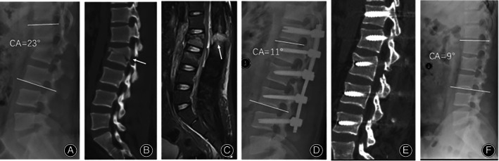
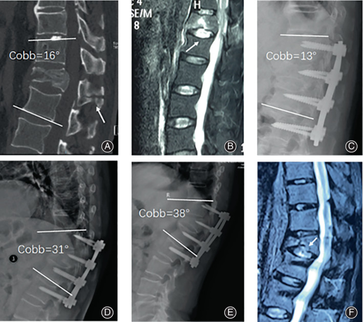
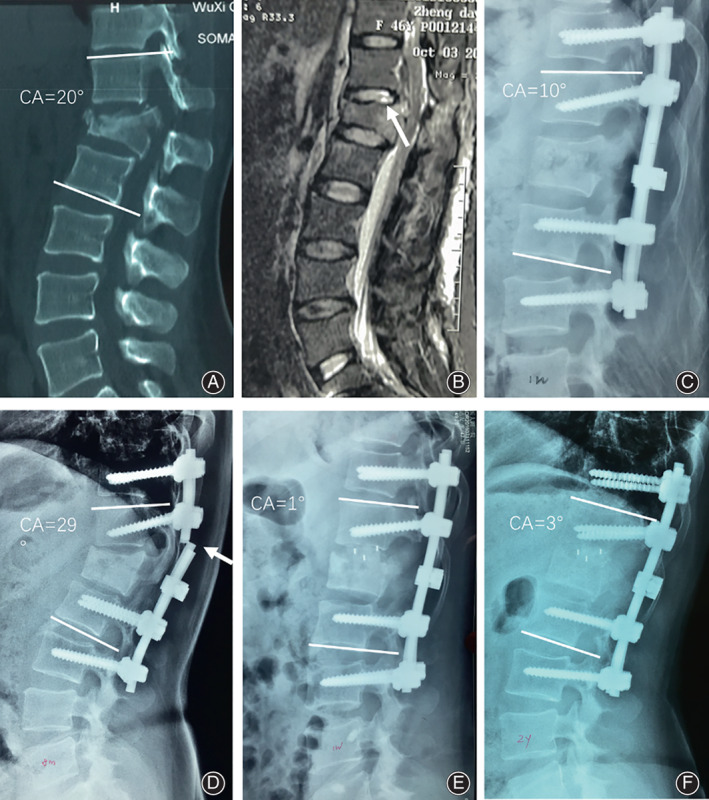
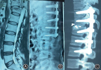
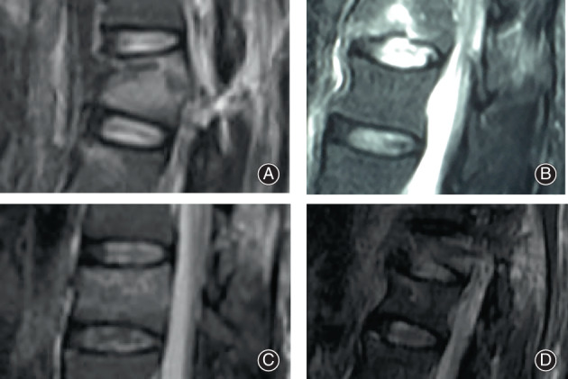
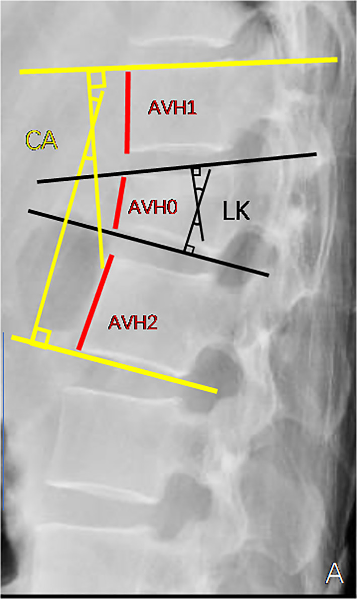
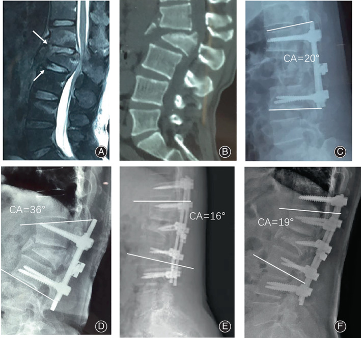
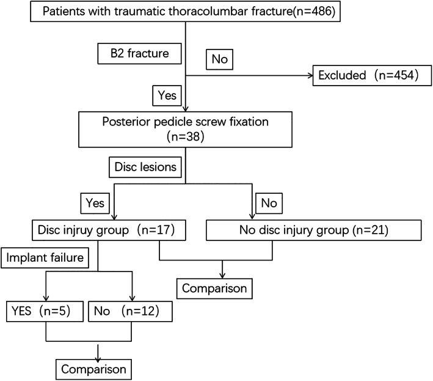
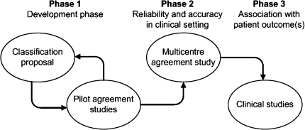
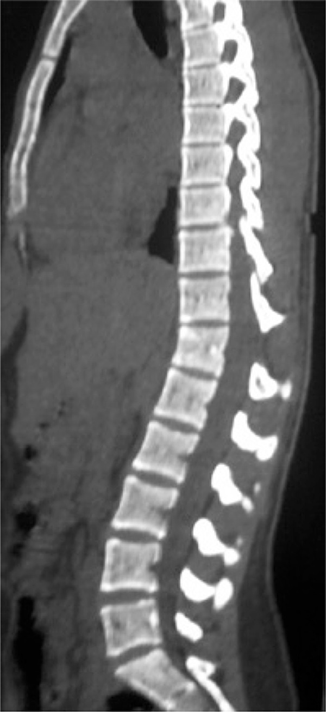

# Case Prep: Flexion-Distraction (Chance) Injury Fixation

---

<!-- BEGIN CASE SNAPSHOT -->

## Case / Approach Snapshot

- **Anatomy at risk:** unstable columns, cord/roots, dura, vertebral artery or great-vessel/visceral structures by level, fracture lines, and fixation corridors.
- **Operative steps:** protect the spine during transfer/positioning, confirm levels and reduction goals, decompress when indicated, instrument/reconstruct stability, verify alignment and hardware, and plan ICU/brace/rehab needs; use the detailed operative sequence and approach notes below as the step-by-step source.
- **Rescue plans:** neurologic deterioration, reduction failure, vascular/visceral injury, durotomy, blood loss, hardware pullout, infection, and staged anterior/posterior stabilization.
- **Figures:** review [Figures, Imaging & Video](#figures-imaging--video) and the [Curated Image Set](#curated-image-set); embedded local figures should remain open-access, public-domain, or otherwise reusable with attribution.
- **Papers:** review [High-Yield Literature](#high-yield-literature) for seminal sources, modern reviews, and outcome data specific to this page.
- **Textbook cross-checks:** use [Textbook Cross-Checks](#textbook-cross-checks) and the [Source Crosswalk](../../resources/source-crosswalk.md) to cite copyrighted textbooks/atlases while summarizing in original words.

<!-- END CASE SNAPSHOT -->

## One-Liner
[Age]yo [M/F] with a [T_/L_] flexion-distraction (Chance) injury [bony / ligamentous / combined] following [MVC with lap belt / fall] [± neurological deficit / ± intra-abdominal injury] planned for posterior instrumented fusion.

---

## Figures, Imaging & Video

**🎥 Operative video** — [search operative video on YouTube ▸](https://www.youtube.com/results?search_query=chance+fracture+surgery) · [The Neurosurgical Atlas ▸](https://www.neurosurgicalatlas.com)

> 🧭 **Operative approach:** [Posterior thoracolumbar approach](../approaches/posterior-thoracolumbar-approach.md) — detailed corridor setup, step-by-step technique & figures

[Neurosurgical Atlas](https://www.neurosurgicalatlas.com) · [AO Surgery Reference](https://surgeryreference.aofoundation.org) · [Radiopaedia](https://radiopaedia.org/search?q=chance%20fracture&scope=all) · [PubMed Central](https://www.ncbi.nlm.nih.gov/pmc/?term=flexion+distraction+chance+fracture) — operative figures © linked; see [media-sources.md](../../resources/media-sources.md)

---

<!-- BEGIN TEXTBOOK CROSS-CHECKS -->

## Textbook Cross-Checks

- **Spine anatomy and biomechanics:** Benzel Spine; Textbook of Spinal Surgery; Surgical Anatomy and Techniques to the Spine — confirm levels, approach-side anatomy, neural/vascular structures at risk, alignment, stability, and fixation rationale.
- **Technique sequence:** Youmans and Winn; Benzel Spine; Greenberg — review positioning, localization, exposure, decompression, instrumentation, fusion/reconstruction, and closure in original language.
- **Complication rescue:** Benzel Spine; Greenberg; Youmans and Winn — cross-check durotomy, neurologic change, vascular injury, wrong-level prevention, infection, implant failure, and postoperative restrictions.
- **Copyright-safe use:** cite these sources as private cross-checks, then write the guide content in original words; do not re-host textbook pages, figures, tables, or board-review card material. See [Source Crosswalk & Copyright-Safe Use](../../resources/source-crosswalk.md).

<!-- END TEXTBOOK CROSS-CHECKS -->

<!-- BEGIN CURATED LITERATURE -->

## High-Yield Literature

- **Internal fixation without fusion of a flexion-distraction injury in the lower cervical spine of a three-year-old** — Hooley E. The spine journal : official journal of the North American Spine Society 2006. [PubMed](https://pubmed.ncbi.nlm.nih.gov/16413448/)
- **Anterior Surgical Fixation for Cervical Spine Flexion-Distraction Injuries** — Jack A. World neurosurgery 2017. [PubMed](https://pubmed.ncbi.nlm.nih.gov/28213193/)
- **Management of flexion distraction injuries to the thoracolumbar spine** — Lopez AJ. Journal of clinical neuroscience : official journal of the Neurosurgical Society of Australasia 2015. [PubMed](https://pubmed.ncbi.nlm.nih.gov/26209922/)
- **Flexion-distraction injury of the thoracolumbar spine** — Liu YJ. Injury 2003. [PubMed](https://pubmed.ncbi.nlm.nih.gov/14636735/)
- **Flexion-distraction injuries of the thoracolumbar spine: open fusion versus percutaneous pedicle screw fixation** — Grossbach AJ. Neurosurgical focus 2013. [PubMed](https://pubmed.ncbi.nlm.nih.gov/23905953/)
- **Purely Ligamentous Flexion-Distraction Injury in a Five-Year-Old Child Treated with Surgical Management** — Schiedo RM. Cureus 2017. [PubMed](https://pubmed.ncbi.nlm.nih.gov/28473948/)
- **Flexion-distraction injury of the L1 vertebra treated with short-segment posterior fixation and Optimesh** — Inamasu J. Journal of clinical neuroscience : official journal of the Neurosurgical Society of Australasia 2008. [PubMed](https://pubmed.ncbi.nlm.nih.gov/18068985/)
- **Percutaneous lumbar pedicle fixation in young children with flexion-distraction injury-case report and operative technique** — Krafft PR. Child's nervous system : ChNS : official journal of the International Society for Pediatric Neurosurgery 2021. [PubMed](https://pubmed.ncbi.nlm.nih.gov/32740674/)
- **Temporary Monosegmental Fixation Using Multiaxial Percutaneous Pedicle Screws for Surgical Management of Bony Flexion-Distraction Injuries of the Thoracolumbar Spine: A Technical Note** — Kitamura K. Spine surgery and related research 2022. [PubMed](https://pubmed.ncbi.nlm.nih.gov/36561155/)
- **Minimally invasive treatment of thoracolumbar flexion-distraction fracture** — Laghmouche N. Orthopaedics & traumatology, surgery & research : OTSR 2019. [PubMed](https://pubmed.ncbi.nlm.nih.gov/30792168/)

<!-- END CURATED LITERATURE -->

---

<!-- BEGIN CURATED IMAGE SET -->

## Curated Image Set

Open-access figures are embedded from PubMed Central articles and kept unique to this guide.

*Fig. 4. A 19‐year‐old male who presented with an AO Type B2 fracture at L1‐L2 and severe back pain. (A, B) CT scan of the lumbar spine showed an L2 fracture involving the vertebral body and... Source: [Comparison of the Outcomes between AO Type B2 Thoracolumbar Fracture with and without Disc Injury after Posterior Surgery](https://pmc.ncbi.nlm.nih.gov/articles/PMC9483068/) — Orthopaedic Surgery 2022; CC BY-NC-ND.*

*Fig. 5. A 64‐year‐old male with a T12 chance fracture (AO B2) caused by a fall from height. (A) Preoperative sagittal CT images show transosseous failure of the posterior column at T12 with an... Source: [Comparison of the Outcomes between AO Type B2 Thoracolumbar Fracture with and without Disc Injury after Posterior Surgery](https://pmc.ncbi.nlm.nih.gov/articles/PMC9483068/) — Orthopaedic Surgery 2022; CC BY-NC-ND.*

*Fig. 6. A 46‐year‐old female patient who had a fall from a height. She suffered a L1 B2 with L1 A3 fracture according to the AO Classification. (A) Sagittal CT scans show the flexion‐distraction... Source: [Comparison of the Outcomes between AO Type B2 Thoracolumbar Fracture with and without Disc Injury after Posterior Surgery](https://pmc.ncbi.nlm.nih.gov/articles/PMC9483068/) — Orthopaedic Surgery 2022; CC BY-NC-ND.*

*Figure 4. Source: [Comparison of the Outcomes between AO Type B2 Thoracolumbar Fracture with and without Disc Injury after Posterior Surgery](https://pmc.ncbi.nlm.nih.gov/articles/PMC9483068/) — Orthop Surg. 2022 Aug 5;14(9):2119–31. doi: 10.1111/os.13400; CC BY-NC-ND.*

*Fig. 1. Classification of traumatic intervertebral disc lesions in B2 injuries: Photographs of discs showing (A) grade 0 (cranial), (B) grade 1 (cranial), (C) grade 2 (caudal), and (D) grade 3... Source: [Comparison of the Outcomes between AO Type B2 Thoracolumbar Fracture with and without Disc Injury after Posterior Surgery](https://pmc.ncbi.nlm.nih.gov/articles/PMC9483068/) — Orthopaedic Surgery 2022; CC BY-NC-ND.*

*Fig. 2. Radiological measurement using plain lateral radiography. AVBH = [2AVH0/(AVH1 + AVH2) × 100]. UIDH = (a1 + a2 + a3)/3, LIDH = (b1 + b2 + b3)/3. CA, Cobb angle; LK, Local kyphosis; AVBH,... Source: [Comparison of the Outcomes between AO Type B2 Thoracolumbar Fracture with and without Disc Injury after Posterior Surgery](https://pmc.ncbi.nlm.nih.gov/articles/PMC9483068/) — Orthopaedic Surgery 2022; CC BY-NC-ND.*

*Fig. 7. A 48‐year‐old male patient who had a vehicle accident. He suffered a L1‐L2 B2 with L2 A4 fracture according to the AO Classification. (A) Preoperative MRI showing abnormal shapes in the... Source: [Comparison of the Outcomes between AO Type B2 Thoracolumbar Fracture with and without Disc Injury after Posterior Surgery](https://pmc.ncbi.nlm.nih.gov/articles/PMC9483068/) — Orthopaedic Surgery 2022; CC BY-NC-ND.*

*Fig. 3. The flow chart of the study Source: [Comparison of the Outcomes between AO Type B2 Thoracolumbar Fracture with and without Disc Injury after Posterior Surgery](https://pmc.ncbi.nlm.nih.gov/articles/PMC9483068/) — Orthopaedic Surgery 2022; CC BY-NC-ND.*

*Fig. 2. Three-phase validation process for fracture classification systems as proposed by Audigé et al. [7], reprinted with permission Source: [What should an ideal spinal injury classification system consist of? A methodological review and conceptual proposal for future classifications](https://pmc.ncbi.nlm.nih.gov/articles/PMC2989196/) — European Spine Journal 2010; CC BY-NC.*

*Figure 1. Sagittal computed tomography scan showing an enlargement of T11 and T12 spinous processes, which suggests a ligament injury Source: [Thoracolumbar Chance fracture during a professional female soccer game: case report](https://pmc.ncbi.nlm.nih.gov/articles/PMC4872921/) — Einstein 2016; CC BY.*

<!-- END CURATED IMAGE SET -->

---

## History of Present Illness
- Chief complaint: Back pain ± deficit after **flexion-distraction mechanism** (classic: **lap-belt MVC**, fall)
- **High association with intra-abdominal/visceral injury** (seatbelt sign, bowel/mesenteric injury) — trauma evaluation mandatory
- Mechanism, neurological status, abdominal symptoms

---

## Past Medical History
- Associated trauma (abdominal — high index of suspicion), ankylosing spondylitis/DISH (transverse fractures through rigid spine)
- Standard PMH

---

## Imaging Review
### CT (spine + **abdomen/pelvis**)
- **Distraction injury through posterior elements ± vertebral body** (horizontal fracture — bony Chance; or through disc/ligaments — ligamentous), interspinous widening, kyphosis
- **3-column distraction injury = unstable**
- **Evaluate for intra-abdominal injury** (bowel, mesentery, solid organ)
### MRI
- **Posterior ligamentous complex (PLC) disruption** (STIR), disc injury, cord/conus signal, epidural hematoma
### X-ray (alignment, kyphosis)

---

## Labs
- CBC, BMP, Coags, type and crossmatch, **trauma labs** (lactate, etc.)

---

## Neurological Examination
- ASIA exam (often neurologically intact, but can have conus/cauda injury), sphincter; **abdominal exam** (associated injury)

---

## Surgical Planning

### Diagnosis & Indication
- Working diagnosis: Flexion-distraction (Chance) injury — typically **unstable** (esp. ligamentous/combined)
- **Bony Chance** through bone may heal in hyperextension bracing (selected, purely bony, reducible, no deficit); **ligamentous/combined injuries do NOT heal with bracing → surgery**
- Goals: restore alignment, posterior tension band, stabilize
- **Coordinate with trauma surgery** for concurrent abdominal injury (timing/positioning)

### Position
- Prone on Jackson table (allows extension/reduction of kyphosis), careful log-roll, IONM baseline; coordinate if laparotomy needed

### Key Surgical Steps
1. Level localization, posterior midline exposure
2. **Pedicle screw instrumentation** above and below the injury (often short-segment for distraction injuries with good bone)
3. **Reduce** the distraction/kyphosis by compression across the construct (restore the posterior tension band) — extension/compression maneuver
4. Decompression only if neural compression/deficit (often not needed — distraction, not retropulsion)
5. Decorticate and graft (posterolateral fusion), confirm alignment/hardware (fluoroscopy)
6. Closure
- (Mostly a compression construct restoring the posterior tension band — contrast with burst fractures which need anterior column support)

### Critical Anatomy & Structures at Risk
1. **Conus medullaris / cauda equina** (thoracolumbar junction)
2. Pedicle walls (screw placement)
3. Alignment restoration; **associated abdominal viscera** (non-spine but critical)

### Equipment
- Pedicle screw-rod system, fluoroscopy/navigation, bone graft, compression instruments

### Monitoring
- SSEPs, MEPs, EMG

### Anesthesia
- Arterial line if needed, MAP support (if SCI), no paralytic (IONM), prone precautions, coordinate with trauma

### Potential Complications
1. **Missed intra-abdominal injury** (the key associated danger)
2. Neurological injury, hardware failure, loss of reduction, pseudarthrosis
3. Infection, DVT

---

## Operative Note Template
**Preoperative Diagnosis:** [T_/L_] flexion-distraction (Chance) injury [bony/ligamentous/combined — unstable]

**Postoperative Diagnosis:** Same

**Procedure:** [T_/L_] posterior instrumented fusion for flexion-distraction (Chance) injury

**Surgeon / Assistant:**
**Anesthesia:** General endotracheal
**EBL / Fluids:**
**Adjuncts:** Fluoroscopy/navigation; SSEP/MEP/EMG
**Implants:** Pedicle screws and rods, bone graft
**Complications:** None

**Indications:** [Age]yo [M/F] with an unstable flexion-distraction injury at [T_/L_] (PLC disruption on MRI) after a [lap-belt MVC/fall]. Associated intra-abdominal injury was [evaluated/excluded] with the trauma service. Surgery was indicated for the unstable distraction injury. Risks discussed.

**Description of Procedure:** After consent and time-out, general anesthesia was induced and neuromonitoring established. The patient was carefully log-rolled prone onto a Jackson table (allowing extension/reduction of the kyphosis), with signals re-confirmed. A posterior midline exposure was performed over [levels] and pedicle screws placed above and below the injury under fluoroscopy.

The distraction/kyphotic deformity was reduced by **compression across the construct, restoring the posterior tension band**. [Decompression was performed for neural compression.] The decorticated surfaces were grafted for posterolateral arthrodesis, and alignment/hardware confirmed on fluoroscopy. Neuromonitoring remained stable.

Hemostasis was obtained, a drain placed, and the wound closed in layers. The patient was transferred to the [ICU/floor] with serial neuro and abdominal exams (coordinated with trauma).

---

## Postoperative Plan
- ICU/floor per trauma status, neuro checks, **monitor for evolving abdominal injury** (serial exams, trauma service)
- CT/X-ray postop (alignment, hardware), brace per surgeon
- DVT prophylaxis (balance with bleeding/abdominal injury), mobilize
- Follow-up imaging for fusion/alignment; rehab
