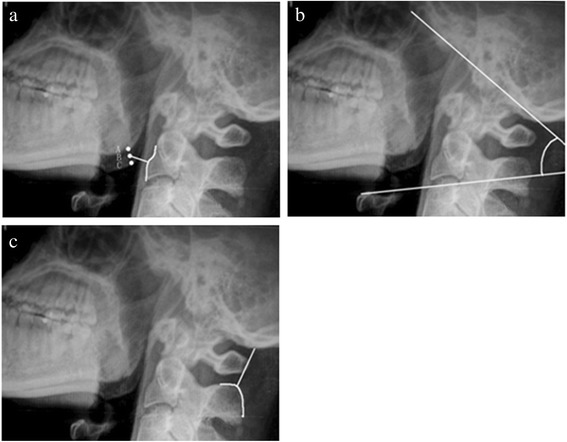
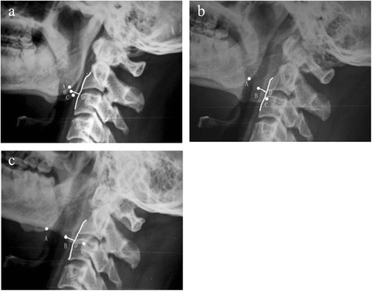
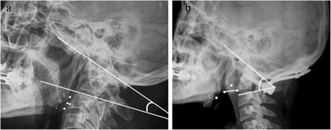
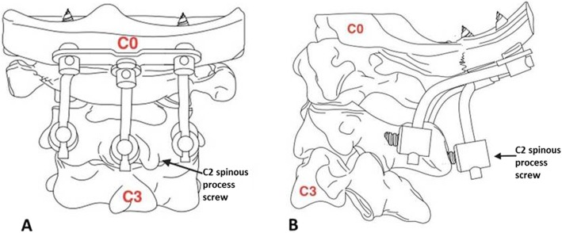
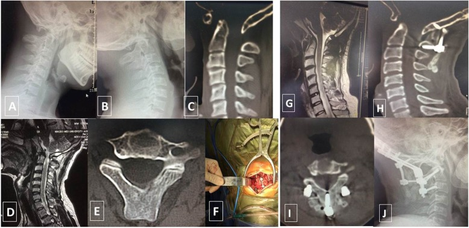
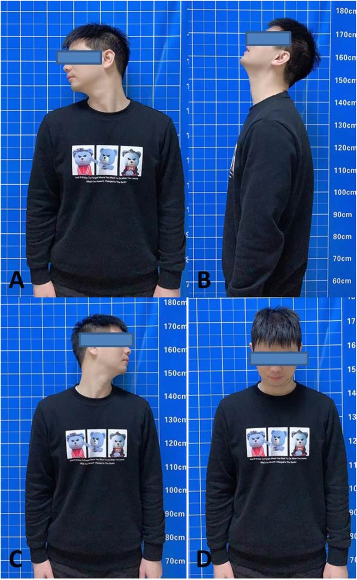
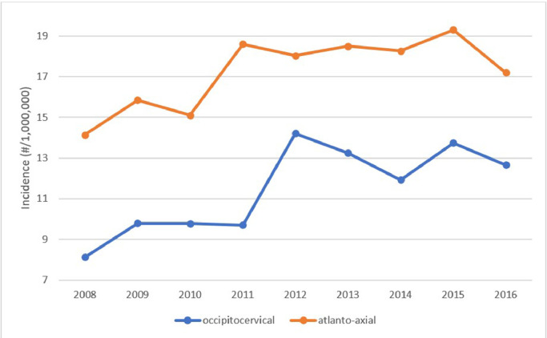
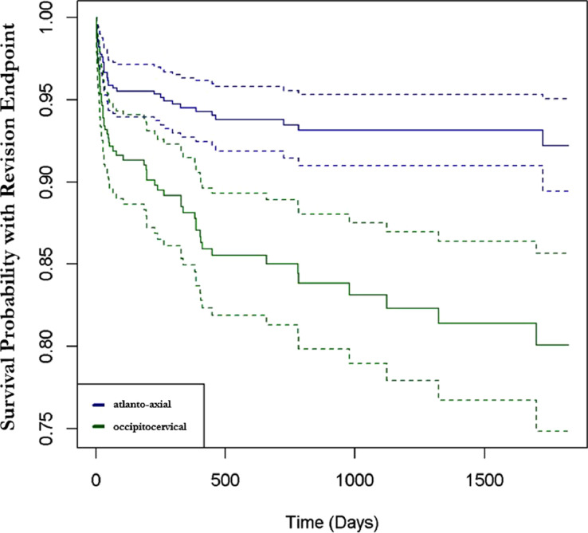
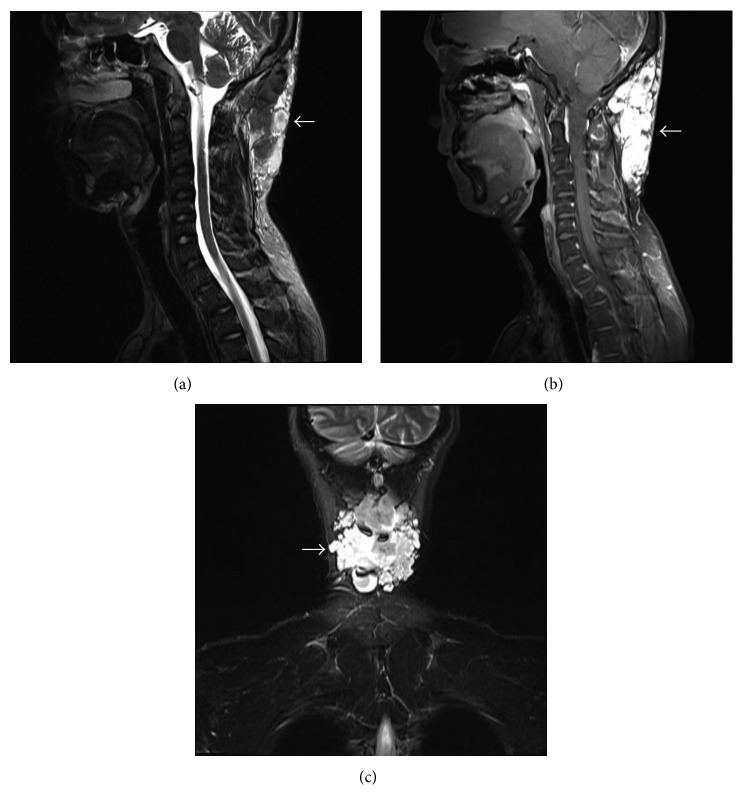
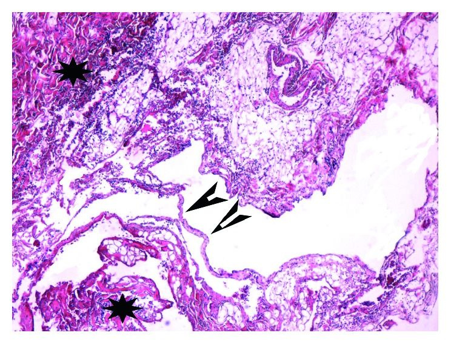

# Case Prep: Occipitocervical Fusion

---

<!-- BEGIN CASE SNAPSHOT -->

## Case / Approach Snapshot

- **Anatomy at risk:** unstable columns, cord/roots, dura, vertebral artery or great-vessel/visceral structures by level, fracture lines, and fixation corridors.
- **Operative steps:** protect the spine during transfer/positioning, confirm levels and reduction goals, decompress when indicated, instrument/reconstruct stability, verify alignment and hardware, and plan ICU/brace/rehab needs; use the detailed operative sequence and approach notes below as the step-by-step source.
- **Rescue plans:** neurologic deterioration, reduction failure, vascular/visceral injury, durotomy, blood loss, hardware pullout, infection, and staged anterior/posterior stabilization.
- **Figures:** review [Figures, Imaging & Video](#figures-imaging--video) and the [Curated Image Set](#curated-image-set); embedded local figures should remain open-access, public-domain, or otherwise reusable with attribution.
- **Papers:** review [High-Yield Literature](#high-yield-literature) for seminal sources, modern reviews, and outcome data specific to this page.

<!-- END CASE SNAPSHOT -->

## One-Liner
[Age]yo [M/F] with [craniocervical instability / basilar invagination / occipitocervical trauma / RA cranial settling / tumor] planned for occipitocervical (occiput–C2/below) instrumented fusion.

---

## Figures, Imaging & Video

**🎥 Operative video** — [search operative video on YouTube ▸](https://www.youtube.com/results?search_query=craniovertebral+junction+surgery) · [The Neurosurgical Atlas ▸](https://www.neurosurgicalatlas.com)

> 🧭 **Operative approach:** [Far-lateral / craniocervical approach](../approaches/far-lateral-craniotomy.md) — detailed corridor setup, step-by-step technique & figures

[Neurosurgical Atlas](https://www.neurosurgicalatlas.com) · [AO Surgery Reference](https://surgeryreference.aofoundation.org) · [Radiopaedia](https://radiopaedia.org/search?q=craniovertebral%20junction&scope=all) · [PubMed Central](https://www.ncbi.nlm.nih.gov/pmc/?term=occipitocervical+fusion) — operative figures © linked; see [media-sources.md](../../resources/media-sources.md)

---

<!-- BEGIN CURATED LITERATURE -->

## High-Yield Literature

- **Occipitocervical Fusion: An Updated Review** — Ashafai NS. Acta neurochirurgica. Supplement 2019. [PubMed](https://pubmed.ncbi.nlm.nih.gov/30610329/)
- **Occipitocervical fusion** — Garrido BJ. The Orthopedic clinics of North America 2012. [PubMed](https://pubmed.ncbi.nlm.nih.gov/22082624/)
- **Occipitocervical Fusion** — Lavano A. Acta neurochirurgica. Supplement 2019. [PubMed](https://pubmed.ncbi.nlm.nih.gov/30610328/)
- **Traumatic Occipitocervical Distraction Injuries in Children: A Systematic Review** — Hale AT. Pediatric neurosurgery 2019. [PubMed](https://pubmed.ncbi.nlm.nih.gov/30844793/)
- **Occipitocervical dissociation-incidence, evaluation, and treatment** — Kasliwal MK. Current reviews in musculoskeletal medicine 2016. [PubMed](https://pubmed.ncbi.nlm.nih.gov/27255101/)
- **[Occipitocervical junction: Aanatomy, craniometry and pathology]** — Furtner J. Der Radiologe 2016. [PubMed](https://pubmed.ncbi.nlm.nih.gov/27025384/)
- **Occipitocervical fixation: A case report of our techniques and results** — Sakti YM. International journal of surgery case reports 2022. [PubMed](https://pubmed.ncbi.nlm.nih.gov/34902699/)
- **Challenges in Occipitocervical Fusion in a 9-Month-Old Infant: A Case Report and Review of Literature** — Thirugnanam B. Neurology India 2024. [PubMed](https://pubmed.ncbi.nlm.nih.gov/38443017/)
- **Occipitocervical junction: imaging, pathology, instrumentation** — Benke M. American journal of orthopedics (Belle Mead, N.J.) 2011. [PubMed](https://pubmed.ncbi.nlm.nih.gov/22263204/)
- **Complications in Occipitocervical Surgery** — Ozer AF. Acta neurochirurgica. Supplement 2025. [PubMed](https://pubmed.ncbi.nlm.nih.gov/39570356/)

<!-- END CURATED LITERATURE -->

---

<!-- BEGIN CURATED IMAGE SET -->

## Curated Image Set

Open-access figures are embedded from PubMed Central articles and kept unique to this guide.

*Figure 1. Illustrations of the MCD, OCA, and OCD on one lateral radiograph. The MCD is the shortest distance (BD) from the midpoint (point B) of the two apices of the mandible angles (points A and... Source: [Evaluation of occipitocervical neutral position using lateral radiographs](https://pmc.ncbi.nlm.nih.gov/articles/PMC4194409/) — Journal of Orthopaedic Surgery and Research 2014; CC BY.*

*Figure 2. The MCDs were less affected when the head was slightly rotated. The figure shows the head in neutral position (a). The head turned right (b), and the head turned left (c). Source: [Evaluation of occipitocervical neutral position using lateral radiographs](https://pmc.ncbi.nlm.nih.gov/articles/PMC4194409/) — Journal of Orthopaedic Surgery and Research 2014; CC BY.*

*Figure 3. A preoperative and postoperative radiograph. (a) Preoperative radiograph of a patient with chronic atlantoaxial dislocation secondary to occipitalization showed a decreased MCD and OCA.... Source: [Evaluation of occipitocervical neutral position using lateral radiographs](https://pmc.ncbi.nlm.nih.gov/articles/PMC4194409/) — Journal of Orthopaedic Surgery and Research 2014; CC BY.*

*Fig. 1. Spinous process screw as a third anchor point in C2 for occipitocervical fixation. a Anteroposterior view. b Lateral view Source: [Outcomes of occipitocervical fixation using a spinous process screw in C2 as a third anchor point for occipitocervical fixation: a case presentation](https://pmc.ncbi.nlm.nih.gov/articles/PMC7229638/) — BMC Musculoskeletal Disorders 2020; CC BY.*

*Fig. 2. A 35-year-old man with occipitocervical deformity was treated with posterior occipitocervical fixation and fusion. a–c Occipital screws, C2 bilateral pedicle screws, a C2 spinous process... Source: [Outcomes of occipitocervical fixation using a spinous process screw in C2 as a third anchor point for occipitocervical fixation: a case presentation](https://pmc.ncbi.nlm.nih.gov/articles/PMC7229638/) — BMC Musculoskeletal Disorders 2020; CC BY.*

*Fig. 3. a–d Clinical photographs show the good cervical function of the patient in various positions at the 24-month follow-up visit Source: [Outcomes of occipitocervical fixation using a spinous process screw in C2 as a third anchor point for occipitocervical fixation: a case presentation](https://pmc.ncbi.nlm.nih.gov/articles/PMC7229638/) — BMC Musculoskeletal Disorders 2020; CC BY.*

*Fig. 1. Incidence of atlanto-axial fusion vs. occipitocervical fusion from 2008 to 2016. Source: [Postoperative complication rates and hazards-model survival analysis of revision surgery following occipitocervical and atlanto-axial fusion](https://pmc.ncbi.nlm.nih.gov/articles/PMC8820023/) — North American Spine Society Journal 2020; CC BY-NC-ND.*

*Fig. 2. Kaplan–Meier survival of atlas-axis fusion vs. occipitocervical fusion with endpoint of revision. Source: [Postoperative complication rates and hazards-model survival analysis of revision surgery following occipitocervical and atlanto-axial fusion](https://pmc.ncbi.nlm.nih.gov/articles/PMC8820023/) — North American Spine Society Journal 2020; CC BY-NC-ND.*

*Figure 1. MRI demonstrated a mass (arrows) in the occipitocervical subcutaneous tissue with uneven signal intensity on (Figure 1(a)) sagittal T2-weighted, (Figure 1(b)) T2-weighted fat suppressed,... Source: [Occipitocervical Hemolymphangioma in an Adult with Neck Pain and Stiffness: Case Report and Literature Review](https://pmc.ncbi.nlm.nih.gov/articles/PMC5738575/) — Case Reports in Medicine 2017; CC BY.*

*Figure 2. Histological analysis of specimen (hematoxylin and eosin stain; magnification ×100) showed abnormal lymphatic (black arrowheads) and blood vessels (black stars) with polycystic spaces. Source: [Occipitocervical Hemolymphangioma in an Adult with Neck Pain and Stiffness: Case Report and Literature Review](https://pmc.ncbi.nlm.nih.gov/articles/PMC5738575/) — Case Reports in Medicine 2017; CC BY.*

<!-- END CURATED IMAGE SET -->

---

## History of Present Illness
- Chief complaint: Occipitocervical pain, myelopathy, cervicomedullary compression symptoms (lower CN, long tract, respiratory)
- Etiology: trauma (occipitocervical dislocation), RA (cranial settling/basilar invagination, pannus), congenital (Chiari/CVJ anomaly, os odontoideum), tumor, infection, failed prior fusion
- Neurological status, bulbar symptoms

---

## Imaging Review
### CT craniocervical (thin-cut + CTA)
- Bony anatomy occiput/C1/C2, **occipital keel/thickness** (screw purchase), condyles, C1 lateral mass, C2 pedicle/pars
- **CTA — vertebral artery anatomy** (high-riding VA, anomalies — critical for C2 fixation)
- Basilar invagination measurements (Chamberlain, McRae, Wackenheim)
### MRI
- Cervicomedullary compression, cord signal, pannus (RA), Chiari, ligament integrity, soft tissue
### X-ray (flexion/extension — instability)

---

## Labs
- CBC, BMP, Coags, Type and crossmatch; RA workup/medications (hold biologics, steroid stress dosing)

---

## Neurological Examination
- Full exam incl. lower CN (IX-XII), respiratory, long tracts, gait, myelopathy

---

## Surgical Planning

### Case Logistics, OR Needs & Orders
- **Typical bed:** ICU or step-down; ICU for SCI, high cervical injury, polytrauma, respiratory risk, major blood loss, or ongoing MAP augmentation.
- **OR setup:** spine table with log-roll precautions, fluoroscopy/O-arm/navigation, traction/Mayfield when cervical, posterior/anterior implant trays, decompression instruments, cell saver/blood for large constructs, and IONM before positioning when feasible.
- **Special needs:** arterial line, Foley, type/cross, MAP augmentation for acute SCI per local protocol, no long paralytic when MEPs are needed, anticoagulation/reversal plan, and airway strategy for unstable cervical injuries.
- **Immediate postop orders:** serial ASIA/neuro checks, MAP goal/duration if SCI, CT/X-rays for hardware/alignment, brace/collar orders, drain care, DVT prophylaxis timing, bowel/bladder/skin care, and early rehab/SCI consult.

### Goals
- Stabilize the craniocervical junction, decompress cervicomedullary compression (if needed — e.g., C1 laminectomy, transoral/endonasal odontoidectomy for irreducible ventral compression), restore/maintain alignment
- Reducible vs irreducible (irreducible ventral compression may need anterior decompression first)

### Position
- **Prone**, Mayfield (3-pin), **neutral craniocervical alignment is critical** (fuse in correct position — malalignment → dysphagia, myelopathy, horizontal gaze problems); confirm alignment on fluoroscopy before fixation
- **Awake fiberoptic intubation**, careful log-roll, IONM baseline before/after positioning

### Key Surgical Steps
1. Posterior midline incision (inion to lower cervical), expose occiput, C1, C2, and subaxial levels as needed
2. **Occipital fixation:** midline keel plate/screws into the thick occipital bone (or condylar screws) — occipital screws engage thick midline keel (bicortical risk: dural sinuses)
3. **C2 fixation:** pedicle/pars/translaminar screws (VA-dependent per CTA)
4. **± C1 lateral mass screws, subaxial lateral mass/pedicle screws** (if extending below C2)
5. **Decompression if needed:** foramen magnum/C1 laminectomy (dorsal compression); for irreducible ventral compression, staged anterior (endonasal/transoral) odontoidectomy
6. Contour occipitocervical rods connecting occipital plate to cervical screws **in correct alignment**
7. Reduce/secure, confirm alignment and cervicomedullary decompression
8. Decorticate occiput/cervical elements, **bone graft** (autograft/allograft) for fusion
9. Hemostasis, layered watertight closure (CSF leak risk if decompression)

### Critical Anatomy & Structures at Risk
1. **Vertebral arteries** (C1-C2, screw trajectories) — catastrophic; CTA planning
2. **Cervicomedullary junction / spinal cord / brainstem** — narrow margin, manipulation
3. **Dural venous sinuses** (occipital bicortical screws — transverse/sigmoid/torcula)
4. **Lower cranial nerves**, **alignment** (malalignment → dysphagia, gaze, myelopathy)
5. Dura (decompression — CSF leak)

### Equipment
- Occipitocervical instrumentation (occipital plate/keel screws, C1/C2/subaxial screws, contoured rods)
- Navigation/fluoroscopy, high-speed drill, bone graft
- Microscope (decompression), hemostatic agents, dural repair materials

### Monitoring
- SSEPs, MEPs, EMG; especially positioning/alignment

### Anesthesia
- **Awake fiberoptic intubation**, in-line stabilization, MAP support, arterial line, no paralytic (IONM), RA airway/cervical caution, steroid stress dosing (RA)

### Potential Complications
1. **Vertebral artery / neurological injury** (cervicomedullary)
2. **Malalignment** (dysphagia, gaze, myelopathy — fuse in neutral)
3. Dural sinus injury (occipital screws), CSF leak
4. Hardware failure/pseudarthrosis, wound issues (RA/immunosuppressed), occipital screw pullout
5. Lower CN dysfunction, respiratory issues

---

## Operative Note Template
**Preoperative Diagnosis:** Craniocervical instability [/ basilar invagination / occipitocervical dislocation / RA cranial settling]

**Postoperative Diagnosis:** Same

**Procedure:** Occipitocervical instrumented fusion (occiput–C_) [with foramen magnum/C1 decompression]

**Surgeon / Assistant:**
**Anesthesia:** General endotracheal (awake fiberoptic intubation)
**EBL / Fluids / Blood products:** [crossmatched]
**Adjuncts:** Neuronavigation/fluoroscopy (CTA-reviewed VA anatomy), high-speed drill; SSEP/MEP/EMG
**Implants:** Occipital plate/keel screws, C2 [pedicle/pars] and cervical screws, contoured rods, bone graft
**Complications:** None

**Indications:** [Age]yo [M/F] with craniocervical instability/compression from [etiology] and [myelopathy/bulbar symptoms]. Occipitocervical fusion [± decompression] was indicated. Risks (VA injury, malalignment, lower CN, CSF leak) discussed.

**Description of Procedure:** After consent and time-out, **awake fiberoptic intubation** was performed and the patient positioned prone in Mayfield with **neutral craniocervical alignment confirmed fluoroscopically before fixation** (malalignment causes dysphagia/myelopathy/gaze problems); neuromonitoring baselines confirmed. A posterior midline exposure of the occiput, C1, and C2 [and subaxial levels] was performed.

Occipital fixation was achieved with a midline keel plate/screws; C2 [pedicle/pars] screws were placed per CTA-verified VA anatomy [with C1 lateral mass/subaxial screws as needed]. [A foramen magnum/C1 decompression was performed for dorsal compression.] Contoured occipitocervical rods were secured in neutral alignment, and the decorticated surfaces grafted for arthrodesis. Alignment and hardware were confirmed; neuromonitoring remained stable.

A watertight closure [if decompression] was performed in layers with a drain. The patient was transferred to the ICU with lower-CN/respiratory monitoring and a swallow evaluation planned.

---

## Postoperative Plan
- ICU, neuro checks (lower CN, respiratory, long tracts), airway monitoring (esp. if transoral/RA)
- CT postop (hardware, alignment, decompression), cervical collar/halo per surgeon
- **Swallow evaluation** (alignment/dysphagia), aspiration precautions
- DVT prophylaxis, RA medication management, CSF leak watch
- Follow-up imaging for fusion/alignment; counsel re: reduced motion
