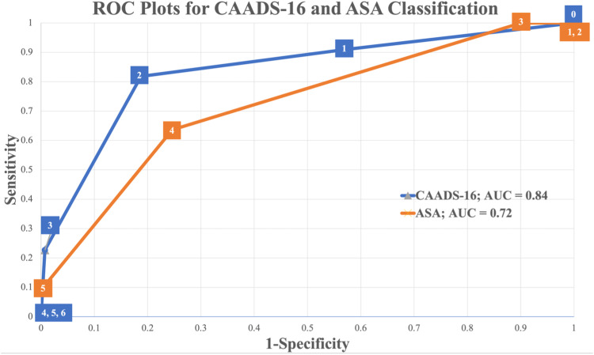
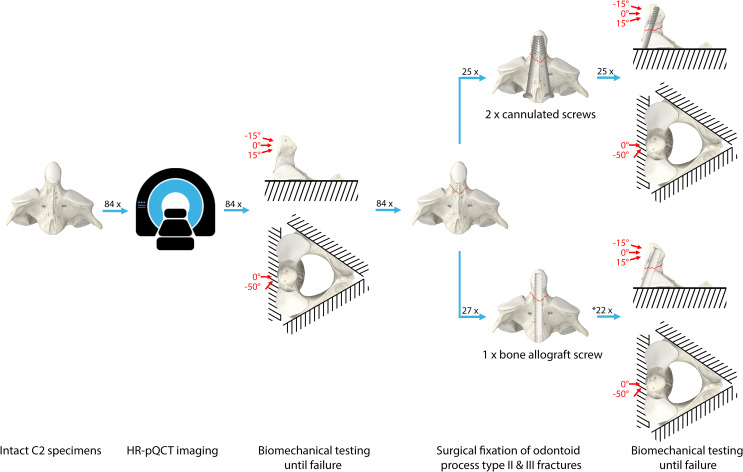
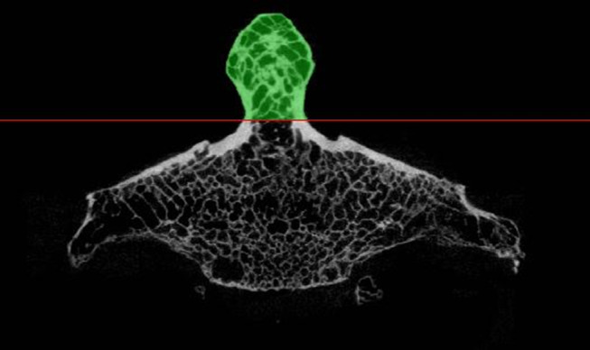
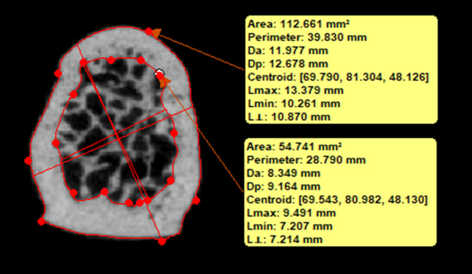
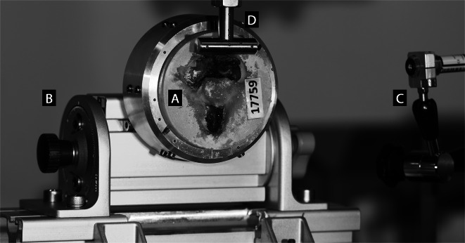
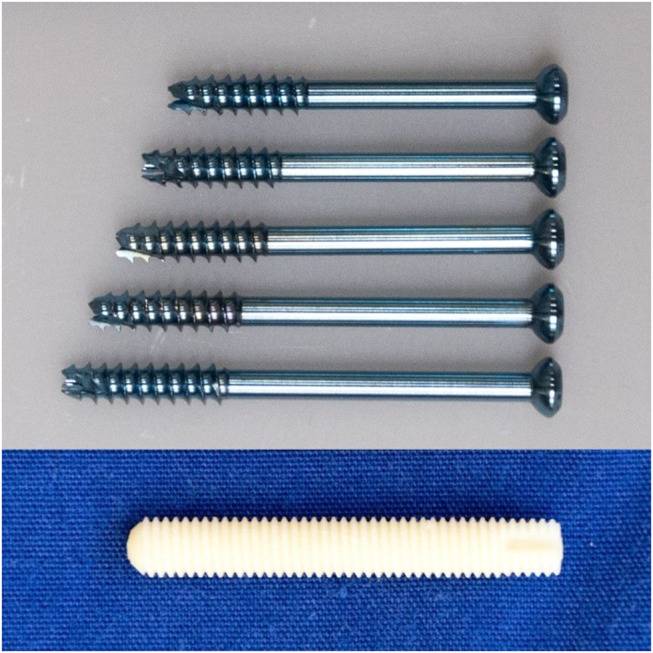
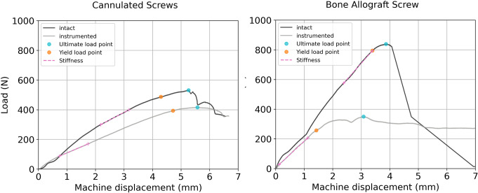
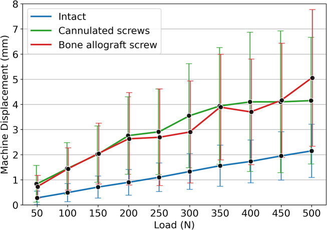
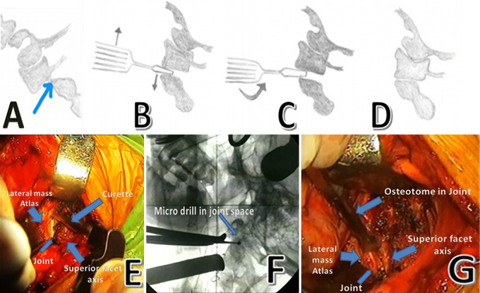
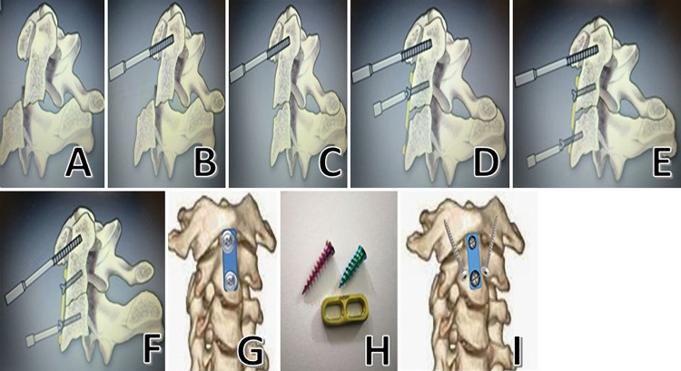

# Case Prep: Odontoid (Type II) Fracture Fixation

---

<!-- BEGIN CASE SNAPSHOT -->

## Case / Approach Snapshot

- **Anatomy at risk:** unstable columns, cord/roots, dura, vertebral artery or great-vessel/visceral structures by level, fracture lines, and fixation corridors.
- **Operative steps:** protect the spine during transfer/positioning, confirm levels and reduction goals, decompress when indicated, instrument/reconstruct stability, verify alignment and hardware, and plan ICU/brace/rehab needs; use the detailed operative sequence and approach notes below as the step-by-step source.
- **Rescue plans:** neurologic deterioration, reduction failure, vascular/visceral injury, durotomy, blood loss, hardware pullout, infection, and staged anterior/posterior stabilization.
- **Figures:** review [Figures, Imaging & Video](#figures-imaging--video) and the [Curated Image Set](#curated-image-set); embedded local figures should remain open-access, public-domain, or otherwise reusable with attribution.
- **Papers:** review [High-Yield Literature](#high-yield-literature) for seminal sources, modern reviews, and outcome data specific to this page.

<!-- END CASE SNAPSHOT -->

## One-Liner
[Age]yo [M/F] with a type [II/III] odontoid fracture ([Anderson-D'Alonzo]) following [fall/MVC] planned for [anterior odontoid screw / posterior C1-C2 fusion].

---

## Figures, Imaging & Video

**🎥 Operative video** — [search operative video on YouTube ▸](https://www.youtube.com/results?search_query=odontoid+fracture+surgery) · [The Neurosurgical Atlas ▸](https://www.neurosurgicalatlas.com)

> 🧭 **Operative approach:** [Posterior cervical approach](../approaches/posterior-cervical-approach.md) — posterior C1-C2 fixation/exposure principles when anterior odontoid screw is not the chosen strategy.

[Neurosurgical Atlas](https://www.neurosurgicalatlas.com) · [AO Surgery Reference](https://surgeryreference.aofoundation.org) · [Radiopaedia](https://radiopaedia.org/search?q=odontoid%20fracture&scope=all) · [PubMed Central](https://www.ncbi.nlm.nih.gov/pmc/?term=odontoid+fracture+screw+fixation) — operative figures © linked; see [media-sources.md](../../resources/media-sources.md)

---

<!-- BEGIN CURATED LITERATURE -->

## High-Yield Literature

- **Predicting Mortality Following Odontoid Fracture Fixation in Elderly Patients: CAADS-16 Score** — ElNemer W. Global spine journal 2025. [PubMed](https://pubmed.ncbi.nlm.nih.gov/38037824/)
- **Outcomes of Odontoid Process Fracture Surgery** — Sowa D. Ortopedia, traumatologia, rehabilitacja 2023. [PubMed](https://pubmed.ncbi.nlm.nih.gov/38088099/)
- **Odontoid process type II and III fracture fixation using bone allograft screws versus cannulated screws: a biomechanical study** — Benca E. Archives of orthopaedic and trauma surgery 2025. [PubMed](https://pubmed.ncbi.nlm.nih.gov/40119913/)
- **Biomechanics of odontoid fracture fixation. Comparison of the one- and two-screw technique** — Sasso R. Spine 1993. [PubMed](https://pubmed.ncbi.nlm.nih.gov/8272941/)
- **Percutaneous anterior odontoid screw fixation technique. A new instrument and a cadaveric study** — Kazan S. Acta neurochirurgica 1999. [PubMed](https://pubmed.ncbi.nlm.nih.gov/10392209/)
- **Computed tomographic evaluation of odontoid process: implications for anterior screw fixation of odontoid fractures in an adult population** — Daher MT. European spine journal : official publication of the European Spine Society, the European Spinal Deformity Society, and the European Section of the Cervical Spine Research Society 2011. [PubMed](https://pubmed.ncbi.nlm.nih.gov/21691900/)
- **Cervical Spine Navigation and Enabled Robotics: A New Frontier in Minimally Invasive Surgery** — Lebl DR. HSS journal : the musculoskeletal journal of Hospital for Special Surgery 2021. [PubMed](https://pubmed.ncbi.nlm.nih.gov/34539275/)
- **Medical devices of the head, neck, and spine** — Hunter TB. Radiographics : a review publication of the Radiological Society of North America, Inc 2004. [PubMed](https://pubmed.ncbi.nlm.nih.gov/14730051/)
- **Salvage of failed odontoid fixation through anterior C1/C2 transarticular screws** — Salem KM. European spine journal : official publication of the European Spine Society, the European Spinal Deformity Society, and the European Section of the Cervical Spine Research Society 2015. [PubMed](https://pubmed.ncbi.nlm.nih.gov/25619489/)
- **Odontoid Fusion** — Walker CT. Acta neurochirurgica. Supplement 2019. [PubMed](https://pubmed.ncbi.nlm.nih.gov/30610335/)

<!-- END CURATED LITERATURE -->

---

<!-- BEGIN CURATED IMAGE SET -->

## Curated Image Set

Open-access figures are embedded from PubMed Central articles and kept unique to this guide.

*Figure 2.. ROC curves for CAADS-16 score and ASA classification. The AUC is displayed in the legend, and the cut off values are represented in the squares of the curve. The ASA classification was... Source: [Predicting Mortality Following Odontoid Fracture Fixation in Elderly Patients: CAADS-16 Score](https://pmc.ncbi.nlm.nih.gov/articles/PMC11877605/) — Global Spine Journal 2023; CC BY-NC-ND.*

*Fig. 1. An overview of the study methodology. Eighty-four C2 specimens were scanned in high-resolution peripheral quantitative computed tomography (HR-pQCT) and biomechanically tested in... Source: [Odontoid process type II and III fracture fixation using bone allograft screws versus cannulated screws: a biomechanical study](https://pmc.ncbi.nlm.nih.gov/articles/PMC11929696/) — Archives of Orthopaedic and Trauma Surgery 2025; CC BY.*

*Fig. 2. Region of interest for the assessment of the volumetric bone mineral density (vBMD) (green). The cross-sectional ratio of cortical bone to total bone (Ct.Ar/Tt.Ar) was assessed in the... Source: [Odontoid process type II and III fracture fixation using bone allograft screws versus cannulated screws: a biomechanical study](https://pmc.ncbi.nlm.nih.gov/articles/PMC11929696/) — Archives of Orthopaedic and Trauma Surgery 2025; CC BY.*

*Fig. 3. Assessment of specimen-specific cross-sectional area and ratio of cortical bone of the odontoid process. Two polylines were created based on multiple manually set points on the outer and... Source: [Odontoid process type II and III fracture fixation using bone allograft screws versus cannulated screws: a biomechanical study](https://pmc.ncbi.nlm.nih.gov/articles/PMC11929696/) — Archives of Orthopaedic and Trauma Surgery 2025; CC BY.*

*Fig. 4. Experimental setup with a specimen mounted for biomechanical testing. The embedded specimen (A) was securely placed within an aluminum cup and could be rotated at either − 50° or 0° in... Source: [Odontoid process type II and III fracture fixation using bone allograft screws versus cannulated screws: a biomechanical study](https://pmc.ncbi.nlm.nih.gov/articles/PMC11929696/) — Archives of Orthopaedic and Trauma Surgery 2025; CC BY.*

*Fig. 5. Tested fixation devices (from top to bottom): self-drilling cannulated screws ⌀3.5 mm, L32/12 mm, L34/12 mm, L36/12 mm, L38/12 mm, L40/12 mm (Synthes GmbH, Zuchwil, Switzerland) and, 35... Source: [Odontoid process type II and III fracture fixation using bone allograft screws versus cannulated screws: a biomechanical study](https://pmc.ncbi.nlm.nih.gov/articles/PMC11929696/) — Archives of Orthopaedic and Trauma Surgery 2025; CC BY.*

*Fig. 6. Typical load-displacement curves from both implant groups including the evaluated biomechanical variables Source: [Odontoid process type II and III fracture fixation using bone allograft screws versus cannulated screws: a biomechanical study](https://pmc.ncbi.nlm.nih.gov/articles/PMC11929696/) — Archives of Orthopaedic and Trauma Surgery 2025; CC BY.*

*Fig. 7. Mean machine displacements over the corresponding load levels for the intact specimens and the following instrumentation with the two implant types. The whiskers represent the standard... Source: [Odontoid process type II and III fracture fixation using bone allograft screws versus cannulated screws: a biomechanical study](https://pmc.ncbi.nlm.nih.gov/articles/PMC11929696/) — Archives of Orthopaedic and Trauma Surgery 2025; CC BY.*

*FIG. 1.. A: Identifying the joint space below the lateral mass of the atlas (anatomical drawing). B: Inserting osteotome for manipulation (anatomical drawing). C: Rotating the osteotome to open... Source: [Unstable odontoid fractures: technical appraisal of anterior extrapharyangeal open reduction internal fixation for irreducible unstable odontoid fractures. Patient series](https://pmc.ncbi.nlm.nih.gov/articles/PMC9435568/) — Journal of Neurosurgery: Case Lessons 2021; CC BY-NC-ND.*

*FIG. 2.. A: Posteriorly displaced impacted fracture (anatomical image). B: Impaling the anterior arch of the atlas and distal fracture fragment with a tap (anatomical image). C: Repositioning the... Source: [Unstable odontoid fractures: technical appraisal of anterior extrapharyangeal open reduction internal fixation for irreducible unstable odontoid fractures. Patient series](https://pmc.ncbi.nlm.nih.gov/articles/PMC9435568/) — Journal of Neurosurgery: Case Lessons 2021; CC BY-NC-ND.*

<!-- END CURATED IMAGE SET -->

---

## History of Present Illness
- Chief complaint: Neck pain after trauma; may have minimal/no deficit (or high cervical cord injury)
- Mechanism, neurological status, associated injuries (especially elderly fall — common)
- **Anderson-D'Alonzo:** Type I (tip, stable), **Type II (base — most common, high nonunion)**, Type III (into body, better union)
- Displacement, angulation, direction; chronicity

---

## Imaging Review
### CT cervical (thin-cut, reconstructions)
- Fracture type, displacement, angulation (anterior vs posterior), comminution
- **C1-C2 anatomy** for screw planning (vertebral artery course, C2 pedicle/pars, C1 lateral mass)
- Transverse atlantal ligament integrity (CT/MRI)
### MRI
- Ligament integrity (transverse ligament — if disrupted, screw alone insufficient), cord signal, soft tissue
### CTA
- Vertebral artery anatomy (high-riding VA, anomalies — affects C2 screw safety)
### X-ray (flexion/extension if stability unclear, with caution)

---

## Labs
- CBC, BMP, Coags, Type and screen

---

## Neurological Examination
- Full exam (high cervical — respiratory, all extremities), document deficits

---

## Surgical Planning

### Procedure Selection
- **Anterior odontoid screw:** preserves C1-C2 rotation; for reducible Type II fractures with favorable oblique pattern (anterosuperior-posteroinferior), intact transverse ligament, good bone; **contraindicated** in osteoporosis, comminution, irreducible, unfavorable fracture line, disrupted transverse ligament, barrel chest/kyphosis (trajectory)
- **Posterior C1-C2 fusion** (Goel-Harms C1 lateral mass + C2 pedicle screws; or Magerl transarticular): for irreducible, comminuted, transverse ligament disruption, nonunion, poor bone; sacrifices rotation
- Elderly: rising use of surgical fixation vs hard collar (nonunion common but fibrous union often tolerated)

### Position
- **Anterior screw:** supine, neck slightly extended, Mayfield/traction for reduction, biplanar fluoroscopy (AP + lateral, open-mouth), radiolucent setup
- **Posterior C1-C2:** prone, Mayfield, neck neutral, reduce, fluoroscopy/navigation

### Key Surgical Steps (Anterior Odontoid Screw)
1. Reduce fracture (positioning/traction), confirm on fluoroscopy
2. Anterior cervical (Smith-Robinson-type) exposure to C2-C3 level, trajectory from the anteroinferior C2 body
3. Entry at anteroinferior C2 endplate, **guidewire up the odontoid across the fracture to the tip** under biplanar fluoroscopy
4. Cannulated drill, tap, place **lag screw** (1 or 2 screws) to compress fracture across the fracture line into the dens tip
5. Confirm compression/reduction and screw position (both fluoro planes)
6. Closure

### Key Surgical Steps (Posterior C1-C2, Goel-Harms)
1. Prone, expose C1 posterior arch and C2
2. **C1 lateral mass screws** (entry below the posterior arch, protect C2 nerve root/venous plexus)
3. **C2 pedicle/pars screws** (assess VA on CTA — high-riding VA contraindicates pedicle screw → use pars/translaminar)
4. Reduce C1 on C2, place rods, lock
5. Decorticate, bone graft (autograft/allograft) for fusion
6. Closure

### Critical Anatomy & Structures at Risk
1. **Vertebral arteries** (C2 screw trajectory — high-riding VA; C1-C2 region) — catastrophic
2. **Spinal cord / cervicomedullary junction** — high cervical, narrow margin
3. **C2 nerve root / venous plexus** (C1 lateral mass screw — bleeding)
4. **Esophagus/airway** (anterior approach), hypoglossal/superior laryngeal nerves (high anterior)
5. Transverse atlantal ligament (competence determines construct)

### Equipment
- Anterior odontoid screw set (cannulated lag screws) OR C1-C2 posterior screw/rod system
- **Biplanar fluoroscopy / navigation**, traction/reduction tools
- Bone graft (posterior fusion), microscope/loupes

### Monitoring
- SSEPs/MEPs (high cervical), especially during positioning/reduction; awake fiberoptic intubation if unstable/myelopathic

### Anesthesia
- **Awake fiberoptic intubation** (unstable C-spine, avoid hyperextension), MAP support, arterial line, in-line stabilization

### Potential Complications
1. **Vertebral artery injury** (C2 screw), cord/cervicomedullary injury
2. Nonunion (esp. Type II, elderly, anterior screw), screw pullout/malposition
3. Dysphagia/airway (anterior), C2 neuralgia, loss of rotation (posterior fusion)
4. Hardware failure, adjacent issues

---

## Operative Note Template

**Preoperative Diagnosis:** Type [II] odontoid (dens) fracture [displaced ___ mm], craniocervical instability

**Postoperative Diagnosis:** Same

**Procedure:** [Anterior odontoid screw fixation / Posterior C1-C2 instrumented fusion (Goel-Harms — C1 lateral mass + C2 pedicle screws)] for type [II] odontoid fracture

**Surgeon / Assistant:**
**Anesthesia:** General endotracheal (awake fiberoptic intubation)
**EBL / Fluids:**
**Implants:** [Cannulated lag odontoid screw(s) / C1 lateral mass and C2 pedicle screws and rods — system/sizes; bone graft]
**Monitoring:** SSEP / MEP — stable [note any change with positioning/reduction]
**Complications:** None

**Indications:** [Age]yo [M/F] with a type II odontoid fracture after [mechanism], [reducible, intact transverse ligament, favorable fracture line → anterior screw / irreducible/comminuted/disrupted transverse ligament/poor bone → posterior C1-C2 fusion]. CTA showed [no high-riding VA / VA anatomy permitting planned screws]. Risks/benefits/alternatives (including collar immobilization and nonunion risk) discussed.

**Description of Procedure:** After consent and time-out, **awake fiberoptic intubation** was performed to protect the unstable cervical spine, and neuromonitoring baselines were confirmed before and after positioning. The fracture was reduced [with positioning/traction] and verified on biplanar fluoroscopy.

*[Anterior screw]:* The patient was positioned supine with the neck in slight extension. A right anterior cervical (Smith-Robinson) approach exposed the C2-C3 level. Under biplanar fluoroscopy, a guidewire was advanced from the anteroinferior body of C2 up the dens, across the fracture, to the tip. A cannulated lag screw was placed over the wire to compress the fracture. Reduction, compression, and screw position were confirmed in both planes.

*[Posterior C1-C2 Goel-Harms]:* The patient was positioned prone in Mayfield fixation with neutral alignment. A posterior midline exposure of the C1 posterior arch and C2 was performed. C1 lateral mass screws were placed (protecting the C2 root/venous plexus) and C2 [pedicle/pars] screws placed per the CTA-verified VA anatomy. C1 was reduced on C2, rods seated and locked, and the decorticated surfaces grafted (autograft/allograft) for arthrodesis.

Final fluoroscopy confirmed satisfactory reduction and hardware. Neuromonitoring was stable throughout. Closure was performed in layers [± drain]. The patient was awakened, neurologically [at baseline], and transferred in stable condition.

---

## Postoperative Plan
- ICU/step-down, neuro checks (high cervical — respiratory), airway monitoring (anterior — swelling)
- CT postop (screw position, reduction), cervical collar per construct/surgeon
- DVT prophylaxis, pain control, dysphagia/aspiration precautions (anterior)
- Follow-up CT for union; counsel re: nonunion risk; flexion/extension films later
