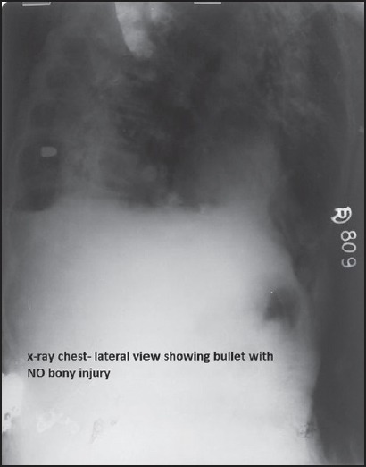
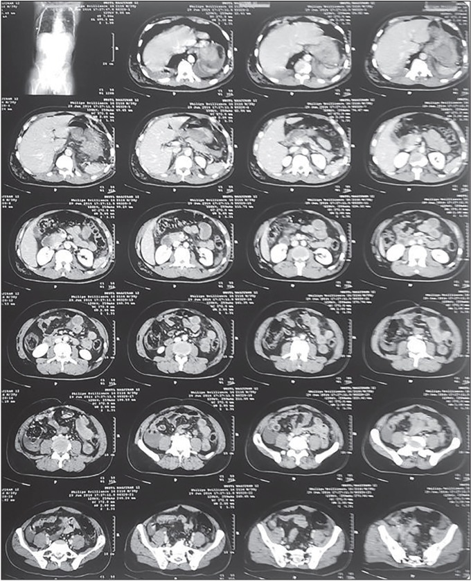
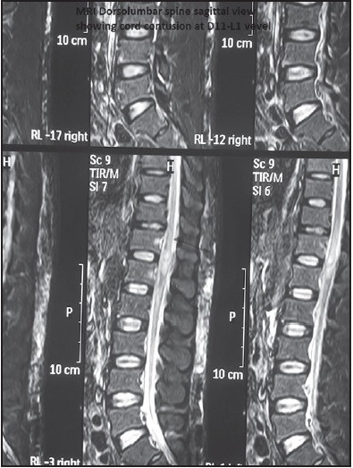
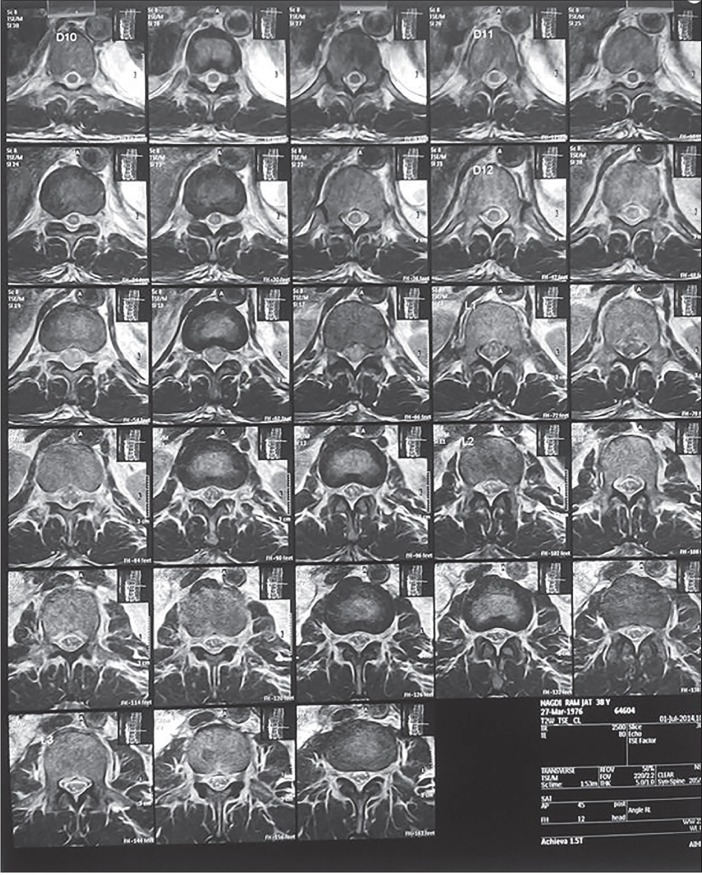
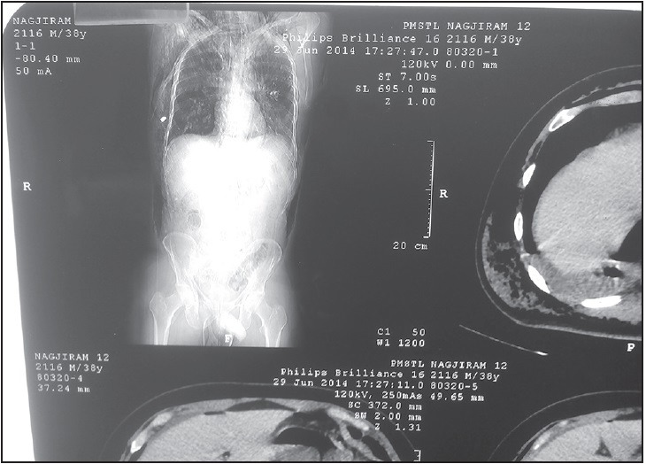
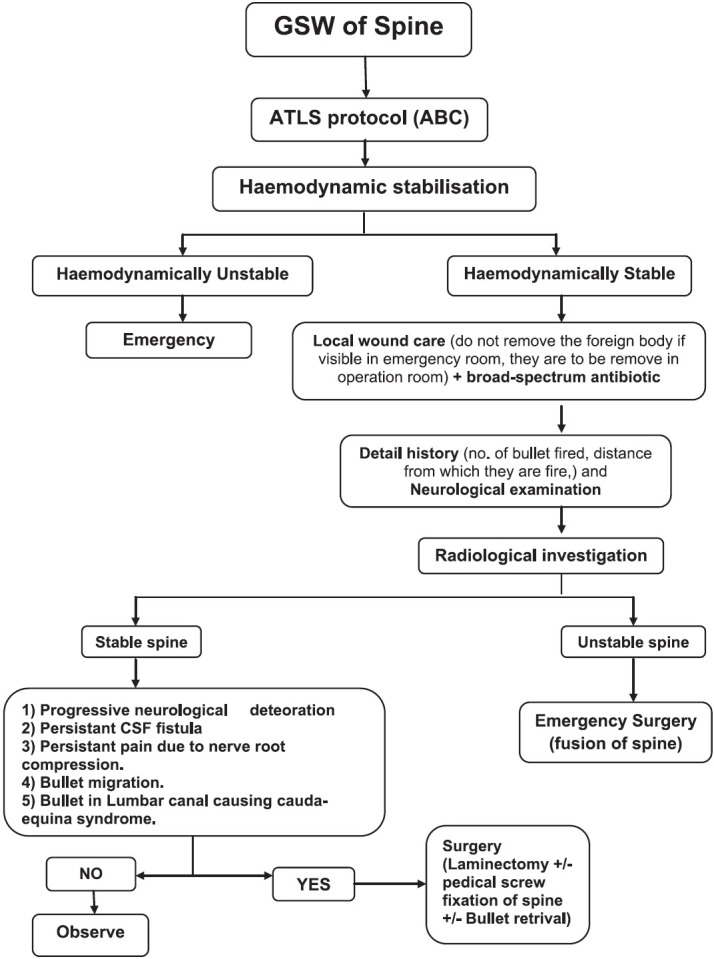
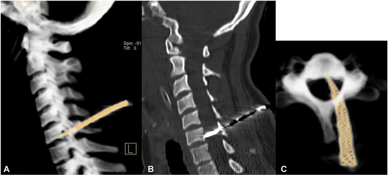
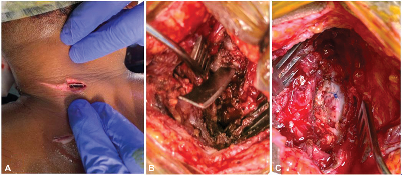
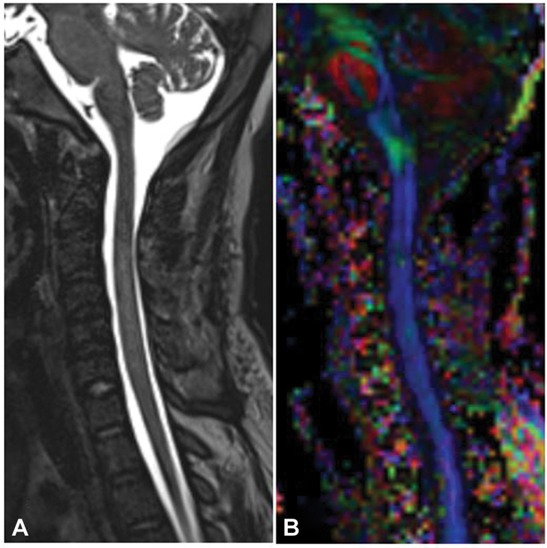
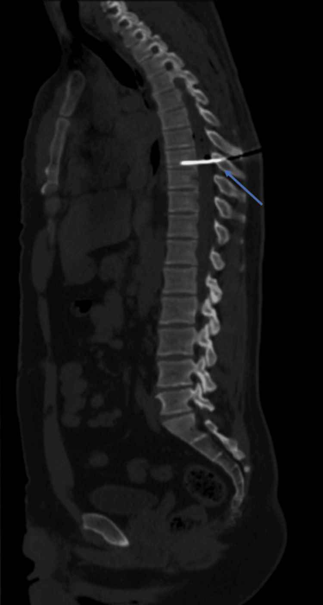

# Case Prep: Penetrating Spine Injury (Gunshot / Stab) Management

---

<!-- BEGIN CASE DOSSIER -->

## Case / Approach Dossier

- **Anatomy at risk:** unstable columns, cord/roots, dura, vertebral artery or great-vessel/visceral structures by level, fracture lines, and fixation corridors.
- **Operative steps:** protect the spine during transfer/positioning, confirm levels and reduction goals, decompress when indicated, instrument/reconstruct stability, verify alignment and hardware, and plan ICU/brace/rehab needs; use the detailed operative sequence and approach notes below as the step-by-step source.
- **Rescue plans:** neurologic deterioration, reduction failure, vascular/visceral injury, durotomy, blood loss, hardware pullout, infection, and staged anterior/posterior stabilization.
- **Figures:** review [Figures, Imaging & Video](#figures-imaging--video) and the [Curated Image Set](#curated-image-set); embedded local figures should remain open-access, public-domain, or otherwise reusable with attribution.
- **Papers:** review [High-Yield Literature](#high-yield-literature) for seminal sources, modern reviews, and outcome data specific to this page.
- **Textbook cross-checks:** use [Textbook Cross-Checks](#textbook-cross-checks) and the [Source Crosswalk](../../resources/source-crosswalk.md) to cite copyrighted textbooks/atlases while summarizing in original words.

<!-- END CASE DOSSIER -->

## One-Liner
[Age]yo [M/F] with a penetrating [gunshot / stab] spinal injury at [level] with [complete/incomplete SCI / nerve root deficit / CSF leak / retained fragment] planned for [observation vs decompression/debridement ± stabilization].

---

## Figures, Imaging & Video

**🎥 Operative video** — [search operative video on YouTube ▸](https://www.youtube.com/results?search_query=spinal+gunshot+injury+surgery) · [The Neurosurgical Atlas ▸](https://www.neurosurgicalatlas.com)

[Neurosurgical Atlas](https://www.neurosurgicalatlas.com) · [AO Surgery Reference](https://surgeryreference.aofoundation.org) · [Radiopaedia](https://radiopaedia.org/search?q=spinal%20gunshot%20injury&scope=all) · [PubMed Central](https://www.ncbi.nlm.nih.gov/pmc/?term=penetrating+spinal+injury+gunshot) — operative figures © linked; see [media-sources.md](../../resources/media-sources.md)

---

<!-- BEGIN TEXTBOOK CROSS-CHECKS -->

## Textbook Cross-Checks

- **Spine anatomy and biomechanics:** Benzel Spine; Textbook of Spinal Surgery; Surgical Anatomy and Techniques to the Spine — confirm levels, approach-side anatomy, neural/vascular structures at risk, alignment, stability, and fixation rationale.
- **Technique sequence:** Youmans and Winn; Benzel Spine; Greenberg — review positioning, localization, exposure, decompression, instrumentation, fusion/reconstruction, and closure in original language.
- **Complication rescue:** Benzel Spine; Greenberg; Youmans and Winn — cross-check durotomy, neurologic change, vascular injury, wrong-level prevention, infection, implant failure, and postoperative restrictions.
- **Copyright-safe use:** cite these sources as private cross-checks, then write the guide content in original words; do not re-host textbook pages, figures, tables, or board-review card material. See [Source Crosswalk & Copyright-Safe Use](../../resources/source-crosswalk.md).

<!-- END TEXTBOOK CROSS-CHECKS -->

<!-- BEGIN CURATED LITERATURE -->

## High-Yield Literature

- **Penetrating spine injury bisecting thoracic spinal canal with no significant neurological deficits-The midline cord syndrome** — Sarkar B. Spinal cord series and cases 2018. [PubMed](https://pubmed.ncbi.nlm.nih.gov/30455986/)
- **Spinal Cord Stimulation for Painful Neuropathic Cauda Equina Syndrome Following Ballistic Penetrating Lumbar Spine Injury: Proof-of-Concept Case** — Beucler N. Military medicine 2025. [PubMed](https://pubmed.ncbi.nlm.nih.gov/41092286/)
- **Brown-Séquard Syndrome Following a Thoracic Spine Stab Wound: A Case Report** — Moreira TS. Cureus 2023. [PubMed](https://pubmed.ncbi.nlm.nih.gov/37954796/)
- **Penetrating spinal injury with a wooden fragment: a case report and review of the literature** — Gul S. Spine 2010. [PubMed](https://pubmed.ncbi.nlm.nih.gov/21102287/)
- **Surgical Considerations and Neurological Outcomes in Ballistic Penetrating Subaxial Cervical Spine Fractures: A Retrospective Analysis** — Batbold A. Clinical spine surgery 2025. [PubMed](https://pubmed.ncbi.nlm.nih.gov/41025847/)
- **Brown-Sequard syndrome associated with a spinal cord injury caused by a retained screwdriver: A case report and literature review** — Abdulqader MN. Surgical neurology international 2022. [PubMed](https://pubmed.ncbi.nlm.nih.gov/36447879/)
- **Minimally invasive approach to non-missile penetrating spinal injury with resultant retained foreign body: A case report and review of the literature** — Moldovan K. Clinical neurology and neurosurgery 2019. [PubMed](https://pubmed.ncbi.nlm.nih.gov/31302378/)
- **Gunshot wound causing complete spinal cord injury without mechanical violation of spinal axis: Case report with review of literature** — Patil R. Journal of craniovertebral junction & spine 2015. [PubMed](https://pubmed.ncbi.nlm.nih.gov/26692690/)
- **A case series of penetrating spinal trauma: comparisons to blunt trauma, surgical indications, and outcomes** — Morrow KD. Neurosurgical focus 2019. [PubMed](https://pubmed.ncbi.nlm.nih.gov/30835674/)
- **A Unique Case of an Arrow-Related Penetrating Spinal Cord Injury in Kenya and a Comprehensive Literature Review** — Chelmis FS. Journal of neurological surgery reports 2026. [PubMed](https://pubmed.ncbi.nlm.nih.gov/41704584/)

<!-- END CURATED LITERATURE -->

---

<!-- BEGIN CURATED IMAGE SET -->

## Curated Image Set

Open-access figures are embedded from PubMed Central articles and kept unique to this guide.

*Figure 1. X-ray chest lateral view showing the bullet with no bony injuries Source: [Gunshot wound causing complete spinal cord injury without mechanical violation of spinal axis: Case report with review of literature](https://pmc.ncbi.nlm.nih.gov/articles/PMC4660489/) — Journal of Craniovertebral Junction & Spine 2015; CC BY-NC-SA.*

*Figure 2. Computed tomography scan of the thorax and abdomen Source: [Gunshot wound causing complete spinal cord injury without mechanical violation of spinal axis: Case report with review of literature](https://pmc.ncbi.nlm.nih.gov/articles/PMC4660489/) — Journal of Craniovertebral Junction & Spine 2015; CC BY-NC-SA.*

*Figure 3. Magnetic resonance imaging dorso-lumbar spine (sagittal view) showing cord contusion at D11-L1 vertebral level Source: [Gunshot wound causing complete spinal cord injury without mechanical violation of spinal axis: Case report with review of literature](https://pmc.ncbi.nlm.nih.gov/articles/PMC4660489/) — Journal of Craniovertebral Junction & Spine 2015; CC BY-NC-SA.*

*Figure 4. Magnetic resonance imaging dorso-lumbar spine coronal view showing cord contusion at D11-L1 vertebral level Source: [Gunshot wound causing complete spinal cord injury without mechanical violation of spinal axis: Case report with review of literature](https://pmc.ncbi.nlm.nih.gov/articles/PMC4660489/) — Journal of Craniovertebral Junction & Spine 2015; CC BY-NC-SA.*

*Figure 5. Topogram image of computed tomography scan Thorax and abdomen showing bullet in right lateral chest wall Source: [Gunshot wound causing complete spinal cord injury without mechanical violation of spinal axis: Case report with review of literature](https://pmc.ncbi.nlm.nih.gov/articles/PMC4660489/) — Journal of Craniovertebral Junction & Spine 2015; CC BY-NC-SA.*

*Figure 6. Systematic management of GSW of spine Source: [Gunshot wound causing complete spinal cord injury without mechanical violation of spinal axis: Case report with review of literature](https://pmc.ncbi.nlm.nih.gov/articles/PMC4660489/) — Journal of Craniovertebral Junction & Spine 2015; CC BY-NC-SA.*

*Fig. 1. Computed tomography cervical spine: ( A , B ) Sagittal images showing the path of impaled knife passing through C5 lamina, across the spinal canal onto C6 vertebral body. ( C ) Axial... Source: [Role of Whole-Body Computed Tomography Scan to Avoid Missed Foreign Body in Patients with Multiple Stab Injury: A Rare Case of Retained Impaled Knife Blade with Intact Neurology](https://pmc.ncbi.nlm.nih.gov/articles/PMC9473809/) — Asian Journal of Neurosurgery 2022; CC BY-NC-ND.*

*Fig. 2. Intraoperative images showing ( A ) incised wound over the posterior aspect of the neck with a visible broken knife blade below the skin, ( B ) wound exploration around knife blade that... Source: [Role of Whole-Body Computed Tomography Scan to Avoid Missed Foreign Body in Patients with Multiple Stab Injury: A Rare Case of Retained Impaled Knife Blade with Intact Neurology](https://pmc.ncbi.nlm.nih.gov/articles/PMC9473809/) — Asian Journal of Neurosurgery 2022; CC BY-NC-ND.*

*Fig. 3. Postoperative magnetic resonance imaging: ( A ) Sagittal T2-weighted sequence with normal cord without evidence of cerebrospinal fluid leak and ( B ) diffusion tensor imaging... Source: [Role of Whole-Body Computed Tomography Scan to Avoid Missed Foreign Body in Patients with Multiple Stab Injury: A Rare Case of Retained Impaled Knife Blade with Intact Neurology](https://pmc.ncbi.nlm.nih.gov/articles/PMC9473809/) — Asian Journal of Neurosurgery 2022; CC BY-NC-ND.*

*Figure 1. A computed tomography scan depicting the penetrating object crossing the T8 vertebral body (blue arrow). Source: [Brown-Séquard Syndrome Following a Thoracic Spine Stab Wound: A Case Report](https://pmc.ncbi.nlm.nih.gov/articles/PMC10639128/) — Cureus 2023; CC BY.*

<!-- END CURATED IMAGE SET -->

---

## History of Present Illness
- Chief complaint: Penetrating trauma with neurological deficit
- Mechanism (handgun/high-velocity rifle/stab), trajectory, **associated visceral/vascular injuries** (thoracoabdominal — often take priority)
- **Most civilian gunshot SCIs are managed non-operatively** (surgery often doesn't improve neuro outcome and adds risk) — selective indications
- Hemodynamic stability, other injuries

---

## Past Medical History
- Associated injuries (vascular, visceral, airway), tetanus status, anticoagulation
- Standard PMH; trauma ATLS workup

---

## Imaging Review
### CT (spine + trauma pan-scan)
- **Fragment/bullet location and trajectory**, bony injury, canal involvement, retained fragments, instability (less common with GSW than blunt), associated injuries
- **Caution: MRI** only if confirmed **non-ferromagnetic** fragment (most modern bullets are, but verify) — risk of migration/heating
### MRI (if MRI-safe)
- Cord injury, hematoma, compression by fragment/disc
### CT angiography
- Vascular injury (vertebral/carotid, great vessels)

---

## Labs
- CBC, BMP, Coags, **type and crossmatch**, trauma labs, tetanus

---

## Neurological Examination
- **Complete ASIA exam**, level, complete vs incomplete, sacral sparing, sphincter; serial

---

## Surgical Planning

### Diagnosis & Indication (Selective Surgery)
- **Non-operative** (most): complete SCI without ongoing compression, stable, no CSF leak, no migrating fragment
- **Surgical indications:**
  - **Incomplete/progressive deficit with a compressive fragment/hematoma** in the canal (decompress)
  - **CSF leak / dural laceration** (repair)
  - **Instability** (uncommon with GSW; more with high-velocity/blunt) → stabilize
  - **Migrating fragment**, infection/abscess, fragment in canal with deteriorating function
  - **Cauda equina** compression (better recovery potential — decompress)
- **Bowel-transgressing trajectory:** antibiotics (contamination); fragment removal from canal controversial
- Goals: decompress salvageable neural tissue, repair dura, debride, stabilize if unstable

### Position
- Per level/approach (usually posterior for canal decompression); prone; IONM if incomplete

### Key Surgical Steps
1. Trauma stabilization / associated injury priority first (vascular, visceral)
2. Approach the canal (laminectomy) at the injured level
3. **Decompress** — remove the compressive fragment/bone/disc/hematoma from the canal (only if it will help — incomplete deficit/cauda)
4. **Dural repair** if CSF leak/laceration (primary or graft — prevent fistula/pseudomeningocele/meningitis)
5. **Debride** devitalized/contaminated tissue (esp. bowel-contaminated trajectory)
6. **Stabilize** if unstable (instrumentation)
7. Copious irrigation, closure; antibiotics

### Critical Anatomy & Structures at Risk
1. **Spinal cord / cauda / nerve roots** (already injured)
2. **Vascular structures** along trajectory (vertebral, great vessels)
3. **Dura** (leak/fistula), adjacent viscera (trajectory), lead toxicity (rare, intra-articular/CSF fragments)

### Equipment
- Decompression/instrumentation sets, microscope, dural repair materials
- Copious irrigation, fluoroscopy, culture media (contaminated)

### Monitoring
- SSEPs/MEPs (incomplete injuries)

### Anesthesia
- Trauma/resuscitation, MAP support (SCI), crossmatched blood, antibiotics, tetanus, coordinate trauma/vascular

### Potential Complications
1. CSF fistula/pseudomeningocele/meningitis, infection (contaminated)
2. No neurological improvement (complete injuries), worsening (manipulation)
3. Vascular injury, instability, lead toxicity (rare), associated-injury complications

---

## Operative Note Template
**Preoperative Diagnosis:** Penetrating [gunshot/stab] spinal injury at [level] with [incomplete SCI / CSF leak / canal fragment / instability]

**Postoperative Diagnosis:** Same

**Procedure:** [Level] laminectomy for decompression [± dural repair, debridement, instrumented stabilization] for penetrating spinal injury

**Surgeon / Assistant:** [± trauma/vascular]
**Anesthesia:** General endotracheal
**EBL / Fluids / Blood products:** [crossmatched]
**Adjuncts:** Fluoroscopy, microscope; SSEP/MEP (incomplete injuries); culture media (contaminated)
**Implants:** [Dural graft; instrumentation if unstable], antibiotics, tetanus
**Complications:** None

**Indications:** [Age]yo [M/F] with a penetrating spinal injury at [level]. Surgery was indicated for [an incomplete/progressive deficit with a compressive canal fragment/hematoma / CSF leak / instability / contaminated trajectory], after trauma stabilization and management of associated injuries. Risks discussed.

**Description of Procedure:** After trauma stabilization and consent/time-out, general anesthesia was induced [with MAP support for SCI] and neuromonitoring established [for the incomplete injury]. The patient was positioned [prone] and a laminectomy performed at [level] to access the canal. The compressive [fragment/bone/hematoma] was removed and the neural elements decompressed. [A dural laceration was repaired primarily/with graft to prevent a fistula.] [Devitalized/contaminated tissue was debrided.] [Instrumented stabilization was performed for instability.] The field was copiously irrigated and antibiotics administered.

Closure was performed in layers. The patient was transferred to the ICU with serial ASIA exams, MAP support, antibiotics, and CSF-leak precautions.

---

## Postoperative Plan
- ICU, **ASIA exams**, MAP support, antibiotics (broad if contaminated), tetanus
- CSF leak monitoring, CT postop
- DVT prophylaxis (timing per bleeding/injuries), bowel/bladder/skin care, SCI rehab
- Coordinate trauma/vascular/general surgery; psychosocial support
- Follow-up imaging; counsel re: prognosis by completeness of injury
