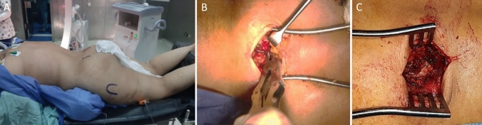
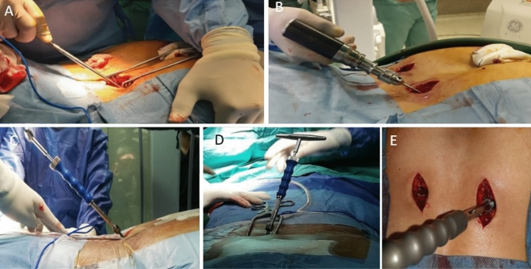
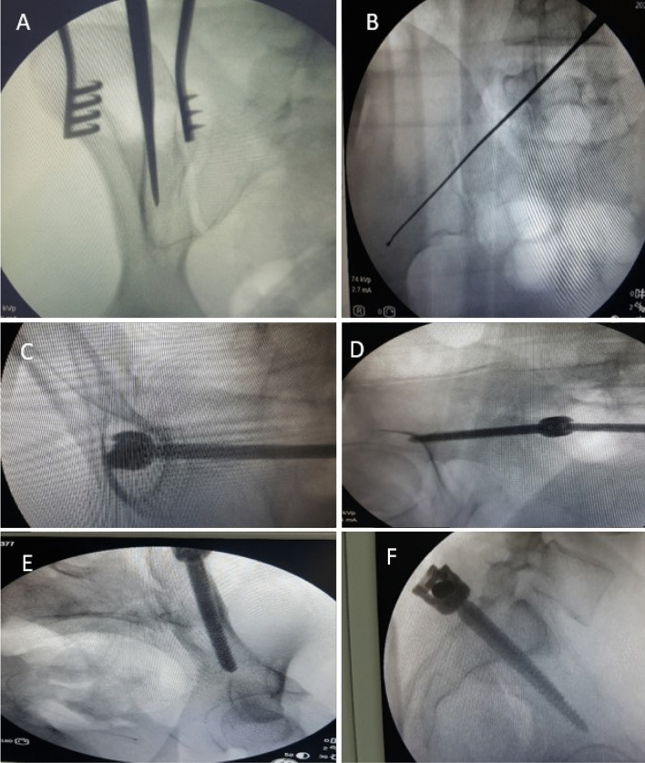
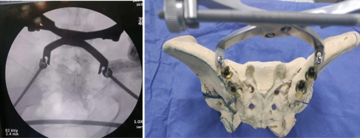
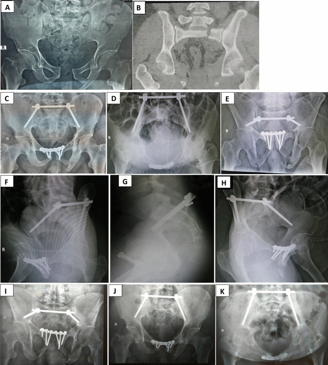
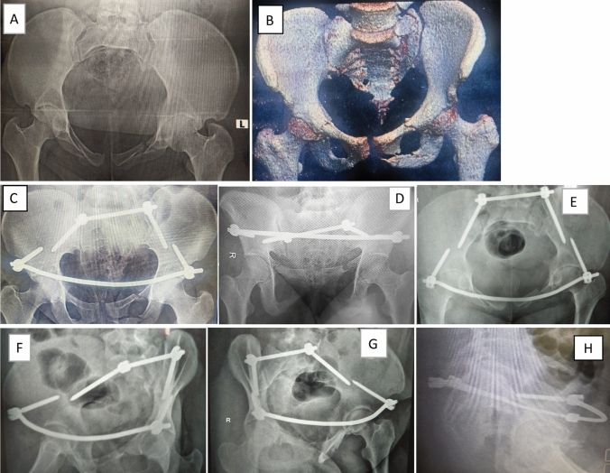
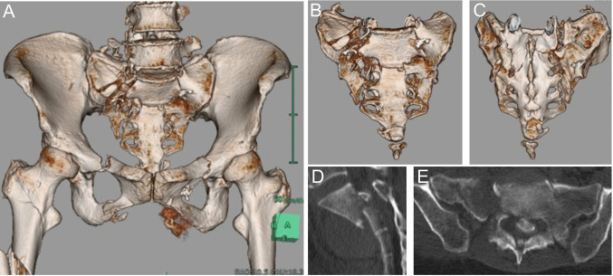
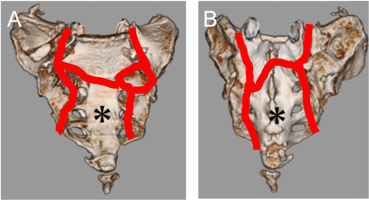
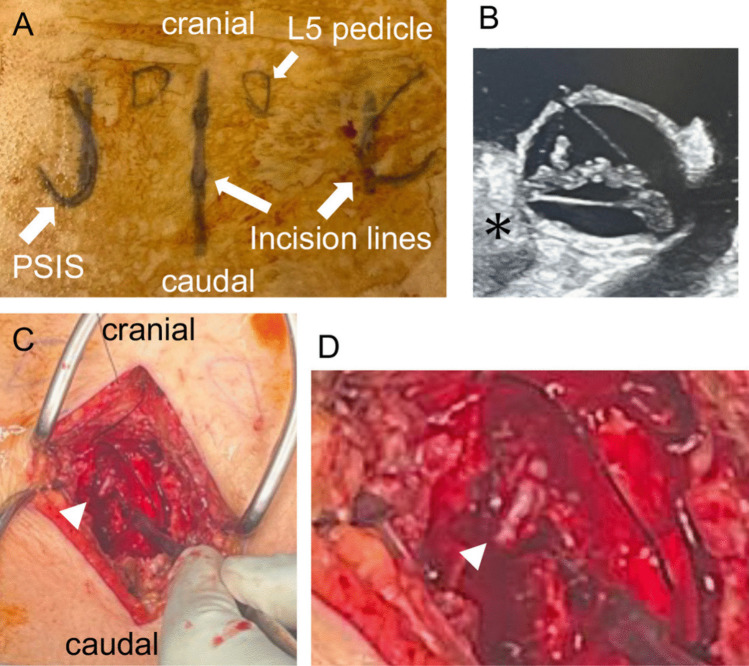
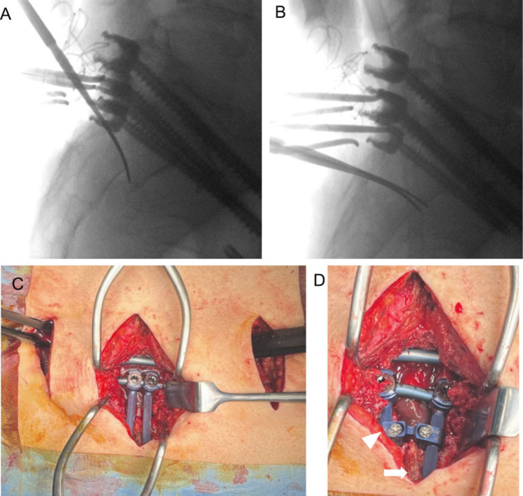

# Case Prep: Sacral Fracture / Spinopelvic (Lumbopelvic) Fixation

---

<!-- BEGIN CASE SNAPSHOT -->

## Case / Approach Snapshot

- **Anatomy at risk:** unstable columns, cord/roots, dura, vertebral artery or great-vessel/visceral structures by level, fracture lines, and fixation corridors.
- **Operative steps:** protect the spine during transfer/positioning, confirm levels and reduction goals, decompress when indicated, instrument/reconstruct stability, verify alignment and hardware, and plan ICU/brace/rehab needs; use the detailed operative sequence and approach notes below as the step-by-step source.
- **Rescue plans:** neurologic deterioration, reduction failure, vascular/visceral injury, durotomy, blood loss, hardware pullout, infection, and staged anterior/posterior stabilization.
- **Figures:** review [Figures, Imaging & Video](#figures-imaging--video) and the [Curated Image Set](#curated-image-set); embedded local figures should remain open-access, public-domain, or otherwise reusable with attribution.
- **Papers:** review [High-Yield Literature](#high-yield-literature) for seminal sources, modern reviews, and outcome data specific to this page.
- **Textbook cross-checks:** use [Textbook Cross-Checks](#textbook-cross-checks) and the [Source Crosswalk](../../resources/source-crosswalk.md) to cite copyrighted textbooks/atlases while summarizing in original words.

<!-- END CASE SNAPSHOT -->

## One-Liner
[Age]yo [M/F] with a [Denis zone / U-type spinopelvic dissociation] sacral fracture following [high-energy fall/MVC] [± cauda equina/sacral nerve deficit] planned for [lumbopelvic (spinopelvic) fixation / iliosacral screw fixation / sacral decompression].

---

## Figures, Imaging & Video

**🎥 Operative video** — [search operative video on YouTube ▸](https://www.youtube.com/results?search_query=sacral+fracture+surgery) · [The Neurosurgical Atlas ▸](https://www.neurosurgicalatlas.com)

[Neurosurgical Atlas](https://www.neurosurgicalatlas.com) · [AO Surgery Reference](https://surgeryreference.aofoundation.org) · [Radiopaedia](https://radiopaedia.org/search?q=sacral%20fracture&scope=all) · [PubMed Central](https://www.ncbi.nlm.nih.gov/pmc/?term=sacral+fracture+spinopelvic+fixation) — operative figures © linked; see [media-sources.md](../../resources/media-sources.md)

---

<!-- BEGIN TEXTBOOK CROSS-CHECKS -->

## Textbook Cross-Checks

- **Spine anatomy and biomechanics:** Benzel Spine; Textbook of Spinal Surgery; Surgical Anatomy and Techniques to the Spine — confirm levels, approach-side anatomy, neural/vascular structures at risk, alignment, stability, and fixation rationale.
- **Technique sequence:** Youmans and Winn; Benzel Spine; Greenberg — review positioning, localization, exposure, decompression, instrumentation, fusion/reconstruction, and closure in original language.
- **Complication rescue:** Benzel Spine; Greenberg; Youmans and Winn — cross-check durotomy, neurologic change, vascular injury, wrong-level prevention, infection, implant failure, and postoperative restrictions.
- **Copyright-safe use:** cite these sources as private cross-checks, then write the guide content in original words; do not re-host textbook pages, figures, tables, or board-review card material. See [Source Crosswalk & Copyright-Safe Use](../../resources/source-crosswalk.md).

<!-- END TEXTBOOK CROSS-CHECKS -->

<!-- BEGIN CURATED LITERATURE -->

## High-Yield Literature

- **Spondylopelvic dissociation** — Sullivan MP. The Orthopedic clinics of North America 2014. [PubMed](https://pubmed.ncbi.nlm.nih.gov/24267208/)
- **Traditional versus Minimally Invasive Spinopelvic Fixation for Sacral Fracture Treatment in Vertically Unstable Pelvic Fractures** — Tsai YT. Journal of personalized medicine 2022. [PubMed](https://pubmed.ncbi.nlm.nih.gov/35207750/)
- **Percutaneous lumbopelvic fixation for pathologic sacral fractures and spinopelvic dissociation: patient series** — Baksh N. Journal of neurosurgery. Case lessons 2023. [PubMed](https://pubmed.ncbi.nlm.nih.gov/37581594/)
- **Traumatic spinopelvic dissociation or U-shaped sacral fracture: a review of the literature** — Yi C. Injury 2012. [PubMed](https://pubmed.ncbi.nlm.nih.gov/21236426/)
- **Minimally Invasive Spinopelvic Fixation for Unstable Bilateral Sacral Fractures** — Koshimune K. Clinical spine surgery 2016. [PubMed](https://pubmed.ncbi.nlm.nih.gov/27002375/)
- **Spinopelvic fixation for vertically unstable AO type C pelvic fractures and sacral fractures with spinopelvic dissociation- A systematic review and pooled analysis involving 479 patients** — Patel S. Journal of orthopaedics 2022. [PubMed](https://pubmed.ncbi.nlm.nih.gov/35241881/)
- **Robotic-Assisted Minimally Invasive Spinopelvic Fixation for Traumatic Sacral Fractures: Case Series Investigating Early Safety and Efficacy** — Hardigan AA. World neurosurgery 2023. [PubMed](https://pubmed.ncbi.nlm.nih.gov/37315895/)
- **Lumbopelvic Fixation for Sacral Insufficiency Fracture Presenting with Sphincter Dysfunction** — Maki S. Case reports in orthopedics 2019. [PubMed](https://pubmed.ncbi.nlm.nih.gov/31093401/)
- **Treatment of Unstable Sacral Fracture with Minimally Invasive Spinopelvic Posterior Fixation and an Internal Anterior Fixator in a 95-Year-Old Patient with Diffuse Idiopathic Skeletal Hyperostosis: A Case Report** — Sasagawa T. Journal of orthopaedic case reports 2021. [PubMed](https://pubmed.ncbi.nlm.nih.gov/35415179/)
- **A Case of U-shaped Sacral Fracture After Longstanding Spinopelvic Fixation Treated With Percutaneous Sacroiliac Joint Fusion and Iliosacral Osteosynthesis** — Ganeshan V. Cureus 2023. [PubMed](https://pubmed.ncbi.nlm.nih.gov/38022119/)

<!-- END CURATED LITERATURE -->

---

<!-- BEGIN CURATED IMAGE SET -->

## Curated Image Set

Open-access figures are embedded from PubMed Central articles and kept unique to this guide.

*Fig. 1. A Prone position on radiolucent table, marking of PSIS and greater trochanter on each side. B PSIS exposure: starting point located caudal and medial to PSIS (Anatomic entry point). C... Source: [Does minimally invasive percutaneous transilial internal fixator became an effective option for sacral fractures? A prospective study with novel implantation technique](https://pmc.ncbi.nlm.nih.gov/articles/PMC10229678/) — European Journal of Trauma and Emergency Surgery 2023; CC BY.*

*Fig. 2. A Awl used for penetration and creating screw tunnel. B Alternatively, oscillating drill could be used instead. C, D direction of awl in ventral and caudal direction. E Pedicular screw... Source: [Does minimally invasive percutaneous transilial internal fixator became an effective option for sacral fractures? A prospective study with novel implantation technique](https://pmc.ncbi.nlm.nih.gov/articles/PMC10229678/) — European Journal of Trauma and Emergency Surgery 2023; CC BY.*

*Fig. 3. A Showing Obturator view with awl insertion between the 2 tables. B Screw placement above sciatic notch in iliac view. C Tear drop view, D Iliac outlet view. E Obturator inlet. F True... Source: [Does minimally invasive percutaneous transilial internal fixator became an effective option for sacral fractures? A prospective study with novel implantation technique](https://pmc.ncbi.nlm.nih.gov/articles/PMC10229678/) — European Journal of Trauma and Emergency Surgery 2023; CC BY.*

*Fig. 4. Fracture reduction methods using pelvic reduction clamps applied over 4.5 cortical screws Source: [Does minimally invasive percutaneous transilial internal fixator became an effective option for sacral fractures? A prospective study with novel implantation technique](https://pmc.ncbi.nlm.nih.gov/articles/PMC10229678/) — European Journal of Trauma and Emergency Surgery 2023; CC BY.*

*Fig. 5. A Preoperative radiograph showing left fracture sacrum Denis type 2 in 40 years old male. B–H Postoperative radiographic views showing iliac screws accurate trajectory. I–K Final... Source: [Does minimally invasive percutaneous transilial internal fixator became an effective option for sacral fractures? A prospective study with novel implantation technique](https://pmc.ncbi.nlm.nih.gov/articles/PMC10229678/) — European Journal of Trauma and Emergency Surgery 2023; CC BY.*

*Fig. 6. A, B Preoperative radiograph showing left fracture sacrum Denis type 2 in 21 years old male. C–H Final follow-up different radiographs showing iliac screws accurate trajectory Source: [Does minimally invasive percutaneous transilial internal fixator became an effective option for sacral fractures? A prospective study with novel implantation technique](https://pmc.ncbi.nlm.nih.gov/articles/PMC10229678/) — European Journal of Trauma and Emergency Surgery 2023; CC BY.*

*Fig. 1. Computed tomography (CT) on admission (A) Three-dimensional CT reconstruction of the pelvis demonstrating bilateral sacral fractures, bilateral ischiopubic fractures, and right femoral... Source: [Modified spinopelvic crab-shaped fixation using offset connectors for a H-shaped sacral fracture with a floating Roy-Camille type 3 transverse component: a case report](https://pmc.ncbi.nlm.nih.gov/articles/PMC13031226/) — Acta Neurochirurgica 2026; CC BY-NC-ND.*

*Fig. 2. Schematic depiction of sacral fracture lines (red) The distal sacral fragment (asterisk), classified as Roy-Camille type 3, was a floating fragment. The right side involved Denis zone... Source: [Modified spinopelvic crab-shaped fixation using offset connectors for a H-shaped sacral fracture with a floating Roy-Camille type 3 transverse component: a case report](https://pmc.ncbi.nlm.nih.gov/articles/PMC13031226/) — Acta Neurochirurgica 2026; CC BY-NC-ND.*

*Fig. 3. Preoperative and intraoperative photographs (A) Preoperative photograph showing bilateral 5-cm incisions above the posterior superior iliac spine (PSIS) for placement of L5 pedicle... Source: [Modified spinopelvic crab-shaped fixation using offset connectors for a H-shaped sacral fracture with a floating Roy-Camille type 3 transverse component: a case report](https://pmc.ncbi.nlm.nih.gov/articles/PMC13031226/) — Acta Neurochirurgica 2026; CC BY-NC-ND.*

*Fig. 4. Reduction maneuver and buttress technique (A) Bilateral neurodissectors were inserted lateral to the dura into the transverse fracture site, with the tips positioned on the ventral... Source: [Modified spinopelvic crab-shaped fixation using offset connectors for a H-shaped sacral fracture with a floating Roy-Camille type 3 transverse component: a case report](https://pmc.ncbi.nlm.nih.gov/articles/PMC13031226/) — Acta Neurochirurgica 2026; CC BY-NC-ND.*

<!-- END CURATED IMAGE SET -->

---

## History of Present Illness
- Chief complaint: Low back/pelvic/buttock pain, inability to bear weight, ± **bowel/bladder/sexual dysfunction and saddle anesthesia (sacral nerve injury)**
- Mechanism (high-energy: fall from height, MVC), associated pelvic ring/abdominal/GU injuries (polytrauma)
- **U-type/H-type = spinopelvic dissociation** (spine separated from pelvis — highly unstable)

---

## Past Medical History
- Associated pelvic/visceral/GU injuries, osteoporosis (insufficiency sacral fractures in elderly — different management), anticoagulation
- Standard PMH

---

## Imaging Review
### CT Pelvis/Sacrum (with reconstructions)
- **Denis classification** (zone I lateral to foramina, zone II through foramina, zone III central/canal — highest neuro risk), **transverse component (U/H-type = spinopelvic dissociation)**
- Displacement, kyphosis, canal/foraminal compromise, pelvic ring integrity, sacral dysmorphism (screw planning)
### MRI
- Sacral nerve roots/cauda, hematoma, neural compression
### X-ray (pelvis, inlet/outlet views)

---

## Labs
- CBC, BMP, Coags, **type and crossmatch**, trauma labs

---

## Neurological Examination
- **Sacral nerve roots: perianal sensation, rectal tone, bulbocavernosus reflex, bladder/bowel function**, lower extremity motor/sensory; document baseline

---

## Surgical Planning

### Diagnosis & Indication / Approach
- Indication: Unstable sacral fracture / spinopelvic dissociation, displacement/deformity, neurological deficit (decompression), inability to mobilize
- **Spinopelvic (lumbopelvic) fixation:** pedicle screws (L4-L5/S1) connected to **iliac screws** — bridges spine to pelvis for U-type dissociation
- **Iliosacral (SI) screws:** percutaneous, for certain zone I/II and pelvic ring; **sacral decompression** (laminectomy/foraminotomy) for zone III with neural deficit
- Coordinate with orthopedic trauma (pelvic ring)

### Classification and Construct Choice
- Denis zone, Roy-Camille/U-type morphology, vertical instability, lumbosacral kyphosis, pelvic-ring injury, and neurologic deficit determine whether this is a pelvic screw case or a spinopelvic fixation case.
- Percutaneous iliosacral/transsacral screws may be enough for stable corridors without spinopelvic dissociation; U-type dissociation, vertical shear, severe comminution, or inability to mobilize usually needs lumbopelvic fixation.
- Decompression is most compelling for progressive deficit or imaging-proven root/canal compression; chronic complete sacral deficits may not recover, so decompression should be weighed against wound and stability needs.
- Decide early with orthopedic trauma who owns pelvic-ring reduction, anterior fixation, weight-bearing restrictions, and timing around abdominal/urologic injuries.

### Imaging and Neurologic Checklist
- CT pelvis with inlet/outlet/sagittal reconstructions: sacral corridors, foraminal compromise, transverse component, kyphosis, comminution, and safe S1/S2 screw pathways.
- MRI when neurologic deficit is unexplained or root compression/epidural hematoma changes decompression urgency.
- Document saddle sensation, rectal tone, bulbocavernosus reflex, voluntary anal contraction, bladder scan/catheter status, and sexual function baseline when possible.

### Position
- Prone, Jackson table, fluoroscopy (pelvis — inlet/outlet/lateral), IONM; careful with associated injuries

### Key Surgical Steps (Lumbopelvic Fixation)
1. Posterior midline (and/or paramedian for iliac screws) exposure of lumbar spine and posterior pelvis
2. **Pedicle screws** at L4/L5/S1; **iliac screws** (entry at PSIS, aimed toward AIIS, between inner/outer tables — fluoroscopic "teardrop" view) ± S2-alar-iliac (S2AI) screws
3. **Reduce** the sacral fracture/dissociation (restore alignment, lumbosacral kyphosis)
4. **Sacral decompression** (laminectomy/foraminotomy) if neural compression/deficit — decompress sacral roots
5. Connect rods spine-to-pelvis, lock, confirm reduction/hardware (fluoroscopy/CT)
6. Decorticate/graft as appropriate, drain, closure
7. (± Iliosacral screws for pelvic ring, with ortho)

### Critical Anatomy & Structures at Risk
1. **Sacral nerve roots / cauda equina** (zone III, foraminal) — bowel/bladder/sexual function
2. **Iliac screw corridors** — between inner/outer tables (avoid sciatic notch, hip joint, pelvic viscera/vessels)
3. **L5 nerve root** (anterior sacral ala), presacral vessels/structures, sacroiliac joint

### Equipment
- Spinopelvic system (pedicle + **iliac/S2AI screws**, rods, connectors), fluoroscopy/navigation
- Decompression instruments, bone graft, cell saver, crossmatched blood

### Monitoring
- **EMG (sacral roots), SSEPs, MEPs**

### Anesthesia
- Arterial line, crossmatched blood, MAP support (if neural injury), prone precautions, coordinate trauma

### Potential Complications
1. **Sacral nerve injury / persistent bowel-bladder-sexual dysfunction**
2. Hardware prominence (iliac screws — symptomatic), screw malposition (notch/joint/vessels)
3. Wound complications/infection (posterior pelvis, polytrauma), nonunion, loss of reduction
4. Blood loss, associated pelvic injury complications

### Intraoperative and Postoperative Rescue
- **Poor fluoroscopic corridor:** stop and obtain better inlet/outlet/lateral imaging or navigation; sacral dysmorphism makes "standard" screw angles unsafe.
- **Screw breach or triggered EMG change:** remove/reposition, check CT if uncertain, and prioritize root safety over construct convenience.
- **Reduction worsens neuromonitoring:** release correction, raise MAP, reassess root/canal compression, and decide whether decompression is needed before final locking.
- **Posterior wound risk:** minimize dead space, consider drains/negative-pressure dressing in polytrauma or degloving injury, and coordinate timing if fecal/urogenital contamination exists.
- **Persistent bladder/bowel dysfunction:** involve urology/rehab early, trend post-void residuals, bowel program, and counsel that sacral neurologic recovery is variable and often slow.
- **Hardware prominence/pain after union:** evaluate fusion/fracture healing before elective iliac screw removal or revision to lower-profile S2AI fixation.

---

## Operative Note Template
**Preoperative Diagnosis:** [Denis zone __ / U-type] sacral fracture with spinopelvic dissociation [± sacral nerve deficit]

**Postoperative Diagnosis:** Same

**Procedure:** Lumbopelvic (spinopelvic) instrumented fixation [L_-ilium] [with sacral decompression] for sacral fracture / spinopelvic dissociation

**Surgeon / Assistant:** [± orthopedic trauma]
**Anesthesia:** General endotracheal
**EBL / Fluids / Blood products:** [crossmatched]
**Adjuncts:** Fluoroscopy (inlet/outlet/lateral)/navigation; EMG (sacral roots)/SSEP/MEP
**Implants:** Pedicle screws (L4/L5/S1), iliac/S2AI screws, rods, bone graft
**Complications:** None

**Indications:** [Age]yo [M/F] with an unstable [U-type] sacral fracture/spinopelvic dissociation after high-energy trauma [with sacral nerve deficit — bowel/bladder/saddle]. Associated pelvic/visceral injuries were managed with the trauma team. Risks discussed.

**Description of Procedure:** After consent and time-out, general anesthesia was induced and neuromonitoring (including sacral-root EMG) established. The patient was positioned prone on a Jackson table with fluoroscopy. A posterior midline [± paramedian] exposure of the lumbar spine and posterior pelvis was performed. Pedicle screws (L4/L5/S1) and **iliac/S2-alar-iliac screws** were placed under fluoroscopic inlet/outlet/lateral guidance, staying within bone and avoiding the sacral foramina, canal, and sciatic notch.

The sacral fracture/dissociation was reduced and lumbosacral alignment restored. [A sacral laminectomy/foraminotomy decompressed the sacral roots for the neurological deficit.] Rods connected the spine to the pelvis and were locked; reduction and hardware were confirmed on fluoroscopy/CT. Neuromonitoring remained stable.

Hemostasis was obtained, a drain placed, and closure performed in layers. The patient was transferred to the [ICU] with sacral-function monitoring.

---

## Postoperative Plan
- ICU/floor per trauma, neuro checks (**sacral function**), MAP support if neural injury
- CT postop (hardware, reduction), weight-bearing per ortho/construct
- DVT prophylaxis (high risk — pelvic trauma), bowel/bladder management (urology), wound monitoring
- Rehab, follow-up imaging; counsel re: recovery of sacral function (variable)
