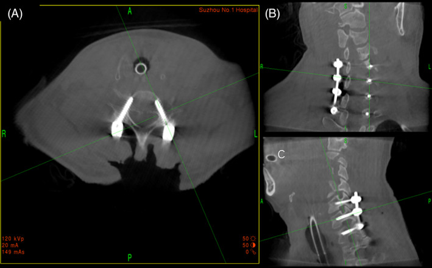
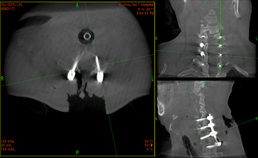
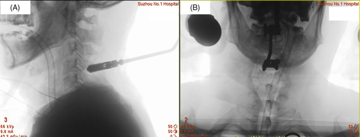
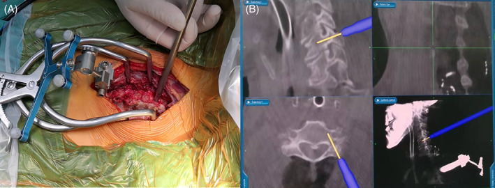
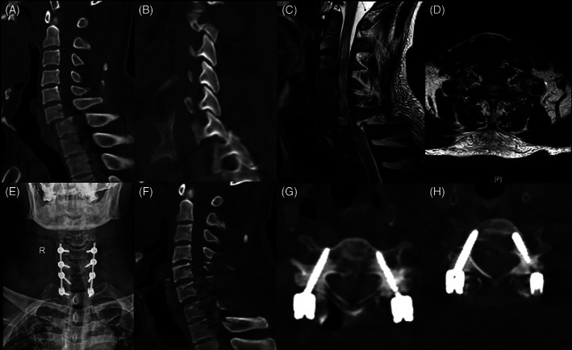
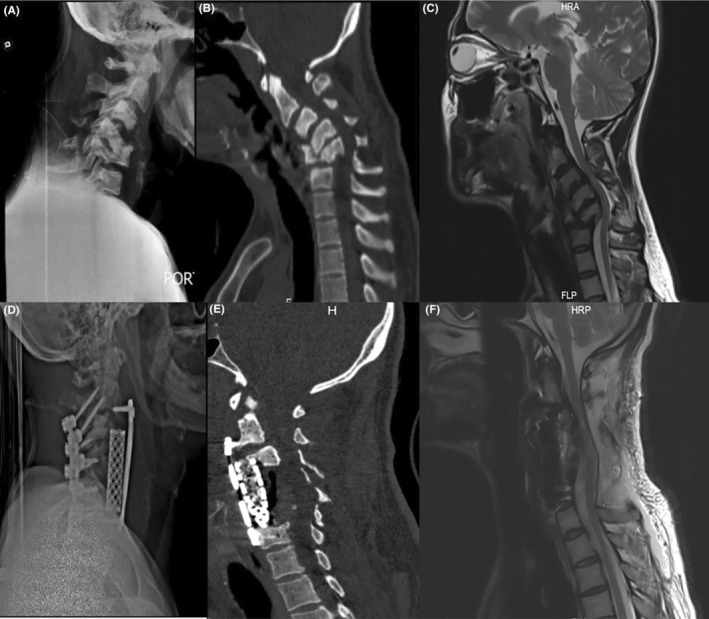
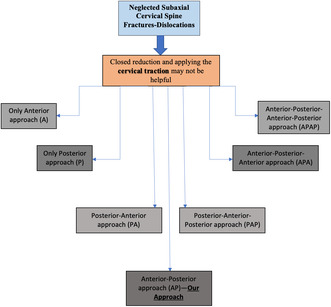
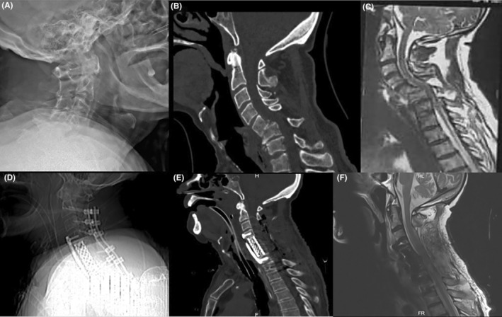
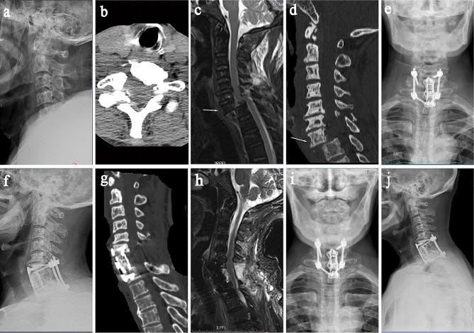
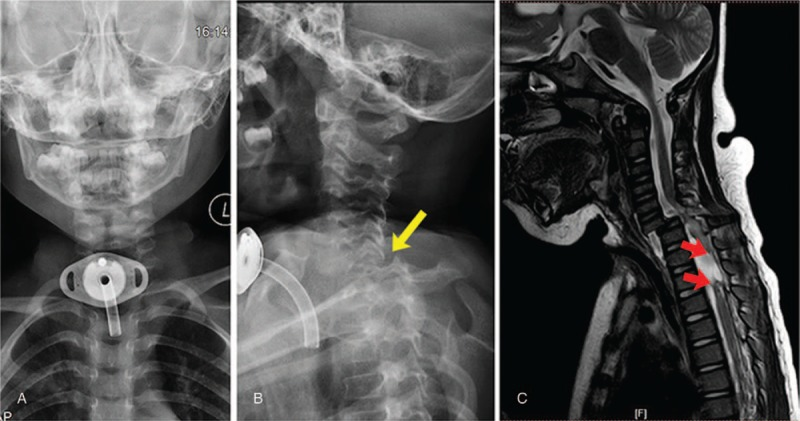

# Case Prep: Subaxial Cervical Spine Fracture / Dislocation Fixation

---

<!-- BEGIN CASE SNAPSHOT -->

## Case / Approach Snapshot

- **Anatomy at risk:** unstable columns, cord/roots, dura, vertebral artery or great-vessel/visceral structures by level, fracture lines, and fixation corridors.
- **Operative steps:** protect the spine during transfer/positioning, confirm levels and reduction goals, decompress when indicated, instrument/reconstruct stability, verify alignment and hardware, and plan ICU/brace/rehab needs; use the detailed operative sequence and approach notes below as the step-by-step source.
- **Rescue plans:** neurologic deterioration, reduction failure, vascular/visceral injury, durotomy, blood loss, hardware pullout, infection, and staged anterior/posterior stabilization.
- **Figures:** review [Figures, Imaging & Video](#figures-imaging--video) and the [Curated Image Set](#curated-image-set); embedded local figures should remain open-access, public-domain, or otherwise reusable with attribution.
- **Papers:** review [High-Yield Literature](#high-yield-literature) for seminal sources, modern reviews, and outcome data specific to this page.
- **Textbook cross-checks:** use [Textbook Cross-Checks](#textbook-cross-checks) and the [Source Crosswalk](../../resources/source-crosswalk.md) to cite copyrighted textbooks/atlases while summarizing in original words.

<!-- END CASE SNAPSHOT -->

## One-Liner
[Age]yo [M/F] with a subaxial cervical [fracture-dislocation / burst / facet dislocation] at [C_-C_] [with/without spinal cord injury] following [trauma] planned for [anterior / posterior / combined] decompression and instrumented fusion.

---

## Figures, Imaging & Video

**🎥 Operative video** — [search operative video on YouTube ▸](https://www.youtube.com/results?search_query=cervical+facet+dislocation+surgery) · [The Neurosurgical Atlas ▸](https://www.neurosurgicalatlas.com)

> 🧭 **Operative approach:** [Posterior cervical approach](../approaches/posterior-cervical-approach.md) — detailed corridor setup, step-by-step technique & figures

[Neurosurgical Atlas](https://www.neurosurgicalatlas.com) · [AO Surgery Reference](https://surgeryreference.aofoundation.org) · [Radiopaedia](https://radiopaedia.org/search?q=cervical%20facet%20dislocation&scope=all) · [PubMed Central](https://www.ncbi.nlm.nih.gov/pmc/?term=subaxial+cervical+fracture+dislocation+fusion) — operative figures © linked; see [media-sources.md](../../resources/media-sources.md)

---

<!-- BEGIN TEXTBOOK CROSS-CHECKS -->

## Textbook Cross-Checks

- **Spine anatomy and biomechanics:** Benzel Spine; Textbook of Spinal Surgery; Surgical Anatomy and Techniques to the Spine — confirm levels, approach-side anatomy, neural/vascular structures at risk, alignment, stability, and fixation rationale.
- **Technique sequence:** Youmans and Winn; Benzel Spine; Greenberg — review positioning, localization, exposure, decompression, instrumentation, fusion/reconstruction, and closure in original language.
- **Complication rescue:** Benzel Spine; Greenberg; Youmans and Winn — cross-check durotomy, neurologic change, vascular injury, wrong-level prevention, infection, implant failure, and postoperative restrictions.
- **Copyright-safe use:** cite these sources as private cross-checks, then write the guide content in original words; do not re-host textbook pages, figures, tables, or board-review card material. See [Source Crosswalk & Copyright-Safe Use](../../resources/source-crosswalk.md).

<!-- END TEXTBOOK CROSS-CHECKS -->

<!-- BEGIN CURATED LITERATURE -->

## High-Yield Literature

- **O-Arm Navigated Cervical Pedicle Screw Fixation in the Treatment of Lower Cervical Fracture-Dislocation** — Zhang K. Orthopaedic surgery 2022. [PubMed](https://pubmed.ncbi.nlm.nih.gov/35524652/)
- **Anterior-Alone Surgical Treatment for Subaxial Cervical Spine Facet Dislocation: A Systematic Review** — Lee W. Global spine journal 2021. [PubMed](https://pubmed.ncbi.nlm.nih.gov/32875872/)
- **Spinous Process Screw Fixation: A Salvage Technique in Subaxial Cervical Spinal Instrumentation** — Tian Y. World neurosurgery 2021. [PubMed](https://pubmed.ncbi.nlm.nih.gov/34293522/)
- **Predictors of failure after primary anterior cervical discectomy and fusion for subaxial traumatic spine injuries** — Singh A. European spine journal : official publication of the European Spine Society, the European Spinal Deformity Society, and the European Section of the Cervical Spine Research Society 2024. [PubMed](https://pubmed.ncbi.nlm.nih.gov/38664273/)
- **Traumatic Floating Neural Arch of the Subaxial Cervical Spine: Case Report** — Hadhri K. Neurology India 2022. [PubMed](https://pubmed.ncbi.nlm.nih.gov/36076678/)
- **Treatment of subaxial cervical spinal injuries** — Hadley MN. Neurosurgery 2002. [PubMed](https://pubmed.ncbi.nlm.nih.gov/12431300/)
- **A Novel Anterior-Only Surgical Approach for Reduction and Fixation of Cervical Facet Dislocation** — Liu K. World neurosurgery 2019. [PubMed](https://pubmed.ncbi.nlm.nih.gov/31029820/)
- **Modified anterior long-segment fixation versus posterior and combined approaches for subaxial cervical fractures in ankylosing spondylitis: a retrospective cohort study** — Li X. European spine journal : official publication of the European Spine Society, the European Spinal Deformity Society, and the European Section of the Cervical Spine Research Society 2026. [PubMed](https://pubmed.ncbi.nlm.nih.gov/41973206/)
- **Advanced compressive extension injuries of the subaxial cervical spine: do we really understand the nuances of this injury?** — Rebich E. The spine journal : official journal of the North American Spine Society 2021. [PubMed](https://pubmed.ncbi.nlm.nih.gov/33610805/)
- **[Guideline-conform treatment of injuries to the subaxial cervical spine]** — Schleicher P. Der Unfallchirurg 2021. [PubMed](https://pubmed.ncbi.nlm.nih.gov/34529103/)

<!-- END CURATED LITERATURE -->

---

<!-- BEGIN CURATED IMAGE SET -->

## Curated Image Set

Open-access figures are embedded from PubMed Central articles and kept unique to this guide.

*Fig. 4. Intraoperative 3D image data obtained by O‐arm showing cervical pedicle screw (CPS)s were accurately inserted in the cervical pedicle. (A) Intraoperative cross‐sectional CT of cervical... Source: [O‐Arm Navigated Cervical Pedicle Screw Fixation in the Treatment of Lower Cervical Fracture‐Dislocation](https://pmc.ncbi.nlm.nih.gov/articles/PMC9163967/) — Orthopaedic Surgery 2022; CC BY.*

*Figure 2. Source: [O‐Arm Navigated Cervical Pedicle Screw Fixation in the Treatment of Lower Cervical Fracture‐Dislocation](https://pmc.ncbi.nlm.nih.gov/articles/PMC9163967/) — Orthop Surg. 2022 May 7;14(6):1135–42. doi: 10.1111/os.13227; CC BY.*

*Fig. 3. Intraoperative image showed navigation reference frame was attached to the spinous process of C4 vertebrate. (A) Intraoperative lateral film of cervical spine demonstrated that... Source: [O‐Arm Navigated Cervical Pedicle Screw Fixation in the Treatment of Lower Cervical Fracture‐Dislocation](https://pmc.ncbi.nlm.nih.gov/articles/PMC9163967/) — Orthopaedic Surgery 2022; CC BY.*

*Fig. 1. Cervical pedicle screw (CPS) placement with O‐arm navigation during operation. (A) The navigation reference frame was attached to the spinous process. (B) Intraoperative 3D image when... Source: [O‐Arm Navigated Cervical Pedicle Screw Fixation in the Treatment of Lower Cervical Fracture‐Dislocation](https://pmc.ncbi.nlm.nih.gov/articles/PMC9163967/) — Orthopaedic Surgery 2022; CC BY.*

*Fig. 2. A 55‐year‐old male patient with C6,7 fracture‐dislocation undergoing cervical pedicle screw (CPS) fixation treatment with O‐arm navigation. (A‐D) Preoperative CT and MRI showed C6,7... Source: [O‐Arm Navigated Cervical Pedicle Screw Fixation in the Treatment of Lower Cervical Fracture‐Dislocation](https://pmc.ncbi.nlm.nih.gov/articles/PMC9163967/) — Orthopaedic Surgery 2022; CC BY.*

*FIGURE 1. Preoperative (A) neck x‐ray, (B) CT scan, and (C) MRI (T2‐weighted sagittal view) show cervical kyphosis leading to severe spinal cord compression due to the previous trauma.... Source: [Risk factors and surgical approaches in neglected subaxial cervical spine fractures‐dislocations: Experiences with two cases and literature review](https://pmc.ncbi.nlm.nih.gov/articles/PMC10784752/) — Clinical Case Reports 2024; CC BY-NC.*

*Figure 7. Source: [Risk factors and surgical approaches in neglected subaxial cervical spine fractures‐dislocations: Experiences with two cases and literature review](https://pmc.ncbi.nlm.nih.gov/articles/PMC10784752/) — Clin Case Rep. 2024 Jan 12;12(1):e8421. doi: 10.1002/ccr3.8421; CC BY-NC.*

*FIGURE 2. Preoperative (A) neck x‐ray, (B) CT scan, and (C) MRI (T2‐weighted sagittal view) show neglected C5‐C6 fracture‐dislocation result in cervical kyphosis. Postoperative counterpart (D)... Source: [Risk factors and surgical approaches in neglected subaxial cervical spine fractures‐dislocations: Experiences with two cases and literature review](https://pmc.ncbi.nlm.nih.gov/articles/PMC10784752/) — Clinical Case Reports 2024; CC BY-NC.*

*Fig. 1. A 73-year-old male patient was admitted to the hospital with “neck pain caused by trauma for 5 hours”. (a) Preoperative cervical lateral X-rays showed no significant abnormalities; (b)... Source: [Case report: A complete lower cervical fracture dislocation without permanent neurological impairment](https://pmc.ncbi.nlm.nih.gov/articles/PMC11179296/) — BMC Musculoskeletal Disorders 2024; CC BY.*

*Figure 1. Dislocation of C6 and C7 was revealed by DR (A and B) (indicated by yellow arrow), and spinal transection was revealed by MRI (C) (indicated by red arrow). DR = digital radiography, MRI... Source: [Surgical treatment for old subaxial cervical dislocation with bilateral locked facets in a 3-year-old girl](https://pmc.ncbi.nlm.nih.gov/articles/PMC6393066/) — Medicine 2018; CC BY-NC-ND.*

<!-- END CURATED IMAGE SET -->

---

## History of Present Illness
- Chief complaint: Neck pain, neurological deficit (complete/incomplete SCI), after high-energy trauma
- ASIA grade, level of injury, mechanism (flexion-distraction, compression, extension)
- **Timing:** early decompression (< 24h) may improve outcomes in SCI; **unilateral/bilateral facet dislocation** — reduction urgency
- Associated injuries (polytrauma, head)

---

## Imaging Review
### CT cervical (thin-cut + reconstructions)
- Fracture pattern, **facet dislocation (uni/bilateral, perched/locked)**, canal compromise, **SLIC score** (Subaxial Injury Classification: morphology, discoligamentous complex, neurology)
- Bony anatomy for instrumentation
### MRI cervical
- **Cord signal/compression, disc herniation (critical — herniated disc before posterior reduction of dislocation → cord injury risk), DLC/ligament injury, epidural hematoma**
### CTA
- Vertebral artery injury (foramen transversarium fractures — common in facet injuries)
### X-ray / Traction reduction films

---

## Labs
- CBC, BMP, Coags, Type and crossmatch, ABG (SCI)

---

## Neurological Examination
- **Complete ASIA exam** (motor levels, sensory levels, rectal tone/sacral sparing), document precisely, serial exams

---

## Surgical Planning

### Reduction & Approach Decision
- **Facet dislocation:** closed reduction (awake, Gardner-Wells traction, serial exam/imaging) vs open reduction; **MRI first if obtunded** (rule out disc herniation that could compress cord on reduction)
- **Anterior (ACDF/corpectomy):** disc herniation, anterior compression, burst fracture body
- **Posterior (lateral mass/pedicle screws):** facet dislocations, posterior ligamentous injury, multilevel, often better reduction of dislocations
- **Combined (360):** highly unstable, both-column injury, severe dislocations

### Position
- Anterior: supine, **awake fiberoptic intubation, in-line stabilization**, traction; Posterior: prone, Mayfield, careful log-roll, maintain alignment/traction
- **IONM baseline before and after positioning/reduction**

### Key Surgical Steps
- **Anterior:** Smith-Robinson exposure, discectomy/corpectomy, decompress cord, reduce, interbody graft/cage, anterior plate
- **Posterior:** expose, **reduce dislocated facets** (open reduction — may need partial facetectomy for locked facets), lateral mass/pedicle screws above and below, rods, reduce/realign, decorticate and graft for fusion
- Confirm decompression and alignment (fluoroscopy/imaging)

### Critical Anatomy & Structures at Risk
1. **Spinal cord** — unstable injury, reduction maneuvers, **avoid worsening with disc herniation during reduction**
2. **Vertebral artery** (foramen transversarium injury; screw trajectory)
3. **Nerve roots** (facet reduction, foramina)
4. Esophagus/airway/RLN (anterior), great vessels

### Equipment
- Anterior cervical plating + interbody/corpectomy cage; AND/OR posterior lateral mass/pedicle screw-rod system
- Gardner-Wells tongs/traction, fluoroscopy/navigation
- Bone graft, microscope, hemostatic agents

### Monitoring
- **SSEPs, MEPs, EMG** — essential, around positioning and reduction

### Anesthesia
- **Awake fiberoptic intubation**, in-line stabilization, **MAP goal (MAP > 85 x 7 days for SCI)**, arterial line, no paralytic (IONM), spinal shock/autonomic considerations

### Potential Complications
1. **Neurological worsening** (reduction, positioning, missed disc herniation)
2. Vertebral artery injury, hardware malposition/failure
3. Pseudarthrosis, dysphagia/airway (anterior), wound infection (posterior)
4. SCI complications (respiratory, autonomic dysreflexia, DVT)

---

## Operative Note Template
**Preoperative Diagnosis:** Subaxial cervical [fracture-dislocation / facet dislocation / burst] at [C_-C_] [with incomplete/complete SCI — ASIA __]

**Postoperative Diagnosis:** Same

**Procedure:** [Anterior (ACDF/corpectomy) / Posterior (lateral mass) / Combined 360°] decompression and instrumented fusion for subaxial cervical fracture-dislocation at [C_-C_]

**Surgeon / Assistant:**
**Anesthesia:** General endotracheal (awake fiberoptic intubation, in-line stabilization)
**EBL / Fluids / Blood products:**
**Adjuncts:** Gardner-Wells traction, fluoroscopy/navigation, microscope; SSEP/MEP/EMG
**Implants:** [Anterior plate + interbody/cage / lateral mass & pedicle screws + rods], bone graft
**Monitoring:** SSEP/MEP — stable [especially around reduction]
**Complications:** None

**Indications:** [Age]yo [M/F] with an unstable subaxial cervical injury at [C_-C_] (SLIC [__]) [with ASIA __ deficit]. MRI [showed/excluded] a herniated disc before reduction. Risks discussed; MAP goals set for cord perfusion.

**Description of Procedure:** After consent and time-out, **awake fiberoptic intubation** was performed with in-line stabilization, and neuromonitoring baselines confirmed before and after positioning. [Closed reduction was performed with Gardner-Wells traction under serial imaging.] 

[Anterior: supine positioning, a Smith-Robinson approach, discectomy/corpectomy with cord decompression, reduction, interbody graft/cage, and anterior plate.] [Posterior: prone positioning with careful log-roll, open reduction of the dislocated/locked facets (± partial facetectomy), lateral mass/pedicle screw-rod fixation above and below, and realignment.] Decompression and alignment were confirmed on fluoroscopy and the construct grafted for arthrodesis. Neuromonitoring remained stable around the reduction and instrumentation.

Closure was performed in layers [± drain]. The patient was transferred to the ICU with MAP support and serial ASIA exams.

---

## Postoperative Plan
- ICU, **MAP > 85 x 7 days (SCI)**, serial ASIA exams, respiratory support (high lesions)
- CT postop (reduction, hardware), collar per construct
- DVT prophylaxis (high SCI risk), GI/skin/bladder care, autonomic monitoring
- SCI rehab consult, steroids (controversial — institutional protocol)
- Follow-up imaging for fusion; counsel re: recovery prognosis by ASIA grade
