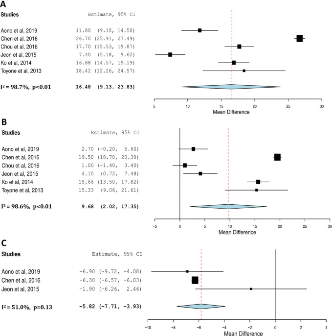
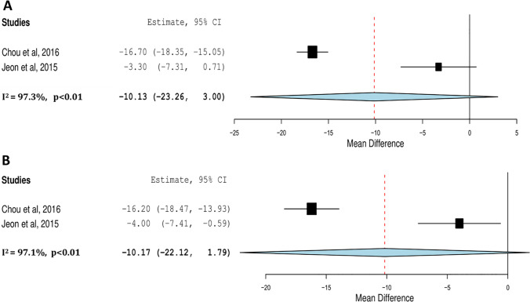
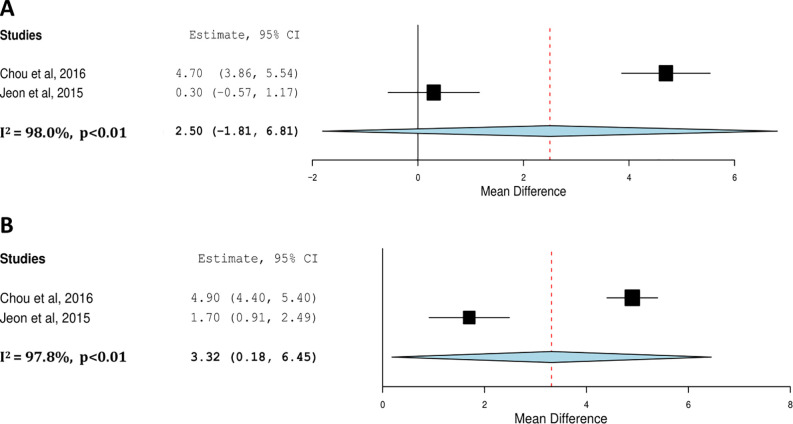
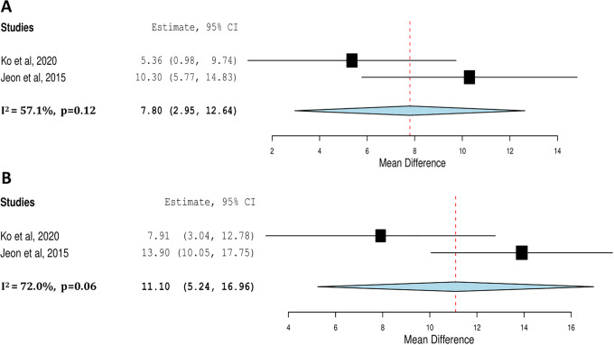
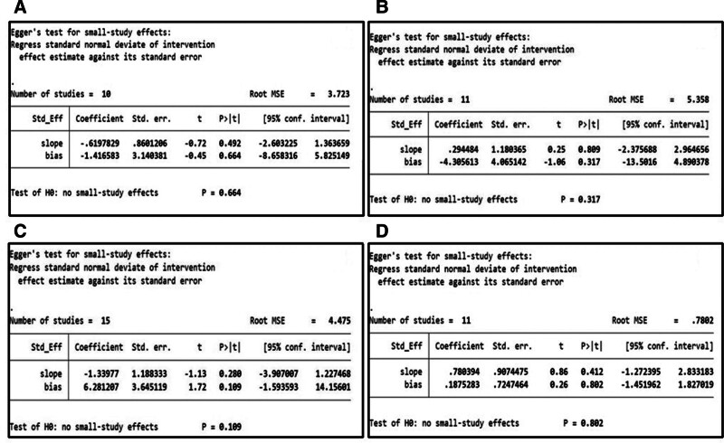
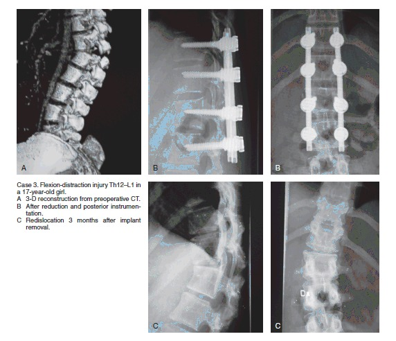
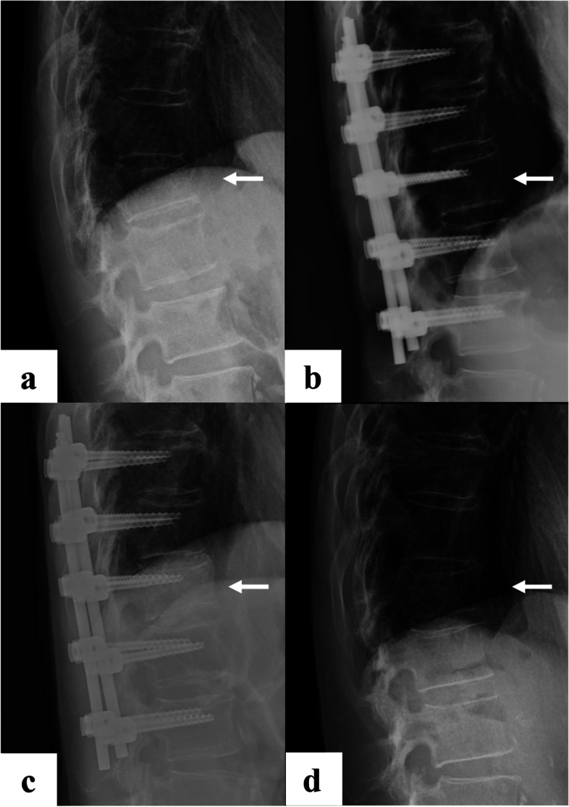
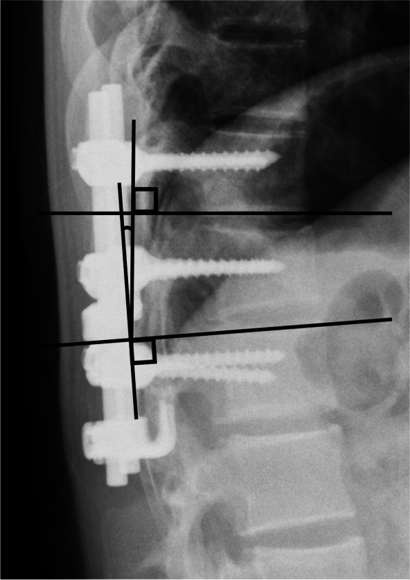
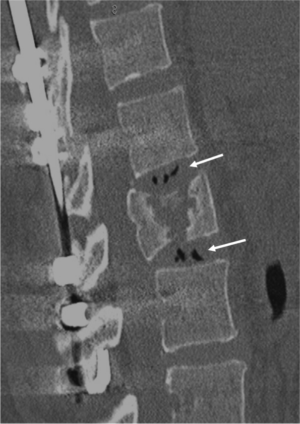

# Case Prep: Thoracolumbar Burst Fracture Fixation

---

<!-- BEGIN CASE SNAPSHOT -->

## Case / Approach Snapshot

- **Anatomy at risk:** unstable columns, cord/roots, dura, vertebral artery or great-vessel/visceral structures by level, fracture lines, and fixation corridors.
- **Operative steps:** protect the spine during transfer/positioning, confirm levels and reduction goals, decompress when indicated, instrument/reconstruct stability, verify alignment and hardware, and plan ICU/brace/rehab needs; use the detailed operative sequence and approach notes below as the step-by-step source.
- **Rescue plans:** neurologic deterioration, reduction failure, vascular/visceral injury, durotomy, blood loss, hardware pullout, infection, and staged anterior/posterior stabilization.
- **Figures:** review [Figures, Imaging & Video](#figures-imaging--video) and the [Curated Image Set](#curated-image-set); embedded local figures should remain open-access, public-domain, or otherwise reusable with attribution.
- **Papers:** review [High-Yield Literature](#high-yield-literature) for seminal sources, modern reviews, and outcome data specific to this page.

<!-- END CASE SNAPSHOT -->

## One-Liner
[Age]yo [M/F] with a [T_/L_] burst fracture [with/without neurological deficit] following [fall/MVC] planned for [posterior instrumented fusion ± decompression / anterior or combined reconstruction].

---

## Figures, Imaging & Video

**🎥 Operative video** — [search operative video on YouTube ▸](https://www.youtube.com/results?search_query=thoracolumbar+burst+fracture+surgery) · [The Neurosurgical Atlas ▸](https://www.neurosurgicalatlas.com)

> 🧭 **Operative approach:** [Posterior thoracolumbar approach](../approaches/posterior-thoracolumbar-approach.md) — detailed corridor setup, step-by-step technique & figures

[Neurosurgical Atlas](https://www.neurosurgicalatlas.com) · [AO Surgery Reference](https://surgeryreference.aofoundation.org) · [Radiopaedia](https://radiopaedia.org/search?q=thoracolumbar%20burst%20fracture&scope=all) · [PubMed Central](https://www.ncbi.nlm.nih.gov/pmc/?term=thoracolumbar+burst+fracture+fixation) — operative figures © linked; see [media-sources.md](../../resources/media-sources.md)

---

<!-- BEGIN COMMON PIMP QUESTIONS -->

## Common Pimp Questions

Use these to pressure-test preparation for **Thoracolumbar Burst Fracture Fixation**:

1. What neurologic level and root are responsible for the presenting deficit?
2. What is the decompression target and how will you know it is adequately decompressed?
3. What instability, deformity, bone-quality, or fusion variable changes the construct?
4. What vascular, visceral, dural, or neural structure is the main structure at risk?
5. What postop brace, drain, mobilization, MAP, antibiotic, and DVT plan should be ordered?

<!-- END COMMON PIMP QUESTIONS -->

<!-- BEGIN ATTENDING PREFERENCE VARIABLES -->

## Attending Preference Variables

Items that commonly vary by surgeon or institution:

- **Positioning frame, arms, traction, and localization workflow:** [attending-specific]
- **Navigation/robot/fluoro use, screw system, graft/biologic choice, and drain threshold:** [attending-specific]
- **Neuromonitoring modality and MAP goal for myelopathy, deformity, or cord-risk cases:** [attending-specific]
- **Brace, Foley, antibiotics, mobilization, and DVT prophylaxis timing:** [attending-specific]

<!-- END ATTENDING PREFERENCE VARIABLES -->

<!-- BEGIN CURATED LITERATURE -->

## High-Yield Literature

- **Is fusion necessary for thoracolumbar burst fracture treated with spinal fixation? A systematic review and meta-analysis** — Diniz JM. Journal of neurosurgery. Spine 2017. [PubMed](https://pubmed.ncbi.nlm.nih.gov/28777064/)
- **Posterior Pedicle Screw Fixation With Indirect Decompression Versus Direct Decompression in Treating Thoracolumbar Burst Fracture: A Systematic Review and Meta-Analysis** — Feng D. World neurosurgery 2024. [PubMed](https://pubmed.ncbi.nlm.nih.gov/38493890/)
- **Thoracolumbar Burst Fracture without Neurological Deficit: Review of Controversies and Current Evidence of Treatment** — Tanasansomboon T. World neurosurgery 2022. [PubMed](https://pubmed.ncbi.nlm.nih.gov/35318156/)
- **Fracture-Level Screws Augment Short-Segment Fixation in Thoracolumbar Burst Fractures** — Bao L. Journal of the College of Physicians and Surgeons--Pakistan : JCPSP 2026. [PubMed](https://pubmed.ncbi.nlm.nih.gov/42219833/)
- **Thoracolumbar Burst Fracture: McCormack Load-sharing Classification: Systematic Review and Single-arm Meta-analysis** — Filgueira ÉG. Spine 2021. [PubMed](https://pubmed.ncbi.nlm.nih.gov/33273433/)
- **The Necessity of Implant Removal after Fixation of Thoracolumbar Burst Fractures-A Systematic Review** — Wang X. Journal of clinical medicine 2023. [PubMed](https://pubmed.ncbi.nlm.nih.gov/36983216/)
- **Comparison of Posterior Fixation Strategies for Thoracolumbar Burst Fracture: A Finite Element Study** — Wong CE. Journal of biomechanical engineering 2021. [PubMed](https://pubmed.ncbi.nlm.nih.gov/33729440/)
- **Percutaneous thoracolumbar burst-fracture fixation - does additional anterior support offer significant benefit?** — Urbaneja A. British journal of neurosurgery 2026. [PubMed](https://pubmed.ncbi.nlm.nih.gov/41830910/)
- **Long-segment fixation VS short-segment fixation combined with kyphoplasty for osteoporotic thoracolumbar burst fracture** — Lai O. BMC musculoskeletal disorders 2022. [PubMed](https://pubmed.ncbi.nlm.nih.gov/35177064/)
- **Non neurologic burst thoracolumbar fractures fixation: Case-control study** — Amelot A. Injury 2017. [PubMed](https://pubmed.ncbi.nlm.nih.gov/28807432/)

<!-- END CURATED LITERATURE -->

---

<!-- BEGIN CURATED IMAGE SET -->

## Curated Image Set

Open-access figures are embedded from PubMed Central articles and kept unique to this guide.

*Figure 3.. Meta-analysis of sagittal Cobb Angle preoperatively versus postoperatively (A), preoperatively versus final follow-up (B) and at time of removal versus final follow-up (C). Source: [Implant Removal Versus Implant Retention Following Posterior Surgical Stabilization of Thoracolumbar Burst Fractures: A Systematic Review and Meta-Analysis](https://pmc.ncbi.nlm.nih.gov/articles/PMC9109574/) — Global Spine Journal 2021; CC BY-NC-ND.*

*Figure 4.. Meta-analysis of Cobb Angle loss of correction from time of removal versus final follow-up in implant removal cohort (A) and implant retention cohort (B). Source: [Implant Removal Versus Implant Retention Following Posterior Surgical Stabilization of Thoracolumbar Burst Fractures: A Systematic Review and Meta-Analysis](https://pmc.ncbi.nlm.nih.gov/articles/PMC9109574/) — Global Spine Journal 2021; CC BY-NC-ND.*

*Figure 5.. Meta-analysis of Visual Analogue Scale (VAS) score pre-operatively versus final follow-up in implant removal cohort (A) and implant retention cohort (B). Source: [Implant Removal Versus Implant Retention Following Posterior Surgical Stabilization of Thoracolumbar Burst Fractures: A Systematic Review and Meta-Analysis](https://pmc.ncbi.nlm.nih.gov/articles/PMC9109574/) — Global Spine Journal 2021; CC BY-NC-ND.*

*Figure 6.. Meta-analysis of Oswestry Disabilty Index (ODI) of function at time of implant removal versus 1 year follow-up (A) and final follow-up (B). Source: [Implant Removal Versus Implant Retention Following Posterior Surgical Stabilization of Thoracolumbar Burst Fractures: A Systematic Review and Meta-Analysis](https://pmc.ncbi.nlm.nih.gov/articles/PMC9109574/) — Global Spine Journal 2021; CC BY-NC-ND.*

*Figure 5. Source: [Implant Removal Versus Implant Retention Following Posterior Surgical Stabilization of Thoracolumbar Burst Fractures: A Systematic Review and Meta-Analysis](https://pmc.ncbi.nlm.nih.gov/articles/PMC9109574/) — Global Spine J. 2021 Apr 29;12(4):700–18. doi: 10.1177/21925682211005411; CC BY-NC-ND.*

*Figure 9.. Egger test of publication bias. (A) intraoperative bleeding (P = .664 > .05); (B) operation time (P = .317 > .05); (C) the final follow-up Cobb angle (P = .109 > .05); (D) the final... Source: [Efficacy and safety of posterior short-segment versus long-segment pedicle screws fixation for thoracolumbar burst fractures: A systematic review and meta-analysis](https://pmc.ncbi.nlm.nih.gov/articles/PMC12150920/) — Medicine 2025; CC BY.*

*Figure 7. Source: [Can implant removal restore mobility after fracture of the thoracolumbar segment? A radiostereometric study](https://pmc.ncbi.nlm.nih.gov/articles/PMC5016911/) — Acta Orthop. 2016 Jun 17;87(5):511–5. doi: 10.1080/17453674.2016.1197531; CC BY-NC.*

*Fig. 1. a: at the time of injury, b: after posterior pedicle screw fixation, c: before implant removal, and d: at final observation Source: [Vacuum phenomenon as a predictor of kyphosis after implant removal following posterior pedicle screw fixation without fusion for thoracolumbar burst fracture: a single-center retrospective study](https://pmc.ncbi.nlm.nih.gov/articles/PMC8796575/) — BMC Musculoskeletal Disorders 2022; CC BY.*

*Fig. 2. Kyphotic angle Source: [Vacuum phenomenon as a predictor of kyphosis after implant removal following posterior pedicle screw fixation without fusion for thoracolumbar burst fracture: a single-center retrospective study](https://pmc.ncbi.nlm.nih.gov/articles/PMC8796575/) — BMC Musculoskeletal Disorders 2022; CC BY.*

*Fig. 3. Vacuum phenomenon Source: [Vacuum phenomenon as a predictor of kyphosis after implant removal following posterior pedicle screw fixation without fusion for thoracolumbar burst fracture: a single-center retrospective study](https://pmc.ncbi.nlm.nih.gov/articles/PMC8796575/) — BMC Musculoskeletal Disorders 2022; CC BY.*

<!-- END CURATED IMAGE SET -->

---

## History of Present Illness
- Chief complaint: Back pain after axial load trauma, ± neurological deficit (conus/cauda/cord)
- Mechanism (fall from height, MVC), ASIA grade, associated injuries (calcaneal, polytrauma)
- **Thoracolumbar junction (T10-L2)** most common — transition zone
- TLICS score (morphology, PLC integrity, neurology) guides operative decision

---

## Imaging Review
### CT thoracolumbar (reconstructions)
- Burst morphology, **retropulsion/canal compromise**, posterior element fractures, vertebral body height loss, kyphosis (Cobb)
- **TLICS** components
### MRI
- **Posterior ligamentous complex (PLC) injury** (STIR — interspinous/supraspinous/ligamentum flavum), cord/conus signal, epidural hematoma, disc injury
- PLC disruption → unstable → surgery
### X-ray (standing if stable)
- Alignment, kyphosis

---

## Labs
- CBC, BMP, Coags, Type and crossmatch

---

## Neurological Examination
- Full ASIA exam, **conus/cauda signs** (saddle, bowel/bladder, rectal tone, bulbocavernosus), lower extremity motor/sensory/reflex

---

## Surgical Planning

### Case Logistics, OR Needs & Orders
- **Typical bed:** ICU or step-down; ICU for SCI, high cervical injury, polytrauma, respiratory risk, major blood loss, or ongoing MAP augmentation.
- **OR setup:** spine table with log-roll precautions, fluoroscopy/O-arm/navigation, traction/Mayfield when cervical, posterior/anterior implant trays, decompression instruments, cell saver/blood for large constructs, and IONM before positioning when feasible.
- **Special needs:** arterial line, Foley, type/cross, MAP augmentation for acute SCI per local protocol, no long paralytic when MEPs are needed, anticoagulation/reversal plan, and airway strategy for unstable cervical injuries.
- **Immediate postop orders:** serial ASIA/neuro checks, MAP goal/duration if SCI, CT/X-rays for hardware/alignment, brace/collar orders, drain care, DVT prophylaxis timing, bowel/bladder/skin care, and early rehab/SCI consult.

### Operative Decision (TLICS)
- TLICS ≥ 5 → surgery; PLC disruption, significant neuro deficit, instability, progressive kyphosis
- Stable burst without PLC injury/deficit → often nonoperative (TLSO brace)

### Approach
- **Posterior pedicle screw fixation ± decompression** (most common): short-segment (1 above/1 below ± fractured level) or long-segment; laminectomy if cord/cauda compression (note: posterior decompression doesn't address anterior retropulsion directly — may indirectly reduce via ligamentotaxis)
- **Anterior corpectomy/reconstruction:** significant anterior comminution/canal compromise needing direct decompression and anterior column support
- **Combined** for severe injuries

### Position
- Prone on Jackson table (allows postural reduction/lordosis), Mayfield/foam, **careful log-roll** (unstable), abdomen free, IONM baseline

### Key Surgical Steps (Posterior) — Detailed
1. **Time-out and IONM baseline** — confirm stable SSEP/MEP after the careful log-roll to prone; re-check signals after final positioning (unstable segment can shift with positioning)
2. **Fluoroscopic level localization** — AP and lateral; count from the sacrum and from C2/ribs (thoracolumbar junction is error-prone); mark the fracture level and the planned instrumented levels
3. **Midline incision and subperiosteal exposure** — expose the fractured level and the levels above and below to the tips of the transverse processes (thoracic) / bases of the transverse processes and pars (lumbar); preserve the facet capsules of levels NOT being fused
4. **Identify pedicle entry points** at each level to be instrumented:
   - Thoracic: junction of the lateral pars, transverse process, and superior articular facet (straightforward or anatomic/Roy-Camille technique)
   - Lumbar: "eye of the pedicle" — junction of the transverse process midline, pars, and superior articular process; convergent trajectory
5. **Place pedicle screws** above and below the fracture (and, when appropriate, **at the fractured level** for a more rigid construct and better reduction) using fluoroscopy or navigation; **probe all four pedicle walls** with a ball-tip feeler (medial wall = canal; inferior = exiting root) before tapping and inserting; **triggered EMG** to confirm no medial breach
6. **Reduction:**
   - **Postural reduction** — extend the table/Jackson frame to restore lordosis and indirectly reduce the kyphosis
   - **Rod-based reduction/ligamentotaxis** — contour rods to the desired sagittal profile; seat and use distraction + lordosing maneuvers to restore vertebral body height and pull the retropulsed fragment forward via the intact PLL (ligamentotaxis); avoid over-distraction (can stretch the cord/worsen a kyphotic deformity into a translation)
7. **Decompression (only if neurological deficit and/or significant canal compromise):**
   - Laminectomy at the fracture level (note laminar fractures are common — **dura may be exposed/torn beneath**, proceed cautiously)
   - For persistent ventral compression after ligamentotaxis: **transpedicular reduction** — remove a pedicle, place a tamp/impactor against the retropulsed fragment, and reduce it back into the vertebral body anteriorly (away from the cord)
   - Confirm thecal sac/conus/cauda is decompressed
8. **Final tightening** — seat rods fully, lock all set screws; reassess sagittal alignment on fluoroscopy
9. **Inspect for dural tear** (common with laminar fractures) — primary repair if accessible; if a ventral/inaccessible tear, dural sealant/muscle patch, consider lumbar drain
10. **Arthrodesis** — decorticate the transverse processes/facets at the fused levels and lay autograft (local) + allograft for posterolateral fusion (± interbody/anterior support if anterior column is severely deficient)
11. **Final fluoroscopy** (AP + lateral) — confirm screw position, rod contour, restoration of vertebral height and lordosis, fragment reduction
12. **Hemostasis, subfascial drain, layered watertight closure** (especially if durotomy)

### Critical Anatomy & Structures at Risk
1. **Conus medullaris / cauda equina / spinal cord** (level-dependent) — retropulsed fragment, manipulation
2. **Pedicle walls** (medial breach → neural; screw accuracy)
3. **Segmental vessels, great vessels** (anterior approach), artery of Adamkiewicz (T8-L1 left)
4. Dura (laminar/posterior element fractures — dural tears common in burst with laminar fracture)

### Equipment
- Pedicle screw/rod system, navigation/fluoroscopy
- Decompression tools (Kerrison, drill, tamps), bone graft
- Anterior cage/corpectomy set (if anterior), hemostatic agents, drain

### Monitoring
- SSEPs, MEPs, EMG (esp. with deficit/decompression)

### Anesthesia
- Arterial line, MAP support (SCI), no paralytic (IONM), crossmatched blood, prone/log-roll precautions

### Potential Complications
1. Neurological worsening (reduction, retropulsion manipulation)
2. **Dural tear/CSF leak** (laminar fracture — common; repair)
3. Hardware failure/pseudarthrosis, loss of correction/kyphosis
4. Screw malposition, infection, adjacent segment issues, ileus

---

## Operative Note Template

**Preoperative Diagnosis:** [T_/L_] burst fracture [with retropulsion and canal compromise] [with incomplete/complete neurological deficit — ASIA __]

**Postoperative Diagnosis:** Same

**Procedure:** [T_-T_/L_] posterior instrumented fusion with pedicle screw fixation [and laminectomy/decompression at ___] [with transpedicular fragment reduction] [with posterolateral arthrodesis] for thoracolumbar burst fracture

**Surgeon / Assistant:**
**Anesthesia:** General endotracheal
**EBL / Fluids / Blood products:**
**Specimens:** None
**Drains:** Subfascial drain
**Implants:** Pedicle screws and rods [system/sizes], bone graft (local autograft + allograft)
**Complications:** None

**Indications:** The patient is a [age]yo [M/F] who sustained a [T_/L_] burst fracture after [mechanism], with [retropulsion and ___% canal compromise], [PLC disruption on MRI], and [neurological exam — ASIA __ / intact]. The TLICS score was [__], indicating operative management. After discussion of risks, benefits, and alternatives, the patient/family elected to proceed.

**Description of Procedure:** After consent and a time-out, general endotracheal anesthesia was induced and neuromonitoring (SSEP/MEP/EMG) established with stable baselines. The patient was carefully log-rolled prone onto a Jackson table with the abdomen free; pressure points and eyes were padded; signals were re-confirmed stable after positioning. The back was prepped and draped, and antibiotics were administered.

A midline incision was made and subperiosteal dissection exposed the posterior elements from [level] to [level], preserving the facet capsules of adjacent un-fused levels. The fracture level and instrumented levels were confirmed by fluoroscopy. Pedicle screws were placed at [levels] using [fluoroscopic/navigation] guidance; all pedicle walls were probed intact and triggered-EMG thresholds were acceptable.

[The table was extended and contoured rods were used to achieve postural and ligamentotaxis reduction, restoring vertebral body height and segmental lordosis.] [A laminectomy was performed at ___ for decompression; the dura was inspected — (intact / a laminar-fracture dural tear was repaired primarily / sealed with graft and sealant). Transpedicular reduction of the retropulsed fragment was performed, restoring the canal.] The rods were seated and all set screws locked. Final fluoroscopy confirmed satisfactory screw position, alignment, vertebral height, and fragment reduction. The transverse processes and facets were decorticated and graft was applied for posterolateral arthrodesis.

Hemostasis was obtained, a subfascial drain placed, and the wound closed in layers. Neuromonitoring remained stable throughout. The patient was returned supine, awakened, and moving [all extremities at baseline / per deficit], and transferred to the [ICU/PACU] in stable condition.

---

## Postoperative Plan
- ICU/step-down, neuro checks (conus/cauda — bowel/bladder), MAP support if SCI
- CT/X-ray postop (hardware, alignment, canal), TLSO brace per surgeon
- If dural tear: flat bed rest, leak precautions
- DVT prophylaxis, mobilize with brace, bowel/bladder management
- Follow-up imaging for fusion/alignment; rehab
