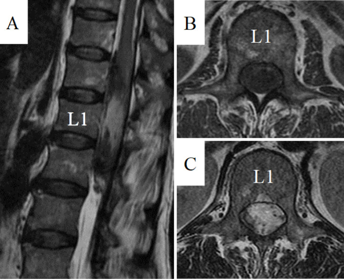
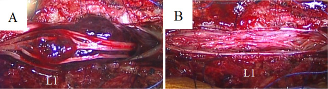
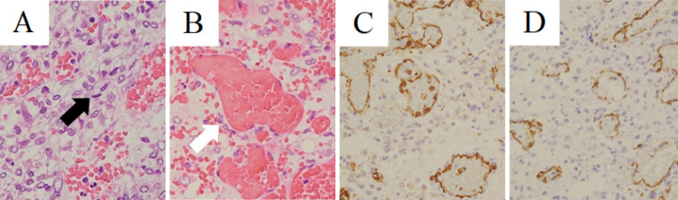
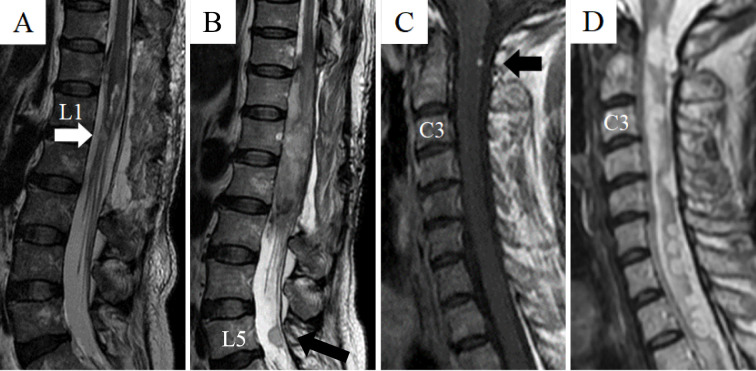
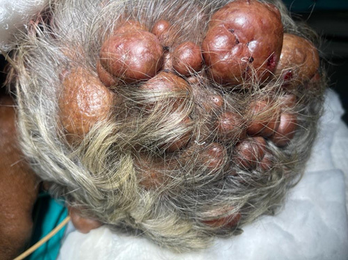
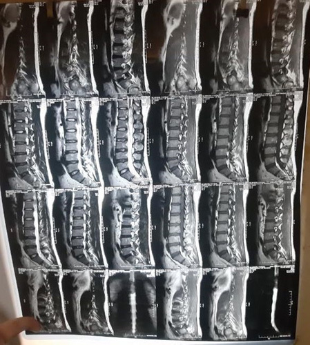
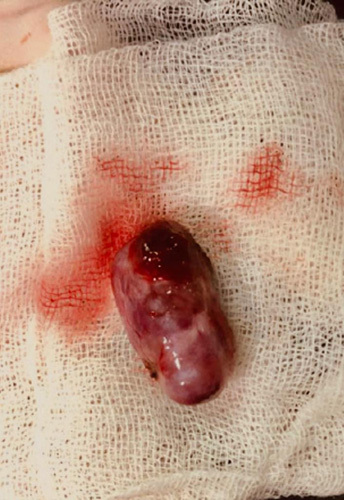
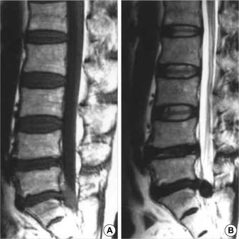
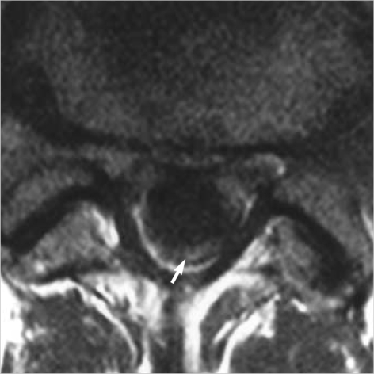
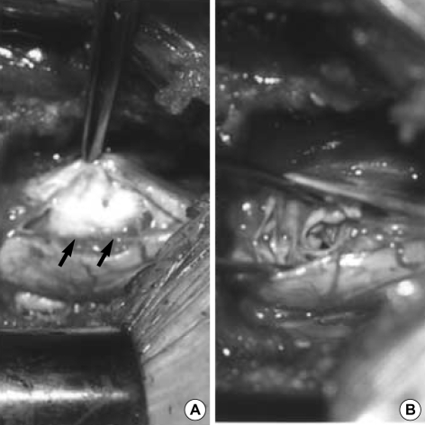

# Case Prep: Intradural Extramedullary Spinal Tumor Resection (Meningioma / Schwannoma)

---

<!-- BEGIN CASE SNAPSHOT -->

## Case / Approach Snapshot

- **Anatomy at risk:** cord, roots, dura, epidural venous plexus, tumor vascular supply, vertebral body/posterior element involvement, and stabilization corridors.
- **Operative steps:** define oncologic and neurologic goals, localize levels, decompress neural elements, obtain tissue or resect/debulk safely, reconstruct stability, and coordinate radiation/systemic therapy planning; use the detailed operative sequence and approach notes below as the step-by-step source.
- **Rescue plans:** major blood loss, neuromonitoring change, durotomy/CSF leak, pathologic instability, wound breakdown after radiation, residual disease strategy, and staged embolization or reconstruction.
- **Figures:** review [Figures, Imaging & Video](#figures-imaging--video) and the [Curated Image Set](#curated-image-set); embedded local figures should remain open-access, public-domain, or otherwise reusable with attribution.
- **Papers:** review [High-Yield Literature](#high-yield-literature) for seminal sources, modern reviews, and outcome data specific to this page.

<!-- END CASE SNAPSHOT -->

## One-Liner
[Age]yo [M/F] with a [cervical/thoracic/lumbar] intradural extramedullary tumor ([meningioma / schwannoma / neurofibroma]) at [level] presenting with [pain / myelopathy / radiculopathy] planned for laminectomy/laminoplasty for microsurgical resection.

---

## Figures, Imaging & Video

**🎥 Operative video** — [search operative video on YouTube ▸](https://www.youtube.com/results?search_query=spinal+meningioma+surgery) · [The Neurosurgical Atlas ▸](https://www.neurosurgicalatlas.com)

> 🧭 **Operative approach:** [Posterior thoracolumbar approach](../approaches/posterior-thoracolumbar-approach.md) — detailed corridor setup, step-by-step technique & figures

[Neurosurgical Atlas](https://www.neurosurgicalatlas.com) · [AO Surgery Reference](https://surgeryreference.aofoundation.org) · [Radiopaedia](https://radiopaedia.org/search?q=spinal%20meningioma&scope=all) · [PubMed Central](https://www.ncbi.nlm.nih.gov/pmc/?term=intradural+extramedullary+spinal+tumor) — operative figures © linked; see [media-sources.md](../../resources/media-sources.md)

---

<!-- BEGIN COMMON PIMP QUESTIONS -->

## Common Pimp Questions

Use these to pressure-test preparation for **Intradural Extramedullary Spinal Tumor Resection (Meningioma / Schwannoma)**:

1. What neurologic level and root are responsible for the presenting deficit?
2. What is the decompression target and how will you know it is adequately decompressed?
3. What instability, deformity, bone-quality, or fusion variable changes the construct?
4. What vascular, visceral, dural, or neural structure is the main structure at risk?
5. What postop brace, drain, mobilization, MAP, antibiotic, and DVT plan should be ordered?

<!-- END COMMON PIMP QUESTIONS -->

<!-- BEGIN ATTENDING PREFERENCE VARIABLES -->

## Attending Preference Variables

Items that commonly vary by surgeon or institution:

- **Positioning frame, arms, traction, and localization workflow:** [attending-specific]
- **Navigation/robot/fluoro use, screw system, graft/biologic choice, and drain threshold:** [attending-specific]
- **Neuromonitoring modality and MAP goal for myelopathy, deformity, or cord-risk cases:** [attending-specific]
- **Brace, Foley, antibiotics, mobilization, and DVT prophylaxis timing:** [attending-specific]

<!-- END ATTENDING PREFERENCE VARIABLES -->

<!-- BEGIN CURATED LITERATURE -->

## High-Yield Literature

- **Surgical resection of an intradural extramedullary spinal tumor** — Yunga Tigre J. Neurosurgical focus: Video 2023. [PubMed](https://pubmed.ncbi.nlm.nih.gov/37854646/)
- **Intradural Extramedullary Spinal Tumor Suspected Angiosarcoma Based on Clinical Course and Pathological Findings: A Case Report** — Iijima Y. Spine surgery and related research 2022. [PubMed](https://pubmed.ncbi.nlm.nih.gov/36348692/)
- **Large primary Intradural extramedullary spinal tumors: A case report** — Hadar AK. International journal of surgery case reports 2023. [PubMed](https://pubmed.ncbi.nlm.nih.gov/37716052/)
- **Primary Intradural Extramedullary Sporadic Spinal Hemangioblastomas: Case Report and Systematic Review** — Li D. World neurosurgery 2021. [PubMed](https://pubmed.ncbi.nlm.nih.gov/34087464/)
- **Differentiation of the Intradural Extramedullary Spinal Tumors, Schwannomas, and Meningiomas Utilizing the Contrast Ratio as a Quantitative Magnetic Resonance Imaging Method** — Nakamae T. World neurosurgery 2024. [PubMed](https://pubmed.ncbi.nlm.nih.gov/38797281/)
- **Intradural extramedullary tumor location in the axial view affects the alert timing of intraoperative neurophysiologic monitoring** — Morito S. Journal of clinical monitoring and computing 2023. [PubMed](https://pubmed.ncbi.nlm.nih.gov/36635568/)
- **Extramedullary Intradural Primary Spinal Angiosarcoma: A Case Study** — Catalo M. Cureus 2024. [PubMed](https://pubmed.ncbi.nlm.nih.gov/39734979/)
- **Hydrocephalus Secondary to Intradural Extramedullary Malignant Melanoma of Spinal Cord** — Hironaka K. World neurosurgery 2019. [PubMed](https://pubmed.ncbi.nlm.nih.gov/31302270/)
- **Spinal intradural extramedullary cavernous hemangioma** — Pétillon P. Neuroradiology 2018. [PubMed](https://pubmed.ncbi.nlm.nih.gov/30090980/)
- **Accuracy of intraoperative neurophysiological monitoring in predicting postoperative neurological decline in intradural extramedullary spinal tumor surgery: a systematic review and meta-analysis** — Antkowiak L. Neurosurgical review 2025. [PubMed](https://pubmed.ncbi.nlm.nih.gov/41240239/)

<!-- END CURATED LITERATURE -->

---

<!-- BEGIN CURATED IMAGE SET -->

## Curated Image Set

Open-access figures are embedded from PubMed Central articles and kept unique to this guide.

*Figure 1.. Preoperative MRIs.Sagittal T2-weighted (A), axial T1-weighted (B), and axial T2-weighted (C) MRIs showing a poorly marginated mass with a T1-low and T2-mosaic pattern located... Source: [Intradural Extramedullary Spinal Tumor Suspected Angiosarcoma Based on Clinical Course and Pathological Findings: A Case Report](https://pmc.ncbi.nlm.nih.gov/articles/PMC9605765/) — Spine Surgery and Related Research 2022; CC BY-NC-ND.*

*Figure 2.. Intraoperative microscopic views.Intraoperative photographs following laminectomy and durotomy at T12–L2 showing a dark red mass in the subarachnoid space (A). The mass was not connected... Source: [Intradural Extramedullary Spinal Tumor Suspected Angiosarcoma Based on Clinical Course and Pathological Findings: A Case Report](https://pmc.ncbi.nlm.nih.gov/articles/PMC9605765/) — Spine Surgery and Related Research 2022; CC BY-NC-ND.*

*Figure 3.. Histological findings.Hematoxylin and eosin (H&E) staining ×400 (A, B). Cluster of differentiation (CD) 31 staining ×200 (C), and CD34 staining ×200 (D).H&E staining showing atypical... Source: [Intradural Extramedullary Spinal Tumor Suspected Angiosarcoma Based on Clinical Course and Pathological Findings: A Case Report](https://pmc.ncbi.nlm.nih.gov/articles/PMC9605765/) — Spine Surgery and Related Research 2022; CC BY-NC-ND.*

*Figure 4.. Postoperative MRIs.Sagittal T2-weighted MRI (A) at 2 weeks after surgery showing the mass was mostly resected, but a small mass is seen below the conus medullaris (white arrow).Sagittal... Source: [Intradural Extramedullary Spinal Tumor Suspected Angiosarcoma Based on Clinical Course and Pathological Findings: A Case Report](https://pmc.ncbi.nlm.nih.gov/articles/PMC9605765/) — Spine Surgery and Related Research 2022; CC BY-NC-ND.*

*Figure 1. Masses present all over the scalp, each averaging about 4×4 cm, with the largest one located in the occipital area of 6×7 cm in dimensions. Source: [Rare case of multiple neurofibromas of the scalp and trunk in association with intradural extramedullary spinal tumor: a case report](https://pmc.ncbi.nlm.nih.gov/articles/PMC10289696/) — Annals of Medicine and Surgery 2023; CC BY-NC-ND.*

*Figure 2. MRI of SPINE revealing T11–T12 neurofibroma. Source: [Rare case of multiple neurofibromas of the scalp and trunk in association with intradural extramedullary spinal tumor: a case report](https://pmc.ncbi.nlm.nih.gov/articles/PMC10289696/) — Annals of Medicine and Surgery 2023; CC BY-NC-ND.*

*Figure 3. Excised tumor by total excision from intraspinal region. Source: [Rare case of multiple neurofibromas of the scalp and trunk in association with intradural extramedullary spinal tumor: a case report](https://pmc.ncbi.nlm.nih.gov/articles/PMC10289696/) — Annals of Medicine and Surgery 2023; CC BY-NC-ND.*

*Fig. 1. T1-(A) and T2-weighted (B) sagittal magnetic resonance images demonstrating a mass-like lesion. Source: [Intradural Disc Herniation at L5-S1 Mimicking an Intradural Extramedullary Spinal Tumor: A Case Report](https://pmc.ncbi.nlm.nih.gov/articles/PMC2729910/) — Journal of Korean Medical Science 2006; CC BY-NC.*

*Fig. 2. Contrast-enhanced axial image showing peripheral enhancement of the lesion (arrow). Source: [Intradural Disc Herniation at L5-S1 Mimicking an Intradural Extramedullary Spinal Tumor: A Case Report](https://pmc.ncbi.nlm.nih.gov/articles/PMC2729910/) — Journal of Korean Medical Science 2006; CC BY-NC.*

*Fig. 3. Intraoperative photograph (A) outlining the peripheral displacement of the adherent cauda equine nerve roots (arrows) by the large intradural disc fragment. Intraoperative photograph (B)... Source: [Intradural Disc Herniation at L5-S1 Mimicking an Intradural Extramedullary Spinal Tumor: A Case Report](https://pmc.ncbi.nlm.nih.gov/articles/PMC2729910/) — Journal of Korean Medical Science 2006; CC BY-NC.*

<!-- END CURATED IMAGE SET -->

---

## History of Present Illness
- Chief complaint: Nocturnal/positional back pain, progressive myelopathy (gait, weakness, sensory level), radiculopathy
- Duration/progression (usually slow); bowel/bladder
- **Schwannoma:** radicular onset (nerve root origin); **Meningioma:** thoracic, female, myelopathy; **NF2** (multiple schwannomas/meningiomas), **NF1** (neurofibromas)

---

## Imaging Review
### MRI (T1±Gad, T2) entire spine
- **Intradural extramedullary** location (displaces cord, CSF cap sign)
- Level, size, enhancement (meningioma: dural tail, broad dural base, may calcify; schwannoma: nerve root origin, dumbbell through foramen, cystic)
- Cord compression/signal change, **dumbbell extension** through neural foramen (schwannoma — may need combined/lateral approach)
- Multiple lesions (NF2)

### CT
- Bony anatomy, calcification (meningioma), foraminal widening (dumbbell schwannoma), planning instrumentation if facet/stability compromised

---

## Labs
- CBC, BMP, Coags, Type and screen

---

## Neurological Examination
- Detailed motor/sensory (sensory level), reflexes, myelopathy signs, bowel/bladder, gait

---

## Surgical Planning

### Case Logistics, OR Needs & Orders
- **Typical bed:** ICU/step-down for intramedullary, deformity, corpectomy, or high-EBL tumor cases; floor for small stable intradural extramedullary cases with intact exam.
- **OR setup:** microscope, fluoroscopy/navigation, neuromonitoring, tumor debulking/microsurgical set, dural repair materials, instrumentation/corpectomy trays as indicated, and blood available.
- **Special needs:** arterial line/Foley for long cases, dexamethasone for cord edema when indicated, MAP support for myelopathy/cord manipulation, oncology/radiation plan, and pathology/frozen specimen workflow.
- **Immediate postop orders:** frequent motor/sensory exams, MAP support if cord manipulation or deficit, MRI/CT/X-rays per tumor/construct, steroid taper, drain/dural-leak precautions, brace/activity, DVT timing, and oncology/radiation follow-up.

### Position
- **Prone** (most), Mayfield (cervical/upper thoracic) or pinned/horseshoe; chest rolls, abdomen free, reverse Trendelenburg
- IONM baseline after positioning

### Approach: Posterior Laminectomy / Laminoplasty (± facetectomy for dumbbell)
### Key Surgical Steps
1. Fluoroscopic level localization (count carefully — wrong-level is a never event; thoracic especially hard)
2. Midline incision, subperiosteal exposure, **laminectomy or laminoplasty** over the tumor (laminoplasty in children/long-segment to preserve stability)
3. Confirm with ultrasound (tumor localization, cord)
4. **Midline durotomy** under microscope, dural tack-up sutures, preserve arachnoid then open
5. Identify tumor and its relationship to cord/roots
6. **Schwannoma:** identify the parent rootlet (often non-functional dorsal rootlet); internally debulk (CUSA), dissect capsule off cord/roots, sacrifice the involved rootlet if needed, deliver tumor; **dumbbell:** may need facetectomy + foraminal/lateral extension (± fusion)
7. **Meningioma:** internal debulking, dissect from cord (arachnoid plane), coagulate and resect/coagulate dural base (Simpson — resect involved dura with duraplasty, or coagulate base [Simpson II] to lower CSF leak risk)
8. Confirm cord decompression, hemostasis
9. **Watertight dural closure** (± dural graft for meningioma base), sealant
10. ± Instrumented fusion if facetectomy/laminectomy destabilized (esp. cervical, dumbbell, multilevel)
11. Closure

### Critical Anatomy & Structures at Risk
1. **Spinal cord** — manipulation/retraction (myelopathy); dorsal midline entry only if needed
2. **Nerve roots** — functional roots preserved; schwannoma parent root often sacrificable
3. **Radicular/segmental arteries** (esp. thoracic — artery of Adamkiewicz, T8-L1 left) — cord infarction
4. **Dura** — watertight closure (CSF leak/pseudomeningocele)
5. Spinal stability (facetectomy)

### Equipment
- Microscope, ultrasound, CUSA, microsurgical instruments, fine bipolar
- Dural substitute, sealant, fixation set (if fusion), hemostatic agents

### Monitoring
- **SSEPs, MEPs, EMG** (essential — cord and roots), D-wave for intramedullary-adjacent

### Anesthesia
- **MAP > 85** (cord perfusion), no paralytic (IONM), arterial line, prone precautions, type and screen

### Potential Complications
1. Neurological worsening (cord/root manipulation, vascular)
2. **CSF leak/pseudomeningocele** (dural closure)
3. Spinal instability/deformity (post-laminectomy, esp. cervical/pediatric)
4. Recurrence (meningioma — base management), infection

---

## Operative Note Template
**Preoperative Diagnosis:** [Cervical/thoracic/lumbar] intradural extramedullary tumor ([meningioma/schwannoma]) at [level]

**Postoperative Diagnosis:** Same (pending pathology)

**Procedure:** [Level] laminectomy/laminoplasty for microsurgical resection of intradural extramedullary tumor [with instrumented fusion]

**Surgeon / Assistant:**
**Anesthesia:** General endotracheal
**EBL / Fluids:**
**Adjuncts:** Microscope, ultrasound, CUSA, fluoroscopy; SSEP/MEP/EMG; MAP support
**Implants:** Dural substitute, sealant; [fusion hardware if facetectomy]
**Complications:** None

**Indications:** [Age]yo [M/F] with a symptomatic intradural extramedullary tumor at [level] causing [myelopathy/radiculopathy/pain]. Risks (neurological worsening, CSF leak, instability) discussed.

**Description of Procedure:** After consent and time-out, general anesthesia was induced (MAP support) and neuromonitoring established. The patient was positioned prone [in Mayfield for cervical/upper-thoracic]; the level was confirmed fluoroscopically. A laminectomy/laminoplasty was performed over the tumor and ultrasound confirmed localization. A midline durotomy was made under the microscope and tacked up.

The tumor was identified relative to the cord and roots. [Schwannoma: the non-functional parent rootlet was identified by stimulation, the tumor internally debulked and dissected off the cord/roots, and the involved rootlet sacrificed.] [Meningioma: the tumor was internally debulked and dissected off the cord in the arachnoid plane, and the dural base resected/coagulated (Simpson) with duraplasty.] Radicular/segmental arteries were preserved. A watertight dural closure was performed with sealant. [Instrumented fusion was added for facetectomy-related instability.]

Closure was completed in layers. The patient was transferred with MAP support and CSF-leak precautions, neurologically [at baseline].

---

## Postoperative Plan
- ICU/step-down, neuro checks q1-2h (motor/sensory)
- **CSF leak precautions** (flat if durotomy concern), MAP support
- MRI postop (resection), watch pseudomeningocele
- DVT prophylaxis (mechanical; chemical delayed), pain control
- Pathology (WHO grade meningioma); follow-up MRI; PT/rehab
