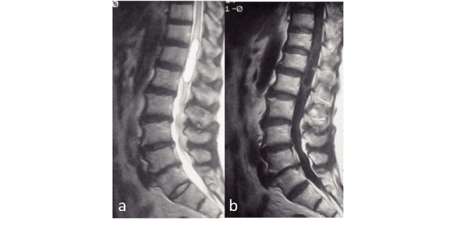
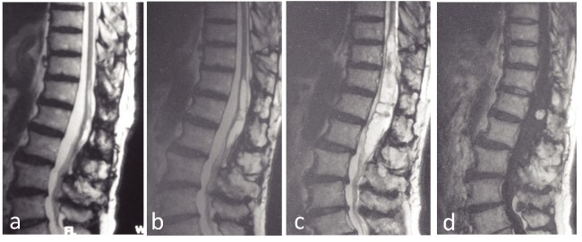
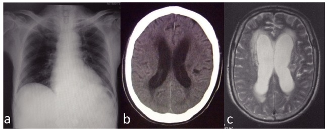
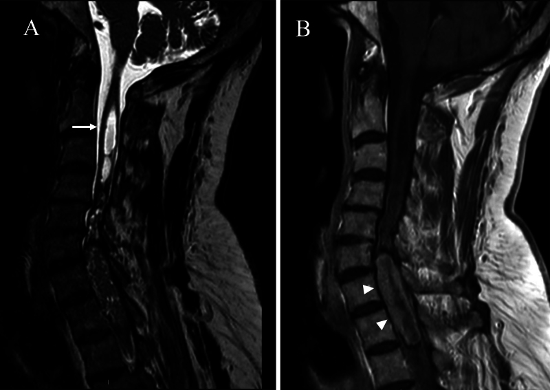
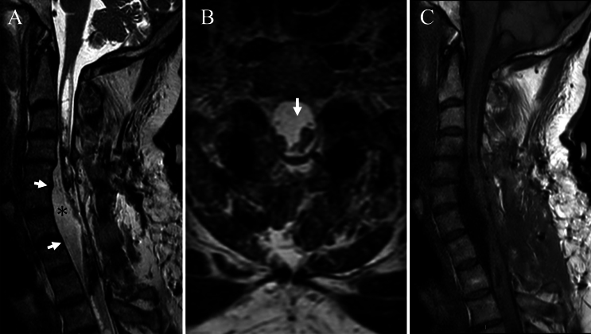
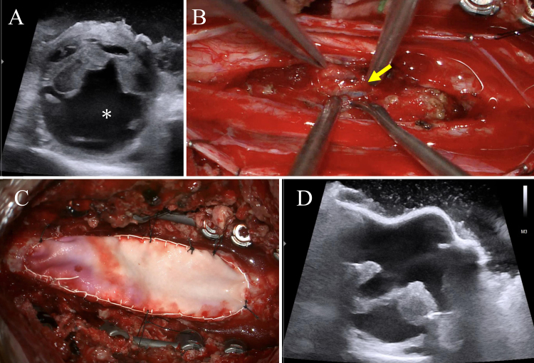
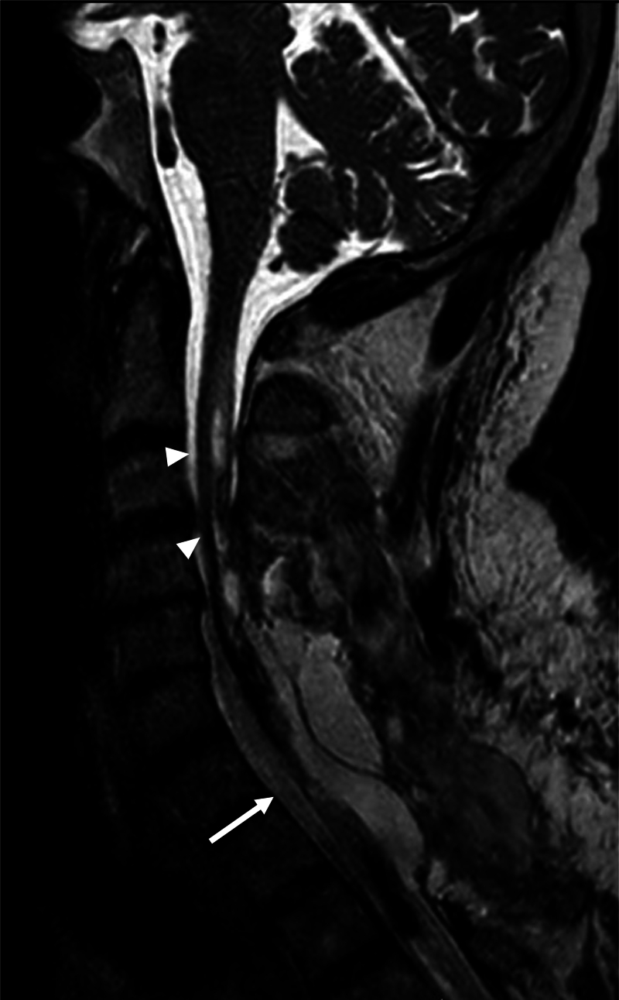
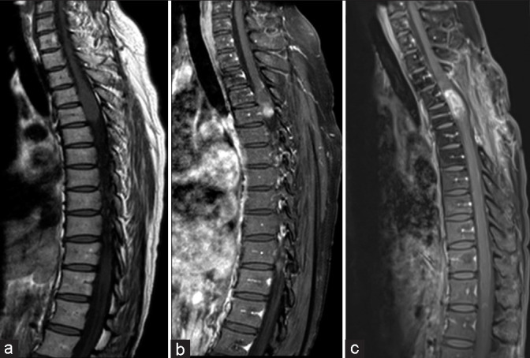
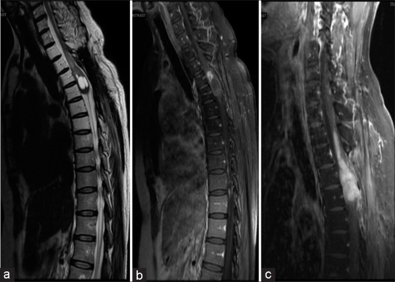
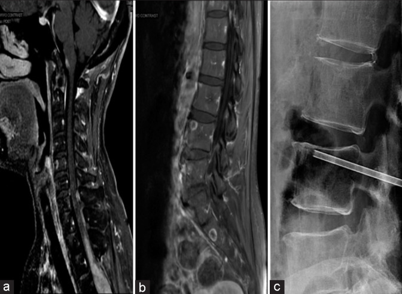

# Case Prep: Intramedullary Spinal Cord Tumor Resection (Ependymoma / Astrocytoma / Hemangioblastoma)

---

<!-- BEGIN CASE SNAPSHOT -->

## Case / Approach Snapshot

- **Anatomy at risk:** cord, roots, dura, epidural venous plexus, tumor vascular supply, vertebral body/posterior element involvement, and stabilization corridors.
- **Operative steps:** define oncologic and neurologic goals, localize levels, decompress neural elements, obtain tissue or resect/debulk safely, reconstruct stability, and coordinate radiation/systemic therapy planning; use the detailed operative sequence and approach notes below as the step-by-step source.
- **Rescue plans:** major blood loss, neuromonitoring change, durotomy/CSF leak, pathologic instability, wound breakdown after radiation, residual disease strategy, and staged embolization or reconstruction.
- **Figures:** review [Figures, Imaging & Video](#figures-imaging--video) and the [Curated Image Set](#curated-image-set); embedded local figures should remain open-access, public-domain, or otherwise reusable with attribution.
- **Papers:** review [High-Yield Literature](#high-yield-literature) for seminal sources, modern reviews, and outcome data specific to this page.
- **Textbook cross-checks:** use [Textbook Cross-Checks](#textbook-cross-checks) and the [Source Crosswalk](../../resources/source-crosswalk.md) to cite copyrighted textbooks/atlases while summarizing in original words.

<!-- END CASE SNAPSHOT -->

## One-Liner
[Age]yo [M/F] with a [cervical/thoracic] intramedullary spinal cord tumor ([ependymoma / astrocytoma / hemangioblastoma]) at [levels] presenting with [pain / sensory changes / weakness] planned for laminectomy/laminoplasty and midline myelotomy for microsurgical resection.

---

## Figures, Imaging & Video

**🎥 Operative video** — [search operative video on YouTube ▸](https://www.youtube.com/results?search_query=intramedullary+spinal+cord+tumour+surgery) · [The Neurosurgical Atlas ▸](https://www.neurosurgicalatlas.com)

> 🧭 **Operative approach:** [Posterior thoracolumbar approach](../approaches/posterior-thoracolumbar-approach.md) — detailed corridor setup, step-by-step technique & figures

[Neurosurgical Atlas](https://www.neurosurgicalatlas.com) · [AO Surgery Reference](https://surgeryreference.aofoundation.org) · [Radiopaedia](https://radiopaedia.org/search?q=intramedullary%20spinal%20cord%20tumour&scope=all) · [PubMed Central](https://www.ncbi.nlm.nih.gov/pmc/?term=intramedullary+spinal+cord+tumor+ependymoma) — operative figures © linked; see [media-sources.md](../../resources/media-sources.md)

---

<!-- BEGIN TEXTBOOK CROSS-CHECKS -->

## Textbook Cross-Checks

- **Spine anatomy and biomechanics:** Benzel Spine; Textbook of Spinal Surgery; Surgical Anatomy and Techniques to the Spine — confirm levels, approach-side anatomy, neural/vascular structures at risk, alignment, stability, and fixation rationale.
- **Technique sequence:** Youmans and Winn; Benzel Spine; Greenberg — review positioning, localization, exposure, decompression, instrumentation, fusion/reconstruction, and closure in original language.
- **Complication rescue:** Benzel Spine; Greenberg; Youmans and Winn — cross-check durotomy, neurologic change, vascular injury, wrong-level prevention, infection, implant failure, and postoperative restrictions.
- **Copyright-safe use:** cite these sources as private cross-checks, then write the guide content in original words; do not re-host textbook pages, figures, tables, or board-review card material. See [Source Crosswalk & Copyright-Safe Use](../../resources/source-crosswalk.md).

<!-- END TEXTBOOK CROSS-CHECKS -->

<!-- BEGIN CURATED LITERATURE -->

## High-Yield Literature

- **Intraoperative neurophysiology in intramedullary spinal cord tumor surgery** — Sala F. Handbook of clinical neurology 2022. [PubMed](https://pubmed.ncbi.nlm.nih.gov/35772888/)
- **The role of intraoperative neurophysiological monitoring in intramedullary spinal cord tumor surgery** — Liu K. Chinese neurosurgical journal 2023. [PubMed](https://pubmed.ncbi.nlm.nih.gov/38031178/)
- **Neuromonitoring for Intramedullary Spinal Cord Tumor Surgery** — Verla T. World neurosurgery 2016. [PubMed](https://pubmed.ncbi.nlm.nih.gov/27474459/)
- **The evolution of intramedullary spinal cord tumor surgery** — Sciubba DM. Neurosurgery 2009. [PubMed](https://pubmed.ncbi.nlm.nih.gov/19935006/)
- **Automatic multiclass intramedullary spinal cord tumor segmentation on MRI with deep learning** — Lemay A. NeuroImage. Clinical 2021. [PubMed](https://pubmed.ncbi.nlm.nih.gov/34352654/)
- **Intramedullary Thoracic Spinal Cord Abscess Mimicking an Intramedullary Tumor: A Case Report** — Ul Haq N. Cureus 2023. [PubMed](https://pubmed.ncbi.nlm.nih.gov/37700988/)
- **Metastatic Upper Thoracic Intramedullary Spinal Cord Tumor of Ovarian Adenocarcinoma: A Rare Case Report and Literature Review** — Heidari V. Cancer reports (Hoboken, N.J.) 2024. [PubMed](https://pubmed.ncbi.nlm.nih.gov/39410866/)
- **Intraoperative Neuromonitoring in Patients with Intramedullary Spinal Cord Tumor: A Systematic Review, Meta-Analysis, and Case Series** — Rijs K. World neurosurgery 2019. [PubMed](https://pubmed.ncbi.nlm.nih.gov/30659972/)
- **Spinal Cord Deformities Associated with Intramedullary Spinal Cord Tumors** — Hamrick F. Neurosurgery clinics of North America 2026. [PubMed](https://pubmed.ncbi.nlm.nih.gov/42264672/)
- **Spinal Cord Ependymomas** — Borges LF. Neurosurgery clinics of North America 2026. [PubMed](https://pubmed.ncbi.nlm.nih.gov/42264664/)

<!-- END CURATED LITERATURE -->

---

<!-- BEGIN CURATED IMAGE SET -->

## Curated Image Set

Open-access figures are embedded from PubMed Central articles and kept unique to this guide.

*Fig. 1. (a) T2 MRI and (b) Gd-enhanced MRI before the initial surgery (nine years ago), showing the presence of an intramedullary tumor. Source: [Tuberculous meningitis with dementia as the presenting symptom after intramedullary spinal cord tumor resection](https://pmc.ncbi.nlm.nih.gov/articles/PMC4664597/) — Nagoya Journal of Medical Science 2015; CC BY-NC-ND.*

*Fig. 2. (a) T2 MRI after the first surgery, showing total resection of the tumor. (b) T2 MRI four years after the first surgery, showing regrowth of the tumor. (c) T2 MRI and (d) Gd enhanced MRI... Source: [Tuberculous meningitis with dementia as the presenting symptom after intramedullary spinal cord tumor resection](https://pmc.ncbi.nlm.nih.gov/articles/PMC4664597/) — Nagoya Journal of Medical Science 2015; CC BY-NC-ND.*

*Fig. 3. (a) Normal chest X-ray. (b) Brain CT showing slight ventricle enlargement. (c) Brain MRI showing ventricle enlargement. Source: [Tuberculous meningitis with dementia as the presenting symptom after intramedullary spinal cord tumor resection](https://pmc.ncbi.nlm.nih.gov/articles/PMC4664597/) — Nagoya Journal of Medical Science 2015; CC BY-NC-ND.*

*FIG. 1.. Preoperative cervical spine MR images demonstrating an intramedullary mass extending from C6 to T2. A: T2-weighted image showing an associated syringomyelia with cranial extension of the... Source: [Anterior intradural CSF collection causing postoperative neurological deterioration after intramedullary tumor resection and associated syringomyelia: illustrative case](https://pmc.ncbi.nlm.nih.gov/articles/PMC13273442/) — Journal of Neurosurgery: Case Lessons 2026; CC BY-NC-ND.*

*FIG. 2.. Cervical spine MR images demonstrating an anterior intradural fluid collection resulting in dorsal displacement of the spinal cord (arrow). A and B: T2-weighted images showing a... Source: [Anterior intradural CSF collection causing postoperative neurological deterioration after intramedullary tumor resection and associated syringomyelia: illustrative case](https://pmc.ncbi.nlm.nih.gov/articles/PMC13273442/) — Journal of Neurosurgery: Case Lessons 2026; CC BY-NC-ND.*

*FIG. 3.. Intraoperative findings and ultrasound images. A: Intraoperative ultrasound demonstrating a prominent anterior CSF space compressing the spinal cord posteriorly, consistent with a... Source: [Anterior intradural CSF collection causing postoperative neurological deterioration after intramedullary tumor resection and associated syringomyelia: illustrative case](https://pmc.ncbi.nlm.nih.gov/articles/PMC13273442/) — Journal of Neurosurgery: Case Lessons 2026; CC BY-NC-ND.*

*FIG. 4.. Postoperative cervical spine MR image demonstrating restoration of the spinal cord to its normal position (arrow) with a marked reduction in the associated syrinx (arrowheads) compared... Source: [Anterior intradural CSF collection causing postoperative neurological deterioration after intramedullary tumor resection and associated syringomyelia: illustrative case](https://pmc.ncbi.nlm.nih.gov/articles/PMC13273442/) — Journal of Neurosurgery: Case Lessons 2026; CC BY-NC-ND.*

*Figure 1:. (a and b) Preoperative images – T1 pre- and postcontrast of thoracic spine and (c) one year postoperative – T1 postcontrast of thoracic spine. Source: [Primary thoracic intramedullary spinal cord tumor with likely metastases of glial origin to the lumbosacral vertebrae: Illustrative case](https://pmc.ncbi.nlm.nih.gov/articles/PMC10559382/) — Surgical Neurology International 2023; CC BY-NC-SA.*

*Figure 2:. (a) 18 months postoperatively – T2 noncontrast of thoracic spine, (b) 20 months postoperatively – T1 with contrast of thoracic spine, and 3 years postoperatively showing progression (c)... Source: [Primary thoracic intramedullary spinal cord tumor with likely metastases of glial origin to the lumbosacral vertebrae: Illustrative case](https://pmc.ncbi.nlm.nih.gov/articles/PMC10559382/) — Surgical Neurology International 2023; CC BY-NC-SA.*

*Figure 3:. (a) Three years postoperatively – T1 with the contrast of cervical spine, (b) 3 years postoperatively – T1 with the contrast of lumbar spine, and (c) X-ray-guided biopsy of L4 vertebral... Source: [Primary thoracic intramedullary spinal cord tumor with likely metastases of glial origin to the lumbosacral vertebrae: Illustrative case](https://pmc.ncbi.nlm.nih.gov/articles/PMC10559382/) — Surgical Neurology International 2023; CC BY-NC-SA.*

<!-- END CURATED IMAGE SET -->

---

## History of Present Illness
- Chief complaint: Central cord-type symptoms — dysesthetic pain, sensory changes, progressive weakness, gait
- Duration (slow), bowel/bladder, dissociated sensory loss
- Tumor clues: **ependymoma** (central, well-circumscribed, plane, adults — most resectable), **astrocytoma** (infiltrative, eccentric, children, less resectable), **hemangioblastoma** (VHL, pial-based, vascular, syrinx)

---

## Imaging Review
### MRI (T1±Gad, T2) entire cord
- **Intramedullary** (cord expansion), enhancement pattern, extent (levels), **syrinx/cyst** (rostral/caudal), hemorrhage
- Ependymoma (central, symmetric, cleavage plane, cap sign); astrocytoma (eccentric, infiltrative, indistinct); hemangioblastoma (intense enhancing nodule, flow voids, pial, VHL)
- VHL screening (hemangioblastoma)

### Angiography
- Consider for vascular hemangioblastoma (feeders, embolization)

---

## Labs
- CBC, BMP, Coags, Type and screen; VHL workup if hemangioblastoma

---

## Neurological Examination
- Detailed motor/sensory (dorsal columns, spinothalamic), reflexes, gait, bowel/bladder — **meticulous baseline** (resection risks dorsal column/motor decline)

---

## Surgical Planning

### Diagnosis & Indication
- Indication: Symptomatic/progressive intramedullary tumor; goal is maximal safe resection (ependymoma/hemangioblastoma often resectable with plane; astrocytoma → debulk/biopsy, infiltrative)
- **IONM-guided** — resection limited by MEP/D-wave changes

### Position
- Prone, Mayfield (cervical) or pinned; neutral; reverse Trendelenburg; IONM baseline (MEP, SSEP, D-wave)

### Key Surgical Steps
1. Level localization (fluoroscopy), **laminectomy or laminoplasty** over tumor + 1 level above/below
2. Ultrasound — confirm tumor extent, syrinx, choose myelotomy length
3. **Midline durotomy**, tack-up, preserve arachnoid then open
4. Inspect cord — identify midline (dorsal median sulcus/raphe between dorsal columns), often widened cord, may see discoloration/vessels
5. **Midline myelotomy** through the dorsal median sulcus (minimizes dorsal column injury) over tumor length; pial sutures gently retract
6. **Tumor resection:**
   - **Ependymoma:** identify cleavage plane, internally debulk (CUSA), circumferentially dissect from cord, coagulate ventral feeders, deliver en bloc/piecemeal — aim gross total
   - **Astrocytoma:** internally debulk, no clear plane — partial resection/debulk, avoid aggressive pursuit (motor loss)
   - **Hemangioblastoma:** do NOT enter nodule (vascular); circumferential pial dissection, coagulate feeders, remove nodule en bloc; drain associated syrinx
7. Continuous IONM — stop/pause if MEP/D-wave drop
8. Hemostasis (gentle — bipolar near cord), do NOT pack cavity tightly
9. **Watertight dural closure**, sealant, ± laminoplasty reconstruction
10. Closure

### Critical Anatomy & Structures at Risk
1. **Spinal cord parenchyma** — dorsal columns (myelotomy → proprioceptive/sensory loss), corticospinal tracts (motor)
2. **Anterior spinal artery / sulcal arteries** (ventral) — cord infarction
3. **Pial vessels**, syrinx
4. Dura (CSF leak)

### Equipment
- Microscope, **ultrasound**, CUSA (low settings), fine microinstruments/bipolar, pial sutures
- Dural substitute, sealant, laminoplasty hardware, ICG (hemangioblastoma)

### Monitoring
- **MEPs, SSEPs, D-wave (essential), EMG** — D-wave preservation predicts motor recovery even if transient MEP loss

### Anesthesia
- **MAP > 85-90** (cord perfusion), no paralytic, arterial line, total IV anesthesia (IONM-friendly), prone precautions

### Potential Complications
1. **Neurological decline** — dorsal column (sensory/proprioception, common transient), motor (worse with astrocytoma/aggressive resection)
2. CSF leak/pseudomeningocele
3. Cord infarction (anterior spinal artery), hemorrhage
4. Spinal deformity (post-laminectomy, esp. children — laminoplasty mitigates), recurrence

---

## Operative Note Template
**Preoperative Diagnosis:** [Cervical/thoracic] intramedullary spinal cord tumor ([ependymoma/astrocytoma/hemangioblastoma]) at [levels]

**Postoperative Diagnosis:** Same (pending pathology)

**Procedure:** [Levels] laminectomy/laminoplasty with midline myelotomy and microsurgical resection of intramedullary tumor

**Surgeon / Assistant:**
**Anesthesia:** Total IV anesthesia (IONM-friendly), no paralytic
**EBL / Fluids:**
**Adjuncts:** Microscope, ultrasound, CUSA (low), ICG (hemangioblastoma), pial sutures; **MEP/SSEP/D-wave**; MAP > 85–90
**Implants:** Dural substitute, sealant; [laminoplasty hardware]
**Complications:** None

**Indications:** [Age]yo [M/F] with an intramedullary spinal cord tumor at [levels] causing [progressive myelopathy/sensory change]. Maximal safe resection under IONM guidance was planned. Risks (dorsal-column/motor deficit, CSF leak) discussed.

**Description of Procedure:** After consent and time-out, total IV anesthesia was induced (MAP > 85–90, no paralytic) and MEP/SSEP/D-wave monitoring established. The patient was positioned prone; a laminectomy/laminoplasty was performed over the tumor plus a level above/below, and ultrasound defined the extent. A midline durotomy was made and the cord exposed.

A **midline myelotomy** through the dorsal median sulcus was performed and the tumor addressed [ependymoma: cleavage plane developed, internally debulked, dissected circumferentially and removed for gross-total; astrocytoma: internally debulked without an aggressive pursuit of indistinct margins; hemangioblastoma: pial dissection with feeder coagulation and en-bloc nodule removal without entering it]. The anterior spinal artery and pial vessels were preserved; resection was paused/limited per MEP/D-wave changes. A watertight dural closure was performed with sealant [and laminoplasty reconstruction].

Closure was completed in layers. The patient was transferred with MAP support and CSF-leak precautions; transient dorsal-column dysfunction was anticipated.

---

## Postoperative Plan
- ICU, neuro checks q1h (motor/sensory/proprioception), **MAP support**
- Flat/CSF leak precautions, MRI postop (resection)
- Expect possible transient dorsal column dysfunction; PT/OT/rehab early
- DVT prophylaxis (mechanical), pain (dysesthetic — gabapentinoids)
- Pathology/grade; VHL workup (hemangioblastoma); adjuvant therapy per pathology; surveillance MRI; deformity surveillance
