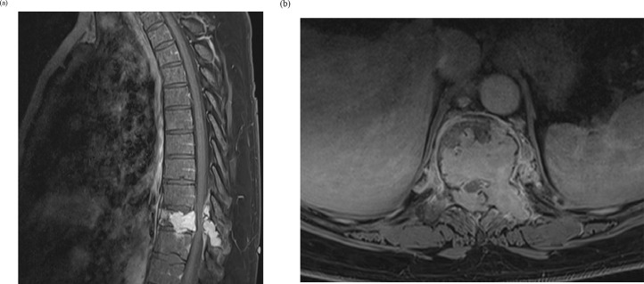
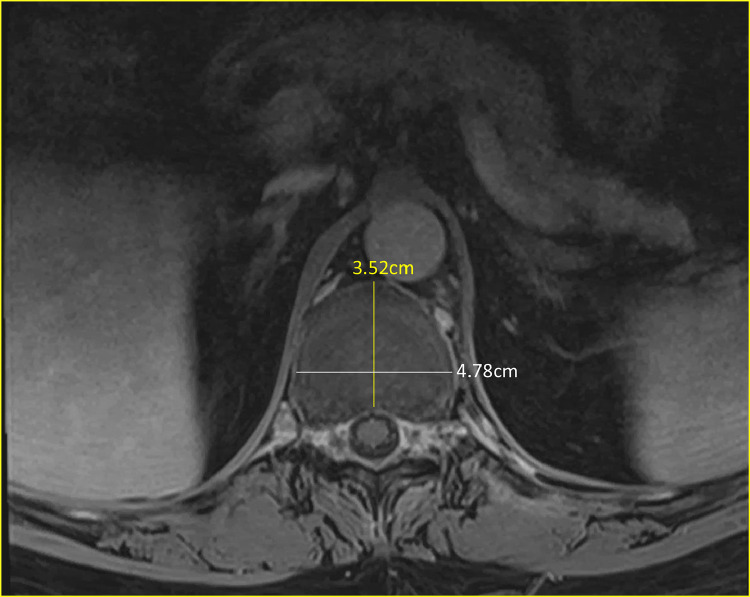
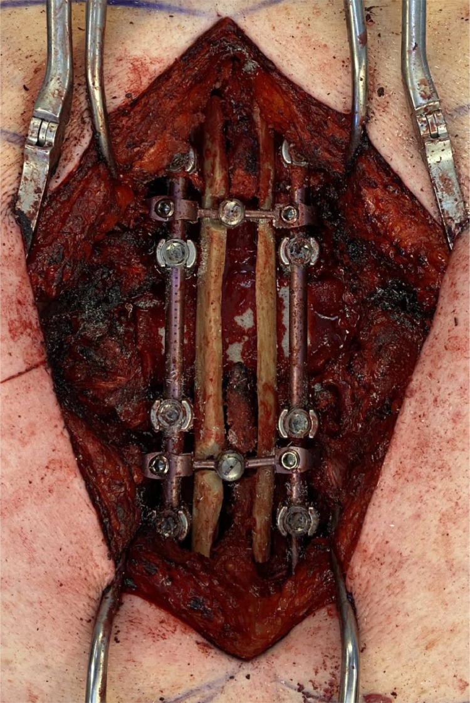
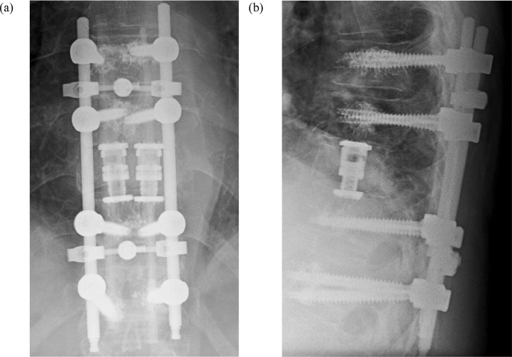
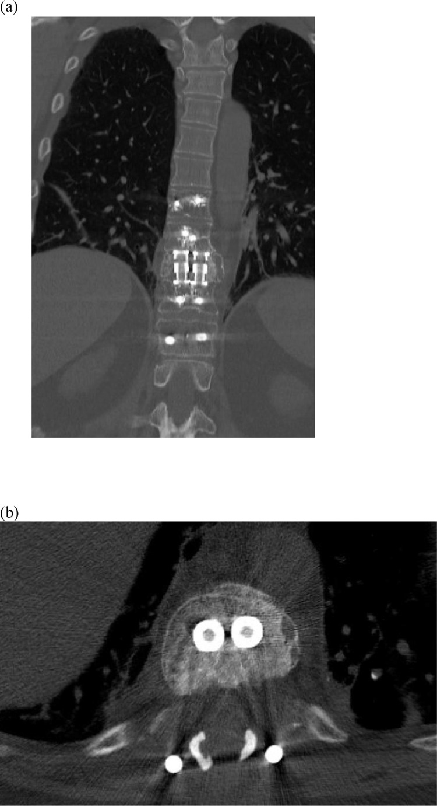
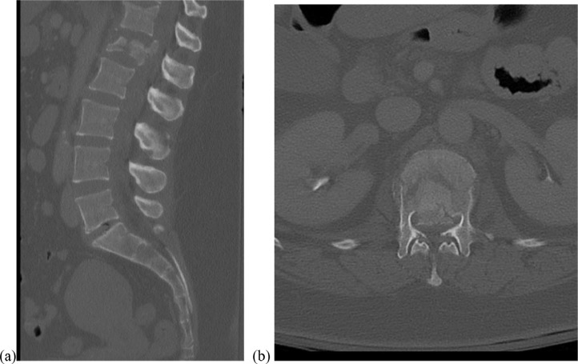
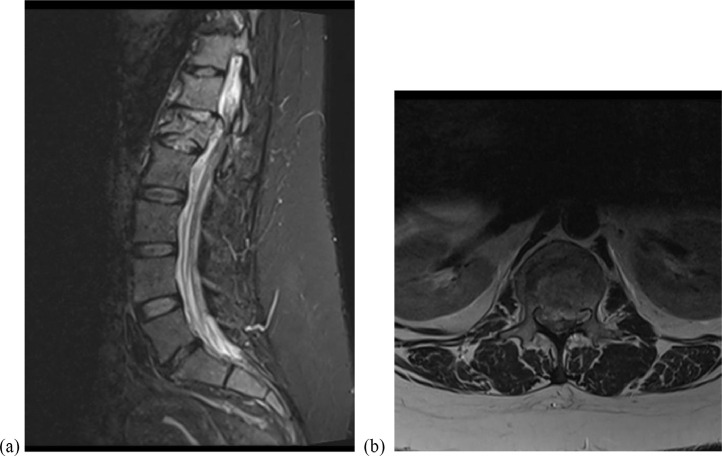
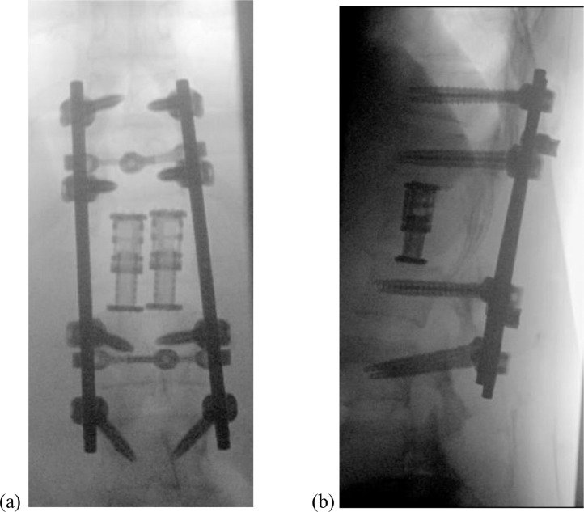
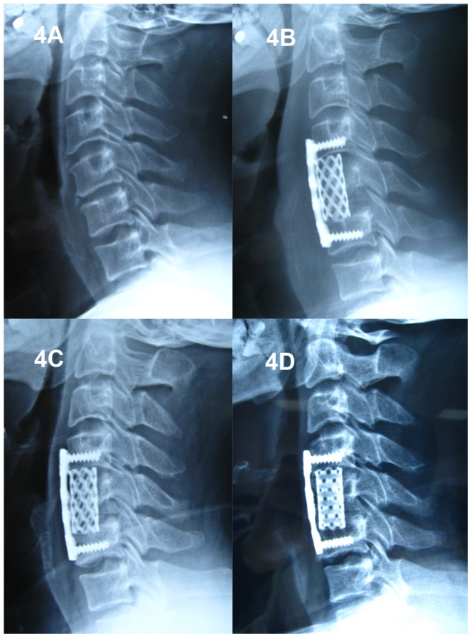
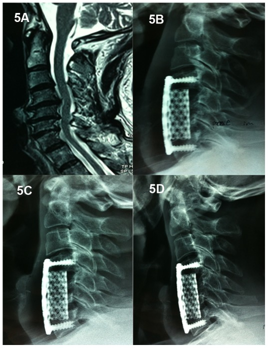

# Case Prep: Vertebral Corpectomy and Reconstruction (Metastatic / Primary Vertebral Tumor)

---

<!-- BEGIN CASE SNAPSHOT -->

## Case / Approach Snapshot

- **Anatomy at risk:** cord, roots, dura, epidural venous plexus, tumor vascular supply, vertebral body/posterior element involvement, and stabilization corridors.
- **Operative steps:** define oncologic and neurologic goals, localize levels, decompress neural elements, obtain tissue or resect/debulk safely, reconstruct stability, and coordinate radiation/systemic therapy planning; use the detailed operative sequence and approach notes below as the step-by-step source.
- **Rescue plans:** major blood loss, neuromonitoring change, durotomy/CSF leak, pathologic instability, wound breakdown after radiation, residual disease strategy, and staged embolization or reconstruction.
- **Figures:** review [Figures, Imaging & Video](#figures-imaging--video) and the [Curated Image Set](#curated-image-set); embedded local figures should remain open-access, public-domain, or otherwise reusable with attribution.
- **Papers:** review [High-Yield Literature](#high-yield-literature) for seminal sources, modern reviews, and outcome data specific to this page.

<!-- END CASE SNAPSHOT -->

## One-Liner
[Age]yo [M/F] with a [metastatic / primary] tumor of the [T_/L_] vertebral body with [cord compression / instability / intractable pain] planned for [posterolateral / anterior / combined] corpectomy, decompression, and instrumented reconstruction.

---

## Figures, Imaging & Video

**🎥 Operative video** — [search operative video on YouTube ▸](https://www.youtube.com/results?search_query=spinal+metastasis+surgery) · [The Neurosurgical Atlas ▸](https://www.neurosurgicalatlas.com)

**CNS Video Library**

<iframe src="https://www.youtube-nocookie.com/embed/nKlT6rMAAK4" title="CNS Neurosurgery 100: Management of Primary Vertebral Column Tumors" loading="lazy" allow="accelerometer; clipboard-write; encrypted-media; picture-in-picture; web-share" allowfullscreen></iframe>

> 🧭 **Operative approach:** [Transthoracic approach](../approaches/transthoracic-approach.md) — detailed corridor setup, step-by-step technique & figures

[Neurosurgical Atlas](https://www.neurosurgicalatlas.com) · [AO Surgery Reference](https://surgeryreference.aofoundation.org) · [Radiopaedia](https://radiopaedia.org/search?q=spinal%20metastasis&scope=all) · [PubMed Central](https://www.ncbi.nlm.nih.gov/pmc/?term=vertebral+corpectomy+metastasis+separation+surgery) — operative figures © linked; see [media-sources.md](../../resources/media-sources.md)

---

<!-- BEGIN COMMON PIMP QUESTIONS -->

## Common Pimp Questions

Use these to pressure-test preparation for **Vertebral Corpectomy and Reconstruction (Metastatic / Primary Vertebral Tumor)**:

1. What neurologic level and root are responsible for the presenting deficit?
2. What is the decompression target and how will you know it is adequately decompressed?
3. What instability, deformity, bone-quality, or fusion variable changes the construct?
4. What vascular, visceral, dural, or neural structure is the main structure at risk?
5. What postop brace, drain, mobilization, MAP, antibiotic, and DVT plan should be ordered?

<!-- END COMMON PIMP QUESTIONS -->

<!-- BEGIN ATTENDING PREFERENCE VARIABLES -->

## Attending Preference Variables

Items that commonly vary by surgeon or institution:

- **Positioning frame, arms, traction, and localization workflow:** [attending-specific]
- **Navigation/robot/fluoro use, screw system, graft/biologic choice, and drain threshold:** [attending-specific]
- **Neuromonitoring modality and MAP goal for myelopathy, deformity, or cord-risk cases:** [attending-specific]
- **Brace, Foley, antibiotics, mobilization, and DVT prophylaxis timing:** [attending-specific]

<!-- END ATTENDING PREFERENCE VARIABLES -->

<!-- BEGIN CURATED LITERATURE -->

## High-Yield Literature

- **Thoracic corpectomy and vertebral body reconstruction (TCVBR): a systematic review and meta-analysis** — Badary A. European spine journal : official publication of the European Spine Society, the European Spinal Deformity Society, and the European Section of the Cervical Spine Research Society 2026. [PubMed](https://pubmed.ncbi.nlm.nih.gov/41870608/)
- **Distractable vertebral cages for reconstruction after cervical corpectomy** — Woiciechowsky C. Spine 2005. [PubMed](https://pubmed.ncbi.nlm.nih.gov/16094275/)
- **Transpedicular partial corpectomy without anterior vertebral reconstruction in thoracic spinal metastases** — Chen YJ. Spine 2007. [PubMed](https://pubmed.ncbi.nlm.nih.gov/18090069/)
- **Medium Term Outcomes in Palliative Transpedicular Corpectomy with Cement Based Anterior Vertebral Reconstruction Performed for Patients with Spinal Metastasis** — Rizkallah M. Spine 2024. [PubMed](https://pubmed.ncbi.nlm.nih.gov/38864462/)
- **Palliative transpedicular partial corpectomy without anterior vertebral reconstruction in lower thoracic and thoracolumbar junction spinal metastases** — Chang CC. Journal of orthopaedic surgery and research 2015. [PubMed](https://pubmed.ncbi.nlm.nih.gov/26183322/)
- **Titanium cage reconstruction after cervical corpectomy** — Dorai Z. Journal of neurosurgery 2003. [PubMed](https://pubmed.ncbi.nlm.nih.gov/12859051/)
- **The use of an expandable cage for corpectomy reconstruction of vertebral body tumors through a posterior extracavitary approach: a multicenter consecutive case series of prospectively followed patients** — Shen FH. The spine journal : official journal of the North American Spine Society 2008. [PubMed](https://pubmed.ncbi.nlm.nih.gov/17923442/)
- **Differences in surgical outcome after anterior corpectomy and reconstruction with an expandable cage with rectangular footplates between thoracolumbar and lumbar osteoporotic vertebral fracture** — Terai H. North American Spine Society journal 2021. [PubMed](https://pubmed.ncbi.nlm.nih.gov/35141636/)
- **Comparison of polymethylmethacrylate versus expandable cage in anterior vertebral column reconstruction after posterior extracavitary corpectomy in lumbar and thoraco-lumbar metastatic spine tumors** — Eleraky M. European spine journal : official publication of the European Spine Society, the European Spinal Deformity Society, and the European Section of the Cervical Spine Research Society 2011. [PubMed](https://pubmed.ncbi.nlm.nih.gov/21390557/)
- **Cervical spinal stenosis: outcome after anterior corpectomy, allograft reconstruction, and instrumentation** — Mayr MT. Journal of neurosurgery 2002. [PubMed](https://pubmed.ncbi.nlm.nih.gov/11795694/)

<!-- END CURATED LITERATURE -->

---

<!-- BEGIN CURATED IMAGE SET -->

## Curated Image Set

Open-access figures are embedded from PubMed Central articles and kept unique to this guide.

*Fig. 1. Sagittal (a) and Axial (b) T1 Post Gadolinium MRI: Expansile lytic lesion involving the T10 vertebral body and posterior elements with pathologic fracture and epidural compression. Source: [Dual expandable interbody cage utilization for enhanced stability in vertebral column reconstruction following thoracolumbar corpectomy: A report of two cases](https://pmc.ncbi.nlm.nih.gov/articles/PMC8819912/) — North American Spine Society Journal 2021; CC BY-NC-ND.*

*Fig. 2. Axial T1 MRI Thoracic Spine Post-Gadolinium: superior endplate of the caudal T11 vertebral body indicating larger footprint of reconstruction required during VBR. Source: [Dual expandable interbody cage utilization for enhanced stability in vertebral column reconstruction following thoracolumbar corpectomy: A report of two cases](https://pmc.ncbi.nlm.nih.gov/articles/PMC8819912/) — North American Spine Society Journal 2021; CC BY-NC-ND.*

*Fig. 3. Intra-operative view of the posterior approach for vertebral body reconstruction. Source: [Dual expandable interbody cage utilization for enhanced stability in vertebral column reconstruction following thoracolumbar corpectomy: A report of two cases](https://pmc.ncbi.nlm.nih.gov/articles/PMC8819912/) — North American Spine Society Journal 2021; CC BY-NC-ND.*

*Fig. 4. AP (a) and lateral (b) radiographs of the thoracic spine showing bilateral expandable cage placement during vertebral body reconstruction. Source: [Dual expandable interbody cage utilization for enhanced stability in vertebral column reconstruction following thoracolumbar corpectomy: A report of two cases](https://pmc.ncbi.nlm.nih.gov/articles/PMC8819912/) — North American Spine Society Journal 2021; CC BY-NC-ND.*

*Fig. 5. Coronal (a) and axial (b) CT Thoracic Spine Without IV Contrast at 6-month follow up showing arthrodesis across the corpectomy defect Source: [Dual expandable interbody cage utilization for enhanced stability in vertebral column reconstruction following thoracolumbar corpectomy: A report of two cases](https://pmc.ncbi.nlm.nih.gov/articles/PMC8819912/) — North American Spine Society Journal 2021; CC BY-NC-ND.*

*Fig. 6. Representative mid-sagittal (a) and axial (b) CT cuts of L1 burst fracture with significant bony retropulsion. Source: [Dual expandable interbody cage utilization for enhanced stability in vertebral column reconstruction following thoracolumbar corpectomy: A report of two cases](https://pmc.ncbi.nlm.nih.gov/articles/PMC8819912/) — North American Spine Society Journal 2021; CC BY-NC-ND.*

*Fig. 7. Representative mid-sagittal STIR MRI (a) and T2 sequence MRI (b) of L1 burst fracture demonstrating cord compression. Source: [Dual expandable interbody cage utilization for enhanced stability in vertebral column reconstruction following thoracolumbar corpectomy: A report of two cases](https://pmc.ncbi.nlm.nih.gov/articles/PMC8819912/) — North American Spine Society Journal 2021; CC BY-NC-ND.*

*Fig. 8. Final intraoperative AP (a) and lateral (b) radiographs for L1 vertebral body reconstruction with bilateral expandable cages. Source: [Dual expandable interbody cage utilization for enhanced stability in vertebral column reconstruction following thoracolumbar corpectomy: A report of two cases](https://pmc.ncbi.nlm.nih.gov/articles/PMC8819912/) — North American Spine Society Journal 2021; CC BY-NC-ND.*

*Figure 4. A 53-year-old male who underwent 1-level corpectomy with a titanium mesh cage used for cervical reconstruction.The preoperative cervical X-ray film (4A) and immediately postoperative... Source: [Evaluation of Anterior Cervical Reconstruction with Titanium Mesh Cages versus Nano-Hydroxyapatite/Polyamide66 Cages after 1- or 2-Level Corpectomy for Multilevel Cervical Spondylotic Myelopathy: A Retrospective Study of 117 Patients](https://pmc.ncbi.nlm.nih.gov/articles/PMC4008500/) — PLoS ONE 2014; CC BY.*

*Figure 5. A 46-year-old male who underwent 2-level corpectomy with a titanium mesh cage used for cervical reconstruction.A cervical MRI scan (5A) shows multi-level disc herniations (C4/5, C5/6,... Source: [Evaluation of Anterior Cervical Reconstruction with Titanium Mesh Cages versus Nano-Hydroxyapatite/Polyamide66 Cages after 1- or 2-Level Corpectomy for Multilevel Cervical Spondylotic Myelopathy: A Retrospective Study of 117 Patients](https://pmc.ncbi.nlm.nih.gov/articles/PMC4008500/) — PLoS ONE 2014; CC BY.*

<!-- END CURATED IMAGE SET -->

---

## History of Present Illness
- Chief complaint: Mechanical/axial pain, progressive myelopathy/radiculopathy, deformity
- Known primary (lung, breast, prostate, renal, myeloma) vs primary bone tumor (chordoma, GCT, osteosarcoma)
- Onset/progression of neurological deficit (timing affects recovery), ambulatory status
- **Frameworks:** NOMS (Neurologic, Oncologic, Mechanical, Systemic), SINS (Spinal Instability Neoplastic Score), ESCC (epidural cord compression grade)

---

## Imaging Review
### MRI whole spine (T1±Gad, T2, STIR)
- Vertebral body involvement, **epidural cord compression (ESCC grade)**, cord signal, multilevel disease, paraspinal extension
### CT
- Bony destruction, **SINS (instability)**, pedicle/posterior element involvement, planning instrumentation
### CTA / Angiography + Embolization
- **Preoperative embolization** for hypervascular tumors (renal cell, thyroid, others) — reduces blood loss
- Vascular anatomy, artery of Adamkiewicz (thoracolumbar)
### Staging
- Primary workup/staging, biopsy if unknown primary

---

## Labs
- CBC, BMP, Coags, **Type and crossmatch (2-4+ units)**, calcium (myeloma), tumor markers as indicated

---

## Neurological Examination
- Detailed motor/sensory level, reflexes, ambulation, bowel/bladder, performance status

---

## Surgical Planning

### Case Logistics, OR Needs & Orders
- **Typical bed:** ICU/step-down for intramedullary, deformity, corpectomy, or high-EBL tumor cases; floor for small stable intradural extramedullary cases with intact exam.
- **OR setup:** microscope, fluoroscopy/navigation, neuromonitoring, tumor debulking/microsurgical set, dural repair materials, instrumentation/corpectomy trays as indicated, and blood available.
- **Special needs:** arterial line/Foley for long cases, dexamethasone for cord edema when indicated, MAP support for myelopathy/cord manipulation, oncology/radiation plan, and pathology/frozen specimen workflow.
- **Immediate postop orders:** frequent motor/sensory exams, MAP support if cord manipulation or deficit, MRI/CT/X-rays per tumor/construct, steroid taper, drain/dural-leak precautions, brace/activity, DVT timing, and oncology/radiation follow-up.

### Goals & Approach
- Goals: Circumferential cord decompression, mechanical stabilization, local tumor control, pain/function — **separation surgery** (decompress + stabilize, leave margin) increasingly favored + postop SRS for mets; **en bloc spondylectomy** for primary/isolated curable tumors
- **Approach:** posterolateral transpedicular (single-stage, common for thoracic mets), anterior (corpectomy with direct access), or combined/360-degree

### Position
- Prone (posterolateral) or lateral/supine (anterior thoracic/lumbar — may need thoracic/access surgeon); Mayfield/pinned; IONM baseline

### Key Surgical Steps (Posterolateral Transpedicular Corpectomy)
1. Level localization, midline incision, expose posterior elements
2. **Pedicle screw instrumentation** above and below (typically 2 levels each side) for reconstruction
3. **Laminectomy** at involved level, identify and protect cord/thecal sac
4. **Transpedicular/costotransversectomy** access: remove pedicle(s), facets, rib head (thoracic) to reach the vertebral body laterally/anteriorly
5. **Ligate the involved nerve root** (thoracic — sacrificable) for working corridor if needed
6. **Corpectomy:** piecemeal removal of tumor/vertebral body, circumferential decompression of the thecal sac (remove posterior body/epidural tumor)
7. **Anterior column reconstruction:** expandable cage / PMMA + mesh in the corpectomy defect
8. Place rods, secure construct, restore alignment, compress/distract as needed
9. Confirm decompression and hardware on fluoroscopy
10. Hemostasis (tumor bleeding — embolization helps), drain, closure

### Critical Anatomy & Structures at Risk
1. **Spinal cord** — compression, manipulation; **MAP support**
2. **Segmental/radicular arteries** (artery of Adamkiewicz, thoracolumbar left) — cord infarction
3. **Great vessels** (anterior, esp. lumbar/anterior approach), pleura/lung (thoracic), aorta
4. **Nerve roots** (thoracic sacrificable; lumbar must preserve)
5. Dura (epidural tumor adherence — CSF leak)

### Equipment
- Pedicle screw/rod system, **expandable cage / PMMA-mesh** for reconstruction
- High-speed drill, Kerrison, curettes, tumor instruments
- Fluoroscopy/navigation, **cell saver (caution in tumor — controversial), crossmatched blood**
- Preop embolization, hemostatic agents, dural repair materials

### Monitoring
- SSEPs, MEPs, EMG

### Anesthesia
- Arterial line, central access, **crossmatched blood/massive transfusion ready**, MAP > 85, prone/positioning precautions, possible thoracic/access surgeon

### Potential Complications
1. **Major hemorrhage** (vascular tumors — embolize preop)
2. Neurological injury (cord/root/vascular)
3. Hardware failure/pseudarthrosis (osteoporotic/irradiated bone, limited life expectancy), adjacent fracture
4. CSF leak, wound complications (irradiated/immunocompromised field), infection
5. Approach-specific (pleural, vascular, bowel)

---

## Operative Note Template
**Preoperative Diagnosis:** [Metastatic/primary] tumor of [T_/L_] with epidural cord compression [ESCC __] and instability [SINS __]

**Postoperative Diagnosis:** Same

**Procedure:** [T_/L_] [posterolateral transpedicular] corpectomy with circumferential decompression and instrumented reconstruction (pedicle screws + expandable cage)

**Surgeon / Assistant:**
**Anesthesia:** General endotracheal
**EBL / Fluids / Blood products:** [crossmatched 2–4 units; cell saver]
**Adjuncts:** Fluoroscopy/navigation, high-speed drill; SSEP/MEP/EMG; MAP > 85; preoperative embolization
**Implants:** Pedicle screws/rods, expandable cage/PMMA, bone graft
**Complications:** None

**Indications:** [Age]yo [M/F] with [a metastatic/primary] tumor at [T_/L_] causing epidural cord compression [and instability]. [Preoperative embolization was performed for the vascular tumor.] Separation surgery/decompression with stabilization was planned (adjuvant radiation to follow for mets). Risks (hemorrhage, neurological injury, hardware failure) discussed.

**Description of Procedure:** After consent and time-out, general anesthesia was induced (MAP > 85, crossmatched blood/cell saver) and neuromonitoring established. The patient was positioned prone and the levels confirmed. Pedicle screws were placed above and below for reconstruction. A laminectomy was performed and the cord/thecal sac protected.

Via a transpedicular/costotransversectomy corridor [with ligation of the involved thoracic nerve root], the pedicle(s) were removed and a **corpectomy** performed, achieving circumferential decompression by removing the posterior vertebral body and epidural tumor. An expandable cage [/PMMA-mesh] reconstructed the anterior column, rods were secured, and alignment confirmed on fluoroscopy. Hemostasis was obtained (embolization-assisted). Neuromonitoring remained stable.

A drain was placed and closure performed in layers. The patient was transferred to the ICU with MAP support and serial neuro/hemoglobin monitoring.

---

## Postoperative Plan
- ICU, neuro checks q1h, MAP support, **monitor blood loss/Hgb**
- X-ray/CT postop (hardware, alignment), drain management
- DVT prophylaxis (balance bleeding/tumor), brace per surgeon
- **Postoperative radiation (SRS/EBRT)** for mets after wound healing (~2-3 weeks); oncology coordination
- Pathology; restage; rehab; goals-of-care for advanced disease
