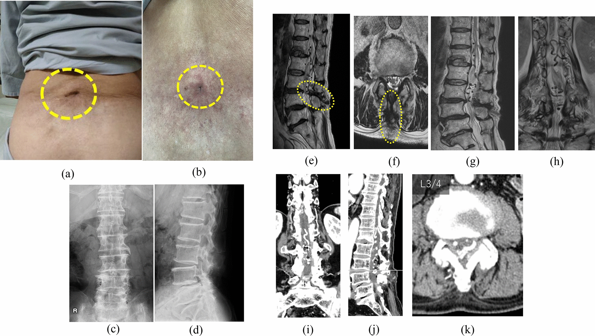
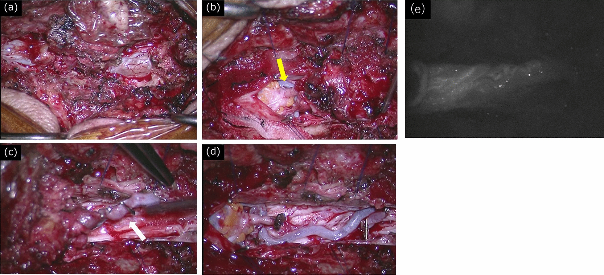
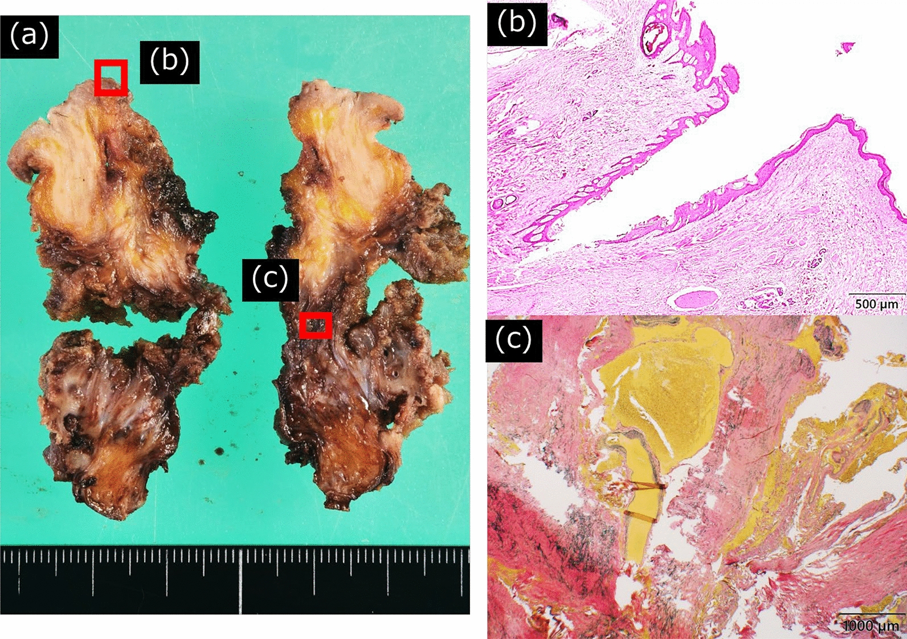
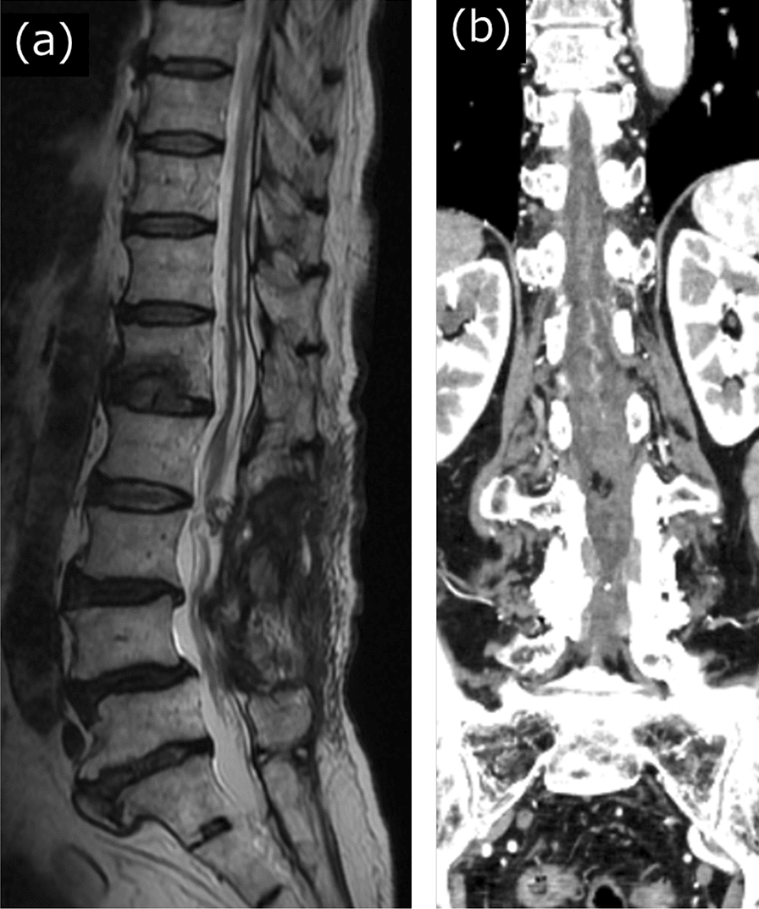
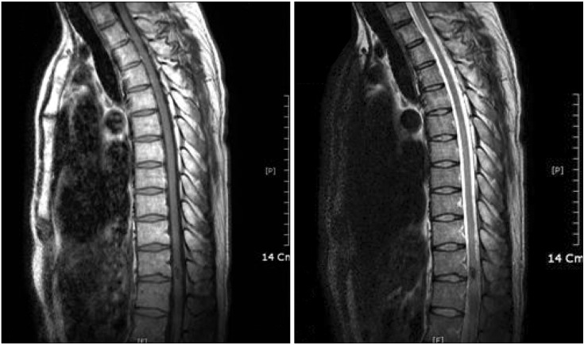
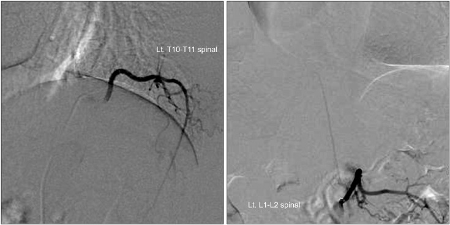
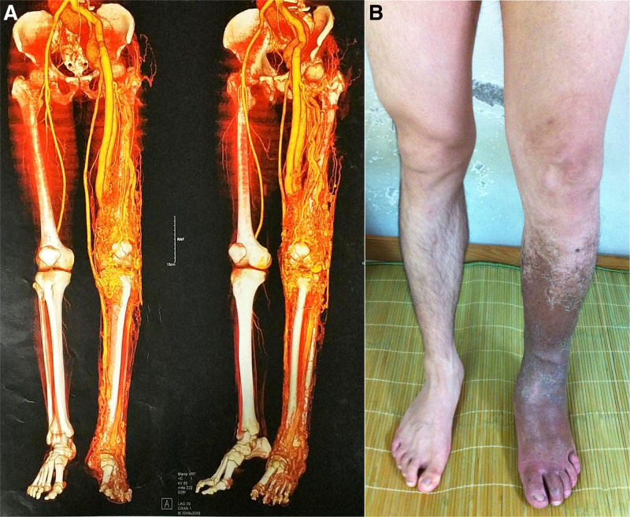
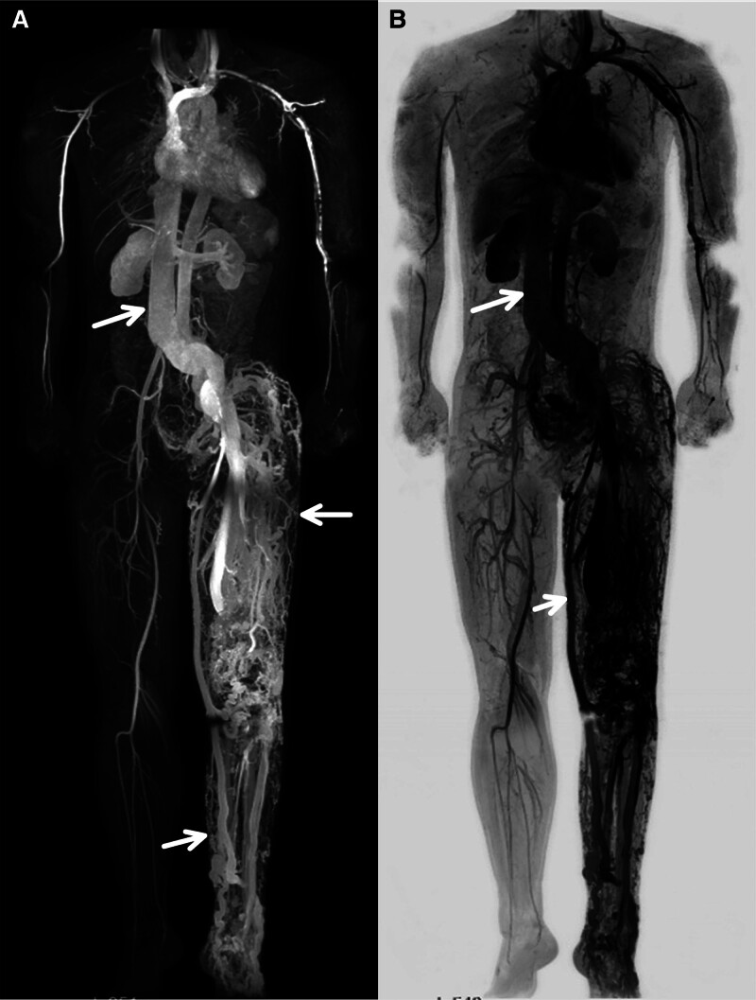
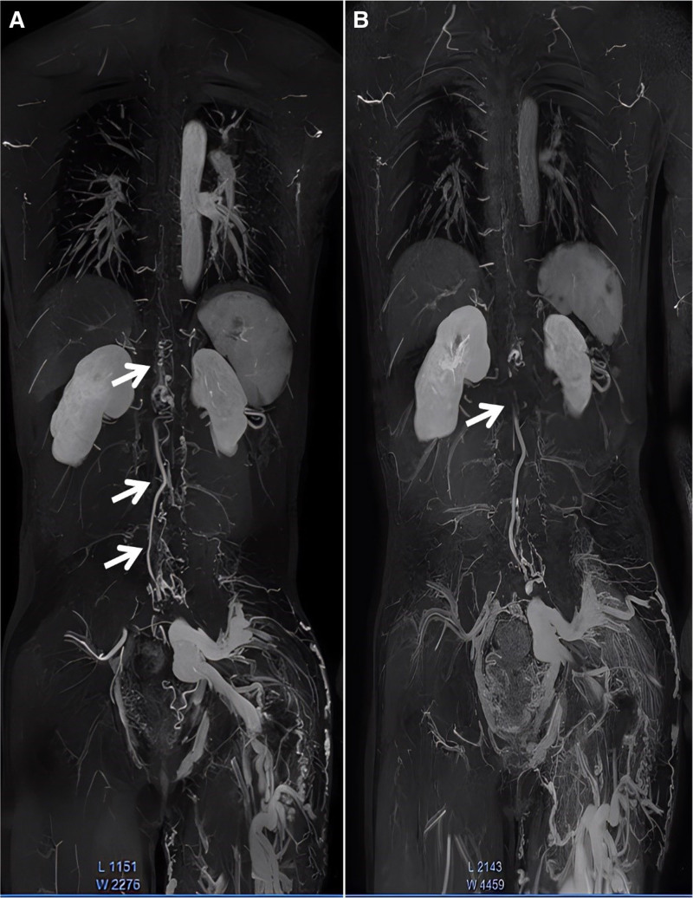
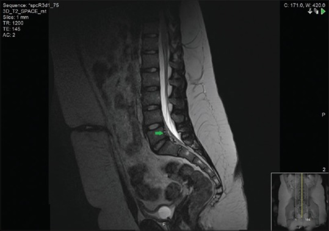

# Case Prep: Spinal Arteriovenous Malformation (Intramedullary / Perimedullary)

---

<!-- BEGIN CASE DOSSIER -->

## Case / Approach Dossier

- **Anatomy at risk:** cord, roots, dura, posterior elements, segmental and radiculomedullary arteries, venous plexus, and level-specific bony landmarks.
- **Operative steps:** localize the level, expose while preserving stability, obtain proximal/distal vascular control when relevant, decompress or disconnect/reconstruct the lesion, confirm flow/decompression, and close with CSF-leak prevention; use the detailed operative sequence and approach notes below as the step-by-step source.
- **Rescue plans:** neuromonitoring change, bleeding from epidural/foraminal vessels, durotomy, wrong-level exposure, cord swelling/ischemia, instability, and staged/endovascular adjuncts.
- **Figures:** review [Figures, Imaging & Video](#figures-imaging--video) and the [Curated Image Set](#curated-image-set); embedded local figures should remain open-access, public-domain, or otherwise reusable with attribution.
- **Papers:** review [High-Yield Literature](#high-yield-literature) for seminal sources, modern reviews, and outcome data specific to this page.
- **Textbook cross-checks:** use [Textbook Cross-Checks](#textbook-cross-checks) and the [Source Crosswalk](../../resources/source-crosswalk.md) to cite copyrighted textbooks/atlases while summarizing in original words.

<!-- END CASE DOSSIER -->

## One-Liner
[Age]yo [M/F] with a [cervical/thoracic] [intramedullary glomus / perimedullary fistulous] spinal AVM presenting with [hemorrhage / myelopathy / radiculopathy] planned for [embolization ± microsurgical resection].

---

## Figures, Imaging & Video

**🎥 Operative video** — [search operative video on YouTube ▸](https://www.youtube.com/results?search_query=spinal+arteriovenous+malformation+surgery) · [The Neurosurgical Atlas ▸](https://www.neurosurgicalatlas.com)

[Neurosurgical Atlas](https://www.neurosurgicalatlas.com) · [neuroangio.org](https://neuroangio.org) · [Radiopaedia](https://radiopaedia.org/search?q=spinal%20arteriovenous%20malformation&scope=all) · [PubMed Central](https://www.ncbi.nlm.nih.gov/pmc/?term=spinal+arteriovenous+malformation) — operative figures © linked; see [media-sources.md](../../resources/media-sources.md)

---

<!-- BEGIN TEXTBOOK CROSS-CHECKS -->

## Textbook Cross-Checks

- **Vascular anatomy:** Rhoton Cranial Anatomy; Decision Making in Neurovascular Disease; Practical Neuroangiography — confirm parent-vessel anatomy, perforators, venous drainage, collateral pathways, and endovascular access/rescue options.
- **Operative/endovascular strategy:** Youmans and Winn; Schmidek and Sweet; Greenberg — summarize proximal control, exposure/device strategy, temporary-control options, and bailout plans in your own words.
- **Complication rescue:** Greenberg; Decision Making in Neurovascular Disease — review ischemia, hemorrhage, thromboembolism, rupture, vasospasm, and postoperative surveillance algorithms.
- **Copyright-safe use:** cite these sources as private cross-checks, then write the guide content in original words; do not re-host textbook pages, figures, tables, or board-review card material. See [Source Crosswalk & Copyright-Safe Use](../../resources/source-crosswalk.md).

<!-- END TEXTBOOK CROSS-CHECKS -->

<!-- BEGIN CURATED LITERATURE -->

## High-Yield Literature

- **Treatment of Spinal Arteriovenous Malformation and Fistula** — Ehresman J. Neurosurgery clinics of North America 2022. [PubMed](https://pubmed.ncbi.nlm.nih.gov/35346451/)
- **Spinal arteriovenous malformation with a calcified nodule: illustrative case** — Liu PC. Journal of neurosurgery. Case lessons 2023. [PubMed](https://pubmed.ncbi.nlm.nih.gov/37773758/)
- **[Spinal arteriovenous malformations]** — Udelhoven A. Radiologie (Heidelberg, Germany) 2022. [PubMed](https://pubmed.ncbi.nlm.nih.gov/35768523/)
- **Spinal arteriovenous malformation** — Drislane FW. Archives of neurology 2003. [PubMed](https://pubmed.ncbi.nlm.nih.gov/12533099/)
- **Spinal Arteriovenous Malformation Associated with Parkes Weber Syndrome: Report of Two Cases and Literature Review** — Li ZF. World neurosurgery 2017. [PubMed](https://pubmed.ncbi.nlm.nih.gov/28645597/)
- **[Spinal arteriovenous malformation]** — Miyamoto S. No shinkei geka. Neurological surgery 2002. [PubMed](https://pubmed.ncbi.nlm.nih.gov/11857938/)
- **[Surgical Treatment for Spinal Arteriovenous Malformation]** — Endo T. No shinkei geka. Neurological surgery 2021. [PubMed](https://pubmed.ncbi.nlm.nih.gov/34092573/)
- **Transvenous embolization of conus spinal arteriovenous malformation: illustrative case** — Anadani M. Journal of neurosurgery. Case lessons 2023. [PubMed](https://pubmed.ncbi.nlm.nih.gov/36647251/)
- **Multisegmental spinal arteriovenous malformation associated with the Parkes-Weber syndrome: A case report and literature review** — Tao L. Medicine 2025. [PubMed](https://pubmed.ncbi.nlm.nih.gov/40550043/)
- **Spinal arteriovenous fistulae: surgical management** — Day AL. Handbook of clinical neurology 2017. [PubMed](https://pubmed.ncbi.nlm.nih.gov/28552141/)

<!-- END CURATED LITERATURE -->

---

<!-- BEGIN CURATED IMAGE SET -->

## Curated Image Set

Open-access figures are embedded from PubMed Central articles and kept unique to this guide.

*Fig. 1. Preoperative photograph of the patient’s back and radiological findings of the lumbosacral spine. (a, b) Patient exhibited a skin ostium (dotted circle) in the medial lumbar region. (c,... Source: [Spinal arteriovenous malformation associated with congenital dermal sinus: a case report](https://pmc.ncbi.nlm.nih.gov/articles/PMC12297412/) — Journal of Medical Case Reports 2025; CC BY-NC-ND.*

*Fig. 2. Surgical site photographs. (a) After L3/4 laminectomy, the cutaneous sinus was continuous with the dura mater. (b) A fatty mass was present on the cephalic side of the dermal sinus. It... Source: [Spinal arteriovenous malformation associated with congenital dermal sinus: a case report](https://pmc.ncbi.nlm.nih.gov/articles/PMC12297412/) — Journal of Medical Case Reports 2025; CC BY-NC-ND.*

*Fig. 3. Histopathological findings. (a) Extracted lesions cut in the sagittal plane. Panels show the areas observed under a microscope. (b) The fistula area showed a luminal structure covered by... Source: [Spinal arteriovenous malformation associated with congenital dermal sinus: a case report](https://pmc.ncbi.nlm.nih.gov/articles/PMC12297412/) — Journal of Medical Case Reports 2025; CC BY-NC-ND.*

*Fig. 4. Postoperative radiological findings. Postoperative (a) magnetic resonance imaging and (b) contrast-enhanced computed tomography at 2.5 months showed that the abnormal vascular shadows... Source: [Spinal arteriovenous malformation associated with congenital dermal sinus: a case report](https://pmc.ncbi.nlm.nih.gov/articles/PMC12297412/) — Journal of Medical Case Reports 2025; CC BY-NC-ND.*

*Fig. 1. T spine MR images show about 1.2 cm sized ill-defined intramedullary lesion which has intramedullary nidus and multiple flow voids extension to the dorsal subpial surface is noted in... Source: [Spinal Arteriovenous Malformation Masquerating Zoster Sine Herpete](https://pmc.ncbi.nlm.nih.gov/articles/PMC3546215/) — The Korean Journal of Pain 2013; CC BY-NC.*

*Fig. 2. Spinal angiogram shows spinal cord AVM feeding from anterior spinal artery from left T9 intercostal artery and left L1 lumbar artery (artery of Adamkiewicz) and nidus of T11 level... Source: [Spinal Arteriovenous Malformation Masquerating Zoster Sine Herpete](https://pmc.ncbi.nlm.nih.gov/articles/PMC3546215/) — The Korean Journal of Pain 2013; CC BY-NC.*

*Figure 1.. A 33-yr-old male with multisegmental spinal arteriovenous malformation and PWS. (A) The computed tomography angiography of both lower extremities of the patient. (B) Localized tissue... Source: [Multisegmental spinal arteriovenous malformation associated with the Parkes–Weber syndrome: A case report and literature review](https://pmc.ncbi.nlm.nih.gov/articles/PMC12187294/) — Medicine 2025; CC BY.*

*Figure 2.. The patient underwent whole-body angiography using modified DIXON technique combined with CE-MRA and bolus track technique. (A) CE-MRA showed marked dilation of the inferior vena cava... Source: [Multisegmental spinal arteriovenous malformation associated with the Parkes–Weber syndrome: A case report and literature review](https://pmc.ncbi.nlm.nih.gov/articles/PMC12187294/) — Medicine 2025; CC BY.*

*Figure 3.. (A) CE-MRA showing spinal arteriovenous malformation (T9–L4) before embolization. (B) CE-MRA showed significant improvement of the abnormal connections between the arteries and veins in... Source: [Multisegmental spinal arteriovenous malformation associated with the Parkes–Weber syndrome: A case report and literature review](https://pmc.ncbi.nlm.nih.gov/articles/PMC12187294/) — Medicine 2025; CC BY.*

*Figure 1. Sagittal view of the spinal magnetic resonance imaging scan which shows an anterior epidural arteriovenous malformation at L4/5 to S2 level (arrow). The thecal canal is obliterated at... Source: [Spinal arteriovenous malformation presenting with urinary retention](https://pmc.ncbi.nlm.nih.gov/articles/PMC4944631/) — Urology Annals 2016; CC BY-NC-SA.*

<!-- END CURATED IMAGE SET -->

---

## History of Present Illness
- Chief complaint: Acute deficit from **hemorrhage** (hematomyelia/SAH), or progressive myelopathy (steal/venous congestion/mass effect)
- Younger patients (vs dAVF), abrupt presentations more common
- **Types:** intramedullary (glomus/compact, Type II), juvenile (Type III, extensive), perimedullary fistula (Type IV — pial AV fistula)
- Prior hemorrhage, prior embolization/surgery, associated aneurysms

---

## Imaging Review
### MRI Spine (T2, GRE, T1±Gad)
- Nidus location (intramedullary vs pial/perimedullary), flow voids, hemorrhage (GRE/SWI), syrinx, cord edema
### Spinal DSA (gold standard)
- **Angioarchitecture:** feeders (anterior/posterior spinal arteries), nidus, draining veins, flow rate, associated aneurysms
- **Artery of Adamkiewicz / cord supply** relationship (shared supply limits resectability)
- Compact glomus (more resectable) vs diffuse/juvenile (high risk)

---

## Labs
- CBC, BMP, Coags, **type and crossmatch**

---

## Neurological Examination
- Detailed motor/sensory/sphincter, gait, baseline documentation

---

## Surgical Planning

### Diagnosis & Indication
- Indication: Hemorrhage, progressive deficit, accessible nidus; **multimodal** management (embolization to reduce flow/target deep feeders, then microsurgery for compact dorsal/pial lesions)
- High-risk anterior/intramedullary nidi with shared ASA supply may be managed by partial embolization/observation (cure not always achievable safely)
- Perimedullary fistulas (Type IV): disconnect the fistulous point (surgery or embolization)

### Position
- Prone, Mayfield/foam, IONM baseline; per level

### Key Surgical Steps
1. Preoperative/staged **embolization** (reduce nidus flow, target inaccessible feeders)
2. Laminectomy at the lesion level, midline durotomy
3. Identify the nidus/fistula on the dorsal/pial cord surface (ICG, DSA correlation)
4. **Perimedullary fistula:** identify and **coagulate/clip the single fistulous point** between feeding artery and draining vein (preserve normal vessels)
5. **Glomus AVM:** circumferential pial dissection, coagulate feeders progressively, **preserve anterior spinal artery and normal perforators**, take draining vein last; intramedullary component dissected in pial plane with IONM guidance — accept subtotal if cord function threatened
6. **ICG / intraoperative DSA** to confirm obliteration
7. Watertight dural closure

### Critical Anatomy & Structures at Risk
1. **Anterior spinal artery and sulcal perforators** — cord infarction if sacrificed
2. **Spinal cord parenchyma** (intramedullary dissection) — motor/sensory tracts
3. Draining veins (preserve until feeders controlled — as cranial AVM principles)
4. Dura, nerve roots

### Equipment
- Microscope, **ICG / intraoperative DSA**, micro-clips, fine bipolar, micro-instruments
- Embolization (neuro-IR, preop/staged), CUSA (selected), dural substitute

### Monitoring
- **SSEPs, MEPs, D-wave** (cord); essential

### Anesthesia
- Arterial line, **MAP support**, crossmatched blood, no paralytic (IONM), prone precautions

### Potential Complications
1. **Cord infarction** (ASA/perforator injury), hemorrhage
2. Worsened myelopathy, incomplete obliteration/recurrence
3. CSF leak, venous infarction (premature vein occlusion)

---

## Operative Note Template
**Preoperative Diagnosis:** [Cervical/thoracic] spinal AVM ([intramedullary glomus / perimedullary fistula]) [with prior hemorrhage]

**Postoperative Diagnosis:** Same

**Procedure:** [Level] laminectomy and microsurgical resection/disconnection of spinal AVM [following embolization]

**Surgeon / Assistant:**
**Anesthesia:** General endotracheal, no paralytic
**EBL / Fluids / Blood products:** [crossmatched]
**Adjuncts:** Microscope, ICG/intraoperative DSA, micro-clips, fine bipolar; **MEP/SSEP/D-wave**; MAP support
**Implants:** Dural substitute, sealant
**Complications:** None

**Indications:** [Age]yo [M/F] with a symptomatic spinal AVM at [level] presenting with [hemorrhage/myelopathy]. [Staged embolization preceded surgery.] Risks (cord infarction, hemorrhage, deficit) discussed.

**Description of Procedure:** After consent and time-out, general anesthesia was induced (MAP support, no paralytic) and MEP/SSEP/D-wave monitoring established. [Preoperative embolization had reduced nidus flow.] The patient was positioned prone; a laminectomy was performed over the lesion and a midline durotomy made under the microscope.

The nidus/fistula was identified on the dorsal/pial surface (ICG, DSA correlation). [Perimedullary fistula (Type IV): the single fistulous point between feeding artery and draining vein was coagulated/clipped, preserving normal vessels.] [Glomus AVM: circumferential pial dissection with progressive feeder control, **preserving the anterior spinal artery and perforators**, taking the draining vein last.] ICG [/intraoperative DSA] confirmed obliteration with preserved normal cord vessels. A watertight dural closure was performed with sealant.

Closure was completed in layers. The patient was transferred to the ICU with MAP support and CSF-leak precautions.

---

## Postoperative Plan
- ICU, neuro checks q1h (motor/sensory/sphincter), MAP support, CSF leak precautions
- **Postop DSA** (confirm obliteration), MRI
- DVT prophylaxis (mechanical), rehab, bowel/bladder management
- Surveillance imaging (recurrence, esp. partial treatment)
