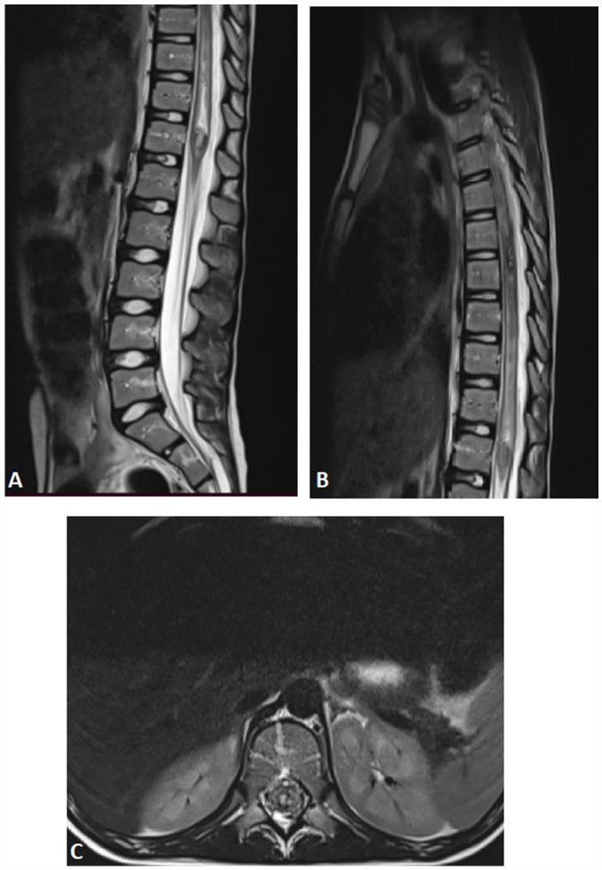
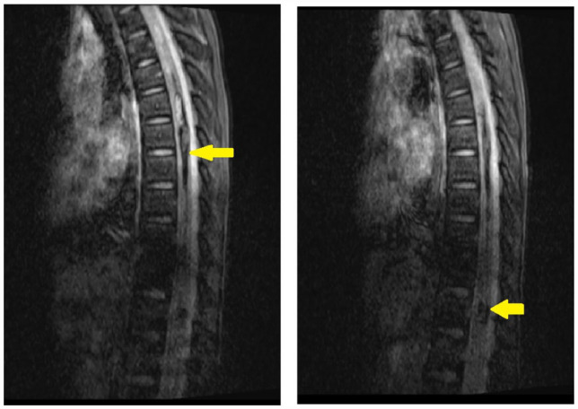
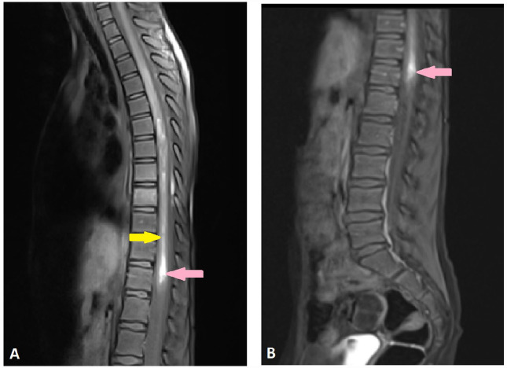
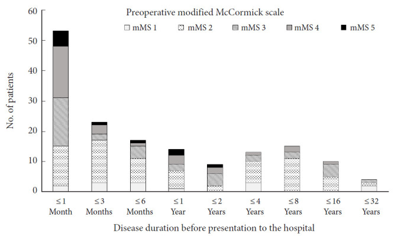
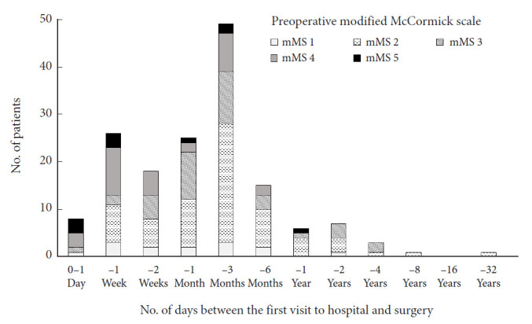
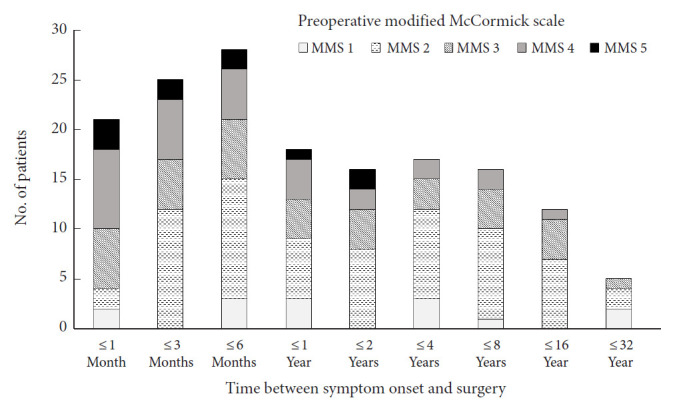
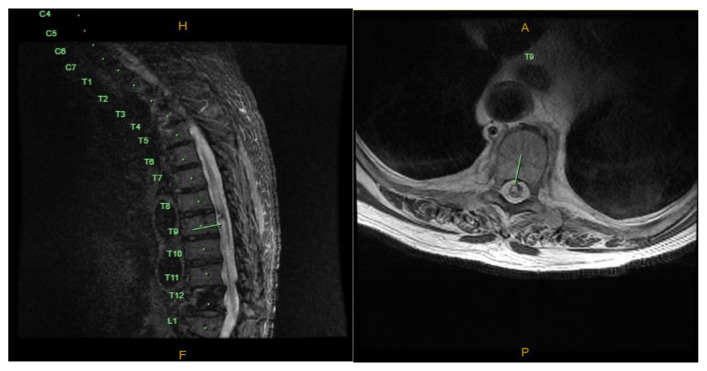
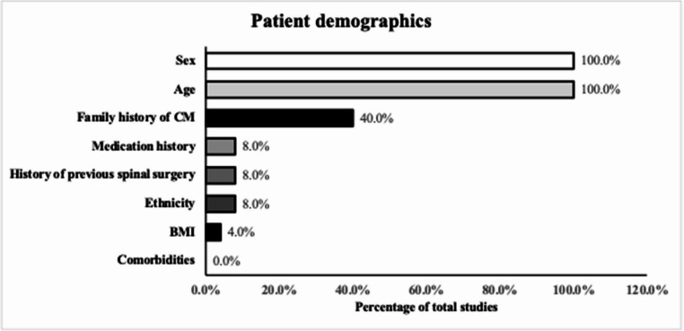

# Case Prep: Spinal Cord Cavernous Malformation Resection

---

## One-Liner
[Age]yo [M/F] with a [cervical/thoracic] intramedullary spinal cord cavernous malformation presenting with [myelopathy / acute deficit from hemorrhage / sensory changes] planned for laminectomy and midline (or dorsal-presenting) myelotomy for microsurgical resection.

---

## Figures, Imaging & Video

**🎥 Operative video** — [search operative video on YouTube ▸](https://www.youtube.com/results?search_query=spinal+cord+cavernoma+surgery) · [The Neurosurgical Atlas ▸](https://www.neurosurgicalatlas.com)

[Neurosurgical Atlas](https://www.neurosurgicalatlas.com) · [Radiopaedia](https://radiopaedia.org/search?q=spinal%20cord%20cavernoma&scope=all) · [PubMed Central](https://www.ncbi.nlm.nih.gov/pmc/?term=intramedullary+spinal+cavernous+malformation) — operative figures © linked; see [media-sources.md](../../resources/media-sources.md)

---

<!-- BEGIN TEXTBOOK CROSS-CHECKS -->

## Textbook Cross-Checks

- **Vascular anatomy:** Rhoton Cranial Anatomy; Decision Making in Neurovascular Disease; Practical Neuroangiography — confirm parent-vessel anatomy, perforators, venous drainage, collateral pathways, and endovascular access/rescue options.
- **Operative/endovascular strategy:** Youmans and Winn; Schmidek and Sweet; Greenberg — summarize proximal control, exposure/device strategy, temporary-control options, and bailout plans in your own words.
- **Complication rescue:** Greenberg; Decision Making in Neurovascular Disease — review ischemia, hemorrhage, thromboembolism, rupture, vasospasm, and postoperative surveillance algorithms.
- **Copyright-safe use:** cite these sources as private cross-checks, then write the guide content in original words; do not re-host textbook pages, figures, tables, or board-review card material. See [Source Crosswalk & Copyright-Safe Use](../../resources/source-crosswalk.md).

<!-- END TEXTBOOK CROSS-CHECKS -->

<!-- BEGIN CURATED LITERATURE -->

## High-Yield Literature

- **Spinal Cord Cavernous Malformation: A Case Report** — Izi Z. Global pediatric health 2023. [PubMed](https://pubmed.ncbi.nlm.nih.gov/37434870/)
- **How I do it: resection of spinal cord cavernous malformation** — Agosti E. Acta neurochirurgica 2022. [PubMed](https://pubmed.ncbi.nlm.nih.gov/35764695/)
- **A Rare Instance of Spinal Cord Cavernous Malformation With Adjacent Intramedullary Microhemorrhage** — Yu L. The Journal of craniofacial surgery 2024. [PubMed](https://pubmed.ncbi.nlm.nih.gov/38682949/)
- **Clinical features and long-term outcomes of pediatric spinal cord cavernous malformation-a report of 18 cases and literature review** — Zhang L. Child's nervous system : ChNS : official journal of the International Society for Pediatric Neurosurgery 2021. [PubMed](https://pubmed.ncbi.nlm.nih.gov/32591875/)
- **C5-C6 Cervical Spinal Cord Cavernous Malformation Microsurgical Resection: 2-Dimensional Operative Video** — Enriquez-Marulanda A. Operative neurosurgery (Hagerstown, Md.) 2019. [PubMed](https://pubmed.ncbi.nlm.nih.gov/29635403/)
- **Natural history of hemorrhagic events in spinal cord cavernous malformation: an updated systematic review and Meta-Analysis** — Wadhwa A. Neurosurgical review 2026. [PubMed](https://pubmed.ncbi.nlm.nih.gov/41609901/)
- **Acceptance of Early Surgery for Treatment of Spinal Cord Cavernous Malformation in Contemporary Japan** — Kurokawa R. Neurospine 2023. [PubMed](https://pubmed.ncbi.nlm.nih.gov/37401077/)
- **Ascending Spinal Cord Infarction Secondary to Recurrent Spinal Cord Cavernous Malformation Hemorrhage** — Huntley GD. Journal of stroke and cerebrovascular diseases : the official journal of National Stroke Association 2017. [PubMed](https://pubmed.ncbi.nlm.nih.gov/28236596/)
- **Conservative and Surgical Management of Spinal Cord Cavernous Malformations** — Ohnishi YI. World neurosurgery: X 2020. [PubMed](https://pubmed.ncbi.nlm.nih.gov/31891154/)
- **Microsurgical resection of symptomatic intramedullary cervical spinal cord cavernous malformation** — Dziedzic TA. Neurosurgical focus: Video 2019. [PubMed](https://pubmed.ncbi.nlm.nih.gov/36285059/)

<!-- END CURATED LITERATURE -->

---

<!-- BEGIN CURATED IMAGE SET -->

## Curated Image Set

Open-access figures are embedded from PubMed Central articles and kept unique to this guide.

*Figure 1. Source: [The Reality of Benefit in Surgical Removal for Spinal Cord Cavernous Malformation: Commentary on “Acceptance of Early Surgery for Treatment of Spinal Cord Cavernous Malformation in Contemporary Japan”](https://pmc.ncbi.nlm.nih.gov/articles/PMC10323340/) — Neurospine. 2023 Jun 30;20(2):595–6. doi: 10.14245/ns.2346574.287; CC BY-NC.*

*Figure 1.. Sagittal (A and B) and axial (C) T2-W spinal MR images shows 2 focal hyperintensity with hypointense edge with surrounding spinal cord edema, this appearance described as « Popcorn ». Source: [Spinal Cord Cavernous Malformation: A Case Report](https://pmc.ncbi.nlm.nih.gov/articles/PMC10331179/) — Global Pediatric Health 2023; CC BY-NC.*

*Figure 2.. Susceptibility-weighted imaging gradient echo (GE) shows hypointense lesions “blooming.” Source: [Spinal Cord Cavernous Malformation: A Case Report](https://pmc.ncbi.nlm.nih.gov/articles/PMC10331179/) — Global Pediatric Health 2023; CC BY-NC.*

*Figure 3.. Sagittal T1-W spinal MR images before (A) and after injection of Gadolinium (B) shows 2 focal hyperintensity with no enhancement (pink arrows), with linear hyperintensity reflect... Source: [Spinal Cord Cavernous Malformation: A Case Report](https://pmc.ncbi.nlm.nih.gov/articles/PMC10331179/) — Global Pediatric Health 2023; CC BY-NC.*

*Figure 5. Source: [Spinal Cord Cavernous Malformation: A Case Report](https://pmc.ncbi.nlm.nih.gov/articles/PMC10331179/) — Glob Pediatr Health. 2023 Jul 6;10:2333794X231184317. doi: 10.1177/2333794X231184317; CC BY-NC.*

*Fig. 1.. Disease duration before presentation to the hospital, stratified by preoperative modified McCormick scale (mMS). Source: [Acceptance of Early Surgery for Treatment of Spinal Cord Cavernous Malformation in Contemporary Japan](https://pmc.ncbi.nlm.nih.gov/articles/PMC10323330/) — Neurospine 2023; CC BY-NC.*

*Fig. 2.. Number of days between the first visit to hospital and surgery, stratified by preoperative modified McCormick scale (mMS). Source: [Acceptance of Early Surgery for Treatment of Spinal Cord Cavernous Malformation in Contemporary Japan](https://pmc.ncbi.nlm.nih.gov/articles/PMC10323330/) — Neurospine 2023; CC BY-NC.*

*Fig. 3.. Time between symptom onset and surgery, stratified by preoperative modified McCormick scale (mMS). Source: [Acceptance of Early Surgery for Treatment of Spinal Cord Cavernous Malformation in Contemporary Japan](https://pmc.ncbi.nlm.nih.gov/articles/PMC10323330/) — Neurospine 2023; CC BY-NC.*

*Fig. 1. MRI demonstrating cavernous malformation in Short Tau Inversion Recovery sagittal and T2 axial views. Source: [Spontaneous Hemorrhage of Thoracic Cavernous Malformation Leading to Bilateral Lower Extremity Paralysis](https://pmc.ncbi.nlm.nih.gov/articles/PMC10593171/) — Journal of Community Hospital Internal Medicine Perspectives 2023; CC BY-NC.*

*Fig. 2. Proportion of included studies reporting demographic variables Source: [Reporting practices of baseline and surgical variables in spinal cavernous malformation surgery: a systematic review](https://pmc.ncbi.nlm.nih.gov/articles/PMC12923459/) — Neurosurgical Review 2026; CC BY.*

<!-- END CURATED IMAGE SET -->

---

## History of Present Illness
- Chief complaint: Stepwise or acute myelopathy/sensory-motor deficits from recurrent micro-hemorrhage
- Number of symptomatic hemorrhages (rebleed risk rises after first), pattern (stepwise decline with partial recovery)
- Familial (multiple lesions, CCM genes), prior radiation

---

## Imaging Review
### MRI (T2, **GRE/SWI**, T1±Gad)
- "Popcorn"/mulberry lesion with **hemosiderin rim**, blooming on GRE/SWI
- Location within cord, **does it reach the pial/ependymal surface?** (presenting to surface = safer resection corridor)
- Associated DVA (preserve), syrinx, multiple lesions (familial)
- Non-enhancing (vs tumor)

---

## Labs
- CBC, BMP, Coags, type and screen

---

## Neurological Examination
- **Meticulous motor/sensory (dorsal columns, spinothalamic) baseline**, reflexes, gait, sphincter

---

## Surgical Planning

### Diagnosis & Indication
- Indication: Symptomatic hemorrhage(s), progressive deficit, lesion reaching or near a surface; resect to prevent further hemorrhage
- Conservative if deep, asymptomatic, no surface presentation (surgical morbidity vs natural history)
- **Complete resection** required (residual → rebleed); **preserve associated DVA**

### Position
- Prone, Mayfield/foam, IONM baseline (MEP, SSEP, D-wave); per level

### Key Surgical Steps
1. Laminectomy over the lesion (navigation/level localization), ultrasound to confirm
2. Midline durotomy, tack-up
3. Identify the safest entry: **where the cavernoma presents to the pial surface** (hemosiderin staining), or **midline myelotomy** (dorsal median sulcus) / dorsal root entry zone for lesions not reaching surface
4. Myelotomy, enter the lesion, **internally debulk**
5. Circumferential dissection in the gliotic/hemosiderin plane, deliver the cavernoma completely
6. **Preserve the associated DVA** (do NOT coagulate — venous infarction)
7. Hemostasis (gentle), inspect for complete removal
8. Watertight dural closure, sealant

### Critical Anatomy & Structures at Risk
1. **Spinal cord tracts** — dorsal columns (myelotomy), corticospinal
2. **Associated DVA** — preserve
3. **Anterior spinal artery / perforators** (ventral lesions)
4. Dura (CSF leak)

### Equipment
- Microscope, ultrasound, micro-instruments, fine bipolar, pial sutures
- Navigation/fluoroscopy, dural substitute, sealant

### Monitoring
- **SSEPs, MEPs, D-wave, EMG**

### Anesthesia
- **MAP > 85**, arterial line, no paralytic (IONM), prone precautions

### Potential Complications
1. **Neurological worsening** — dorsal column (proprioception/sensory, often transient), motor
2. Incomplete resection → rebleed; DVA injury → venous infarction
3. CSF leak, deformity (post-laminectomy)

---

## Operative Note Template
**Preoperative Diagnosis:** [Cervical/thoracic] intramedullary spinal cord cavernous malformation [with prior hemorrhage]

**Postoperative Diagnosis:** Same

**Procedure:** [Level] laminectomy with myelotomy and microsurgical resection of intramedullary cavernous malformation

**Surgeon / Assistant:**
**Anesthesia:** Total IV anesthesia, no paralytic
**EBL / Fluids:**
**Adjuncts:** Microscope, ultrasound, pial sutures, fine bipolar; **MEP/SSEP/D-wave/EMG**; MAP > 85
**Implants:** Dural substitute, sealant
**Complications:** None

**Indications:** [Age]yo [M/F] with a symptomatic intramedullary cavernous malformation at [level] after [≥1–2 hemorrhages/progressive deficit] reaching/near a surface. Resection was planned to prevent rebleed. Risks (dorsal-column/motor deficit, DVA injury) discussed.

**Description of Procedure:** After consent and time-out, TIVA was induced (MAP > 85, no paralytic) and MEP/SSEP/D-wave monitoring established. The patient was positioned prone; a laminectomy was performed over the lesion and ultrasound confirmed localization. A midline durotomy was made and the cord exposed.

The lesion was approached [at its pial presentation / via a midline myelotomy] and entered; it was internally debulked and dissected circumferentially in the gliotic/hemosiderin plane and removed completely. **The associated developmental venous anomaly was identified and preserved.** Hemostasis was gentle and complete removal confirmed. A watertight dural closure was performed with sealant.

Closure was completed in layers. The patient was transferred with MAP support and CSF-leak precautions; transient dorsal-column dysfunction was anticipated.

---

## Postoperative Plan
- ICU, neuro checks q1h (sensory/motor/proprioception), MAP support, CSF leak precautions
- MRI postop (complete resection), expect possible transient dorsal column dysfunction
- Rehab/PT-OT, DVT prophylaxis (mechanical)
- Familial: genetics, screen neuraxis/brain for other cavernomas; follow-up MRI
