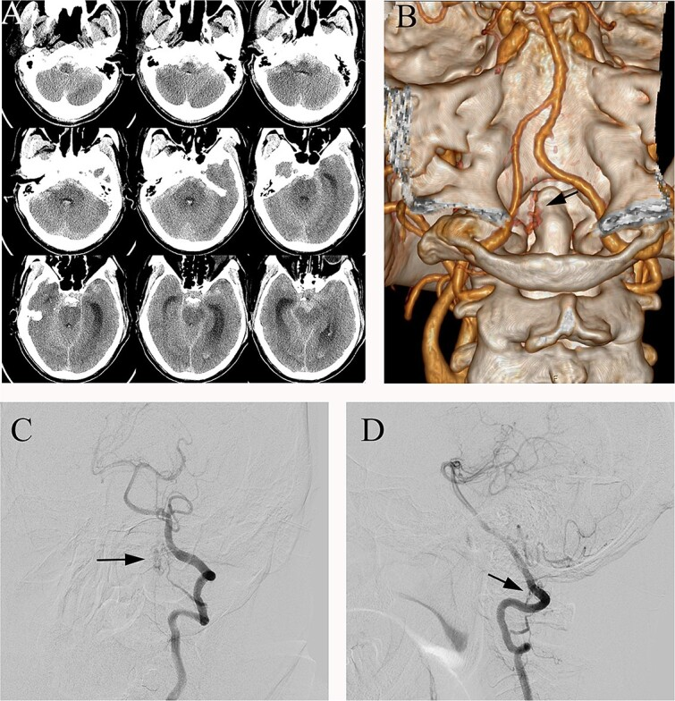
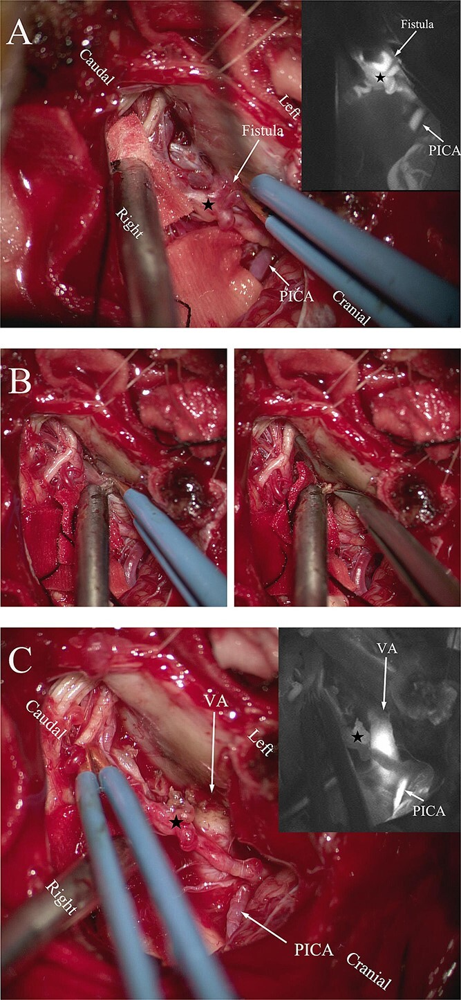
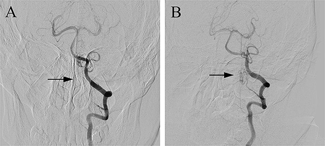
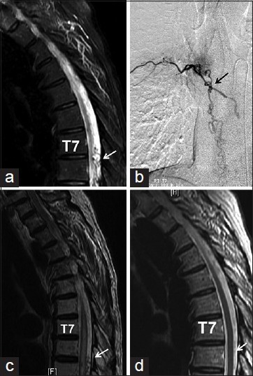
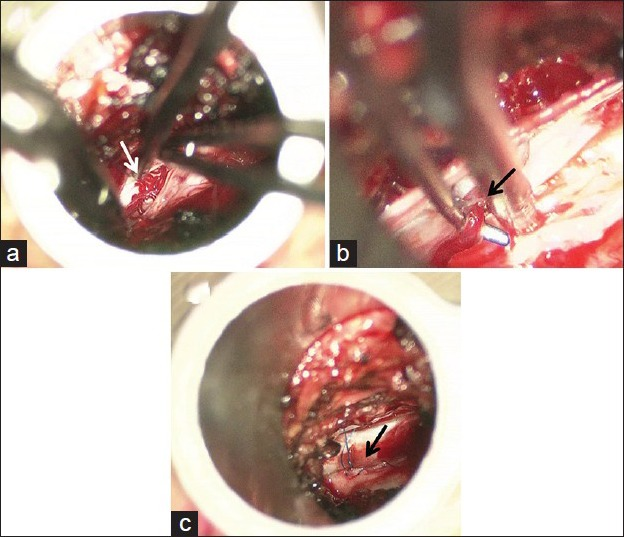
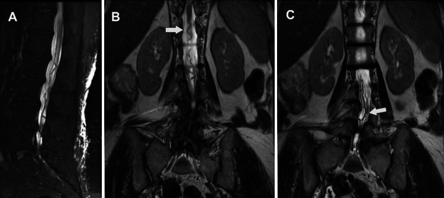
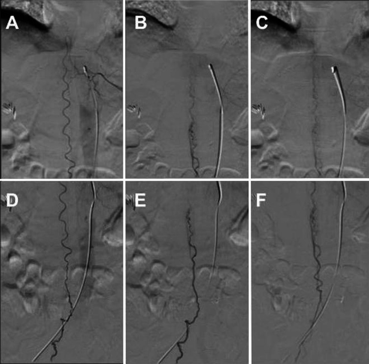
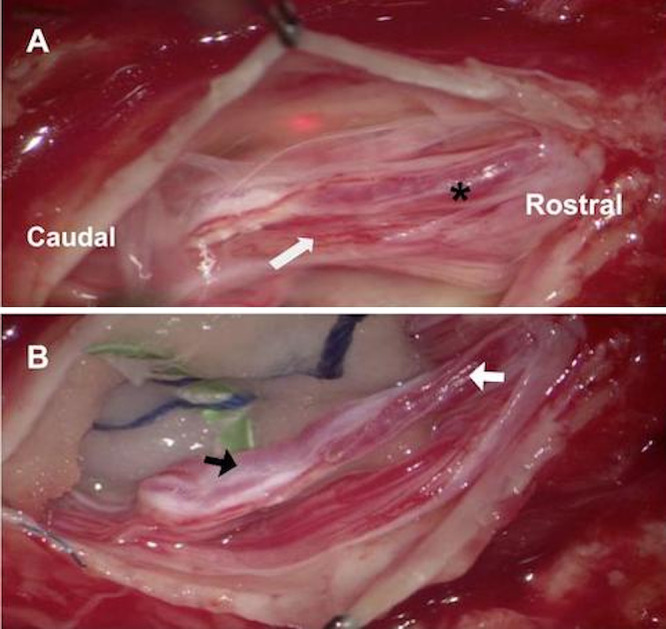
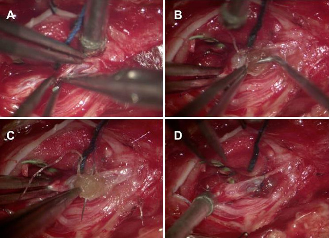
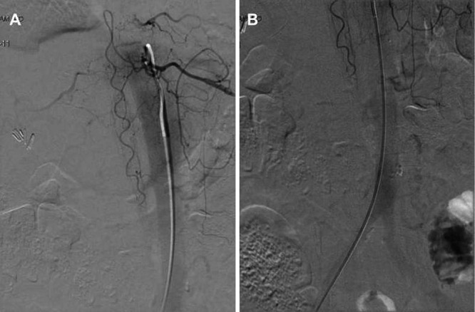

# Case Prep: Spinal Dural Arteriovenous Fistula (dAVF) — Surgical Ligation

---

<!-- BEGIN CASE SNAPSHOT -->

## Case / Approach Snapshot

- **Anatomy at risk:** cord, roots, dura, posterior elements, segmental and radiculomedullary arteries, venous plexus, and level-specific bony landmarks.
- **Operative steps:** localize the level, expose while preserving stability, obtain proximal/distal vascular control when relevant, decompress or disconnect/reconstruct the lesion, confirm flow/decompression, and close with CSF-leak prevention; use the detailed operative sequence and approach notes below as the step-by-step source.
- **Rescue plans:** neuromonitoring change, bleeding from epidural/foraminal vessels, durotomy, wrong-level exposure, cord swelling/ischemia, instability, and staged/endovascular adjuncts.
- **Figures:** review [Figures, Imaging & Video](#figures-imaging--video) and the [Curated Image Set](#curated-image-set); embedded local figures should remain open-access, public-domain, or otherwise reusable with attribution.
- **Papers:** review [High-Yield Literature](#high-yield-literature) for seminal sources, modern reviews, and outcome data specific to this page.
- **Textbook cross-checks:** use [Textbook Cross-Checks](#textbook-cross-checks) and the [Source Crosswalk](../../resources/source-crosswalk.md) to cite copyrighted textbooks/atlases while summarizing in original words.

<!-- END CASE SNAPSHOT -->

## One-Liner
[Age]yo [M/F] with a [thoracic/lumbar] spinal dural arteriovenous fistula (Type I) at [level] presenting with **progressive myelopathy / gait decline / bowel-bladder dysfunction** planned for [level] laminectomy for microsurgical disconnection of the fistula [or note endovascular embolization].

---

## Figures, Imaging & Video

**🎥 Operative video** — [search operative video on YouTube ▸](https://www.youtube.com/results?search_query=spinal+dural+arteriovenous+fistula+surgery) · [The Neurosurgical Atlas ▸](https://www.neurosurgicalatlas.com)

[Neurosurgical Atlas](https://www.neurosurgicalatlas.com) · [neuroangio.org](https://neuroangio.org) · [Radiopaedia](https://radiopaedia.org/search?q=spinal%20dural%20arteriovenous%20fistula&scope=all) · [PubMed Central](https://www.ncbi.nlm.nih.gov/pmc/?term=spinal+dural+arteriovenous+fistula) — operative figures © linked; see [media-sources.md](../../resources/media-sources.md)

---

<!-- BEGIN TEXTBOOK CROSS-CHECKS -->

## Textbook Cross-Checks

- **Vascular anatomy:** Rhoton Cranial Anatomy; Decision Making in Neurovascular Disease; Practical Neuroangiography — confirm parent-vessel anatomy, perforators, venous drainage, collateral pathways, and endovascular access/rescue options.
- **Operative/endovascular strategy:** Youmans and Winn; Schmidek and Sweet; Greenberg — summarize proximal control, exposure/device strategy, temporary-control options, and bailout plans in your own words.
- **Complication rescue:** Greenberg; Decision Making in Neurovascular Disease — review ischemia, hemorrhage, thromboembolism, rupture, vasospasm, and postoperative surveillance algorithms.
- **Copyright-safe use:** cite these sources as private cross-checks, then write the guide content in original words; do not re-host textbook pages, figures, tables, or board-review card material. See [Source Crosswalk & Copyright-Safe Use](../../resources/source-crosswalk.md).

<!-- END TEXTBOOK CROSS-CHECKS -->

<!-- BEGIN CURATED LITERATURE -->

## High-Yield Literature

- **Surgical ligation of spinal dural arteriovenous fistula** — Sorenson T. Acta neurochirurgica 2018. [PubMed](https://pubmed.ncbi.nlm.nih.gov/29138973/)
- **Craniocervivcal Spinal Dural Arteriovenous Fistula Ligation via a Modified Suboccipital Craniectomy and C1 Laminectomy: Operative Video** — Young M. World neurosurgery 2023. [PubMed](https://pubmed.ncbi.nlm.nih.gov/37516142/)
- **Microsurgical Ligation of a Dural Arteriovenous Fistula of the Petrous Apex-A 2-Dimensional Operative Video** — Aldea S. World neurosurgery 2022. [PubMed](https://pubmed.ncbi.nlm.nih.gov/35101613/)
- **Spinal dural arteriovenous fistulas presenting as intracranial subarachnoid hemorrhage: A systematic review** — Nolan B. Interventional neuroradiology : journal of peritherapeutic neuroradiology, surgical procedures and related neurosciences 2025. [PubMed](https://pubmed.ncbi.nlm.nih.gov/40660916/)
- **Microsurgery of Spinal Dural Arteriovenous Fistula Using Indocyanine Green Video Angiography: 2-Dimensional Operative Video** — Yokoyama K. Operative neurosurgery (Hagerstown, Md.) 2019. [PubMed](https://pubmed.ncbi.nlm.nih.gov/30295889/)
- **Open surgical ligation of a thoracic spinal epidural arteriovenous fistula causing thoracic myelopathy: illustrative case** — Laing BRW. Journal of neurosurgery. Case lessons 2023. [PubMed](https://pubmed.ncbi.nlm.nih.gov/37581597/)
- **Spinal dural arteriovenous fistula: a case series and review of imaging findings** — Fox S. Spinal cord series and cases 2017. [PubMed](https://pubmed.ncbi.nlm.nih.gov/28690870/)
- **Spinal dural arteriovenous fistula formation after scoliosis surgery: case report** — Elswick CM. Journal of neurosurgery. Spine 2020. [PubMed](https://pubmed.ncbi.nlm.nih.gov/31629319/)
- **Minimally invasive intradural spinal dural arteriovenous fistula ligation** — Patel NP. World neurosurgery 2013. [PubMed](https://pubmed.ncbi.nlm.nih.gov/22484771/)
- **Ruptured spinal dural arteriovenous fistula with subdural hematoma: A case report** — Williamson LE. Surgical neurology international 2025. [PubMed](https://pubmed.ncbi.nlm.nih.gov/41625103/)

<!-- END CURATED LITERATURE -->

---

<!-- BEGIN CURATED IMAGE SET -->

## Curated Image Set

Open-access figures are embedded from PubMed Central articles and kept unique to this guide.

*Figure 1. (A) Preoperative head CT, (B) CTA and (C, D) DSA identified the fistula (arrows) in the left lateral dural membrane and confirmed the intradural origin of the drainage vein. Source: [Microsurgical treatment of spinal dural arteriovenous fistula with subarachnoid hemorrhage: a case report](https://pmc.ncbi.nlm.nih.gov/articles/PMC11794442/) — Journal of Surgical Case Reports 2025; CC BY-NC.*

*Figure 2. (A) Intraoperative ICG fluorescence imaging demonstrated that the fistula and abnormal drainage vein (asterisk) developed earlier than the posterior inferior cerebellar artery (PICA).... Source: [Microsurgical treatment of spinal dural arteriovenous fistula with subarachnoid hemorrhage: a case report](https://pmc.ncbi.nlm.nih.gov/articles/PMC11794442/) — Journal of Surgical Case Reports 2025; CC BY-NC.*

*Figure 3. Postoperative DSA (A) confirmed the complete occlusion of the fistula (arrow) when compared with the preoperative DSA (B). Source: [Microsurgical treatment of spinal dural arteriovenous fistula with subarachnoid hemorrhage: a case report](https://pmc.ncbi.nlm.nih.gov/articles/PMC11794442/) — Journal of Surgical Case Reports 2025; CC BY-NC.*

*Figure 1. (a) Preoperative T2 magnetic resonance imaging (MRI) of patient 1 showing the serpiginous veins surrounding the thoracic spinal cord most prominent at T7/8 level (arrowed), secondary to... Source: [Minimal access microsurgical ligation of spinal dural arteriovenous fistula with tubular retractor](https://pmc.ncbi.nlm.nih.gov/articles/PMC4466787/) — Surgical Neurology International 2015; CC BY-NC-SA.*

*Figure 2. (a) Operative view through the tubular retractor under a surgical microscope, showing dilated serpiginous veins (arrowed) after opening the dura. (b) Dissection of the fistulous point of... Source: [Minimal access microsurgical ligation of spinal dural arteriovenous fistula with tubular retractor](https://pmc.ncbi.nlm.nih.gov/articles/PMC4466787/) — Surgical Neurology International 2015; CC BY-NC-SA.*

*FIG. 1. Sagittal (A) and coronal (B and C) T2-weighted MRI showing abnormal serpentine vasculature at the level of the lumbar cistern (white arrows). Source: [Microsurgical intraluminal obliteration of type IV perimedullary arteriovenous fistula with an in situ hemostatic agent: illustrative case](https://pmc.ncbi.nlm.nih.gov/articles/PMC10566519/) — Journal of Neurosurgery: Case Lessons 2023; CC BY-NC-ND.*

*FIG. 2. Diagnostic angiography showing a type IV perimedullary arteriovenous fistula of the distal anterior spinal artery of Adamkiewicz. The flow traveled sequentially from the artery of... Source: [Microsurgical intraluminal obliteration of type IV perimedullary arteriovenous fistula with an in situ hemostatic agent: illustrative case](https://pmc.ncbi.nlm.nih.gov/articles/PMC10566519/) — Journal of Neurosurgery: Case Lessons 2023; CC BY-NC-ND.*

*FIG. 3. A: White arrow indicates nerve roots tightly attached to the fistulous vessel (asterisk). B: Black arrow indicates an arterialized vessel with caudal flow. White arrow indicates an... Source: [Microsurgical intraluminal obliteration of type IV perimedullary arteriovenous fistula with an in situ hemostatic agent: illustrative case](https://pmc.ncbi.nlm.nih.gov/articles/PMC10566519/) — Journal of Neurosurgery: Case Lessons 2023; CC BY-NC-ND.*

*FIG. 4. Vessel obliteration. A: The assistant uses forceps for proximal and distal control during arteriotomy. B: Packing with the hemostatic agent in the lumen of the artery. C: Securing the... Source: [Microsurgical intraluminal obliteration of type IV perimedullary arteriovenous fistula with an in situ hemostatic agent: illustrative case](https://pmc.ncbi.nlm.nih.gov/articles/PMC10566519/) — Journal of Neurosurgery: Case Lessons 2023; CC BY-NC-ND.*

*FIG. 5. A and B: Postoperative angiography shows the resolution and obliteration of type IV perimedullary arteriovenous fistula. Source: [Microsurgical intraluminal obliteration of type IV perimedullary arteriovenous fistula with an in situ hemostatic agent: illustrative case](https://pmc.ncbi.nlm.nih.gov/articles/PMC10566519/) — Journal of Neurosurgery: Case Lessons 2023; CC BY-NC-ND.*

<!-- END CURATED IMAGE SET -->

---

## History of Present Illness
- Chief complaint: **Progressive ascending myelopathy** — gait difficulty, lower extremity weakness/numbness, bowel/bladder dysfunction, erectile dysfunction
- **Classic:** older male, insidious, stepwise/progressive, worse with activity/standing (venous congestion) — **Foix-Alajouanine syndrome** (subacute necrotic myelopathy) if advanced/untreated
- Often **misdiagnosed/delayed** (mimics degenerative myelopathy, demyelination, tumor)
- Symptom duration (longer/more severe = less reversible)

---

## Past Medical History
- Prior spinal imaging/misdiagnoses, prior intervention
- Anticoagulant/antiplatelet
- Standard PMH

---

## Imaging Review
### MRI Spine (T2, T1±Gad)
- **Cord T2 hyperintensity** (central, longitudinally extensive — venous congestion/edema), cord expansion
- **Flow voids** (dilated perimedullary veins) on dorsal cord surface (T2) — hallmark
- Enhancement of cord (chronic venous hypertension)
### Spinal DSA (gold standard)
- **Identify the fistula level and feeding radicular artery** (dural branch of a segmental/radicular artery feeds an intradural radicular vein at the nerve root sleeve)
- Map the arterial feeder, the draining vein, exclude additional fistulas
- **Critically identify the artery of Adamkiewicz** and spinal cord arterial supply (must NOT be the feeder being sacrificed)
- Differentiate Type I dAVF from intramedullary AVM (perimedullary fistula, glomus AVM)

---

## Labs
- CBC, BMP, Coags, type and screen

---

## Neurological Examination
- **Detailed motor/sensory (sensory level), reflexes, gait, bowel/bladder, sphincter tone** — document baseline (recovery depends on pre-op severity/duration)
- Aminoff-Logue scale (gait/micturition disability)

---

## Surgical Planning

### Diagnosis & Indication
- Working diagnosis: Spinal dural AVF (Type I), the most common spinal vascular malformation
- Indication: Symptomatic dAVF — **disconnect to halt/reverse venous congestion** (early treatment → better recovery)
- **Treatment options:** Microsurgical disconnection (durable, high cure rate) vs endovascular embolization (Onyx/glue — less durable if feeder also supplies cord; surgery preferred if embolization risky or fails)

### Position
- **Prone**, Mayfield/foam, chest rolls, abdomen free, reverse Trendelenburg; IONM baseline
- Level localization (fluoroscopy) — fistula level confirmed from DSA

### Approach: Laminectomy / Hemilaminectomy at the Fistula Level
### Key Surgical Steps
1. Fluoroscopic localization of the **exact fistula level** (from DSA — the radicular feeder enters at a specific nerve root sleeve)
2. Midline incision, laminectomy (or hemilaminectomy) at the fistula level (± adjacent)
3. Open dura in the midline, tack up; **identify the arterialized (red), tortuous draining vein** on the dorsal cord surface at the nerve root sleeve (arterialized vein is the giveaway — should be blue, but is red/engorged)
4. Trace the fistula to the **intradural draining vein at the dural root sleeve** where the dural feeder connects
5. **Temporary clip** the draining vein → confirm with ICG/inspection that the arterialized vein darkens (deflates/becomes blue) — confirms correct fistula and that this is the draining vein, not a normal cord vein
6. **Coagulate and divide the intradural draining vein** at the point it exits the dura (the fistulous connection) — definitive disconnection
7. Confirm with **ICG videoangiography** — no further early venous filling
8. Watertight dural closure, sealant, closure

### Critical Anatomy & Structures at Risk
1. **Anterior spinal artery / artery of Adamkiewicz** — must NOT be sacrificed (would cause cord infarction); DSA confirms feeder is dural, not the radiculomedullary artery
2. **Normal cord draining veins** — disconnect only the fistulous vein (temporary clip test confirms)
3. **Spinal cord** (already congested/fragile), nerve roots
4. Dura (CSF leak)

### Equipment
- Microscope, **ICG videoangiography**, micro-instruments, temporary aneurysm clips, fine bipolar
- Fluoroscopy (localization), dural substitute, sealant
- Intraoperative DSA capability (selected)

### Monitoring
- SSEPs, MEPs

### Anesthesia
- MAP support (cord perfusion), arterial line, prone precautions, no paralytic (IONM)

### Potential Complications
1. **Failure to disconnect / wrong vein / recurrence** (incomplete or wrong level — DSA correlation and ICG/temporary clip test prevent)
2. **Cord infarction** (if a radiculomedullary artery mistaken for the dural feeder)
3. CSF leak, worsened myelopathy, no improvement (advanced/chronic disease)
4. Persistent venous hypertension if additional fistula missed

---

## Operative Note Template
**Preoperative Diagnosis:** Spinal dural arteriovenous fistula (Type I) at [level]
**Procedure:** [Level] laminectomy and microsurgical disconnection of spinal dural AV fistula

**Surgeon / Assistant:**
**Anesthesia:** General endotracheal, no paralytic
**EBL / Fluids:**
**Adjuncts:** Microscope, ICG videoangiography, temporary aneurysm clips, fluoroscopy; SSEP/MEP; MAP support
**Implants:** Dural substitute, sealant
**Complications:** None

**Indications:** [Age]yo [M/F] with a spinal dural AV fistula (Type I) at [level] (DSA-confirmed) presenting with progressive congestive myelopathy. Microsurgical disconnection was chosen [over/after embolization]. Risks (cord infarction, no improvement if advanced) discussed.

**Description of Procedure:** After consent and time-out, general anesthesia was induced (MAP support, no paralytic) and neuromonitoring established. The patient was positioned prone and **the exact fistula level confirmed fluoroscopically per the DSA**. A laminectomy/hemilaminectomy was performed at the fistula level and a midline durotomy made under the microscope.

The **arterialized (red), tortuous draining vein** was identified on the dorsal cord surface at the dural nerve-root sleeve. A **temporary clip was applied to the draining vein and the arterialized vein confirmed to darken/deflate** (verifying the correct fistulous vein, not a normal cord vein). The **intradural draining vein was then coagulated and divided at its dural exit**, disconnecting the fistula. **ICG videoangiography confirmed obliteration** with no early venous filling. A watertight dural closure was performed with sealant.

Closure was completed in layers. The patient was transferred with MAP support and CSF-leak precautions; gradual recovery of myelopathy over months was anticipated.

---

## Postoperative Plan
- ICU/step-down, neuro checks (motor/sensory/sphincter), MAP support, CSF leak precautions
- MRI (resolution of cord edema over weeks-months), **postop DSA to confirm obliteration**
- DVT prophylaxis (mechanical), bowel/bladder management, urology if needed
- **Rehab** — gait/strength recovery is gradual and depends on pre-op severity; counsel realistic expectations
- Follow-up imaging; monitor for recurrence (recurrent symptoms → repeat DSA)
