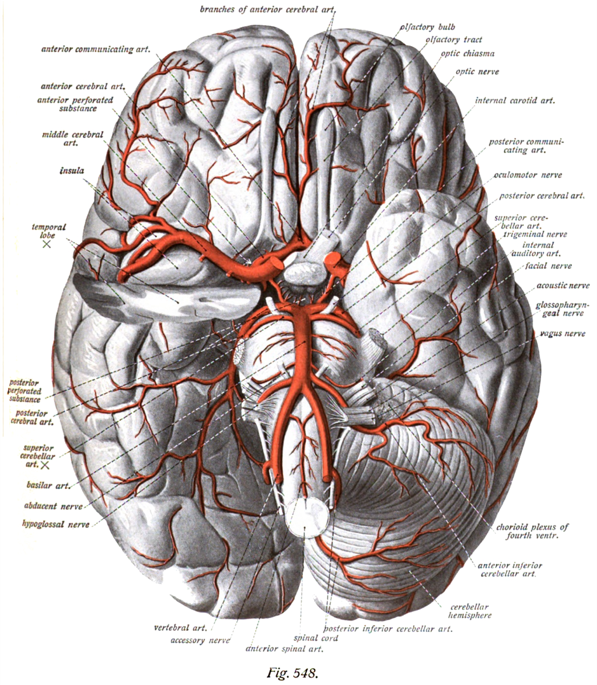

# Figures, Imaging & Video — Reputable Sources

Curated, reputable sources for **already-made** figures, diagrams, operative illustrations, imaging, and video for the case guides. Each case's **Figures, Imaging & Video** section links into these.

## How images are handled (important)
- **Linked, not copied:** Copyrighted figures (textbooks, the Neurosurgical Atlas, Rhoton collection, most journal figures) are **linked to their source**, not downloaded into this repo. Copying them here — especially on GitHub — would infringe copyright.
- **Embedded only if openly licensed:** Images that are **public domain** or **Creative Commons** (Wikimedia Commons, Gray's/Sobotta historical plates, open-access CC-BY journal figures) may be embedded directly, **with attribution + license**.
- **Attribution format for embeds:** `*Source: <work>, <author/year>. <License>. via <site> (<url>).*`

---

## Best general sources

| Source | URL | What it has | Use |
|--------|-----|-------------|-----|
| **The Neurosurgical Atlas** (Cohen-Gadol) | https://www.neurosurgicalatlas.com | Operative illustrations, surgical-anatomy figures, step-by-step + HD operative videos for most cranial/spine cases | Link (free, © — best single operative resource) |
| **Radiopaedia** | https://radiopaedia.org | Huge imaging case library + articles per pathology (CT/MR/angio) | Link / embed with attribution (CC BY-NC-SA) |
| **AO Surgery Reference** | https://surgeryreference.aofoundation.org | Superb spine & trauma technique illustrations, step-by-step | Link (free, ©) |
| **Wikimedia Commons** | https://commons.wikimedia.org | Anatomy diagrams, historical plates, some imaging | **Embeddable** (check each: PD / CC) |
| **Wikipedia** | https://en.wikipedia.org | Labeled anatomy/pathology diagrams (sourced from Commons) | Link / embed (per-image license) |
| **PubMed Central (open access)** | https://www.ncbi.nlm.nih.gov/pmc | Operative & anatomy figures in OA reviews | Link / embed CC-BY figures with attribution |
| **StatPearls (NCBI Bookshelf)** | https://www.ncbi.nlm.nih.gov/books | OA chapters with figures per topic | Link / embed (per license) |
| **neuroangio.org** (Gandhi) | https://neuroangio.org | Outstanding cerebral vascular & endovascular anatomy/angio | Link (free, ©) |
| **IMAIOS e-Anatomy** | https://www.imaios.com/en/e-anatomy | Cross-sectional & 3D neuroanatomy atlas | Link (freemium) |
| **Wheeless' Textbook of Orthopaedics** | https://www.wheelessonline.com | Spine technique/anatomy notes & figures | Link (free) |
| **Gray's Anatomy plates (public domain)** | https://en.wikipedia.org/wiki/Gray%27s_Anatomy_plates | Classic labeled anatomy plates | **Embeddable** (public domain) |

---

## By category — where to look first

- **Cranial vascular / aneurysm / AVM:** Neurosurgical Atlas (approach + clipping), neuroangio.org (vascular anatomy/angioarchitecture), Radiopaedia (CTA/DSA).
- **Cranial tumor / skull base:** Neurosurgical Atlas (approach figures + video), Radiopaedia (MRI), PMC OA reviews (approach anatomy), Rhoton anatomy (via AANS/Atlas, link).
- **Endovascular:** neuroangio.org, Radiopaedia, Journal/Operative Neurosurgery video.
- **Functional / DBS / epilepsy:** Neurosurgical Atlas, PMC, manufacturer atlases (link).
- **Spine (all):** AO Surgery Reference (technique illustrations — best), Wheeless, Radiopaedia (imaging), Neurosurgical Atlas (spine volume).
- **Peripheral nerve:** PMC OA, Wikipedia/Commons (nerve course diagrams), orthopaedic atlases.
- **Pediatric:** Neurosurgical Atlas, PMC OA, Radiopaedia.
- **Neuroanatomy (any):** Wikimedia Commons / Gray's plates (embeddable), IMAIOS, Rhoton (link).

---

## Example of an embeddable public-domain figure
Circle of Willis (relevant to anterior-circulation aneurysm cases):

*Source: Sobotta's Atlas and Text-book of Human Anatomy, 1909 (public domain, by age). via Wikimedia Commons (https://commons.wikimedia.org/wiki/File:Sobo_1909_3_548.png).*

---

> Study schematics/imaging only — verify against primary sources. See [../DISCLAIMER.md](../DISCLAIMER.md). Respect each source's license; do not re-host copyrighted figures.
